# Eino-01-Schema模块-时序图

本文档通过时序图展示 Schema 模块在典型场景下的调用流程和数据流转。

---

## 1. 消息处理时序

### 1.1 创建和格式化消息

#### 1.1.1 基本消息创建流程

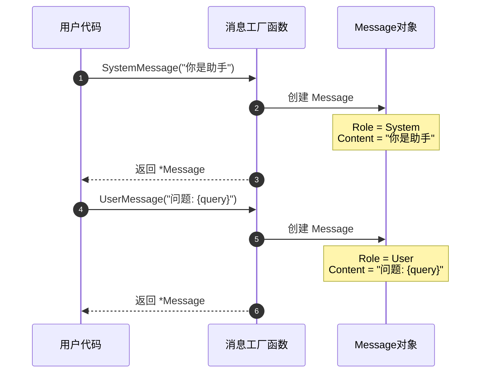

**流程说明**:
1. 用户调用工厂函数（SystemMessage、UserMessage 等）
2. 工厂函数内部创建 Message 结构体
3. 设置对应的 Role 和 Content
4. 返回 Message 指针

**关键点**:
- 工厂函数不做复杂逻辑，仅创建结构体
- Content 可以包含模板变量（如 `{query}`）
- 创建的 Message 是不可变的（按惯例）

---

#### 1.1.2 消息模板渲染流程

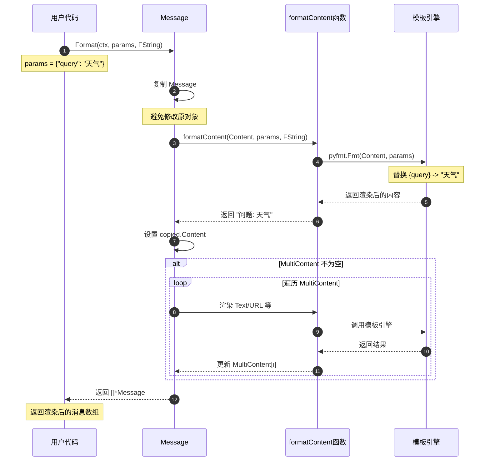

**流程说明**:
1. 用户调用 Message.Format() 传入参数和模板类型
2. Message 创建自身的副本（避免修改原对象）
3. 调用 formatContent 渲染 Content 字段
4. 根据 FormatType 选择模板引擎（pyfmt/template/gonja）
5. 模板引擎替换变量
6. 如果有 MultiContent，遍历渲染每个 Part
7. 返回渲染后的新 Message

**关键点**:
- Format 不修改原 Message
- 支持三种模板格式：FString/GoTemplate/Jinja2
- MultiContent 中的 Text 和 URL 字段都会被渲染

---

### 1.2 流式消息拼接

#### 1.2.1 接收和拼接流式消息

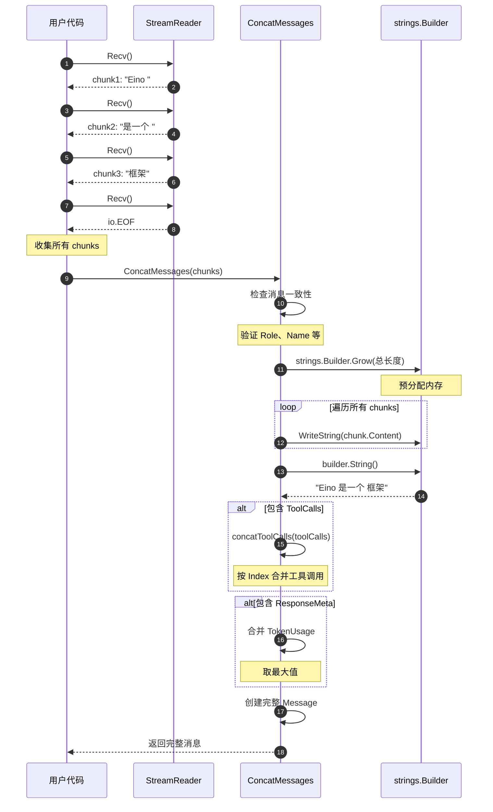

**流程说明**:
1. 用户循环调用 StreamReader.Recv() 接收消息块
2. 遇到 io.EOF 表示流结束
3. 调用 ConcatMessages 拼接所有块
4. 检查消息一致性（Role、Name 必须相同）
5. 使用 strings.Builder 高效拼接 Content
6. 合并 ToolCalls（按 Index 分组）
7. 合并 ResponseMeta（取最大值）
8. 返回完整的 Message

**性能优化**:
- strings.Builder.Grow() 预分配内存，避免多次重新分配
- 时间复杂度：O(n)，n 为总字符数
- 空间复杂度：O(n)

**边界条件**:
- 所有消息的 Role 必须相同
- 所有消息的 Name 必须相同（如果有）
- nil 消息会返回错误

---

#### 1.2.2 工具调用拼接流程

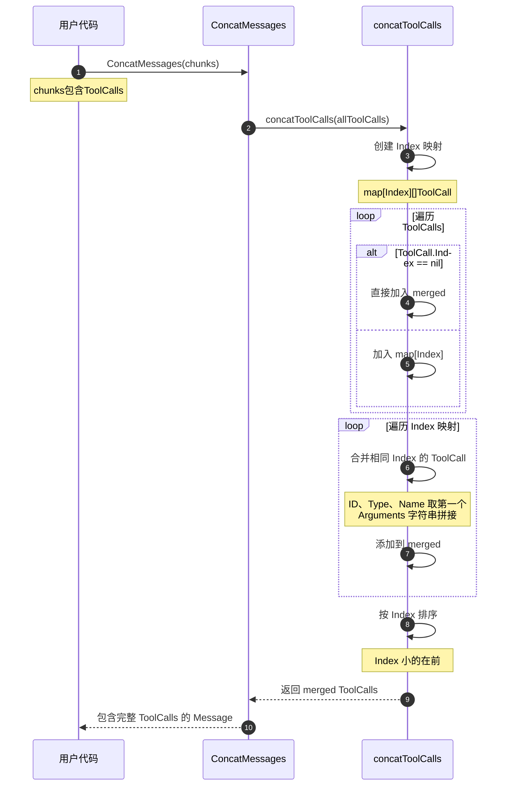

**流程说明**:
1. 提取所有 ToolCalls
2. 按 Index 分组（nil 的直接加入结果）
3. 相同 Index 的 ToolCall 合并：
   - ID、Type、Name 取第一个非空值
   - Arguments 字符串拼接
4. 按 Index 排序
5. 返回合并后的 ToolCalls

**关键点**:
- Index 用于流式模式下的 chunk 合并
- Arguments 是 JSON 字符串，直接拼接即可
- ID、Type、Name 应该在同一 Index 的所有 chunk 中一致

---

## 2. 流处理时序

### 2.1 创建和使用流

#### 2.1.1 Pipe 创建流

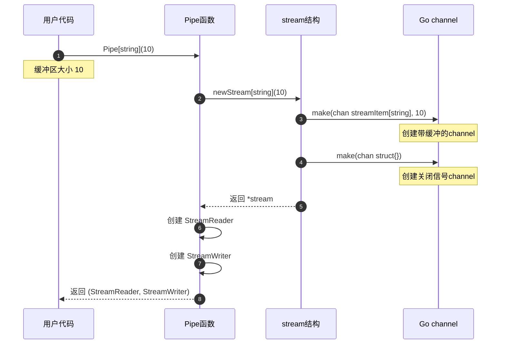

**流程说明**:
1. 用户调用 Pipe[T](cap) 创建流
2. 内部创建 stream 结构
3. 创建两个 channel：
   - items: 数据通道（带缓冲）
   - closed: 关闭信号通道
4. 包装为 StreamReader 和 StreamWriter
5. 返回给用户

**关键点**:
- items channel 的缓冲区大小影响性能
- closed channel 用于接收端通知发送端停止

---

#### 2.1.2 发送和接收数据

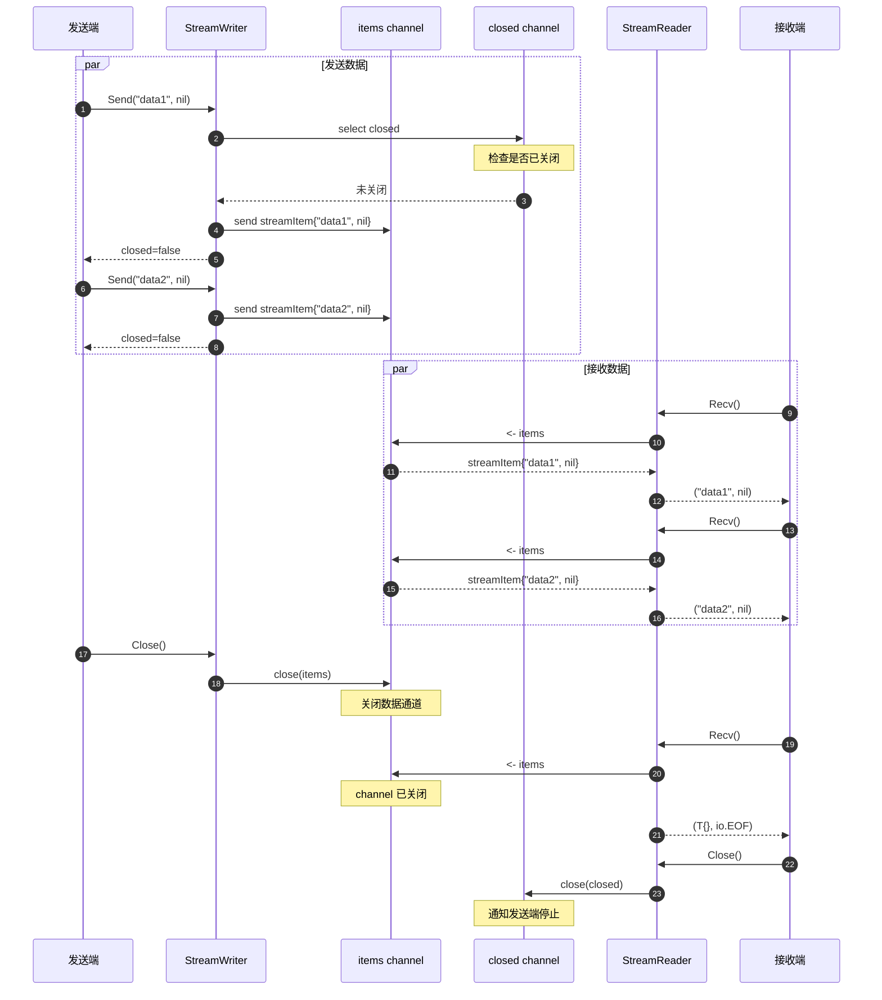

**流程说明**:
1. 发送端循环调用 Send()
2. Send() 先检查 closed channel（接收端是否关闭）
3. 如果未关闭，发送数据到 items channel
4. 接收端循环调用 Recv()
5. Recv() 从 items channel 读取数据
6. 发送端完成后调用 Close()，关闭 items channel
7. 接收端收到 io.EOF
8. 接收端调用 Close()，关闭 closed channel

**关键点**:
- 发送和接收可以并发进行
- 发送端必须 Close() 通知结束
- 接收端 Close() 可以提前通知发送端停止

---

### 2.2 流的复制

#### 2.2.1 Copy 创建子流

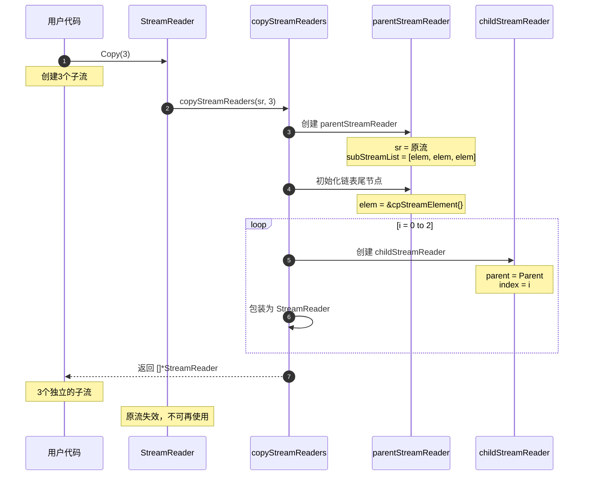

**流程说明**:
1. 用户调用 StreamReader.Copy(n)
2. 创建 parentStreamReader 持有原流
3. 初始化 subStreamList（链表尾节点）
4. 创建 n 个 childStreamReader，每个持有：
   - parent 引用
   - 自己的 index
5. 原流失效

**内存结构**:
```
parentStreamReader
  ├─ sr: 原 StreamReader
  └─ subStreamList: [elem0, elem0, elem0]  (初始都指向同一尾节点)

3 个 childStreamReader:
  - child0: parent=Parent, index=0
  - child1: parent=Parent, index=1
  - child2: parent=Parent, index=2
```

---

#### 2.2.2 子流读取数据（懒加载）

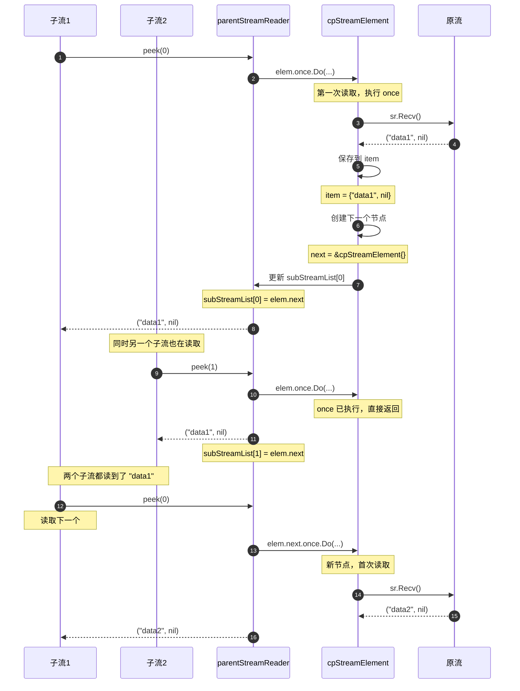

**流程说明**:
1. 子流调用 parent.peek(index)
2. parent 获取 subStreamList[index] 指向的节点
3. 使用 sync.Once 确保节点只从原流读取一次
4. 首次读取时：
   - 从原流 Recv()
   - 保存数据到 item
   - 创建下一个节点（next）
   - 更新 subStreamList[index] 指向 next
5. 后续子流读取同一节点时，直接返回 item

**关键点**:
- sync.Once 确保原流只读取一次
- 每个子流独立维护读取位置
- 数据通过链表共享，不复制

---

### 2.3 流的合并

#### 2.3.1 MergeStreamReaders 合并流程

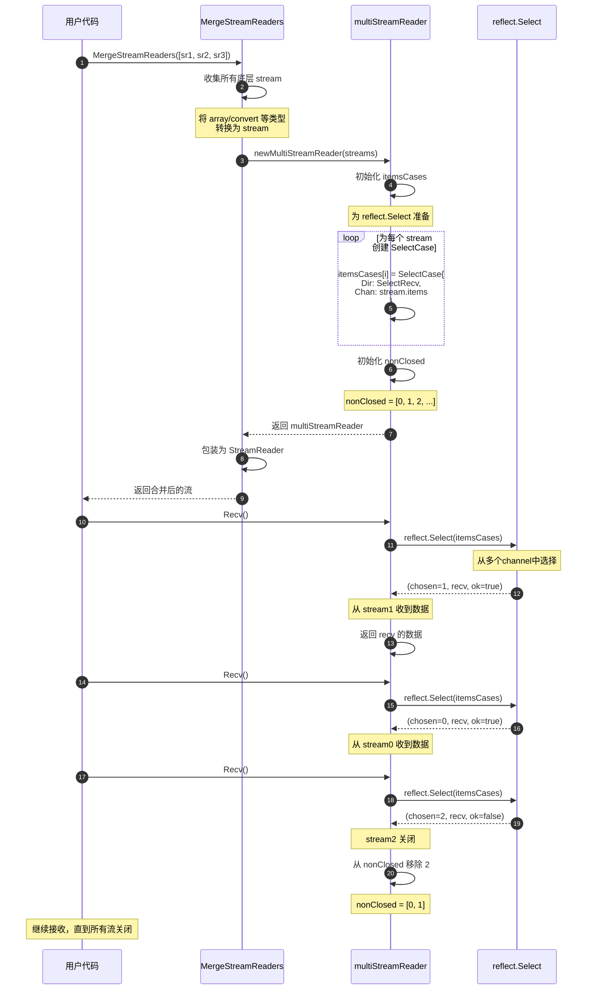

**流程说明**:
1. 用户传入多个 StreamReader
2. 提取所有底层 stream
3. 为每个 stream 创建 reflect.SelectCase
4. 使用 reflect.Select 从多个 channel 读取
5. 哪个 channel 有数据就返回哪个
6. 某个 channel 关闭时，从 nonClosed 列表移除
7. 所有 channel 关闭时返回 io.EOF

**性能特征**:
- 数据顺序不确定（哪个先到返回哪个）
- 流数量 ≤ 10 时使用优化版本（非 reflect）
- 流数量 > 10 时使用 reflect.Select

---

## 3. 工具调用时序

### 3.1 工具定义和调用

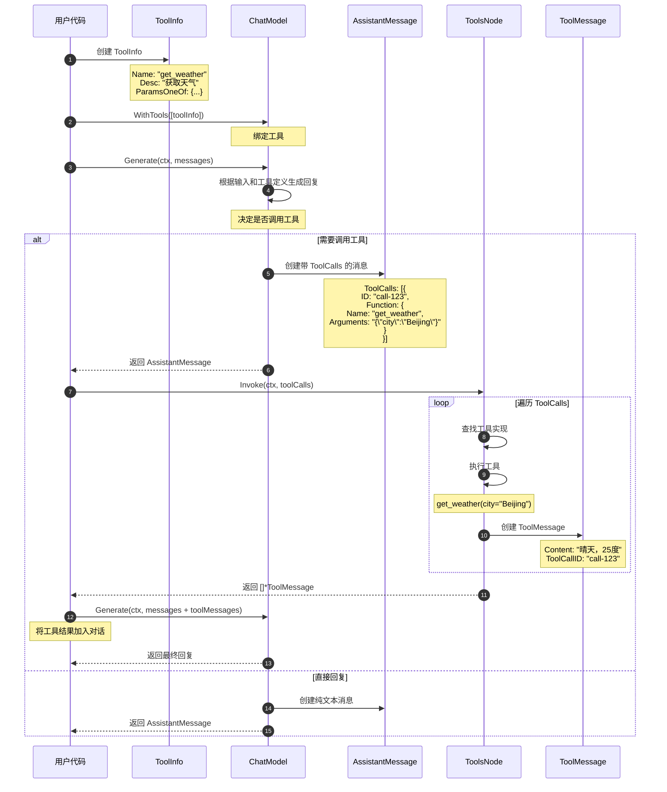

**流程说明**:
1. 用户创建 ToolInfo 定义工具
2. 通过 WithTools() 绑定到 ChatModel
3. ChatModel 根据输入决定是否调用工具
4. 如果需要调用：
   - 返回包含 ToolCalls 的 AssistantMessage
   - 用户执行工具（通过 ToolsNode）
   - 创建 ToolMessage 包含执行结果
   - 将 ToolMessage 加入对话继续
5. 如果不需要调用：
   - 直接返回文本回复

**关键点**:
- ToolCallID 关联 ToolCall 和 ToolMessage
- Arguments 是 JSON 字符串格式
- 工具结果需要再次传给 ChatModel

---

## 4. 模板渲染时序

### 4.1 多模板格式渲染

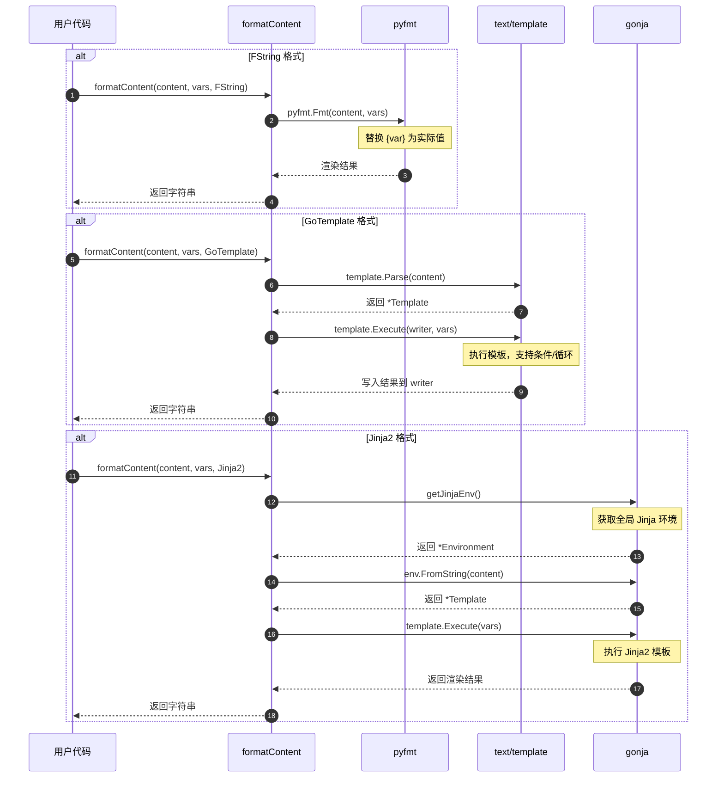

**流程说明**:
1. 根据 FormatType 选择模板引擎
2. FString: 使用 pyfmt 库，Python 风格
3. GoTemplate: 使用 Go 标准库
4. Jinja2: 使用 gonja 库，兼容 LangChain
5. 返回渲染后的字符串

**性能对比**:
- FString: 最快（简单替换）
- GoTemplate: 中等（需要解析和执行）
- Jinja2: 最慢（功能最强大）

---

## 5. 完整 RAG 场景时序

### 5.1 检索增强生成完整流程

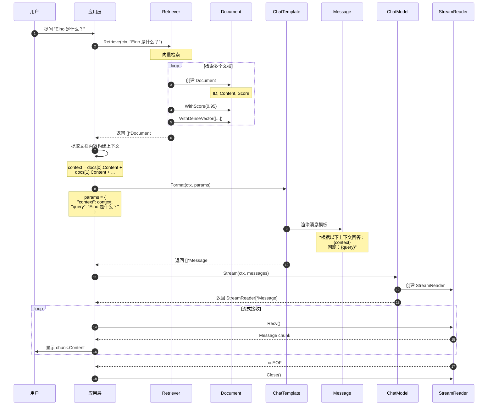

**流程说明**:
1. 用户提问
2. Retriever 向量检索相关文档
3. 提取文档内容构建上下文
4. 使用 ChatTemplate 渲染提示词
5. 调用 ChatModel 流式生成回复
6. 逐个接收并显示消息块
7. 关闭流

**涉及的数据结构**:
- Document: 存储检索结果
- Message: 构建对话上下文
- StreamReader[*Message]: 流式接收回复

---

**文档版本**: v1.0  
**最后更新**: 2024-12-19  
**适用 Eino 版本**: main 分支（最新版本）

