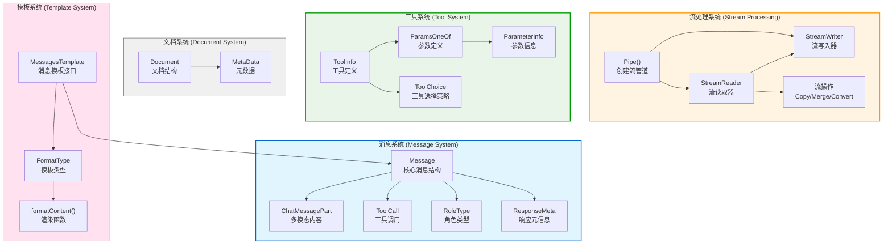

# Eino-01-Schema模块-概览

## 1. 模块职责与边界

### 1.1 核心职责

Schema 模块是 Eino 框架的基础设施层核心模块，定义了 LLM 应用中所有基础数据结构和机制。其主要职责包括：

1. **消息定义**: 定义 LLM 交互的消息格式（Message），支持文本、多模态内容、工具调用等
2. **流处理机制**: 提供完整的流式数据处理能力（StreamReader/StreamWriter）
3. **工具定义**: 定义工具（Tool）的参数结构和调用规范（ToolInfo）
4. **文档定义**: 定义文档结构（Document），用于 RAG 等场景
5. **消息模板**: 支持多种模板格式（FString、Go Template、Jinja2）的消息渲染
6. **流操作**: 提供流的拼接、复制、合并、转换等操作

### 1.2 输入与输出

**输入**：
- 原始文本字符串（用于创建 Message）
- 模板字符串和参数（用于渲染消息）
- 数组数据（转换为 StreamReader）
- 其他 StreamReader（用于合并、复制、转换）

**输出**：
- Message 对象（表示一条消息）
- StreamReader 对象（表示消息或数据的流）
- Tool小程序Info 对象（表示工具定义）
- Document 对象（表示文档）

### 1.3 上下游依赖

**上游依赖**：
- 无直接依赖其他 Eino 模块
- 依赖 Go 标准库和第三方库：
  - `text/template`: Go 模板支持
  - `github.com/nikolalohinski/gonja`: Jinja2 模板支持
  - `github.com/slongfield/pyfmt`: Python 格式字符串支持
  - `github.com/getkin/kin-openapi`: OpenAPI 规范支持
  - `github.com/eino-contrib/jsonschema`: JSON Schema 支持

**下游使用者**：
- Components 模块：ChatModel、Tool、Retriever 等组件使用 Message、Document 等数据结构
- Compose 模块：编排器使用 StreamReader 进行流式处理和类型转换
- ADK 模块：智能体使用 Message 进行对话和工具调用
- Flow 模块：预制流程使用 Message 和 Document

### 1.4 生命周期

Schema 模块的数据结构生命周期：

1. **Message 生命周期**：
   - 创建: 通过工厂函数（SystemMessage、UserMessage 等）创建
   - 传递: 在组件间传递，作为 LLM 的输入输出
   - 拼接: 流式消息通过 ConcatMessages 拼接为完整消息
   - 释放: 由 Go GC 自动回收

2. **StreamReader 生命周期**：
   - 创建: 通过 Pipe、StreamReaderFromArray 等函数创建
   - 读取: 通过 Recv() 方法逐个读取数据
   - 关闭: **必须调用 Close()** 释放资源，否则可能导致 goroutine 泄漏
   - 释放: 调用 Close() 后由 Go GC 回收

3. **ToolInfo 生命周期**：
   - 创建: 构造 ToolInfo 结构体
   - 绑定: 通过 ChatModel.WithTools() 或 BindTools() 绑定到模型
   - 使用: LLM 根据 ToolInfo 生成工具调用
   - 释放: 由 Go GC 自动回收

---

## 2. 模块架构图

### 2.1 整体架构



### 2.2 架构图说明

#### 2.2.1 消息系统

**核心结构 Message**：
```go
// Message 是 LLM 交互的核心消息结构
type Message struct {
    Role             RoleType          // 角色: system/user/assistant/tool
    Content          string            // 文本内容
    MultiContent     []ChatMessagePart // 多模态内容
    Name             string            // 可选的名称标识
    ToolCalls        []ToolCall        // 助手返回的工具调用列表
    ToolCallID       string            // 工具消息的调用ID
    ToolName         string            // 工具名称
    ResponseMeta     *ResponseMeta     // 响应元信息
    ReasoningContent string            // 推理过程内容
    Extra            map[string]any    // 扩展字段
}
```

**角色类型**：
- `System`: 系统消息，通常用于设置角色和规则
- `User`: 用户消息，表示用户的输入
- `Assistant`: 助手消息，表示 LLM 的回复
- `Tool`: 工具消息，表示工具执行的结果

**工具调用 ToolCall**：
```go
type ToolCall struct {
    Index    *int         // 索引（流式模式下用于合并）
    ID       string       // 工具调用唯一ID
    Type     string       // 类型，默认 "function"
    Function FunctionCall // 函数调用信息
    Extra    map[string]any
}

type FunctionCall struct {
    Name      string // 函数名
    Arguments string // JSON 格式的参数
}
```

**多模态内容 ChatMessagePart**：
```go
type ChatMessagePart struct {
    Type     ChatMessagePartType // text/image_url/audio_url/video_url/file_url
    Text     string              // 文本内容
    ImageURL *ChatMessageImageURL // 图片URL
    AudioURL *ChatMessageAudioURL // 音频URL
    VideoURL *ChatMessageVideoURL // 视频URL
    FileURL  *ChatMessageFileURL  // 文件URL
}
```

支持的多模态类型：
- **文本（Text）**: 纯文本内容
- **图片（ImageURL）**: 支持 URL 或 RFC-2397 格式的内嵌图片数据
- **音频（AudioURL）**: 音频文件 URL
- **视频（VideoURL）**: 视频文件 URL
- **文件（FileURL）**: 通用文件 URL

#### 2.2.2 流处理系统

**StreamReader 的多种实现类型**：
```go
type StreamReader[T any] struct {
    typ readerType  // 读取器类型
    
    st  *stream[T]              // 基础流实现
    ar  *arrayReader[T]         // 数组读取器
    msr *multiStreamReader[T]   // 多流合并读取器
    srw *streamReaderWithConvert[T] // 带转换的读取器
    csr *childStreamReader[T]   // 子流读取器（用于Copy）
}

// 读取器类型
const (
    readerTypeStream        // 基于 channel 的流
    readerTypeArray         // 基于数组的流
    readerTypeMultiStream   // 多流合并
    readerTypeWithConvert   // 带类型转换
    readerTypeChild         // Copy 产生的子流
)
```

**基础流实现**：
```go
// stream 是基于 channel 的流，1个发送者和1个接收者
type stream[T any] struct {
    items  chan streamItem[T] // 数据通道
    closed chan struct{}      // 关闭信号通道
    
    automaticClose bool       // 是否启用自动关闭（GC时）
    closedFlag     *uint32    // 关闭标志（用于自动关闭）
}

type streamItem[T any] struct {
    chunk T     // 数据块
    err   error // 错误（如果有）
}
```

**流操作**：

1. **创建流**：
   - `Pipe[T](cap)`: 创建流管道，返回 Reader 和 Writer
   - `StreamReaderFromArray[T](arr)`: 从数组创建流

2. **复制流**：
   - `StreamReader.Copy(n)`: 创建 n 个独立的读取器
   - 使用共享链表实现，避免数据复制

3. **合并流**：
   - `MergeStreamReaders(srs)`: 合并多个流为一个
   - `MergeNamedStreamReaders(namedSrs)`: 合并并保留流名称

4. **转换流**：
   - `StreamReaderWithConvert(sr, convertFunc)`: 转换流的数据类型

#### 2.2.3 工具系统

**工具定义 ToolInfo**：
```go
type ToolInfo struct {
    Name  string       // 工具名称，唯一标识
    Desc  string       // 工具描述，告诉模型何时使用
    Extra map[string]any // 扩展信息
    *ParamsOneOf       // 参数定义（可选）
}
```

**参数定义 ParamsOneOf**：

支持三种方式定义工具参数：

1. **通过 ParameterInfo**（推荐）：
```go
params := &ParameterInfo{
    Type: Object,
    SubParams: map[string]*ParameterInfo{
        "city": {
            Type:     String,
            Desc:     "城市名称",
            Required: true,
        },
        "unit": {
            Type:     String,
            Desc:     "温度单位",
            Enum:     []string{"celsius", "fahrenheit"},
            Required: false,
        },
    },
}

toolInfo := &ToolInfo{
    Name:        "get_weather",
    Desc:        "获取指定城市的天气",
    ParamsOneOf: NewParamsOneOfByParams(map[string]*ParameterInfo{
        "city": params.SubParams["city"],
        "unit": params.SubParams["unit"],
    }),
}
```

2. **通过 JSONSchema**：
```go
jsonSchema := &jsonschema.Schema{
    Type: "object",
    Properties: orderedmap.New[string, *jsonschema.Schema](),
    Required: []string{"city"},
}
jsonSchema.Properties.Set("city", &jsonschema.Schema{
    Type:        "string",
    Description: "城市名称",
})

toolInfo := &ToolInfo{
    Name:        "get_weather",
    Desc:        "获取指定城市的天气",
    ParamsOneOf: NewParamsOneOfByJSONSchema(jsonSchema),
}
```

3. **通过 OpenAPIV3 Schema**（已废弃，建议使用 JSONSchema）

**工具选择策略 ToolChoice**：
- `ToolChoiceForbidden`: 禁止调用工具
- `ToolChoiceAllowed`: 允许调用（模型自主选择）
- `ToolChoiceForced`: 强制调用

#### 2.2.4 文档系统

**文档结构 Document**：
```go
type Document struct {
    ID       string         // 文档唯一标识
    Content  string         // 文档内容
    MetaData map[string]any // 元数据
}
```

**元数据辅助方法**：

Document 提供了便捷方法来设置和获取常用元数据：

```go
// 评分相关
doc.WithScore(0.95)  // 设置相关性评分
score := doc.Score() // 获取评分

// 子索引
doc.WithSubIndexes([]string{"index1", "index2"})
indexes := doc.SubIndexes()

// 向量
doc.WithDenseVector([]float64{0.1, 0.2, 0.3})
vector := doc.DenseVector()

doc.WithSparseVector(map[int]float64{0: 0.5, 10: 0.8})
sparse := doc.SparseVector()

// 额外信息
doc.WithExtraInfo("这是一篇技术文档")
info := doc.ExtraInfo()

// DSL信息（用于查询）
doc.WithDSLInfo(map[string]any{"filter": "category:tech"})
dsl := doc.DSLInfo()
```

#### 2.2.5 模板系统

**消息模板接口**：
```go
type MessagesTemplate interface {
    Format(ctx context.Context, vs map[string]any, formatType FormatType) ([]*Message, error)
}
```

**支持的模板类型**：
- `FString`: Python 风格的格式字符串（PEP-3101）
- `GoTemplate`: Go 标准模板
- `Jinja2`: Jinja2 模板（常用于 LangChain）

**使用示例**：
```go
// 1. 单条消息模板
msg := schema.UserMessage("你好，{name}！")
formatted, _ := msg.Format(ctx, map[string]any{"name": "Eino"}, schema.FString)
// formatted[0].Content = "你好，Eino！"

// 2. 消息占位符
template := prompt.FromMessages(
    schema.SystemMessage("你是一个有帮助的助手"),
    schema.MessagesPlaceholder("history", false), // 插入历史消息
    schema.UserMessage("问题：{query}"),
)

params := map[string]any{
    "history": []*schema.Message{
        schema.UserMessage("我是谁？"),
        schema.AssistantMessage("你是用户", nil),
    },
    "query": "今天天气怎么样？",
}

messages, _ := template.Format(ctx, params, schema.FString)
```

---

## 3. 边界条件与约束

### 3.1 消息系统边界

**Role 字段约束**：
- Message 的 Role 必须是四种类型之一：system/user/assistant/tool
- 同一对话中，Role 之间有隐含的顺序关系（虽然框架不强制）
- Tool 消息必须包含 ToolCallID 字段

**内容字段约束**：
- `Content` 和 `MultiContent` 通常只使用一个
- 如果 `MultiContent` 不为空，则 `MultiContent` 优先
- `MultiContent` 用于多模态内容（图片、音频等）

**ToolCalls 字段约束**：
- 只有 Assistant 消息才应该包含 ToolCalls
- ToolCalls 的 Index 字段用于流式模式下的 chunk 合并
- ToolCalls 的 ID 必须唯一

**消息拼接约束**：
```go
// ConcatMessages 有严格的约束
func ConcatMessages(msgs []*Message) (*Message, error) {
    // 1. 所有消息的 Role 必须相同
    // 2. 所有消息的 Name 必须相同（如果有）
    // 3. 所有消息的 ToolCallID 必须相同（如果有）
    // 4. ToolCalls 通过 Index 合并，Index 相同的合并为一个
    // 5. Content 按顺序拼接
}
```

### 3.2 流处理边界

**StreamReader 使用约束**：
- **必须调用 Close()**：否则可能导致 goroutine 泄漏
- **单 goroutine 使用**：Recv() 和 Close() 不是并发安全的
- **Copy 后原流不可用**：Copy(n) 后原 StreamReader 会失效
- **EOF 表示结束**：Recv() 返回 io.EOF 表示流正常结束

**StreamWriter 使用约束**：
- **必须调用 Close()**：通知接收端流已结束
- **Send 后检查返回值**：返回 true 表示流已关闭，应停止发送
- **单 goroutine 发送**：虽然 Send 是线程安全的，但建议单个 goroutine 发送

**流的缓冲区**：
```go
// Pipe 创建的流有缓冲区限制
sr, sw := schema.Pipe[string](10) // 缓冲区大小为 10

// 发送满后会阻塞
for i := 0; i < 20; i++ {
    sw.Send(fmt.Sprintf("data-%d", i), nil) // 第11次会阻塞，直到接收端读取
}
```

**流的复制约束**：
```go
// Copy 创建独立的读取器，共享底层数据
readers := sr.Copy(3) // 创建3个独立读取器

// 原流 sr 不可再使用
// 每个 reader 可独立读取，互不影响
for i, r := range readers {
    go func(idx int, reader *StreamReader[string]) {
        defer reader.Close()
        for {
            chunk, err := reader.Recv()
            if err == io.EOF {
                break
            }
            // 处理 chunk
        }
    }(i, r)
}
```

### 3.3 工具系统边界

**参数定义约束**：
- ParameterInfo 的 Type 必须是七种数据类型之一
- Array 类型必须指定 ElemInfo
- Object 类型必须指定 SubParams
- Enum 只能用于 String 类型

**参数转换**：
```go
// ParamsOneOf 可以转换为 JSONSchema 或 OpenAPIV3
paramsOneOf := NewParamsOneOfByParams(params)

// 转换为 JSONSchema（推荐）
jsonSchema, err := paramsOneOf.ToJSONSchema()

// 转换为 OpenAPIV3（已废弃）
openAPIV3, err := paramsOneOf.ToOpenAPIV3()
```

**ToolInfo 约束**：
- Name 字段是必填的，且应该是唯一的
- Desc 字段应该清晰描述工具的用途和使用场景
- 如果工具不需要参数，ParamsOneOf 可以为 nil

### 3.4 并发安全

**线程安全的操作**：
- StreamWriter.Send() 是线程安全的
- StreamReader.Copy() 创建的多个读取器可在不同 goroutine 中使用
- Message、Document、ToolInfo 等数据结构是不可变的，读取是线程安全的

**非线程安全的操作**：
- StreamReader.Recv() 不是线程安全的，必须在单个 goroutine 中调用
- StreamReader.Close() 不是线程安全的
- Message 的字段修改不是线程安全的（但通常不会修改）

### 3.5 内存管理

**StreamReader 自动关闭**：
```go
sr := schema.Pipe[string](10)

// 启用自动关闭，GC 时自动释放资源
sr.SetAutomaticClose()

// 无需手动 Close，GC 会自动清理
// 但手动 Close 更可控
```

**消息大小限制**：
- 单条消息的 Content 建议不超过 1MB
- 超大内容应该拆分为多条消息或使用流式处理
- MultiContent 的每个 Part 也应该控制大小

---

## 4. 扩展点

### 4.1 自定义消息模板

实现 `MessagesTemplate` 接口可以自定义消息模板渲染逻辑：

```go
type MyCustomTemplate struct {
    template string
}

func (t *MyCustomTemplate) Format(ctx context.Context, vs map[string]any, formatType FormatType) ([]*Message, error) {
    // 自定义渲染逻辑
    content := renderTemplate(t.template, vs)
    return []*Message{
        schema.UserMessage(content),
    }, nil
}
```

### 4.2 自定义流转换

使用 `StreamReaderWithConvert` 可以实现自定义的流数据转换：

```go
// 将 Message 流转换为纯文本流
textStream := schema.StreamReaderWithConvert(messageStream, func(msg *schema.Message) (string, error) {
    if msg.Content == "" {
        return "", schema.ErrNoValue // 跳过空消息
    }
    return msg.Content, nil
})
```

### 4.3 自定义元数据

Document 的 MetaData 是 `map[string]any`，可以存储任意元数据：

```go
doc := &schema.Document{
    ID:      "doc-1",
    Content: "文档内容",
    MetaData: map[string]any{
        "author":     "张三",
        "created_at": time.Now(),
        "tags":       []string{"tech", "ai"},
        "custom":     myCustomData,
    },
}
```

---

## 5. 资源占用与性能特征

### 5.1 内存占用

**Message 内存占用**：
- 基础结构体约 200 bytes
- Content 字段占用与文本长度成正比
- MultiContent 每个 Part 约 100-200 bytes
- ToolCalls 每个约 150 bytes
- ResponseMeta 约 100 bytes

**StreamReader 内存占用**：
- 基础结构体约 50 bytes
- channel 缓冲区占用：cap × sizeof(streamItem)
- Copy 创建的子流共享数据，内存开销小

### 5.2 性能特征

**消息拼接性能**：
```go
// ConcatMessages 使用 strings.Builder 优化
// 时间复杂度：O(n × m)，n 为消息数，m 为平均内容长度
// 空间复杂度：O(总内容长度)

// 性能测试（参考值）：
// 1000条消息，每条100字符：约 1ms
// 10000条消息，每条100字符：约 10ms
```

**流处理性能**：
- StreamReader 基于 channel，性能接近原生 channel
- Copy 使用链表结构，内存和时间开销都很小
- Merge 使用 reflect.Select，性能随流数量增加而下降
  - ≤10 个流：性能良好
  - \>10 个流：建议分批合并

**模板渲染性能**：
- FString：最快，适合简单场景
- GoTemplate：中等，适合复杂逻辑
- Jinja2：最慢，但功能最强大

### 5.3 资源清理

**自动清理**：
```go
// 启用自动关闭
sr.SetAutomaticClose()
// GC 时自动调用 Close()
```

**手动清理**（推荐）：
```go
sr, sw := schema.Pipe[string](10)

// 发送端
go func() {
    defer sw.Close() // 确保关闭
    for _, item := range items {
        sw.Send(item, nil)
    }
}()

// 接收端
defer sr.Close() // 确保关闭
for {
    chunk, err := sr.Recv()
    if err == io.EOF {
        break
    }
    // 处理 chunk
}
```

---

## 6. 典型使用场景

### 6.1 场景 1：创建和发送消息

```go
// 创建系统消息
sysMsg := schema.SystemMessage("你是一个有帮助的AI助手")

// 创建用户消息
userMsg := schema.UserMessage("什么是 Eino 框架？")

// 创建带工具调用的助手消息
toolCalls := []schema.ToolCall{
    {
        ID:   "call-1",
        Type: "function",
        Function: schema.FunctionCall{
            Name:      "search_web",
            Arguments: `{"query":"Eino framework"}`,
        },
    },
}
assistantMsg := schema.AssistantMessage("让我搜索一下", toolCalls)

// 创建工具响应消息
toolMsg := schema.ToolMessage(
    "搜索结果：Eino 是一个 Go 语言的 LLM 应用开发框架",
    "call-1",
    schema.WithToolName("search_web"),
)
```

### 6.2 场景 2：处理流式消息

```go
// 接收流式消息并拼接
var chunks []*schema.Message
defer stream.Close()

for {
    chunk, err := stream.Recv()
    if err == io.EOF {
        break
    }
    if err != nil {
        return err
    }
    chunks = append(chunks, chunk)
}

// 拼接为完整消息
fullMessage, err := schema.ConcatMessages(chunks)
if err != nil {
    return err
}

fmt.Println(fullMessage.Content)
```

### 6.3 场景 3：创建工具定义

```go
// 定义天气查询工具
weatherTool := &schema.ToolInfo{
    Name: "get_weather",
    Desc: "获取指定城市的天气信息。当用户询问天气时使用此工具。",
    ParamsOneOf: schema.NewParamsOneOfByParams(map[string]*schema.ParameterInfo{
        "city": {
            Type:     schema.String,
            Desc:     "城市名称，例如：北京、上海",
            Required: true,
        },
        "unit": {
            Type:     schema.String,
            Desc:     "温度单位",
            Enum:     []string{"celsius", "fahrenheit"},
            Required: false,
        },
    }),
}

// 定义数学计算工具
calcTool := &schema.ToolInfo{
    Name: "calculator",
    Desc: "执行数学计算。支持加减乘除和基础数学函数。",
    ParamsOneOf: schema.NewParamsOneOfByParams(map[string]*schema.ParameterInfo{
        "expression": {
            Type:     schema.String,
            Desc:     "数学表达式，例如：1 + 2 * 3",
            Required: true,
        },
    }),
}
```

### 6.4 场景 4：使用消息模板

```go
// 使用 FString 格式
msg := schema.UserMessage("你好，{name}！今天是{date}")
formatted, _ := msg.Format(ctx, map[string]any{
    "name": "Alice",
    "date": "2024-12-19",
}, schema.FString)
// 输出：你好，Alice！今天是2024-12-19

// 使用 Jinja2 格式（支持循环、条件等）
msg2 := schema.UserMessage(`

- {{ item }}

`)
formatted2, _ := msg2.Format(ctx, map[string]any{
    "items": []string{"苹果", "香蕉", "橙子"},
}, schema.Jinja2)
```

### 6.5 场景 5：创建和使用流

```go
// 创建流管道
sr, sw := schema.Pipe[string](10)

// 发送数据
go func() {
    defer sw.Close()
    for i := 0; i < 5; i++ {
        sw.Send(fmt.Sprintf("chunk-%d", i), nil)
        time.Sleep(100 * time.Millisecond)
    }
}()

// 接收数据
defer sr.Close()
for {
    chunk, err := sr.Recv()
    if err == io.EOF {
        break
    }
    fmt.Println(chunk)
}
```

### 6.6 场景 6：合并多个流

```go
// 创建多个流
sr1, sw1 := schema.Pipe[string](5)
sr2, sw2 := schema.Pipe[string](5)
sr3, sw3 := schema.Pipe[string](5)

// 分别发送数据
go sendData(sw1, "stream1")
go sendData(sw2, "stream2")
go sendData(sw3, "stream3")

// 合并流
mergedStream := schema.MergeStreamReaders([]*schema.StreamReader[string]{
    sr1, sr2, sr3,
})

// 读取合并后的流（顺序不确定）
defer mergedStream.Close()
for {
    chunk, err := mergedStream.Recv()
    if err == io.EOF {
        break
    }
    fmt.Println(chunk)
}
```

---

## 7. 配置项

Schema 模块本身配置项较少，主要配置在使用层面：

### 7.1 流缓冲区大小

```go
// 创建流时指定缓冲区大小
sr, sw := schema.Pipe[string](100) // 缓冲区大小为 100

// 缓冲区大小影响：
// - 太小：发送端容易阻塞
// - 太大：占用内存多
// - 建议：10-100 之间
```

### 7.2 模板格式选择

```go
// 三种模板格式的选择：
// 1. FString：简单变量替换，性能最好
formatType := schema.FString

// 2. GoTemplate：支持条件、循环等，性能中等
formatType := schema.GoTemplate

// 3. Jinja2：功能最强大，兼容 LangChain，性能较慢
formatType := schema.Jinja2
```

### 7.3 自动关闭设置

```go
// 启用自动关闭（GC 时自动释放）
sr.SetAutomaticClose()

// 适用场景：
// - 流的生命周期不确定
// - 无法保证手动调用 Close()
// - 性能不是特别敏感
```

---

## 8. 常见问题与最佳实践

### 8.1 为什么 StreamReader 必须 Close()？

**原因**：
- StreamReader 内部可能有 goroutine 在运行
- 不 Close() 会导致 goroutine 泄漏
- channel 不会被 GC 自动关闭

**最佳实践**：
```go
// ✅ 正确：使用 defer 确保关闭
sr, sw := schema.Pipe[string](10)
defer sr.Close()

for {
    chunk, err := sr.Recv()
    if err == io.EOF {
        break
    }
    // 处理 chunk
}

// ❌ 错误：忘记关闭
sr, sw := schema.Pipe[string](10)
for {
    chunk, err := sr.Recv()
    if err == io.EOF {
        break
    }
}
// sr 泄漏！
```

### 8.2 如何选择模板格式？

**选择指南**：

1. **FString**（推荐优先使用）：
   - 只需要简单的变量替换
   - 性能要求高
   - 不需要条件和循环

2. **GoTemplate**：
   - 需要条件判断或循环
   - 已经熟悉 Go template 语法
   - 性能要求适中

3. **Jinja2**：
   - 需要与 Python/LangChain 兼容
   - 需要高级模板功能
   - 性能不是主要考虑

### 8.3 如何处理大文件？

**问题**：
- 大文件一次性加载到 Message.Content 会占用大量内存

**解决方案**：

```go
// 方案 1：拆分为多条消息
func splitLargeContent(content string, chunkSize int) []*schema.Message {
    var messages []*schema.Message
    for i := 0; i < len(content); i += chunkSize {
        end := i + chunkSize
        if end > len(content) {
            end = len(content)
        }
        messages = append(messages, schema.UserMessage(content[i:end]))
    }
    return messages
}

// 方案 2：使用流式处理
sr, sw := schema.Pipe[string](10)
go func() {
    defer sw.Close()
    file, _ := os.Open("large_file.txt")
    scanner := bufio.NewScanner(file)
    for scanner.Scan() {
        sw.Send(scanner.Text(), nil)
    }
}()
```

### 8.4 如何复用消息？

**问题**：
- Message 结构体比较大，频繁创建会有性能开销

**解决方案**：

```go
// 方案 1：使用消息池
var messagePool = sync.Pool{
    New: func() interface{} {
        return &schema.Message{}
    },
}

func getMessage() *schema.Message {
    return messagePool.Get().(*schema.Message)
}

func putMessage(msg *schema.Message) {
    *msg = schema.Message{} // 重置
    messagePool.Put(msg)
}

// 方案 2：复用 Content 字段
var sb strings.Builder
sb.Reset()
for _, chunk := range chunks {
    sb.WriteString(chunk)
}
msg.Content = sb.String()
```

---

## 9. 版本兼容性

### 9.1 API 稳定性

**稳定 API**（不会有破坏性变更）：
- Message、Document、ToolInfo 等核心数据结构
- StreamReader、StreamWriter 的核心方法
- 工厂函数（SystemMessage、UserMessage 等）

**实验性 API**（可能变更）：
- Message 的 Extra 字段的具体用法
- Document 的元数据辅助方法可能增加新的

**已废弃 API**：
- `ParamsOneOf.ToOpenAPIV3()` → 使用 `ToJSONSchema()`
- `NewParamsOneOfByOpenAPIV3()` → 使用 `NewParamsOneOfByJSONSchema()`

### 9.2 数据结构演进

**向后兼容策略**：
- 新增字段不影响旧代码
- 使用 JSON 序列化时忽略未知字段
- Extra 字段用于扩展，不影响核心逻辑

**迁移建议**：
```go
// 旧代码（使用 OpenAPIV3）
paramsOneOf := schema.NewParamsOneOfByOpenAPIV3(openAPIV3Schema)

// 新代码（使用 JSONSchema）
paramsOneOf := schema.NewParamsOneOfByJSONSchema(jsonSchema)
```

---

**文档版本**: v1.0  
**最后更新**: 2024-12-19  
**适用 Eino 版本**: main 分支（最新版本）

