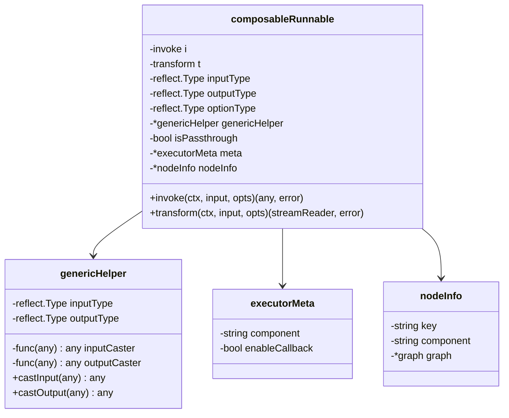
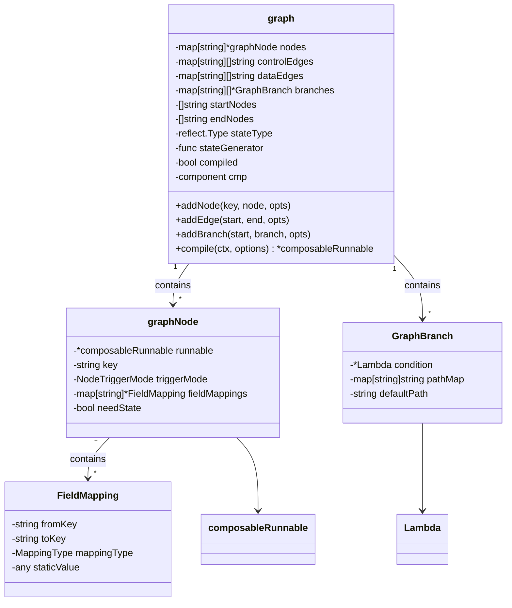
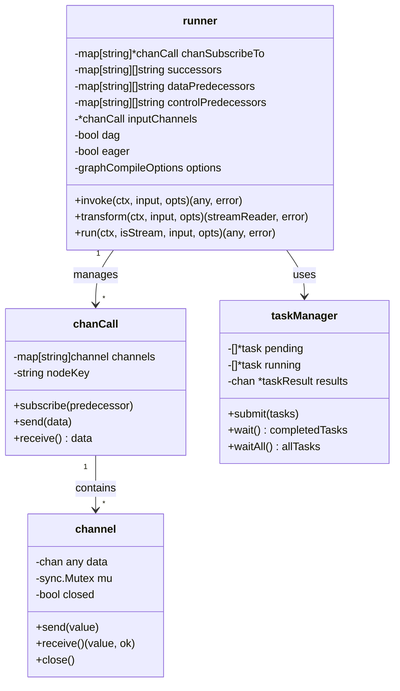
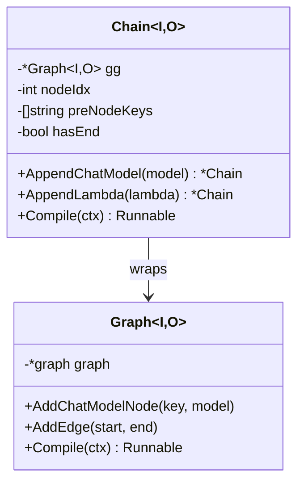
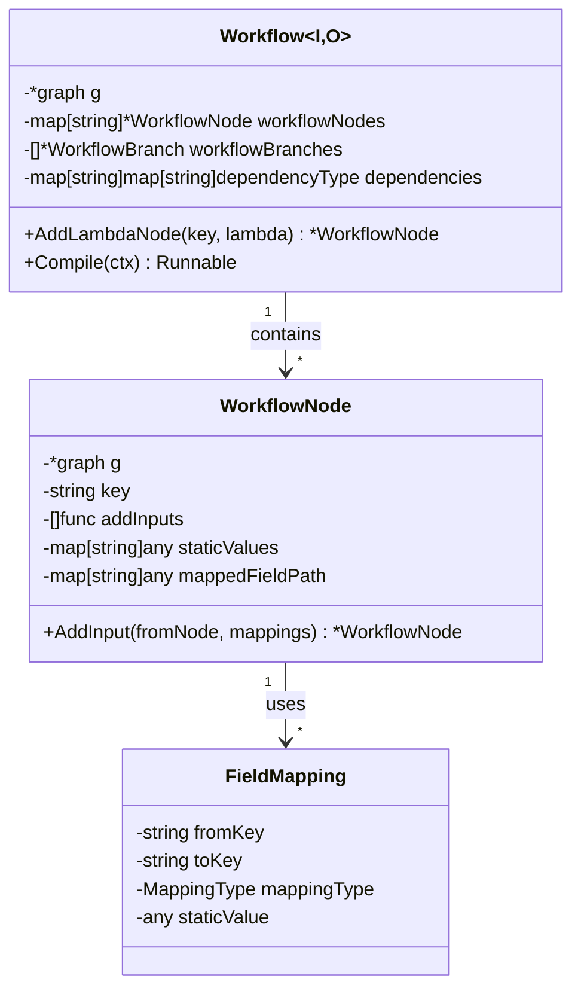
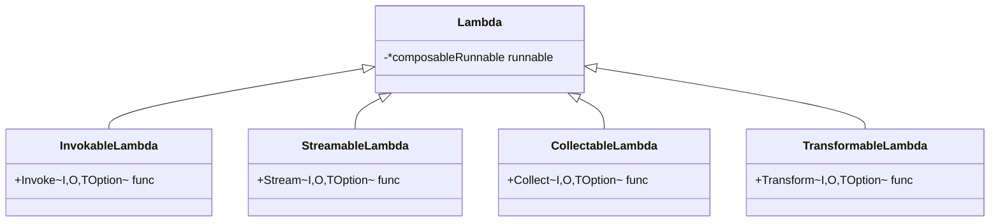
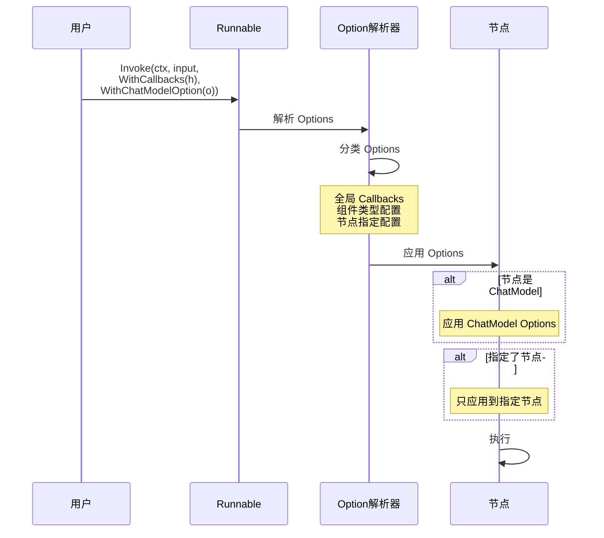
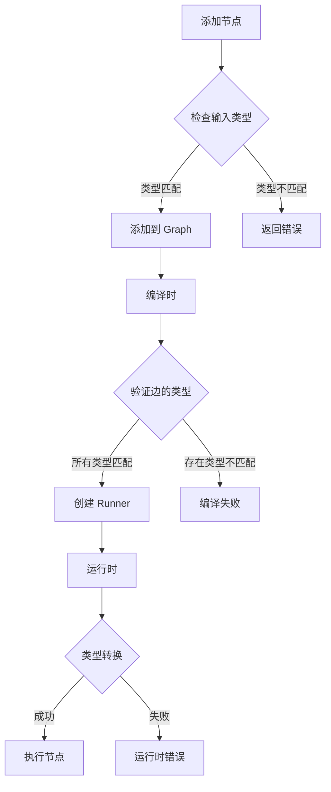
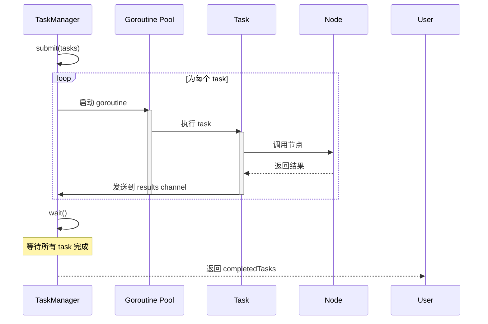
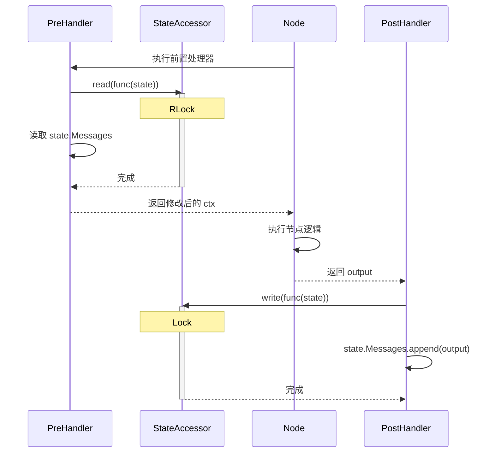

# Eino-02-Compose模块-数据结构

本文档详细描述 Compose 模块的核心数据结构，包括 Runnable、Graph、Chain、Workflow 等关键结构的设计和实现。

---

## 1. composableRunnable - 可组合执行单元

### 1.1 结构定义

```go
// composableRunnable 是所有可执行对象的包装器
type composableRunnable struct {
    // 两个核心执行函数
    i invoke      // Invoke 和 Collect 执行函数
    t transform   // Stream 和 Transform 执行函数
    
    // 类型信息
    inputType  reflect.Type  // 输入类型
    outputType reflect.Type  // 输出类型
    optionType reflect.Type  // Option 类型
    
    // 泛型辅助
    *genericHelper
    
    // 标志
    isPassthrough bool  // 是否是透传节点
    
    // 元信息
    meta *executorMeta
    
    // 节点信息（仅在 Graph 中使用）
    nodeInfo *nodeInfo
}

// invoke 函数签名
type invoke func(ctx context.Context, input any, opts ...any) (output any, err error)

// transform 函数签名
type transform func(ctx context.Context, input streamReader, opts ...any) (output streamReader, err error)
```

### 1.2 UML 类图



### 1.3 字段详解

#### 核心执行函数

| 字段 | 类型 | 说明 |
|-----|------|------|
| i | invoke | Invoke 和 Collect 模式的执行函数 |
| t | transform | Stream 和 Transform 模式的执行函数 |

**设计理念**：
- 只需实现两个核心函数，其他模式可以自动转换
- `i` 处理非流到非流的转换
- `t` 处理流到流的转换

#### 类型信息

| 字段 | 类型 | 说明 |
|-----|------|------|
| inputType | reflect.Type | 输入数据的类型 |
| outputType | reflect.Type | 输出数据的类型 |
| optionType | reflect.Type | Option 参数的类型 |

**用途**：
- 编译时进行类型检查
- 运行时类型转换和验证
- 错误信息生成

#### 特殊标志

| 字段 | 类型 | 说明 |
|-----|------|------|
| isPassthrough | bool | 是否是透传节点（不做处理，直接传递） |

---

## 2. Graph 核心数据结构

### 2.1 graph 结构

```go
type graph struct {
    // 节点和边
    nodes        map[string]*graphNode       // 所有节点
    controlEdges map[string][]string         // 控制边（不传数据）
    dataEdges    map[string][]string         // 数据边（传递数据）
    branches     map[string][]*GraphBranch   // 分支
    
    // 起始和结束节点
    startNodes []string  // 起始节点列表
    endNodes   []string  // 结束节点列表
    
    // 字段映射相关
    toValidateMap map[string][]struct {
        endNode  string
        mappings []*FieldMapping
    }
    fieldMappingRecords map[string][]*FieldMapping
    
    // 状态管理
    stateType      reflect.Type              // State 类型
    stateGenerator func(ctx context.Context) any  // State 生成器
    
    // 类型信息
    expectedInputType  reflect.Type
    expectedOutputType reflect.Type
    *genericHelper
    
    // 编译状态
    buildError error  // 构建时的错误
    compiled   bool   // 是否已编译
    
    // 组件类型
    cmp component
    
    // 配置选项
    newOpts []NewGraphOption
    
    // Handlers
    handlerOnEdges   map[string]map[string][]handlerPair  // 边上的处理器
    handlerPreNode   map[string][]handlerPair             // 节点前置处理器
    handlerPreBranch map[string][][]handlerPair           // 分支前置处理器
}
```

### 2.2 Graph UML 类图



### 2.3 核心字段详解

#### 节点和边

| 字段 | 类型 | 说明 | 用途 |
|-----|------|------|------|
| nodes | map[string]*graphNode | 所有节点 | key -> 节点映射 |
| controlEdges | map[string][]string | 控制边 | 控制执行顺序，不传数据 |
| dataEdges | map[string][]string | 数据边 | 传递数据和控制执行 |
| branches | map[string][]*GraphBranch | 分支 | 条件路由 |

**边的类型**：
- **数据边（Data Edge）**: 默认类型，传递数据和控制
- **控制边（Control Edge）**: 只控制执行顺序，不传数据

#### 状态管理

| 字段 | 类型 | 说明 |
|-----|------|------|
| stateType | reflect.Type | State 结构体类型 |
| stateGenerator | func(ctx) any | State 初始化函数 |

**使用场景**：
- Agent 场景：维护对话历史
- 工作流场景：跨节点共享上下文

---

## 3. graphNode - Graph 节点

### 3.1 结构定义

```go
type graphNode struct {
    // 核心执行单元
    runnable *composableRunnable
    
    // 节点标识
    key string
    
    // 触发模式
    triggerMode NodeTriggerMode
    
    // 字段映射
    fieldMappings map[string]*FieldMapping
    
    // 状态标志
    needState bool
    
    // 元信息
    component string
}

// NodeTriggerMode 节点触发模式
type NodeTriggerMode int

const (
    // AnyPredecessor 任一前驱完成即触发（用于 Pregel 模式）
    AnyPredecessor NodeTriggerMode = iota
    
    // AllPredecessor 所有前驱完成才触发（用于 DAG 模式）
    AllPredecessor
)
```

### 3.2 字段说明

| 字段 | 类型 | 说明 |
|-----|------|------|
| runnable | *composableRunnable | 实际执行单元 |
| key | string | 节点唯一标识 |
| triggerMode | NodeTriggerMode | 触发模式（任一/所有前驱） |
| fieldMappings | map[string]*FieldMapping | 输入字段映射 |
| needState | bool | 是否需要访问 State |

---

## 4. runner - 执行引擎

### 4.1 结构定义

```go
type runner struct {
    // Channel 管理
    chanSubscribeTo map[string]*chanCall  // 节点订阅的 channels
    
    // 依赖关系
    successors          map[string][]string  // 后继节点
    dataPredecessors    map[string][]string  // 数据前驱
    controlPredecessors map[string][]string  // 控制前驱
    
    // 输入 channels
    inputChannels *chanCall
    
    // 执行策略
    chanBuilder chanBuilder  // Channel 构建器
    eager       bool         // 是否立即执行
    dag         bool         // 是否是 DAG 模式
    
    // 上下文包装
    runCtx func(ctx context.Context) context.Context
    
    // 编译选项
    options graphCompileOptions
    
    // 类型信息
    inputType  reflect.Type
    outputType reflect.Type
    *genericHelper
    
    // 运行时检查
    runtimeCheckEdges    map[string]map[string]bool
    runtimeCheckBranches map[string][]bool
    
    // Handlers
    edgeHandlerManager      *edgeHandlerManager
    preNodeHandlerManager   *preNodeHandlerManager
    preBranchHandlerManager *preBranchHandlerManager
    
    // Checkpoint 和 Interrupt
    checkPointer         *checkPointer
    interruptBeforeNodes []string
    interruptAfterNodes  []string
    
    // FanIn 合并配置
    mergeConfigs map[string]FanInMergeConfig
}
```

### 4.2 Runner UML 类图



### 4.3 关键字段详解

#### Channel 管理

| 字段 | 类型 | 说明 |
|-----|------|------|
| chanSubscribeTo | map[string]*chanCall | 每个节点订阅的输入 channels |
| inputChannels | *chanCall | Graph 的输入 channels |

**Channel 机制**：
- 每个节点都有自己的输入 channels
- 前驱节点发送数据到后继节点的 channel
- 使用 Go channel 实现异步通信

#### 依赖关系

| 字段 | 类型 | 说明 |
|-----|------|------|
| successors | map[string][]string | 后继节点列表 |
| dataPredecessors | map[string][]string | 数据前驱列表 |
| controlPredecessors | map[string][]string | 控制前驱列表 |

**用途**：
- 拓扑排序
- 并发调度
- 依赖检查

#### 执行策略

| 字段 | 类型 | 说明 |
|-----|------|------|
| dag | bool | 是否是 DAG 模式 |
| eager | bool | 是否立即执行（vs 懒惰执行） |

**模式差异**：

| 特性 | DAG 模式 | Pregel 模式 |
|-----|---------|------------|
| 循环 | ❌ 不支持 | ✅ 支持 |
| 并发 | ✅ 自动并发 | ⚠️ 串行迭代 |
| 最大步数 | ❌ 不需要 | ✅ 必须设置 |
| 适用场景 | 静态工作流 | Agent、循环流程 |

---

## 5. Chain 数据结构

### 5.1 结构定义

```go
type Chain[I, O any] struct {
    // 内部使用 Graph
    gg *Graph[I, O]
    
    // 构建状态
    err error
    
    // 节点管理
    nodeIdx     int       // 节点计数器
    preNodeKeys []string  // 上一批节点的 keys
    
    // 标志
    hasEnd bool  // 是否已添加 END 边
}
```

### 5.2 Chain vs Graph



**Chain 的本质**：
- Chain 是 Graph 的语法糖
- 内部完全委托给 Graph
- 自动维护节点顺序和边

**关系**：
```
Chain.AppendXXX()
    ↓
Graph.AddXXXNode()
    ↓
Graph.AddEdge(preNode, newNode)
    ↓
更新 preNodeKeys
```

---

## 6. Workflow 数据结构

### 6.1 结构定义

```go
type Workflow[I, O any] struct {
    // 内部 Graph
    g *graph
    
    // Workflow 特有
    workflowNodes    map[string]*WorkflowNode
    workflowBranches []*WorkflowBranch
    dependencies     map[string]map[string]dependencyType
}

type WorkflowNode struct {
    g                *graph
    key              string
    addInputs        []func() error  // 延迟执行的输入添加函数
    staticValues     map[string]any
    dependencySetter func(fromNodeKey string, typ dependencyType)
    mappedFieldPath  map[string]any
}

// 依赖类型
type dependencyType int

const (
    normalDependency     dependencyType = iota  // 普通依赖（数据+控制）
    noDirectDependency                          // 无直接依赖（仅控制）
    branchDependency                            // 分支依赖
)
```

### 6.2 Workflow UML 类图



### 6.3 Workflow 特点

| 特性 | Graph | Workflow |
|-----|-------|----------|
| 边的定义 | 显式 AddEdge | 隐式（通过 AddInput 声明依赖） |
| 数据传递 | 整个输出 | 字段级映射 |
| 并发 | 自动 | 自动（基于依赖） |
| 循环 | 支持（Pregel） | ❌ 不支持 |

---

## 7. Lambda 数据结构

### 7.1 Lambda 定义

```go
type Lambda struct {
    // 内部是 composableRunnable
    runnable *composableRunnable
}

// 四种 Lambda 函数类型

// Invoke 类型
type Invoke[I, O, TOption any] func(
    ctx context.Context,
    input I,
    opts ...TOption,
) (O, error)

// Stream 类型
type Stream[I, O, TOption any] func(
    ctx context.Context,
    input I,
    opts ...TOption,
) (*schema.StreamReader[O], error)

// Collect 类型
type Collect[I, O, TOption any] func(
    ctx context.Context,
    input *schema.StreamReader[I],
    opts ...TOption,
) (O, error)

// Transform 类型
type Transform[I, O, TOption any] func(
    ctx context.Context,
    input *schema.StreamReader[I],
    opts ...TOption,
) (*schema.StreamReader[O], error)
```

### 7.2 Lambda 类型关系



---

## 8. Option 数据结构

### 8.1 Option 结构

```go
// Option 核心结构
type Option struct {
    // Callbacks
    handlers []callbacks.Handler
    
    // 组件类型 Option
    chatModelOptions   []model.Option
    retrieverOptions   []retriever.Option
    // ... 其他组件类型
    
    // 节点指定
    designatedNodeKeys []string
    
    // Graph 运行配置
    maxRunSteps int
    runTimeout  time.Duration
    
    // CheckPoint
    checkPointID         *string
    writeToCheckPointID  *string
    stateModifier        StateModifier
    forceNewRun          bool
}
```

### 8.2 Option 传递机制



---

## 9. 类型系统

### 9.1 泛型辅助

```go
type genericHelper struct {
    inputCaster  func(any) any
    outputCaster func(any) any
    inputType    reflect.Type
    outputType   reflect.Type
}

func newGenericHelper[I, O any]() *genericHelper {
    return &genericHelper{
        inputCaster:  castInput[I],
        outputCaster: castOutput[O],
        inputType:    generic.TypeOf[I](),
        outputType:   generic.TypeOf[O](),
    }
}
```

### 9.2 类型检查流程



**类型检查时机**：
1. **添加节点时**：检查基本类型兼容性
2. **编译时**：检查所有边的类型匹配
3. **运行时**：进行实际类型转换

---

## 10. 并发管理数据结构

### 10.1 task 和 taskManager

```go
type task struct {
    nodeKey string
    call    *chanCall
    output  any
    
    // 状态
    submitted bool
    completed bool
    canceled  bool
}

type taskManager struct {
    // 任务队列
    pending []*task
    running map[string]*task
    
    // 结果通道
    results chan *taskResult
    
    // 执行器
    executor func(*task) (*taskResult, error)
    
    // 控制
    cancel context.CancelFunc
    wg     sync.WaitGroup
}

type taskResult struct {
    task   *task
    output any
    err    error
}
```

### 10.2 并发执行流程



---

## 11. 状态管理数据结构

### 11.1 State 结构

```go
// State 是用户定义的结构体
type MyState struct {
    Messages  []*schema.Message
    Context   string
    Iteration int
    // ... 用户自定义字段
}

// State 访问器
type stateAccessor struct {
    state any           // 实际 State 对象
    mu    sync.RWMutex  // 读写锁
}

func (sa *stateAccessor) read(fn func(state any)) {
    sa.mu.RLock()
    defer sa.mu.RUnlock()
    fn(sa.state)
}

func (sa *stateAccessor) write(fn func(state any)) {
    sa.mu.Lock()
    defer sa.mu.Unlock()
    fn(sa.state)
}
```

### 11.2 State 访问模式



**线程安全**：
- 使用 `sync.RWMutex` 保护 State
- 读操作使用 `RLock`（可并发）
- 写操作使用 `Lock`（互斥）

---

## 12. 数据结构设计模式

### 12.1 组合模式（Composite）

```
Runnable
  ├── Graph (实现 Runnable)
  ├── Chain (实现 Runnable，内部包含 Graph)
  └── Lambda (实现 Runnable)

Graph 可以包含:
  ├── ChatModel 节点
  ├── Lambda 节点
  └── 嵌套的 Graph 节点
```

**优势**：
- 统一接口（Runnable）
- 可以任意嵌套组合
- 递归处理

### 12.2 建造者模式（Builder）

```go
// Chain 使用建造者模式
chain := compose.NewChain[I, O]().
    AppendChatModel(model).
    AppendLambda(lambda).
    AppendToolsNode(tools)

runnable, _ := chain.Compile(ctx)
```

**优势**：
- 链式调用，代码清晰
- 延迟编译，提前发现错误
- 配置集中

### 12.3 策略模式（Strategy）

```go
// 不同的执行模式
type runMode interface {
    run(ctx, input) (output, error)
}

type dagMode struct { /* DAG 执行策略 */ }
type pregelMode struct { /* Pregel 执行策略 */ }

// runner 根据 dag 标志选择策略
if r.dag {
    return r.runDAG(ctx, input)
} else {
    return r.runPrege(ctx, input)
}
```

---

## 13. 内存占用分析

### 13.1 各结构体大小估算

| 结构 | 主要字段 | 估算大小 |
|-----|---------|---------|
| composableRunnable | 2个函数 + 3个Type + 指针 | ~100 bytes |
| graph | 多个map + slice | ~500 bytes + 节点数×指针大小 |
| graphNode | runnable指针 + map | ~150 bytes |
| runner | 多个map + channels | ~1KB + 节点数×channel大小 |
| channel | Go channel | ~100 bytes（取决于缓冲区） |

### 13.2 Graph 内存占用

```
总内存 ≈ graph基础大小 + 节点数×节点大小 + 边数×边大小 + channel内存

示例（10个节点，15条边）:
  graph:     500 bytes
  + 节点:    10 × 150 = 1.5 KB
  + runner:  1 KB
  + channel: 10 × 100 = 1 KB
  ≈ 4 KB
```

**优化建议**：
- 复用 Runnable，不要每次都编译
- 控制 State 大小
- 合理设置 channel 缓冲区

---

## 14. 最佳实践

### 14.1 类型设计

```go
// ✅ 推荐：使用具体类型
type MyInput struct {
    Query   string
    Context string
}

type MyOutput struct {
    Answer string
    Source []string
}

graph := compose.NewGraph[MyInput, MyOutput]()

// ❌ 避免：过度使用 any
graph := compose.NewGraph[any, any]()  // 失去类型安全
```

### 14.2 节点粒度

```go
// ✅ 推荐：适中的节点粒度
graph.AddLambdaNode("preprocess", preprocessLambda)  // 预处理
graph.AddChatModelNode("model", chatModel)           // 模型推理
graph.AddLambdaNode("postprocess", postprocessLambda) // 后处理

// ❌ 避免：节点过于细粒度
graph.AddLambdaNode("trim", trimLambda)
graph.AddLambdaNode("lowercase", lowerLambda)
graph.AddLambdaNode("remove_punctuation", removePuncLambda)
// 这些应该合并为一个 preprocess 节点
```

### 14.3 State 设计

```go
// ✅ 推荐：精简的 State
type AgentState struct {
    Messages  []*schema.Message  // 必要的对话历史
    Iteration int                 // 迭代计数
}

// ❌ 避免：臃肿的 State
type AgentState struct {
    Messages        []*schema.Message
    AllIntermediateResults []any  // 不必要
    DebugInfo              map[string]any  // 不必要
    PerformanceMetrics     []Metric  // 应该用 Callbacks
}
```

---

**文档版本**: v1.0  
**最后更新**: 2024-12-19  
**适用 Eino 版本**: main 分支（最新版本）

