# Eino-02-Compose模块-时序图

本文档通过时序图展示 Compose 模块在典型场景下的编译和执行流程。

---

## 1. Chain 编译和执行时序

### 1.1 Chain 编译流程

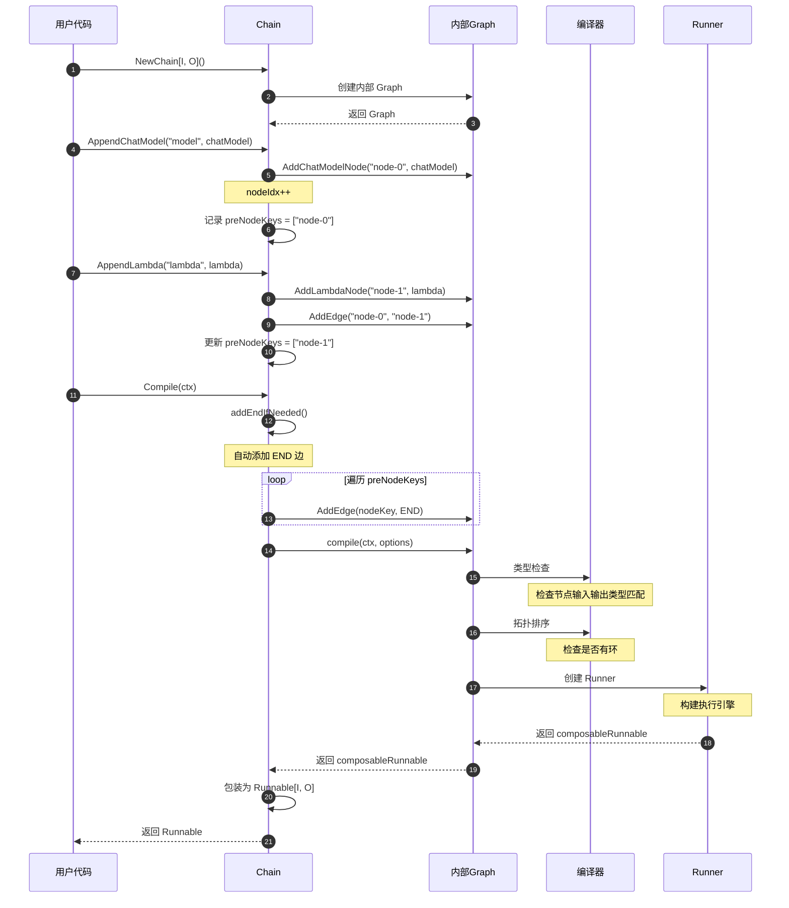

**流程说明**:
1. 创建 Chain 时内部创建 Graph
2. 每次 Append 操作添加节点和边
3. Chain 自动维护 preNodeKeys（上一批节点）
4. Compile 时自动添加到 END 的边
5. 调用 Graph 的 compile 方法
6. 进行类型检查和拓扑排序
7. 创建 Runner 执行引擎
8. 返回可执行的 Runnable

**关键点**:
- Chain 是 Graph 的语法糖，内部委托给 Graph
- 自动维护节点顺序，无需手动添加边
- 编译时进行静态类型检查

---

### 1.2 Chain Invoke 执行流程

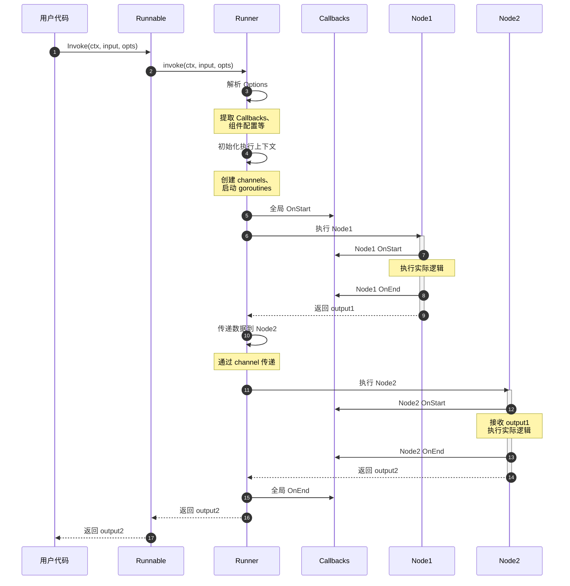

**流程说明**:
1. 用户调用 Runnable.Invoke
2. Runner 解析 Options（Callbacks、配置等）
3. 初始化执行上下文（channels、goroutines）
4. 触发全局 OnStart 回调
5. 顺序执行各个节点
6. 每个节点执行前后触发回调
7. 通过 channel 在节点间传递数据
8. 最后返回输出并触发全局 OnEnd

**性能特点**:
- Chain 是顺序执行，无并发
- 节点间通过 channel 传递数据
- Callbacks 不阻塞主流程

---

## 2. Graph DAG 模式执行时序

### 2.1 Graph 编译流程（DAG 模式）

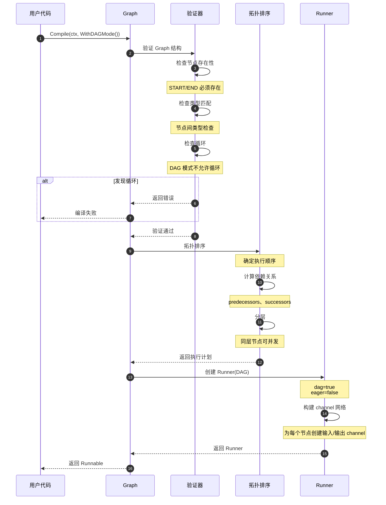

**DAG 模式特点**:
- 不允许循环
- 自动并发执行无依赖节点
- 使用拓扑排序确定执行顺序
- 通过 channel 网络传递数据

---

### 2.2 Graph DAG 并发执行时序

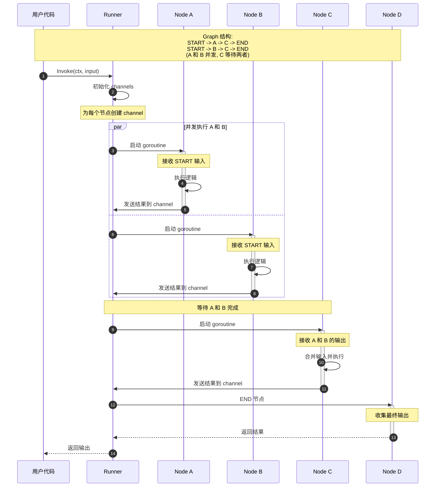

**并发特点**:
1. 无依赖的节点自动并发执行
2. 有依赖的节点等待所有前驱完成
3. 使用 channel 进行节点间通信
4. goroutine 数量等于节点数量

**性能优势**:
- 最大化并发度
- 减少总体执行时间
- 自动资源管理

---

## 3. Graph Pregel 模式执行时序

### 3.1 Pregel 迭代执行流程

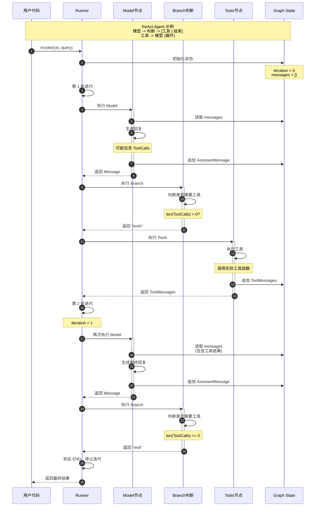

**Pregel 模式特点**:
1. 支持循环边
2. 迭代执行，每轮可以经过多个节点
3. 必须设置 MaxRunSteps 防止无限循环
4. 适合 Agent、工作流等场景

**迭代控制**:
- 达到 MaxRunSteps 时强制停止
- 到达 END 节点时停止
- 发生错误时停止

---

### 3.2 Pregel 最大迭代次数保护

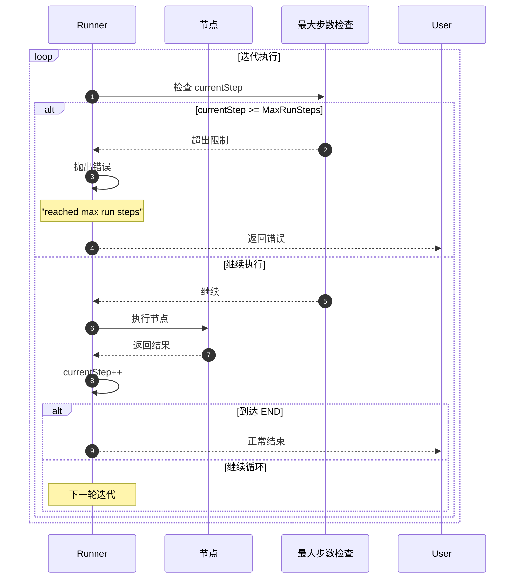

**保护机制**:
- 每轮迭代递增计数器
- 达到上限时返回错误
- 避免无限循环导致资源耗尽

---

## 4. Workflow 执行时序

### 4.1 Workflow 依赖解析和执行

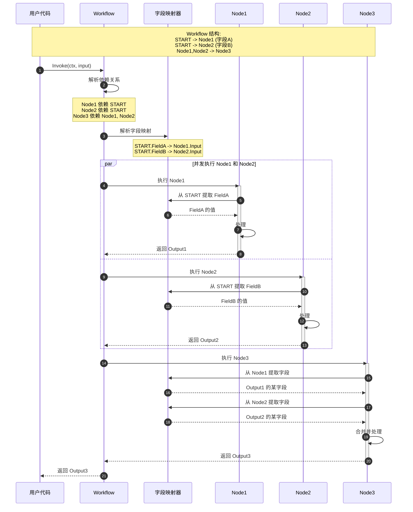

**Workflow 特点**:
1. 显式声明依赖关系
2. 支持字段级数据映射
3. 自动并发执行无依赖节点
4. 不支持循环

**字段映射**:
- MapFields: 字段到字段映射
- MapKey: Map 的 key 映射
- StaticValue: 静态值注入

---

## 5. 分支执行时序

### 5.1 Graph 分支路由

```mermaid
sequenceDiagram
    autonumber
    participant Runner as Runner
    participant Source as 源节点
    participant Branch as 分支Lambda
    participant Target1 as 目标节点1
    participant Target2 as 目标节点2
    participant END as END节点

    Runner->>Source: 执行源节点
    Source-->>Runner: 返回 output
    
    Runner->>Branch: 执行分支判断
    Branch->>Branch: 判断逻辑
    Note over Branch: 根据 output 决定路由
    
    alt 条件1满足
        Branch-->>Runner: 返回 "target1"
        Runner->>Target1: 路由到 Target1
        activate Target1
        Target1->>Target1: 处理
        Target1-->>Runner: 返回结果
        deactivate Target1
    else 条件2满足
        Branch-->>Runner: 返回 "target2"
        Runner->>Target2: 路由到 Target2
        activate Target2
        Target2->>Target2: 处理
        Target2-->>Runner: 返回结果
        deactivate Target2
    else 其他
        Branch-->>Runner: 返回 "end"
        Runner->>END: 直接结束
    end
    
    Runner-->>User: 返回最终结果
```

**分支规则**:
- Branch Lambda 返回字符串（目标节点 key）
- pathMap 定义了返回值到节点的映射
- 必须覆盖所有可能的返回值

---

## 6. 流式执行时序

### 6.1 Stream 模式执行

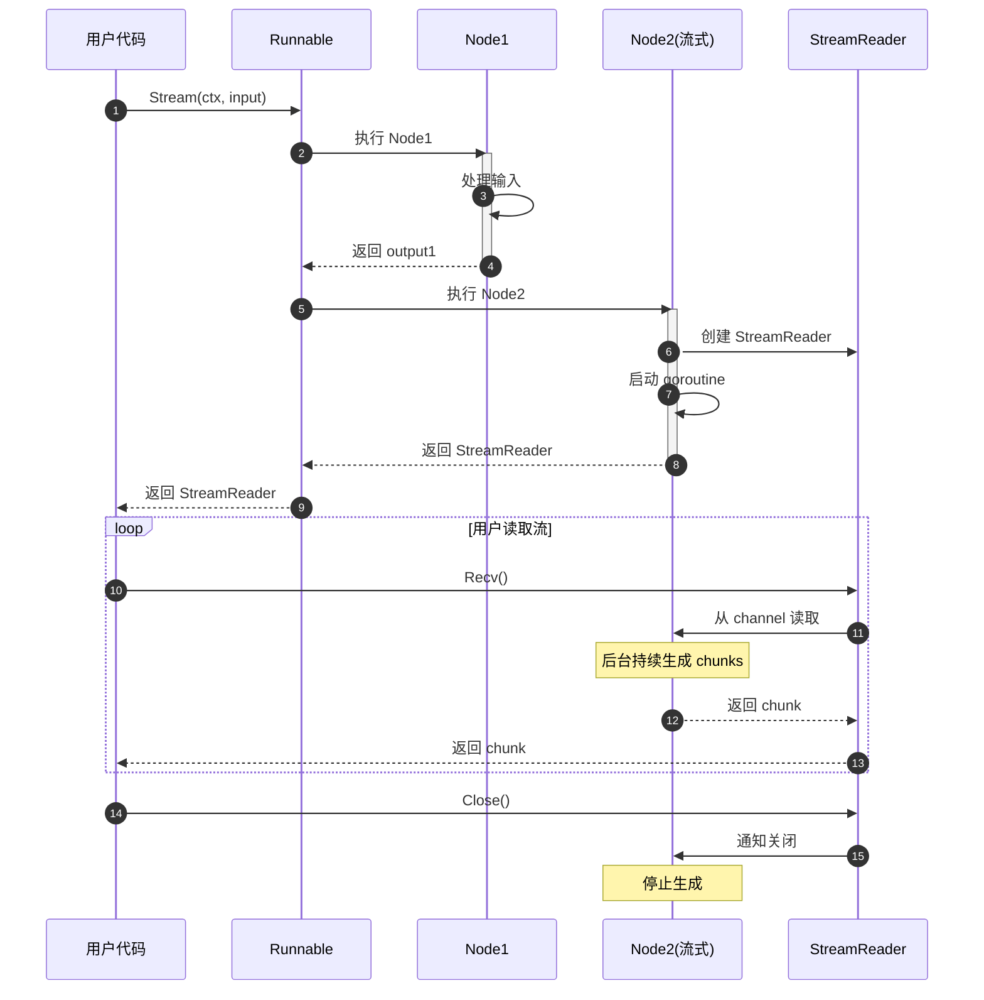

**流式特点**:
- 支持逐块输出
- 后台 goroutine 持续生成数据
- 通过 channel 实现异步传输

---

### 6.2 流的自动拼接和复制

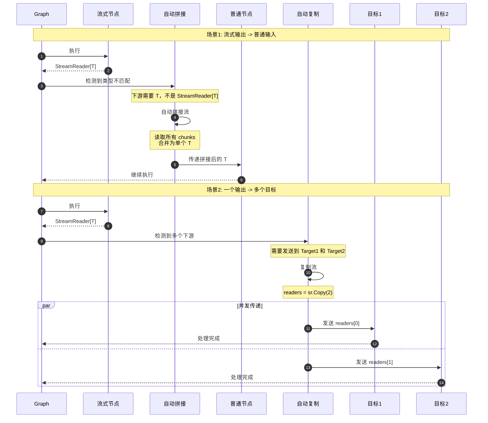

**自动处理**:
- **自动拼接**: 流输出连接普通输入时
- **自动复制**: 一个输出连接多个目标时
- 完全透明，用户无需关心

---

## 7. Callbacks 执行时序

### 7.1 完整的 Callbacks 调用流程

```mermaid
sequenceDiagram
    autonumber
    participant User as 用户代码
    participant Runner as Runner
    participant GlobalCB as 全局Callbacks
    participant NodeCB as 节点Callbacks
    participant Node as 节点

    User->>Runner: Invoke(ctx, input, WithCallbacks(...))
    
    Runner->>Runner: 收集 Callbacks
    Note over Runner: 全局 + 组件类型 + 节点
    
    Runner->>GlobalCB: OnStart(全局)
    GlobalCB-->>Runner: 修改后的 ctx
    
    Runner->>Node: 准备执行节点
    
    Runner->>NodeCB: OnStart(节点)
    NodeCB-->>Runner: 修改后的 ctx
    
    Runner->>Node: 执行节点
    activate Node
    
    alt 执行成功
        Node-->>Runner: 返回 output
        deactivate Node
        
        Runner->>NodeCB: OnEnd(节点)
        NodeCB-->>Runner: ctx
        
        Runner->>GlobalCB: OnEnd(全局)
        GlobalCB-->>Runner: ctx
        
    else 执行失败
        Node-->>Runner: 返回 error
        deactivate Node
        
        Runner->>NodeCB: OnError(节点)
        NodeCB-->>Runner: ctx
        
        Runner->>GlobalCB: OnError(全局)
        GlobalCB-->>Runner: ctx
        
        Runner-->>User: 返回 error
    end
    
    Runner-->>User: 返回 output
```

**Callbacks 顺序**:
1. 全局 OnStart
2. 节点 OnStart
3. 执行节点
4. 节点 OnEnd/OnError
5. 全局 OnEnd/OnError

---

## 8. 状态管理时序

### 8.1 Graph State 读写流程

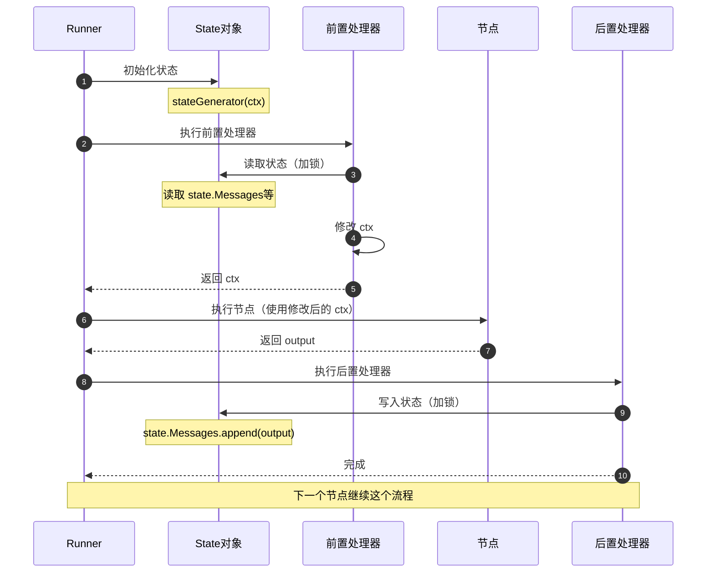

**状态管理特点**:
- State 在所有节点间共享
- 读写通过锁保证线程安全
- PreHandler 读取状态，PostHandler 写入状态
- 适合需要保持上下文的场景（如 Agent）

---

## 9. 错误处理时序

### 9.1 节点错误传播

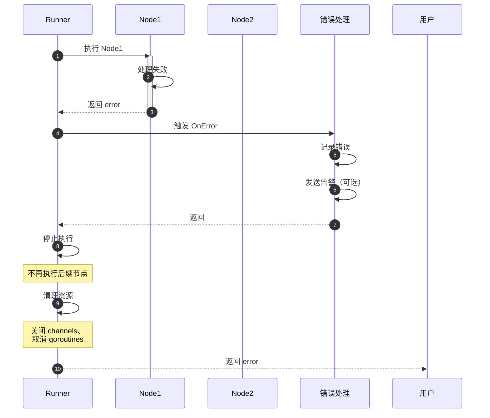

**错误处理**:
- 任一节点失败，停止整个执行
- 触发 OnError 回调
- 自动清理资源
- 错误信息传播给用户

---

## 10. 性能优化时序示例

### 10.1 并发执行优化

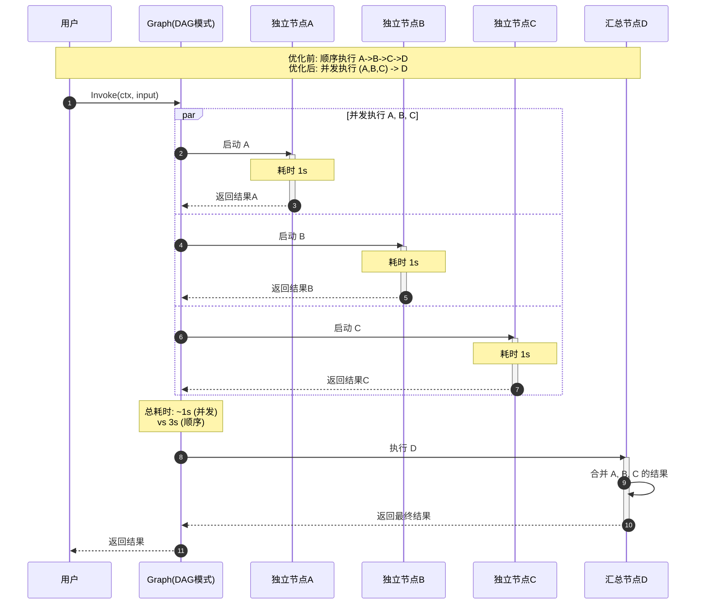

**性能提升**:
- 顺序执行: 1s + 1s + 1s + 处理时间 = 3s+
- 并发执行: max(1s, 1s, 1s) + 处理时间 = 1s+
- 提升 3 倍性能

---

**文档版本**: v1.0  
**最后更新**: 2024-12-19  
**适用 Eino 版本**: main 分支（最新版本）

