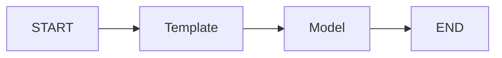
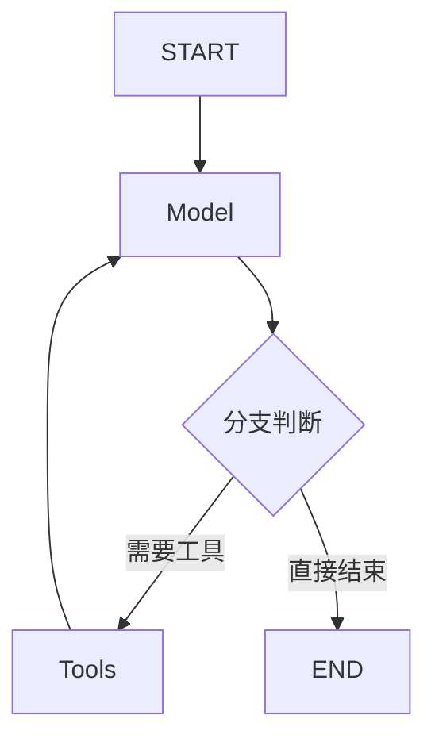
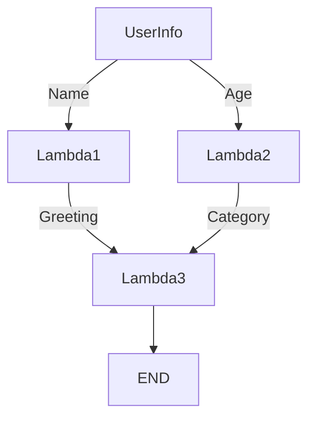

# Eino-02-Compose模块-核心概览

## 概述

Compose 模块是 Eino 框架的编排引擎核心，负责将独立的组件组合成复杂的执行流程。它提供了三种编排模式（Chain、Graph、Workflow）和统一的 Runnable 接口。

---

## 1. 核心概念

### 1.1 Runnable 接口 - 统一执行抽象

```go
// Runnable 是所有可执行对象的统一接口
type Runnable[I, O any] interface {
    // Invoke: 非流输入 => 非流输出
    Invoke(ctx context.Context, input I, opts ...Option) (output O, err error)
    
    // Stream: 非流输入 => 流输出  
    Stream(ctx context.Context, input I, opts ...Option) (output *schema.StreamReader[O], err error)
    
    // Collect: 流输入 => 非流输出
    Collect(ctx context.Context, input *schema.StreamReader[I], opts ...Option) (output O, err error)
    
    // Transform: 流输入 => 流输出
    Transform(ctx context.Context, input *schema.StreamReader[I], opts ...Option) (output *schema.StreamReader[O], err error)
}
```

**四种执行模式**：
| 模式 | 输入 | 输出 | 适用场景 |
|------|-----|------|---------|
| Invoke | 普通值 | 普通值 | 标准的请求-响应模式 |
| Stream | 普通值 | 流 | 需要流式输出（如聊天）|
| Collect | 流 | 普通值 | 汇总流式输入 |
| Transform | 流 | 流 | 流式转换 |

**自动降级**：组件只需实现一种模式，其他三种会自动生成。

---

## 2. 三种编排模式

### 2.1 Chain - 链式编排

**特点**：简单的线性流程，只能向前推进。

**示例**：
```go
chain := compose.NewChain[map[string]any, *schema.Message]()

// 添加节点
chain.AppendChatTemplate("template", chatTemplate)
chain.AppendChatModel("model", chatModel)

// 编译
runnable, _ := chain.Compile(ctx)

// 执行
result, _ := runnable.Invoke(ctx, map[string]any{"query": "你好"})
```

**架构图**：


**适用场景**：
- 简单的顺序流程
- 不需要分支和循环
- 快速原型开发

---

### 2.2 Graph - 图式编排

**特点**：支持分支、循环、并发，功能最强大。

**示例**：
```go
graph := compose.NewGraph[Input, Output]()

// 添加节点
graph.AddChatModelNode("model", chatModel)
graph.AddToolsNode("tools", toolsNode)
graph.AddLambdaNode("converter", converterLambda)

// 添加边
graph.AddEdge(START, "model")

// 添加分支（条件路由）
graph.AddBranch("model", compose.NewGraphBranch(
    branchLambda,
    map[string]string{
        "tools": "tools",    // 有工具调用，走工具节点
        "end":   END,         // 无工具调用，直接结束
    },
))

graph.AddEdge("tools", "model")  // 循环边：工具结果回到模型

// 编译
runnable, _ := graph.Compile(ctx)
```

**架构图**：


**两种执行模式**：

1. **DAG 模式**（NodeTriggerMode.AllPredecessor）：
   - 所有前驱节点完成才执行
   - 支持并发
   - 不支持循环

2. **Pregel 模式**（NodeTriggerMode.AnyPredecessor）：
   - 任一前驱节点完成即可执行
   - 支持循环
   - 迭代执行，设置最大迭代次数

**适用场景**：
- 需要条件分支
- 需要循环（如 ReAct Agent）
- 需要节点并发执行

---

### 2.3 Workflow - 工作流编排

**特点**：支持字段级别的数据映射，无循环。

**示例**：
```go
wf := compose.NewWorkflow[UserInfo, *schema.Message]()

// 添加节点并声明依赖
wf.AddLambdaNode("lambda1", lambda1).
    AddInput(START, compose.MapFields("Name", "Name"))  // 字段映射

wf.AddLambdaNode("lambda2", lambda2).
    AddInput(START, compose.MapFields("Age", "Age"))

wf.AddLambdaNode("lambda3", lambda3).
    AddInput("lambda1", compose.MapFields("Greeting", "Greeting")).
    AddInput("lambda2", compose.MapFields("Category", "Category"))

wf.End().AddInput("lambda3")

// 编译
runnable, _ := wf.Compile(ctx)
```

**架构图**：


**适用场景**：
- 需要灵活的字段映射
- 数据结构转换
- 并行处理不同字段

---

## 3. 核心机制

### 3.1 类型系统

**编译时类型检查**：
```go
// 类型匹配
chain.AppendChatTemplate("t", chatTemplate)  // 输出: []*Message
chain.AppendChatModel("m", chatModel)        // 输入: []*Message ✅

// 类型不匹配会在 Compile 时报错
chain.AppendLambda("bad", func(ctx context.Context, input string) (int, error) {
    return 0, nil
})  // 输入应该是 []*Message，但是 string ❌
```

**自动类型转换**：
- 流 ↔ 非流自动转换
- 通过 Runnable 四种模式实现

### 3.2 流处理机制

**自动拼接**：
```go
// ChatModel 输出流式 Message
// ToolsNode 需要完整 Message
// Graph 自动拼接流
graph.AddChatModelNode("model", model)  // 输出: StreamReader[*Message]
graph.AddToolsNode("tools", tools)      // 输入: *Message（自动拼接）
graph.AddEdge("model", "tools")
```

**自动复制**：
```go
// 一个输出连接到多个节点
graph.AddEdge("model", "node1")
graph.AddEdge("model", "node2")
// Graph 自动复制流，node1 和 node2 各自独立读取
```

### 3.3 回调注入

**自动注入**：
```go
// 组件未实现回调时，Graph 自动注入
graph.AddChatModelNode("model", chatModel)

// 执行时传入回调
runnable.Invoke(ctx, input, compose.WithCallbacks(handler))

// 框架自动在 model 执行前后调用回调
```

**三种注入级别**：
1. **全局回调**：所有节点
2. **组件类型回调**：所有 ChatModel 节点
3. **节点回调**：特定节点

### 3.4 Option 传递

**三种传递方式**：
```go
// 1. 全局 Option（所有节点）
runnable.Invoke(ctx, input, 
    compose.WithCallbacks(handler))

// 2. 组件类型 Option（所有 ChatModel）
runnable.Invoke(ctx, input,
    compose.WithChatModelOption(
        model.WithTemperature(0.7),
    ))

// 3. 节点 Option（指定节点）
runnable.Invoke(ctx, input,
    compose.WithCallbacks(handler).DesignateNode("node1"))
```

### 3.5 状态管理

**Graph 状态**：
```go
type MyState struct {
    Messages []*schema.Message
    Context  string
}

// 创建带状态的 Graph
graph := compose.NewGraph[Input, Output](
    compose.WithState(func(ctx context.Context) *MyState {
        return &MyState{Messages: []*schema.Message{}}
    }),
)

// 读写状态
graph.AddPreHandler("node1", 
    compose.StatePreHandler(func(ctx context.Context, state *MyState) context.Context {
        // 读取状态
        messages := state.Messages
        return ctx
    }))

graph.AddPostHandler("node1",
    compose.StatePostHandler(func(ctx context.Context, state *MyState, output any) {
        // 写入状态（线程安全）
        state.Messages = append(state.Messages, output.(*schema.Message))
    }))
```

**线程安全**：
- State 读写通过锁保证线程安全
- 多个节点可并发访问

---

## 4. Lambda 节点

### 4.1 InvokableLambda

```go
// 创建普通 Lambda
lambda := compose.InvokableLambda(func(ctx context.Context, input string) (string, error) {
    return "processed: " + input, nil
})

// 使用
chain.AppendLambda("my_lambda", lambda)
```

### 4.2 StreamableLambda

```go
// 创建流式 Lambda
lambda := compose.StreamableLambda(func(ctx context.Context, input string) (*schema.StreamReader[string], error) {
    sr, sw := schema.Pipe[string](10)
    
    go func() {
        defer sw.Close()
        words := strings.Fields(input)
        for _, word := range words {
            sw.Send(word, nil)
        }
    }()
    
    return sr, nil
})
```

### 4.3 Lambda 用途

1. **自定义处理逻辑**
2. **数据转换**
3. **条件判断（Branch）**
4. **状态更新**
5. **快速原型**

---

## 5. 实战案例

### 5.1 案例 1：简单的 RAG 应用

```go
// 1. 创建 Chain
chain := compose.NewChain[map[string]any, *schema.Message]()

// 2. 添加检索节点
retriever := myRetriever  // 实现 retriever.Retriever
chain.AppendRetriever("retriever", retriever)

// 3. 添加转换节点（提取文档内容）
extractLambda := compose.InvokableLambda(
    func(ctx context.Context, docs []*schema.Document) (map[string]any, error) {
        var context strings.Builder
        for _, doc := range docs {
            context.WriteString(doc.Content)
            context.WriteString("\n\n")
        }
        return map[string]any{"context": context.String()}, nil
    })
chain.AppendLambda("extract", extractLambda)

// 4. 添加模板节点
template := prompt.FromMessages(
    schema.SystemMessage("根据以下上下文回答问题"),
    schema.UserMessage("上下文：{context}\n\n问题：{query}"),
)
chain.AppendChatTemplate("template", template)

// 5. 添加模型节点
chain.AppendChatModel("model", chatModel)

// 6. 编译并使用
runnable, _ := chain.Compile(ctx)
result, _ := runnable.Invoke(ctx, map[string]any{
    "query": "Eino 是什么？",
})
```

### 5.2 案例 2：带工具调用的 Agent

```go
// 1. 创建 Graph
graph := compose.NewGraph[map[string]any, *schema.Message]()

// 2. 添加模板节点
graph.AddChatTemplateNode("template", template)

// 3. 添加模型节点（绑定工具）
modelWithTools, _ := chatModel.WithTools([]*schema.ToolInfo{weatherTool, calcTool})
graph.AddChatModelNode("model", modelWithTools)

// 4. 添加工具节点
toolsNode := compose.NewToolsNode()
toolsNode.RegisterTool(weatherTool, weatherFunc)
toolsNode.RegisterTool(calcTool, calcFunc)
graph.AddToolsNode("tools", toolsNode)

// 5. 添加分支判断
branchLambda := compose.InvokableLambda(
    func(ctx context.Context, msg *schema.Message) (string, error) {
        if len(msg.ToolCalls) > 0 {
            return "tools", nil
        }
        return "end", nil
    })

graph.AddBranch("model", compose.NewGraphBranch(
    branchLambda,
    map[string]string{
        "tools": "tools",
        "end":   compose.END,
    },
))

// 6. 添加边
graph.AddEdge(START, "template")
graph.AddEdge("template", "model")
graph.AddEdge("tools", "model")  // 循环边

// 7. 编译
runnable, _ := graph.Compile(ctx, 
    compose.WithMaxRunSteps(10))  // 最多迭代 10 次
```

---

## 6. 性能特征

### 6.1 编译开销

- 编译时进行类型检查和拓扑排序
- 编译结果可以缓存复用
- 建议：编译一次，多次执行

### 6.2 执行性能

**Chain**：
- 顺序执行，无并发开销
- 性能最好

**Graph DAG**：
- 自动并发执行无依赖节点
- 性能取决于并发度

**Graph Pregel**：
- 迭代执行
- 性能取决于迭代次数

### 6.3 内存占用

- 流的复制会创建链表结构
- State 在所有节点间共享
- 建议：控制 State 大小

---

## 7. 最佳实践

### 7.1 选择编排模式

```
简单顺序流程 → Chain
需要分支/循环 → Graph
需要字段映射 → Workflow
```

### 7.2 Lambda 节点使用

- 用于快速原型和测试
- 生产环境建议封装为正式组件
- 注意错误处理

### 7.3 状态管理

- 只在必要时使用 State
- State 结构体设计要精简
- 注意并发安全

### 7.4 回调使用

- 开发时使用 Callbacks 调试
- 生产环境用于监控和追踪
- 避免在 Callbacks 中执行耗时操作

---

**文档版本**: v1.0  
**最后更新**: 2024-12-19

