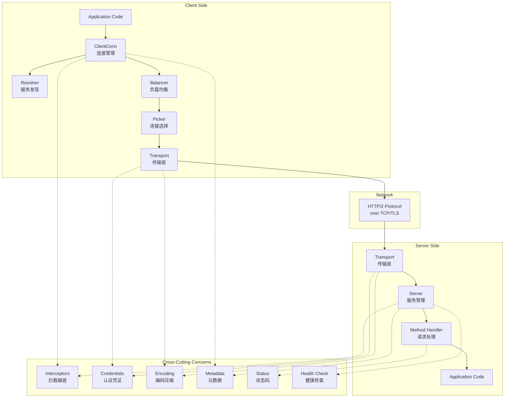
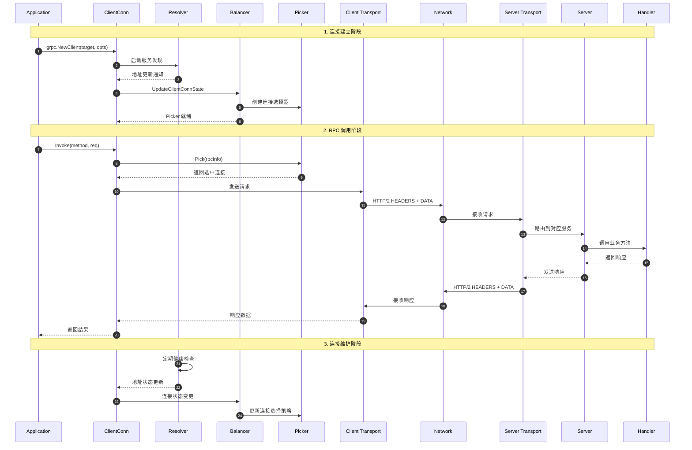

# gRPC-Go 源码剖析总览

## 0. 摘要

### 项目目标与核心能力
gRPC-Go 是 Google 开发的高性能、开源的通用 RPC 框架在 Go 语言上的实现。该项目提供完整的 gRPC 客户端和服务端功能，支持 HTTP/2 协议、流式通信、负载均衡、服务发现、认证授权等企业级特性。

**核心能力边界：**
- 基于 HTTP/2 的高性能 RPC 通信
- 支持 Unary、Client Streaming、Server Streaming、Bidirectional Streaming 四种调用模式
- 内置多种负载均衡策略（round_robin、pick_first、weighted_round_robin 等）
- 可插拔的服务发现机制（DNS、passthrough、unix socket 等）
- 完整的认证体系（TLS、OAuth2、JWT、ALTS 等）
- 丰富的拦截器机制支持中间件扩展
- 内置健康检查、指标监控、链路追踪能力

**非目标：**
- 不提供服务注册中心实现（依赖外部服务发现）
- 不包含业务逻辑处理框架
- 不提供数据持久化能力

### 运行环境与部署形态
- **语言版本：** Go 1.24.0+
- **核心依赖：** golang.org/x/net、google.golang.org/protobuf、google.golang.org/genproto
- **部署形态：** 
  - 库形式集成到应用程序中
  - 支持单体应用内 RPC 调用
  - 支持微服务间通信
  - 可作为 sidecar 代理组件

## 1. 整体架构图



**图解与要点：**

1. **客户端架构层次：**
   - `ClientConn` 作为客户端核心，管理连接生命周期
   - `Resolver` 负责将服务名解析为具体地址列表
   - `Balancer` 根据负载均衡策略管理多个连接
   - `Picker` 为每个 RPC 请求选择合适的连接
   - `Transport` 处理底层 HTTP/2 协议通信

2. **服务端架构层次：**
   - `Transport` 接收并解析 HTTP/2 请求
   - `Server` 管理服务注册和请求路由
   - `Handler` 执行具体的 RPC 方法调用

3. **横切关注点：**
   - `Interceptors` 提供请求/响应拦截能力
   - `Credentials` 处理各种认证机制
   - `Encoding` 支持多种序列化和压缩方式
   - `Metadata` 传递请求上下文信息
   - `Status` 统一错误码和状态管理
   - `Health` 提供服务健康状态检查

4. **数据流与控制流：**
   - 控制流：应用代码 → ClientConn → Balancer → Picker → Transport
   - 数据流：应用数据经过编码、压缩后通过 HTTP/2 传输
   - 错误流：各层异常通过 Status 统一处理并向上传播

5. **并发与扩展性：**
   - ClientConn 支持多 goroutine 并发调用
   - Server 为每个 RPC 请求分配独立 goroutine
   - Balancer 和 Resolver 异步更新连接状态
   - Transport 层支持多路复用和流控

## 2. 全局时序图（主要业务闭环）



**图解与要点：**

1. **连接建立阶段（步骤1-6）：**
   - 应用调用 `grpc.NewClient()` 创建客户端连接
   - `Resolver` 根据 target 进行服务发现，解析出后端地址列表
   - `Balancer` 接收地址更新，建立到后端的物理连接
   - `Picker` 根据负载均衡策略准备连接选择逻辑

2. **RPC调用阶段（步骤7-16）：**
   - 应用发起 RPC 调用，`ClientConn` 通过 `Picker` 选择连接
   - `Transport` 层将请求编码为 HTTP/2 帧并发送
   - 服务端 `Transport` 接收请求并路由到对应的 `Handler`
   - `Handler` 执行业务逻辑并返回响应
   - 响应沿相同路径返回给应用

3. **连接维护阶段（步骤17-20）：**
   - `Resolver` 持续监控后端地址变化
   - `Balancer` 根据连接健康状态动态调整负载均衡策略
   - 支持连接池管理、故障转移、熔断等高可用特性

4. **关键边界条件：**
   - 连接超时：默认20秒连接建立超时
   - 请求超时：支持 context.WithTimeout 控制
   - 并发控制：客户端支持多 goroutine 并发调用
   - 流控管理：HTTP/2 层面的窗口大小控制
   - 错误重试：支持可配置的重试策略

## 3. 模块边界与交互图

### 核心模块清单

| 序号 | 模块名称 | 目录路径 | 主要职责 | 对外API |
|------|----------|----------|----------|---------|
| 01 | 客户端连接 | clientconn.go | 客户端连接管理、RPC调用入口 | NewClient, Dial, Invoke |
| 02 | 服务端 | server.go | 服务端管理、请求处理 | NewServer, RegisterService, Serve |
| 03 | 负载均衡 | balancer/ | 连接选择、负载均衡策略 | Register, Builder, Picker |
| 04 | 服务发现 | resolver/ | 服务名解析、地址发现 | Register, Builder, Resolver |
| 05 | 认证凭证 | credentials/ | 认证授权、传输安全 | NewTLS, NewOAuth, NewJWT |
| 06 | 编码压缩 | encoding/ | 消息序列化、数据压缩 | RegisterCodec, RegisterCompressor |
| 07 | 元数据 | metadata/ | 请求上下文、Header传递 | New, FromContext, AppendToOutgoing |
| 08 | 状态码 | status/, codes/ | 错误码定义、状态管理 | New, Error, FromError |
| 09 | 拦截器 | interceptor.go | 请求拦截、中间件链 | UnaryInterceptor, StreamInterceptor |
| 10 | 健康检查 | health/ | 服务健康状态检查 | NewServer, Check, Watch |
| 11 | 传输层 | internal/transport/ | HTTP/2协议处理、连接管理 | NewClientTransport, NewServerTransport |
| 12 | 流处理 | stream.go | 流式RPC、双向通信 | ClientStream, ServerStream |

### 模块交互矩阵

| 调用方 → 被调方 | 客户端连接 | 服务端 | 负载均衡 | 服务发现 | 认证凭证 | 编码压缩 | 元数据 | 状态码 | 拦截器 | 健康检查 | 传输层 |
|----------------|------------|--------|----------|----------|----------|----------|--------|--------|--------|----------|--------|
| **客户端连接** | - | - | 同步调用 | 同步调用 | 同步调用 | 同步调用 | 同步调用 | 同步调用 | 同步调用 | - | 同步调用 |
| **服务端** | - | - | - | - | 同步调用 | 同步调用 | 同步调用 | 同步调用 | 同步调用 | 同步调用 | 同步调用 |
| **负载均衡** | 异步回调 | - | - | - | - | - | - | 同步调用 | - | - | 同步调用 |
| **服务发现** | 异步回调 | - | - | - | - | - | - | 同步调用 | - | 同步调用 | - |
| **认证凭证** | - | - | - | - | - | - | 同步调用 | 同步调用 | - | - | - |
| **编码压缩** | - | - | - | - | - | - | - | 同步调用 | - | - | - |
| **元数据** | - | - | - | - | - | - | - | - | - | - | - |
| **状态码** | - | - | - | - | - | - | - | - | - | - | - |
| **拦截器** | 同步调用 | 同步调用 | - | - | 同步调用 | 同步调用 | 同步调用 | 同步调用 | - | - | - |
| **健康检查** | - | - | - | - | - | - | 同步调用 | 同步调用 | - | - | - |
| **传输层** | 异步回调 | 异步回调 | - | - | 同步调用 | 同步调用 | 同步调用 | 同步调用 | - | - | - |

**交互说明：**

1. **同步调用：** 直接函数调用，调用方等待被调方返回结果
2. **异步回调：** 通过接口回调或 channel 通信，非阻塞调用
3. **事件驱动：** 基于状态变化触发的异步通知机制

## 4. 关键设计与权衡

### 数据一致性与事务边界

1. **连接状态一致性：**
   - 采用最终一致性模型，Resolver 和 Balancer 异步更新连接状态
   - 通过版本号机制避免状态更新竞争
   - 连接失败时支持快速故障转移

2. **请求幂等性：**
   - 框架层面不保证幂等性，由应用层处理
   - 支持请求ID传递用于幂等性判断
   - 重试机制可配置幂等安全的方法

### 并发控制策略

1. **客户端并发：**
   - `ClientConn` 支持多 goroutine 并发调用
   - 使用读写锁保护连接状态变更
   - `Picker` 通过原子操作实现无锁连接选择

2. **服务端并发：**
   - 每个 RPC 请求分配独立 goroutine
   - 通过 `sync.Pool` 复用 goroutine 和内存对象
   - 支持最大并发连接数和请求数限制

3. **传输层并发：**
   - HTTP/2 多路复用支持单连接并发请求
   - 流控机制防止内存过度消耗
   - 连接池管理避免连接数过多

### 性能关键路径与优化

1. **热路径优化：**
   - RPC 调用路径：`App → ClientConn → Picker → Transport`（P95 < 1ms）
   - 连接选择使用轮询或一致性哈希，避免复杂计算
   - 编码解码支持零拷贝和内存池复用

2. **内存管理：**
   - 使用 `mem.Buffer` 统一内存分配
   - 支持共享缓冲池减少 GC 压力
   - 流式传输支持背压控制

3. **网络I/O优化：**
   - HTTP/2 连接复用减少握手开销
   - 支持 TCP keepalive 和连接预热
   - 批量发送和接收减少系统调用

### 可观测性指标

1. **关键指标：**
   - RPC 调用 QPS、延迟分布（P50/P95/P99）
   - 连接数、活跃连接数、连接建立失败率
   - 消息大小分布、编码解码耗时
   - 错误率按状态码分类统计

2. **监控集成：**
   - 支持 OpenTelemetry 标准
   - 内置 Prometheus 指标导出
   - 集成 gRPC channelz 调试接口

### 配置项与可变参数

1. **连接配置：**
   - `MaxReceiveMessageSize`：最大接收消息大小（默认4MB）
   - `MaxSendMessageSize`：最大发送消息大小（默认无限制）
   - `InitialWindowSize`：HTTP/2 流初始窗口大小（默认64KB）
   - `ConnectTimeout`：连接建立超时（默认20秒）

2. **负载均衡配置：**
   - 健康检查间隔、超时设置
   - 连接数上限、请求重试次数
   - 熔断阈值、恢复时间窗口

3. **安全配置：**
   - TLS 证书、密钥文件路径
   - 支持的加密套件、协议版本
   - 客户端认证模式（单向/双向）

## 5. 典型使用示例与最佳实践

### 示例1：最小可运行入口

**客户端示例：**
```go
func main() {
    conn, err := grpc.NewClient("localhost:50051", grpc.WithTransportCredentials(insecure.NewCredentials()))
    if err != nil {
        log.Fatal("连接失败:", err)
    }
    defer conn.Close()
    
    client := pb.NewGreeterClient(conn)
    ctx, cancel := context.WithTimeout(context.Background(), time.Second)
    defer cancel()
    
    resp, err := client.SayHello(ctx, &pb.HelloRequest{Name: "World"})
    if err != nil {
        log.Fatal("调用失败:", err)
    }
    log.Printf("响应: %s", resp.Message)
}
```

**服务端示例：**
```go
type server struct {
    pb.UnimplementedGreeterServer
}

func (s *server) SayHello(ctx context.Context, req *pb.HelloRequest) (*pb.HelloReply, error) {
    return &pb.HelloReply{Message: "Hello " + req.Name}, nil
}

func main() {
    lis, err := net.Listen("tcp", ":50051")
    if err != nil {
        log.Fatal("监听失败:", err)
    }
    
    s := grpc.NewServer()
    pb.RegisterGreeterServer(s, &server{})
    
    if err := s.Serve(lis); err != nil {
        log.Fatal("服务启动失败:", err)
    }
}
```

### 示例2：生产环境配置

```go
func newProductionClient(target string) (*grpc.ClientConn, error) {
    creds, err := credentials.NewClientTLSFromFile("ca-cert.pem", "")
    if err != nil {
        return nil, err
    }
    
    return grpc.NewClient(target,
        grpc.WithTransportCredentials(creds),
        grpc.WithDefaultServiceConfig(`{
            "loadBalancingPolicy": "round_robin",
            "healthCheckConfig": {
                "serviceName": "grpc.health.v1.Health"
            },
            "retryPolicy": {
                "maxAttempts": 3,
                "initialBackoff": "0.1s",
                "maxBackoff": "1s",
                "backoffMultiplier": 2,
                "retryableStatusCodes": ["UNAVAILABLE"]
            }
        }`),
        grpc.WithStatsHandler(&ocgrpc.ClientHandler{}),
        grpc.WithUnaryInterceptor(grpc_middleware.ChainUnaryClient(
            grpc_retry.UnaryClientInterceptor(),
            grpc_opentracing.UnaryClientInterceptor(),
        )),
    )
}

func newProductionServer() *grpc.Server {
    creds, err := credentials.NewServerTLSFromFile("server-cert.pem", "server-key.pem")
    if err != nil {
        log.Fatal(err)
    }
    
    s := grpc.NewServer(
        grpc.Creds(creds),
        grpc.MaxRecvMsgSize(4*1024*1024),
        grpc.MaxSendMsgSize(4*1024*1024),
        grpc.KeepaliveParams(keepalive.ServerParameters{
            MaxConnectionIdle: 15 * time.Second,
            Timeout:          5 * time.Second,
        }),
        grpc.StatsHandler(&ocgrpc.ServerHandler{}),
        grpc.UnaryInterceptor(grpc_middleware.ChainUnaryServer(
            grpc_recovery.UnaryServerInterceptor(),
            grpc_auth.UnaryServerInterceptor(authFunc),
            grpc_opentracing.UnaryServerInterceptor(),
        )),
    )
    
    // 注册健康检查
    healthServer := health.NewServer()
    grpc_health_v1.RegisterHealthServer(s, healthServer)
    healthServer.SetServingStatus("", grpc_health_v1.HealthCheckResponse_SERVING)
    
    return s
}
```

### 示例3：规模化部署注意事项

1. **连接管理：**
   - 客户端使用连接池，避免频繁建立连接
   - 设置合理的连接超时和keepalive参数
   - 监控连接数和连接建立失败率

2. **负载均衡：**
   - 根据后端容量选择合适的负载均衡策略
   - 配置健康检查避免请求发送到不健康实例
   - 使用断路器模式处理级联故障

3. **监控告警：**
   - 监控 RPC 成功率、延迟分布
   - 设置连接数、错误率阈值告警
   - 集成分布式链路追踪系统

4. **容量规划：**
   - 根据 QPS 和消息大小规划带宽
   - 考虑 HTTP/2 多路复用的连接数需求
   - 预留足够的文件描述符和内存资源

5. **安全加固：**
   - 启用 TLS 加密传输
   - 实现细粒度的认证授权
   - 定期轮换证书和密钥
   - 限制客户端访问频率和消息大小
