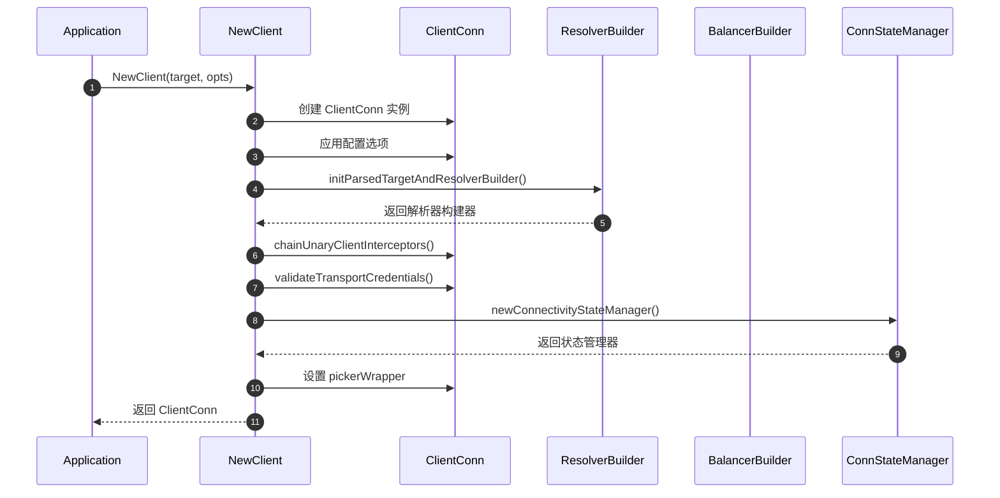
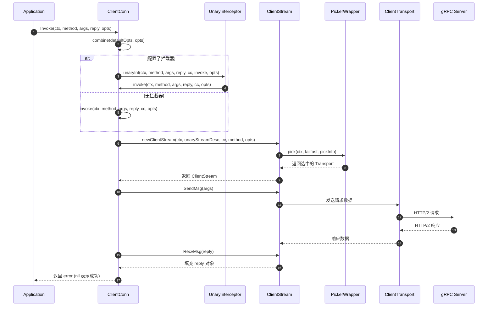
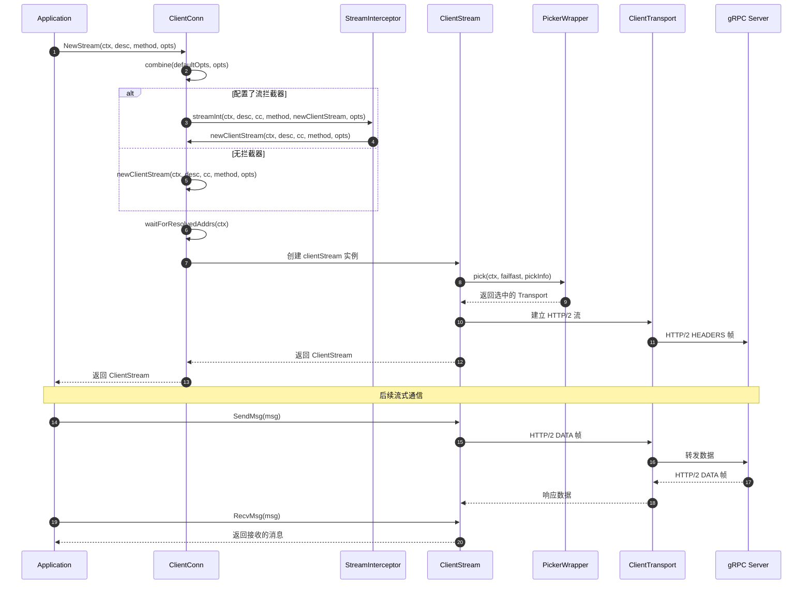

# gRPC-Go 客户端连接模块 API 详细规格

## API 概览

客户端连接模块提供以下核心 API：
- 连接创建：`NewClient`、`Dial`、`DialContext`
- RPC 调用：`Invoke`、`NewStream`
- 连接管理：`Connect`、`GetState`、`WaitForStateChange`、`Close`
- 配置选项：各种 `DialOption` 函数

---

## 1. 连接创建 API

### 1.1 NewClient

#### 基本信息
- **名称：** `NewClient`
- **协议/方法：** Go 函数调用 `func NewClient(target string, opts ...DialOption) (*ClientConn, error)`
- **幂等性：** 否（每次调用创建新连接）

#### 请求结构体
```go
// NewClient 参数结构
type NewClientParams struct {
    Target string       // 目标服务地址，支持多种格式
    Opts   []DialOption // 连接配置选项列表
}
```

| 字段 | 类型 | 必填 | 默认 | 约束 | 说明 |
|------|------|------|------|------|------|
| target | string | 是 | - | 非空字符串 | 目标服务地址，如 "localhost:50051" |
| opts | []DialOption | 否 | 默认选项 | - | 连接配置选项数组 |

#### 响应结构体
```go
type NewClientResponse struct {
    Conn *ClientConn // 创建的客户端连接
    Err  error       // 错误信息（如果创建失败）
}
```

| 字段 | 类型 | 必填 | 默认 | 约束 | 说明 |
|------|------|------|------|------|------|
| Conn | *ClientConn | 成功时必填 | nil | - | 创建的客户端连接实例 |
| Err | error | 失败时必填 | nil | - | 创建失败的错误信息 |

#### 入口函数与关键代码
```go
func NewClient(target string, opts ...DialOption) (conn *ClientConn, err error) {
    // 1. 初始化 ClientConn 基础结构
    cc := &ClientConn{
        target: target,
        conns:  make(map[*addrConn]struct{}),
        dopts:  defaultDialOptions(),
    }
    
    // 2. 设置上下文和取消函数
    cc.ctx, cc.cancel = context.WithCancel(context.Background())
    
    // 3. 应用全局和局部配置选项
    for _, opt := range globalDialOptions {
        opt.apply(&cc.dopts)
    }
    for _, opt := range opts {
        opt.apply(&cc.dopts)
    }
    
    // 4. 初始化解析器构建器
    if err := cc.initParsedTargetAndResolverBuilder(); err != nil {
        return nil, err
    }
    
    // 5. 构建拦截器链
    chainUnaryClientInterceptors(cc)
    chainStreamClientInterceptors(cc)
    
    // 6. 验证传输凭证配置
    if err := cc.validateTransportCredentials(); err != nil {
        return nil, err
    }
    
    // 7. 初始化连接状态管理器
    cc.csMgr = newConnectivityStateManager(cc.ctx, cc.channelz)
    cc.pickerWrapper = newPickerWrapper()
    
    return cc, nil
}
```

#### 上层适配/调用链核心代码
```go
// 应用层典型调用方式
func createGRPCClient(serverAddr string) (*pb.GreeterClient, error) {
    // 创建连接
    conn, err := grpc.NewClient(serverAddr,
        grpc.WithTransportCredentials(insecure.NewCredentials()),
        grpc.WithDefaultServiceConfig(`{"loadBalancingPolicy":"round_robin"}`),
    )
    if err != nil {
        return nil, fmt.Errorf("连接失败: %w", err)
    }
    
    // 创建服务客户端
    client := pb.NewGreeterClient(conn)
    return client, nil
}
```

#### 时序图（请求→响应）


#### 异常/回退与性能要点

**错误处理：**
- `target` 为空：返回 `InvalidArgument` 错误
- 解析器初始化失败：返回相应的解析错误
- 传输凭证验证失败：返回认证配置错误
- 内存分配失败：返回系统资源错误

**性能要点：**
- 连接创建是轻量级操作，不涉及网络 I/O
- 实际网络连接在首次 RPC 调用时建立
- 支持连接池复用，避免重复创建开销
- 配置选项应用为 O(n) 时间复杂度

---

### 1.2 Dial（已废弃，推荐使用 NewClient）

#### 基本信息
- **名称：** `Dial`
- **协议/方法：** Go 函数调用 `func Dial(target string, opts ...DialOption) (*ClientConn, error)`
- **幂等性：** 否

#### 入口函数与关键代码
```go
func Dial(target string, opts ...DialOption) (*ClientConn, error) {
    // 直接调用 DialContext，使用背景上下文
    return DialContext(context.Background(), target, opts...)
}
```

---

## 2. RPC 调用 API

### 2.1 Invoke（一元 RPC 调用）

#### 基本信息
- **名称：** `Invoke`
- **协议/方法：** 方法调用 `func (cc *ClientConn) Invoke(ctx context.Context, method string, args, reply any, opts ...CallOption) error`
- **幂等性：** 取决于具体的 RPC 方法实现

#### 请求结构体
```go
type InvokeParams struct {
    Ctx    context.Context // 调用上下文，控制超时和取消
    Method string          // RPC 方法名，格式：/package.service/method
    Args   any            // 请求参数，需要是 protobuf 消息类型
    Reply  any            // 响应接收器，需要是 protobuf 消息类型
    Opts   []CallOption   // 调用选项
}
```

| 字段 | 类型 | 必填 | 默认 | 约束 | 说明 |
|------|------|------|------|------|------|
| ctx | context.Context | 是 | - | 非 nil | 调用上下文，用于超时控制 |
| method | string | 是 | - | 格式：/service/method | RPC 方法的完整路径 |
| args | any | 是 | - | protobuf 消息 | 请求参数对象 |
| reply | any | 是 | - | protobuf 消息指针 | 响应接收对象 |
| opts | []CallOption | 否 | 空数组 | - | 调用级别的选项 |

#### 响应结构体
```go
// Invoke 直接修改 reply 参数，返回 error
type InvokeResult struct {
    Error error // 调用错误，nil 表示成功
}
```

#### 入口函数与关键代码
```go
func (cc *ClientConn) Invoke(ctx context.Context, method string, args, reply any, opts ...CallOption) error {
    // 1. 合并默认和调用时的选项
    opts = combine(cc.dopts.callOptions, opts)
    
    // 2. 应用一元拦截器（如果配置了）
    if cc.dopts.unaryInt != nil {
        return cc.dopts.unaryInt(ctx, method, args, reply, cc, invoke, opts...)
    }
    
    // 3. 执行实际的调用逻辑
    return invoke(ctx, method, args, reply, cc, opts...)
}

// 实际调用实现
func invoke(ctx context.Context, method string, req, reply any, cc *ClientConn, opts ...CallOption) error {
    // 1. 创建一元调用的客户端流
    cs, err := newClientStream(ctx, unaryStreamDesc, cc, method, opts...)
    if err != nil {
        return err
    }
    
    // 2. 发送请求消息
    if err := cs.SendMsg(req); err != nil {
        return err
    }
    
    // 3. 接收响应消息
    return cs.RecvMsg(reply)
}
```

#### 上层适配/调用链核心代码
```go
// 生成代码中的典型调用模式
func (c *greeterClient) SayHello(ctx context.Context, in *HelloRequest, opts ...grpc.CallOption) (*HelloReply, error) {
    out := new(HelloReply)
    err := c.cc.Invoke(ctx, "/helloworld.Greeter/SayHello", in, out, opts...)
    if err != nil {
        return nil, err
    }
    return out, nil
}

// 应用层使用示例
func callGreeterService(client pb.GreeterClient) error {
    ctx, cancel := context.WithTimeout(context.Background(), time.Second)
    defer cancel()
    
    resp, err := client.SayHello(ctx, &pb.HelloRequest{Name: "World"})
    if err != nil {
        return fmt.Errorf("调用失败: %w", err)
    }
    
    log.Printf("响应: %s", resp.Message)
    return nil
}
```

#### 时序图（请求→响应）


#### 异常/回退与性能要点

**错误处理：**
- 连接不可用：返回 `Unavailable` 状态码
- 请求超时：返回 `DeadlineExceeded` 状态码
- 服务端错误：返回相应的 gRPC 状态码
- 序列化失败：返回 `Internal` 状态码

**重试策略：**
- 支持可配置的重试策略
- 只对幂等方法进行重试
- 指数退避算法控制重试间隔
- 最大重试次数限制

**性能优化：**
- 连接复用避免重复握手
- 请求管道化提高吞吐量
- 压缩减少网络传输量
- 连接池管理减少资源消耗

---

### 2.2 NewStream（流式 RPC 调用）

#### 基本信息
- **名称：** `NewStream`
- **协议/方法：** 方法调用 `func (cc *ClientConn) NewStream(ctx context.Context, desc *StreamDesc, method string, opts ...CallOption) (ClientStream, error)`
- **幂等性：** 否（每次调用创建新流）

#### 请求结构体
```go
type NewStreamParams struct {
    Ctx    context.Context // 流的生命周期上下文
    Desc   *StreamDesc     // 流描述符，定义流的特性
    Method string          // RPC 方法名
    Opts   []CallOption    // 调用选项
}

// 流描述符结构
type StreamDesc struct {
    StreamName    string // 流名称
    Handler       StreamHandler // 服务端处理器（客户端不使用）
    ServerStreams bool   // 是否为服务端流
    ClientStreams bool   // 是否为客户端流
}
```

| 字段 | 类型 | 必填 | 默认 | 约束 | 说明 |
|------|------|------|------|------|------|
| ctx | context.Context | 是 | - | 非 nil | 流的生命周期上下文 |
| desc | *StreamDesc | 是 | - | 非 nil | 流的描述信息 |
| method | string | 是 | - | 格式：/service/method | RPC 方法路径 |
| opts | []CallOption | 否 | 空数组 | - | 流级别选项 |

#### 响应结构体
```go
type NewStreamResult struct {
    Stream ClientStream // 创建的客户端流
    Error  error        // 创建错误
}

// 客户端流接口
type ClientStream interface {
    Header() (metadata.MD, error)         // 获取响应头
    Trailer() metadata.MD                 // 获取响应尾部
    CloseSend() error                     // 关闭发送端
    Context() context.Context             // 获取流上下文
    SendMsg(m any) error                 // 发送消息
    RecvMsg(m any) error                 // 接收消息
}
```

#### 入口函数与关键代码
```go
func (cc *ClientConn) NewStream(ctx context.Context, desc *StreamDesc, method string, opts ...CallOption) (ClientStream, error) {
    // 1. 合并调用选项
    opts = combine(cc.dopts.callOptions, opts)
    
    // 2. 应用流拦截器（如果配置了）
    if cc.dopts.streamInt != nil {
        return cc.dopts.streamInt(ctx, desc, cc, method, newClientStream, opts...)
    }
    
    // 3. 创建实际的客户端流
    return newClientStream(ctx, desc, cc, method, opts...)
}

func newClientStream(ctx context.Context, desc *StreamDesc, cc *ClientConn, method string, opts ...CallOption) (_ ClientStream, err error) {
    // 1. 检查连接状态，确保不在空闲状态
    if err := cc.idlenessMgr.OnCallBegin(); err != nil {
        return nil, err
    }
    
    // 2. 解析调用选项
    c := defaultCallInfo()
    for _, o := range opts {
        if err := o.before(c); err != nil {
            return nil, toRPCErr(err)
        }
    }
    
    // 3. 等待解析器首次更新
    if err := cc.waitForResolvedAddrs(ctx); err != nil {
        return nil, err
    }
    
    // 4. 创建客户端流实例
    cs := &clientStream{
        callHdr: &transport.CallHdr{
            Host:           cc.authority,
            Method:         method,
            ContentSubtype: c.contentSubtype,
        },
        ctx:    ctx,
        methodConfig: &mc,
        opts:   opts,
        callInfo: c,
        cc:     cc,
        desc:   desc,
    }
    
    // 5. 选择连接并建立流
    return cs, cs.newAttemptLocked(false /* isTransparent */)
}
```

#### 时序图（请求→响应）


#### 异常/回退与性能要点

**错误处理：**
- 连接选择失败：返回 `Unavailable` 错误
- 流建立超时：返回 `DeadlineExceeded` 错误
- 网络连接断开：触发重连和流重建
- 流控窗口耗尽：阻塞发送直到窗口恢复

**流管理：**
- 支持客户端流、服务端流、双向流
- 自动流控管理避免内存溢出
- 流取消传播到服务端
- 连接断开时自动清理流资源

**性能要点：**
- HTTP/2 多路复用支持并发流
- 流窗口大小可配置优化吞吐量
- 支持流压缩减少带宽消耗
- 异步发送接收提高并发性能

---

## 3. 连接管理 API

### 3.1 GetState

#### 基本信息
- **名称：** `GetState`
- **协议/方法：** 方法调用 `func (cc *ClientConn) GetState() connectivity.State`
- **幂等性：** 是（只读操作）

#### 入口函数与关键代码
```go
func (cc *ClientConn) GetState() connectivity.State {
    return cc.csMgr.getState()
}

func (csm *connectivityStateManager) getState() connectivity.State {
    csm.mu.Lock()
    defer csm.mu.Unlock()
    return csm.state
}
```

**状态枚举：**
- `Idle`：空闲状态，未建立连接
- `Connecting`：正在建立连接
- `Ready`：连接就绪，可处理请求
- `TransientFailure`：临时失败，正在重试
- `Shutdown`：连接已关闭

### 3.2 WaitForStateChange

#### 基本信息
- **名称：** `WaitForStateChange`
- **协议/方法：** 方法调用 `func (cc *ClientConn) WaitForStateChange(ctx context.Context, sourceState connectivity.State) bool`
- **幂等性：** 是

#### 入口函数与关键代码
```go
func (cc *ClientConn) WaitForStateChange(ctx context.Context, sourceState connectivity.State) bool {
    ch := cc.csMgr.getNotifyChan()
    if cc.csMgr.getState() != sourceState {
        return true // 状态已经改变
    }
    
    select {
    case <-ctx.Done():
        return false // 上下文超时或取消
    case <-ch:
        return true // 状态发生变化
    }
}
```

### 3.3 Connect

#### 基本信息
- **名称：** `Connect`
- **协议/方法：** 方法调用 `func (cc *ClientConn) Connect()`
- **幂等性：** 是（重复调用无副作用）

#### 入口函数与关键代码
```go
func (cc *ClientConn) Connect() {
    // 1. 尝试退出空闲模式
    if err := cc.idlenessMgr.ExitIdleMode(); err != nil {
        cc.addTraceEvent(err.Error())
        return
    }
    
    // 2. 通知负载均衡器退出空闲
    cc.mu.Lock()
    cc.balancerWrapper.exitIdle()
    cc.mu.Unlock()
}
```

### 3.4 Close

#### 基本信息
- **名称：** `Close`
- **协议/方法：** 方法调用 `func (cc *ClientConn) Close() error`
- **幂等性：** 是（重复关闭无副作用）

#### 入口函数与关键代码
```go
func (cc *ClientConn) Close() error {
    defer cc.cancel() // 取消上下文
    
    cc.mu.Lock()
    if cc.conns == nil {
        cc.mu.Unlock()
        return ErrClientConnClosing
    }
    
    // 关闭所有连接
    conns := cc.conns
    cc.conns = nil
    cc.mu.Unlock()
    
    // 清理资源
    for ac := range conns {
        ac.tearDown(ErrClientConnClosing)
    }
    
    // 关闭组件
    if cc.resolverWrapper != nil {
        cc.resolverWrapper.close()
    }
    if cc.balancerWrapper != nil {
        cc.balancerWrapper.close()
    }
    
    return nil
}
```

---

## 4. 配置选项 API

### 4.1 WithTransportCredentials

#### 基本信息
```go
func WithTransportCredentials(creds credentials.TransportCredentials) DialOption
```

设置传输层安全凭证，支持 TLS、mTLS 等安全协议。

### 4.2 WithDefaultServiceConfig

#### 基本信息
```go
func WithDefaultServiceConfig(s string) DialOption
```

设置默认的服务配置，包括负载均衡策略、重试策略等。

### 4.3 WithUnaryInterceptor

#### 基本信息
```go
func WithUnaryInterceptor(f UnaryClientInterceptor) DialOption
```

设置一元 RPC 调用拦截器，用于实现认证、日志、监控等横切关注点。

### 4.4 WithStreamInterceptor

#### 基本信息
```go
func WithStreamInterceptor(f StreamClientInterceptor) DialOption
```

设置流式 RPC 调用拦截器。

## 使用最佳实践

1. **连接管理：**
   - 复用 ClientConn 实例，避免频繁创建
   - 应用退出时主动调用 Close() 清理资源
   - 监控连接状态，实现健康检查

2. **错误处理：**
   - 检查返回的 gRPC 状态码
   - 实现适当的重试策略
   - 区分临时错误和永久错误

3. **性能优化：**
   - 配置合适的消息大小限制
   - 使用连接池管理多个服务连接
   - 启用压缩减少网络传输量

4. **安全配置：**
   - 生产环境必须使用 TLS
   - 实现客户端认证和授权
   - 定期更新证书和密钥
