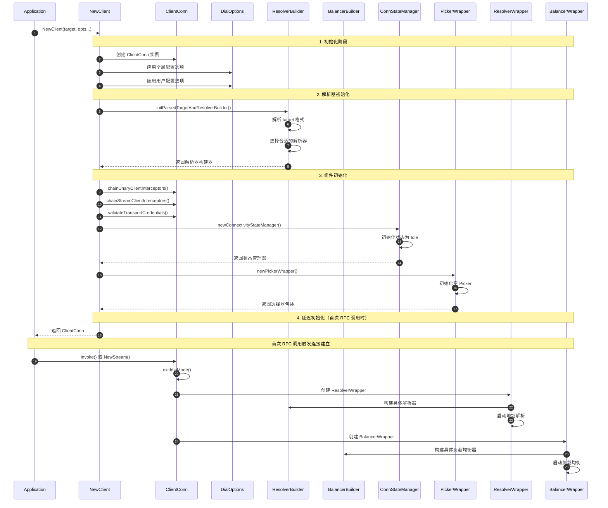
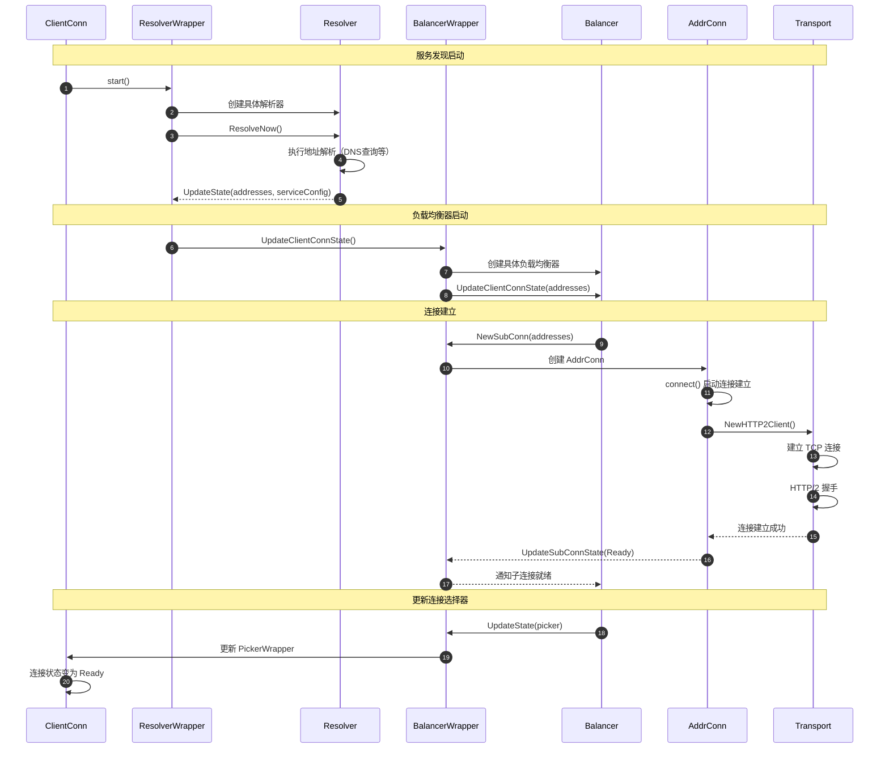
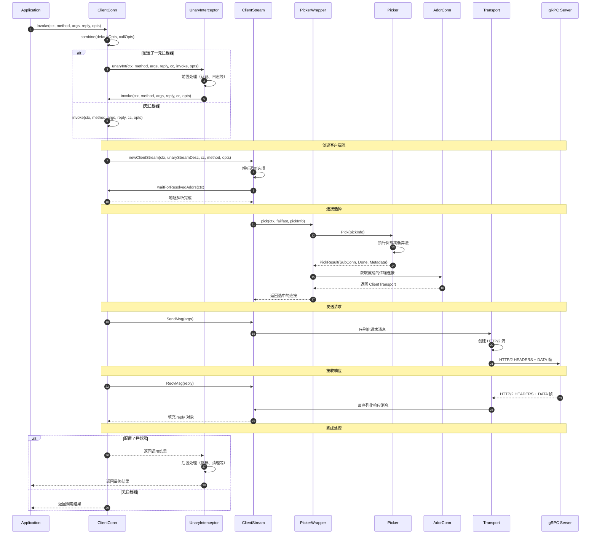
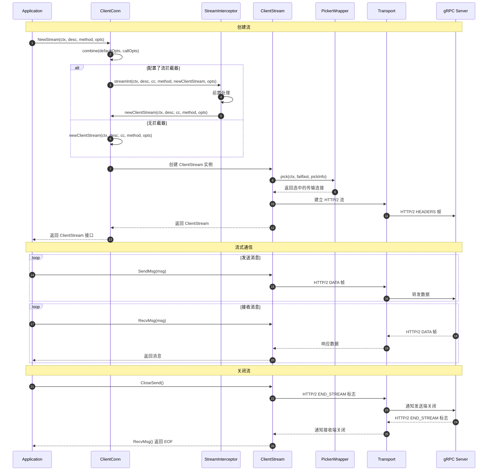
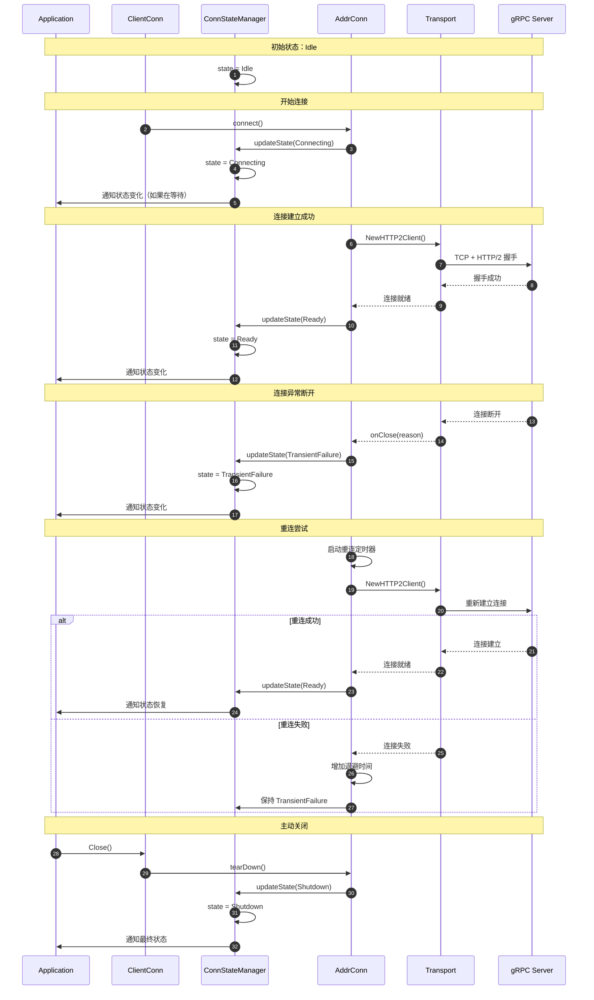
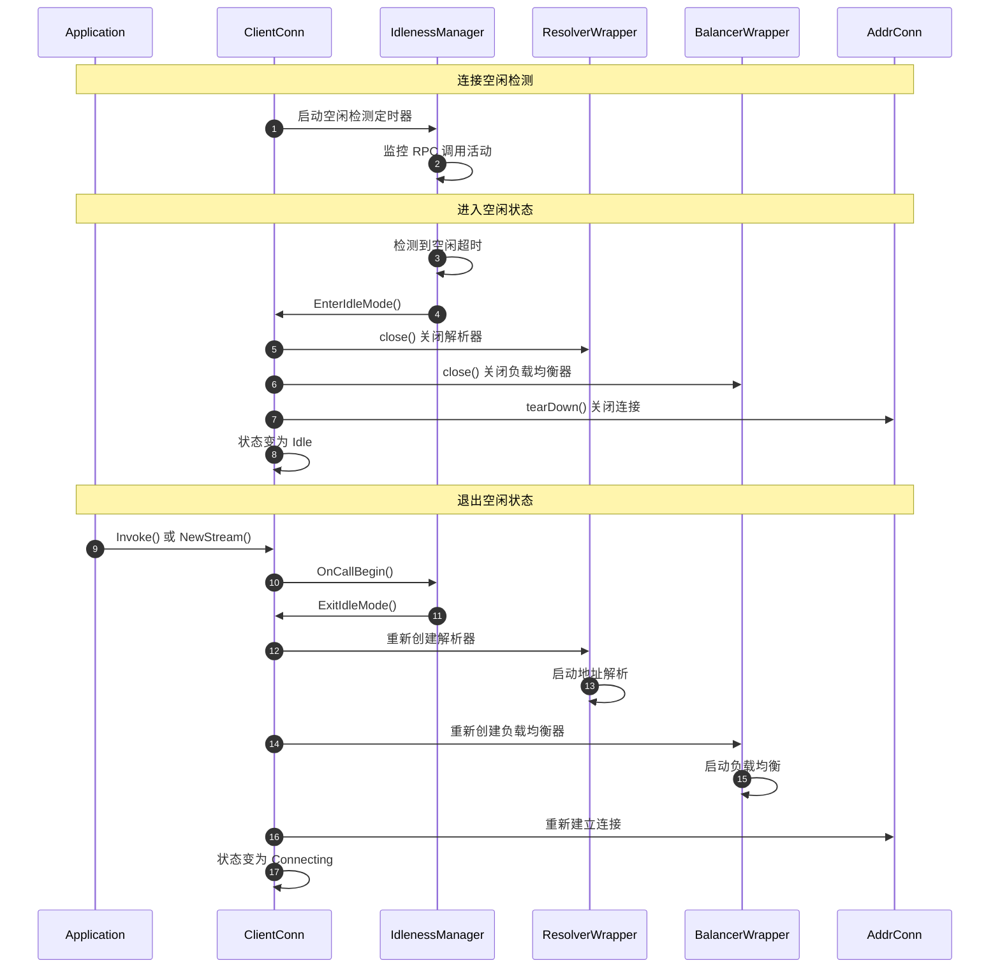
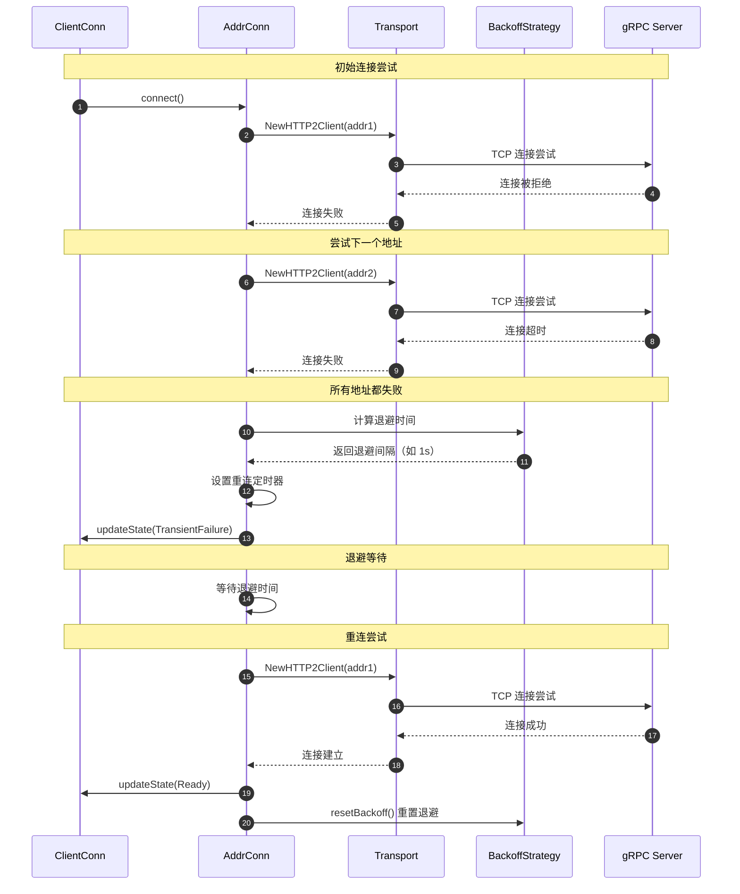
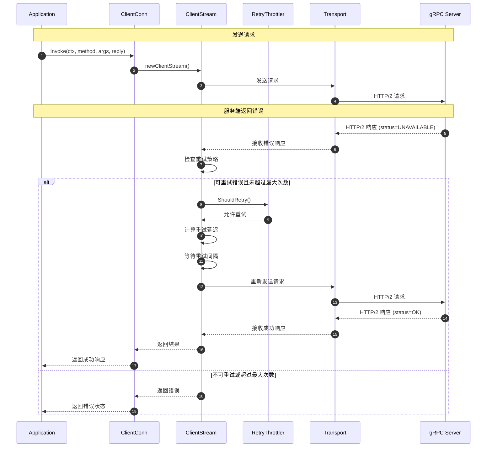
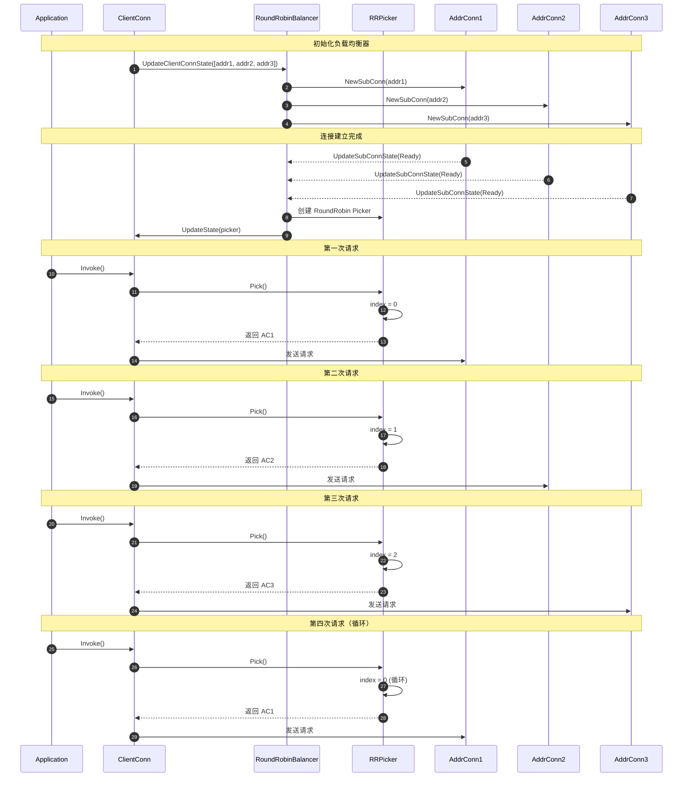
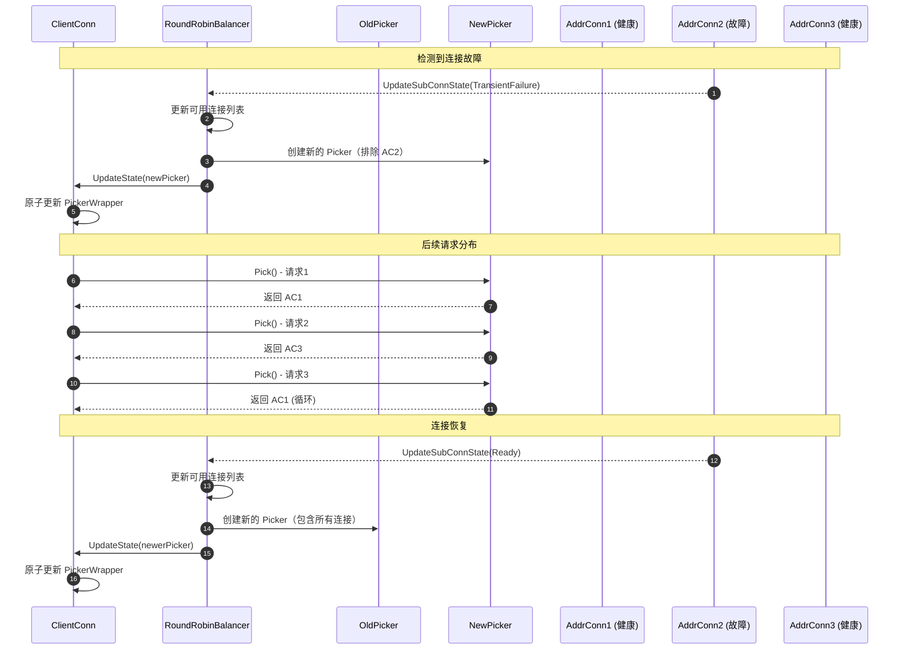

# gRPC-Go 客户端连接模块时序图

## 概述

本文档详细描述了 gRPC-Go 客户端连接模块在不同场景下的交互时序，包括连接建立、RPC 调用、状态管理、故障处理等关键流程。通过时序图和详细说明，帮助理解客户端连接的完整生命周期。

---

## 1. 连接建立时序图

### 1.1 NewClient 连接创建流程



**时序说明：**

1. **初始化阶段（步骤1-4）：**
   - 创建 `ClientConn` 基础结构
   - 应用全局和用户指定的配置选项
   - 设置基本的上下文和取消机制

2. **解析器初始化（步骤5-8）：**
   - 解析目标地址格式（如 `dns:///example.com:80`）
   - 根据 scheme 选择对应的解析器构建器
   - 验证解析器的可用性

3. **组件初始化（步骤9-16）：**
   - 构建拦截器调用链
   - 验证传输层安全配置
   - 初始化连接状态管理器和选择器包装

4. **延迟激活（步骤17-24）：**
   - `NewClient` 返回时连接处于 `Idle` 状态
   - 首次 RPC 调用时才真正启动解析器和负载均衡器
   - 这种设计避免了不必要的资源消耗

### 1.2 服务发现与负载均衡启动



**关键时间点：**
- **T0-T1：** 解析器启动和地址发现（通常 100-500ms）
- **T2-T3：** 负载均衡器初始化（< 10ms）
- **T4-T6：** TCP 连接建立（20-2000ms，取决于网络）
- **T7-T8：** HTTP/2 握手（10-100ms）
- **T9-T10：** 状态更新和选择器就绪（< 5ms）

---

## 2. RPC 调用时序图

### 2.1 一元 RPC 调用流程



**性能分析：**
- **连接选择：** < 1ms（无锁算法）
- **消息序列化：** 1-10ms（取决于消息大小）
- **网络传输：** 1-100ms（取决于网络延迟）
- **消息反序列化：** 1-10ms
- **总体延迟：** P95 通常在 10-200ms 之间

### 2.2 流式 RPC 调用流程



**流控机制：**
- HTTP/2 流级别窗口控制发送速率
- 连接级别窗口控制总体流量
- 背压机制防止内存溢出
- 动态窗口调整优化吞吐量

---

## 3. 连接状态管理时序图

### 3.1 连接状态变化流程



**状态监控示例：**
```go
// 应用层监控连接状态
go func() {
    for {
        state := conn.GetState()
        log.Printf("连接状态: %v", state)
        
        if state == connectivity.Shutdown {
            break
        }
        
        // 等待状态变化
        conn.WaitForStateChange(context.Background(), state)
    }
}()
```

### 3.2 空闲管理时序图



**空闲管理配置：**
```go
conn, err := grpc.NewClient(target,
    grpc.WithIdleTimeout(30*time.Minute), // 30分钟无活动进入空闲
)
```

---

## 4. 故障处理时序图

### 4.1 连接失败重试流程



**退避策略：**
- 初始间隔：1 秒
- 最大间隔：120 秒
- 退避倍数：1.6
- 随机抖动：±20%

### 4.2 请求失败处理流程



**重试配置示例：**
```json
{
  "methodConfig": [{
    "name": [{"service": "example.Service"}],
    "retryPolicy": {
      "maxAttempts": 3,
      "initialBackoff": "0.1s",
      "maxBackoff": "1s",
      "backoffMultiplier": 2,
      "retryableStatusCodes": ["UNAVAILABLE", "DEADLINE_EXCEEDED"]
    }
  }]
}
```

---

## 5. 负载均衡时序图

### 5.1 Round Robin 负载均衡



### 5.2 连接故障时的负载均衡调整



---

## 6. 性能分析与优化

### 关键性能指标

1. **连接建立时间：**
   - DNS 解析：50-200ms
   - TCP 握手：1-100ms（取决于 RTT）
   - TLS 握手：2-200ms（取决于证书链）
   - HTTP/2 握手：1-10ms

2. **RPC 调用延迟：**
   - 连接选择：< 1ms（无锁算法）
   - 序列化：1-10ms（取决于消息大小）
   - 网络传输：RTT + 处理时间
   - 反序列化：1-10ms

3. **吞吐量优化：**
   - HTTP/2 多路复用：单连接支持数百并发流
   - 连接池：减少连接建立开销
   - 消息压缩：减少网络传输量
   - 批量操作：减少网络往返次数

### 并发安全保证

1. **无锁数据结构：**
   - `atomic.Value` 存储 Picker，避免读锁竞争
   - 原子操作更新连接状态
   - 无锁连接选择算法

2. **细粒度锁：**
   - 连接状态使用独立的互斥锁
   - 地址连接使用独立的状态锁
   - 避免全局锁竞争

3. **异步处理：**
   - 状态变化通过 channel 异步通知
   - 连接建立在独立 goroutine 中进行
   - 避免阻塞主调用路径

通过这些详细的时序图和说明，可以深入理解 gRPC-Go 客户端连接模块的工作机制，为性能优化和故障诊断提供重要参考。
