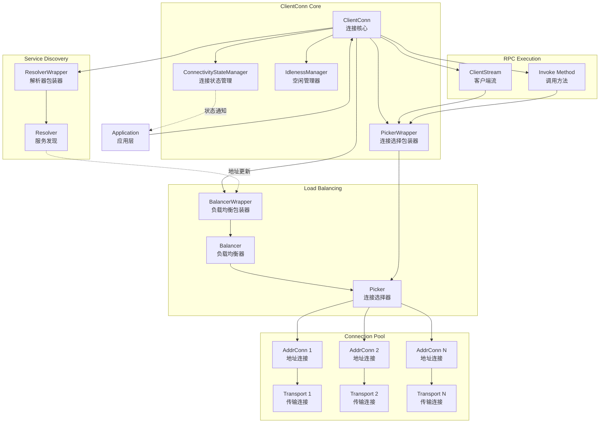

# gRPC-Go 客户端连接模块概览

## 模块职责与边界

### 核心职责
客户端连接模块（ClientConn）是 gRPC-Go 客户端的核心组件，负责管理与 gRPC 服务端的连接生命周期和 RPC 调用的执行。该模块封装了连接建立、服务发现、负载均衡、连接池管理等复杂逻辑，为上层应用提供简洁统一的 RPC 调用接口。

### 输入输出
- **输入：** 
  - 目标服务地址（target）
  - 连接配置选项（DialOption）
  - RPC 方法调用请求（method、args）
  - 调用选项（CallOption）

- **输出：**
  - 建立的客户端连接（ClientConn）
  - RPC 调用响应结果
  - 连接状态变化通知
  - 错误状态信息

### 上下游依赖
- **上游依赖：** 应用层 RPC 调用代码
- **下游依赖：**
  - Resolver（服务发现模块）
  - Balancer（负载均衡模块）
  - Transport（传输层模块）
  - Credentials（认证凭证模块）
  - Interceptor（拦截器模块）

### 生命周期
1. **初始化阶段：** 通过 `NewClient()` 或 `Dial()` 创建连接
2. **连接建立：** 启动服务发现和负载均衡器
3. **活跃期：** 处理 RPC 调用和连接维护
4. **空闲管理：** 支持连接空闲和恢复机制
5. **关闭阶段：** 清理资源和关闭连接

## 模块架构图



**架构说明：**

1. **连接核心层：**
   - `ClientConn` 作为整个模块的核心控制器
   - `ConnectivityStateManager` 管理连接状态变化和通知
   - `PickerWrapper` 封装连接选择逻辑，支持并发安全
   - `IdlenessManager` 处理连接空闲和激活机制

2. **服务发现层：**
   - `ResolverWrapper` 包装具体的解析器实现
   - `Resolver` 负责将服务名解析为具体的后端地址列表
   - 支持 DNS、passthrough、unix socket 等多种解析方式

3. **负载均衡层：**
   - `BalancerWrapper` 管理负载均衡器的生命周期
   - `Balancer` 实现具体的负载均衡策略（轮询、加权等）
   - `Picker` 为每个 RPC 请求选择合适的连接

4. **连接池层：**
   - `AddrConn` 管理到单个后端地址的连接
   - `Transport` 处理底层 HTTP/2 协议通信
   - 支持连接复用和故障转移

5. **RPC执行层：**
   - `ClientStream` 处理流式 RPC 调用
   - `Invoke` 处理一元 RPC 调用
   - 统一的调用入口和错误处理

**边界条件：**
- 最大连接数由负载均衡器策略决定
- 连接超时默认 20 秒，可配置
- 支持并发调用，线程安全
- 连接失败时自动重试和故障转移

**异常处理：**
- 连接建立失败时返回相应错误码
- 服务不可用时触发重试机制
- 网络异常时自动进行服务发现更新
- 支持熔断和降级策略

**性能要点：**
- 连接复用减少建立开销
- 异步状态更新避免阻塞调用
- 内存池复用减少 GC 压力
- 支持连接预热和保活机制

**版本兼容：**
- 向后兼容 `Dial()` 和 `DialContext()` API
- 新版本推荐使用 `NewClient()` 接口
- 支持渐进式配置迁移

## 核心算法与流程

### 连接建立流程

```go
func NewClient(target string, opts ...DialOption) (*ClientConn, err error) {
    // 1. 初始化 ClientConn 结构
    cc := &ClientConn{
        target: target,
        conns:  make(map[*addrConn]struct{}),
        dopts:  defaultDialOptions(),
    }
    
    // 2. 应用配置选项
    for _, opt := range opts {
        opt.apply(&cc.dopts)
    }
    
    // 3. 初始化解析器和负载均衡器
    if err := cc.initParsedTargetAndResolverBuilder(); err != nil {
        return nil, err
    }
    
    // 4. 设置拦截器链
    chainUnaryClientInterceptors(cc)
    chainStreamClientInterceptors(cc)
    
    // 5. 验证传输凭证
    if err := cc.validateTransportCredentials(); err != nil {
        return nil, err
    }
    
    // 6. 初始化连接状态管理器
    cc.csMgr = newConnectivityStateManager(cc.ctx, cc.channelz)
    cc.pickerWrapper = newPickerWrapper()
    
    // 7. 启动解析器和负载均衡器
    cc.exitIdleMode()
    
    return cc, nil
}
```

**流程说明：**
1. **结构初始化：** 创建 ClientConn 实例，初始化基本字段
2. **配置应用：** 处理全局和局部配置选项
3. **组件初始化：** 根据 target 确定使用的解析器和负载均衡器
4. **拦截器设置：** 构建拦截器调用链
5. **安全验证：** 检查传输层安全配置
6. **状态管理：** 初始化连接状态管理组件
7. **服务启动：** 激活解析器开始服务发现

**复杂度分析：**
- 时间复杂度：O(n)，n 为配置选项数量
- 空间复杂度：O(1)，固定内存分配
- 并发安全：初始化阶段非并发安全，完成后支持并发访问

### RPC 调用流程

```go
func (cc *ClientConn) Invoke(ctx context.Context, method string, args, reply any, opts ...CallOption) error {
    // 1. 合并调用选项
    opts = combine(cc.dopts.callOptions, opts)
    
    // 2. 应用一元拦截器
    if cc.dopts.unaryInt != nil {
        return cc.dopts.unaryInt(ctx, method, args, reply, cc, invoke, opts...)
    }
    
    // 3. 执行实际调用
    return invoke(ctx, method, args, reply, cc, opts...)
}

func invoke(ctx context.Context, method string, req, reply any, cc *ClientConn, opts ...CallOption) error {
    // 1. 创建客户端流
    cs, err := newClientStream(ctx, unaryStreamDesc, cc, method, opts...)
    if err != nil {
        return err
    }
    
    // 2. 发送请求
    if err := cs.SendMsg(req); err != nil {
        return err
    }
    
    // 3. 接收响应
    return cs.RecvMsg(reply)
}
```

**流程说明：**
1. **选项处理：** 合并默认和调用时指定的选项
2. **拦截器执行：** 应用配置的一元拦截器链
3. **流创建：** 创建用于此次调用的客户端流
4. **消息发送：** 序列化请求并发送到服务端
5. **响应接收：** 等待并反序列化服务端响应

**性能优化：**
- 连接选择缓存减少选择开销
- 流对象复用避免频繁分配
- 异步发送减少网络延迟影响

### 连接选择算法

```go
func (pw *pickerWrapper) pick(ctx context.Context, failfast bool, info balancer.PickInfo) (transport.ClientTransport, balancer.PickResult, error) {
    // 1. 获取当前 Picker
    p := pw.picker.Load()
    if p == nil {
        return nil, balancer.PickResult{}, status.Error(codes.Unavailable, "no picker available")
    }
    
    // 2. 执行连接选择
    pickResult, err := p.Pick(info)
    if err != nil {
        return nil, balancer.PickResult{}, err
    }
    
    // 3. 获取选中连接的传输层
    acbw, ok := pickResult.SubConn.(*acBalancerWrapper)
    if !ok {
        return nil, balancer.PickResult{}, status.Error(codes.Internal, "invalid SubConn type")
    }
    
    transport := acbw.ac.getReadyTransport()
    if transport == nil {
        return nil, balancer.PickResult{}, status.Error(codes.Unavailable, "SubConn not ready")
    }
    
    return transport, pickResult, nil
}
```

**算法特点：**
- 无锁设计：使用原子操作避免锁竞争
- 快速失败：连接不可用时立即返回错误
- 状态感知：只选择就绪状态的连接
- 策略可插拔：支持多种负载均衡算法

## 关键数据结构

### ClientConn 结构体

```go
type ClientConn struct {
    // 基础字段
    ctx    context.Context    // 连接生命周期上下文
    cancel context.CancelFunc // 取消函数
    target string             // 目标服务地址
    
    // 组件管理
    csMgr              *connectivityStateManager // 连接状态管理器
    pickerWrapper      *pickerWrapper            // 连接选择器包装
    resolverWrapper    *ccResolverWrapper        // 解析器包装
    balancerWrapper    *ccBalancerWrapper        // 负载均衡器包装
    
    // 连接池
    conns map[*addrConn]struct{} // 活跃连接集合
    
    // 配置选项
    dopts dialOptions // 拨号选项
    
    // 并发控制
    mu sync.RWMutex // 保护可变字段的读写锁
}
```

### 连接状态管理器

```go
type connectivityStateManager struct {
    mu         sync.Mutex        // 状态变更锁
    state      connectivity.State // 当前连接状态
    notifyChan chan struct{}      // 状态变化通知通道
    channelz   *channelz.Channel  // 调试信息通道
    pubSub     *grpcsync.PubSub   // 发布订阅机制
}
```

**状态枚举：**
- `Idle`：空闲状态，未建立连接
- `Connecting`：连接建立中
- `Ready`：连接就绪，可处理请求
- `TransientFailure`：临时失败，正在重试
- `Shutdown`：连接已关闭

### 地址连接结构

```go
type addrConn struct {
    ctx    context.Context    // 连接上下文
    cancel context.CancelFunc // 取消函数
    cc     *ClientConn        // 所属客户端连接
    
    // 连接信息
    addrs   []resolver.Address // 后端地址列表
    transport transport.ClientTransport // 底层传输连接
    
    // 状态管理
    state connectivity.State // 连接状态
    
    // 并发控制
    mu sync.Mutex // 状态变更锁
}
```

## 配置与可观测性

### 主要配置项
- `MaxReceiveMessageSize`：最大接收消息大小（默认 4MB）
- `MaxSendMessageSize`：最大发送消息大小（默认无限制）
- `InitialWindowSize`：HTTP/2 流初始窗口大小（默认 64KB）
- `InitialConnWindowSize`：HTTP/2 连接初始窗口大小（默认 16KB）
- `KeepaliveParams`：连接保活参数
- `ConnectTimeout`：连接建立超时（默认 20 秒）

### 关键指标
- 连接数：当前活跃连接数量
- 连接状态：各状态连接的分布
- RPC 调用量：每秒请求数和响应时间
- 错误率：按错误类型分类的失败率
- 连接建立耗时：从发起到建立成功的时间

### 调试接口
- `GetState()`：获取当前连接状态
- `WaitForStateChange()`：等待状态变化
- `Connect()`：强制建立连接
- Channelz 调试信息：详细的连接和调用统计
