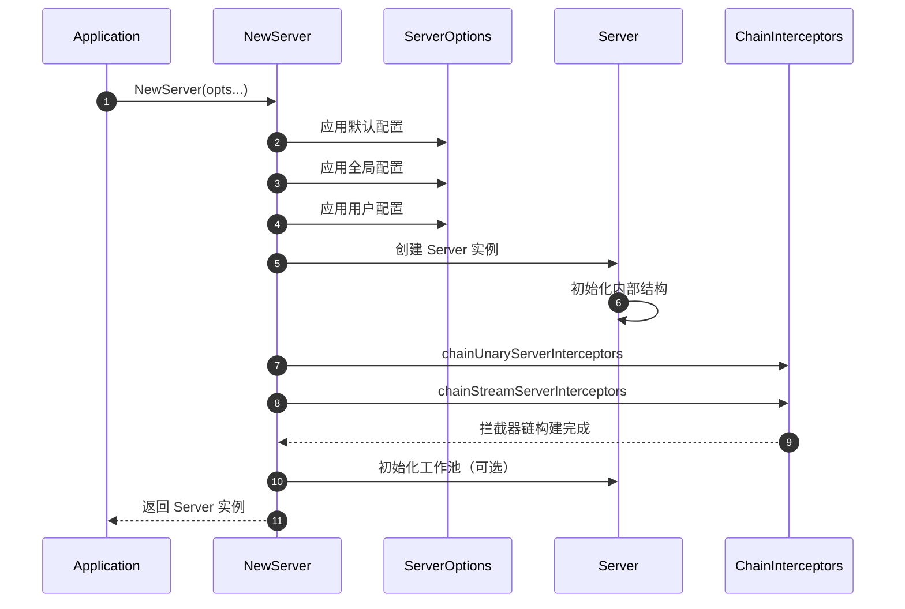
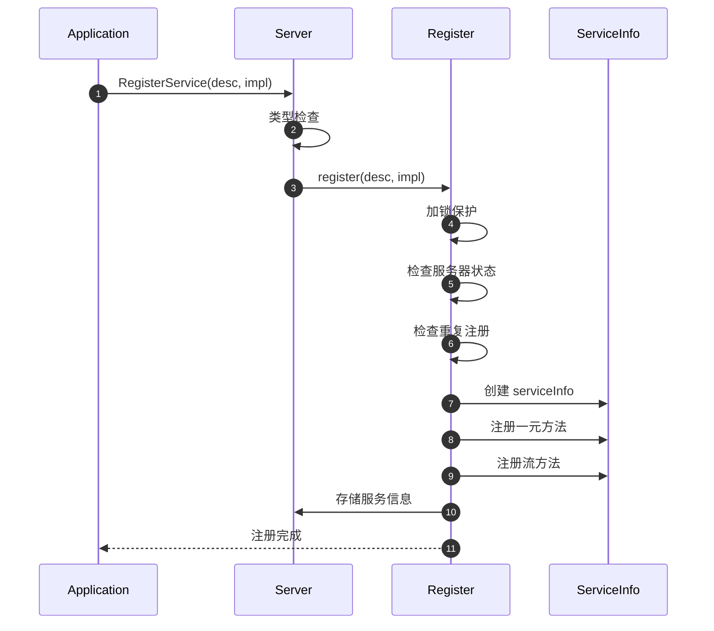
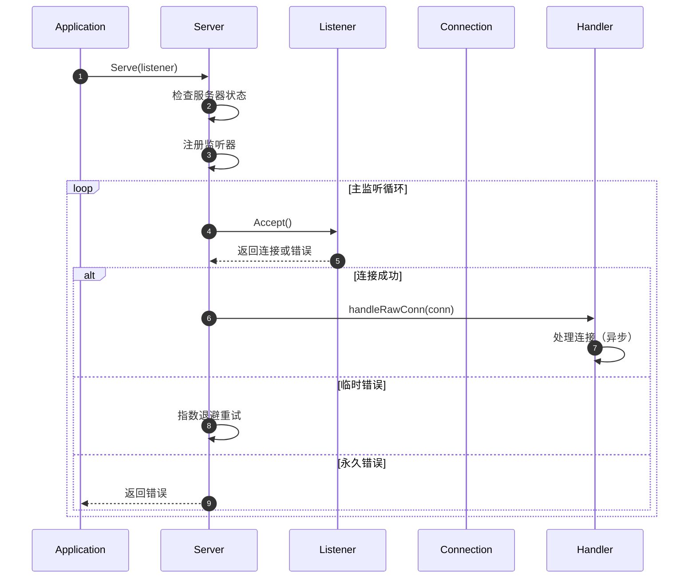
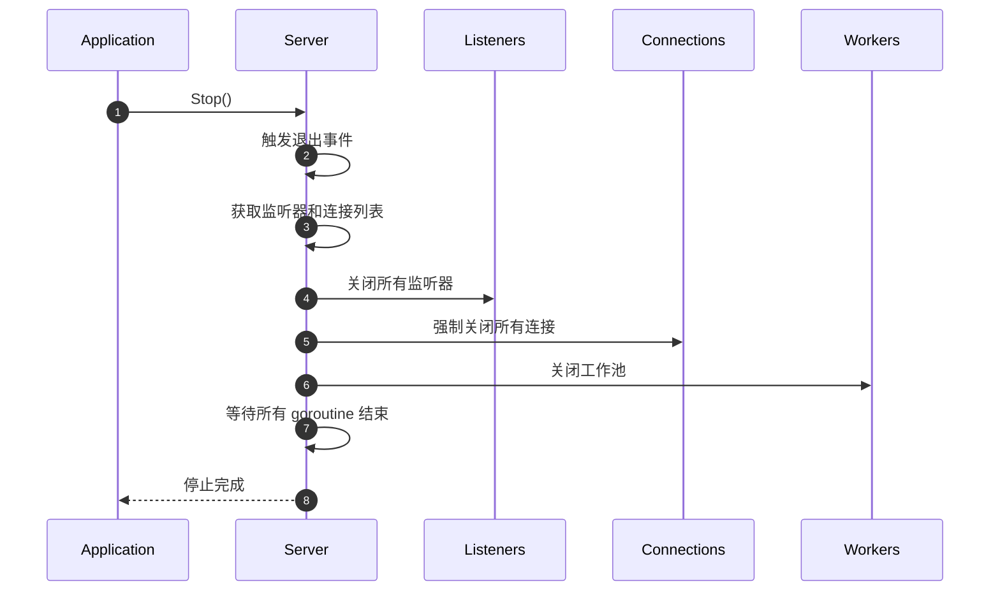
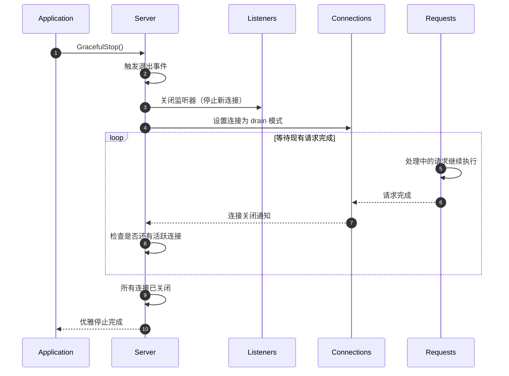

# gRPC-Go 服务端模块 API 文档

## API 概览

服务端模块提供了完整的 gRPC 服务器生命周期管理 API，包括服务器创建、服务注册、启动监听、优雅关闭等核心功能。所有 API 都经过精心设计，确保线程安全和高性能。

## 核心 API 列表

### 服务器管理 API
- `NewServer()` - 创建新的 gRPC 服务器实例
- `RegisterService()` - 注册 gRPC 服务
- `GetServiceInfo()` - 获取已注册服务信息
- `Serve()` - 启动服务器并开始监听
- `Stop()` - 立即停止服务器
- `GracefulStop()` - 优雅停止服务器

### 配置选项 API
- `WriteBufferSize()` - 设置写缓冲区大小
- `ReadBufferSize()` - 设置读缓冲区大小
- `MaxConcurrentStreams()` - 设置最大并发流数量
- `Creds()` - 设置传输凭证
- `UnaryInterceptor()` - 设置一元拦截器
- `StreamInterceptor()` - 设置流拦截器

---

## API 详细规格

### 1. NewServer

#### 基本信息
- **名称：** `NewServer`
- **签名：** `func NewServer(opt ...ServerOption) *Server`
- **功能：** 创建新的 gRPC 服务器实例
- **幂等性：** 否，每次调用创建新实例

#### 请求参数

```go
// ServerOption 服务器配置选项接口
type ServerOption interface {
    apply(*serverOptions)
}

// 配置选项结构（内部使用）
type serverOptions struct {
    creds                 credentials.TransportCredentials
    unaryInt              UnaryServerInterceptor
    streamInt             StreamServerInterceptor
    chainUnaryInts        []UnaryServerInterceptor
    chainStreamInts       []StreamServerInterceptor
    maxConcurrentStreams  uint32
    maxReceiveMessageSize int
    maxSendMessageSize    int
    keepaliveParams       keepalive.ServerParameters
    keepalivePolicy       keepalive.EnforcementPolicy
    initialWindowSize     int32
    initialConnWindowSize int32
    writeBufferSize       int
    readBufferSize        int
    sharedWriteBuffer     bool
    statsHandlers         []stats.Handler
    inTapHandle           tap.ServerInHandle
    numServerWorkers      uint32
}
```

**参数说明表**

| 参数 | 类型 | 必填 | 默认值 | 说明 |
|------|------|:----:|--------|------|
| opt | ...ServerOption | 否 | 默认配置 | 服务器配置选项 |

#### 响应结果

```go
// Server gRPC 服务器实例
type Server struct {
    opts     serverOptions                    // 服务器配置选项
    lis      map[net.Listener]bool           // 监听器映射
    conns    map[string]map[transport.ServerTransport]bool // 连接映射
    services map[string]*serviceInfo         // 服务信息映射
    quit     *grpcsync.Event                 // 退出事件
    done     *grpcsync.Event                 // 完成事件
    channelz *channelz.Server                // Channelz 服务器
}
```

#### 入口函数实现

```go
func NewServer(opt ...ServerOption) *Server {
    // 1. 初始化默认配置
    opts := defaultServerOptions
    
    // 2. 应用全局配置选项
    for _, o := range globalServerOptions {
        o.apply(&opts)
    }
    
    // 3. 应用用户配置选项
    for _, o := range opt {
        o.apply(&opts)
    }
    
    // 4. 创建服务器实例
    s := &Server{
        lis:      make(map[net.Listener]bool),
        opts:     opts,
        conns:    make(map[string]map[transport.ServerTransport]bool),
        services: make(map[string]*serviceInfo),
        quit:     grpcsync.NewEvent(),
        done:     grpcsync.NewEvent(),
        channelz: channelz.RegisterServer(""),
    }
    
    // 5. 构建拦截器链
    chainUnaryServerInterceptors(s)
    chainStreamServerInterceptors(s)
    
    // 6. 初始化条件变量
    s.cv = sync.NewCond(&s.mu)
    
    // 7. 初始化工作池（如果配置了）
    if s.opts.numServerWorkers > 0 {
        s.initServerWorkers()
    }
    
    return s
}
```

#### 调用链分析

```go
// 应用层调用
func main() {
    // 创建服务器实例
    server := grpc.NewServer(
        grpc.MaxConcurrentStreams(100),
        grpc.KeepaliveParams(keepalive.ServerParameters{
            Time:    30 * time.Second,
            Timeout: 5 * time.Second,
        }),
    )
    
    // 注册服务
    pb.RegisterGreeterServer(server, &greeterService{})
    
    // 启动监听
    lis, _ := net.Listen("tcp", ":50051")
    server.Serve(lis)
}
```

#### 时序图



#### 边界与异常

- **配置冲突：** 相同类型的配置选项后者覆盖前者
- **内存分配：** 创建过程中的内存分配失败会导致 panic
- **并发安全：** 创建后的服务器实例是线程安全的
- **资源清理：** 服务器实例需要通过 Stop() 或 GracefulStop() 正确关闭

#### 实践建议

- **配置优化：** 根据业务需求合理设置并发流数量和缓冲区大小
- **拦截器使用：** 优先使用链式拦截器以支持多个中间件
- **资源管理：** 确保服务器实例在程序结束时正确关闭
- **监控集成：** 使用 stats.Handler 集成监控和指标收集

---

### 2. RegisterService

#### 基本信息
- **名称：** `RegisterService`
- **签名：** `func (s *Server) RegisterService(sd *ServiceDesc, ss any)`
- **功能：** 注册 gRPC 服务及其实现
- **幂等性：** 否，重复注册同名服务会导致 panic

#### 请求参数

```go
// ServiceDesc 服务描述结构
type ServiceDesc struct {
    ServiceName string          // 服务名称，格式：package.service
    HandlerType any            // 服务接口类型，用于类型检查
    Methods     []MethodDesc   // 一元方法描述列表
    Streams     []StreamDesc   // 流方法描述列表
    Metadata    any            // 服务元数据
}

// MethodDesc 一元方法描述
type MethodDesc struct {
    MethodName string                                           // 方法名称
    Handler    func(srv any, ctx context.Context, dec func(any) error, interceptor UnaryServerInterceptor) (any, error)
}

// StreamDesc 流方法描述
type StreamDesc struct {
    StreamName    string        // 流方法名称
    Handler       StreamHandler // 流方法处理器
    ServerStreams bool          // 是否为服务端流
    ClientStreams bool          // 是否为客户端流
}
```

**参数说明表**

| 参数 | 类型 | 必填 | 约束 | 说明 |
|------|------|:----:|------|------|
| sd | *ServiceDesc | 是 | 非空 | 服务描述信息 |
| ss | any | 否 | 实现 HandlerType | 服务实现实例 |

#### 响应结果
无返回值，注册失败会导致 panic。

#### 入口函数实现

```go
func (s *Server) RegisterService(sd *ServiceDesc, ss any) {
    // 1. 类型检查（如果提供了实现）
    if ss != nil {
        ht := reflect.TypeOf(sd.HandlerType).Elem()
        st := reflect.TypeOf(ss)
        if !st.Implements(ht) {
            logger.Fatalf("grpc: Server.RegisterService found the handler of type %v that does not satisfy %v", st, ht)
        }
    }
    
    // 2. 执行注册
    s.register(sd, ss)
}

func (s *Server) register(sd *ServiceDesc, ss any) {
    s.mu.Lock()
    defer s.mu.Unlock()
    
    // 3. 检查服务器状态
    if s.serve {
        logger.Fatalf("grpc: Server.RegisterService after Server.Serve for %q", sd.ServiceName)
    }
    
    // 4. 检查重复注册
    if _, ok := s.services[sd.ServiceName]; ok {
        logger.Fatalf("grpc: Server.RegisterService found duplicate service registration for %q", sd.ServiceName)
    }
    
    // 5. 创建服务信息
    info := &serviceInfo{
        serviceImpl: ss,
        methods:     make(map[string]*MethodDesc),
        streams:     make(map[string]*StreamDesc),
        mdata:       sd.Metadata,
    }
    
    // 6. 注册一元方法
    for i := range sd.Methods {
        d := &sd.Methods[i]
        info.methods[d.MethodName] = d
    }
    
    // 7. 注册流方法
    for i := range sd.Streams {
        d := &sd.Streams[i]
        info.streams[d.StreamName] = d
    }
    
    // 8. 存储服务信息
    s.services[sd.ServiceName] = info
}
```

#### 时序图



#### 边界与异常

- **类型不匹配：** 服务实现未实现接口会导致 panic
- **重复注册：** 注册同名服务会导致 panic
- **状态检查：** 服务器启动后注册服务会导致 panic
- **并发安全：** 注册过程使用互斥锁保护

---

### 3. Serve

#### 基本信息
- **名称：** `Serve`
- **签名：** `func (s *Server) Serve(lis net.Listener) error`
- **功能：** 启动服务器并开始监听连接
- **幂等性：** 否，重复调用会返回错误

#### 请求参数

```go
// net.Listener 网络监听器接口
type Listener interface {
    Accept() (Conn, error)  // 接受连接
    Close() error          // 关闭监听器
    Addr() Addr           // 获取监听地址
}
```

**参数说明表**

| 参数 | 类型 | 必填 | 约束 | 说明 |
|------|------|:----:|------|------|
| lis | net.Listener | 是 | 有效的监听器 | 网络监听器实例 |

#### 响应结果

```go
// 返回错误类型
var (
    ErrServerStopped = errors.New("grpc: the server has been stopped")
)
```

#### 入口函数实现

```go
func (s *Server) Serve(lis net.Listener) error {
    s.mu.Lock()
    s.printf("serving")
    s.serve = true
    
    // 1. 检查服务器状态
    if s.lis == nil {
        s.mu.Unlock()
        lis.Close()
        return ErrServerStopped
    }
    
    // 2. 注册监听器
    s.lis[lis] = true
    s.mu.Unlock()
    
    defer func() {
        s.mu.Lock()
        if s.lis != nil && s.lis[lis] {
            delete(s.lis, lis)
        }
        s.mu.Unlock()
    }()
    
    var tempDelay time.Duration
    
    // 3. 主监听循环
    for {
        rawConn, err := lis.Accept()
        if err != nil {
            if ne, ok := err.(interface {
                Temporary() bool
            }); ok && ne.Temporary() {
                // 4. 处理临时错误
                if tempDelay == 0 {
                    tempDelay = 5 * time.Millisecond
                } else {
                    tempDelay *= 2
                }
                if max := 1 * time.Second; tempDelay > max {
                    tempDelay = max
                }
                time.Sleep(tempDelay)
                continue
            }
            return err
        }
        tempDelay = 0
        
        // 5. 处理新连接
        go s.handleRawConn(rawConn)
    }
}
```

#### 时序图



#### 边界与异常

- **监听器状态：** 监听器必须处于可用状态
- **并发连接：** 每个连接在独立的 goroutine 中处理
- **错误处理：** 区分临时错误和永久错误，临时错误会重试
- **资源清理：** 服务器停止时会清理所有监听器

---

### 4. Stop

#### 基本信息
- **名称：** `Stop`
- **签名：** `func (s *Server) Stop()`
- **功能：** 立即停止服务器，强制关闭所有连接
- **幂等性：** 是，重复调用安全

#### 请求参数
无参数。

#### 响应结果
无返回值。

#### 入口函数实现

```go
func (s *Server) Stop() {
    s.quit.Fire()
    
    defer func() {
        s.serveWG.Wait()
        s.done.Fire()
    }()
    
    s.channelzRemoveOnce.Do(func() {
        channelz.RemoveEntry(s.channelz.ID)
    })
    
    s.mu.Lock()
    listeners := s.lis
    s.lis = nil
    conns := s.conns
    s.conns = nil
    s.mu.Unlock()
    
    // 1. 关闭所有监听器
    for lis := range listeners {
        lis.Close()
    }
    
    // 2. 关闭所有连接
    for _, cs := range conns {
        for st := range cs {
            st.Close(errors.New("Server.Stop called"))
        }
    }
    
    // 3. 关闭工作池
    if s.serverWorkerChannelClose != nil {
        s.serverWorkerChannelClose()
    }
}
```

#### 时序图



#### 边界与异常

- **强制关闭：** 不等待正在处理的请求完成
- **资源清理：** 确保所有资源被正确释放
- **并发安全：** 可以从任意 goroutine 安全调用
- **幂等操作：** 重复调用不会产生副作用

---

### 5. GracefulStop

#### 基本信息
- **名称：** `GracefulStop`
- **签名：** `func (s *Server) GracefulStop()`
- **功能：** 优雅停止服务器，等待现有请求完成
- **幂等性：** 是，重复调用安全

#### 请求参数
无参数。

#### 响应结果
无返回值。

#### 入口函数实现

```go
func (s *Server) GracefulStop() {
    s.quit.Fire()
    
    defer func() {
        s.serveWG.Wait()
        s.done.Fire()
    }()
    
    s.channelzRemoveOnce.Do(func() {
        channelz.RemoveEntry(s.channelz.ID)
    })
    
    s.mu.Lock()
    if s.conns == nil {
        s.mu.Unlock()
        return
    }
    
    // 1. 关闭监听器，停止接受新连接
    for lis := range s.lis {
        lis.Close()
    }
    s.lis = nil
    
    // 2. 设置 drain 模式
    if !s.drain {
        for _, cs := range s.conns {
            for st := range cs {
                st.Drain("graceful_stop")
            }
        }
        s.drain = true
    }
    
    // 3. 等待所有连接关闭
    for len(s.conns) != 0 {
        s.cv.Wait()
    }
    s.conns = nil
    s.mu.Unlock()
    
    // 4. 关闭工作池
    if s.serverWorkerChannelClose != nil {
        s.serverWorkerChannelClose()
    }
}
```

#### 时序图



#### 边界与异常

- **优雅关闭：** 等待所有正在处理的请求完成
- **新连接拒绝：** 停止接受新的连接请求
- **超时控制：** 建议在应用层设置超时控制
- **死锁避免：** 内部使用条件变量避免死锁

---

## 配置选项 API

### WriteBufferSize

#### 基本信息
- **名称：** `WriteBufferSize`
- **签名：** `func WriteBufferSize(s int) ServerOption`
- **功能：** 设置写缓冲区大小

```go
func WriteBufferSize(s int) ServerOption {
    return newFuncServerOption(func(o *serverOptions) {
        o.writeBufferSize = s
    })
}
```

### MaxConcurrentStreams

#### 基本信息
- **名称：** `MaxConcurrentStreams`
- **签名：** `func MaxConcurrentStreams(n uint32) ServerOption`
- **功能：** 设置最大并发流数量

```go
func MaxConcurrentStreams(n uint32) ServerOption {
    if n == 0 {
        n = math.MaxUint32
    }
    return newFuncServerOption(func(o *serverOptions) {
        o.maxConcurrentStreams = n
    })
}
```

### UnaryInterceptor

#### 基本信息
- **名称：** `UnaryInterceptor`
- **签名：** `func UnaryInterceptor(i UnaryServerInterceptor) ServerOption`
- **功能：** 设置一元拦截器

```go
func UnaryInterceptor(i UnaryServerInterceptor) ServerOption {
    return newFuncServerOption(func(o *serverOptions) {
        if o.unaryInt != nil {
            panic("The unary server interceptor was already set and may not be reset.")
        }
        o.unaryInt = i
    })
}
```

## 使用示例

### 基本服务器创建和启动

```go
func main() {
    // 1. 创建服务器
    server := grpc.NewServer(
        grpc.MaxConcurrentStreams(1000),
        grpc.WriteBufferSize(64*1024),
        grpc.ReadBufferSize(64*1024),
    )
    
    // 2. 注册服务
    pb.RegisterGreeterServer(server, &greeterService{})
    
    // 3. 创建监听器
    lis, err := net.Listen("tcp", ":50051")
    if err != nil {
        log.Fatalf("Failed to listen: %v", err)
    }
    
    // 4. 启动服务器
    if err := server.Serve(lis); err != nil {
        log.Fatalf("Failed to serve: %v", err)
    }
}
```

### 优雅关闭示例

```go
func main() {
    server := grpc.NewServer()
    pb.RegisterGreeterServer(server, &greeterService{})
    
    lis, _ := net.Listen("tcp", ":50051")
    
    // 启动服务器
    go func() {
        if err := server.Serve(lis); err != nil {
            log.Printf("Server error: %v", err)
        }
    }()
    
    // 等待信号
    c := make(chan os.Signal, 1)
    signal.Notify(c, os.Interrupt, syscall.SIGTERM)
    <-c
    
    // 优雅关闭
    log.Println("Shutting down server...")
    server.GracefulStop()
    log.Println("Server stopped")
}
```

## 最佳实践

1. **配置优化**
   - 根据业务需求设置合适的并发流数量
   - 调整缓冲区大小以优化网络性能
   - 使用链式拦截器支持多个中间件

2. **错误处理**
   - 实现适当的错误恢复机制
   - 使用结构化日志记录服务器事件
   - 监控服务器健康状态

3. **资源管理**
   - 确保服务器正确关闭释放资源
   - 使用优雅关闭避免请求丢失
   - 监控内存和连接使用情况

4. **安全配置**
   - 配置适当的传输凭证
   - 实现认证和授权拦截器
   - 设置合理的超时和限流策略
