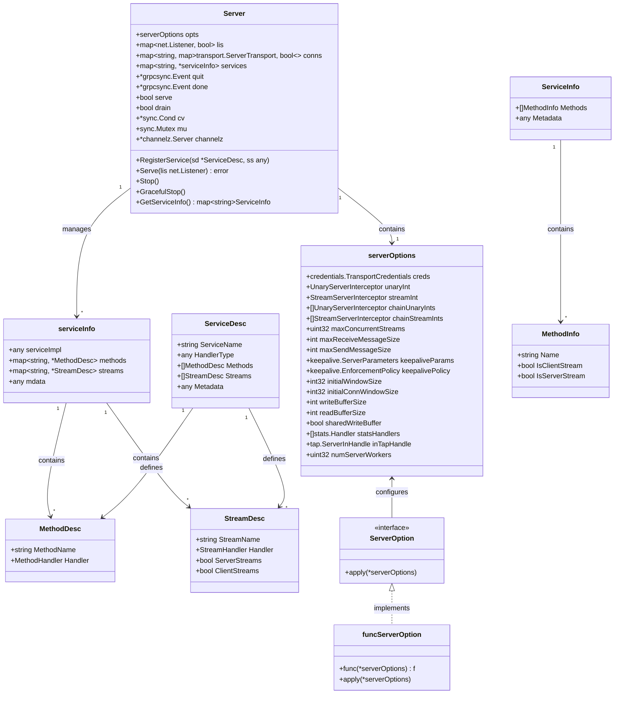
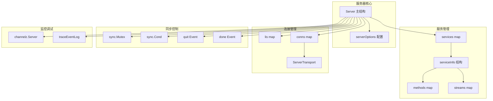

# gRPC-Go 服务端模块数据结构文档

## 数据结构概览

服务端模块的数据结构设计体现了 gRPC 服务器的完整生命周期管理，包括服务器配置、服务注册、连接管理、请求处理等各个方面。所有数据结构都经过精心设计以确保高性能和线程安全。

## 核心数据结构 UML 图



**UML 图说明：**

1. **Server 类：** 核心服务器类，管理所有服务器资源和生命周期
2. **serverOptions 类：** 服务器配置选项，包含所有可配置参数
3. **ServiceDesc/serviceInfo：** 服务描述和内部服务信息管理
4. **MethodDesc/StreamDesc：** 方法和流的描述信息
5. **配置选项模式：** 使用接口和函数式选项模式实现灵活配置

## 详细数据结构分析

### 1. Server 结构

```go
// Server gRPC 服务器核心结构
type Server struct {
    opts serverOptions  // 服务器配置选项
    
    // 同步原语
    mu   sync.Mutex     // 保护以下字段的互斥锁
    cv   *sync.Cond     // 条件变量，用于优雅关闭
    
    // 网络资源管理
    lis   map[net.Listener]bool                              // 监听器映射
    conns map[string]map[transport.ServerTransport]bool     // 连接映射，按监听地址分组
    
    // 服务状态
    serve bool          // 是否正在服务
    drain bool          // 是否处于排水模式（优雅关闭）
    
    // 服务注册
    services map[string]*serviceInfo  // 已注册服务映射
    
    // 生命周期管理
    quit *grpcsync.Event  // 退出信号
    done *grpcsync.Event  // 完成信号
    
    // 并发控制
    serveWG    sync.WaitGroup  // 服务 goroutine 计数
    handlersWG sync.WaitGroup  // 处理器 goroutine 计数
    
    // 监控和调试
    channelz *channelz.Server  // Channelz 服务器实例
    events   traceEventLog     // 事件日志
    
    // 工作池（可选）
    serverWorkerChannel      chan func()  // 工作任务通道
    serverWorkerChannelClose func()       // 工作池关闭函数
}
```

**字段说明：**

| 字段 | 类型 | 作用 | 并发安全性 |
|------|------|------|------------|
| opts | serverOptions | 服务器配置选项 | 只读，创建后不变 |
| mu | sync.Mutex | 保护共享状态 | 互斥锁本身 |
| cv | *sync.Cond | 优雅关闭同步 | 基于 mu |
| lis | map[net.Listener]bool | 活跃监听器 | 受 mu 保护 |
| conns | map[string]map[transport.ServerTransport]bool | 活跃连接 | 受 mu 保护 |
| serve | bool | 服务状态标志 | 受 mu 保护 |
| drain | bool | 排水模式标志 | 受 mu 保护 |
| services | map[string]*serviceInfo | 注册服务 | 受 mu 保护 |
| quit | *grpcsync.Event | 退出信号 | 内部同步 |
| done | *grpcsync.Event | 完成信号 | 内部同步 |

### 2. serverOptions 结构

```go
// serverOptions 服务器配置选项
type serverOptions struct {
    // 安全配置
    creds credentials.TransportCredentials  // 传输凭证
    
    // 拦截器配置
    unaryInt        UnaryServerInterceptor    // 一元拦截器
    streamInt       StreamServerInterceptor   // 流拦截器
    chainUnaryInts  []UnaryServerInterceptor  // 一元拦截器链
    chainStreamInts []StreamServerInterceptor // 流拦截器链
    
    // 并发控制
    maxConcurrentStreams uint32  // 最大并发流数量
    
    // 消息大小限制
    maxReceiveMessageSize int  // 最大接收消息大小
    maxSendMessageSize    int  // 最大发送消息大小
    
    // 连接保活
    keepaliveParams keepalive.ServerParameters    // 保活参数
    keepalivePolicy keepalive.EnforcementPolicy   // 保活策略
    
    // 流控制
    initialWindowSize     int32  // 初始窗口大小
    initialConnWindowSize int32  // 初始连接窗口大小
    staticWindowSize      bool   // 是否使用静态窗口大小
    
    // 缓冲区配置
    writeBufferSize   int   // 写缓冲区大小
    readBufferSize    int   // 读缓冲区大小
    sharedWriteBuffer bool  // 是否共享写缓冲区
    
    // 编解码配置
    codec encoding.CodecV2  // 编解码器
    cp    Compressor        // 压缩器（已废弃）
    dc    Decompressor      // 解压器（已废弃）
    
    // 统计和监控
    statsHandlers []stats.Handler  // 统计处理器列表
    
    // 连接处理
    inTapHandle tap.ServerInHandle  // 连接拦截处理器
    
    // 工作池配置
    numServerWorkers uint32  // 服务器工作协程数量
    
    // 头部表大小
    headerTableSize *uint32  // HTTP/2 头部表大小
    
    // 未知流处理器
    unknownStreamDesc *StreamDesc  // 未知流描述
}
```

**配置分类说明：**

1. **安全配置：** TLS 凭证和认证相关
2. **拦截器配置：** 中间件和请求拦截
3. **性能配置：** 并发、缓冲区、流控制
4. **监控配置：** 统计、追踪、调试
5. **扩展配置：** 自定义处理器和工作池

### 3. ServiceDesc 和 serviceInfo 结构

```go
// ServiceDesc 服务描述（外部定义）
type ServiceDesc struct {
    ServiceName string        // 服务名称，格式：package.service
    HandlerType any          // 服务接口类型，用于类型检查
    Methods     []MethodDesc // 一元方法描述列表
    Streams     []StreamDesc // 流方法描述列表
    Metadata    any          // 服务元数据
}

// serviceInfo 服务信息（内部使用）
type serviceInfo struct {
    serviceImpl any                      // 服务实现实例
    methods     map[string]*MethodDesc   // 一元方法映射
    streams     map[string]*StreamDesc   // 流方法映射
    mdata       any                      // 元数据
}
```

**设计模式说明：**
- `ServiceDesc` 是外部 API，由 protoc 生成的代码使用
- `serviceInfo` 是内部实现，优化了查找性能（使用 map）
- 分离外部接口和内部实现，提供更好的封装

### 4. MethodDesc 和 StreamDesc 结构

```go
// MethodDesc 一元方法描述
type MethodDesc struct {
    MethodName string         // 方法名称
    Handler    MethodHandler  // 方法处理器
}

// MethodHandler 一元方法处理器函数类型
type MethodHandler func(
    srv any,                           // 服务实现实例
    ctx context.Context,               // 请求上下文
    dec func(any) error,              // 解码函数
    interceptor UnaryServerInterceptor, // 拦截器
) (any, error)

// StreamDesc 流方法描述
type StreamDesc struct {
    StreamName    string        // 流方法名称
    Handler       StreamHandler // 流方法处理器
    ServerStreams bool          // 是否为服务端流
    ClientStreams bool          // 是否为客户端流
}

// StreamHandler 流方法处理器函数类型
type StreamHandler func(
    srv any,         // 服务实现实例
    stream ServerStream, // 服务器流
) error
```

**流类型说明：**

| ClientStreams | ServerStreams | 流类型 | 说明 |
|:-------------:|:-------------:|--------|------|
| false | false | 一元调用 | 单请求单响应 |
| true | false | 客户端流 | 多请求单响应 |
| false | true | 服务端流 | 单请求多响应 |
| true | true | 双向流 | 多请求多响应 |

### 5. 配置选项模式

```go
// ServerOption 服务器选项接口
type ServerOption interface {
    apply(*serverOptions)
}

// funcServerOption 函数式选项实现
type funcServerOption struct {
    f func(*serverOptions)
}

func (fdo *funcServerOption) apply(do *serverOptions) {
    fdo.f(do)
}

// 创建函数式选项
func newFuncServerOption(f func(*serverOptions)) *funcServerOption {
    return &funcServerOption{f: f}
}
```

**选项模式优势：**
1. **可扩展性：** 新增配置不影响现有 API
2. **类型安全：** 编译期检查配置有效性
3. **默认值：** 提供合理的默认配置
4. **组合性：** 可以组合多个配置选项

### 6. 生命周期管理结构

```go
// grpcsync.Event 事件同步原语
type Event struct {
    fired int32        // 原子标志位
    c     chan struct{} // 通知通道
    once  sync.Once     // 确保只触发一次
}

func (e *Event) Fire() {
    atomic.StoreInt32(&e.fired, 1)
    e.once.Do(func() { close(e.c) })
}

func (e *Event) Done() <-chan struct{} {
    return e.c
}

func (e *Event) HasFired() bool {
    return atomic.LoadInt32(&e.fired) == 1
}
```

**事件机制说明：**
- `quit` 事件：通知服务器开始关闭流程
- `done` 事件：通知服务器完全关闭完成
- 原子操作确保线程安全
- 通道机制支持多个 goroutine 等待

## 数据结构关系图



## 内存管理和性能特点

### 内存分配模式

1. **预分配映射：** 服务器创建时预分配核心映射表
2. **延迟初始化：** 工作池等可选组件按需初始化
3. **引用计数：** 连接和流使用引用计数管理生命周期
4. **内存池：** 缓冲区使用对象池减少 GC 压力

### 并发安全保证

1. **读写锁分离：** 配置选项只读，运行时状态读写分离
2. **细粒度锁：** 不同子系统使用独立的同步原语
3. **原子操作：** 简单标志位使用原子操作
4. **无锁设计：** 事件通知使用无锁的通道机制

### 性能优化点

1. **映射查找：** 服务和方法使用 map 实现 O(1) 查找
2. **连接复用：** 连接按监听地址分组管理
3. **批量操作：** 关闭时批量处理连接和监听器
4. **异步处理：** 连接处理在独立 goroutine 中进行

## 扩展点和定制化

### 自定义拦截器

```go
// 自定义拦截器需要实现标准接口
type UnaryServerInterceptor func(
    ctx context.Context,
    req any,
    info *UnaryServerInfo,
    handler UnaryHandler,
) (resp any, err error)
```

### 自定义传输

```go
// 自定义传输需要实现 ServerTransport 接口
type ServerTransport interface {
    HandleStreams(func(*Stream), func(context.Context, string) context.Context)
    WriteHeader(st *Stream, md metadata.MD) error
    Write(st *Stream, hdr []byte, data []byte, opts *Options) error
    WriteStatus(st *Stream, st *status.Status) error
    Close() error
    RemoteAddr() net.Addr
    Drain(string)
}
```

### 自定义统计处理器

```go
// 自定义统计处理器实现 stats.Handler 接口
type Handler interface {
    TagRPC(context.Context, *RPCTagInfo) context.Context
    HandleRPC(context.Context, RPCStats)
    TagConn(context.Context, *ConnTagInfo) context.Context
    HandleConn(context.Context, ConnStats)
}
```

这些数据结构的设计体现了 gRPC-Go 服务端的核心设计理念：高性能、线程安全、可扩展。通过合理的数据结构组织和内存管理，实现了企业级的 gRPC 服务器功能。
