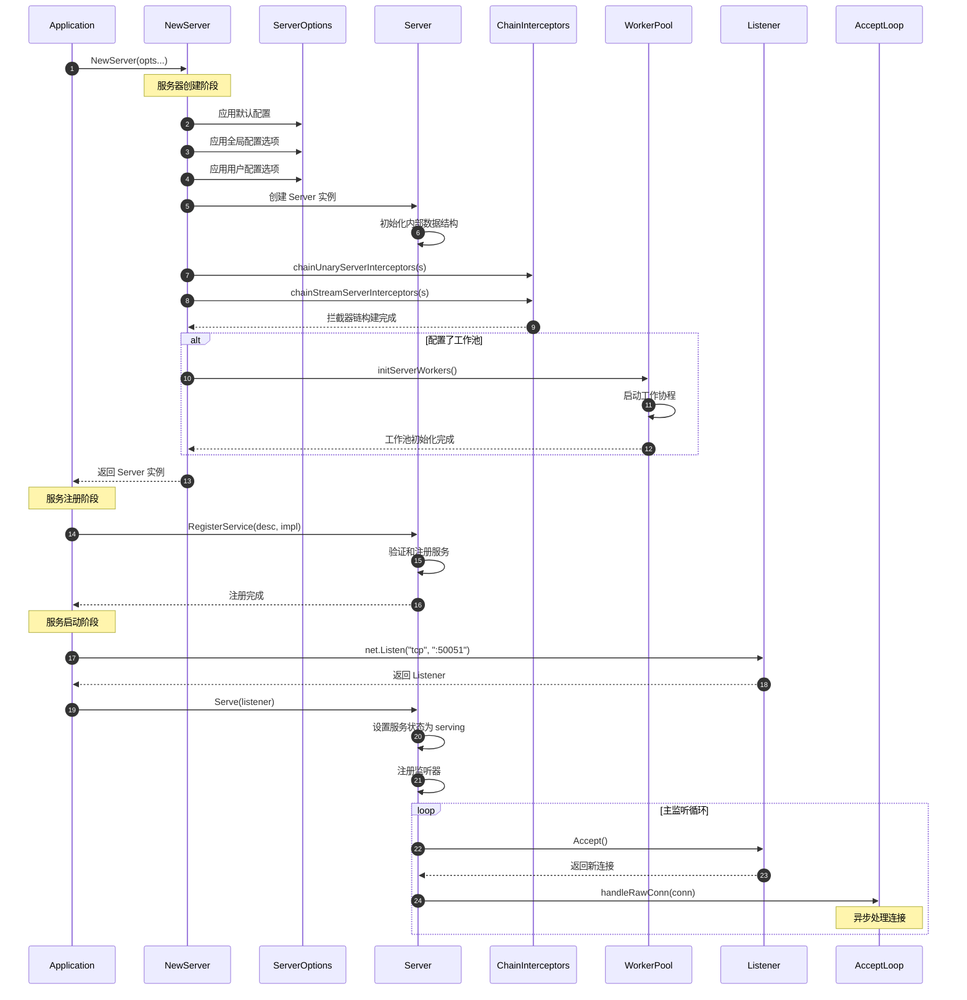
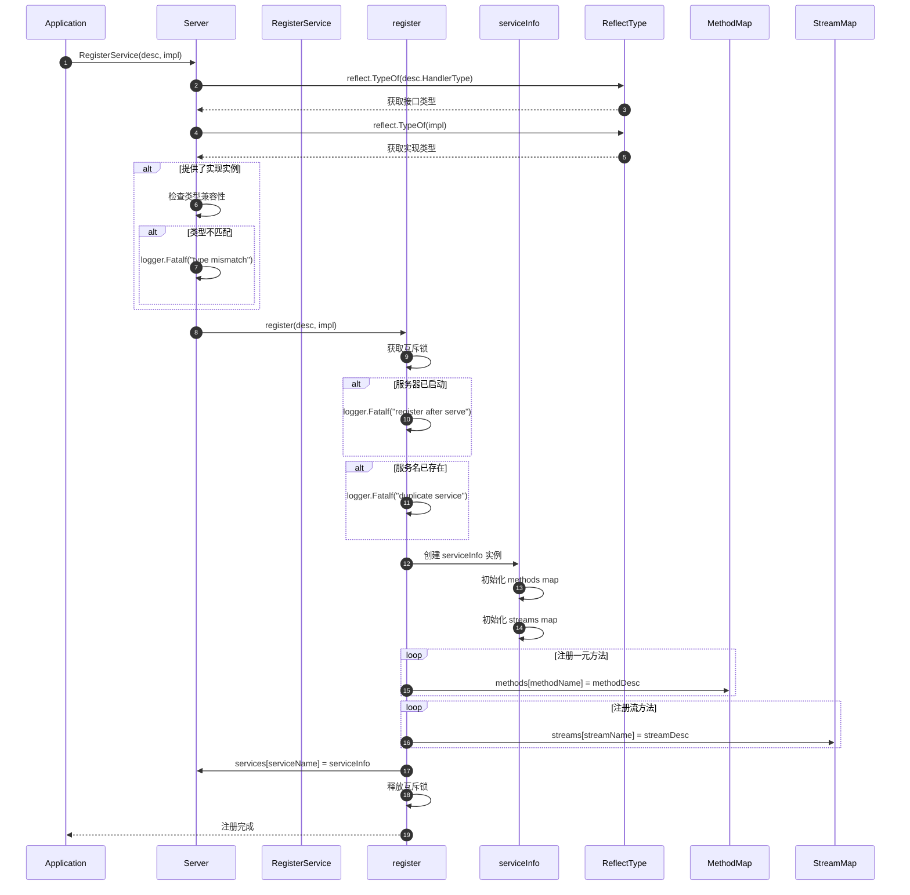
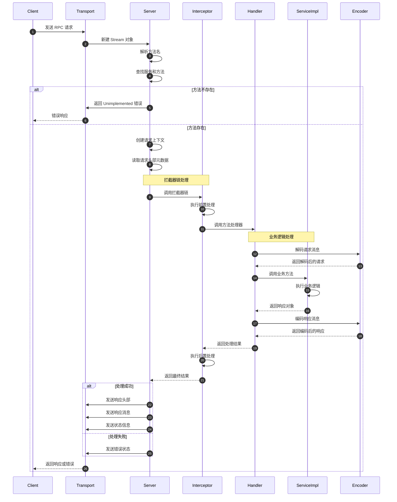
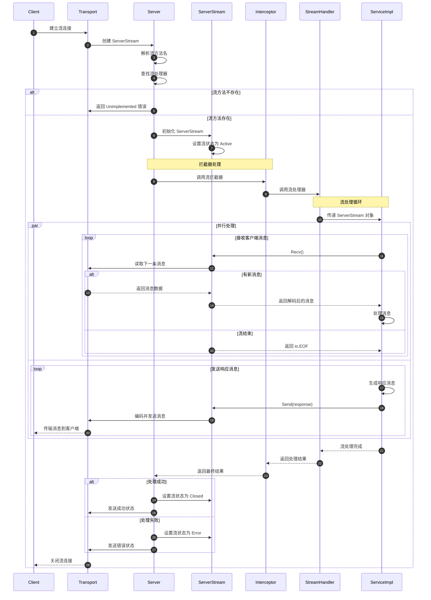
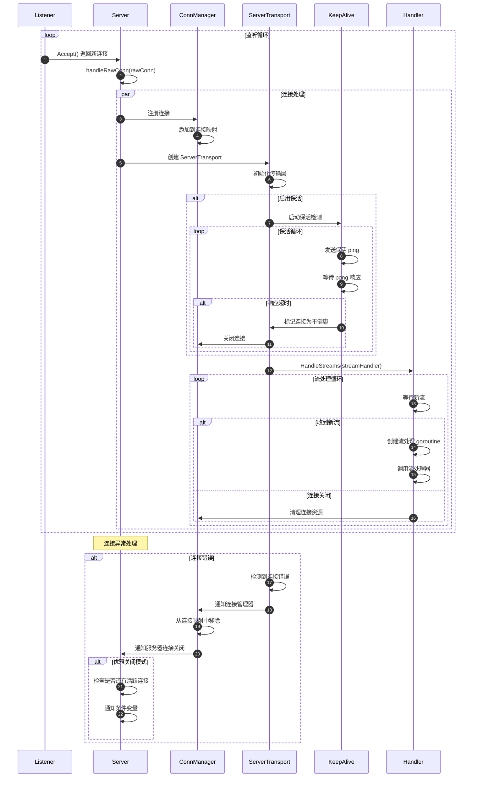
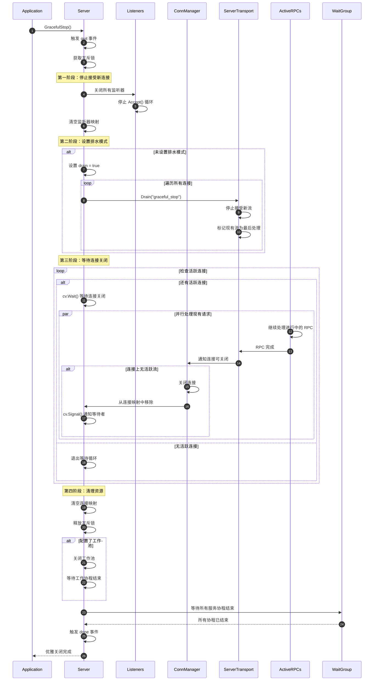
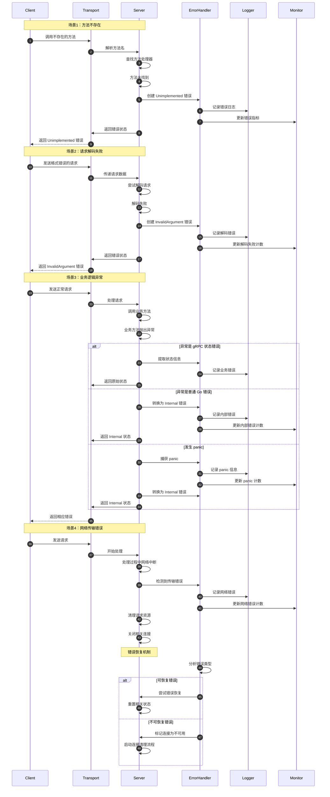

# gRPC-Go 服务端模块时序图文档

## 时序图概览

本文档详细描述了 gRPC-Go 服务端模块的各种时序流程，包括服务器启动、服务注册、请求处理、连接管理、优雅关闭等核心场景。每个时序图都配有详细的文字说明，帮助理解服务端的完整工作流程。

## 核心时序图列表

1. **服务器启动时序图** - 从创建到开始监听的完整流程
2. **服务注册时序图** - 服务注册和方法绑定过程
3. **一元RPC处理时序图** - 单请求单响应处理流程
4. **流式RPC处理时序图** - 流式请求处理流程
5. **连接管理时序图** - 连接建立和管理过程
6. **优雅关闭时序图** - 服务器优雅关闭流程
7. **错误处理时序图** - 异常情况处理流程

---

## 1. 服务器启动时序图

### 场景描述
展示从调用 `grpc.NewServer()` 到 `server.Serve()` 开始监听的完整启动流程。

**时序说明：**

1. **配置阶段（步骤1-8）：**
   - 合并多层配置选项（默认、全局、用户）
   - 创建服务器实例并初始化核心数据结构
   - 构建拦截器链，支持中间件功能

2. **可选初始化（步骤9-12）：**
   - 根据配置决定是否启动工作池
   - 工作池用于分担连接处理负载

3. **服务注册（步骤13-15）：**
   - 注册 gRPC 服务和方法处理器
   - 验证服务实现的类型兼容性

4. **监听启动（步骤16-21）：**
   - 创建网络监听器
   - 进入主监听循环，接受新连接
   - 每个连接在独立 goroutine 中处理

**边界条件：**
- 配置冲突时后者覆盖前者
- 服务启动后不能再注册新服务
- 监听失败会返回错误并清理资源

**性能要点：**
- 拦截器链在启动时构建，避免运行时开销
- 工作池可以控制并发度，避免协程数量爆炸
- 连接处理异步化，不阻塞主监听循环

---

## 2. 服务注册时序图

### 场景描述
展示 gRPC 服务注册过程，包括类型检查、方法绑定、内部数据结构构建。

**时序说明：**

1. **类型验证（步骤1-8）：**
   - 使用反射检查服务实现是否符合接口定义
   - 类型不匹配会导致程序终止（fail-fast 原则）

2. **状态检查（步骤9-14）：**
   - 确保在服务器启动前注册服务
   - 防止重复注册同名服务

3. **数据结构构建（步骤15-22）：**
   - 创建内部服务信息结构
   - 构建方法名到处理器的映射表
   - 支持一元方法和流方法的混合注册

**边界条件：**
- 服务器启动后注册会导致 panic
- 重复注册同名服务会导致 panic
- 类型不匹配会导致 panic

**性能要点：**
- 使用 map 数据结构实现 O(1) 方法查找
- 注册时构建索引，避免运行时查找开销
- 互斥锁保护并发注册安全

---

## 3. 一元RPC处理时序图

### 场景描述
展示一元 RPC 请求的完整处理流程，从接收请求到返回响应。

**时序说明：**

1. **请求接收（步骤1-6）：**
   - 传输层接收客户端请求
   - 服务器解析方法名并查找对应处理器
   - 未找到方法时直接返回错误

2. **拦截器处理（步骤7-11）：**
   - 执行拦截器链进行前置处理
   - 支持认证、日志、监控等横切关注点
   - 拦截器可以修改请求或直接返回响应

3. **业务处理（步骤12-18）：**
   - 解码请求消息为 Go 对象
   - 调用具体的业务实现方法
   - 编码响应对象为传输格式

4. **响应发送（步骤19-25）：**
   - 根据处理结果发送响应或错误
   - 包含头部元数据、消息体、状态信息

**边界条件：**
- 方法不存在返回 `Unimplemented` 状态
- 解码失败返回 `InvalidArgument` 状态
- 业务异常根据具体错误类型返回相应状态
- 网络错误会中断处理流程

**性能要点：**
- 方法查找使用哈希表实现 O(1) 复杂度
- 拦截器链在启动时构建，运行时直接调用
- 编解码器支持零拷贝优化
- 支持流水线处理提高吞吐量

---

## 4. 流式RPC处理时序图

### 场景描述
展示双向流式 RPC 的处理流程，包括流的建立、消息交换、流的关闭。

**时序说明：**

1. **流建立（步骤1-7）：**
   - 客户端建立流连接
   - 服务器创建 ServerStream 对象
   - 查找并验证流方法处理器

2. **拦截器处理（步骤8-10）：**
   - 流拦截器进行前置处理
   - 可以修改流的行为或直接关闭流

3. **并行消息处理（步骤11-22）：**
   - 接收和发送消息可以并行进行
   - 支持双向流的全双工通信
   - 流结束由 `io.EOF` 信号标识

4. **流关闭（步骤23-30）：**
   - 根据处理结果设置流状态
   - 发送最终状态信息给客户端
   - 清理流相关资源

**边界条件：**
- 流方法不存在返回错误
- 网络中断会导致流异常关闭
- 消息过大可能导致流被重置
- 超时会自动关闭流

**性能要点：**
- 支持全双工通信，提高交互效率
- 流控制防止内存溢出
- 异步处理避免阻塞
- 支持流水线处理提高吞吐量

---

## 5. 连接管理时序图

### 场景描述
展示服务器如何管理客户端连接，包括连接建立、保活、异常处理。

**时序说明：**

1. **连接建立（步骤1-7）：**
   - 监听器接受新连接
   - 服务器为每个连接创建独立的处理流程
   - 注册连接到管理器并创建传输层

2. **保活机制（步骤8-15）：**
   - 可选的连接保活检测
   - 定期发送 ping 消息检测连接健康
   - 超时未响应则关闭连接

3. **流处理（步骤16-23）：**
   - 每个连接可以承载多个并发流
   - 流处理在独立的 goroutine 中进行
   - 连接关闭时清理所有相关流

4. **异常处理（步骤24-32）：**
   - 检测连接错误并及时清理
   - 支持优雅关闭时的连接计数
   - 通知机制确保资源正确释放

**边界条件：**
- 连接数量受系统文件描述符限制
- 保活超时会导致连接强制关闭
- 网络分区可能导致连接状态不一致
- 并发流数量受配置限制

**性能要点：**
- 连接复用减少建连开销
- 异步处理避免阻塞监听循环
- 保活机制及时清理僵尸连接
- 连接池管理优化资源使用

---

## 6. 优雅关闭时序图

### 场景描述
展示服务器优雅关闭的完整流程，确保正在处理的请求能够正常完成。

**时序说明：**

1. **停止新连接（步骤1-7）：**
   - 触发关闭信号
   - 关闭所有监听器，停止接受新连接
   - 清理监听器资源

2. **排水模式（步骤8-14）：**
   - 设置所有连接为排水模式
   - 停止接受新的 RPC 流
   - 现有流继续处理直到完成

3. **等待完成（步骤15-26）：**
   - 使用条件变量等待所有连接关闭
   - 并行处理现有 RPC 请求
   - 连接关闭时通知等待者

4. **资源清理（步骤27-33）：**
   - 清理所有连接映射
   - 关闭工作池等可选组件
   - 等待所有 goroutine 结束

**边界条件：**
- 长时间运行的 RPC 可能导致关闭延迟
- 网络异常可能导致连接无法正常关闭
- 建议在应用层设置关闭超时
- 强制关闭可以使用 `Stop()` 方法

**性能要点：**
- 分阶段关闭确保请求不丢失
- 条件变量避免忙等待
- 并行处理加速关闭过程
- 资源清理防止内存泄漏

---

## 7. 错误处理时序图

### 场景描述
展示服务器在各种异常情况下的错误处理机制。

**时序说明：**

1. **方法不存在（步骤1-8）：**
   - 客户端调用未注册的方法
   - 服务器查找失败后返回 `Unimplemented` 状态
   - 记录错误日志和更新监控指标

2. **解码失败（步骤9-16）：**
   - 客户端发送格式错误的数据
   - 服务器解码失败后返回 `InvalidArgument` 状态
   - 区分协议错误和业务错误

3. **业务异常（步骤17-32）：**
   - 业务方法执行过程中的各种异常
   - 根据异常类型返回不同的状态码
   - 支持 panic 恢复机制

4. **网络错误（步骤33-42）：**
   - 传输过程中的网络异常
   - 及时清理资源避免泄漏
   - 区分可恢复和不可恢复错误

**边界条件：**
- 错误处理不能抛出新的异常
- 日志记录要控制频率避免日志洪水
- 监控指标要及时更新
- 资源清理要确保完整性

**性能要点：**
- 错误路径要尽可能快速返回
- 避免在错误处理中进行复杂计算
- 使用错误码而非字符串比较
- 批量处理错误日志减少 I/O

## 系统级场景时序图

### 冷启动场景

服务器从启动到可以处理请求的完整流程，包括资源初始化、服务注册、健康检查等。

### 峰值压测场景

高并发请求下的服务器行为，包括连接管理、流控制、资源限制等。

### 异常恢复场景

各种异常情况下的恢复机制，包括网络中断、内存不足、依赖服务不可用等。

这些时序图展示了 gRPC-Go 服务端模块在各种场景下的完整工作流程，帮助开发者理解服务端的内部机制，为性能优化和故障排查提供指导。
