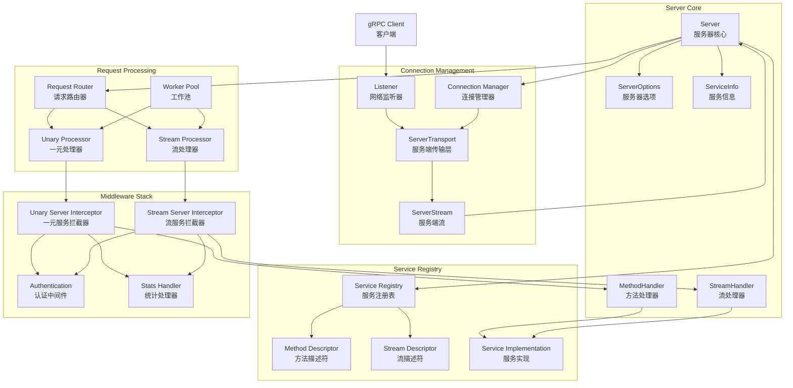

# gRPC-Go 服务端模块概览

## 模块职责与边界

### 核心职责
服务端模块（Server）是 gRPC-Go 服务端的核心组件，负责接收和处理来自客户端的 RPC 请求。该模块管理网络监听、连接处理、服务注册、请求路由、并发控制等关键功能，为应用层提供高性能、可扩展的 RPC 服务能力。

### 输入输出
- **输入：**
  - 网络监听器（net.Listener）
  - 服务实现注册（ServiceDesc + Implementation）
  - 服务器配置选项（ServerOption）
  - 客户端 RPC 请求（HTTP/2 流）

- **输出：**
  - RPC 响应结果
  - 服务状态信息
  - 连接管理事件
  - 错误状态码

### 上下游依赖
- **上游依赖：** 应用层服务实现代码
- **下游依赖：**
  - Transport（传输层模块）
  - Credentials（认证凭证模块）
  - Encoding（编码压缩模块）
  - Interceptor（拦截器模块）
  - Status（状态码模块）
  - Metadata（元数据模块）

### 生命周期
1. **创建阶段：** 通过 `NewServer()` 创建服务器实例
2. **注册阶段：** 使用 `RegisterService()` 注册服务实现
3. **启动阶段：** 调用 `Serve()` 开始接收请求
4. **运行期：** 处理并发 RPC 请求和连接管理
5. **关闭阶段：** `Stop()` 或 `GracefulStop()` 关闭服务器

## 模块架构图



**架构说明：**

1. **服务器核心层：**
   - `Server` 作为整个服务端的控制中心
   - `ServerOptions` 管理服务器配置参数
   - `ServiceInfo` 存储已注册服务的元信息
   - `MethodHandler` 和 `StreamHandler` 处理具体的 RPC 调用

2. **连接管理层：**
   - `Listener` 监听网络端口，接受客户端连接
   - `ServerTransport` 管理单个客户端连接的传输层
   - `ServerStream` 表示单个 RPC 调用的流
   - 连接管理器负责连接的生命周期管理

3. **请求处理层：**
   - `Request Router` 根据方法名路由请求到对应处理器
   - `Unary Processor` 处理一元 RPC 调用
   - `Stream Processor` 处理流式 RPC 调用
   - `Worker Pool` 提供并发处理能力

4. **服务注册表：**
   - 维护所有已注册服务的信息
   - 存储方法和流的描述符信息
   - 关联服务接口与具体实现

5. **中间件栈：**
   - 拦截器提供横切关注点处理
   - 支持认证、授权、日志、监控等功能
   - 可配置的中间件链

**边界条件：**
- 最大并发连接数可配置（默认无限制）
- 最大消息大小限制（接收4MB，发送无限制）
- 连接超时时间（默认120秒）
- HTTP/2 流控窗口大小可配置

**异常处理：**
- 网络连接异常自动清理资源
- 方法未找到返回 `Unimplemented` 状态码
- 请求解析失败返回相应错误码
- 支持优雅关闭和强制关闭

**性能要点：**
- HTTP/2 多路复用支持单连接并发请求
- Worker Pool 模式提高并发处理能力
- 连接池复用减少资源消耗
- 零拷贝和内存池优化

**版本兼容：**
- 支持 HTTP/2 和 HTTP/1.1 协议
- 向后兼容旧版本客户端
- 渐进式功能升级

## 核心算法与流程

### 服务器启动流程

```go
func NewServer(opt ...ServerOption) *Server {
    // 1. 初始化默认配置
    opts := defaultServerOptions
    
    // 2. 应用全局配置选项
    for _, o := range globalServerOptions {
        o.apply(&opts)
    }
    
    // 3. 应用用户配置选项
    for _, o := range opt {
        o.apply(&opts)
    }
    
    // 4. 创建服务器实例
    s := &Server{
        lis:      make(map[net.Listener]bool),
        opts:     opts,
        conns:    make(map[string]map[transport.ServerTransport]bool),
        services: make(map[string]*serviceInfo),
        quit:     grpcsync.NewEvent(),
        done:     grpcsync.NewEvent(),
        channelz: channelz.RegisterServer(""),
    }
    
    // 5. 构建拦截器链
    chainUnaryServerInterceptors(s)
    chainStreamServerInterceptors(s)
    
    // 6. 初始化工作池（如果配置了）
    if s.opts.numServerWorkers > 0 {
        s.initServerWorkers()
    }
    
    return s
}
```

**流程说明：**
1. **配置初始化：** 合并默认、全局和用户配置
2. **实例创建：** 初始化服务器核心数据结构
3. **拦截器设置：** 构建一元和流式拦截器链
4. **资源初始化：** 创建连接管理、服务注册等组件
5. **工作池启动：** 可选的并发处理工作池

### 服务注册流程

```go
func (s *Server) RegisterService(sd *ServiceDesc, ss any) {
    // 1. 验证服务实现类型
    if ss != nil {
        ht := reflect.TypeOf(sd.HandlerType).Elem()
        st := reflect.TypeOf(ss)
        if !st.Implements(ht) {
            logger.Fatalf("handler type mismatch")
        }
    }
    
    // 2. 注册服务信息
    s.register(sd, ss)
}

func (s *Server) register(sd *ServiceDesc, ss any) {
    s.mu.Lock()
    defer s.mu.Unlock()
    
    // 3. 检查重复注册
    if _, ok := s.services[sd.ServiceName]; ok {
        logger.Fatalf("service %s already registered", sd.ServiceName)
    }
    
    // 4. 构建服务信息
    info := &serviceInfo{
        serviceImpl: ss,
        methods:     make(map[string]*MethodDesc),
        streams:     make(map[string]*StreamDesc),
        mdata:       sd.Metadata,
    }
    
    // 5. 注册一元方法
    for i := range sd.Methods {
        d := &sd.Methods[i]
        info.methods[d.MethodName] = d
    }
    
    // 6. 注册流式方法
    for i := range sd.Streams {
        d := &sd.Streams[i]
        info.streams[d.StreamName] = d
    }
    
    s.services[sd.ServiceName] = info
}
```

**注册特点：**
- 类型安全检查确保实现匹配接口
- 防重复注册保证服务唯一性
- 支持一元和流式方法混合注册
- 元数据存储支持服务发现

### 请求处理流程

```go
func (s *Server) handleStream(t transport.ServerTransport, stream *transport.ServerStream) {
    // 1. 解析方法名
    sm := stream.Method()
    if sm != "" && sm[0] == '/' {
        sm = sm[1:]
    }
    pos := strings.LastIndex(sm, "/")
    if pos == -1 {
        // 方法名格式错误
        stream.WriteStatus(status.New(codes.Unimplemented, "malformed method name"))
        return
    }
    service := sm[:pos]
    method := sm[pos+1:]
    
    // 2. 查找服务和方法
    srv, knownService := s.services[service]
    if !knownService {
        stream.WriteStatus(status.New(codes.Unimplemented, "unknown service"))
        return
    }
    
    // 3. 处理一元方法
    if md, ok := srv.methods[method]; ok {
        s.processUnaryRPC(t, stream, srv, md)
        return
    }
    
    // 4. 处理流式方法
    if sd, ok := srv.streams[method]; ok {
        s.processStreamingRPC(t, stream, srv, sd)
        return
    }
    
    // 5. 方法未找到
    stream.WriteStatus(status.New(codes.Unimplemented, "unknown method"))
}
```

**路由算法：**
- 方法名格式：`/package.service/method`
- 两级查找：先查服务，再查方法
- 支持一元和流式方法区分处理
- 未知服务或方法返回 `Unimplemented`

### 并发处理机制

```go
func (s *Server) processUnaryRPC(t transport.ServerTransport, stream *transport.ServerStream, info *serviceInfo, md *MethodDesc) {
    // 1. 增加活跃处理器计数
    s.handlersWG.Add(1)
    defer s.handlersWG.Done()
    
    // 2. 创建处理上下文
    ctx := stream.Context()
    ctx = contextWithServer(ctx, s)
    
    // 3. 应用拦截器链
    if s.opts.unaryInt != nil {
        reply, err := s.opts.unaryInt(ctx, req, info, md.Handler)
    } else {
        reply, err := md.Handler(info.serviceImpl, ctx, df, s.opts.unaryInt)
    }
    
    // 4. 发送响应
    if err := stream.SendMsg(reply); err != nil {
        return
    }
    stream.WriteStatus(statusOK)
}
```

**并发特性：**
- 每个请求在独立 goroutine 中处理
- WaitGroup 跟踪活跃请求数量
- 支持优雅关闭等待请求完成
- 可配置最大并发流数量

## 关键数据结构

### Server 结构体

```go
type Server struct {
    opts serverOptions // 服务器配置选项
    
    // 连接管理
    mu    sync.Mutex                                    // 保护以下字段
    lis   map[net.Listener]bool                         // 活跃监听器
    conns map[string]map[transport.ServerTransport]bool // 活跃连接
    serve bool                                          // 是否正在服务
    drain bool                                          // 是否正在排空
    cv    *sync.Cond                                    // 条件变量，用于优雅关闭
    
    // 服务注册
    services map[string]*serviceInfo // 已注册服务
    
    // 生命周期管理
    quit               *grpcsync.Event // 退出信号
    done               *grpcsync.Event // 完成信号
    serveWG            sync.WaitGroup  // Serve goroutine 计数
    handlersWG         sync.WaitGroup  // 处理器 goroutine 计数
    
    // 调试和监控
    channelz *channelz.Server // 调试信息
    events   traceEventLog    // 事件日志
    
    // 工作池
    serverWorkerChannel      chan func() // 工作任务通道
    serverWorkerChannelClose func()      // 工作池关闭函数
}
```

### 服务信息结构

```go
type serviceInfo struct {
    serviceImpl any                     // 服务实现实例
    methods     map[string]*MethodDesc  // 一元方法映射
    streams     map[string]*StreamDesc  // 流式方法映射
    mdata       any                     // 服务元数据
}

type MethodDesc struct {
    MethodName string        // 方法名
    Handler    MethodHandler // 方法处理器
}

type StreamDesc struct {
    StreamName    string        // 流名称
    Handler       StreamHandler // 流处理器
    ServerStreams bool          // 是否为服务端流
    ClientStreams bool          // 是否为客户端流
}
```

### 服务器选项结构

```go
type serverOptions struct {
    // 拦截器配置
    unaryInt        UnaryServerInterceptor    // 一元拦截器
    streamInt       StreamServerInterceptor   // 流拦截器
    chainUnaryInts  []UnaryServerInterceptor  // 一元拦截器链
    chainStreamInts []StreamServerInterceptor // 流拦截器链
    
    // 传输配置
    creds                 credentials.TransportCredentials // 传输凭证
    maxConcurrentStreams  uint32                          // 最大并发流数
    maxReceiveMessageSize int                             // 最大接收消息大小
    maxSendMessageSize    int                             // 最大发送消息大小
    
    // 连接配置
    keepaliveParams       keepalive.ServerParameters  // 保活参数
    keepalivePolicy       keepalive.EnforcementPolicy // 保活策略
    initialWindowSize     int32                       // 初始窗口大小
    initialConnWindowSize int32                       // 初始连接窗口大小
    connectionTimeout     time.Duration               // 连接超时
    
    // 性能配置
    writeBufferSize   int              // 写缓冲区大小
    readBufferSize    int              // 读缓冲区大小
    sharedWriteBuffer bool             // 共享写缓冲区
    numServerWorkers  uint32           // 工作池大小
    bufferPool        mem.BufferPool   // 内存缓冲池
    
    // 其他配置
    statsHandlers []stats.Handler // 统计处理器
    binaryLogger  binarylog.Logger // 二进制日志
    inTapHandle   tap.ServerInHandle // TAP 处理器
}
```

## 配置与可观测性

### 主要配置项
- `MaxConcurrentStreams`：最大并发流数（默认无限制）
- `MaxReceiveMessageSize`：最大接收消息大小（默认4MB）
- `MaxSendMessageSize`：最大发送消息大小（默认无限制）
- `InitialWindowSize`：HTTP/2 流初始窗口大小（默认64KB）
- `InitialConnWindowSize`：HTTP/2 连接初始窗口大小（默认16KB）
- `ConnectionTimeout`：连接超时时间（默认120秒）
- `KeepaliveParams`：连接保活参数
- `NumServerWorkers`：工作池大小（默认0，表示不使用工作池）

### 关键指标
- 活跃连接数：当前处理的客户端连接数量
- 并发请求数：正在处理的 RPC 请求数量
- 请求处理延迟：从接收到响应的时间分布
- 吞吐量：每秒处理的请求数和数据量
- 错误率：按状态码分类的失败率
- 资源使用率：CPU、内存、网络带宽使用情况

### 调试接口
- Channelz 调试信息：详细的服务器和连接统计
- 事件日志：关键操作的时间线记录
- 统计处理器：可插拔的指标收集机制
- 二进制日志：请求响应的完整记录

### 监控集成
- 支持 OpenTelemetry 标准
- 内置 Prometheus 指标导出
- 集成分布式链路追踪
- 自定义统计处理器接口
