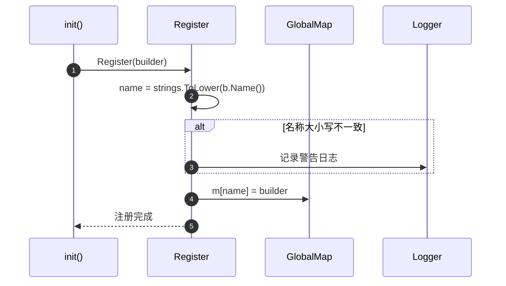
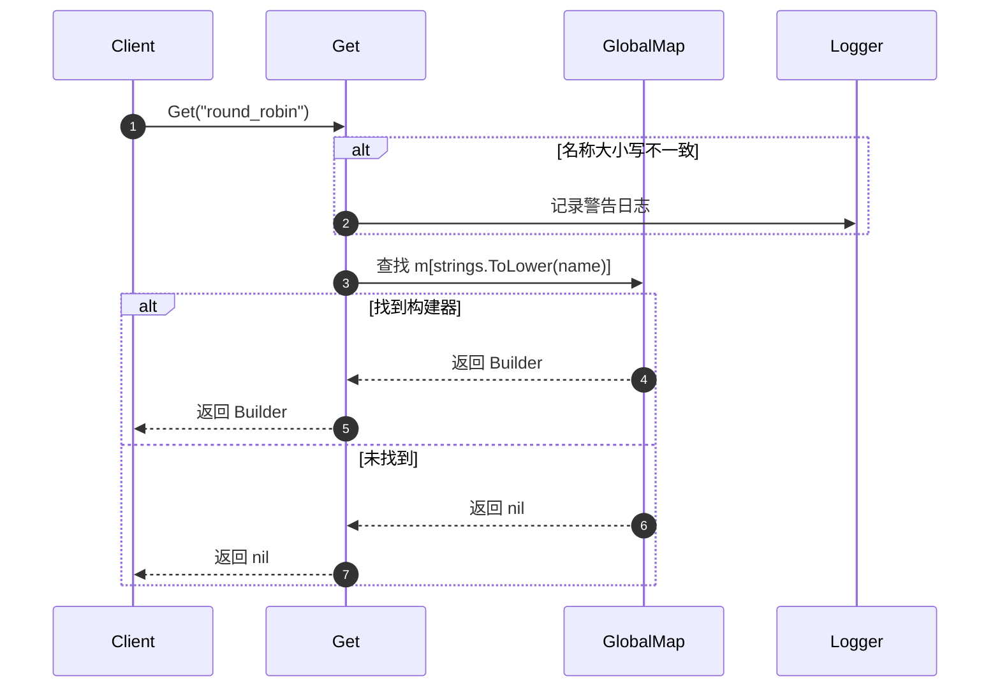
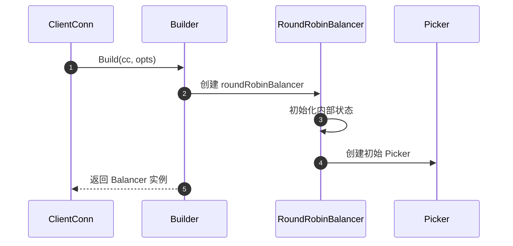
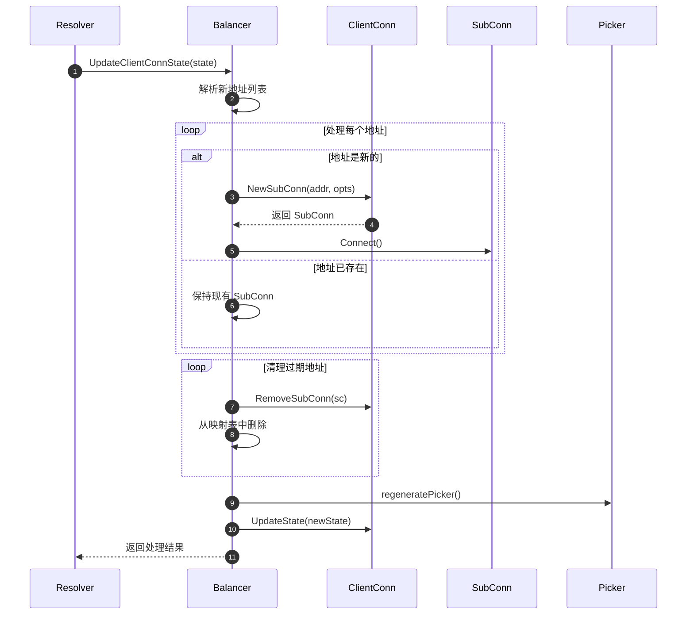
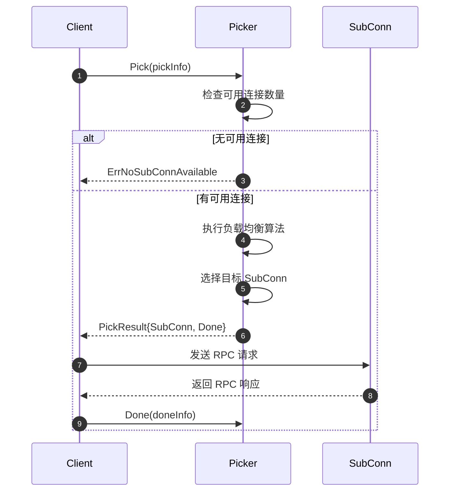

# gRPC-Go 负载均衡模块 API 文档

## API 概览

负载均衡模块是 gRPC-Go 的核心组件之一，负责在多个服务端实例之间分发客户端请求。该模块提供了完整的负载均衡框架，包括负载均衡器注册、连接管理、请求分发策略等功能。所有 API 都设计为可扩展和可配置的。

## 核心 API 列表

### 负载均衡器管理 API
- `Register()` - 注册负载均衡器构建器
- `Get()` - 获取已注册的负载均衡器构建器
- `Builder.Build()` - 创建负载均衡器实例
- `Builder.Name()` - 获取负载均衡器名称

### 负载均衡器接口 API
- `Balancer.UpdateClientConnState()` - 更新客户端连接状态
- `Balancer.ResolverError()` - 处理解析器错误
- `Balancer.UpdateSubConnState()` - 更新子连接状态
- `Balancer.Close()` - 关闭负载均衡器
- `Balancer.ExitIdle()` - 退出空闲状态

### 请求分发 API
- `Picker.Pick()` - 选择子连接处理请求
- `ClientConn.NewSubConn()` - 创建新的子连接
- `ClientConn.UpdateState()` - 更新连接状态
- `SubConn.Connect()` - 建立子连接
- `SubConn.Shutdown()` - 关闭子连接

---

## API 详细规格

### 1. Register

#### 基本信息
- **名称：** `Register`
- **签名：** `func Register(b Builder)`
- **功能：** 注册负载均衡器构建器到全局注册表
- **幂等性：** 否，后注册的会覆盖先注册的同名构建器

#### 请求参数

```go
// Builder 负载均衡器构建器接口
type Builder interface {
    // Build 创建新的负载均衡器实例
    Build(cc ClientConn, opts BuildOptions) Balancer
    // Name 返回负载均衡器名称
    Name() string
}

// BuildOptions 构建选项
type BuildOptions struct {
    // DialCreds 拨号凭证
    DialCreds credentials.TransportCredentials
    // CredsBundle 凭证包
    CredsBundle credentials.Bundle
    // Dialer 自定义拨号器
    Dialer func(context.Context, string) (net.Conn, error)
    // Authority 权威名称
    Authority string
    // CustomUserAgent 自定义用户代理
    CustomUserAgent string
    // ChannelzParent Channelz 父节点
    ChannelzParent channelz.Identifier
    // Target 目标地址
    Target resolver.Target
}
```

**参数说明表**

| 参数 | 类型 | 必填 | 约束 | 说明 |
|------|------|:----:|------|------|
| b | Builder | 是 | 实现 Builder 接口 | 负载均衡器构建器 |

#### 响应结果
无返回值，注册失败会记录警告日志。

#### 入口函数实现

```go
func Register(b Builder) {
    // 1. 获取负载均衡器名称并转换为小写
    name := strings.ToLower(b.Name())
    
    // 2. 检查名称大小写一致性（未来版本将区分大小写）
    if name != b.Name() {
        logger.Warningf("Balancer registered with name %q. grpc-go will be switching to case sensitive balancer registries soon", b.Name())
    }
    
    // 3. 注册到全局映射表
    m[name] = b
}
```

#### 调用链分析

```go
// 负载均衡器实现示例
type roundRobinBuilder struct{}

func (b *roundRobinBuilder) Build(cc balancer.ClientConn, opts balancer.BuildOptions) balancer.Balancer {
    return &roundRobinBalancer{
        cc:       cc,
        subConns: make(map[resolver.Address]balancer.SubConn),
        scStates: make(map[balancer.SubConn]connectivity.State),
    }
}

func (b *roundRobinBuilder) Name() string {
    return "round_robin"
}

// 注册负载均衡器
func init() {
    balancer.Register(&roundRobinBuilder{})
}
```

#### 时序图



#### 边界与异常

- **线程安全：** 仅在初始化时调用，非线程安全
- **名称冲突：** 后注册的构建器会覆盖先注册的
- **大小写处理：** 当前不区分大小写，未来版本将区分
- **初始化时机：** 必须在 init() 函数中调用

#### 实践建议

- **命名规范：** 使用小写和下划线的命名方式
- **唯一性：** 确保负载均衡器名称的唯一性
- **初始化：** 在包的 init() 函数中注册
- **文档：** 为自定义负载均衡器提供详细文档

---

### 2. Get

#### 基本信息
- **名称：** `Get`
- **签名：** `func Get(name string) Builder`
- **功能：** 根据名称获取已注册的负载均衡器构建器
- **幂等性：** 是，多次调用返回相同结果

#### 请求参数

**参数说明表**

| 参数 | 类型 | 必填 | 约束 | 说明 |
|------|------|:----:|------|------|
| name | string | 是 | 非空字符串 | 负载均衡器名称 |

#### 响应结果

```go
// 返回 Builder 接口或 nil
type Builder interface {
    Build(cc ClientConn, opts BuildOptions) Balancer
    Name() string
}
```

#### 入口函数实现

```go
func Get(name string) Builder {
    // 1. 检查名称大小写一致性
    if strings.ToLower(name) != name {
        logger.Warningf("Balancer retrieved for name %q. grpc-go will be switching to case sensitive balancer registries soon", name)
    }
    
    // 2. 从全局映射表中查找
    if b, ok := m[strings.ToLower(name)]; ok {
        return b
    }
    
    // 3. 未找到返回 nil
    return nil
}
```

#### 时序图



#### 边界与异常

- **大小写处理：** 当前不区分大小写查找
- **空值处理：** 未找到时返回 nil
- **线程安全：** 读操作线程安全
- **警告日志：** 大小写不一致时记录警告

---

### 3. Builder.Build

#### 基本信息
- **名称：** `Build`
- **签名：** `func Build(cc ClientConn, opts BuildOptions) Balancer`
- **功能：** 创建负载均衡器实例
- **幂等性：** 否，每次调用创建新实例

#### 请求参数

```go
// ClientConn 客户端连接接口
type ClientConn interface {
    // NewSubConn 创建新的子连接
    NewSubConn([]resolver.Address, NewSubConnOptions) (SubConn, error)
    // RemoveSubConn 移除子连接
    RemoveSubConn(SubConn)
    // UpdateAddresses 更新子连接地址
    UpdateAddresses(SubConn, []resolver.Address)
    // UpdateState 更新连接状态
    UpdateState(State)
    // ResolveNow 立即解析地址
    ResolveNow(resolver.ResolveNowOptions)
    // Target 获取目标地址
    Target() string
    // MetricsRecorder 获取指标记录器
    MetricsRecorder() estats.MetricsRecorder
}

// BuildOptions 构建选项（见 Register API 说明）
```

**参数说明表**

| 参数 | 类型 | 必填 | 约束 | 说明 |
|------|------|:----:|------|------|
| cc | ClientConn | 是 | 有效的客户端连接 | 客户端连接接口 |
| opts | BuildOptions | 是 | 构建选项 | 负载均衡器构建选项 |

#### 响应结果

```go
// Balancer 负载均衡器接口
type Balancer interface {
    UpdateClientConnState(ClientConnState) error
    ResolverError(error)
    UpdateSubConnState(SubConn, SubConnState)
    Close()
    ExitIdle()
}
```

#### 入口函数实现

```go
// Round Robin 负载均衡器实现示例
func (b *roundRobinBuilder) Build(cc balancer.ClientConn, opts balancer.BuildOptions) balancer.Balancer {
    // 1. 创建负载均衡器实例
    rb := &roundRobinBalancer{
        cc:       cc,
        subConns: make(map[resolver.Address]balancer.SubConn),
        scStates: make(map[balancer.SubConn]connectivity.State),
        picker:   &rrPicker{},
    }
    
    // 2. 初始化状态
    rb.regeneratePicker()
    
    return rb
}

type roundRobinBalancer struct {
    cc       balancer.ClientConn
    subConns map[resolver.Address]balancer.SubConn
    scStates map[balancer.SubConn]connectivity.State
    picker   balancer.Picker
    mu       sync.RWMutex
}
```

#### 时序图



---

### 4. Balancer.UpdateClientConnState

#### 基本信息
- **名称：** `UpdateClientConnState`
- **签名：** `func UpdateClientConnState(s ClientConnState) error`
- **功能：** 更新客户端连接状态，处理地址变更
- **幂等性：** 否，每次调用可能产生不同效果

#### 请求参数

```go
// ClientConnState 客户端连接状态
type ClientConnState struct {
    ResolverState resolver.State         // 解析器状态
    BalancerConfig serviceconfig.LoadBalancingConfig  // 负载均衡配置
}

// resolver.State 解析器状态
type State struct {
    Addresses     []resolver.Address     // 服务端地址列表
    ServiceConfig *serviceconfig.ParseResult  // 服务配置
    Attributes    *attributes.Attributes // 属性信息
}
```

**参数说明表**

| 参数 | 类型 | 必填 | 约束 | 说明 |
|------|------|:----:|------|------|
| s | ClientConnState | 是 | 有效的连接状态 | 客户端连接状态 |

#### 响应结果

```go
// 可能的错误类型
var (
    ErrBadResolverState = errors.New("bad resolver state")
)
```

#### 入口函数实现

```go
func (b *roundRobinBalancer) UpdateClientConnState(s balancer.ClientConnState) error {
    b.mu.Lock()
    defer b.mu.Unlock()
    
    // 1. 获取新的地址列表
    addrs := s.ResolverState.Addresses
    
    // 2. 处理地址变更
    addrsSet := make(map[resolver.Address]struct{})
    for _, addr := range addrs {
        addrsSet[addr] = struct{}{}
        
        // 3. 创建新的子连接
        if _, ok := b.subConns[addr]; !ok {
            sc, err := b.cc.NewSubConn([]resolver.Address{addr}, balancer.NewSubConnOptions{
                StateListener: func(scs balancer.SubConnState) {
                    b.updateSubConnState(sc, scs)
                },
            })
            if err != nil {
                continue
            }
            b.subConns[addr] = sc
            b.scStates[sc] = connectivity.Idle
            sc.Connect()
        }
    }
    
    // 4. 移除不再需要的子连接
    for addr, sc := range b.subConns {
        if _, ok := addrsSet[addr]; !ok {
            b.cc.RemoveSubConn(sc)
            delete(b.subConns, addr)
            delete(b.scStates, sc)
        }
    }
    
    // 5. 重新生成 Picker
    b.regeneratePicker()
    
    return nil
}
```

#### 时序图



---

### 5. Picker.Pick

#### 基本信息
- **名称：** `Pick`
- **签名：** `func Pick(info PickInfo) (PickResult, error)`
- **功能：** 为 RPC 请求选择合适的子连接
- **幂等性：** 否，每次调用可能返回不同连接

#### 请求参数

```go
// PickInfo 选择信息
type PickInfo struct {
    // FullMethodName RPC 方法全名
    FullMethodName string
    // Ctx RPC 上下文
    Ctx context.Context
}
```

**参数说明表**

| 参数 | 类型 | 必填 | 约束 | 说明 |
|------|------|:----:|------|------|
| info | PickInfo | 是 | 有效的选择信息 | 请求选择信息 |

#### 响应结果

```go
// PickResult 选择结果
type PickResult struct {
    // SubConn 选中的子连接
    SubConn SubConn
    // Done 请求完成回调
    Done func(DoneInfo)
    // Metadata 元数据
    Metadata metadata.MD
}

// DoneInfo 完成信息
type DoneInfo struct {
    Err           error        // RPC 错误
    Trailer       metadata.MD  // 响应尾部元数据
    BytesSent     bool         // 是否发送了字节
    BytesReceived bool         // 是否接收了字节
    ServerLoad    any          // 服务器负载信息
}
```

#### 入口函数实现

```go
// Round Robin Picker 实现
type rrPicker struct {
    subConns []balancer.SubConn
    next     uint32
}

func (p *rrPicker) Pick(info balancer.PickInfo) (balancer.PickResult, error) {
    // 1. 检查是否有可用连接
    if len(p.subConns) == 0 {
        return balancer.PickResult{}, balancer.ErrNoSubConnAvailable
    }
    
    // 2. Round Robin 算法选择连接
    idx := atomic.AddUint32(&p.next, 1) % uint32(len(p.subConns))
    sc := p.subConns[idx]
    
    // 3. 构造选择结果
    return balancer.PickResult{
        SubConn: sc,
        Done: func(di balancer.DoneInfo) {
            // 记录请求完成信息
        },
    }, nil
}
```

#### 时序图



#### 边界与异常

- **无连接可用：** 返回 `ErrNoSubConnAvailable` 错误
- **非阻塞要求：** Pick 方法不能阻塞
- **线程安全：** 可能被多个 goroutine 并发调用
- **状态一致性：** 基于当前连接状态进行选择

---

## 内置负载均衡器

### Round Robin

```go
// 轮询负载均衡器
type roundRobinBuilder struct{}

func (b *roundRobinBuilder) Name() string {
    return "round_robin"
}

func (b *roundRobinBuilder) Build(cc balancer.ClientConn, opts balancer.BuildOptions) balancer.Balancer {
    return &roundRobinBalancer{
        cc:       cc,
        subConns: make(map[resolver.Address]balancer.SubConn),
        scStates: make(map[balancer.SubConn]connectivity.State),
    }
}
```

### Pick First

```go
// 优先选择负载均衡器
type pickFirstBuilder struct{}

func (b *pickFirstBuilder) Name() string {
    return "pick_first"
}

func (b *pickFirstBuilder) Build(cc balancer.ClientConn, opts balancer.BuildOptions) balancer.Balancer {
    return &pickFirstBalancer{
        cc: cc,
    }
}
```

## 使用示例

### 注册自定义负载均衡器

```go
package main

import (
    "google.golang.org/grpc/balancer"
    "google.golang.org/grpc/connectivity"
)

// 自定义负载均衡器
type customBalancer struct {
    cc       balancer.ClientConn
    subConns map[resolver.Address]balancer.SubConn
}

type customBuilder struct{}

func (b *customBuilder) Name() string {
    return "custom_lb"
}

func (b *customBuilder) Build(cc balancer.ClientConn, opts balancer.BuildOptions) balancer.Balancer {
    return &customBalancer{
        cc:       cc,
        subConns: make(map[resolver.Address]balancer.SubConn),
    }
}

func init() {
    // 注册自定义负载均衡器
    balancer.Register(&customBuilder{})
}
```

### 使用负载均衡器

```go
func main() {
    // 创建连接时指定负载均衡策略
    conn, err := grpc.Dial(
        "dns:///example.com:50051",
        grpc.WithDefaultServiceConfig(`{"loadBalancingPolicy":"round_robin"}`),
        grpc.WithTransportCredentials(insecure.NewCredentials()),
    )
    if err != nil {
        log.Fatalf("Failed to connect: %v", err)
    }
    defer conn.Close()
    
    // 使用连接进行 RPC 调用
    client := pb.NewGreeterClient(conn)
    resp, err := client.SayHello(context.Background(), &pb.HelloRequest{
        Name: "World",
    })
    if err != nil {
        log.Fatalf("RPC failed: %v", err)
    }
    
    fmt.Printf("Response: %s\n", resp.Message)
}
```

## 最佳实践

1. **负载均衡策略选择**
   - Round Robin：适用于服务端性能相近的场景
   - Pick First：适用于有主备关系的场景
   - 自定义策略：根据业务需求实现特殊算法

2. **连接管理**
   - 及时清理失效连接
   - 监控连接健康状态
   - 合理设置连接池大小

3. **性能优化**
   - Picker.Pick() 方法要快速返回
   - 避免在 Pick 中进行阻塞操作
   - 使用原子操作保证线程安全

4. **错误处理**
   - 正确处理连接失败情况
   - 实现适当的重试机制
   - 提供详细的错误信息
