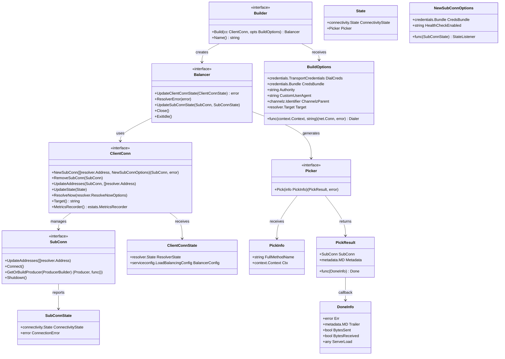
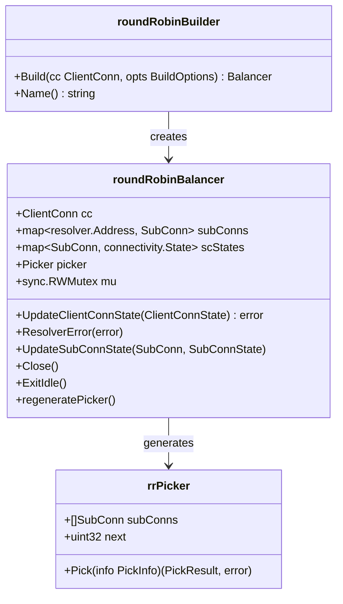

# gRPC-Go 负载均衡模块数据结构文档

## 数据结构概览

负载均衡模块的数据结构设计体现了 gRPC 客户端负载均衡的完整架构，包括负载均衡器注册、连接管理、请求分发、状态维护等各个方面。所有数据结构都经过精心设计以确保高性能、可扩展性和线程安全。

## 核心数据结构 UML 图



**UML 图说明：**

1. **Builder 接口：** 负载均衡器构建器，用于创建具体的负载均衡器实例
2. **Balancer 接口：** 核心负载均衡器接口，处理连接状态变更和请求分发
3. **Picker 接口：** 请求选择器，负责为每个 RPC 请求选择合适的连接
4. **ClientConn 接口：** 客户端连接管理接口，提供子连接管理功能
5. **SubConn 接口：** 子连接接口，代表到单个服务端的连接
6. **各种状态和选项结构：** 支持负载均衡器的配置和状态管理

## 详细数据结构分析

### 1. Builder 接口

```go
// Builder 负载均衡器构建器接口
type Builder interface {
    // Build 创建新的负载均衡器实例
    // cc: 客户端连接接口，用于管理子连接
    // opts: 构建选项，包含认证、拨号等配置
    Build(cc ClientConn, opts BuildOptions) Balancer
    
    // Name 返回负载均衡器的名称
    // 用于在服务配置中标识负载均衡策略
    Name() string
}

// ConfigParser 可选的配置解析器接口
type ConfigParser interface {
    // ParseConfig 解析 JSON 格式的负载均衡配置
    ParseConfig(LoadBalancingConfigJSON json.RawMessage) (serviceconfig.LoadBalancingConfig, error)
}
```

**接口设计说明：**
- **工厂模式：** Builder 使用工厂模式创建负载均衡器实例
- **配置解析：** 可选实现 ConfigParser 接口支持自定义配置
- **名称标识：** Name() 方法返回的名称用于注册和查找
- **依赖注入：** Build 方法接收 ClientConn 实现依赖注入

### 2. Balancer 接口

```go
// Balancer 负载均衡器核心接口
type Balancer interface {
    // UpdateClientConnState 当客户端连接状态变更时调用
    // 主要处理服务端地址列表的变更
    UpdateClientConnState(ClientConnState) error
    
    // ResolverError 当名称解析器报告错误时调用
    ResolverError(error)
    
    // UpdateSubConnState 当子连接状态变更时调用
    // 已废弃：建议使用 NewSubConnOptions.StateListener
    UpdateSubConnState(SubConn, SubConnState)
    
    // Close 关闭负载均衡器，清理资源
    Close()
    
    // ExitIdle 退出空闲状态，重新连接后端
    ExitIdle()
}

// ExitIdler 可选的空闲退出接口（已废弃）
type ExitIdler interface {
    ExitIdle()
}
```

**接口职责说明：**

| 方法 | 触发时机 | 主要职责 | 并发安全性 |
|------|----------|----------|------------|
| UpdateClientConnState | 地址解析完成 | 创建/删除子连接 | 同步调用 |
| ResolverError | 解析器错误 | 错误处理和恢复 | 同步调用 |
| UpdateSubConnState | 连接状态变更 | 更新 Picker | 同步调用 |
| Close | 连接关闭 | 资源清理 | 同步调用 |
| ExitIdle | 主动连接 | 退出空闲状态 | 同步调用 |

### 3. Picker 接口

```go
// Picker 请求选择器接口
type Picker interface {
    // Pick 为 RPC 请求选择子连接
    // info: 包含方法名和上下文的请求信息
    // 返回: 选中的连接和完成回调
    Pick(info PickInfo) (PickResult, error)
}

// PickInfo 请求选择信息
type PickInfo struct {
    // FullMethodName RPC 方法全名，格式：/package.service/method
    FullMethodName string
    
    // Ctx RPC 请求上下文，可能包含元数据等信息
    Ctx context.Context
}

// PickResult 选择结果
type PickResult struct {
    // SubConn 选中的子连接
    SubConn SubConn
    
    // Done 请求完成时的回调函数
    // 用于收集请求统计信息和负载反馈
    Done func(DoneInfo)
    
    // Metadata 附加到请求的元数据
    Metadata metadata.MD
}

// DoneInfo 请求完成信息
type DoneInfo struct {
    // Err RPC 执行错误，nil 表示成功
    Err error
    
    // Trailer 响应尾部元数据
    Trailer metadata.MD
    
    // BytesSent 是否发送了字节数据
    BytesSent bool
    
    // BytesReceived 是否接收了字节数据
    BytesReceived bool
    
    // ServerLoad 服务器负载信息（如 ORCA 负载报告）
    ServerLoad any
}
```

**选择器设计要点：**
- **非阻塞：** Pick 方法必须快速返回，不能阻塞
- **状态感知：** 基于当前连接状态进行选择
- **反馈机制：** Done 回调提供请求完成反馈
- **元数据支持：** 可以向请求添加额外元数据

### 4. ClientConn 接口

```go
// ClientConn 客户端连接管理接口
type ClientConn interface {
    // NewSubConn 创建新的子连接
    NewSubConn([]resolver.Address, NewSubConnOptions) (SubConn, error)
    
    // RemoveSubConn 移除子连接
    RemoveSubConn(SubConn)
    
    // UpdateAddresses 更新子连接的地址列表
    UpdateAddresses(SubConn, []resolver.Address)
    
    // UpdateState 更新负载均衡器状态
    UpdateState(State)
    
    // ResolveNow 触发立即地址解析
    ResolveNow(resolver.ResolveNowOptions)
    
    // Target 获取连接目标
    Target() string
    
    // MetricsRecorder 获取指标记录器
    MetricsRecorder() estats.MetricsRecorder
    
    // 强制嵌入接口，允许 gRPC 添加新方法
    internal.EnforceClientConnEmbedding
}

// NewSubConnOptions 子连接创建选项
type NewSubConnOptions struct {
    // CredsBundle 凭证包
    CredsBundle credentials.Bundle
    
    // StateListener 状态变更监听器
    StateListener func(SubConnState)
    
    // HealthCheckEnabled 健康检查配置
    HealthCheckEnabled string
}

// State 负载均衡器状态
type State struct {
    // ConnectivityState 连接状态
    ConnectivityState connectivity.State
    
    // Picker 当前的请求选择器
    Picker Picker
}
```

**连接管理特点：**
- **生命周期管理：** 创建、更新、删除子连接
- **状态同步：** 向 gRPC 核心报告负载均衡器状态
- **立即解析：** 支持主动触发地址解析
- **指标收集：** 集成指标记录功能

### 5. SubConn 接口

```go
// SubConn 子连接接口
type SubConn interface {
    // UpdateAddresses 更新连接地址
    UpdateAddresses([]resolver.Address)
    
    // Connect 建立连接
    Connect()
    
    // GetOrBuildProducer 获取或构建生产者
    GetOrBuildProducer(ProducerBuilder) (Producer, func())
    
    // Shutdown 关闭连接
    Shutdown()
    
    // 强制嵌入接口
    internal.EnforceSubConnEmbedding
}

// SubConnState 子连接状态
type SubConnState struct {
    // ConnectivityState 连接状态
    ConnectivityState connectivity.State
    
    // ConnectionError 连接错误信息
    ConnectionError error
}
```

**子连接状态枚举：**

```go
// connectivity.State 连接状态
const (
    Idle        = connectivity.Idle        // 空闲状态
    Connecting  = connectivity.Connecting  // 连接中
    Ready       = connectivity.Ready       // 就绪状态
    TransientFailure = connectivity.TransientFailure // 临时失败
    Shutdown    = connectivity.Shutdown    // 已关闭
)
```

### 6. 配置和选项结构

```go
// BuildOptions 负载均衡器构建选项
type BuildOptions struct {
    // DialCreds 拨号传输凭证
    DialCreds credentials.TransportCredentials
    
    // CredsBundle 凭证包
    CredsBundle credentials.Bundle
    
    // Dialer 自定义拨号函数
    Dialer func(context.Context, string) (net.Conn, error)
    
    // Authority 权威名称
    Authority string
    
    // CustomUserAgent 自定义用户代理
    CustomUserAgent string
    
    // ChannelzParent Channelz 父节点标识
    ChannelzParent channelz.Identifier
    
    // Target 目标解析结果
    Target resolver.Target
}

// ClientConnState 客户端连接状态
type ClientConnState struct {
    // ResolverState 解析器状态，包含地址列表
    ResolverState resolver.State
    
    // BalancerConfig 负载均衡配置
    BalancerConfig serviceconfig.LoadBalancingConfig
}
```

## 常见负载均衡器实现

### 1. Round Robin 实现



```go
// Round Robin 负载均衡器实现
type roundRobinBalancer struct {
    cc       balancer.ClientConn
    subConns map[resolver.Address]balancer.SubConn
    scStates map[balancer.SubConn]connectivity.State
    picker   balancer.Picker
    mu       sync.RWMutex
}

// Round Robin 选择器实现
type rrPicker struct {
    subConns []balancer.SubConn
    next     uint32
}

func (p *rrPicker) Pick(info balancer.PickInfo) (balancer.PickResult, error) {
    if len(p.subConns) == 0 {
        return balancer.PickResult{}, balancer.ErrNoSubConnAvailable
    }
    
    // 原子操作实现轮询
    idx := atomic.AddUint32(&p.next, 1) % uint32(len(p.subConns))
    return balancer.PickResult{
        SubConn: p.subConns[idx],
    }, nil
}
```

### 2. Pick First 实现

```go
// Pick First 负载均衡器实现
type pickFirstBalancer struct {
    cc       balancer.ClientConn
    sc       balancer.SubConn
    state    connectivity.State
}

type pickFirstPicker struct {
    sc balancer.SubConn
}

func (p *pickFirstPicker) Pick(info balancer.PickInfo) (balancer.PickResult, error) {
    if p.sc == nil {
        return balancer.PickResult{}, balancer.ErrNoSubConnAvailable
    }
    return balancer.PickResult{SubConn: p.sc}, nil
}
```

## 数据结构关系图

```mermaid
graph TB
    subgraph "注册管理"
        GlobalMap[全局注册表 map[string]Builder]
        Register[Register 函数]
        Get[Get 函数]
        
        Register --> GlobalMap
        Get --> GlobalMap
    end
    
    subgraph "负载均衡器生命周期"
        Builder[Builder 接口]
        Balancer[Balancer 实例]
        Picker[Picker 实例]
        
        Builder --> Balancer
        Balancer --> Picker
    end
    
    subgraph "连接管理"
        ClientConn[ClientConn 接口]
        SubConn[SubConn 实例]
        ConnState[连接状态]
        
        ClientConn --> SubConn
        SubConn --> ConnState
    end
    
    subgraph "请求处理"
        PickInfo[请求信息]
        PickResult[选择结果]
        DoneInfo[完成信息]
        
        PickInfo --> PickResult
        PickResult --> DoneInfo
    end
    
    GlobalMap --> Builder
    Balancer --> ClientConn
    Picker --> PickInfo
    ClientConn --> Balancer
```

## 内存管理和性能特点

### 内存分配模式

1. **延迟初始化：** 负载均衡器实例按需创建
2. **连接池：** 子连接复用减少创建开销
3. **状态缓存：** 连接状态本地缓存避免频繁查询
4. **选择器复用：** Picker 实例在状态不变时复用

### 并发安全保证

1. **接口隔离：** 不同接口的方法调用互不影响
2. **状态同步：** 负载均衡器方法保证同步调用
3. **原子操作：** 选择器使用原子操作保证线程安全
4. **读写锁：** 状态读取和更新使用读写锁分离

### 性能优化点

1. **快速选择：** Pick 方法使用 O(1) 算法
2. **状态缓存：** 避免重复计算连接状态
3. **批量更新：** 地址变更时批量处理连接
4. **异步连接：** 子连接建立不阻塞主流程

## 扩展点和定制化

### 自定义负载均衡算法

```go
// 加权轮询实现示例
type weightedRoundRobinPicker struct {
    subConns []balancer.SubConn
    weights  []int
    current  []int
    total    int
}

func (p *weightedRoundRobinPicker) Pick(info balancer.PickInfo) (balancer.PickResult, error) {
    // 实现加权轮询算法
    maxWeight := -1
    selectedIdx := -1
    
    for i := range p.subConns {
        p.current[i] += p.weights[i]
        if p.current[i] > maxWeight {
            maxWeight = p.current[i]
            selectedIdx = i
        }
    }
    
    if selectedIdx != -1 {
        p.current[selectedIdx] -= p.total
        return balancer.PickResult{
            SubConn: p.subConns[selectedIdx],
        }, nil
    }
    
    return balancer.PickResult{}, balancer.ErrNoSubConnAvailable
}
```

### 负载感知选择

```go
// 负载感知选择器
type loadAwarePicker struct {
    subConns []balancer.SubConn
    loads    []float64
    mu       sync.RWMutex
}

func (p *loadAwarePicker) Pick(info balancer.PickInfo) (balancer.PickResult, error) {
    p.mu.RLock()
    defer p.mu.RUnlock()
    
    // 选择负载最低的连接
    minLoad := math.MaxFloat64
    selectedIdx := -1
    
    for i, load := range p.loads {
        if load < minLoad {
            minLoad = load
            selectedIdx = i
        }
    }
    
    if selectedIdx != -1 {
        return balancer.PickResult{
            SubConn: p.subConns[selectedIdx],
            Done: func(di balancer.DoneInfo) {
                // 根据请求结果更新负载信息
                p.updateLoad(selectedIdx, di)
            },
        }, nil
    }
    
    return balancer.PickResult{}, balancer.ErrNoSubConnAvailable
}
```

这些数据结构的设计体现了 gRPC-Go 负载均衡模块的核心设计理念：灵活的策略扩展、高效的请求分发、完善的状态管理。通过合理的接口抽象和数据结构组织，实现了企业级的负载均衡功能。
