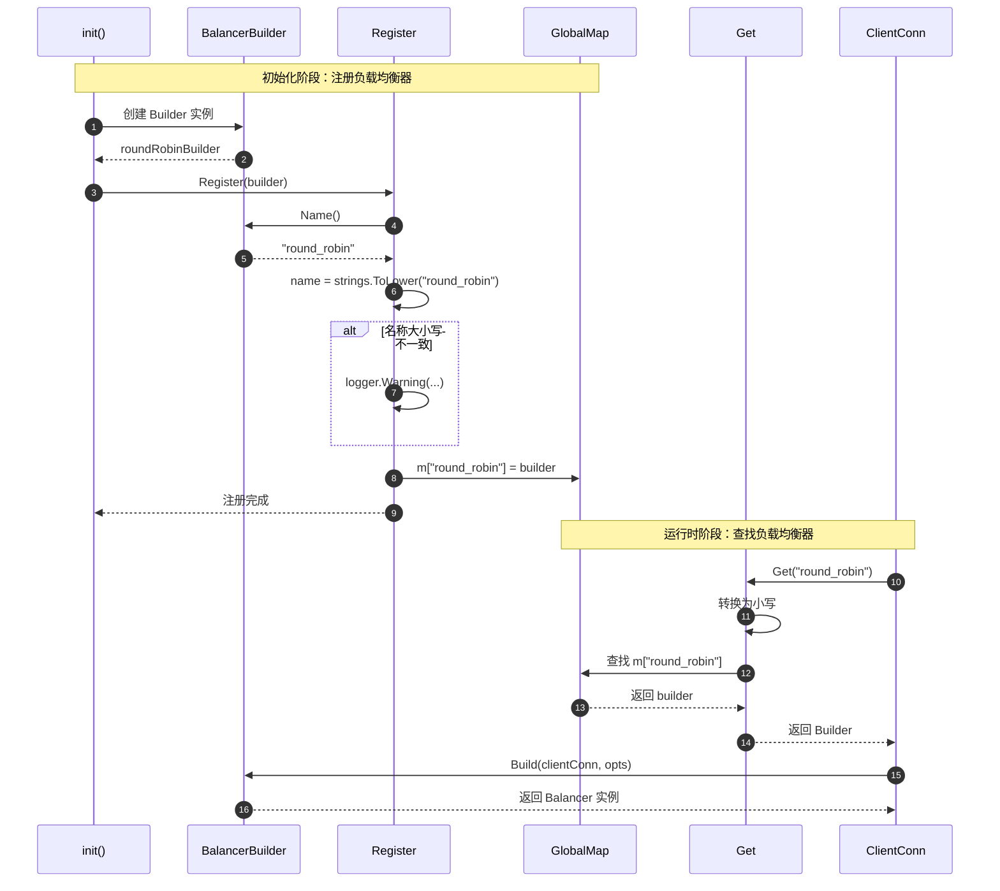
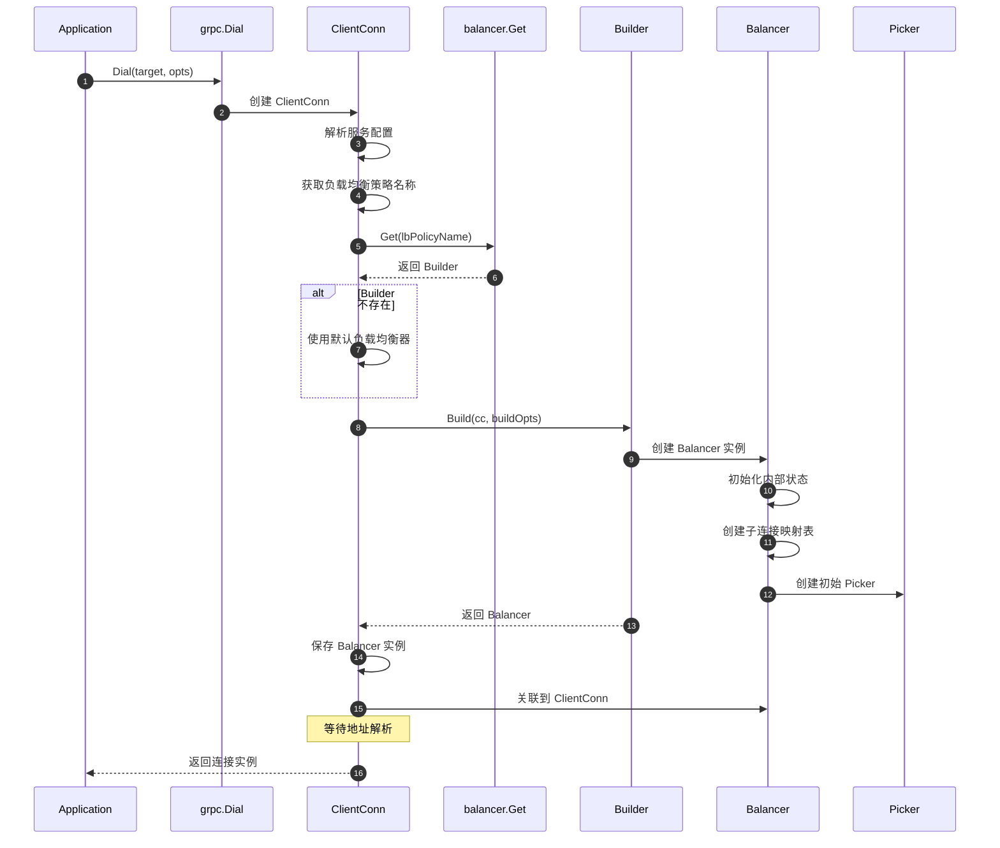
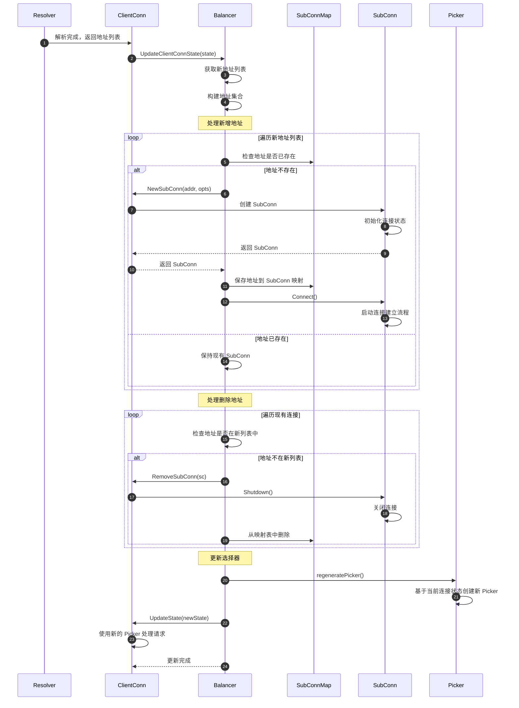
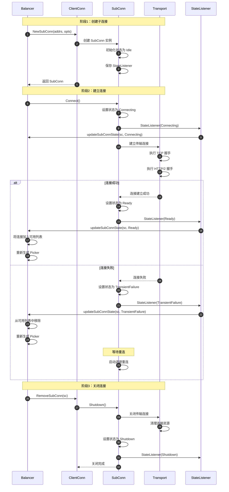
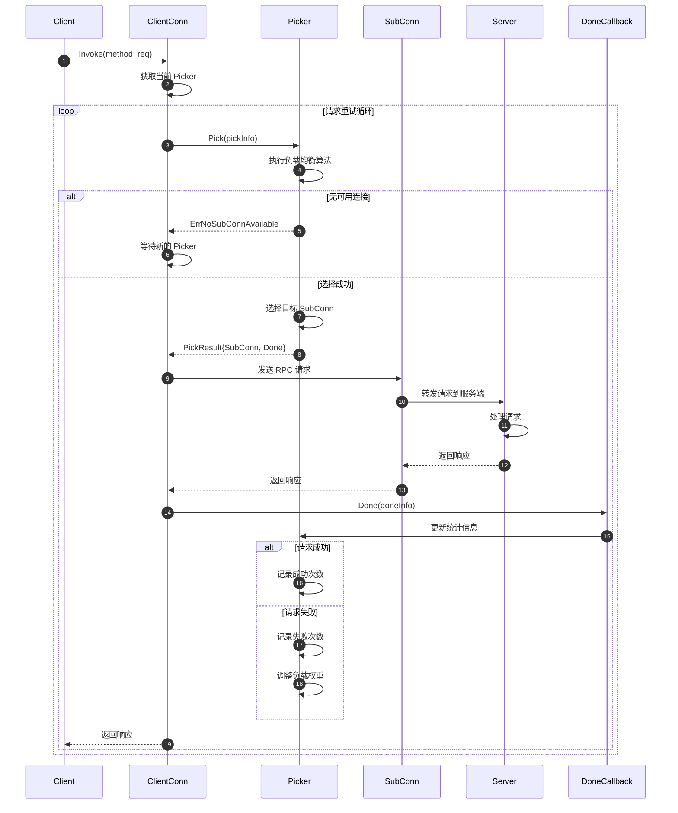
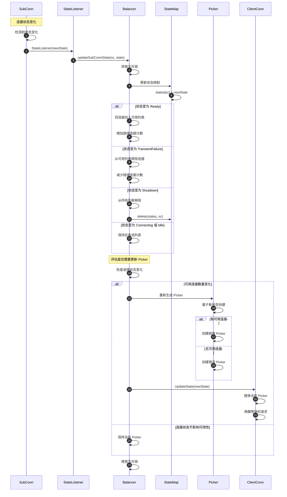
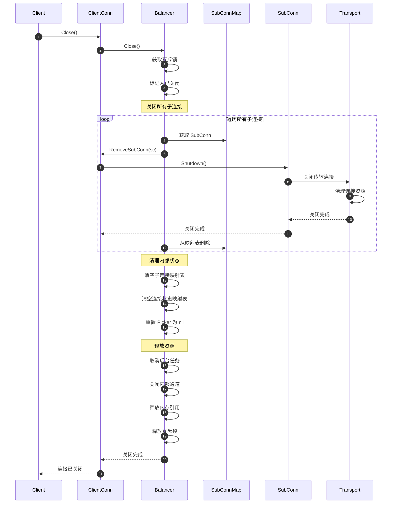

# gRPC-Go 负载均衡模块时序图文档

## 时序图概览

本文档详细描述了 gRPC-Go 负载均衡模块的各种时序流程，包括负载均衡器注册、初始化、地址更新、连接管理、请求分发等核心场景。每个时序图都配有详细的文字说明，帮助理解负载均衡的完整工作流程。

## 核心时序图列表

1. **负载均衡器注册时序图** - 负载均衡器的注册和查找流程
2. **负载均衡器初始化时序图** - 负载均衡器实例的创建和初始化
3. **地址更新时序图** - 服务端地址列表变更的处理流程
4. **子连接管理时序图** - 子连接的创建、连接和状态管理
5. **请求分发时序图** - RPC 请求的负载均衡选择流程
6. **连接状态变更时序图** - 连接状态变化的处理流程
7. **负载均衡器关闭时序图** - 负载均衡器的清理和关闭流程

---

## 1. 负载均衡器注册时序图

### 场景描述
展示负载均衡器的注册流程和查找机制，包括在程序初始化时注册和在创建连接时查找。

**时序说明：**

1. **注册阶段（步骤1-10）：**
   - 在包的 init() 函数中创建构建器实例
   - 调用 Register() 注册到全局映射表
   - 名称统一转换为小写存储

2. **查找阶段（步骤11-17）：**
   - 客户端连接创建时查找负载均衡器
   - 从全局映射表中获取构建器
   - 使用构建器创建负载均衡器实例

**边界条件：**
- 重复注册会覆盖之前的注册
- 查找不存在的负载均衡器返回 nil
- 名称查找不区分大小写（当前版本）

**性能要点：**
- 注册仅在初始化时进行一次
- 查找使用哈希表，O(1) 复杂度
- 无锁设计，读操作高效

---

## 2. 负载均衡器初始化时序图

### 场景描述
展示客户端连接创建时负载均衡器的初始化流程，包括构建器调用和初始状态设置。

**时序说明：**

1. **连接创建（步骤1-6）：**
   - 应用调用 Dial 创建连接
   - 解析服务配置获取负载均衡策略
   - 查找对应的负载均衡器构建器

2. **负载均衡器构建（步骤7-14）：**
   - 调用构建器创建负载均衡器实例
   - 初始化内部数据结构
   - 创建初始的请求选择器

3. **关联绑定（步骤15-17）：**
   - 将负载均衡器关联到客户端连接
   - 准备接收地址更新

**边界条件：**
- 构建器不存在时使用默认策略（pick_first）
- 构建失败会导致连接创建失败
- 初始状态下没有可用连接

**性能要点：**
- 延迟初始化，仅在需要时创建
- 初始状态预分配数据结构
- 避免在构建过程中阻塞

---

## 3. 地址更新时序图

### 场景描述
展示名称解析器返回新的服务端地址列表时，负载均衡器如何处理地址变更，包括创建新连接和删除旧连接。

**时序说明：**

1. **接收地址更新（步骤1-4）：**
   - 名称解析器完成解析
   - 通过 ClientConn 通知负载均衡器
   - 负载均衡器提取新地址列表

2. **处理新增地址（步骤5-17）：**
   - 遍历新地址列表
   - 为新地址创建子连接
   - 启动连接建立流程

3. **处理删除地址（步骤18-25）：**
   - 遍历现有连接
   - 删除不在新列表中的连接
   - 清理内部映射表

4. **更新选择器（步骤26-30）：**
   - 根据最新连接状态生成新的 Picker
   - 通知 ClientConn 使用新 Picker
   - 后续请求使用更新后的连接列表

**边界条件：**
- 地址列表为空时所有连接被删除
- 连接创建失败不影响其他连接
- 删除操作是异步的
- 状态更新是原子的

**性能要点：**
- 批量处理地址变更
- 增量更新，仅处理变化部分
- 异步连接建立不阻塞更新流程
- 最小化锁持有时间

---

## 4. 子连接管理时序图

### 场景描述
展示子连接从创建、连接建立、状态变更到关闭的完整生命周期。

**时序说明：**

1. **创建阶段（步骤1-5）：**
   - 负载均衡器请求创建子连接
   - ClientConn 创建 SubConn 实例
   - 初始状态为 Idle（空闲）

2. **连接阶段（步骤6-22）：**
   - 调用 Connect() 开始建立连接
   - 状态变为 Connecting
   - 执行传输层握手（TCP、HTTP/2）
   - 根据结果设置为 Ready 或 TransientFailure

3. **关闭阶段（步骤23-29）：**
   - 负载均衡器请求删除子连接
   - 调用 Shutdown() 关闭连接
   - 清理传输层资源
   - 状态变为 Shutdown

**边界条件：**
- 连接失败会自动重试
- 状态变更通知是异步的
- 关闭操作是幂等的
- 状态机转换严格遵循规则

**性能要点：**
- 连接建立是异步非阻塞的
- 使用连接池复用底层连接
- 状态变更批量通知
- 退避算法避免连接风暴

---

## 5. 请求分发时序图

### 场景描述
展示客户端发起 RPC 请求时，负载均衡器如何选择合适的子连接进行请求分发。

**时序说明：**

1. **请求初始化（步骤1-2）：**
   - 客户端发起 RPC 调用
   - ClientConn 获取当前的 Picker

2. **连接选择（步骤3-9）：**
   - 调用 Picker.Pick() 选择连接
   - 执行负载均衡算法
   - 返回选中的 SubConn 和回调函数

3. **请求执行（步骤10-15）：**
   - 通过选中的 SubConn 发送请求
   - 服务端处理请求并返回响应
   - ClientConn 接收响应

4. **完成回调（步骤16-22）：**
   - 调用 Done 回调通知请求完成
   - Picker 更新统计信息
   - 根据结果调整负载策略

**边界条件：**
- 无可用连接时会阻塞等待
- 请求失败会根据策略重试
- Done 回调可能不被调用（连接失败）
- Picker 可能在请求过程中被更新

**性能要点：**
- Pick 方法必须快速返回
- 使用原子操作避免锁竞争
- 异步执行 Done 回调
- 批量更新统计信息

---

## 6. 连接状态变更时序图

### 场景描述
展示子连接状态变化时，负载均衡器如何响应并更新请求分发策略。

**时序说明：**

1. **状态变更通知（步骤1-3）：**
   - 子连接检测到状态变化
   - 通过 StateListener 回调通知负载均衡器
   - 负载均衡器开始处理状态更新

2. **状态映射更新（步骤4-15）：**
   - 加锁保护状态映射
   - 根据新状态更新连接列表
   - 不同状态有不同的处理逻辑

3. **Picker 更新评估（步骤16-27）：**
   - 检查是否需要更新 Picker
   - 重新生成 Picker（如果需要）
   - 通知 ClientConn 使用新 Picker

**边界条件：**
- 状态变更回调是异步的
- 多个状态变更可能批量处理
- Picker 更新是原子的
- 等待中的请求会被唤醒

**性能要点：**
- 最小化锁持有时间
- 批量处理状态变更
- 增量更新 Picker
- 避免不必要的 Picker 重建

---

## 7. 负载均衡器关闭时序图

### 场景描述
展示客户端连接关闭时，负载均衡器如何清理资源和关闭所有子连接。

**时序说明：**

1. **关闭触发（步骤1-3）：**
   - 客户端调用 Close() 关闭连接
   - ClientConn 通知负载均衡器关闭
   - 负载均衡器加锁并标记关闭状态

2. **关闭子连接（步骤4-13）：**
   - 遍历所有子连接
   - 逐个关闭子连接
   - 清理传输层资源

3. **清理内部状态（步骤14-17）：**
   - 清空所有内部映射表
   - 重置 Picker 引用
   - 准备资源释放

4. **释放资源（步骤18-22）：**
   - 取消后台任务
   - 关闭内部通道
   - 释放内存引用

**边界条件：**
- 关闭操作是幂等的
- 关闭过程中的请求会失败
- 子连接关闭是异步的
- 资源释放必须完整

**性能要点：**
- 并行关闭子连接
- 超时控制避免永久阻塞
- 及时释放资源避免泄漏
- 优雅关闭不影响其他连接

## 系统级场景时序图

### Round Robin 完整流程

展示使用 Round Robin 负载均衡策略的完整请求流程，从地址解析到请求分发的全过程。

### 连接失败恢复

展示连接失败时的退避重连机制，以及负载均衡器如何在部分连接失败时保持服务可用。

### 地址动态更新

展示服务端实例动态扩缩容时，负载均衡器如何无缝切换连接，保证请求不中断。

这些时序图展示了 gRPC-Go 负载均衡模块在各种场景下的完整工作流程，帮助开发者理解负载均衡的内部机制，为性能优化和故障排查提供指导。
