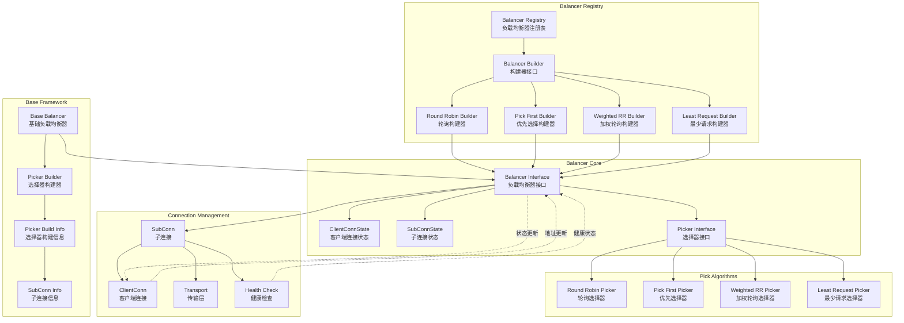
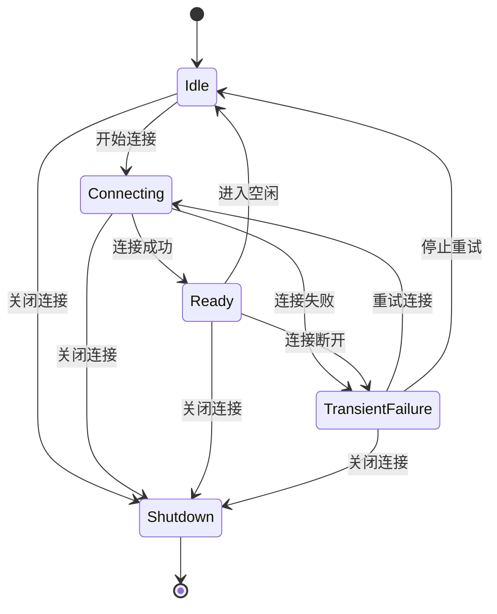

# gRPC-Go 负载均衡模块概览

## 模块职责与边界

### 核心职责
负载均衡模块（Balancer）是 gRPC-Go 客户端连接管理的核心组件，负责在多个后端服务实例之间分发 RPC 请求。该模块提供可插拔的负载均衡策略，支持连接健康检查、故障转移、流量控制等高可用特性，确保客户端请求能够高效、可靠地到达健康的服务实例。

### 输入输出
- **输入：**
  - 后端地址列表（来自服务发现）
  - 连接状态变化事件
  - 服务配置更新
  - RPC 请求选择需求

- **输出：**
  - 连接选择器（Picker）
  - 子连接管理指令
  - 负载均衡状态更新
  - 连接健康状态

### 上下游依赖
- **上游依赖：** 
  - ClientConn（客户端连接）
  - Resolver（服务发现模块）
- **下游依赖：**
  - SubConn（子连接）
  - Transport（传输层）
  - HealthCheck（健康检查）

### 生命周期
1. **注册阶段：** 通过 `Register()` 注册负载均衡器构建器
2. **构建阶段：** 根据配置创建具体的负载均衡器实例
3. **运行期：** 管理子连接和处理请求选择
4. **更新阶段：** 响应地址变化和连接状态更新
5. **关闭阶段：** 清理资源和关闭子连接

## 模块架构图



**架构说明：**

1. **注册表层：**
   - `Balancer Registry` 管理所有已注册的负载均衡器
   - `Builder` 接口定义负载均衡器的创建方式
   - 内置多种负载均衡策略实现

2. **核心接口层：**
   - `Balancer` 接口定义负载均衡器的核心行为
   - `Picker` 接口定义连接选择逻辑
   - 状态管理结构体传递连接信息

3. **基础框架层：**
   - `Base Balancer` 提供通用的负载均衡器实现基础
   - 简化具体策略的实现复杂度
   - 统一子连接管理和状态处理

4. **连接管理层：**
   - `SubConn` 表示到单个后端的连接
   - 集成健康检查和连接状态监控
   - 与传输层交互处理实际网络通信

5. **选择算法层：**
   - 实现具体的连接选择策略
   - 支持无状态和有状态的选择算法
   - 可扩展的算法框架

**设计原则：**
- **可插拔性：** 支持自定义负载均衡策略
- **状态驱动：** 基于连接状态进行决策
- **线程安全：** 支持并发访问和状态更新
- **故障容错：** 自动处理连接故障和恢复

## 核心接口与实现

### Balancer 接口

```go
type Balancer interface {
    // UpdateClientConnState 处理客户端连接状态变化
    UpdateClientConnState(ClientConnState) error
    
    // ResolverError 处理解析器错误
    ResolverError(error)
    
    // UpdateSubConnState 处理子连接状态变化
    UpdateSubConnState(SubConn, SubConnState)
    
    // Close 关闭负载均衡器
    Close()
    
    // ExitIdle 退出空闲状态
    ExitIdle()
}
```

### Builder 接口

```go
type Builder interface {
    // Build 创建负载均衡器实例
    Build(cc ClientConn, opts BuildOptions) Balancer
    
    // Name 返回负载均衡器名称
    Name() string
}
```

### Picker 接口

```go
type Picker interface {
    // Pick 选择用于 RPC 的连接
    Pick(info PickInfo) (PickResult, error)
}
```

## 内置负载均衡策略

### 1. Pick First（优先选择）

**策略描述：**
- 按地址列表顺序尝试连接
- 使用第一个可用的连接处理所有请求
- 连接失败时切换到下一个地址

**适用场景：**
- 单点服务或主备架构
- 对连接数有严格限制的场景
- 简单的故障转移需求

**实现特点：**
```go
type pickFirstBalancer struct {
    state connectivity.State
    cc    balancer.ClientConn
    sc    balancer.SubConn
}

func (b *pickFirstBalancer) UpdateClientConnState(s balancer.ClientConnState) error {
    // 如果地址列表发生变化，重建连接
    if b.sc != nil {
        b.cc.RemoveSubConn(b.sc)
    }
    
    // 创建新的子连接
    sc, err := b.cc.NewSubConn(s.ResolverState.Addresses, balancer.NewSubConnOptions{})
    if err != nil {
        return err
    }
    
    b.sc = sc
    sc.Connect()
    return nil
}
```

### 2. Round Robin（轮询）

**策略描述：**
- 在所有健康连接间轮询分发请求
- 每个连接获得相等的请求机会
- 自动跳过不健康的连接

**适用场景：**
- 后端服务能力相等
- 需要均匀分发请求负载
- 无状态服务调用

**实现特点：**
```go
type roundRobinPicker struct {
    subConns []balancer.SubConn
    next     uint32
}

func (p *roundRobinPicker) Pick(balancer.PickInfo) (balancer.PickResult, error) {
    if len(p.subConns) == 0 {
        return balancer.PickResult{}, balancer.ErrNoSubConnAvailable
    }
    
    // 原子操作实现轮询
    sc := p.subConns[atomic.AddUint32(&p.next, 1)%uint32(len(p.subConns))]
    return balancer.PickResult{SubConn: sc}, nil
}
```

### 3. Weighted Round Robin（加权轮询）

**策略描述：**
- 根据权重分配请求比例
- 支持动态权重调整
- 基于服务器负载反馈调整权重

**适用场景：**
- 后端服务能力不等
- 需要精细控制流量分配
- 支持动态负载感知

**实现特点：**
```go
type weightedRoundRobinPicker struct {
    subConns []weightedSubConn
    mu       sync.Mutex
}

type weightedSubConn struct {
    SubConn balancer.SubConn
    Weight  int64
    Current int64
}

func (p *weightedRoundRobinPicker) Pick(balancer.PickInfo) (balancer.PickResult, error) {
    p.mu.Lock()
    defer p.mu.Unlock()
    
    // 加权轮询算法
    var selected *weightedSubConn
    total := int64(0)
    
    for i := range p.subConns {
        sc := &p.subConns[i]
        sc.Current += sc.Weight
        total += sc.Weight
        
        if selected == nil || sc.Current > selected.Current {
            selected = sc
        }
    }
    
    if selected == nil {
        return balancer.PickResult{}, balancer.ErrNoSubConnAvailable
    }
    
    selected.Current -= total
    return balancer.PickResult{SubConn: selected.SubConn}, nil
}
```

### 4. Least Request（最少请求）

**策略描述：**
- 选择活跃请求数最少的连接
- 实时跟踪每个连接的负载
- 适合处理时间差异较大的请求

**适用场景：**
- 请求处理时间不均匀
- 需要最小化平均响应时间
- 后端服务处理能力动态变化

**实现特点：**
```go
type leastRequestPicker struct {
    subConns []*leastRequestSubConn
}

type leastRequestSubConn struct {
    balancer.SubConn
    inflight int64 // 活跃请求数
}

func (p *leastRequestPicker) Pick(balancer.PickInfo) (balancer.PickResult, error) {
    if len(p.subConns) == 0 {
        return balancer.PickResult{}, balancer.ErrNoSubConnAvailable
    }
    
    // 选择活跃请求数最少的连接
    min := p.subConns[0]
    for _, sc := range p.subConns[1:] {
        if atomic.LoadInt64(&sc.inflight) < atomic.LoadInt64(&min.inflight) {
            min = sc
        }
    }
    
    atomic.AddInt64(&min.inflight, 1)
    
    return balancer.PickResult{
        SubConn: min.SubConn,
        Done: func(balancer.DoneInfo) {
            atomic.AddInt64(&min.inflight, -1)
        },
    }, nil
}
```

## 状态管理与生命周期

### 连接状态枚举

```go
type connectivity.State int32

const (
    Idle connectivity.State = iota
    Connecting
    Ready
    TransientFailure
    Shutdown
)
```

### 状态转换流程



### 生命周期管理

```go
func (b *baseBalancer) UpdateClientConnState(s balancer.ClientConnState) error {
    // 1. 处理地址列表变化
    addrsSet := make(map[resolver.Address]struct{})
    for _, a := range s.ResolverState.Addresses {
        addrsSet[a] = struct{}{}
        
        // 创建新的子连接
        if _, ok := b.subConns[a]; !ok {
            sc, err := b.cc.NewSubConn([]resolver.Address{a}, balancer.NewSubConnOptions{
                HealthCheckEnabled: b.config.HealthCheck,
                StateListener: func(scs balancer.SubConnState) {
                    b.updateSubConnState(sc, scs)
                },
            })
            if err != nil {
                continue
            }
            b.subConns[a] = sc
            sc.Connect()
        }
    }
    
    // 2. 移除不再需要的连接
    for a, sc := range b.subConns {
        if _, ok := addrsSet[a]; !ok {
            b.cc.RemoveSubConn(sc)
            delete(b.subConns, a)
        }
    }
    
    // 3. 更新选择器
    b.regeneratePicker()
    return nil
}
```

## 配置与扩展

### 服务配置格式

```json
{
  "loadBalancingPolicy": "round_robin",
  "loadBalancingConfig": {
    "round_robin": {}
  }
}
```

### 自定义负载均衡器

```go
type customBalancer struct {
    cc       balancer.ClientConn
    subConns map[resolver.Address]balancer.SubConn
    picker   balancer.Picker
}

func (b *customBalancer) Build(cc balancer.ClientConn, opts balancer.BuildOptions) balancer.Balancer {
    return &customBalancer{
        cc:       cc,
        subConns: make(map[resolver.Address]balancer.SubConn),
    }
}

func (b *customBalancer) Name() string {
    return "custom"
}

// 注册自定义负载均衡器
func init() {
    balancer.Register(&customBalancer{})
}
```

### 健康检查集成

```go
type healthCheckConfig struct {
    ServiceName string `json:"serviceName"`
}

func (b *baseBalancer) newSubConnWithHealthCheck(addr resolver.Address) (balancer.SubConn, error) {
    return b.cc.NewSubConn([]resolver.Address{addr}, balancer.NewSubConnOptions{
        HealthCheckEnabled: true,
        StateListener: func(scs balancer.SubConnState) {
            // 处理健康检查状态变化
            if scs.ConnectivityState == connectivity.Ready {
                // 连接健康，加入负载均衡
                b.addReadySubConn(addr, sc)
            } else {
                // 连接不健康，从负载均衡中移除
                b.removeSubConn(addr)
            }
            b.regeneratePicker()
        },
    })
}
```

## 性能优化与最佳实践

### 性能特点
- **无锁选择：** 大多数选择算法使用原子操作，避免锁竞争
- **状态缓存：** 缓存连接状态，减少状态查询开销
- **批量更新：** 批量处理地址变化，减少重建频率
- **内存复用：** 复用数据结构，减少 GC 压力

### 最佳实践
1. **选择合适的策略：** 根据服务特点选择负载均衡算法
2. **启用健康检查：** 及时发现和移除不健康的连接
3. **配置合理的超时：** 避免长时间等待不可用的连接
4. **监控关键指标：** 跟踪连接数、请求分布、错误率等
5. **测试故障场景：** 验证故障转移和恢复机制

通过负载均衡模块的精心设计，gRPC-Go 能够在复杂的分布式环境中提供高可用、高性能的 RPC 通信能力。
