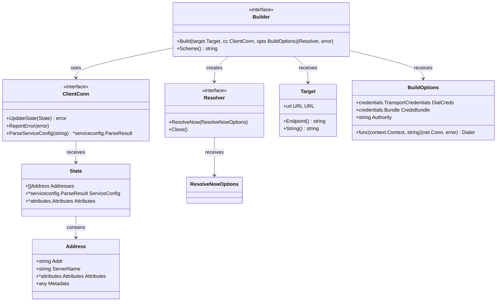
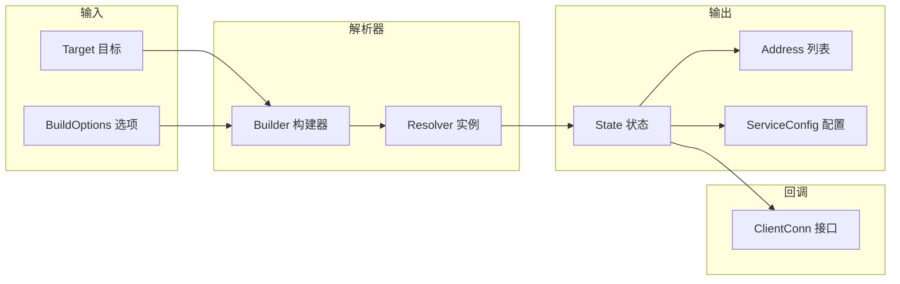

# gRPC-Go 服务发现模块数据结构文档

## 数据结构概览

服务发现模块的数据结构设计体现了名称解析的完整流程，包括目标解析、地址管理、状态同步、配置传递等各个方面。所有数据结构都经过精心设计以支持多种解析策略和动态更新机制。

## 核心数据结构 UML 图



**UML 图说明：**

1. **Builder 接口：** 解析器构建器，创建具体的解析器实例
2. **Resolver 接口：** 核心解析器接口，处理名称解析和监控
3. **ClientConn 接口：** 客户端连接回调接口，通知解析结果
4. **Target 结构：** 解析目标，包含协议和端点信息
5. **State 结构：** 解析状态，包含地址列表和服务配置
6. **Address 结构：** 网络地址信息，包含连接所需的完整信息

## 详细数据结构分析

### 1. Target 结构

```go
// Target 解析目标结构
type Target struct {
    // URL 解析后的目标URL
    // 格式：scheme://authority/endpoint?query
    URL url.URL
}

// Endpoint 获取端点地址
func (t Target) Endpoint() string {
    endpoint := t.URL.Path
    if endpoint == "" {
        endpoint = t.URL.Opaque
    }
    return strings.TrimPrefix(endpoint, "/")
}

// String 返回目标的字符串表示
func (t Target) String() string {
    return t.URL.Scheme + "://" + t.URL.Host + "/" + t.Endpoint()
}
```

**字段说明：**

| 字段 | 类型 | 作用 | 示例 |
|------|------|------|------|
| URL | url.URL | 解析后的完整URL | dns:///example.com:50051 |
| Scheme | string | 解析协议 | dns, passthrough, unix |
| Host | string | 权威标识 | example.com |
| Path/Opaque | string | 端点地址 | /service, 127.0.0.1:50051 |

### 2. State 结构

```go
// State 解析器状态
type State struct {
    // Addresses 解析到的地址列表
    Addresses []Address
    
    // ServiceConfig 服务配置（可选）
    ServiceConfig *serviceconfig.ParseResult
    
    // Attributes 附加属性信息
    Attributes *attributes.Attributes
}
```

**字段说明：**

| 字段 | 类型 | 必填 | 作用 |
|------|------|:----:|------|
| Addresses | []Address | 是 | 后端服务地址列表 |
| ServiceConfig | *serviceconfig.ParseResult | 否 | 服务配置信息 |
| Attributes | *attributes.Attributes | 否 | 自定义属性 |

### 3. Address 结构

```go
// Address 网络地址
type Address struct {
    // Addr 网络地址，格式：host:port
    Addr string
    
    // ServerName 服务器名称，用于TLS验证
    ServerName string
    
    // Attributes 地址属性
    Attributes *attributes.Attributes
    
    // Metadata 元数据（已废弃，使用Attributes）
    Metadata any
}
```

**字段说明：**

| 字段 | 类型 | 必填 | 作用 |
|------|------|:----:|------|
| Addr | string | 是 | 可连接的网络地址 |
| ServerName | string | 否 | TLS握手使用的服务器名 |
| Attributes | *attributes.Attributes | 否 | 负载均衡等使用的属性 |
| Metadata | any | 否 | 已废弃字段 |

### 4. BuildOptions 结构

```go
// BuildOptions 解析器构建选项
type BuildOptions struct {
    // DialCreds 拨号传输凭证
    DialCreds credentials.TransportCredentials
    
    // CredsBundle 凭证包
    CredsBundle credentials.Bundle
    
    // Dialer 自定义拨号函数
    Dialer func(context.Context, string) (net.Conn, error)
    
    // Authority 权威标识
    Authority string
}
```

## DNS 解析器实现

```mermaid
classDiagram
    class dnsBuilder {
        +Build(target Target, cc ClientConn, opts BuildOptions) (Resolver, error)
        +Scheme() string
    }
    
    class dnsResolver {
        +string host
        +string port
        +ClientConn cc
        +chan struct{} rn
        +time.Time lastResolveTime
        +watcher()
        +lookup()
        +ResolveNow(ResolveNowOptions)
        +Close()
    }
    
    dnsBuilder --> dnsResolver : creates
```

```go
// DNS 解析器实现
type dnsResolver struct {
    host string
    port string
    cc   resolver.ClientConn
    
    // 解析触发通道
    rn chan struct{}
    
    // 关闭通道
    ctx    context.Context
    cancel context.CancelFunc
    
    // 最后解析时间
    lastResolveTime time.Time
}

// watcher 解析监控协程
func (d *dnsResolver) watcher() {
    for {
        select {
        case <-d.ctx.Done():
            return
        case <-d.rn:
            d.lookup()
        case <-time.After(30 * time.Minute):
            d.lookup()
        }
    }
}

// lookup 执行DNS查询
func (d *dnsResolver) lookup() {
    // 查询DNS记录
    addrs, err := net.LookupHost(d.host)
    if err != nil {
        d.cc.ReportError(err)
        return
    }
    
    // 构建地址列表
    var resolvedAddrs []resolver.Address
    for _, addr := range addrs {
        resolvedAddrs = append(resolvedAddrs, resolver.Address{
            Addr: net.JoinHostPort(addr, d.port),
        })
    }
    
    // 更新状态
    d.cc.UpdateState(resolver.State{
        Addresses: resolvedAddrs,
    })
}
```

## Manual 解析器实现

```go
// Manual 解析器（用于测试）
type Resolver struct {
    BuildCallback       func(Target, ClientConn, BuildOptions)
    UpdateStateCallback func(error)
    ResolveNowCallback  func(ResolveNowOptions)
    CloseCallback       func()
    
    scheme        string
    mu            sync.Mutex
    cc            ClientConn
    lastSeenState *State
}

// UpdateState 手动更新地址
func (r *Resolver) UpdateState(s State) {
    r.mu.Lock()
    defer r.mu.Unlock()
    
    r.lastSeenState = &s
    if r.cc != nil {
        err := r.cc.UpdateState(s)
        go r.UpdateStateCallback(err)
    }
}
```

## 数据流转图



## 最佳实践

1. **地址格式**
   - 使用标准的 host:port 格式
   - IPv6 地址需要用方括号包裹
   - 确保地址可连接

2. **属性使用**
   - 使用 Attributes 而非 Metadata
   - 合理设置负载均衡属性
   - 避免过大的属性数据

3. **状态更新**
   - 仅在地址变更时更新状态
   - 批量更新减少通知次数
   - 保持状态一致性

4. **错误处理**
   - 及时报告解析错误
   - 区分临时错误和永久错误
   - 提供有意义的错误信息
