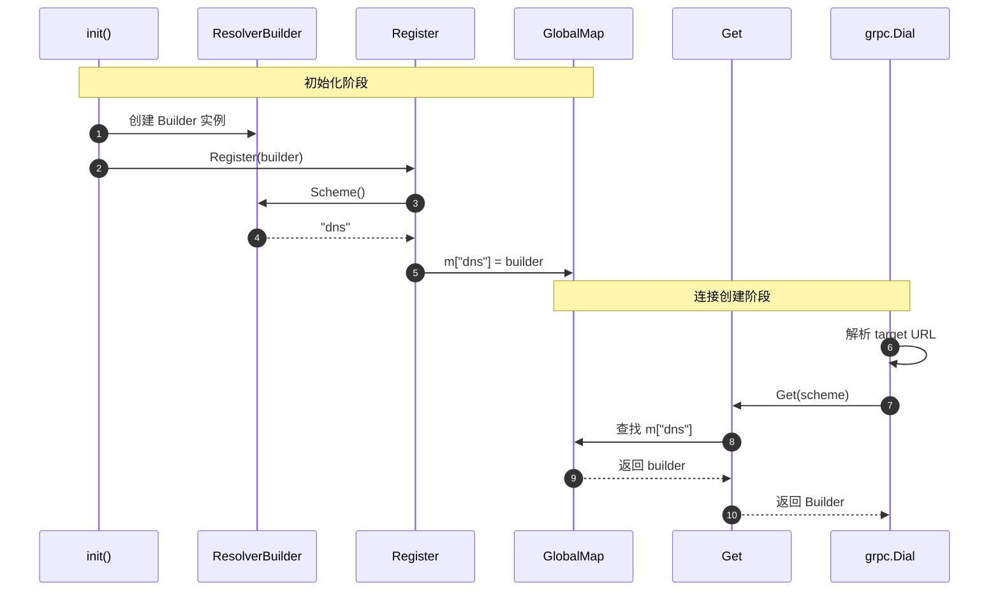
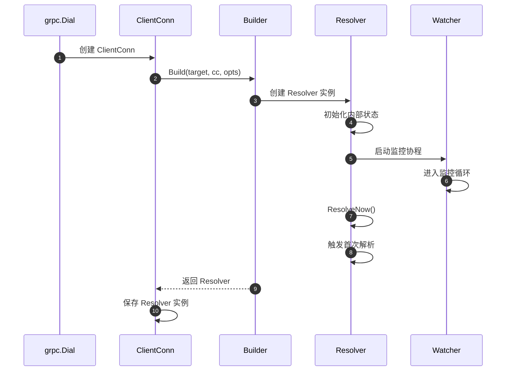
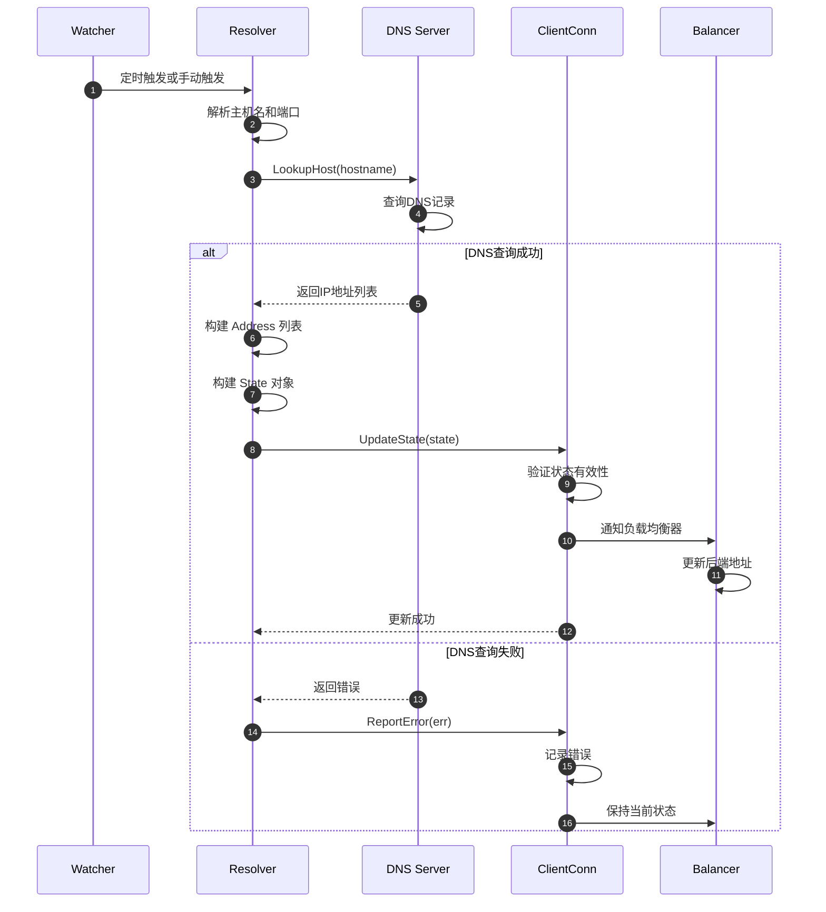
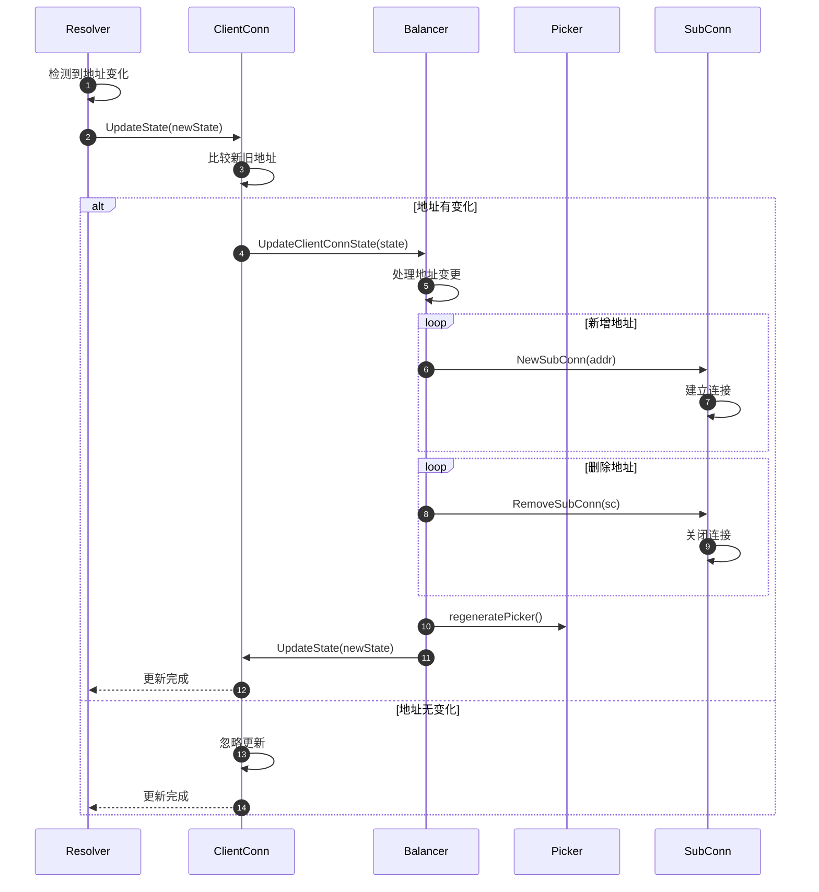
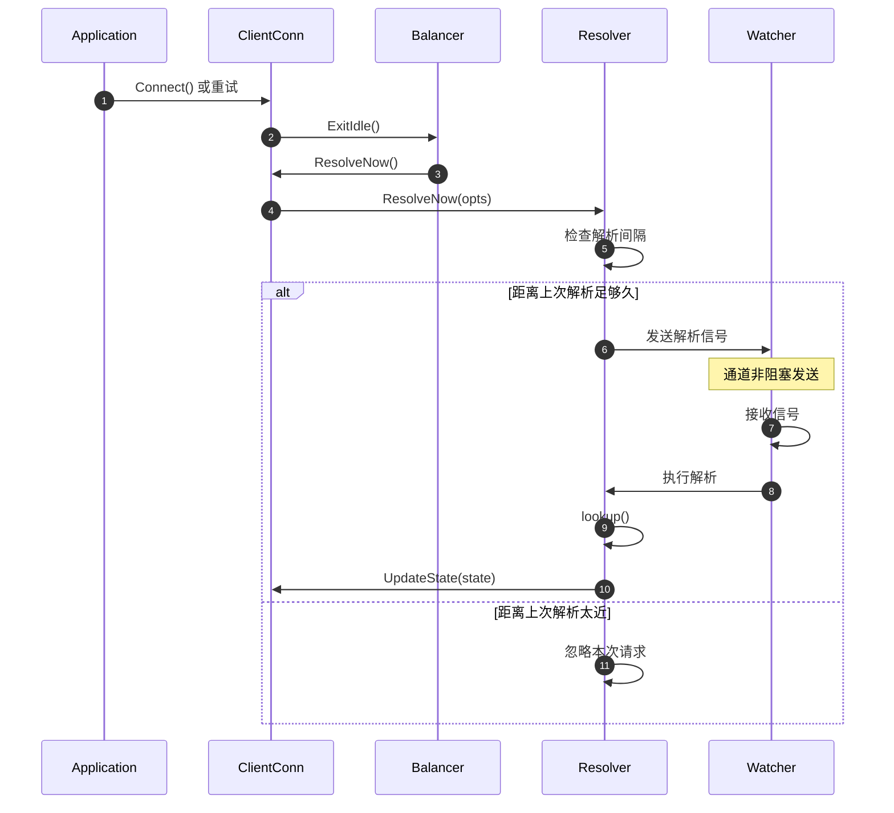
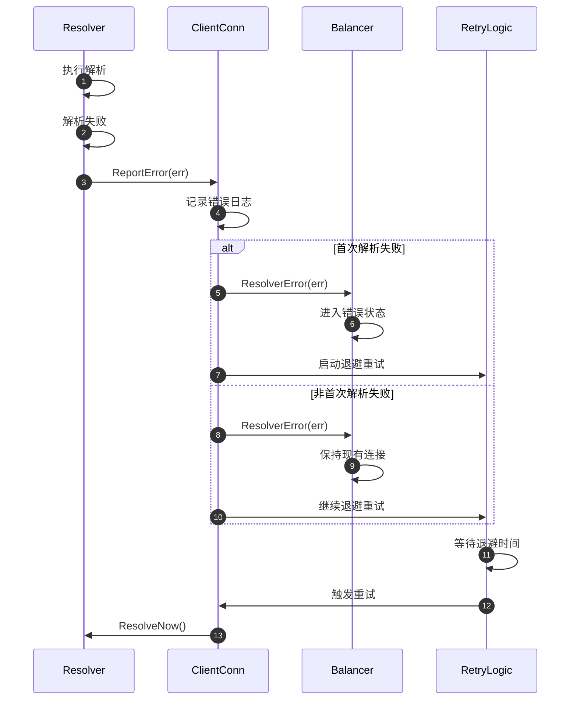
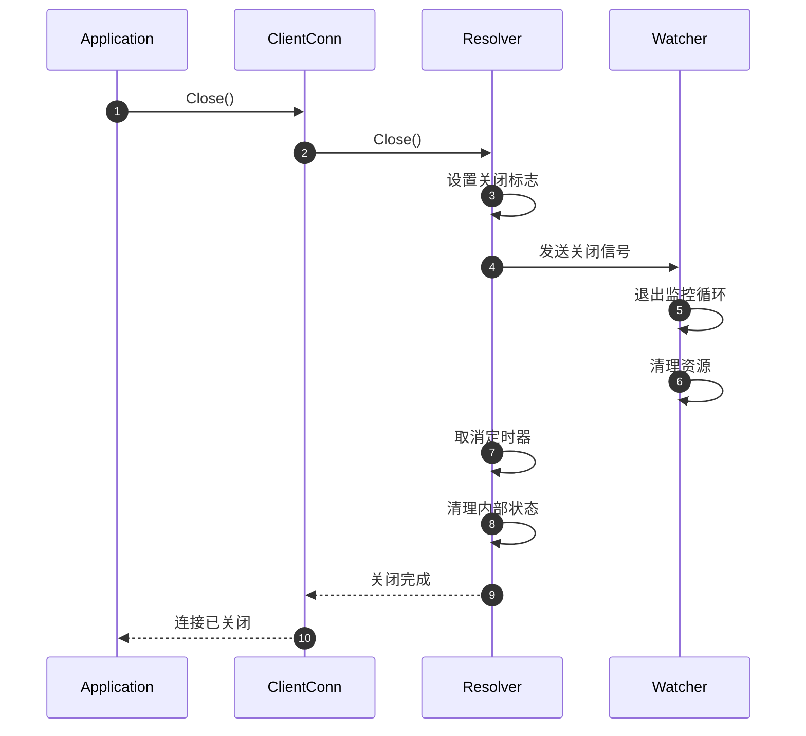

# gRPC-Go 服务发现模块时序图文档

## 时序图概览

本文档详细描述了 gRPC-Go 服务发现模块的各种时序流程，包括解析器注册、初始化、名称解析、状态更新、错误处理等核心场景。每个时序图都配有详细的文字说明，帮助理解服务发现的完整工作流程。

## 核心时序图列表

1. **解析器注册时序图** - 解析器的注册和查找流程
2. **解析器初始化时序图** - 解析器实例的创建和启动
3. **DNS解析时序图** - DNS名称解析的完整流程
4. **地址更新时序图** - 解析结果向客户端的通知流程
5. **立即解析时序图** - ResolveNow触发的解析流程
6. **解析错误处理时序图** - 解析失败的错误处理机制
7. **解析器关闭时序图** - 解析器的清理和关闭流程

---

## 1. 解析器注册时序图

---

## 2. 解析器初始化时序图

---

## 3. DNS解析时序图

---

## 4. 地址更新时序图

---

## 5. 立即解析时序图

---

## 6. 解析错误处理时序图

---

## 7. 解析器关闭时序图

这些时序图展示了 gRPC-Go 服务发现模块在各种场景下的完整工作流程，帮助开发者理解名称解析的内部机制，为服务发现集成和故障排查提供指导。
