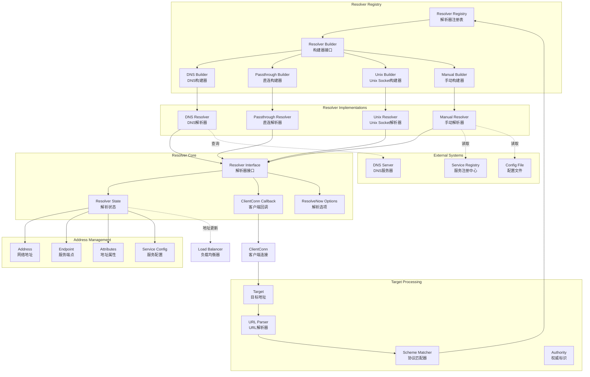
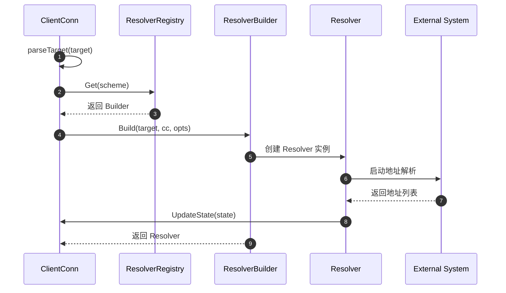
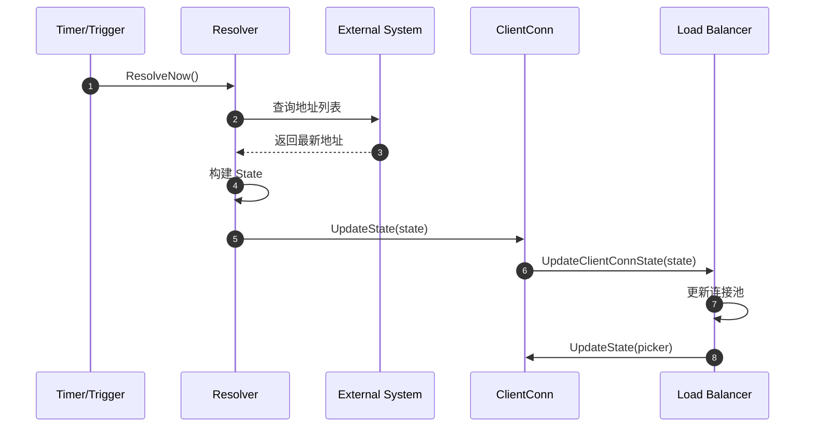

# gRPC-Go 服务发现模块概览

## 模块职责与边界

### 核心职责
服务发现模块（Resolver）是 gRPC-Go 客户端连接管理的关键组件，负责将抽象的服务名称解析为具体的网络地址列表。该模块支持多种解析策略，包括 DNS 解析、直连模式、Unix Socket 等，并能动态监控地址变化，为负载均衡器提供最新的后端服务实例信息。

### 输入输出
- **输入：**
  - 目标服务名称（Target）
  - 解析选项和配置
  - 解析触发请求（ResolveNow）

- **输出：**
  - 解析状态（State）包含地址列表
  - 服务配置信息
  - 解析错误通知
  - 地址变化事件

### 上下游依赖
- **上游依赖：** 
  - ClientConn（客户端连接）
  - 外部服务发现系统（DNS、注册中心等）
- **下游依赖：**
  - Balancer（负载均衡模块）
  - ServiceConfig（服务配置）

### 生命周期
1. **注册阶段：** 通过 `Register()` 注册解析器构建器
2. **构建阶段：** 根据 Target 的 scheme 选择合适的解析器
3. **解析阶段：** 执行名称解析，获取地址列表
4. **监控阶段：** 持续监控地址变化并通知客户端
5. **关闭阶段：** 清理资源和停止监控

## 模块架构图



**架构说明：**

1. **注册表层：**
   - `Resolver Registry` 管理所有已注册的解析器构建器
   - 根据 Target 的 scheme 选择合适的构建器
   - 支持运行时动态注册新的解析器类型

2. **目标处理层：**
   - `Target` 结构解析和验证目标地址格式
   - `URL Parser` 解析标准 URL 格式的目标地址
   - `Scheme Matcher` 根据协议选择对应的解析器

3. **解析器核心层：**
   - `Resolver` 接口定义解析器的核心行为
   - `State` 封装解析结果和服务配置
   - `ClientConn` 回调接口通知地址变化

4. **地址管理层：**
   - `Address` 表示单个网络地址
   - `Endpoint` 表示服务端点，可包含多个地址
   - `Attributes` 存储地址相关的元数据

5. **解析器实现层：**
   - 内置多种解析器实现
   - 支持自定义解析器扩展
   - 每种解析器适用不同的使用场景

**设计原则：**
- **可扩展性：** 支持自定义解析器实现
- **协议无关：** 通过 scheme 机制支持多种协议
- **状态驱动：** 基于状态变化进行通知
- **异步处理：** 非阻塞的地址解析和更新

## 核心接口与数据结构

### Builder 接口

```go
type Builder interface {
    // Build 创建解析器实例
    Build(target Target, cc ClientConn, opts BuildOptions) (Resolver, error)
    
    // Scheme 返回支持的协议名称
    Scheme() string
}
```

### Resolver 接口

```go
type Resolver interface {
    // ResolveNow 触发立即解析
    ResolveNow(ResolveNowOptions)
    
    // Close 关闭解析器
    Close()
}
```

### Target 结构

```go
type Target struct {
    // URL 包含解析后的目标地址
    URL url.URL
}

// 目标地址格式示例：
// dns:///example.com:80
// passthrough:///localhost:50051
// unix:///tmp/grpc.sock
```

### State 结构

```go
type State struct {
    // Addresses 解析得到的地址列表
    Addresses []Address
    
    // Endpoints 服务端点列表（新版本推荐）
    Endpoints []Endpoint
    
    // ServiceConfig 服务配置解析结果
    ServiceConfig *serviceconfig.ParseResult
    
    // Attributes 解析器相关属性
    Attributes *attributes.Attributes
}
```

### Address 结构

```go
type Address struct {
    // Addr 服务器地址
    Addr string
    
    // ServerName TLS 服务器名称
    ServerName string
    
    // Attributes 地址相关属性
    Attributes *attributes.Attributes
    
    // BalancerAttributes 负载均衡器属性
    BalancerAttributes *attributes.Attributes
    
    // Metadata 地址元数据（已废弃）
    Metadata any
}
```

## 内置解析器实现

### 1. DNS Resolver

**功能描述：**
- 通过 DNS 查询解析服务名为 IP 地址列表
- 支持 A、AAAA、SRV 记录查询
- 自动处理 DNS 缓存和 TTL

**Target 格式：**
```
dns:///example.com:80
dns://8.8.8.8/example.com:80  // 指定 DNS 服务器
```

**实现特点：**
```go
type dnsResolver struct {
    host         string
    port         string
    resolver     netResolver
    wg           sync.WaitGroup
    cc           resolver.ClientConn
    rn           chan struct{}
    disableServiceConfig bool
}

func (d *dnsResolver) ResolveNow(resolver.ResolveNowOptions) {
    select {
    case d.rn <- struct{}{}:
    default:
    }
}

func (d *dnsResolver) watcher() {
    defer d.wg.Done()
    for {
        select {
        case <-d.ctx.Done():
            return
        case <-d.rn:
            // 执行 DNS 查询
            state, err := d.lookup()
            if err != nil {
                d.cc.ReportError(err)
            } else {
                d.cc.UpdateState(state)
            }
        case <-time.After(30 * time.Minute):
            // 定期刷新
            d.ResolveNow(resolver.ResolveNowOptions{})
        }
    }
}
```

**适用场景：**
- 标准的服务发现场景
- 需要动态地址解析
- 支持 DNS 负载均衡

### 2. Passthrough Resolver

**功能描述：**
- 直接使用提供的地址，不进行解析
- 适用于已知确切地址的场景
- 最简单的解析器实现

**Target 格式：**
```
passthrough:///localhost:50051
passthrough:///192.168.1.100:8080
```

**实现特点：**
```go
type passthroughResolver struct {
    target resolver.Target
    cc     resolver.ClientConn
}

func (r *passthroughResolver) start() {
    // 直接使用 target 中的地址
    addr := resolver.Address{Addr: r.target.Endpoint()}
    r.cc.UpdateState(resolver.State{Addresses: []resolver.Address{addr}})
}

func (r *passthroughResolver) ResolveNow(resolver.ResolveNowOptions) {
    // 无需额外操作
}
```

**适用场景：**
- 开发测试环境
- 已知固定地址的服务
- 不需要服务发现的场景

### 3. Unix Socket Resolver

**功能描述：**
- 解析 Unix Domain Socket 地址
- 支持本地进程间通信
- 高性能的本地连接方式

**Target 格式：**
```
unix:///tmp/grpc.sock
unix:///var/run/service.sock
```

**实现特点：**
```go
type unixResolver struct {
    target resolver.Target
    cc     resolver.ClientConn
}

func (r *unixResolver) start() {
    // Unix socket 地址处理
    addr := resolver.Address{
        Addr: r.target.URL.Path, // 使用完整路径
    }
    r.cc.UpdateState(resolver.State{Addresses: []resolver.Address{addr}})
}
```

**适用场景：**
- 本地微服务通信
- 高性能要求的场景
- 容器内服务通信

### 4. Manual Resolver

**功能描述：**
- 手动控制地址列表
- 支持动态添加/删除地址
- 适用于测试和特殊场景

**使用示例：**
```go
r := manual.NewBuilderWithScheme("manual")
r.InitialState(resolver.State{
    Addresses: []resolver.Address{
        {Addr: "localhost:50051"},
        {Addr: "localhost:50052"},
    },
})

conn, err := grpc.NewClient("manual:///test", grpc.WithResolvers(r))

// 动态更新地址
r.UpdateState(resolver.State{
    Addresses: []resolver.Address{
        {Addr: "localhost:50053"},
    },
})
```

**适用场景：**
- 单元测试和集成测试
- 需要精确控制地址变化的场景
- 自定义服务发现逻辑

## 解析流程与状态管理

### 解析器创建流程



### 地址更新流程



## 服务配置集成

### 服务配置格式

```json
{
  "loadBalancingPolicy": "round_robin",
  "methodConfig": [{
    "name": [{"service": "example.Service"}],
    "waitForReady": true,
    "timeout": "10s",
    "maxRequestMessageBytes": 1024,
    "maxResponseMessageBytes": 1024,
    "retryPolicy": {
      "maxAttempts": 3,
      "initialBackoff": "0.1s",
      "maxBackoff": "1s",
      "backoffMultiplier": 2,
      "retryableStatusCodes": ["UNAVAILABLE"]
    }
  }]
}
```

### DNS TXT 记录服务配置

```bash
# DNS TXT 记录示例
_grpc_config.example.com. 300 IN TXT "grpc_config=[{\"serviceConfig\":{\"loadBalancingPolicy\":\"round_robin\"}}]"
```

### 服务配置解析

```go
func (d *dnsResolver) lookupTXT() (*serviceconfig.ParseResult, error) {
    // 查询 DNS TXT 记录
    txtRecords, err := d.resolver.LookupTXT(d.ctx, "_grpc_config."+d.host)
    if err != nil {
        return nil, err
    }
    
    // 解析服务配置
    for _, txt := range txtRecords {
        if strings.HasPrefix(txt, "grpc_config=") {
            config := strings.TrimPrefix(txt, "grpc_config=")
            return d.cc.ParseServiceConfig(config), nil
        }
    }
    
    return nil, nil
}
```

## 自定义解析器实现

### 实现步骤

1. **实现 Builder 接口：**
```go
type customBuilder struct{}

func (b *customBuilder) Build(target resolver.Target, cc resolver.ClientConn, opts resolver.BuildOptions) (resolver.Resolver, error) {
    r := &customResolver{
        target: target,
        cc:     cc,
        close:  make(chan struct{}),
    }
    go r.start()
    return r, nil
}

func (b *customBuilder) Scheme() string {
    return "custom"
}
```

2. **实现 Resolver 接口：**
```go
type customResolver struct {
    target resolver.Target
    cc     resolver.ClientConn
    close  chan struct{}
}

func (r *customResolver) start() {
    // 实现自定义解析逻辑
    for {
        select {
        case <-r.close:
            return
        case <-time.After(30 * time.Second):
            // 定期更新地址
            r.resolve()
        }
    }
}

func (r *customResolver) resolve() {
    // 自定义地址解析逻辑
    addresses := r.discoverServices(r.target.Endpoint())
    
    state := resolver.State{
        Addresses: addresses,
    }
    
    r.cc.UpdateState(state)
}

func (r *customResolver) ResolveNow(resolver.ResolveNowOptions) {
    go r.resolve()
}

func (r *customResolver) Close() {
    close(r.close)
}
```

3. **注册解析器：**
```go
func init() {
    resolver.Register(&customBuilder{})
}
```

## 性能优化与最佳实践

### 性能特点
- **异步解析：** 解析过程不阻塞 RPC 调用
- **缓存机制：** DNS 解析结果缓存，减少查询频率
- **批量更新：** 地址变化批量通知，减少更新开销
- **连接复用：** 解析器实例复用，避免重复创建

### 最佳实践

1. **选择合适的解析器：**
   - 生产环境推荐使用 DNS 解析器
   - 开发测试可使用 passthrough 解析器
   - 本地通信优先考虑 unix socket

2. **DNS 解析优化：**
   - 配置合理的 DNS 缓存 TTL
   - 使用可靠的 DNS 服务器
   - 监控 DNS 查询延迟和失败率

3. **错误处理：**
   - 实现解析失败的重试机制
   - 记录解析错误日志便于排查
   - 提供降级方案应对解析失败

4. **监控告警：**
   - 监控地址解析成功率
   - 跟踪地址变化频率
   - 设置解析延迟阈值告警

5. **服务配置管理：**
   - 合理配置负载均衡策略
   - 设置适当的超时和重试参数
   - 定期验证服务配置的有效性

通过服务发现模块的灵活设计，gRPC-Go 能够适应各种部署环境和服务发现需求，为分布式系统提供可靠的服务定位能力。
