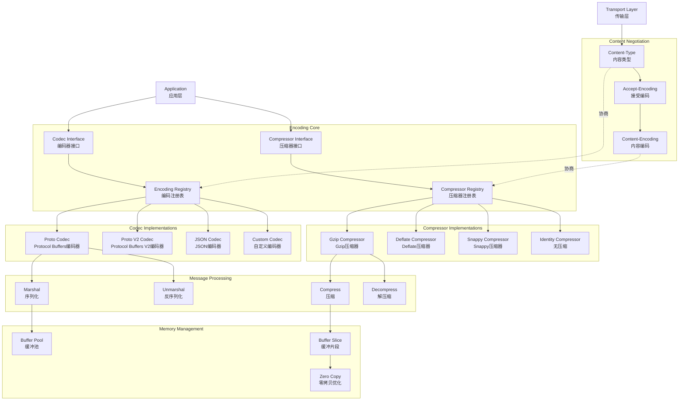

# gRPC-Go 编码压缩模块概览

## 模块职责与边界

### 核心职责
编码压缩模块（Encoding）是 gRPC-Go 消息处理的核心组件，负责消息的序列化/反序列化和数据压缩/解压缩。该模块提供可插拔的编码器（Codec）和压缩器（Compressor）接口，支持多种数据格式（Protocol Buffers、JSON等）和压缩算法（gzip、deflate等），优化网络传输效率和性能。

### 输入输出
- **输入：**
  - Go 对象实例（需要序列化）
  - 字节数据（需要反序列化）
  - 压缩配置参数
  - 内容类型标识

- **输出：**
  - 序列化后的字节数据
  - 反序列化的 Go 对象
  - 压缩/解压缩的数据流
  - 编码元数据信息

### 上下游依赖
- **上游依赖：**
  - ClientConn/Server（连接和服务管理）
  - Transport（传输层）
  - Message（消息结构）
- **下游依赖：**
  - Protocol Buffers 库
  - 压缩算法库（gzip等）
  - 内存管理（mem.Buffer）

### 生命周期
1. **注册阶段：** 注册编码器和压缩器实现
2. **协商阶段：** 客户端和服务端协商编码和压缩方式
3. **编码阶段：** 序列化消息并可选压缩
4. **传输阶段：** 通过网络传输编码后的数据
5. **解码阶段：** 解压缩并反序列化消息

## 模块架构图



**架构说明：**

1. **编码核心层：**
   - `Encoding Registry` 管理所有已注册的编码器
   - `Compressor Registry` 管理所有已注册的压缩器
   - 统一的接口定义和查找机制

2. **编码器实现层：**
   - `Proto Codec` 支持 Protocol Buffers 格式
   - `JSON Codec` 支持 JSON 格式编码
   - 支持自定义编码器扩展

3. **压缩器实现层：**
   - 内置多种压缩算法实现
   - 支持压缩级别和参数配置
   - 可扩展的压缩器框架

4. **消息处理层：**
   - 序列化和反序列化操作
   - 压缩和解压缩处理
   - 错误处理和性能优化

5. **内存管理层：**
   - 缓冲池减少内存分配
   - 零拷贝优化提高性能
   - 内存引用计数管理

6. **内容协商层：**
   - HTTP 标准的内容类型协商
   - 自动选择最优编码和压缩方式
   - 兼容性处理

**设计原则：**
- **可插拔性：** 支持自定义编码器和压缩器
- **性能优先：** 零拷贝和内存池优化
- **标准兼容：** 遵循 HTTP 和 gRPC 协议标准
- **向后兼容：** 支持多版本编码器共存

## 核心接口与实现

### Codec 接口

```go
type Codec interface {
    // Marshal 将对象序列化为字节数组
    Marshal(v any) ([]byte, error)
    
    // Unmarshal 将字节数组反序列化为对象
    Unmarshal(data []byte, v any) error
    
    // Name 返回编码器名称
    Name() string
}
```

### CodecV2 接口（新版本）

```go
type CodecV2 interface {
    // Marshal 返回内存缓冲片段，支持零拷贝
    Marshal(v any) (out mem.BufferSlice, err error)
    
    // Unmarshal 从缓冲片段反序列化
    Unmarshal(data mem.BufferSlice, v any) error
    
    // Name 返回编码器名称
    Name() string
}
```

### Compressor 接口

```go
type Compressor interface {
    // Compress 创建压缩写入器
    Compress(w io.Writer) (io.WriteCloser, error)
    
    // Decompress 创建解压缩读取器
    Decompress(r io.Reader) (io.Reader, error)
    
    // Name 返回压缩器名称
    Name() string
}
```

## 编码器实现

### 1. Protocol Buffers Codec

**功能描述：**
- gRPC 默认的编码格式
- 高效的二进制序列化
- 强类型和向后兼容性

**实现特点：**
```go
type codecV2 struct{}

func (c *codecV2) Marshal(v any) (mem.BufferSlice, error) {
    // 1. 类型检查
    vv := protoadapt.MessageV2Of(v)
    if vv == nil {
        return nil, fmt.Errorf("failed to marshal, message is %T, want proto.Message", v)
    }
    
    // 2. 序列化
    data, err := proto.Marshal(vv)
    if err != nil {
        return nil, err
    }
    
    // 3. 创建缓冲片段
    return mem.BufferSlice{mem.NewBuffer(&data, nil)}, nil
}

func (c *codecV2) Unmarshal(data mem.BufferSlice, v any) error {
    // 1. 类型检查
    vv := protoadapt.MessageV2Of(v)
    if vv == nil {
        return fmt.Errorf("failed to unmarshal, message is %T, want proto.Message", v)
    }
    
    // 2. 合并缓冲片段
    buf := data.MaterializeToBuffer(mem.DefaultBufferPool())
    defer buf.Free()
    
    // 3. 反序列化
    return proto.Unmarshal(buf.ReadOnlyData(), vv)
}

func (c *codecV2) Name() string {
    return "proto"
}
```

**适用场景：**
- 高性能要求的服务间通信
- 需要强类型约束的场景
- 跨语言服务调用

### 2. JSON Codec

**功能描述：**
- 人类可读的文本格式
- 便于调试和测试
- 与 Web 前端集成友好

**实现示例：**
```go
type jsonCodec struct{}

func (j *jsonCodec) Marshal(v any) ([]byte, error) {
    if pm, ok := v.(proto.Message); ok {
        // Protocol Buffers 消息转 JSON
        return protojson.Marshal(pm)
    }
    
    // 普通 Go 对象转 JSON
    return json.Marshal(v)
}

func (j *jsonCodec) Unmarshal(data []byte, v any) error {
    if pm, ok := v.(proto.Message); ok {
        // JSON 转 Protocol Buffers 消息
        return protojson.Unmarshal(data, pm)
    }
    
    // JSON 转普通 Go 对象
    return json.Unmarshal(data, v)
}

func (j *jsonCodec) Name() string {
    return "json"
}

// 注册 JSON 编码器
func init() {
    encoding.RegisterCodec(&jsonCodec{})
}
```

**适用场景：**
- 调试和开发阶段
- 与 REST API 混合的场景
- 需要人工检查消息内容

### 3. 自定义编码器

**实现步骤：**
```go
type customCodec struct {
    name string
}

func (c *customCodec) Marshal(v any) ([]byte, error) {
    // 实现自定义序列化逻辑
    switch msg := v.(type) {
    case *CustomMessage:
        return c.marshalCustomMessage(msg)
    default:
        return nil, fmt.Errorf("unsupported message type: %T", v)
    }
}

func (c *customCodec) Unmarshal(data []byte, v any) error {
    // 实现自定义反序列化逻辑
    switch msg := v.(type) {
    case *CustomMessage:
        return c.unmarshalCustomMessage(data, msg)
    default:
        return fmt.Errorf("unsupported message type: %T", v)
    }
}

func (c *customCodec) Name() string {
    return c.name
}

// 注册自定义编码器
func init() {
    encoding.RegisterCodec(&customCodec{name: "custom"})
}
```

## 压缩器实现

### 1. Gzip Compressor

**功能描述：**
- 标准的 gzip 压缩算法
- 良好的压缩率和兼容性
- 支持压缩级别配置

**实现特点：**
```go
type gzipCompressor struct {
    level int
}

func (g *gzipCompressor) Compress(w io.Writer) (io.WriteCloser, error) {
    // 创建 gzip 写入器
    gzw, err := gzip.NewWriterLevel(w, g.level)
    if err != nil {
        return nil, err
    }
    return gzw, nil
}

func (g *gzipCompressor) Decompress(r io.Reader) (io.Reader, error) {
    // 创建 gzip 读取器
    return gzip.NewReader(r)
}

func (g *gzipCompressor) Name() string {
    return "gzip"
}

// 支持解压缩大小预估
func (g *gzipCompressor) DecompressedSize(compressedBytes []byte) int {
    // 从 gzip 头部读取原始大小（如果可用）
    if len(compressedBytes) < 10 {
        return -1 // 未知大小
    }
    // 实现大小预估逻辑
    return -1
}

// 注册 gzip 压缩器
func init() {
    encoding.RegisterCompressor(&gzipCompressor{
        level: gzip.DefaultCompression,
    })
}
```

**配置选项：**
```go
// 不同压缩级别的 gzip
func NewGzipCompressor(level int) Compressor {
    return &gzipCompressor{level: level}
}

// 使用示例
encoding.RegisterCompressor(NewGzipCompressor(gzip.BestCompression))
```

### 2. 自定义压缩器

**实现示例：**
```go
type snappyCompressor struct{}

func (s *snappyCompressor) Compress(w io.Writer) (io.WriteCloser, error) {
    return &snappyWriteCloser{
        Writer: snappy.NewBufferedWriter(w),
        w:      w,
    }, nil
}

func (s *snappyCompressor) Decompress(r io.Reader) (io.Reader, error) {
    return snappy.NewReader(r), nil
}

func (s *snappyCompressor) Name() string {
    return "snappy"
}

type snappyWriteCloser struct {
    *snappy.Writer
    w io.Writer
}

func (swc *snappyWriteCloser) Close() error {
    if err := swc.Writer.Close(); err != nil {
        return err
    }
    if closer, ok := swc.w.(io.Closer); ok {
        return closer.Close()
    }
    return nil
}
```

## 内容协商机制

### 编码协商

```go
// 客户端指定编码类型
conn, err := grpc.NewClient(target,
    grpc.WithDefaultCallOptions(grpc.CallContentSubtype("json")),
)

// 服务端支持多种编码
server := grpc.NewServer()
// 自动根据 Content-Type 选择编码器
```

### 压缩协商

```go
// 客户端启用压缩
conn, err := grpc.NewClient(target,
    grpc.WithCompressor(gzip.Name),
)

// 或者在调用时指定
ctx := context.Background()
resp, err := client.Method(ctx, req, grpc.UseCompressor("gzip"))

// 服务端自动处理压缩
server := grpc.NewServer(
    grpc.RPCCompressor(gzip.NewCompressor()),
    grpc.RPCDecompressor(gzip.NewDecompressor()),
)
```

### HTTP 头部处理

```
Content-Type: application/grpc+proto
Content-Encoding: gzip
Accept-Encoding: gzip, deflate
```

## 性能优化策略

### 1. 零拷贝优化

```go
// V2 编码器支持零拷贝
type optimizedCodec struct{}

func (c *optimizedCodec) Marshal(v any) (mem.BufferSlice, error) {
    // 直接使用内存缓冲，避免数据拷贝
    if marshaler, ok := v.(BufferMarshaler); ok {
        return marshaler.MarshalToBuffer()
    }
    
    // 回退到标准序列化
    data, err := proto.Marshal(v.(proto.Message))
    if err != nil {
        return nil, err
    }
    
    return mem.BufferSlice{mem.NewBuffer(&data, nil)}, nil
}
```

### 2. 内存池管理

```go
type pooledCodec struct {
    bufferPool mem.BufferPool
}

func (c *pooledCodec) Marshal(v any) (mem.BufferSlice, error) {
    // 从池中获取缓冲区
    buf := c.bufferPool.Get()
    defer buf.Free()
    
    // 序列化到缓冲区
    data, err := proto.Marshal(v.(proto.Message))
    if err != nil {
        return nil, err
    }
    
    // 复制数据到缓冲区
    copy(buf.Data(), data)
    return mem.BufferSlice{buf}, nil
}
```

### 3. 压缩优化

```go
type adaptiveCompressor struct {
    threshold int // 压缩阈值
}

func (a *adaptiveCompressor) Compress(w io.Writer) (io.WriteCloser, error) {
    return &adaptiveWriter{
        writer:    w,
        threshold: a.threshold,
        buffer:    make([]byte, 0, a.threshold),
    }, nil
}

type adaptiveWriter struct {
    writer    io.Writer
    threshold int
    buffer    []byte
    compressed bool
}

func (aw *adaptiveWriter) Write(p []byte) (int, error) {
    // 只有数据量超过阈值才启用压缩
    if !aw.compressed && len(aw.buffer)+len(p) > aw.threshold {
        // 启用压缩
        gzw := gzip.NewWriter(aw.writer)
        gzw.Write(aw.buffer)
        aw.writer = gzw
        aw.compressed = true
    }
    
    if aw.compressed {
        return aw.writer.Write(p)
    } else {
        aw.buffer = append(aw.buffer, p...)
        return len(p), nil
    }
}
```

## 使用示例与最佳实践

### 1. 基本使用

```go
// 服务端配置
server := grpc.NewServer()

// 客户端配置
conn, err := grpc.NewClient(target,
    grpc.WithTransportCredentials(insecure.NewCredentials()),
)
```

### 2. 自定义编码

```go
// 注册自定义编码器
encoding.RegisterCodec(&myCodec{})

// 使用自定义编码
conn, err := grpc.NewClient(target,
    grpc.WithDefaultCallOptions(grpc.CallContentSubtype("mycoding")),
)
```

### 3. 压缩配置

```go
// 全局压缩
conn, err := grpc.NewClient(target,
    grpc.WithCompressor("gzip"),
)

// 按请求压缩
resp, err := client.Method(ctx, req, grpc.UseCompressor("gzip"))
```

### 4. 性能监控

```go
// 监控编码性能
type instrumentedCodec struct {
    codec    encoding.Codec
    metrics  *CodecMetrics
}

func (i *instrumentedCodec) Marshal(v any) ([]byte, error) {
    start := time.Now()
    data, err := i.codec.Marshal(v)
    duration := time.Since(start)
    
    i.metrics.MarshalDuration.Observe(duration.Seconds())
    i.metrics.MarshalSize.Observe(float64(len(data)))
    
    return data, err
}
```

## 最佳实践建议

1. **编码选择：**
   - 生产环境推荐使用 Protocol Buffers
   - 调试阶段可使用 JSON 编码
   - 根据性能需求选择合适的编码器

2. **压缩策略：**
   - 大消息（>1KB）建议启用压缩
   - 根据网络环境选择压缩算法
   - 监控压缩率和CPU开销

3. **性能优化：**
   - 使用 V2 编码器支持零拷贝
   - 配置合适的内存池大小
   - 避免频繁的编码器切换

4. **错误处理：**
   - 处理编码不兼容的情况
   - 提供降级方案
   - 记录编码错误日志

通过编码压缩模块的灵活设计，gRPC-Go 能够在保证性能的同时支持多种数据格式和压缩算法，满足不同场景的需求。
