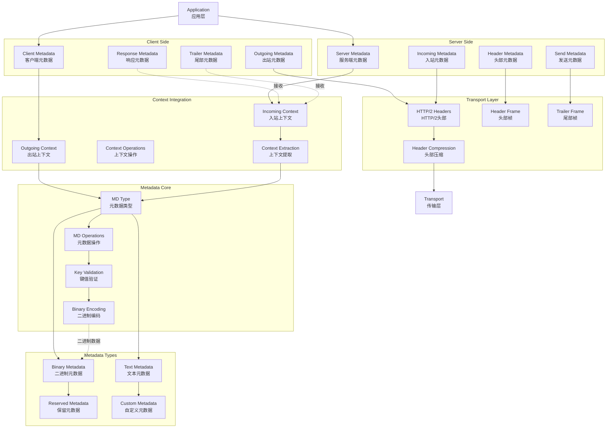

# gRPC-Go 元数据处理模块概览

## 模块职责与边界

### 核心职责
元数据处理模块（Metadata）是 gRPC-Go 中负责管理请求和响应元数据的核心组件。该模块提供了一套完整的 API 来创建、操作和传递 HTTP/2 头部信息，支持自定义元数据的发送和接收，实现了 gRPC 协议中元数据传输的标准化处理。

### 输入输出
- **输入：**
  - 键值对形式的元数据
  - Context 上下文对象
  - HTTP/2 头部信息
  - 二进制和文本数据

- **输出：**
  - 格式化的元数据对象（MD）
  - 包含元数据的 Context
  - HTTP/2 传输头部
  - 元数据访问接口

### 上下游依赖
- **上游依赖：**
  - ClientConn（客户端连接）
  - Server（服务端处理）
  - Context（上下文传递）
- **下游依赖：**
  - Transport（传输层）
  - HTTP/2 协议栈
  - Interceptor（拦截器）

### 生命周期
1. **创建阶段：** 构建元数据对象和键值映射
2. **注入阶段：** 将元数据注入到 Context 中
3. **传输阶段：** 通过 HTTP/2 头部传输元数据
4. **提取阶段：** 从接收端 Context 中提取元数据
5. **处理阶段：** 业务逻辑使用和修改元数据

## 模块架构图



**架构说明：**

1. **元数据核心层：**
   - `MD Type` 定义元数据的基本数据结构
   - `MD Operations` 提供元数据的操作方法
   - `Key Validation` 验证元数据键的合法性
   - `Binary Encoding` 处理二进制数据编码

2. **上下文集成层：**
   - `Outgoing Context` 管理出站请求的元数据
   - `Incoming Context` 管理入站请求的元数据
   - 提供统一的上下文操作接口

3. **客户端处理层：**
   - 管理客户端发送和接收的各种元数据
   - 支持请求头部和响应尾部元数据

4. **服务端处理层：**
   - 处理服务端接收和发送的元数据
   - 支持动态添加响应元数据

5. **传输层集成：**
   - 与 HTTP/2 协议栈集成
   - 处理头部压缩和传输优化

6. **元数据类型层：**
   - 支持文本和二进制两种数据类型
   - 区分系统保留和用户自定义元数据

**设计原则：**
- **类型安全：** 强类型的元数据操作接口
- **协议兼容：** 完全兼容 gRPC 和 HTTP/2 标准
- **性能优化：** 高效的内存管理和数据传输
- **易用性：** 简洁的 API 设计和上下文集成

## 核心数据结构

### MD 类型定义

```go
// MD 是元数据的映射类型，从键到值列表的映射
type MD map[string][]string

// 创建元数据的便捷方法
func New(m map[string]string) MD
func Pairs(kv ...string) MD

// 元数据操作方法
func (md MD) Len() int
func (md MD) Copy() MD
func (md MD) Get(k string) []string
func (md MD) Set(k string, vals ...string)
func (md MD) Append(k string, vals ...string)
func (md MD) Delete(k string)
```

### 上下文集成

```go
// 出站元数据操作
func NewOutgoingContext(ctx context.Context, md MD) context.Context
func AppendToOutgoingContext(ctx context.Context, kv ...string) context.Context
func FromOutgoingContext(ctx context.Context) (MD, bool)

// 入站元数据操作
func NewIncomingContext(ctx context.Context, md MD) context.Context
func FromIncomingContext(ctx context.Context) (MD, bool)
```

## 元数据操作实现

### 1. 创建元数据

**基本创建方式：**
```go
// 从映射创建
md := metadata.New(map[string]string{
    "authorization": "Bearer token123",
    "user-id":       "12345",
    "trace-id":      "abc-def-ghi",
})

// 从键值对创建
md := metadata.Pairs(
    "authorization", "Bearer token123",
    "user-id", "12345",
    "trace-id", "abc-def-ghi",
)

// 空元数据
md := metadata.MD{}
```

**实现特点：**
```go
func New(m map[string]string) MD {
    md := make(MD, len(m))
    for k, val := range m {
        // 键名转换为小写
        key := strings.ToLower(k)
        md[key] = append(md[key], val)
    }
    return md
}

func Pairs(kv ...string) MD {
    // 检查参数数量
    if len(kv)%2 == 1 {
        panic(fmt.Sprintf("metadata: Pairs got odd number of input pairs: %d", len(kv)))
    }
    
    md := make(MD, len(kv)/2)
    for i := 0; i < len(kv); i += 2 {
        key := strings.ToLower(kv[i])
        md[key] = append(md[key], kv[i+1])
    }
    return md
}
```

### 2. 元数据操作

**基本操作：**
```go
// 获取值
values := md.Get("authorization")
if len(values) > 0 {
    token := values[0]
}

// 设置值（覆盖）
md.Set("user-id", "67890")

// 追加值
md.Append("custom-header", "value1", "value2")

// 删除键
md.Delete("old-header")

// 复制元数据
newMD := md.Copy()

// 获取长度
count := md.Len()
```

**实现细节：**
```go
func (md MD) Get(k string) []string {
    k = strings.ToLower(k)
    return md[k]
}

func (md MD) Set(k string, vals ...string) {
    if len(vals) == 0 {
        return
    }
    k = strings.ToLower(k)
    md[k] = vals
}

func (md MD) Append(k string, vals ...string) {
    if len(vals) == 0 {
        return
    }
    k = strings.ToLower(k)
    md[k] = append(md[k], vals...)
}

func (md MD) Delete(k string) {
    k = strings.ToLower(k)
    delete(md, k)
}
```

### 3. 二进制数据支持

**二进制元数据：**
```go
// 二进制数据键必须以 "-bin" 结尾
func encodeBinaryHeader(v []byte) string {
    return base64.StdEncoding.EncodeToString(v)
}

func decodeBinaryHeader(v string) ([]byte, error) {
    return base64.StdEncoding.DecodeString(v)
}

// 使用示例
binaryData := []byte{0x01, 0x02, 0x03, 0x04}
md := metadata.Pairs(
    "binary-data-bin", encodeBinaryHeader(binaryData),
)
```

**键名验证：**
```go
func isValidMetadataKey(key string) bool {
    if len(key) == 0 {
        return false
    }
    
    // 检查保留前缀
    if strings.HasPrefix(strings.ToLower(key), "grpc-") {
        return false
    }
    
    // 检查字符合法性
    for _, c := range key {
        if !isValidKeyChar(c) {
            return false
        }
    }
    
    return true
}

func isValidKeyChar(c rune) bool {
    return (c >= 'a' && c <= 'z') ||
           (c >= '0' && c <= '9') ||
           c == '-' || c == '_' || c == '.'
}
```

## 客户端元数据处理

### 1. 发送元数据

**基本用法：**
```go
// 创建带元数据的上下文
md := metadata.Pairs(
    "authorization", "Bearer token123",
    "user-agent", "my-grpc-client/1.0",
)
ctx := metadata.NewOutgoingContext(context.Background(), md)

// 发起 RPC 调用
resp, err := client.Method(ctx, req)

// 追加元数据到现有上下文
ctx = metadata.AppendToOutgoingContext(ctx,
    "request-id", "req-12345",
    "client-version", "1.0.0",
)
```

**动态元数据：**
```go
// 在拦截器中动态添加元数据
func clientInterceptor(ctx context.Context, method string, req, reply any, 
    cc *grpc.ClientConn, invoker grpc.UnaryInvoker, opts ...grpc.CallOption) error {
    
    // 添加请求追踪信息
    traceID := generateTraceID()
    ctx = metadata.AppendToOutgoingContext(ctx, "trace-id", traceID)
    
    // 添加认证信息
    if token := getAuthToken(); token != "" {
        ctx = metadata.AppendToOutgoingContext(ctx, "authorization", "Bearer "+token)
    }
    
    return invoker(ctx, method, req, reply, cc, opts...)
}
```

### 2. 接收元数据

**响应头部元数据：**
```go
var header metadata.MD
var trailer metadata.MD

resp, err := client.Method(ctx, req, 
    grpc.Header(&header),    // 接收响应头部
    grpc.Trailer(&trailer),  // 接收响应尾部
)

if err != nil {
    return err
}

// 处理响应元数据
if values := header.Get("server-version"); len(values) > 0 {
    serverVersion := values[0]
    log.Printf("Server version: %s", serverVersion)
}

// 处理尾部元数据
if values := trailer.Get("request-cost"); len(values) > 0 {
    cost := values[0]
    log.Printf("Request cost: %s", cost)
}
```

**流式调用元数据：**
```go
stream, err := client.StreamMethod(ctx)
if err != nil {
    return err
}

// 获取流的头部元数据
header, err := stream.Header()
if err != nil {
    return err
}

// 发送消息
for _, msg := range messages {
    if err := stream.Send(msg); err != nil {
        return err
    }
}

// 关闭发送并获取响应
resp, err := stream.CloseAndRecv()
if err != nil {
    return err
}

// 获取尾部元数据
trailer := stream.Trailer()
```

## 服务端元数据处理

### 1. 接收元数据

**从上下文获取：**
```go
func (s *server) Method(ctx context.Context, req *Request) (*Response, error) {
    // 获取入站元数据
    md, ok := metadata.FromIncomingContext(ctx)
    if !ok {
        return nil, status.Error(codes.Internal, "failed to get metadata")
    }
    
    // 处理认证信息
    if auth := md.Get("authorization"); len(auth) > 0 {
        token := strings.TrimPrefix(auth[0], "Bearer ")
        if !validateToken(token) {
            return nil, status.Error(codes.Unauthenticated, "invalid token")
        }
    }
    
    // 获取用户ID
    var userID string
    if values := md.Get("user-id"); len(values) > 0 {
        userID = values[0]
    }
    
    // 处理业务逻辑
    return s.processRequest(ctx, req, userID)
}
```

### 2. 发送元数据

**发送头部元数据：**
```go
func (s *server) Method(ctx context.Context, req *Request) (*Response, error) {
    // 创建响应头部元数据
    header := metadata.Pairs(
        "server-version", "1.0.0",
        "request-id", generateRequestID(),
        "processing-time", time.Now().Format(time.RFC3339),
    )
    
    // 发送头部元数据
    if err := grpc.SendHeader(ctx, header); err != nil {
        return nil, err
    }
    
    // 处理请求
    resp := &Response{
        // 响应数据
    }
    
    // 设置尾部元数据
    trailer := metadata.Pairs(
        "request-cost", "0.05",
        "cache-hit", "true",
    )
    grpc.SetTrailer(ctx, trailer)
    
    return resp, nil
}
```

**流式服务元数据：**
```go
func (s *server) StreamMethod(stream StreamService_StreamMethodServer) error {
    // 获取流上下文
    ctx := stream.Context()
    
    // 发送初始头部元数据
    header := metadata.Pairs("stream-id", generateStreamID())
    if err := stream.SendHeader(header); err != nil {
        return err
    }
    
    // 处理流消息
    for {
        req, err := stream.Recv()
        if err == io.EOF {
            break
        }
        if err != nil {
            return err
        }
        
        // 处理请求并发送响应
        resp := processStreamRequest(req)
        if err := stream.Send(resp); err != nil {
            return err
        }
    }
    
    // 设置尾部元数据
    trailer := metadata.Pairs("total-processed", "100")
    stream.SetTrailer(trailer)
    
    return nil
}
```

## 元数据传输机制

### HTTP/2 头部映射

```go
// gRPC 元数据到 HTTP/2 头部的映射规则
func metadataToHTTP2Headers(md metadata.MD) http.Header {
    headers := make(http.Header)
    
    for key, values := range md {
        // 处理二进制数据
        if strings.HasSuffix(key, "-bin") {
            for _, value := range values {
                // 二进制数据需要 base64 编码
                headers.Add(key, value)
            }
        } else {
            // 文本数据直接添加
            for _, value := range values {
                headers.Add(key, value)
            }
        }
    }
    
    return headers
}

// HTTP/2 头部到 gRPC 元数据的映射
func http2HeadersToMetadata(headers http.Header) metadata.MD {
    md := metadata.MD{}
    
    for key, values := range headers {
        // 跳过 HTTP/2 伪头部
        if strings.HasPrefix(key, ":") {
            continue
        }
        
        // 转换为小写
        key = strings.ToLower(key)
        
        // 添加到元数据
        for _, value := range values {
            md[key] = append(md[key], value)
        }
    }
    
    return md
}
```

### 元数据验证

```go
func validateMetadata(md metadata.MD) error {
    for key, values := range md {
        // 验证键名
        if !isValidMetadataKey(key) {
            return fmt.Errorf("invalid metadata key: %s", key)
        }
        
        // 验证值
        for _, value := range values {
            if strings.HasSuffix(key, "-bin") {
                // 验证二进制数据编码
                if _, err := base64.StdEncoding.DecodeString(value); err != nil {
                    return fmt.Errorf("invalid binary metadata value for key %s: %v", key, err)
                }
            } else {
                // 验证文本数据
                if !isValidMetadataValue(value) {
                    return fmt.Errorf("invalid metadata value for key %s", key)
                }
            }
        }
    }
    
    return nil
}
```

## 使用示例与最佳实践

### 1. 认证与授权

```go
// 客户端发送认证信息
func authenticatedCall(client ServiceClient, token string) error {
    md := metadata.Pairs("authorization", "Bearer "+token)
    ctx := metadata.NewOutgoingContext(context.Background(), md)
    
    resp, err := client.Method(ctx, &Request{})
    if err != nil {
        return err
    }
    
    return nil
}

// 服务端验证认证信息
func (s *server) Method(ctx context.Context, req *Request) (*Response, error) {
    md, ok := metadata.FromIncomingContext(ctx)
    if !ok {
        return nil, status.Error(codes.Unauthenticated, "missing metadata")
    }
    
    auth := md.Get("authorization")
    if len(auth) == 0 {
        return nil, status.Error(codes.Unauthenticated, "missing authorization")
    }
    
    token := strings.TrimPrefix(auth[0], "Bearer ")
    if !validateJWT(token) {
        return nil, status.Error(codes.Unauthenticated, "invalid token")
    }
    
    return &Response{}, nil
}
```

### 2. 请求追踪

```go
// 分布式追踪
func tracingInterceptor(ctx context.Context, method string, req, reply any,
    cc *grpc.ClientConn, invoker grpc.UnaryInvoker, opts ...grpc.CallOption) error {
    
    // 生成或传递追踪ID
    traceID := getOrGenerateTraceID(ctx)
    spanID := generateSpanID()
    
    ctx = metadata.AppendToOutgoingContext(ctx,
        "trace-id", traceID,
        "span-id", spanID,
        "parent-span-id", getParentSpanID(ctx),
    )
    
    // 记录开始时间
    start := time.Now()
    
    // 执行调用
    err := invoker(ctx, method, req, reply, cc, opts...)
    
    // 记录追踪信息
    duration := time.Since(start)
    recordSpan(traceID, spanID, method, duration, err)
    
    return err
}
```

### 3. 限流与熔断

```go
// 基于元数据的限流
func rateLimitInterceptor(ctx context.Context, req any, info *grpc.UnaryServerInfo, 
    handler grpc.UnaryHandler) (any, error) {
    
    md, ok := metadata.FromIncomingContext(ctx)
    if !ok {
        return nil, status.Error(codes.Internal, "missing metadata")
    }
    
    // 获取客户端标识
    clientID := "default"
    if values := md.Get("client-id"); len(values) > 0 {
        clientID = values[0]
    }
    
    // 检查限流
    if !rateLimiter.Allow(clientID) {
        return nil, status.Error(codes.ResourceExhausted, "rate limit exceeded")
    }
    
    return handler(ctx, req)
}
```

### 4. 性能监控

```go
// 性能指标收集
func metricsInterceptor(ctx context.Context, req any, info *grpc.UnaryServerInfo,
    handler grpc.UnaryHandler) (any, error) {
    
    start := time.Now()
    
    // 执行处理
    resp, err := handler(ctx, req)
    
    // 记录指标
    duration := time.Since(start)
    method := info.FullMethod
    
    // 通过尾部元数据返回性能信息
    trailer := metadata.Pairs(
        "processing-time-ms", fmt.Sprintf("%.2f", float64(duration.Nanoseconds())/1e6),
        "memory-usage-kb", fmt.Sprintf("%d", getMemoryUsage()/1024),
    )
    grpc.SetTrailer(ctx, trailer)
    
    // 记录到监控系统
    recordMetrics(method, duration, err)
    
    return resp, err
}
```

## 最佳实践建议

1. **键名规范：**
   - 使用小写字母、数字、连字符和下划线
   - 避免使用 "grpc-" 前缀（系统保留）
   - 二进制数据键必须以 "-bin" 结尾

2. **值处理：**
   - 文本值使用 UTF-8 编码
   - 二进制值使用 base64 编码
   - 避免过长的元数据值

3. **性能优化：**
   - 合理控制元数据数量和大小
   - 重用元数据对象避免重复创建
   - 使用追加操作而非重建元数据

4. **安全考虑：**
   - 敏感信息使用加密传输
   - 验证元数据来源和完整性
   - 防止元数据注入攻击

通过元数据处理模块的完整实现，gRPC-Go 提供了灵活而强大的元数据管理能力，支持各种复杂的业务场景和系统集成需求。
