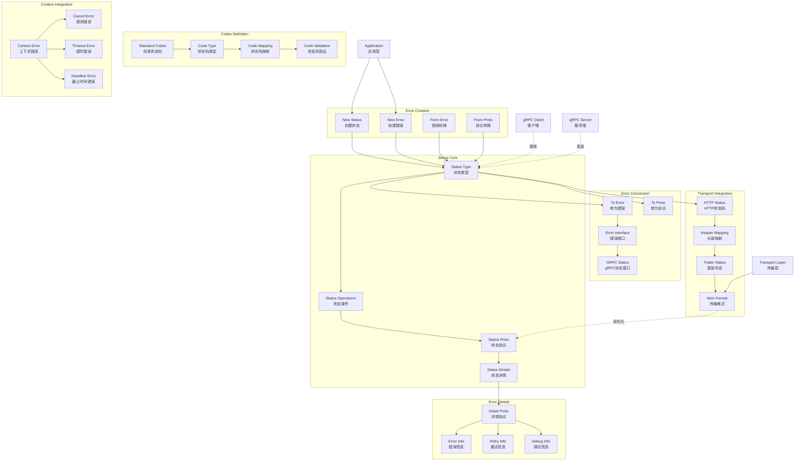

# gRPC-Go 状态码错误处理模块概览

## 模块职责与边界

### 核心职责
状态码错误处理模块（Status & Codes）是 gRPC-Go 中负责错误状态管理和传输的核心组件。该模块定义了标准的 gRPC 状态码体系，提供了丰富的错误创建、转换和传输机制，支持结构化错误信息和详细错误上下文的传递，确保客户端和服务端之间的错误语义一致性。

### 输入输出
- **输入：**
  - 标准 Go error 对象
  - 状态码和错误消息
  - Protocol Buffers 状态对象
  - 上下文错误信息

- **输出：**
  - gRPC Status 对象
  - 标准化错误码
  - 结构化错误详情
  - 可序列化的状态信息

### 上下游依赖
- **上游依赖：**
  - 业务逻辑层（Service Implementation）
  - 拦截器（Interceptors）
  - 传输层（Transport）
- **下游依赖：**
  - Protocol Buffers（状态序列化）
  - HTTP/2 状态码映射
  - 日志和监控系统

### 生命周期
1. **创建阶段：** 根据业务错误创建 gRPC 状态
2. **传输阶段：** 序列化状态信息并通过网络传输
3. **接收阶段：** 反序列化网络状态信息
4. **转换阶段：** 将 gRPC 状态转换为标准 Go 错误
5. **处理阶段：** 业务层处理和响应错误

## 模块架构图



**架构说明：**

1. **状态核心层：**
   - `Status Type` 定义 gRPC 状态的基本结构
   - `Status Operations` 提供状态操作方法
   - `Status Proto` 处理协议缓冲区序列化
   - `Status Details` 管理详细错误信息

2. **状态码定义层：**
   - `Code Type` 定义状态码的基本类型
   - `Standard Codes` 包含所有标准 gRPC 状态码
   - `Code Mapping` 处理状态码与 HTTP 状态码的映射
   - `Code Validation` 验证状态码的有效性

3. **错误创建层：**
   - 提供多种错误和状态创建方式
   - 支持从不同来源转换为 gRPC 状态
   - 统一的错误创建接口

4. **错误转换层：**
   - 双向转换 gRPC 状态和标准 Go 错误
   - 实现标准错误接口
   - 支持协议缓冲区序列化

5. **上下文集成层：**
   - 处理上下文相关的错误类型
   - 自动转换取消和超时错误
   - 保持错误语义一致性

6. **传输集成层：**
   - 与 HTTP/2 传输层集成
   - 处理状态码的网络传输
   - 支持头部和尾部状态传输

7. **错误详情层：**
   - 支持结构化错误详情
   - 提供标准错误信息类型
   - 支持自定义错误详情

**设计原则：**
- **标准兼容：** 完全遵循 gRPC 状态码标准
- **类型安全：** 强类型的状态码和错误处理
- **互操作性：** 跨语言的错误语义一致性
- **可扩展性：** 支持自定义错误详情和处理

## 核心数据结构

### Code 类型定义

```go
// Code 表示 gRPC 状态码
type Code uint32

// 标准状态码常量
const (
    OK                 Code = 0   // 成功
    Canceled           Code = 1   // 已取消
    Unknown            Code = 2   // 未知错误
    InvalidArgument    Code = 3   // 无效参数
    DeadlineExceeded   Code = 4   // 超时
    NotFound           Code = 5   // 未找到
    AlreadyExists      Code = 6   // 已存在
    PermissionDenied   Code = 7   // 权限拒绝
    ResourceExhausted  Code = 8   // 资源耗尽
    FailedPrecondition Code = 9   // 前置条件失败
    Aborted            Code = 10  // 已中止
    OutOfRange         Code = 11  // 超出范围
    Unimplemented      Code = 12  // 未实现
    Internal           Code = 13  // 内部错误
    Unavailable        Code = 14  // 不可用
    DataLoss           Code = 15  // 数据丢失
    Unauthenticated    Code = 16  // 未认证
)
```

### Status 类型定义

```go
// Status 表示 gRPC 状态，包含状态码、消息和详情
type Status struct {
    code    codes.Code
    message string
    details []any
}

// 状态操作方法
func (s *Status) Code() codes.Code
func (s *Status) Message() string
func (s *Status) Details() []any
func (s *Status) Err() error
func (s *Status) Proto() *spb.Status
```

## 状态码详细说明

### 1. 成功状态码

**OK (0)：**
```go
// 成功状态，不应该作为错误返回
status := status.New(codes.OK, "success")
// 或者直接返回 nil
return nil
```

**使用场景：**
- 操作成功完成
- 没有错误发生
- 正常的响应返回

### 2. 客户端错误状态码

**InvalidArgument (3)：**
```go
// 客户端提供了无效参数
return status.Error(codes.InvalidArgument, "user ID must be positive")

// 带格式化消息
return status.Errorf(codes.InvalidArgument, "invalid email format: %s", email)
```

**NotFound (5)：**
```go
// 请求的资源不存在
return status.Error(codes.NotFound, "user not found")

// 带资源标识
return status.Errorf(codes.NotFound, "user with ID %d not found", userID)
```

**AlreadyExists (6)：**
```go
// 尝试创建已存在的资源
return status.Error(codes.AlreadyExists, "user already exists")
```

**PermissionDenied (7)：**
```go
// 权限不足
return status.Error(codes.PermissionDenied, "insufficient permissions")
```

**Unauthenticated (16)：**
```go
// 认证失败
return status.Error(codes.Unauthenticated, "invalid credentials")
```

### 3. 服务端错误状态码

**Internal (13)：**
```go
// 内部服务器错误
return status.Error(codes.Internal, "database connection failed")
```

**Unavailable (14)：**
```go
// 服务不可用
return status.Error(codes.Unavailable, "service temporarily unavailable")
```

**Unimplemented (12)：**
```go
// 方法未实现
return status.Error(codes.Unimplemented, "method not implemented")
```

### 4. 系统错误状态码

**Canceled (1)：**
```go
// 操作被取消（通常由客户端取消）
// 这个状态码通常由 gRPC 框架自动生成
```

**DeadlineExceeded (4)：**
```go
// 操作超时
// 通常由 gRPC 框架在超时时自动生成
```

**ResourceExhausted (8)：**
```go
// 资源耗尽（如配额、限流）
return status.Error(codes.ResourceExhausted, "rate limit exceeded")
```

## 状态操作实现

### 1. 创建状态

**基本创建：**
```go
// 创建状态对象
st := status.New(codes.InvalidArgument, "invalid user ID")

// 创建错误对象
err := status.Error(codes.NotFound, "user not found")

// 格式化创建
err := status.Errorf(codes.Internal, "database error: %v", dbErr)
```

**从 Proto 创建：**
```go
// 从 Protocol Buffers 状态创建
pbStatus := &spb.Status{
    Code:    int32(codes.InvalidArgument),
    Message: "invalid request",
    Details: []*anypb.Any{...},
}
st := status.FromProto(pbStatus)
err := status.ErrorProto(pbStatus)
```

### 2. 状态转换

**错误转状态：**
```go
// 从标准错误转换
func convertError(err error) *status.Status {
    if err == nil {
        return status.New(codes.OK, "")
    }
    
    // 尝试提取 gRPC 状态
    if st, ok := status.FromError(err); ok {
        return st
    }
    
    // 转换为未知错误
    return status.New(codes.Unknown, err.Error())
}

// 便捷转换函数
st := status.Convert(err)
code := status.Code(err)
```

**上下文错误转换：**
```go
func handleContextError(err error) error {
    if err == nil {
        return nil
    }
    
    switch err {
    case context.Canceled:
        return status.Error(codes.Canceled, "request canceled")
    case context.DeadlineExceeded:
        return status.Error(codes.DeadlineExceeded, "request timeout")
    default:
        if errors.Is(err, context.Canceled) {
            return status.Error(codes.Canceled, "request canceled")
        }
        if errors.Is(err, context.DeadlineExceeded) {
            return status.Error(codes.DeadlineExceeded, "request timeout")
        }
        return err
    }
}
```

### 3. 状态详情

**添加错误详情：**
```go
// 创建带详情的状态
st := status.New(codes.InvalidArgument, "validation failed")

// 添加详细信息
detail := &errdetails.BadRequest{
    FieldViolations: []*errdetails.BadRequest_FieldViolation{
        {
            Field:       "email",
            Description: "invalid email format",
        },
        {
            Field:       "age",
            Description: "age must be between 18 and 100",
        },
    },
}

st, err := st.WithDetails(detail)
if err != nil {
    return status.Error(codes.Internal, "failed to add error details")
}

return st.Err()
```

**提取错误详情：**
```go
func extractErrorDetails(err error) {
    st, ok := status.FromError(err)
    if !ok {
        return
    }
    
    for _, detail := range st.Details() {
        switch d := detail.(type) {
        case *errdetails.BadRequest:
            for _, violation := range d.FieldViolations {
                fmt.Printf("Field %s: %s\n", violation.Field, violation.Description)
            }
        case *errdetails.RetryInfo:
            fmt.Printf("Retry after: %v\n", d.RetryDelay.AsDuration())
        case *errdetails.ErrorInfo:
            fmt.Printf("Error reason: %s, domain: %s\n", d.Reason, d.Domain)
        }
    }
}
```

## 客户端错误处理

### 1. 基本错误处理

```go
func handleClientError(client ServiceClient) {
    resp, err := client.GetUser(ctx, &GetUserRequest{Id: 123})
    if err != nil {
        // 获取 gRPC 状态
        st, ok := status.FromError(err)
        if !ok {
            log.Printf("Non-gRPC error: %v", err)
            return
        }
        
        // 根据状态码处理
        switch st.Code() {
        case codes.NotFound:
            log.Printf("User not found: %s", st.Message())
        case codes.InvalidArgument:
            log.Printf("Invalid argument: %s", st.Message())
        case codes.PermissionDenied:
            log.Printf("Permission denied: %s", st.Message())
        case codes.Unavailable:
            log.Printf("Service unavailable: %s", st.Message())
            // 可以实现重试逻辑
        default:
            log.Printf("RPC failed: %v", err)
        }
        return
    }
    
    // 处理成功响应
    log.Printf("User: %v", resp)
}
```

### 2. 重试机制

```go
func retryableCall(client ServiceClient, req *Request) (*Response, error) {
    maxRetries := 3
    backoff := time.Second
    
    for i := 0; i < maxRetries; i++ {
        resp, err := client.Method(ctx, req)
        if err == nil {
            return resp, nil
        }
        
        // 检查是否可重试
        st := status.Convert(err)
        switch st.Code() {
        case codes.Unavailable, codes.DeadlineExceeded, codes.ResourceExhausted:
            // 可重试的错误
            if i < maxRetries-1 {
                log.Printf("Retry %d/%d after error: %v", i+1, maxRetries, err)
                time.Sleep(backoff)
                backoff *= 2 // 指数退避
                continue
            }
        case codes.InvalidArgument, codes.NotFound, codes.PermissionDenied:
            // 不可重试的错误
            return nil, err
        }
        
        return nil, err
    }
    
    return nil, status.Error(codes.Unavailable, "max retries exceeded")
}
```

### 3. 错误详情处理

```go
func handleDetailedError(err error) {
    st, ok := status.FromError(err)
    if !ok {
        return
    }
    
    // 检查重试信息
    for _, detail := range st.Details() {
        if retryInfo, ok := detail.(*errdetails.RetryInfo); ok {
            delay := retryInfo.RetryDelay.AsDuration()
            log.Printf("Retry after: %v", delay)
            time.Sleep(delay)
            // 执行重试
            return
        }
        
        if errorInfo, ok := detail.(*errdetails.ErrorInfo); ok {
            log.Printf("Error reason: %s, domain: %s", errorInfo.Reason, errorInfo.Domain)
            for k, v := range errorInfo.Metadata {
                log.Printf("  %s: %s", k, v)
            }
        }
    }
}
```

## 服务端错误处理

### 1. 业务错误转换

```go
func (s *server) CreateUser(ctx context.Context, req *CreateUserRequest) (*CreateUserResponse, error) {
    // 参数验证
    if req.Email == "" {
        return nil, status.Error(codes.InvalidArgument, "email is required")
    }
    
    if !isValidEmail(req.Email) {
        return nil, status.Error(codes.InvalidArgument, "invalid email format")
    }
    
    // 业务逻辑处理
    user, err := s.userService.CreateUser(ctx, req)
    if err != nil {
        return nil, s.convertBusinessError(err)
    }
    
    return &CreateUserResponse{User: user}, nil
}

func (s *server) convertBusinessError(err error) error {
    switch {
    case errors.Is(err, ErrUserAlreadyExists):
        return status.Error(codes.AlreadyExists, "user already exists")
    case errors.Is(err, ErrInvalidInput):
        return status.Error(codes.InvalidArgument, err.Error())
    case errors.Is(err, ErrPermissionDenied):
        return status.Error(codes.PermissionDenied, "insufficient permissions")
    case errors.Is(err, ErrServiceUnavailable):
        return status.Error(codes.Unavailable, "service temporarily unavailable")
    default:
        log.Printf("Internal error: %v", err)
        return status.Error(codes.Internal, "internal server error")
    }
}
```

### 2. 详细错误信息

```go
func (s *server) ValidateUser(ctx context.Context, req *ValidateUserRequest) (*ValidateUserResponse, error) {
    violations := make([]*errdetails.BadRequest_FieldViolation, 0)
    
    // 验证各个字段
    if req.Email == "" {
        violations = append(violations, &errdetails.BadRequest_FieldViolation{
            Field:       "email",
            Description: "email is required",
        })
    } else if !isValidEmail(req.Email) {
        violations = append(violations, &errdetails.BadRequest_FieldViolation{
            Field:       "email",
            Description: "invalid email format",
        })
    }
    
    if req.Age < 18 || req.Age > 100 {
        violations = append(violations, &errdetails.BadRequest_FieldViolation{
            Field:       "age",
            Description: "age must be between 18 and 100",
        })
    }
    
    // 如果有验证错误，返回详细信息
    if len(violations) > 0 {
        st := status.New(codes.InvalidArgument, "validation failed")
        
        badRequest := &errdetails.BadRequest{
            FieldViolations: violations,
        }
        
        st, err := st.WithDetails(badRequest)
        if err != nil {
            return nil, status.Error(codes.Internal, "failed to create detailed error")
        }
        
        return nil, st.Err()
    }
    
    return &ValidateUserResponse{Valid: true}, nil
}
```

### 3. 限流和熔断

```go
func (s *server) rateLimitInterceptor(ctx context.Context, req any, info *grpc.UnaryServerInfo, handler grpc.UnaryHandler) (any, error) {
    // 检查限流
    if !s.rateLimiter.Allow() {
        // 返回限流错误，包含重试信息
        st := status.New(codes.ResourceExhausted, "rate limit exceeded")
        
        retryInfo := &errdetails.RetryInfo{
            RetryDelay: durationpb.New(time.Second * 5),
        }
        
        st, err := st.WithDetails(retryInfo)
        if err != nil {
            return nil, status.Error(codes.ResourceExhausted, "rate limit exceeded")
        }
        
        return nil, st.Err()
    }
    
    return handler(ctx, req)
}

func (s *server) circuitBreakerInterceptor(ctx context.Context, req any, info *grpc.UnaryServerInfo, handler grpc.UnaryHandler) (any, error) {
    if s.circuitBreaker.IsOpen() {
        return nil, status.Error(codes.Unavailable, "circuit breaker is open")
    }
    
    resp, err := handler(ctx, req)
    if err != nil {
        // 记录失败
        s.circuitBreaker.RecordFailure()
        
        // 检查是否需要熔断
        st := status.Convert(err)
        if st.Code() == codes.Internal || st.Code() == codes.Unavailable {
            s.circuitBreaker.MaybeOpen()
        }
    } else {
        s.circuitBreaker.RecordSuccess()
    }
    
    return resp, err
}
```

## HTTP 状态码映射

### gRPC 到 HTTP 映射

```go
func grpcCodeToHTTPStatus(code codes.Code) int {
    switch code {
    case codes.OK:
        return http.StatusOK
    case codes.Canceled:
        return http.StatusRequestTimeout
    case codes.Unknown:
        return http.StatusInternalServerError
    case codes.InvalidArgument:
        return http.StatusBadRequest
    case codes.DeadlineExceeded:
        return http.StatusGatewayTimeout
    case codes.NotFound:
        return http.StatusNotFound
    case codes.AlreadyExists:
        return http.StatusConflict
    case codes.PermissionDenied:
        return http.StatusForbidden
    case codes.ResourceExhausted:
        return http.StatusTooManyRequests
    case codes.FailedPrecondition:
        return http.StatusPreconditionFailed
    case codes.Aborted:
        return http.StatusConflict
    case codes.OutOfRange:
        return http.StatusBadRequest
    case codes.Unimplemented:
        return http.StatusNotImplemented
    case codes.Internal:
        return http.StatusInternalServerError
    case codes.Unavailable:
        return http.StatusServiceUnavailable
    case codes.DataLoss:
        return http.StatusInternalServerError
    case codes.Unauthenticated:
        return http.StatusUnauthorized
    default:
        return http.StatusInternalServerError
    }
}
```

## 最佳实践建议

### 1. 状态码选择

```go
// 正确的状态码使用
func (s *server) GetUser(ctx context.Context, req *GetUserRequest) (*GetUserResponse, error) {
    // 参数验证 - 使用 InvalidArgument
    if req.Id <= 0 {
        return nil, status.Error(codes.InvalidArgument, "user ID must be positive")
    }
    
    // 资源不存在 - 使用 NotFound
    user, err := s.db.GetUser(req.Id)
    if err == sql.ErrNoRows {
        return nil, status.Error(codes.NotFound, "user not found")
    }
    
    // 数据库错误 - 使用 Internal
    if err != nil {
        log.Printf("Database error: %v", err)
        return nil, status.Error(codes.Internal, "internal server error")
    }
    
    // 权限检查 - 使用 PermissionDenied
    if !s.hasPermission(ctx, user) {
        return nil, status.Error(codes.PermissionDenied, "access denied")
    }
    
    return &GetUserResponse{User: user}, nil
}
```

### 2. 错误信息规范

```go
// 错误消息应该清晰、具体
return status.Error(codes.InvalidArgument, "email format is invalid")

// 避免泄露敏感信息
// 错误：return status.Error(codes.Internal, "SQL: SELECT * FROM users WHERE password = 'secret'")
// 正确：return status.Error(codes.Internal, "database query failed")

// 提供有用的上下文
return status.Errorf(codes.NotFound, "user with ID %d not found", userID)
```

### 3. 错误处理模式

```go
// 统一的错误处理中间件
func errorHandlingInterceptor(ctx context.Context, req any, info *grpc.UnaryServerInfo, handler grpc.UnaryHandler) (any, error) {
    resp, err := handler(ctx, req)
    if err != nil {
        // 记录错误日志
        logError(ctx, info.FullMethod, err)
        
        // 转换为适当的 gRPC 状态
        if st, ok := status.FromError(err); ok {
            return nil, st.Err()
        }
        
        // 未知错误转换为内部错误
        return nil, status.Error(codes.Internal, "internal server error")
    }
    
    return resp, nil
}

func logError(ctx context.Context, method string, err error) {
    st := status.Convert(err)
    
    fields := map[string]any{
        "method": method,
        "code":   st.Code().String(),
        "message": st.Message(),
    }
    
    // 添加追踪信息
    if traceID := getTraceID(ctx); traceID != "" {
        fields["trace_id"] = traceID
    }
    
    log.WithFields(fields).Error("RPC error")
}
```

### 4. 监控和告警

```go
// 错误指标收集
func collectErrorMetrics(method string, code codes.Code) {
    errorCounter.WithLabelValues(method, code.String()).Inc()
    
    // 关键错误告警
    if code == codes.Internal || code == codes.Unavailable {
        alertManager.SendAlert("grpc_error", map[string]string{
            "method": method,
            "code":   code.String(),
        })
    }
}
```

通过状态码错误处理模块的完整实现，gRPC-Go 提供了标准化、结构化的错误处理机制，确保分布式系统中错误信息的一致性和可操作性。
