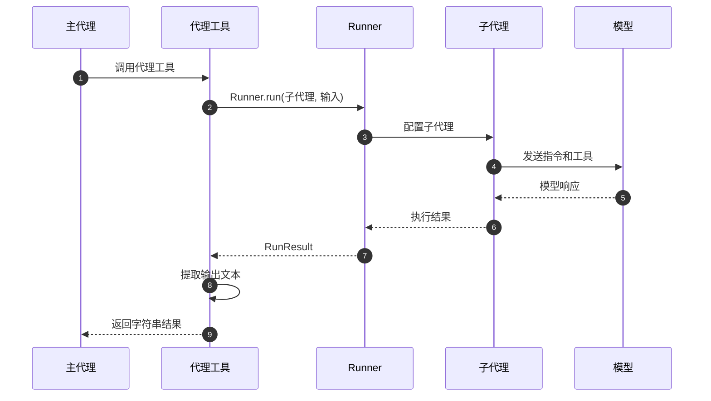

# OpenAI Agents Python SDK - Agent 模块 API

## 1. 对外 API 列表

Agent 模块对外提供以下核心 API：

| API 名称 | 类型 | 功能描述 | 主要使用场景 |
|----------|------|----------|--------------|
| `Agent` | 类 | 标准智能代理实现 | 通用对话和任务执行 |
| `AgentBase` | 抽象基类 | 代理基础功能定义 | 自定义代理类型 |
| `ToolsToFinalOutputResult` | 数据类 | 工具执行结果封装 | 工具链终止控制 |
| `ToolsToFinalOutputFunction` | 类型别名 | 工具结果处理函数 | 自定义工具执行逻辑 |
| `StopAtTools` | 字典类型 | 工具停止配置 | 工具执行流程控制 |
| `MCPConfig` | 字典类型 | MCP 服务器配置 | MCP 集成参数设置 |

## 2. Agent 类详细 API

### 基本信息

- **类名**：`Agent[TContext]`
- **继承关系**：`AgentBase[TContext]` → `Generic[TContext]`
- **泛型参数**：`TContext` - 运行上下文类型

### 构造参数结构体

```python
@dataclass
class Agent(AgentBase, Generic[TContext]):
    # 基础配置
    name: str                                    # 代理名称
    handoff_description: str | None = None       # 切换描述
    tools: list[Tool] = field(default_factory=list)
    mcp_servers: list[MCPServer] = field(default_factory=list)
    mcp_config: MCPConfig = field(default_factory=lambda: MCPConfig())
    
    # 指令与提示
    instructions: str | Callable[[RunContextWrapper[TContext], Agent[TContext]], MaybeAwaitable[str]] | None = None
    prompt: Prompt | DynamicPromptFunction | None = None
    
    # 协作与切换
    handoffs: list[Agent[Any] | Handoff[TContext, Any]] = field(default_factory=list)
    
    # 模型配置
    model: str | Model | None = None
    model_settings: ModelSettings = field(default_factory=get_default_model_settings)
    
    # 安全防护
    input_guardrails: list[InputGuardrail[TContext]] = field(default_factory=list)
    output_guardrails: list[OutputGuardrail[TContext]] = field(default_factory=list)
    
    # 输出控制
    output_type: type[Any] | AgentOutputSchemaBase | None = None
    
    # 行为控制
    tool_use_behavior: Literal["run_llm_again", "stop_on_first_tool"] | StopAtTools | ToolsToFinalOutputFunction = "run_llm_again"
    reset_tool_choice: bool = True
    
    # 生命周期
    hooks: AgentHooks[TContext] | None = None
```

### 构造参数字段表

| 字段 | 类型 | 必填 | 默认值 | 约束 | 说明 |
|------|------|------|--------|------|------|
| name | str | 是 | - | 非空字符串 | 代理唯一标识名称 |
| handoff_description | str \| None | 否 | None | 字符串或 None | 代理切换时的描述信息 |
| tools | list[Tool] | 否 | [] | Tool 对象列表 | 代理可使用的工具集合 |
| instructions | str \| Callable \| None | 否 | None | 字符串或函数 | 系统提示词或动态生成函数 |
| model | str \| Model \| None | 否 | None | 模型名称或实例 | 使用的语言模型 |
| model_settings | ModelSettings | 否 | 默认设置 | ModelSettings 实例 | 模型参数配置 |
| handoffs | list[Agent \| Handoff] | 否 | [] | 代理或切换对象列表 | 可切换的子代理 |
| input_guardrails | list[InputGuardrail] | 否 | [] | 安全检查函数列表 | 输入内容安全验证 |
| output_guardrails | list[OutputGuardrail] | 否 | [] | 安全检查函数列表 | 输出内容安全验证 |
| output_type | type \| AgentOutputSchemaBase \| None | 否 | None | 类型或模式对象 | 结构化输出类型定义 |
| tool_use_behavior | str \| dict \| Callable | 否 | "run_llm_again" | 预定义值或函数 | 工具使用行为策略 |
| reset_tool_choice | bool | 否 | True | 布尔值 | 工具调用后是否重置选择 |
| hooks | AgentHooks \| None | 否 | None | 生命周期钩子对象 | 代理生命周期事件回调 |
| mcp_servers | list[MCPServer] | 否 | [] | MCP 服务器列表 | 模型上下文协议服务器 |
| mcp_config | MCPConfig | 否 | {} | 配置字典 | MCP 服务器配置选项 |

### 核心方法 API

#### 2.1 get_all_tools 方法

**基本信息**
- **方法名**：`get_all_tools`
- **签名**：`async def get_all_tools(self, run_context: RunContextWrapper[TContext]) -> list[Tool]`
- **功能**：获取代理的所有可用工具（包括 MCP 工具和函数工具）
- **幂等性**：是（相同上下文返回相同结果）

**请求参数**

| 参数名 | 类型 | 必填 | 说明 |
|--------|------|------|------|
| run_context | RunContextWrapper[TContext] | 是 | 运行上下文包装器 |

**返回值**

| 字段 | 类型 | 说明 |
|------|------|------|
| 返回值 | list[Tool] | 所有启用的工具列表 |

**核心实现代码**

```python
async def get_all_tools(self, run_context: RunContextWrapper[TContext]) -> list[Tool]:
    """聚合所有可用工具，包括 MCP 工具和启用的函数工具"""
    # 1) 异步获取 MCP 工具
    mcp_tools = await self.get_mcp_tools(run_context)
    
    # 2) 定义工具启用检查函数
    async def _check_tool_enabled(tool: Tool) -> bool:
        if not isinstance(tool, FunctionTool):
            return True  # 非函数工具默认启用
            
        attr = tool.is_enabled
        if isinstance(attr, bool):
            return attr  # 静态启用状态
        
        # 动态启用检查
        res = attr(run_context, self)
        if inspect.isawaitable(res):
            return bool(await res)
        return bool(res)
    
    # 3) 并发检查所有函数工具的启用状态
    results = await asyncio.gather(*(_check_tool_enabled(t) for t in self.tools))
    enabled = [t for t, ok in zip(self.tools, results) if ok]
    
    # 4) 合并 MCP 工具和启用的函数工具
    return [*mcp_tools, *enabled]
```

**方法执行逻辑**：
1. **MCP 工具获取**：调用 `get_mcp_tools` 异步获取所有 MCP 服务器提供的工具
2. **启用状态检查**：对每个函数工具进行启用状态验证，支持静态和动态检查
3. **并发优化**：使用 `asyncio.gather` 并行执行多个工具的启用检查
4. **结果聚合**：将 MCP 工具和启用的函数工具合并返回

**异常处理**：
- MCP 服务器连接失败时记录警告并跳过
- 工具启用检查异常时默认禁用该工具
- 网络超时时自动重试 MCP 工具获取

**性能要点**：
- 并发检查工具状态，避免串行等待
- MCP 工具结果缓存，减少重复网络请求
- 大型工具列表时考虑分批处理

#### 2.2 get_system_prompt 方法

**基本信息**
- **方法名**：`get_system_prompt`
- **签名**：`async def get_system_prompt(self, run_context: RunContextWrapper[TContext]) -> str | None`
- **功能**：获取代理的系统提示词（支持静态和动态生成）
- **幂等性**：否（动态指令可能根据上下文变化）

**请求参数**

| 参数名 | 类型 | 必填 | 说明 |
|--------|------|------|------|
| run_context | RunContextWrapper[TContext] | 是 | 运行上下文包装器 |

**返回值**

| 字段 | 类型 | 说明 |
|------|------|------|
| 返回值 | str \| None | 系统提示词字符串或 None |

**核心实现代码**

```python
async def get_system_prompt(self, run_context: RunContextWrapper[TContext]) -> str | None:
    """获取系统提示词，支持静态字符串和动态函数生成"""
    if isinstance(self.instructions, str):
        # 静态指令直接返回
        return self.instructions
    elif callable(self.instructions):
        # 动态指令需要函数调用
        sig = inspect.signature(self.instructions)
        params = list(sig.parameters.values())
        
        # 强制要求两个参数：context 和 agent
        if len(params) != 2:
            raise TypeError(
                f"'instructions' callable must accept exactly 2 arguments (context, agent), "
                f"but got {len(params)}: {[p.name for p in params]}"
            )
        
        # 支持同步和异步指令函数
        if inspect.iscoroutinefunction(self.instructions):
            return await cast(Awaitable[str], self.instructions(run_context, self))
        else:
            return cast(str, self.instructions(run_context, self))
    
    return None  # 未设置指令时返回 None
```

**方法执行逻辑**：
1. **类型判断**：检查 `instructions` 是字符串、函数还是 None
2. **静态处理**：字符串类型直接返回
3. **动态处理**：函数类型需要签名验证和调用
4. **异步支持**：自动检测并处理异步指令函数

**参数验证**：
- 指令函数必须接受恰好 2 个参数
- 参数类型必须与 `RunContextWrapper` 和 `Agent` 兼容
- 返回值必须是字符串类型

#### 2.3 clone 方法

**基本信息**
- **方法名**：`clone`
- **签名**：`def clone(self, **kwargs: Any) -> Agent[TContext]`
- **功能**：创建代理的浅拷贝，可修改指定属性
- **幂等性**：是（相同参数产生相同结果）

**请求参数**

| 参数名 | 类型 | 必填 | 说明 |
|--------|------|------|------|
| **kwargs | Any | 否 | 要修改的属性键值对 |

**返回值**

| 字段 | 类型 | 说明 |
|------|------|------|
| 返回值 | Agent[TContext] | 克隆的代理实例 |

**核心实现代码**

```python
def clone(self, **kwargs: Any) -> Agent[TContext]:
    """创建代理的浅拷贝，支持属性修改"""
    return dataclasses.replace(self, **kwargs)
```

**使用示例**：

```python
# 原始代理
original_agent = Agent(
    name="Assistant",
    instructions="你是一个助手",
    tools=[tool1, tool2]
)

# 克隆并修改指令
modified_agent = original_agent.clone(
    instructions="你是一个专业的技术助手",
    model_settings=ModelSettings(temperature=0.3)
)

# 克隆并添加工具（需要提供完整列表）
enhanced_agent = original_agent.clone(
    tools=[tool1, tool2, tool3]  # 包含原有工具
)
```

**重要说明**：
- 使用 `dataclasses.replace` 进行浅拷贝
- 可变对象（如 `tools`、`handoffs` 列表）需要显式提供新列表
- 不会深拷贝对象内容，仅拷贝引用

#### 2.4 as_tool 方法

**基本信息**
- **方法名**：`as_tool`
- **签名**：复杂签名，见下方详细参数表
- **功能**：将代理转换为可被其他代理调用的工具
- **幂等性**：是（相同参数生成相同工具）

**请求参数表**

| 参数名 | 类型 | 必填 | 默认值 | 说明 |
|--------|------|------|--------|------|
| tool_name | str \| None | 否 | None | 工具名称，默认使用代理名称 |
| tool_description | str \| None | 否 | None | 工具描述信息 |
| custom_output_extractor | Callable \| None | 否 | None | 自定义输出提取函数 |
| is_enabled | bool \| Callable | 否 | True | 工具启用状态或检查函数 |
| run_config | RunConfig \| None | 否 | None | 运行配置 |
| max_turns | int \| None | 否 | None | 最大执行轮次 |
| hooks | RunHooks \| None | 否 | None | 执行钩子 |
| previous_response_id | str \| None | 否 | None | 前一个响应ID |
| conversation_id | str \| None | 否 | None | 对话ID |
| session | Session \| None | 否 | None | 会话对象 |

**返回值**

| 字段 | 类型 | 说明 |
|------|------|------|
| 返回值 | Tool | 代理工具化后的函数工具 |

**核心实现代码**

```python
def as_tool(self, tool_name: str | None, tool_description: str | None, ...) -> Tool:
    """将代理转换为工具，实现代理的递归调用"""
    
    @function_tool(
        name_override=tool_name or _transforms.transform_string_function_style(self.name),
        description_override=tool_description or "",
        is_enabled=is_enabled,
    )
    async def run_agent(context: RunContextWrapper, input: str) -> str:
        """工具化代理的执行函数"""
        resolved_max_turns = max_turns if max_turns is not None else DEFAULT_MAX_TURNS
        
        # 使用独立的 Runner 执行代理
        output = await Runner.run(
            starting_agent=self,
            input=input,
            context=context.context,
            run_config=run_config,
            max_turns=resolved_max_turns,
            hooks=hooks,
            previous_response_id=previous_response_id,
            conversation_id=conversation_id,
            session=session,
        )
        
        # 提取最终输出
        if custom_output_extractor:
            return await custom_output_extractor(output)
        
        # 默认提取文本消息输出
        return ItemHelpers.text_message_outputs(output.new_items)
    
    return run_agent
```

**工具化执行时序图**



**执行流程说明**：
1. **工具调用**：主代理决定调用代理工具
2. **独立执行**：使用独立的 `Runner` 实例执行子代理
3. **上下文传递**：将运行上下文传递给子代理
4. **结果提取**：从子代理执行结果中提取文本输出
5. **返回结果**：将提取的文本作为工具执行结果返回

**与 Handoff 的区别**：
- **上下文传递**：工具模式传递生成的输入，Handoff 传递完整对话历史
- **执行控制**：工具模式由主代理继续控制，Handoff 由子代理接管
- **结果处理**：工具模式返回文本结果，Handoff 可能改变对话流向

## 3. AgentBase 基类 API

### 基本信息

- **类名**：`AgentBase[TContext]`
- **类型**：抽象基类
- **泛型参数**：`TContext` - 运行上下文类型

### 核心方法

#### 3.1 get_mcp_tools 方法

**基本信息**
- **方法名**：`get_mcp_tools`
- **签名**：`async def get_mcp_tools(self, run_context: RunContextWrapper[TContext]) -> list[Tool]`
- **功能**：从 MCP 服务器获取可用工具

**核心实现代码**

```python
async def get_mcp_tools(self, run_context: RunContextWrapper[TContext]) -> list[Tool]:
    """从配置的 MCP 服务器获取工具列表"""
    convert_schemas_to_strict = self.mcp_config.get("convert_schemas_to_strict", False)
    return await MCPUtil.get_all_function_tools(
        self.mcp_servers, convert_schemas_to_strict, run_context, self
    )
```

## 4. 配置类型 API

### 4.1 ToolsToFinalOutputResult

**基本信息**
- **类型**：数据类
- **功能**：封装工具执行结果和终止标志

**字段定义**

```python
@dataclass
class ToolsToFinalOutputResult:
    is_final_output: bool                # 是否为最终输出
    """是否终止代理执行。True 时代理停止，False 时继续执行"""
    
    final_output: Any | None = None      # 最终输出内容
    """最终输出内容。is_final_output 为 True 时必须提供，类型需匹配 agent.output_type"""
```

### 4.2 StopAtTools

**基本信息**
- **类型**：类型字典
- **功能**：定义工具停止条件

**字段定义**

```python
class StopAtTools(TypedDict):
    stop_at_tool_names: list[str]
    """工具名称列表。当调用列表中任一工具时，代理停止执行"""
```

### 4.3 MCPConfig

**基本信息**
- **类型**：类型字典
- **功能**：MCP 服务器配置选项

**字段定义**

```python
class MCPConfig(TypedDict):
    convert_schemas_to_strict: NotRequired[bool]
    """是否将 MCP 模式转换为严格模式。默认 False，最佳努力转换"""
```

## 5. 使用示例与最佳实践

### 5.1 基础代理创建

```python
from agents import Agent, Runner

# 创建基础代理
agent = Agent(
    name="CustomerService",
    instructions="你是一个客服助手，请礼貌专业地回答用户问题。",
    model="gpt-4o",
    model_settings=ModelSettings(temperature=0.7)
)

# 执行对话
result = await Runner.run(agent, "我想了解退货政策")
print(result.final_output)
```

### 5.2 带工具的代理

```python
from agents import Agent, function_tool

@function_tool
def query_order(order_id: str) -> str:
    """查询订单状态"""
    # 实际查询逻辑
    return f"订单 {order_id} 状态：已发货"

@function_tool  
def process_refund(order_id: str, reason: str) -> str:
    """处理退款申请"""
    # 实际退款逻辑
    return f"订单 {order_id} 退款申请已提交，理由：{reason}"

# 创建带工具的代理
service_agent = Agent(
    name="ServiceAgent",
    instructions="使用提供的工具帮助用户处理订单问题。",
    tools=[query_order, process_refund]
)
```

### 5.3 多代理协作

```python
# 专业代理
technical_agent = Agent(
    name="TechnicalSupport",
    instructions="处理技术问题，提供详细的技术解决方案。",
    handoff_description="技术支持专家"
)

# 主代理
main_agent = Agent(
    name="MainService", 
    instructions="""
    根据用户问题类型进行分类：
    - 技术问题：切换到 TechnicalSupport
    - 其他问题：直接处理
    """,
    handoffs=[technical_agent]
)
```

### 5.4 动态指令代理

```python
def adaptive_instructions(context: RunContextWrapper, agent: Agent) -> str:
    """根据上下文自适应生成指令"""
    user_level = context.context.get("user_level", "beginner")
    
    base = "你是一个编程助手。"
    if user_level == "beginner":
        return base + "请使用简单的语言，提供详细的解释。"
    elif user_level == "expert":
        return base + "可以使用专业术语，关注高级特性。"
    return base

adaptive_agent = Agent(
    name="AdaptiveTutor",
    instructions=adaptive_instructions  # 函数而非字符串
)
```

这些 API 提供了灵活而强大的代理配置和管理能力，支持从简单对话到复杂多代理协作的各种场景。
