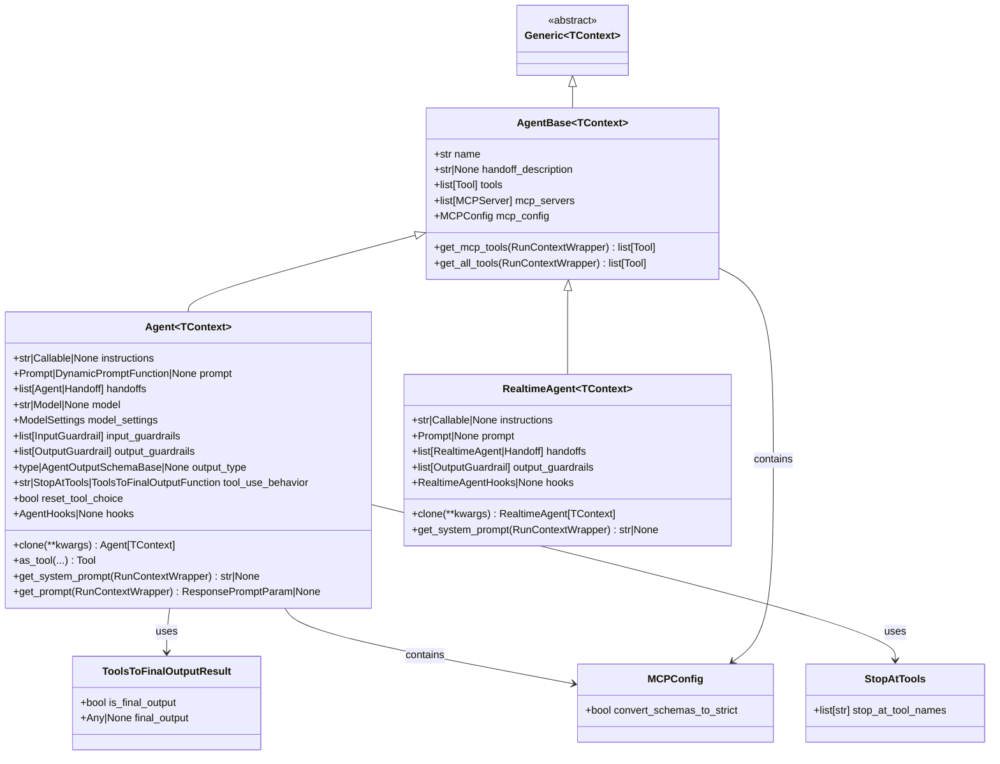

# OpenAI Agents Python SDK - Agent 模块数据结构

## 1. 关键数据结构概览

Agent 模块定义了多个核心数据结构，用于代理配置、工具管理、执行控制等场景。这些数据结构通过合理的类型设计和继承关系，提供了灵活而类型安全的代理系统基础。

### 数据结构分类

| 分类 | 数据结构 | 功能 | 使用场景 |
|------|----------|------|----------|
| 核心实体 | Agent, AgentBase | 代理定义与配置 | 代理创建和管理 |
| 结果封装 | ToolsToFinalOutputResult | 工具执行结果 | 工具链控制 |
| 配置类型 | MCPConfig, StopAtTools | 行为配置 | 代理行为定制 |
| 类型别名 | ToolsToFinalOutputFunction | 函数类型定义 | 类型注解和验证 |

## 2. 核心实体类图



**类图说明：**

### 继承层次结构

1. **泛型基础**：所有代理类都继承自 `Generic[TContext]`，提供类型安全的上下文支持
2. **抽象基类**：`AgentBase` 定义了所有代理类型的共同接口和基础功能
3. **具体实现**：`Agent` 和 `RealtimeAgent` 分别实现标准和实时场景的具体功能

### 组合关系

- `Agent` 包含 `MCPConfig` 用于 MCP 服务器配置
- `Agent` 使用 `StopAtTools` 和 `ToolsToFinalOutputResult` 控制工具执行流程
- 各类之间通过合理的依赖关系避免循环引用

### 字段映射规则

- 可选字段使用 `None` 作为默认值，支持渐进式配置
- 列表字段使用 `field(default_factory=list)` 避免共享引用
- 复杂对象使用工厂函数延迟初始化

## 3. Agent 数据结构详解

### 3.1 Agent 类完整定义

```python
@dataclass
class Agent(AgentBase, Generic[TContext]):
    """智能代理的完整数据结构定义"""
    
    # === 基础标识信息 ===
    name: str
    """代理名称，用于标识和日志记录"""
    
    handoff_description: str | None = None
    """代理描述，用于多代理切换时的选择依据"""
    
    # === 工具与能力配置 ===
    tools: list[Tool] = field(default_factory=list)
    """函数工具列表，代理可调用的本地功能"""
    
    mcp_servers: list[MCPServer] = field(default_factory=list)
    """MCP 服务器列表，提供远程工具和资源"""
    
    mcp_config: MCPConfig = field(default_factory=lambda: MCPConfig())
    """MCP 服务器配置选项"""
    
    # === 指令与提示配置 ===
    instructions: (
        str
        | Callable[[RunContextWrapper[TContext], Agent[TContext]], MaybeAwaitable[str]]
        | None
    ) = None
    """系统指令，可以是静态字符串或动态生成函数"""
    
    prompt: Prompt | DynamicPromptFunction | None = None
    """提示对象，支持外部配置管理"""
    
    # === 协作与切换配置 ===
    handoffs: list[Agent[Any] | Handoff[TContext, Any]] = field(default_factory=list)
    """可切换的子代理列表，实现多代理协作"""
    
    # === 模型与生成配置 ===
    model: str | Model | None = None
    """使用的语言模型，字符串名称或模型实例"""
    
    model_settings: ModelSettings = field(default_factory=get_default_model_settings)
    """模型参数设置，如温度、最大令牌数等"""
    
    # === 安全与防护配置 ===
    input_guardrails: list[InputGuardrail[TContext]] = field(default_factory=list)
    """输入安全检查列表"""
    
    output_guardrails: list[OutputGuardrail[TContext]] = field(default_factory=list)
    """输出安全检查列表"""
    
    # === 输出与结果配置 ===
    output_type: type[Any] | AgentOutputSchemaBase | None = None
    """结构化输出类型定义"""
    
    # === 行为控制配置 ===
    tool_use_behavior: (
        Literal["run_llm_again", "stop_on_first_tool"] 
        | StopAtTools 
        | ToolsToFinalOutputFunction
    ) = "run_llm_again"
    """工具使用行为策略"""
    
    reset_tool_choice: bool = True
    """工具调用后是否重置工具选择"""
    
    # === 生命周期配置 ===
    hooks: AgentHooks[TContext] | None = None
    """生命周期事件钩子"""
```

### 3.2 字段类型详细说明

#### 指令字段类型分析

```python
# 指令字段的联合类型定义
instructions: (
    str                                                    # 静态字符串指令
    | Callable[                                           # 动态指令生成函数
        [RunContextWrapper[TContext], Agent[TContext]],   # 函数参数类型
        MaybeAwaitable[str]                               # 返回值类型（支持异步）
    ]
    | None                                                # 未设置指令
) = None
```

**类型含义解释：**
- `str`：静态指令，直接作为系统提示词使用
- `Callable`：动态指令函数，接收上下文和代理实例，返回生成的指令
- `MaybeAwaitable[str]`：支持同步和异步函数返回
- `None`：未设置指令，使用默认行为

#### 工具使用行为类型

```python
# 复杂的工具行为配置类型
tool_use_behavior: (
    Literal["run_llm_again", "stop_on_first_tool"]       # 预定义行为策略
    | StopAtTools                                         # 条件停止配置
    | ToolsToFinalOutputFunction                          # 自定义处理函数
) = "run_llm_again"
```

**行为策略说明：**
- `"run_llm_again"`：工具执行后继续模型推理（默认）
- `"stop_on_first_tool"`：首个工具执行后停止
- `StopAtTools`：指定工具执行后停止
- `ToolsToFinalOutputFunction`：自定义处理逻辑

## 4. 配置类型数据结构

### 4.1 MCPConfig 配置结构

```python
class MCPConfig(TypedDict):
    """MCP（Model Context Protocol）服务器配置"""
    
    convert_schemas_to_strict: NotRequired[bool]
    """是否将 MCP 模式转换为严格模式
    
    默认值：False
    说明：严格模式提供更强的类型检查，但可能导致某些模式不兼容
    使用场景：需要严格类型验证的生产环境
    """
```

**字段约束与默认行为：**
- `convert_schemas_to_strict`：可选字段，默认 `False`
- 转换失败时自动降级到非严格模式
- 影响 MCP 工具的参数验证严格程度

### 4.2 StopAtTools 停止配置

```python
class StopAtTools(TypedDict):
    """工具执行停止条件配置"""
    
    stop_at_tool_names: list[str]
    """停止工具名称列表
    
    行为：当执行列表中任一工具时，代理立即停止执行
    用途：实现精确的工具链控制
    示例：["save_file", "send_email"] - 执行保存或发送操作后停止
    """
```

**使用示例：**

```python
# 文件操作后停止
file_agent = Agent(
    name="FileProcessor",
    tool_use_behavior=StopAtTools(stop_at_tool_names=["save_file", "delete_file"]),
    tools=[save_file_tool, delete_file_tool, read_file_tool]
)

# 通信操作后停止  
communication_agent = Agent(
    name="Communicator",
    tool_use_behavior=StopAtTools(stop_at_tool_names=["send_email", "send_sms"]),
    tools=[send_email_tool, send_sms_tool, draft_message_tool]
)
```

### 4.3 ToolsToFinalOutputResult 结果结构

```python
@dataclass
class ToolsToFinalOutputResult:
    """工具执行结果和终止控制"""
    
    is_final_output: bool
    """是否为最终输出
    
    True：代理停止执行，使用 final_output 作为最终结果
    False：代理继续执行，将工具结果发送给模型进行进一步处理
    """
    
    final_output: Any | None = None
    """最终输出内容
    
    约束：当 is_final_output 为 True 时，此字段不能为 None
    类型：必须与代理的 output_type 配置兼容
    用途：作为代理执行的最终返回值
    """
```

**字段关系约束：**

```python
# 有效的结果配置示例
valid_results = [
    ToolsToFinalOutputResult(is_final_output=False),                    # 继续执行
    ToolsToFinalOutputResult(is_final_output=False, final_output=None), # 继续执行
    ToolsToFinalOutputResult(is_final_output=True, final_output="完成"), # 停止执行
]

# 无效的结果配置
invalid_result = ToolsToFinalOutputResult(is_final_output=True, final_output=None)  # 错误：缺少最终输出
```

## 5. 类型别名与函数签名

### 5.1 ToolsToFinalOutputFunction 类型别名

```python
ToolsToFinalOutputFunction: TypeAlias = Callable[
    [RunContextWrapper[TContext], list[FunctionToolResult]],  # 输入参数类型
    MaybeAwaitable[ToolsToFinalOutputResult],                 # 返回值类型
]
"""工具结果处理函数类型定义

参数说明：
- run_context: 运行上下文包装器，包含执行环境信息
- tool_results: 工具执行结果列表，包含所有工具调用的输出

返回值：
- ToolsToFinalOutputResult: 处理结果，控制代理是否继续执行

支持特性：
- 同步和异步函数实现
- 复杂的工具结果分析逻辑
- 条件化的执行控制策略
"""
```

**使用示例：**

```python
async def smart_tool_processor(
    context: RunContextWrapper[dict], 
    results: list[FunctionToolResult]
) -> ToolsToFinalOutputResult:
    """智能工具结果处理器"""
    
    # 检查是否有错误结果
    error_results = [r for r in results if r.is_error]
    if error_results:
        return ToolsToFinalOutputResult(
            is_final_output=True,
            final_output=f"工具执行失败：{error_results[0].error}"
        )
    
    # 检查是否包含最终操作
    final_tools = ["save_document", "send_notification"]
    for result in results:
        if result.tool_name in final_tools:
            return ToolsToFinalOutputResult(
                is_final_output=True,
                final_output=f"操作完成：{result.output}"
            )
    
    # 默认继续执行
    return ToolsToFinalOutputResult(is_final_output=False)

# 应用到代理配置
smart_agent = Agent(
    name="SmartProcessor",
    tool_use_behavior=smart_tool_processor,  # 使用自定义处理器
    tools=[save_document_tool, send_notification_tool, analyze_tool]
)
```

## 6. 数据结构序列化与持久化

### 6.1 序列化支持

Agent 数据结构基于 `@dataclass` 实现，天然支持多种序列化方式：

```python
import json
from dataclasses import asdict
import pickle

# JSON 序列化（需要处理复杂对象）
agent_dict = asdict(agent)
# 注意：函数、模型实例等不能直接 JSON 序列化

# Pickle 序列化（完整对象序列化）
agent_bytes = pickle.dumps(agent)
restored_agent = pickle.loads(agent_bytes)

# 配置导出（仅可序列化字段）
config_dict = {
    "name": agent.name,
    "instructions": agent.instructions if isinstance(agent.instructions, str) else None,
    "model": agent.model if isinstance(agent.model, str) else None,
    # ... 其他可序列化字段
}
```

### 6.2 版本兼容性考虑

```python
# 版本兼容的配置结构
class AgentConfigV1(TypedDict):
    """代理配置 V1 版本"""
    name: str
    instructions: str | None
    model: str | None
    tools: list[str]  # 工具名称列表

class AgentConfigV2(AgentConfigV1):
    """代理配置 V2 版本，向后兼容"""
    model_settings: dict[str, Any]
    guardrails: dict[str, list[str]]
    
# 配置迁移函数
def migrate_config_v1_to_v2(v1_config: AgentConfigV1) -> AgentConfigV2:
    """从 V1 配置迁移到 V2"""
    return {
        **v1_config,
        "model_settings": {},
        "guardrails": {"input": [], "output": []}
    }
```

## 7. 性能与内存优化

### 7.1 内存占用分析

```python
import sys
from dataclasses import fields

def analyze_agent_memory(agent: Agent) -> dict[str, int]:
    """分析代理实例的内存占用"""
    memory_usage = {}
    
    for field in fields(agent):
        field_value = getattr(agent, field.name)
        memory_usage[field.name] = sys.getsizeof(field_value)
    
    return memory_usage

# 示例分析结果
typical_memory = {
    "name": 64,                    # 字符串
    "instructions": 256,           # 长字符串
    "tools": 80 + len(tools) * 32, # 列表 + 引用
    "model_settings": 200,         # 配置对象
    # 总计通常 < 1KB
}
```

### 7.2 优化建议

**内存优化：**
- 避免在代理配置中存储大型数据对象
- 使用工具延迟加载机制减少初始内存占用
- 合理设置工具和安全检查的数量上限

**性能优化：**
- 静态指令优于动态指令（避免函数调用开销）
- 启用工具缓存机制减少重复计算
- 使用类型注解帮助运行时优化

这些数据结构设计为 OpenAI Agents Python SDK 提供了坚实的类型基础，通过合理的继承关系、清晰的字段定义和灵活的配置选项，支持从简单对话到复杂多代理协作的各种应用场景。
