```mermaid
sequenceDiagram
    autonumber
    participant User as 用户代码
    participant Agent as 源代理
    participant FuncTool as function_tool 装饰器
    participant Transform as 名称转换器
    participant ToolAgent as 工具化代理函数
    participant Runner as 独立 Runner
    participant TargetAgent as 目标代理实例
    participant ItemHelper as 输出提取器
    
    User->>Agent: as_tool(tool_name, description, ...)
    
    Agent->>Transform: transform_string_function_style(self.name)
    Transform-->>Agent: 返回转换后的工具名称
    
    Agent->>FuncTool: 创建 @function_tool 装饰器
    FuncTool->>FuncTool: 设置工具元数据
    
    Agent->>Agent: 定义内部 run_agent 函数
    
    User->>ToolAgent: 调用工具化代理("用户输入")
    ToolAgent->>ToolAgent: 解析执行参数
    
    ToolAgent->>Runner: Runner.run(starting_agent=源代理, ...)
    Runner->>TargetAgent: 创建独立执行环境
    
    TargetAgent->>TargetAgent: 处理用户输入
    
    loop 代理执行循环
        TargetAgent->>TargetAgent: 模型推理
        
        alt 需要工具调用
            TargetAgent->>TargetAgent: 执行工具
            TargetAgent->>TargetAgent: 处理工具结果
        else 产生最终输出
            TargetAgent->>TargetAgent: 生成最终结果
        end
    end
    
    TargetAgent-->>Runner: 返回 RunResult
    Runner-->>ToolAgent: 返回执行结果
    
    ToolAgent->>ToolAgent: 检查自定义输出提取器
    
    alt 有自定义提取器
        ToolAgent->>User: 调用 custom_output_extractor(result)
        User-->>ToolAgent: 返回提取的输出
    else 使用默认提取器
        ToolAgent->>ItemHelper: text_message_outputs(result.new_items)
        ItemHelper-->>ToolAgent: 返回文本输出
    end
    
    ToolAgent-->>User: 返回最终工具执行结果
```

# OpenAI Agents Python SDK - Agent 模块时序图

## 1. 典型调用场景时序图

Agent 模块在不同使用场景下具有不同的时序流程。本文档详细分析了代理创建、工具聚合、指令生成、代理工具化等核心场景的完整时序流程。

## 2. 场景一：代理创建与初始化

### 时序图


### 时序说明

**初始化阶段关键步骤：**

1. **参数接收**：用户传入代理配置参数，由 dataclass 系统自动处理
2. **字段设置**：dataclass 自动设置所有字段的初始值
3. **后置处理**：`__post_init__` 方法执行额外的验证和调整逻辑
4. **类型验证**：逐一验证每个字段的类型是否符合要求
5. **模型兼容性检查**：检查指定模型与默认设置的兼容性
6. **兼容性调整**：不兼容时自动调整模型设置
7. **最终验证**：确保所有配置项符合业务逻辑要求

**边界条件处理：**
- 必需字段缺失时抛出 `TypeError`
- 类型不匹配时提供详细错误信息
- 模型设置冲突时自动降级处理

**性能考虑：**
- 验证逻辑在初始化时一次性完成
- 避免运行时重复验证降低性能开销
- 使用缓存机制减少重复计算

## 3. 场景二：工具聚合执行流程

### 时序图


### 时序说明

**工具聚合流程分析：**

1. **入口调用**：Runner 请求获取代理的所有可用工具
2. **MCP 工具获取**：异步从配置的 MCP 服务器获取远程工具
3. **服务器遍历**：依次连接每个 MCP 服务器并获取工具定义
4. **工具转换**：将 MCP 工具定义转换为标准 Tool 对象
5. **并发检查**：使用异步任务池并发检查函数工具的启用状态
6. **状态评估**：支持静态布尔值和动态函数两种启用检查方式
7. **结果聚合**：过滤禁用工具，合并 MCP 工具和启用的函数工具

**并发优化策略：**
- 使用 `asyncio.gather` 并发执行工具启用检查
- MCP 服务器连接支持并发，提高获取效率
- 工具状态缓存机制减少重复计算

**异常处理机制：**
- MCP 服务器连接失败时跳过该服务器并记录警告
- 工具启用检查异常时默认禁用该工具
- 网络超时时自动重试有限次数

## 4. 场景三：动态指令生成流程

### 时序图


### 时序说明

**动态指令生成过程：**

1. **类型检查**：首先确定 instructions 字段的具体类型
2. **静态处理**：字符串类型直接返回，无需额外处理
3. **函数验证**：动态指令函数需要通过签名验证
4. **参数校验**：强制要求函数接受恰好 2 个参数（context, agent）
5. **异步检测**：自动检测函数是否为协程函数
6. **上下文传递**：将运行上下文和代理实例传递给指令函数
7. **指令生成**：用户函数根据上下文动态生成指令内容

**签名验证重要性：**
- 确保指令函数能够正确接收必要参数
- 避免运行时参数传递错误
- 提供清晰的错误信息帮助调试

**上下文访问模式：**
```python
def adaptive_instructions(context: RunContextWrapper, agent: Agent) -> str:
    """示例：根据用户角色生成不同指令"""
    user_role = context.context.get("user_role", "general")
    task_type = context.context.get("task_type", "chat")
    
    base = f"你是 {agent.name}，一个智能助手。"
    
    if user_role == "developer":
        base += "请提供技术性回答，包含代码示例。"
    elif user_role == "business":
        base += "请关注商业价值和实际应用。"
    
    return base
```

## 5. 场景四：代理工具化转换流程

### 时序图



### 时序说明

**代理工具化转换步骤：**

1. **名称转换**：将代理名称转换为符合函数命名规范的工具名称
2. **装饰器创建**：使用 `@function_tool` 创建工具装饰器并设置元数据
3. **函数定义**：定义内部的代理执行函数 `run_agent`
4. **独立执行**：使用独立的 Runner 实例执行源代理，避免状态污染
5. **参数传递**：将工具输入作为代理的用户输入传递
6. **结果提取**：支持自定义输出提取器或使用默认文本提取
7. **返回结果**：将代理执行结果转换为工具执行结果返回

**执行隔离机制：**
- 每次工具调用都创建独立的执行环境
- 使用独立的 Runner 实例避免状态冲突
- 支持独立的配置参数（max_turns, hooks 等）

**输出提取策略：**
```python
# 默认输出提取：从所有新增项目中提取文本消息
default_output = ItemHelpers.text_message_outputs(result.new_items)

# 自定义输出提取：用户定义的提取逻辑
async def custom_extractor(result: RunResult) -> str:
    # 提取结构化数据
    if hasattr(result.final_output, 'summary'):
        return result.final_output.summary
    # 提取最后一条消息
    return result.new_items[-1].content if result.new_items else ""
```

## 6. 场景五：多代理切换（Handoff）流程

### 时序图


### 时序说明

**多代理切换关键环节：**

1. **切换决策**：主代理通过模型推理决定是否需要切换到专业代理
2. **代理选择**：切换系统根据任务需求和代理描述选择最合适的目标代理
3. **状态保存**：在切换前保存当前会话状态，确保上下文连续性
4. **上下文构建**：收集切换原因、参数和必要的上下文信息
5. **代理启动**：启动目标代理并加载完整的会话历史
6. **上下文传递**：将切换信息和上下文传递给目标代理
7. **确认处理**：目标代理生成切换确认并继续处理用户请求

**状态连续性保证：**
- 完整的会话历史在代理间传递
- 切换上下文包含必要的任务信息
- 目标代理能够理解切换原因和背景

**切换决策逻辑：**
```python
# 主代理的切换决策示例
if "技术问题" in user_input:
    return handoff_to_tech_support
elif "法律咨询" in user_input:
    return handoff_to_legal_advisor
else:
    return continue_main_agent
```

## 7. 性能分析与优化建议

### 7.1 关键性能指标

| 场景 | 平均耗时 | 主要瓶颈 | 优化方向 |
|------|----------|----------|----------|
| 代理初始化 | <10ms | 参数验证 | 缓存验证结果 |
| 工具聚合 | 50-200ms | MCP 网络请求 | 并发获取、结果缓存 |
| 指令生成 | 1-5ms | 动态函数调用 | 结果缓存、预编译 |
| 代理工具化 | <1ms | 装饰器创建 | 工厂模式复用 |
| 代理切换 | 20-50ms | 会话状态同步 | 增量同步、异步保存 |

### 7.2 优化建议

**初始化优化：**
- 使用配置模板减少重复验证
- 延迟加载非关键组件
- 缓存常用的模型设置组合

**工具聚合优化：**
- 实现 MCP 工具结果缓存机制
- 使用连接池复用 MCP 服务器连接  
- 支持工具列表增量更新

**指令生成优化：**
- 缓存静态指令的处理结果
- 预编译常用的动态指令模板
- 使用 JIT 编译优化指令函数

**切换流程优化：**
- 实现会话状态的增量同步
- 使用异步机制减少切换延迟
- 支持代理预热机制

这些时序图详细展示了 Agent 模块在各种场景下的完整执行流程，为理解系统行为、排查问题和性能优化提供了重要参考。
