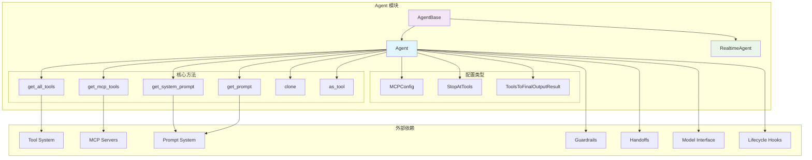

# OpenAI Agents Python SDK - Agent 模块概览

## 1. 模块职责与边界

Agent 模块是 OpenAI Agents Python SDK 的核心模块，负责定义和配置智能代理的基本结构。该模块提供了代理的创建、配置、工具管理、指令处理等核心功能。

### 核心职责

- **代理定义与配置**：提供 `Agent` 和 `AgentBase` 类，支持代理的创建和参数配置
- **工具管理**：统一管理函数工具、MCP 工具和托管工具的集成与调用
- **指令处理**：支持静态和动态指令生成，包括系统提示词和 Prompt 对象
- **多代理协作**：通过 Handoff 机制实现代理间的切换与协作
- **安全防护集成**：集成输入输出安全检查机制
- **代理生命周期管理**：提供代理克隆、工具化等高级功能

### 输入输出接口

**输入：**
- 代理配置参数（名称、指令、工具列表等）
- 运行上下文（`RunContextWrapper`）
- MCP 服务器列表
- 安全防护规则

**输出：**
- 配置完成的 `Agent` 实例
- 工具列表（包含所有可用工具）
- 系统提示词（动态生成）
- 可作为工具使用的代理函数

### 上下游依赖关系

**上游调用者：**
- `Runner`：执行代理任务
- 用户应用：创建和配置代理
- `Handoff`：多代理切换时创建新代理

**下游依赖：**
- `Tool`：工具系统集成
- `Model`：模型接口抽象
- `Guardrail`：安全防护机制
- `Memory/Session`：会话状态管理
- `MCP`：模型上下文协议支持

## 2. 模块架构图



**架构说明：**

### 层次结构设计

1. **基础抽象层**：`AgentBase` 提供所有代理类型的共同功能
2. **具体实现层**：`Agent` 和 `RealtimeAgent` 分别处理标准和实时场景
3. **配置管理层**：各种配置类型和策略定义
4. **方法执行层**：核心业务逻辑的具体实现

### 模块边界与扩展点

- **工具扩展点**：通过 `tools` 列表和 `mcp_servers` 支持任意工具集成
- **指令扩展点**：支持静态字符串和动态函数两种指令模式
- **安全扩展点**：通过 `input_guardrails` 和 `output_guardrails` 支持自定义安全策略
- **生命周期扩展点**：通过 `hooks` 支持代理生命周期事件监听

### 状态管理位置

- **无状态设计**：代理实例本身不保存运行时状态
- **配置状态**：代理的配置信息在初始化后不可变
- **会话状态**：运行时状态由外部 `Session` 对象管理
- **上下文状态**：执行时状态通过 `RunContextWrapper` 传递

### 资源占用要点

- **内存占用**：主要来自工具列表和配置对象，通常小于 1MB
- **CPU 占用**：动态指令生成和工具检查时有计算开销
- **I/O 占用**：MCP 服务器连接时产生网络 I/O

## 3. 关键算法与流程剖析

### 3.1 工具聚合算法

```python
async def get_all_tools(self, run_context: RunContextWrapper[TContext]) -> list[Tool]:
    """聚合所有可用工具（MCP + Function Tools）"""
    # 1) 获取 MCP 工具
    mcp_tools = await self.get_mcp_tools(run_context)
    
    # 2) 检查函数工具启用状态
    async def _check_tool_enabled(tool: Tool) -> bool:
        if not isinstance(tool, FunctionTool):
            return True
            
        attr = tool.is_enabled
        if isinstance(attr, bool):
            return attr
        # 动态检查工具是否启用
        res = attr(run_context, self)
        if inspect.isawaitable(res):
            return bool(await res)
        return bool(res)
    
    # 3) 并发检查所有工具状态
    results = await asyncio.gather(*(_check_tool_enabled(t) for t in self.tools))
    enabled = [t for t, ok in zip(self.tools, results) if ok]
    
    # 4) 合并返回所有启用的工具
    return [*mcp_tools, *enabled]
```

**算法目的：** 从多个来源聚合工具并进行状态检查，确保只有启用的工具可用。

**复杂度分析：**
- 时间复杂度：O(n + m)，n 为 MCP 工具数，m 为函数工具数
- 空间复杂度：O(n + m)，存储所有工具引用
- 并发优化：使用 `asyncio.gather` 并行检查工具状态

**设计理由：**
- 分离关注点：MCP 工具和函数工具采用不同的检查逻辑
- 并发优化：避免串行检查导致的延迟累积
- 状态隔离：工具状态检查不影响其他组件

### 3.2 动态指令生成流程

```python
async def get_system_prompt(self, run_context: RunContextWrapper[TContext]) -> str | None:
    """动态生成系统提示词"""
    if isinstance(self.instructions, str):
        # 静态指令直接返回
        return self.instructions
    elif callable(self.instructions):
        # 动态指令需要函数调用
        sig = inspect.signature(self.instructions)
        params = list(sig.parameters.values())
        
        # 参数数量校验
        if len(params) != 2:
            raise TypeError(
                f"'instructions' callable must accept exactly 2 arguments (context, agent)"
            )
        
        # 调用指令生成函数
        if inspect.iscoroutinefunction(self.instructions):
            return await cast(Awaitable[str], self.instructions(run_context, self))
        else:
            return cast(str, self.instructions(run_context, self))
    
    return None
```

**流程目的：** 支持静态和动态两种指令模式，提供灵活的代理行为定制能力。

**关键决策点：**
1. **类型检查**：区分字符串和函数类型的指令
2. **签名验证**：确保动态指令函数接收正确参数
3. **异步处理**：支持同步和异步两种指令生成函数

**设计权衡：**
- 性能 vs 灵活性：静态指令性能更好，动态指令更灵活
- 类型安全 vs 动态性：通过签名检查平衡两者
- 简单性 vs 功能性：提供默认行为同时支持高级定制

### 3.3 代理工具化转换

```python
def as_tool(self, tool_name: str | None, tool_description: str | None, ...) -> Tool:
    """将代理转换为可被其他代理调用的工具"""
    
    @function_tool(
        name_override=tool_name or _transforms.transform_string_function_style(self.name),
        description_override=tool_description or "",
        is_enabled=is_enabled,
    )
    async def run_agent(context: RunContextWrapper, input: str) -> str:
        # 使用独立的 Runner 执行代理
        output = await Runner.run(
            starting_agent=self,
            input=input,
            context=context.context,
            run_config=run_config,
            max_turns=resolved_max_turns,
            hooks=hooks,
            previous_response_id=previous_response_id,
            conversation_id=conversation_id,
            session=session,
        )
        
        # 提取输出结果
        if custom_output_extractor:
            return await custom_output_extractor(output)
        return ItemHelpers.text_message_outputs(output.new_items)
    
    return run_agent
```

**转换目的：** 实现代理的递归调用能力，支持复杂的多层代理架构。

**关键实现细节：**
1. **名称转换**：自动将代理名称转换为函数风格的工具名称
2. **独立执行**：使用独立的 `Runner` 确保执行环境隔离
3. **结果提取**：支持自定义输出提取逻辑或使用默认文本提取

## 4. 配置参数说明

### 核心配置参数

| 参数名 | 类型 | 默认值 | 说明 | 影响范围 |
|--------|------|--------|------|----------|
| `name` | str | 必需 | 代理名称，用于标识和日志 | 全局可见 |
| `instructions` | str \| Callable | None | 系统提示词或动态生成函数 | 模型行为 |
| `tools` | list[Tool] | [] | 可用工具列表 | 代理能力 |
| `model` | str \| Model | None | 使用的模型实现 | 推理能力 |
| `model_settings` | ModelSettings | 默认设置 | 模型参数配置 | 生成质量 |
| `handoffs` | list[Agent \| Handoff] | [] | 可切换的子代理列表 | 协作能力 |
| `max_turns` | int | 10 | 最大执行轮次 | 资源控制 |

### 高级配置参数

| 参数名 | 类型 | 默认值 | 说明 | 使用场景 |
|--------|------|--------|------|----------|
| `tool_use_behavior` | str \| dict \| Callable | "run_llm_again" | 工具使用行为策略 | 工具执行控制 |
| `reset_tool_choice` | bool | True | 工具调用后重置工具选择 | 避免循环调用 |
| `input_guardrails` | list[InputGuardrail] | [] | 输入安全检查规则 | 内容安全 |
| `output_guardrails` | list[OutputGuardrail] | [] | 输出安全检查规则 | 内容安全 |
| `output_type` | type \| AgentOutputSchemaBase | None | 输出类型定义 | 结构化输出 |
| `mcp_servers` | list[MCPServer] | [] | MCP 服务器列表 | 外部工具集成 |
| `mcp_config` | MCPConfig | {} | MCP 配置选项 | MCP 行为控制 |

### 性能调优参数

**模型设置相关：**
- `temperature`: 控制输出随机性，0.0-2.0，默认 1.0
- `max_tokens`: 最大生成令牌数，影响响应长度
- `top_p`: 核心采样参数，影响输出多样性

**执行控制相关：**
- `max_turns`: 防止无限循环，建议根据任务复杂度调整
- `tool_timeout`: 工具执行超时时间，默认 30 秒
- `session_max_items`: 会话历史最大条目数，控制内存占用

## 5. 最佳实践与使用建议

### 5.1 代理创建最佳实践

```python
# 推荐：明确的代理定义
agent = Agent(
    name="DataAnalyst",  # 使用描述性名称
    instructions="""
    你是一个专业的数据分析师。请：
    1. 分析用户提供的数据
    2. 识别关键趋势和模式
    3. 生成可视化图表
    4. 提供具体的业务建议
    """,
    tools=[data_analysis_tool, chart_generator_tool],  # 相关工具集合
    model_settings=ModelSettings(
        temperature=0.3,  # 分析任务需要较低随机性
        max_tokens=2000   # 预留足够输出空间
    ),
    output_guardrails=[content_safety_guardrail],  # 必要的安全检查
)
```

**关键建议：**
- 使用描述性的代理名称，便于调试和监控
- 编写详细的指令，明确代理的职责和行为期望
- 根据任务类型调整模型参数，分析类任务使用低温度
- 添加必要的安全防护，特别是面向用户的场景

### 5.2 动态指令使用模式

```python
def generate_context_aware_instructions(
    context: RunContextWrapper, 
    agent: Agent
) -> str:
    """根据上下文动态生成指令"""
    user_role = context.context.get("user_role", "general")
    task_type = context.context.get("task_type", "chat")
    
    base_instructions = "你是一个智能助手。"
    
    if user_role == "developer":
        base_instructions += "请使用技术术语，提供代码示例。"
    elif user_role == "business":
        base_instructions += "请使用商业语言，关注ROI和业务价值。"
    
    if task_type == "analysis":
        base_instructions += "请进行深入分析并提供数据支持。"
    
    return base_instructions

# 使用动态指令
agent = Agent(
    name="AdaptiveAssistant",
    instructions=generate_context_aware_instructions,  # 函数而非字符串
    # ... 其他配置
)
```

**使用场景：**
- 多租户系统中根据用户角色调整行为
- 根据任务类型动态调整处理策略
- 基于历史对话调整响应风格

### 5.3 多代理协作模式

```python
# 专业化代理
research_agent = Agent(
    name="Researcher",
    instructions="专注于信息收集和事实核查",
    tools=[web_search_tool, database_query_tool],
    handoff_description="负责信息研究和数据收集"
)

analysis_agent = Agent(
    name="Analyst", 
    instructions="专注于数据分析和洞察提取",
    tools=[data_analysis_tool, visualization_tool],
    handoff_description="负责数据分析和可视化"
)

# 协调代理
coordinator = Agent(
    name="Coordinator",
    instructions="""
    你是一个任务协调者。根据用户需求：
    - 需要信息收集时，切换到 Researcher
    - 需要数据分析时，切换到 Analyst  
    - 最终整合结果并响应用户
    """,
    handoffs=[research_agent, analysis_agent]
)
```

**协作模式优势：**
- 职责分离：每个代理专注特定领域
- 复用性：专业代理可在多个场景复用
- 可维护性：独立的代理更易于测试和调试

### 5.4 工具化代理使用

```python
# 将代理转换为工具
specialist_tool = specialist_agent.as_tool(
    tool_name="domain_expert",
    tool_description="专业领域专家，提供深度分析和建议",
    max_turns=5,  # 限制子代理执行轮次
    custom_output_extractor=lambda result: result.final_output
)

# 在主代理中使用
main_agent = Agent(
    name="MainAssistant",
    instructions="当遇到专业问题时，调用 domain_expert 工具获取专家意见",
    tools=[specialist_tool, other_tools...]
)
```

**工具化优势：**
- 模块化：将复杂逻辑封装为可重用工具
- 隔离性：子代理执行独立，不影响主流程
- 灵活性：支持自定义输出提取和参数控制

这些最佳实践帮助开发者充分利用 Agent 模块的能力，构建高效、可维护的智能代理系统。
