# OpenAI Agents Python SDK - Runner 模块数据结构详解

## 1. 核心数据结构总览

Runner 模块的数据结构设计围绕执行流程和结果管理，从配置输入到执行结果，提供完整的类型安全和数据封装。

### 数据结构层次

```
执行配置层
    └── RunConfig (执行配置)
        ├── ModelSettings (模型参数)
        ├── Guardrails (安全防护)
        └── Hooks (生命周期钩子)

执行结果层
    ├── RunResult (标准结果)
    └── RunResultStreaming (流式结果)
        └── StreamEvent (流式事件)

上下文层
    └── RunContextWrapper (上下文包装器)
        └── Usage (Token使用统计)

内部数据层
    ├── ModelInputData (模型输入数据)
    ├── CallModelData (模型调用数据)
    └── _ServerConversationTracker (服务器对话追踪)
```

## 2. 执行配置数据结构

### 2.1 RunConfig UML

```mermaid
classDiagram
    class RunConfig {
        +str | Model | None model
        +ModelProvider model_provider
        +ModelSettings | None model_settings
        +HandoffInputFilter | None handoff_input_filter
        +list[InputGuardrail] | None input_guardrails
        +list[OutputGuardrail] | None output_guardrails
        +int max_turns
        +bool trace_include_sensitive_data
        +CallModelInputFilter | None call_model_input_filter
        +SessionInputCallback | None session_input_callback
        +RunHooksBase | None hooks
        +str | None conversation_id
        +str | None previous_response_id
        
        +__init__(...)
    }
    
    class ModelSettings {
        +float | None temperature
        +int | None max_tokens
        +float | None top_p
        +float | None frequency_penalty
        +float | None presence_penalty
        +dict | None response_format
        +list[str] | None stop
        
        +merge(other: ModelSettings) ModelSettings
    }
    
    class InputGuardrail {
        <<Abstract>>
        +run(input: Any, context: Any)* InputGuardrailResult
    }
    
    class OutputGuardrail {
        <<Abstract>>
        +run(output: Any, context: Any)* OutputGuardrailResult
    }
    
    class RunHooksBase {
        <<Abstract>>
        +on_run_start(...)* None
        +on_run_end(...)* None
        +on_tool_call(...)* None
        +on_tool_result(...)* None
        +on_agent_switch(...)* None
    }
    
    class HandoffInputFilter {
        <<Callable>>
        (handoff_data) -> list[TResponseInputItem]
    }
    
    class CallModelInputFilter {
        <<Callable>>
        (call_model_data) -> ModelInputData
    }
    
    class SessionInputCallback {
        <<Callable>>
        (items) -> list[TResponseInputItem]
    }
    
    RunConfig --> ModelSettings : uses
    RunConfig --> InputGuardrail : contains
    RunConfig --> OutputGuardrail : contains
    RunConfig --> RunHooksBase : uses
    RunConfig --> HandoffInputFilter : uses
    RunConfig --> CallModelInputFilter : uses
    RunConfig --> SessionInputCallback : uses
    
    note for RunConfig "执行配置核心类<br/>控制模型、防护、钩子等<br/>所有参数都是可选的"
    note for ModelSettings "模型参数配置<br/>温度、token限制等<br/>支持配置合并"
    note for InputGuardrail "输入安全防护<br/>在执行前检查输入<br/>可触发tripwire中断执行"
    note for OutputGuardrail "输出安全防护<br/>在执行后检查输出<br/>可触发tripwire中断执行"
```

**RunConfig 字段详解：**

| 字段名 | 类型 | 默认值 | 说明 |
|--------|------|--------|------|
| `model` | `str \| Model \| None` | `None` | 全局模型，覆盖代理的模型设置 |
| `model_provider` | `ModelProvider` | `MultiProvider()` | 模型提供商，用于解析模型名称 |
| `model_settings` | `ModelSettings \| None` | `None` | 全局模型参数，覆盖代理的设置 |
| `handoff_input_filter` | `HandoffInputFilter \| None` | `None` | 代理切换时的输入过滤器 |
| `input_guardrails` | `list[InputGuardrail] \| None` | `None` | 输入防护检查列表 |
| `output_guardrails` | `list[OutputGuardrail] \| None` | `None` | 输出防护检查列表 |
| `max_turns` | `int` | `10` | 最大执行轮次（防止无限循环） |
| `trace_include_sensitive_data` | `bool` | `True` | 追踪是否包含敏感数据 |
| `call_model_input_filter` | `CallModelInputFilter \| None` | `None` | 模型调用前的输入过滤 |
| `session_input_callback` | `SessionInputCallback \| None` | `None` | 会话保存前的回调 |
| `hooks` | `RunHooksBase \| None` | `None` | 生命周期钩子函数 |
| `conversation_id` | `str \| None` | `None` | 服务器端对话ID |
| `previous_response_id` | `str \| None` | `None` | 上一个响应ID |

**ModelSettings 字段详解：**

| 字段名 | 类型 | 默认值 | 说明 |
|--------|------|--------|------|
| `temperature` | `float \| None` | `None` | 随机性控制（0.0-2.0），越高越随机 |
| `max_tokens` | `int \| None` | `None` | 最大生成token数 |
| `top_p` | `float \| None` | `None` | 核采样概率阈值（0.0-1.0） |
| `frequency_penalty` | `float \| None` | `None` | 频率惩罚（-2.0-2.0） |
| `presence_penalty` | `float \| None` | `None` | 存在惩罚（-2.0-2.0） |
| `response_format` | `dict \| None` | `None` | 响应格式（如JSON模式） |
| `stop` | `list[str] \| None` | `None` | 停止序列列表 |

### 2.2 配置数据示例

**基础配置：**
```python
config = RunConfig(
    model="gpt-4o",
    max_turns=15
)
```

**完整配置：**
```python
config = RunConfig(
    model="gpt-4o",
    model_settings=ModelSettings(
        temperature=0.7,
        max_tokens=2000,
        top_p=0.9,
        frequency_penalty=0.0,
        presence_penalty=0.0
    ),
    input_guardrails=[
        ContentModerationGuardrail(),
        PIIDetectionGuardrail()
    ],
    output_guardrails=[
        SensitiveInfoGuardrail(),
        FactCheckGuardrail()
    ],
    max_turns=20,
    trace_include_sensitive_data=False,
    hooks=CustomLifecycleHooks()
)
```

## 3. 执行结果数据结构

### 3.1 RunResult 和 RunResultStreaming UML


**RunResult 字段详解：**

| 字段名 | 类型 | 说明 |
|--------|------|------|
| `input` | `str \| list[TResponseInputItem]` | 原始输入（可能被过滤器修改） |
| `new_items` | `list[RunItem]` | 本次执行生成的所有运行项 |
| `raw_responses` | `list[ModelResponse]` | 所有模型的原始响应 |
| `final_output` | `Any` | 最终输出（通常是字符串） |
| `_last_agent` | `Agent` | 最后执行的代理 |
| `input_guardrail_results` | `list[InputGuardrailResult]` | 输入防护检查结果 |
| `output_guardrail_results` | `list[OutputGuardrailResult]` | 输出防护检查结果 |
| `tool_input_guardrail_results` | `list[ToolInputGuardrailResult]` | 工具输入防护结果 |
| `tool_output_guardrail_results` | `list[ToolOutputGuardrailResult]` | 工具输出防护结果 |
| `context_wrapper` | `RunContextWrapper` | 上下文包装器 |

**RunResultStreaming 额外字段：**

| 字段名 | 类型 | 说明 |
|--------|------|------|
| `current_agent` | `Agent` | 当前正在执行的代理 |
| `current_turn` | `int` | 当前执行的轮次 |
| `max_turns` | `int` | 允许的最大轮次 |
| `is_complete` | `bool` | 执行是否完成 |
| `_event_queue` | `asyncio.Queue[StreamEvent]` | 事件队列（内部） |
| `_input_guardrail_queue` | `asyncio.Queue` | 输入防护结果队列（内部） |
| `_run_impl_task` | `asyncio.Task \| None` | 执行任务（内部） |
| `_stored_exception` | `Exception \| None` | 存储的异常（内部） |

### 3.2 RunItem 类型系统

**RunItem 层次结构：**

```mermaid
classDiagram
    class RunItem {
        <<Abstract>>
        +Agent agent
        +T raw_item
        
        +to_input_item()* TResponseInputItem
    }
    
    class MessageOutputItem {
        +ResponseOutputMessage raw_item
        
        +content() str
        +role() str
        +to_input_item() TResponseInputItem
    }
    
    class ToolCallItem {
        +ResponseFunctionToolCall raw_item
        
        +tool_name() str
        +arguments() dict
        +call_id() str
        +to_input_item() TResponseInputItem
    }
    
    class ToolCallOutputItem {
        +FunctionCallOutput raw_item
        
        +output() str
        +call_id() str
        +success() bool
        +to_input_item() TResponseInputItem
    }
    
    class HandoffCallItem {
        +HandoffCall raw_item
        
        +target_agent() str
        +reason() str
        +handoff_data() dict
        +to_input_item() TResponseInputItem
    }
    
    class HandoffOutputItem {
        +HandoffOutput raw_item
        
        +source_agent() Agent
        +target_agent() Agent
        +to_input_item() TResponseInputItem
    }
    
    class ReasoningItem {
        +Reasoning raw_item
        
        +content() str
        +to_input_item() TResponseInputItem
    }
    
    class MCPApprovalRequestItem {
        +MCPApprovalRequest raw_item
        
        +server_name() str
        +approval_message() str
        +to_input_item() TResponseInputItem
    }
    
    RunItem <|-- MessageOutputItem
    RunItem <|-- ToolCallItem
    RunItem <|-- ToolCallOutputItem
    RunItem <|-- HandoffCallItem
    RunItem <|-- HandoffOutputItem
    RunItem <|-- ReasoningItem
    RunItem <|-- MCPApprovalRequestItem
```



**RunItem 类型映射：**

| RunItem 类型 | 原始类型 | 事件名称 | 用途 |
|-------------|---------|---------|------|
| `MessageOutputItem` | `ResponseOutputMessage` | `message_output_created` | LLM生成的消息 |
| `ToolCallItem` | `ResponseFunctionToolCall` | `tool_called` | 工具调用请求 |
| `ToolCallOutputItem` | `FunctionCallOutput` | `tool_output` | 工具执行结果 |
| `HandoffCallItem` | `HandoffCall` | `handoff_requested` | 代理切换请求 |
| `HandoffOutputItem` | `HandoffOutput` | `handoff_occured` | 代理切换完成 |
| `ReasoningItem` | `Reasoning` | `reasoning_item_created` | 推理过程 |
| `MCPApprovalRequestItem` | `MCPApprovalRequest` | `mcp_approval_requested` | MCP批准请求 |

## 4. 上下文与使用统计

### 4.1 RunContextWrapper UML


**RunContextWrapper 字段详解：**

| 字段名 | 类型 | 说明 |
|--------|------|------|
| `context` | `TContext` | 用户自定义上下文对象 |
| `usage` | `Usage` | 累计的Token使用统计 |

**Usage 字段详解：**

| 字段名 | 类型 | 说明 |
|--------|------|------|
| `input_tokens` | `int` | 输入Token数量 |
| `output_tokens` | `int` | 输出Token数量 |
| `total_tokens` | `int` | 总Token数量 |
| `input_token_details` | `dict \| None` | 输入Token详细信息 |
| `output_token_details` | `dict \| None` | 输出Token详细信息 |

**Usage 示例：**

```python
# 访问使用统计
result = await Runner.run(agent, input)
usage = result.context_wrapper.usage

print(f"输入: {usage.input_tokens} tokens")
print(f"输出: {usage.output_tokens} tokens")
print(f"总计: {usage.total_tokens} tokens")

# Usage 支持加法
usage1 = Usage(input_tokens=100, output_tokens=50, total_tokens=150)
usage2 = Usage(input_tokens=80, output_tokens=40, total_tokens=120)
total_usage = usage1 + usage2
# total_usage.total_tokens == 270
```

## 5. 内部数据结构

### 5.1 ModelInputData 和 CallModelData

```mermaid
classDiagram
    class ModelInputData {
        +list[TResponseInputItem] input
        +str | None instructions
    }
    
    class CallModelData~TContext~ {
        +ModelInputData model_data
        +Agent[TContext] agent
        +TContext | None context
    }
    
    class CallModelInputFilter {
        <<Callable>>
        (CallModelData) -> ModelInputData
    }
    
    CallModelData --> ModelInputData : contains
    CallModelInputFilter --> CallModelData : processes
    CallModelInputFilter --> ModelInputData : returns
    
    note for ModelInputData "模型输入数据容器<br/>包含输入项和指令"
    note for CallModelData "模型调用数据<br/>传递给过滤器的完整上下文"
    note for CallModelInputFilter "模型调用前的过滤器<br/>可修改输入数据"
```

**ModelInputData 字段：**

| 字段名 | 类型 | 说明 |
|--------|------|------|
| `input` | `list[TResponseInputItem]` | 要发送给模型的输入项列表 |
| `instructions` | `str \| None` | 系统指令（代理的instructions） |

**CallModelData 字段：**

| 字段名 | 类型 | 说明 |
|--------|------|------|
| `model_data` | `ModelInputData` | 模型输入数据 |
| `agent` | `Agent[TContext]` | 当前代理 |
| `context` | `TContext \| None` | 用户上下文 |

**使用示例：**

```python
from agents import RunConfig, CallModelData, ModelInputData

def custom_input_filter(call_data: CallModelData) -> ModelInputData:
    """自定义输入过滤器"""
    
    # 访问原始数据
    original_input = call_data.model_data.input
    agent = call_data.agent
    context = call_data.context
    
    # 修改输入（例如：添加额外的系统消息）
    modified_input = [
        {"type": "message", "role": "system", "content": "额外的上下文信息"},
        *original_input
    ]
    
    # 返回修改后的数据
    return ModelInputData(
        input=modified_input,
        instructions=call_data.model_data.instructions
    )

# 使用过滤器
config = RunConfig(call_model_input_filter=custom_input_filter)
result = await Runner.run(agent, input, run_config=config)
```

### 5.2 _ServerConversationTracker


**字段详解：**

| 字段名 | 类型 | 说明 |
|--------|------|------|
| `conversation_id` | `str \| None` | 服务器端对话ID（OpenAI Conversations API） |
| `previous_response_id` | `str \| None` | 上一个响应ID（服务器端状态追踪） |
| `sent_items` | `set[int]` | 已发送项的ID集合 |
| `server_items` | `set[int]` | 服务器生成项的ID集合 |

**功能说明：**

1. **track_server_items**：追踪模型响应中的服务器项
2. **prepare_input**：准备发送给模型的输入，过滤已发送和服务器项

**使用场景：**
- 使用 OpenAI Conversations API 时管理服务器端状态
- 避免重复发送相同的历史项
- 追踪 `previous_response_id` 进行状态管理

## 6. 流式事件数据结构

### 6.1 StreamEvent 类型系统


**StreamEvent 类型判断：**

```python
async for event in result.stream_events():
    if event.type == "raw_response_event":
        # 原始响应事件
        raw_data = event.data
        
    elif event.type == "run_item_stream_event":
        # 运行项事件
        event_name = event.name
        run_item = event.item
        
        if event_name == "message_output_created":
            # 消息输出
            content = event.item.content
        
        elif event_name == "tool_called":
            # 工具调用
            tool_name = event.item.tool_name
        
        elif event_name == "tool_output":
            # 工具输出
            output = event.item.output
        
        elif event_name == "handoff_requested":
            # 代理切换请求
            target = event.item.target_agent
        
        elif event_name == "handoff_occured":
            # 代理切换完成
            from_agent = event.item.source_agent
            to_agent = event.item.target_agent
    
    elif event.type == "agent_updated_stream_event":
        # 代理更新事件
        new_agent = event.new_agent
```

**RunItemStreamEvent 事件名称：**

| 事件名称 | RunItem 类型 | 触发时机 |
|---------|-------------|---------|
| `message_output_created` | `MessageOutputItem` | LLM生成消息 |
| `tool_called` | `ToolCallItem` | 工具被调用 |
| `tool_output` | `ToolCallOutputItem` | 工具执行完成 |
| `handoff_requested` | `HandoffCallItem` | 请求切换代理 |
| `handoff_occured` | `HandoffOutputItem` | 代理切换完成 |
| `reasoning_item_created` | `ReasoningItem` | 生成推理项 |
| `mcp_approval_requested` | `MCPApprovalRequestItem` | MCP批准请求 |
| `mcp_list_tools` | `MCPListToolsItem` | MCP工具列表 |

## 7. 数据流转图

### 7.1 执行数据流

```mermaid
flowchart TB
    subgraph "输入阶段"
        INPUT[用户输入<br/>str or list]
        SESSION[Session 历史]
        CONTEXT[用户上下文<br/>TContext]
        CONFIG[RunConfig 配置]
    end
    
    subgraph "配置合并"
        MERGE[配置合并逻辑]
        AGENT_CONFIG[Agent 配置]
        RUN_CONFIG[Run 配置]
        FINAL_CONFIG[最终配置]
    end
    
    subgraph "执行循环"
        PREP_INPUT[准备模型输入<br/>ModelInputData]
        CALL_MODEL[调用模型]
        MODEL_RESPONSE[ModelResponse]
        PROCESS[处理响应]
        CREATE_ITEMS[创建 RunItems]
    end
    
    subgraph "输出阶段"
        NEW_ITEMS[new_items: list[RunItem]]
        RAW_RESP[raw_responses: list[ModelResponse]]
        FINAL_OUT[final_output: Any]
        GUARD_RESULTS[guardrail_results]
        USAGE[usage: Usage]
    end
    
    subgraph "结果封装"
        RUN_RESULT[RunResult]
        CONTEXT_WRAP[RunContextWrapper]
    end
    
    INPUT --> MERGE
    SESSION --> MERGE
    CONTEXT --> MERGE
    CONFIG --> RUN_CONFIG
    AGENT_CONFIG --> MERGE
    RUN_CONFIG --> MERGE
    
    MERGE --> FINAL_CONFIG
    FINAL_CONFIG --> PREP_INPUT
    
    PREP_INPUT --> CALL_MODEL
    CALL_MODEL --> MODEL_RESPONSE
    MODEL_RESPONSE --> PROCESS
    PROCESS --> CREATE_ITEMS
    
    CREATE_ITEMS --> NEW_ITEMS
    MODEL_RESPONSE --> RAW_RESP
    PROCESS --> FINAL_OUT
    PROCESS --> GUARD_RESULTS
    MODEL_RESPONSE --> USAGE
    
    NEW_ITEMS --> RUN_RESULT
    RAW_RESP --> RUN_RESULT
    FINAL_OUT --> RUN_RESULT
    GUARD_RESULTS --> RUN_RESULT
    USAGE --> CONTEXT_WRAP
    CONTEXT --> CONTEXT_WRAP
    CONTEXT_WRAP --> RUN_RESULT
    
    style INPUT fill:#e1f5fe
    style CONFIG fill:#f3e5f5
    style FINAL_CONFIG fill:#fff3e0
    style RUN_RESULT fill:#e8f5e9
```

### 7.2 流式数据流

```mermaid
flowchart LR
    subgraph "执行引擎"
        RUN_IMPL[RunImpl 执行]
        GEN_ITEMS[生成 RunItems]
    end
    
    subgraph "事件转换"
        CONVERT[转换为 StreamEvent]
        RAW_EVENT[RawResponsesStreamEvent]
        ITEM_EVENT[RunItemStreamEvent]
        AGENT_EVENT[AgentUpdatedStreamEvent]
    end
    
    subgraph "事件队列"
        QUEUE[asyncio.Queue]
        SENTINEL[QueueCompleteSentinel]
    end
    
    subgraph "流式输出"
        STREAM[stream_events()]
        CONSUMER[事件消费者]
    end
    
    RUN_IMPL --> GEN_ITEMS
    GEN_ITEMS --> CONVERT
    
    CONVERT --> RAW_EVENT
    CONVERT --> ITEM_EVENT
    CONVERT --> AGENT_EVENT
    
    RAW_EVENT --> QUEUE
    ITEM_EVENT --> QUEUE
    AGENT_EVENT --> QUEUE
    
    RUN_IMPL -->|完成| SENTINEL
    SENTINEL --> QUEUE
    
    QUEUE --> STREAM
    STREAM --> CONSUMER
    
    style RUN_IMPL fill:#e1f5fe
    style QUEUE fill:#f3e5f5
    style STREAM fill:#e8f5e9
```

## 8. 数据结构使用最佳实践

### 8.1 自定义上下文类型

```python
from dataclasses import dataclass
from typing import Any

@dataclass
class AppContext:
    """应用自定义上下文"""
    user_id: str
    database: Any
    cache: Any
    config: dict
    request_id: str

# 类型安全的使用
agent: Agent[AppContext] = Agent(
    name="TypedAgent",
    instructions="使用类型化上下文的代理"
)

context = AppContext(
    user_id="user_123",
    database=db_connection,
    cache=redis_client,
    config=app_config,
    request_id="req_abc"
)

result: RunResult = await Runner.run(
    agent=agent,
    input="处理请求",
    context=context
)

# 访问上下文
app_context: AppContext = result.context_wrapper.context
print(f"用户ID: {app_context.user_id}")
```

### 8.2 结果数据转换

```python
def extract_tool_calls(result: RunResult) -> list[dict]:
    """提取所有工具调用信息"""
    tool_calls = []
    
    for item in result.new_items:
        if isinstance(item, ToolCallItem):
            tool_calls.append({
                "tool_name": item.tool_name,
                "arguments": item.arguments,
                "call_id": item.call_id
            })
    
    return tool_calls

def extract_agent_switches(result: RunResult) -> list[dict]:
    """提取所有代理切换信息"""
    switches = []
    
    for item in result.new_items:
        if isinstance(item, HandoffOutputItem):
            switches.append({
                "from": item.source_agent.name,
                "to": item.target_agent.name
            })
    
    return switches

# 使用
result = await Runner.run(agent, input)
tools = extract_tool_calls(result)
switches = extract_agent_switches(result)
```

### 8.3 流式事件聚合

```python
from collections import defaultdict

class StreamEventAggregator:
    """流式事件聚合器"""
    
    def __init__(self):
        self.events_by_type = defaultdict(list)
        self.message_content = ""
        self.tool_calls = []
        self.agent_switches = []
    
    def process_event(self, event: StreamEvent):
        """处理单个事件"""
        self.events_by_type[event.type].append(event)
        
        if event.type == "run_item_stream_event":
            if event.name == "message_output_created":
                self.message_content = event.item.content
            
            elif event.name == "tool_called":
                self.tool_calls.append({
                    "name": event.item.tool_name,
                    "args": event.item.arguments
                })
            
        elif event.type == "agent_updated_stream_event":
            self.agent_switches.append(event.new_agent.name)
    
    def get_summary(self) -> dict:
        """获取聚合摘要"""
        return {
            "total_events": sum(len(events) for events in self.events_by_type.values()),
            "event_counts": {k: len(v) for k, v in self.events_by_type.items()},
            "final_message": self.message_content,
            "tools_used": len(self.tool_calls),
            "agent_switches": len(self.agent_switches)
        }

# 使用
async def run_with_aggregation(agent, input):
    aggregator = StreamEventAggregator()
    result = await Runner.run_streamed(agent, input)
    
    async for event in result.stream_events():
        aggregator.process_event(event)
    
    summary = aggregator.get_summary()
    print(summary)
```

Runner 模块通过清晰的数据结构设计和完善的类型系统，为 OpenAI Agents 提供了强大的执行管理能力，支持从简单脚本到复杂生产系统的各种数据处理需求。

