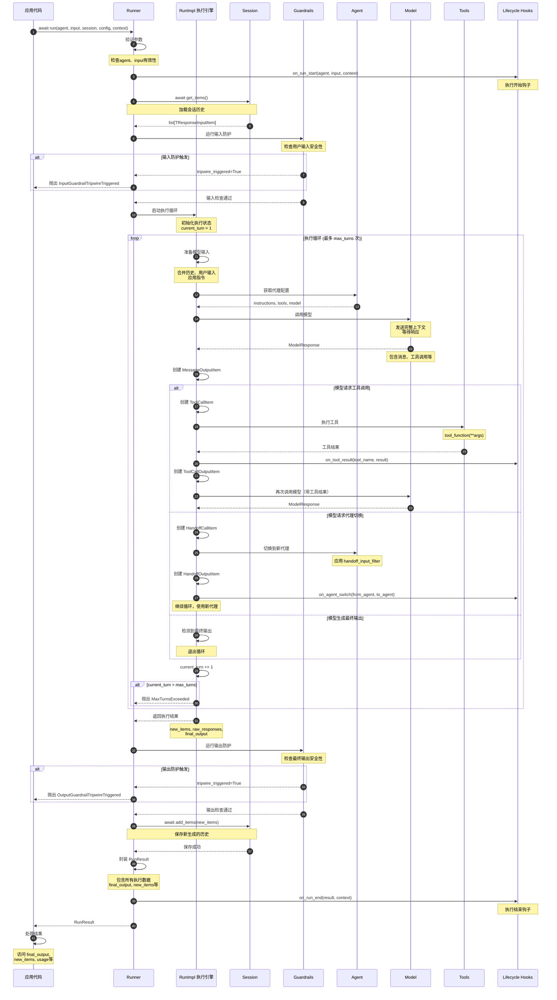
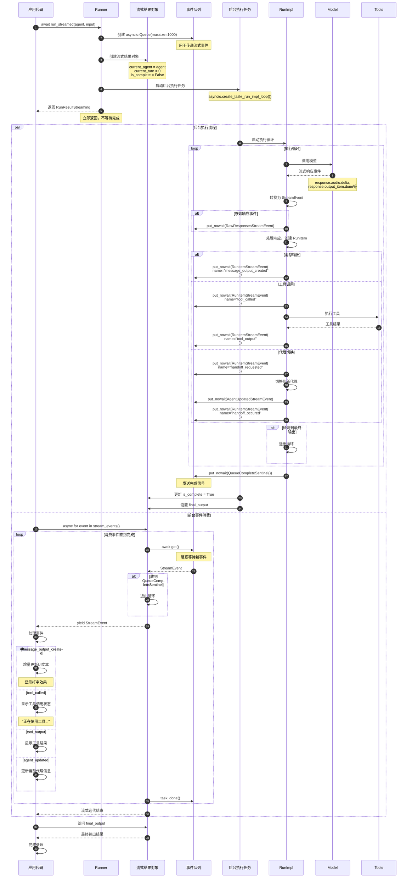
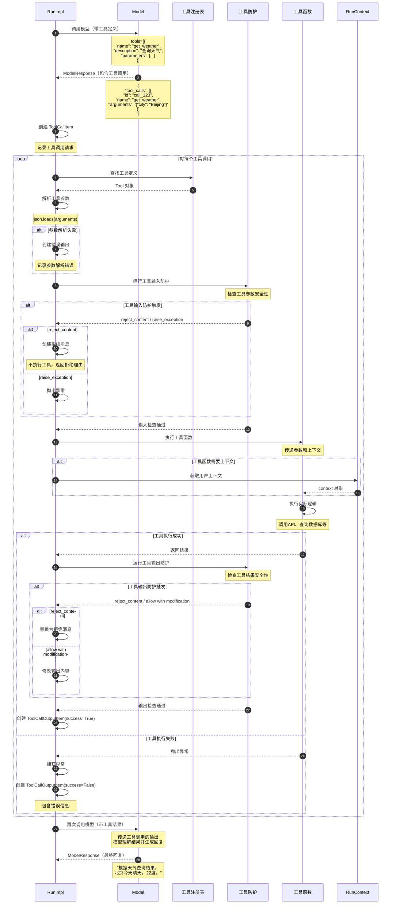
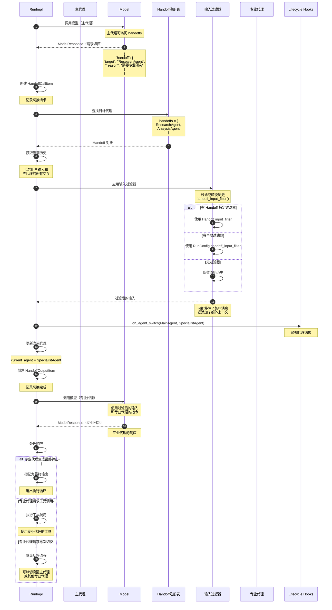
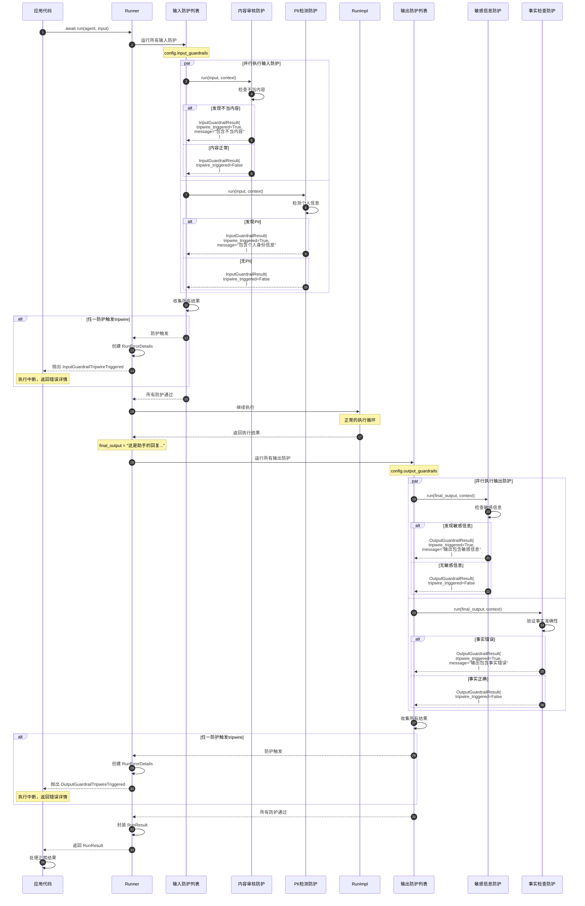
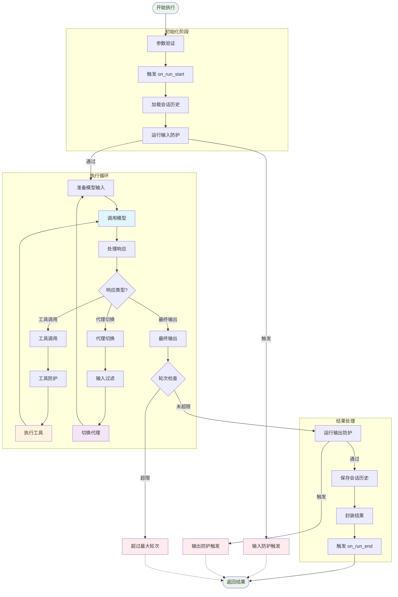

# OpenAI Agents Python SDK - Runner 模块时序图详解

## 1. 时序图总览

Runner 模块的时序图展示了代理执行的完整生命周期，从初始化、执行循环到结果返回的各个阶段，以及与其他模块的交互流程。

### 核心时序场景

| 场景类别 | 时序图 | 关键流程 |
|---------|--------|---------|
| **标准执行** | Runner.run() 完整流程 | 初始化、执行循环、结果封装 |
| **流式执行** | Runner.run_streamed() 流程 | 后台任务、事件队列、实时推送 |
| **工具调用** | 工具执行时序 | 工具参数解析、执行、结果处理 |
| **代理切换** | Handoff 切换流程 | 切换请求、输入过滤、新代理执行 |
| **防护检查** | Guardrail 执行时序 | 输入检查、输出检查、tripwire触发 |
| **会话管理** | Session 集成流程 | 历史加载、执行、历史保存 |

## 2. Runner.run() 标准执行时序图

### 场景：完整的代理执行流程



**时序图说明：**

### 执行阶段划分

1. **初始化阶段（步骤 1-8）**：
   - 参数验证
   - 触发开始钩子
   - 加载会话历史
   - 执行输入防护检查

2. **执行循环阶段（步骤 9-40）**：
   - 准备模型输入（历史+新输入）
   - 调用模型生成响应
   - 处理工具调用
   - 处理代理切换
   - 检测最终输出

3. **结果处理阶段（步骤 41-52）**：
   - 执行输出防护检查
   - 保存新历史到会话
   - 封装执行结果
   - 触发结束钩子

### 关键决策点

**工具调用决策：**
- 模型返回包含 `tool_calls` → 执行工具 → 再次调用模型
- 模型返回纯文本 → 可能是最终输出

**代理切换决策：**
- 模型请求 handoff → 切换代理 → 继续执行循环
- 新代理接收过滤后的输入

**循环终止条件：**
- 模型生成最终输出 → 正常退出
- 超过 `max_turns` → 抛出异常
- 防护触发 → 抛出异常

## 3. Runner.run_streamed() 流式执行时序图

### 场景：实时事件推送的流式执行



**时序图说明：**

### 并发执行模型

**后台任务：**
- 独立的异步任务执行代理逻辑
- 生成流式事件放入队列
- 完成后发送完成信号

**前台消费：**
- 从队列异步获取事件
- 立即处理和展示
- 收到完成信号后退出

### 事件流转机制

**事件生成：**
1. RunImpl 处理模型响应
2. 创建相应的 RunItem
3. 转换为 StreamEvent
4. 放入异步队列

**事件消费：**
1. 应用调用 `stream_events()`
2. 从队列异步获取事件
3. 通过 `yield` 返回给应用
4. 应用实时处理事件

### 流式执行优势

1. **低延迟**：事件立即推送，无需等待完成
2. **实时反馈**：用户看到增量生成的内容
3. **可中断**：支持通过 `cancel()` 中途取消
4. **资源高效**：使用异步队列，内存占用小

## 4. 工具调用时序图

### 场景：模型请求工具调用并处理结果



**时序图说明：**

### 工具调用流程

1. **工具定义传递**：模型调用时包含可用工具定义
2. **工具调用请求**：模型返回需要调用的工具和参数
3. **参数验证**：解析和验证工具参数
4. **输入防护**：检查工具参数的安全性
5. **工具执行**：调用实际的工具函数
6. **输出防护**：检查工具结果的安全性
7. **结果传递**：将工具结果返回给模型
8. **生成回复**：模型基于工具结果生成用户可见的回复

### 错误处理机制

**参数解析错误：**
- JSON 解析失败 → 创建错误输出，传递给模型
- 模型可以请求重新调用或放弃

**防护拒绝：**
- `reject_content`：不执行工具，返回拒绝理由
- `raise_exception`：中断整个执行
- `allow with modification`：修改后允许

**执行异常：**
- 工具函数抛出异常 → 捕获并记录
- 创建失败的输出项
- 传递错误信息给模型

## 5. 代理切换时序图

### 场景：主代理切换到专业代理



**时序图说明：**

### 代理切换机制

**切换触发：**
- 模型返回包含 `handoff` 字段
- 指定目标代理名称和切换原因

**输入过滤：**
1. 收集当前所有历史
2. 应用输入过滤器（如果有）
3. 传递过滤后的历史给新代理

**过滤器优先级：**
1. `Handoff.input_filter`（最高）
2. `RunConfig.handoff_input_filter`
3. 无过滤（保留原始历史）

### 输入过滤示例

```python
def handoff_input_filter(handoff_data: HandoffInputData) -> list[TResponseInputItem]:
    """只保留用户消息，移除中间交互"""
    filtered = []
    for item in handoff_data.input:
        if item.get("role") == "user":
            filtered.append(item)
    return filtered

# 效果：
# 原始历史: [user_msg, assistant_msg, tool_call, tool_output, user_msg]
# 过滤后: [user_msg, user_msg]
```

### 切换场景

**专业化分工：**
- 主代理 → 研究代理：需要深度研究
- 主代理 → 分析代理：需要数据分析
- 主代理 → 客服代理：处理客户问题

**任务路由：**
- 根据任务类型自动选择合适的代理
- 每个代理专注特定领域

**权限隔离：**
- 高权限代理 → 低权限代理：执行敏感操作前
- 低权限代理 → 高权限代理：需要提升权限时

## 6. 防护检查时序图

### 场景：输入和输出防护检查



**时序图说明：**

### 防护检查机制

**输入防护（执行前）：**
- 在代理执行前检查用户输入
- 可以阻止不安全或不当的输入
- tripwire触发时中断执行

**输出防护（执行后）：**
- 在返回结果前检查最终输出
- 可以阻止不安全或不当的输出
- tripwire触发时中断返回

### 并行执行

**性能优化：**
- 多个防护并行执行
- 使用 `asyncio.gather()` 并发运行
- 减少总体检查时间

**结果聚合：**
- 收集所有防护的结果
- 任一触发tripwire则中断
- 所有结果存储在 `RunResult` 中

### 防护结果处理

**tripwire触发：**
```python
InputGuardrailResult(
    output=GuardrailFunctionOutput(
        tripwire_triggered=True,
        message="输入违反了内容政策"
    )
)
# 抛出 InputGuardrailTripwireTriggered 异常
```

**防护通过：**
```python
InputGuardrailResult(
    output=GuardrailFunctionOutput(
        tripwire_triggered=False
    )
)
# 继续执行
```

**非阻塞警告：**
```python
InputGuardrailResult(
    output=GuardrailFunctionOutput(
        tripwire_triggered=False,
        message="检测到潜在问题，但允许继续"
    )
)
# 记录警告但不中断执行
```

## 7. 完整执行流程总览



Runner 模块通过精心设计的时序流程和清晰的执行阶段，为 OpenAI Agents 提供了强大的执行调度能力，支持从简单对话到复杂多代理协作的各种应用场景。

