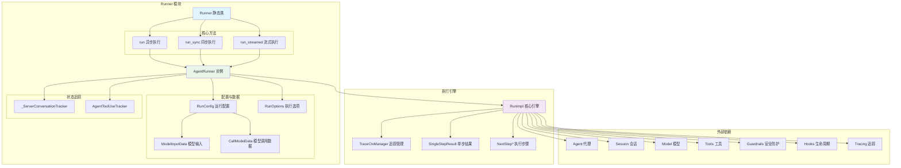

# OpenAI Agents Python SDK - Runner 模块概览

## 1. 模块职责与边界

Runner 模块是 OpenAI Agents Python SDK 的核心执行引擎，负责代理的运行调度、生命周期管理、以及复杂的多轮对话控制。该模块将代理配置转化为实际的执行流程，协调各个子系统完成智能代理任务。

### 核心职责

- **执行调度**：管理代理的完整执行生命周期，从启动到终止
- **轮次控制**：实现多轮对话机制，处理工具调用和代理切换
- **状态管理**：维护执行过程中的上下文状态和会话历史
- **流程编排**：协调模型调用、工具执行、安全检查等各个环节
- **异常处理**：统一处理执行过程中的各种异常情况
- **流式支持**：提供流式执行能力，支持实时事件推送

### 输入输出接口

**输入：**
- 起始代理实例（`Agent[TContext]`）
- 用户输入（字符串或结构化输入项列表）
- 运行配置（最大轮次、钩子函数、全局设置等）
- 会话管理（Session 对象、对话 ID 等）

**输出：**
- 执行结果（`RunResult` 或 `RunResultStreaming`）
- 包含最终输出、执行历史、使用统计等完整信息

### 上下游依赖关系

**上游调用者：**
- 用户应用：直接调用 `Runner.run()` 执行代理任务
- 代理工具化：`Agent.as_tool()` 内部使用 Runner 执行子代理
- 测试框架：自动化测试中使用 Runner 验证代理行为

**下游依赖：**
- `_run_impl.RunImpl`：核心执行逻辑实现
- `Agent`：代理配置和能力定义
- `Model`：语言模型接口抽象
- `Tool`：工具系统执行
- `Session`：会话状态持久化
- `Tracing`：可观测性追踪

## 2. 模块架构图



**架构说明：**

### 层次结构设计

1. **接口层**：`Runner` 静态类提供统一的调用接口
2. **执行器层**：`AgentRunner` 处理参数准备和资源管理
3. **引擎层**：`RunImpl` 实现核心的执行逻辑和状态控制
4. **配置层**：各种配置类和数据结构支持灵活配置

### 模块边界与扩展点

- **模型扩展点**：通过 `RunConfig.model_provider` 支持不同模型提供商
- **输入过滤扩展点**：`RunConfig.call_model_input_filter` 支持输入预处理
- **输出过滤扩展点**：`RunConfig.call_model_output_filter` 支持输出后处理
- **生命周期扩展点**：`RunHooks` 和 `AgentHooks` 支持事件监听
- **会话扩展点**：`Session` 接口支持不同存储后端

### 状态管理策略

- **执行状态**：由 `RunImpl` 维护，包括当前代理、轮次计数、执行历史
- **会话状态**：由 `Session` 对象管理，支持持久化和跨执行连续性
- **服务器状态**：`_ServerConversationTracker` 处理 OpenAI 对话 API 的状态同步
- **工具使用状态**：`AgentToolUseTracker` 追踪工具使用历史

### 资源占用控制

- **内存控制**：通过 `max_turns` 限制执行轮次，避免无限循环
- **时间控制**：支持全局和单步超时设置
- **并发控制**：工具执行支持并发限制和资源池管理

## 3. 关键算法与流程剖析

### 3.1 主执行循环算法

```python
async def run(self, starting_agent: Agent[TContext], input: str | list[TResponseInputItem], **kwargs) -> RunResult:
    """主执行循环的简化逻辑"""
    # 1) 初始化执行环境
    context = kwargs.get("context")
    max_turns = kwargs.get("max_turns", DEFAULT_MAX_TURNS)
    run_config = kwargs.get("run_config") or RunConfig()
    session = kwargs.get("session")
    
    # 2) 准备输入数据
    prepared_input = await self._prepare_input_with_session(input, session, run_config.session_input_callback)
    
    # 3) 创建执行追踪器
    tool_use_tracker = AgentToolUseTracker()
    server_conversation_tracker = _ServerConversationTracker(...)
    
    # 4) 启动追踪上下文
    with TraceCtxManager(workflow_name=run_config.workflow_name) as trace_ctx:
        # 5) 创建执行引擎实例
        run_impl = RunImpl(
            run_config=run_config,
            hooks=hooks,
            tool_use_tracker=tool_use_tracker,
            server_conversation_tracker=server_conversation_tracker,
            trace_ctx=trace_ctx
        )
        
        # 6) 执行主循环
        return await run_impl.run(
            starting_agent=starting_agent,
            original_input=input,
            prepared_input=prepared_input,
            context=context,
            max_turns=max_turns
        )
```

**算法目的：** 提供统一的代理执行入口，处理各种配置和状态管理需求。

**复杂度分析：**
- 时间复杂度：O(n*m)，n 为最大轮次，m 为每轮平均操作数
- 空间复杂度：O(h)，h 为会话历史长度
- 并发度：支持工具并发执行，I/O 密集型操作优化

**设计理由：**
- 分层设计：接口层处理参数验证，引擎层专注执行逻辑
- 状态隔离：不同类型的状态由专门的组件管理
- 资源控制：通过多层次的限制机制避免资源耗尽

### 3.2 输入准备与会话集成

```python
async def _prepare_input_with_session(
    self,
    input: str | list[TResponseInputItem],
    session: Session | None,
    session_input_callback: SessionInputCallback | None
) -> list[TResponseInputItem]:
    """集成会话历史的输入准备算法"""
    
    # 1) 转换用户输入为标准格式
    user_input_items = ItemHelpers.input_to_new_input_list(input)
    
    if session is None:
        return user_input_items
    
    # 2) 从会话加载历史消息
    try:
        session_items = await session.get_messages()
    except Exception as e:
        logger.warning(f"Failed to load session messages: {e}")
        session_items = []
    
    # 3) 应用会话输入回调（如果配置）
    if session_input_callback:
        try:
            if inspect.iscoroutinefunction(session_input_callback):
                session_items = await session_input_callback(session_items, user_input_items)
            else:
                session_items = session_input_callback(session_items, user_input_items)
        except Exception as e:
            logger.error(f"Session input callback failed: {e}")
    
    # 4) 合并历史消息和当前输入
    combined_input = []
    combined_input.extend(session_items)
    combined_input.extend(user_input_items)
    
    return combined_input
```

**流程目的：** 将用户输入与会话历史有机结合，提供完整的对话上下文。

**关键决策点：**
1. **会话加载失败处理**：优雅降级，记录警告但不阻断执行
2. **回调函数支持**：允许用户自定义会话历史的处理逻辑
3. **输入合并策略**：历史消息在前，当前输入在后，保持时间顺序

**异常处理策略：**
- 会话加载失败：记录警告，使用空历史继续执行
- 回调函数异常：记录错误，跳过回调处理
- 输入格式错误：提前验证，抛出明确的类型错误

### 3.3 服务器对话状态同步

```python
class _ServerConversationTracker:
    """OpenAI 服务器对话状态同步算法"""
    
    def prepare_input(
        self,
        original_input: str | list[TResponseInputItem],
        generated_items: list[RunItem],
    ) -> list[TResponseInputItem]:
        """准备发送到服务器的输入，避免重复发送"""
        input_items: list[TResponseInputItem] = []
        
        # 首次调用时包含原始输入
        if not generated_items:
            input_items.extend(ItemHelpers.input_to_new_input_list(original_input))
        
        # 处理生成的项目，跳过已发送或来自服务器的项目
        for item in generated_items:
            raw_item_id = id(item.raw_item)
            
            # 跳过已发送或服务器生成的项目
            if raw_item_id in self.sent_items or raw_item_id in self.server_items:
                continue
                
            input_items.append(item.to_input_item())
            self.sent_items.add(raw_item_id)  # 标记为已发送
        
        return input_items
    
    def track_server_items(self, model_response: ModelResponse) -> None:
        """追踪服务器返回的项目，避免重复发送"""
        for output_item in model_response.output:
            self.server_items.add(id(output_item))
        
        # 更新 previous_response_id（仅在使用该模式时）
        if (self.conversation_id is None 
            and self.previous_response_id is not None 
            and model_response.response_id is not None):
            self.previous_response_id = model_response.response_id
```

**同步目的：** 在使用 OpenAI 对话 API 时，避免重复发送已处理的消息，提高效率并减少成本。

**核心算法特点：**
1. **去重机制**：使用对象 ID 追踪已发送和服务器生成的项目
2. **状态维护**：动态更新 `previous_response_id` 支持增量对话
3. **内存优化**：使用集合结构快速查找，避免列表遍历

## 4. 配置参数详解

### 核心执行参数

| 参数名 | 类型 | 默认值 | 说明 | 影响范围 |
|--------|------|--------|------|----------|
| `starting_agent` | Agent[TContext] | 必需 | 起始执行代理 | 整个执行流程 |
| `input` | str \| list[TResponseInputItem] | 必需 | 用户输入 | 首次模型调用 |
| `context` | TContext \| None | None | 运行上下文 | 工具和钩子函数 |
| `max_turns` | int | 10 | 最大执行轮次 | 防止无限循环 |
| `session` | Session \| None | None | 会话管理对象 | 历史加载和保存 |

### 高级配置参数

| 参数名 | 类型 | 默认值 | 说明 | 使用场景 |
|--------|------|--------|------|----------|
| `hooks` | RunHooks[TContext] \| None | None | 执行生命周期钩子 | 监控和调试 |
| `run_config` | RunConfig \| None | None | 全局运行配置 | 模型和行为定制 |
| `conversation_id` | str \| None | None | OpenAI 对话 ID | 服务器端状态管理 |
| `previous_response_id` | str \| None | None | 前一个响应 ID | 增量对话模式 |

### RunConfig 全局配置

```python
@dataclass
class RunConfig:
    """全局运行配置，影响整个执行过程"""
    
    # 模型配置
    model: str | Model | None = None                    # 覆盖代理模型设置
    model_provider: ModelProvider = field(default_factory=MultiProvider)  # 模型提供商
    model_settings: ModelSettings | None = None        # 全局模型参数
    
    # 输入输出过滤
    call_model_input_filter: CallModelInputFilter | None = None   # 模型输入预处理
    call_model_output_filter: CallModelOutputFilter | None = None # 模型输出后处理
    
    # 安全防护
    input_guardrails: list[InputGuardrail[Any]] | None = None     # 全局输入安全检查
    output_guardrails: list[OutputGuardrail[Any]] | None = None   # 全局输出安全检查
    
    # 会话管理
    session_input_callback: SessionInputCallback | None = None    # 会话输入处理回调
    
    # 切换配置
    handoff_input_filter: HandoffInputFilter | None = None       # 全局切换输入过滤
    
    # 追踪配置
    workflow_name: str | None = None                             # 工作流名称
    disable_tracing: bool = False                                # 禁用追踪
    trace_include_sensitive_data: bool = True                    # 包含敏感数据
```

**配置优先级：**
1. RunConfig 全局配置（最高优先级）
2. Agent 代理级别配置
3. 系统默认配置（最低优先级）

**常用配置组合：**

```python
# 生产环境配置
production_config = RunConfig(
    model_settings=ModelSettings(temperature=0.3),  # 降低随机性
    disable_tracing=False,                          # 启用追踪
    trace_include_sensitive_data=False,             # 不包含敏感数据
    input_guardrails=[content_safety_guardrail],    # 启用安全检查
    output_guardrails=[output_safety_guardrail]
)

# 开发调试配置
debug_config = RunConfig(
    disable_tracing=False,                          # 启用详细追踪
    trace_include_sensitive_data=True,              # 包含完整数据
    workflow_name="debug_session"                   # 便于追踪识别
)

# 高性能配置
performance_config = RunConfig(
    disable_tracing=True,                           # 禁用追踪减少开销
    model_settings=ModelSettings(max_tokens=1000), # 限制输出长度
    call_model_input_filter=input_compression_filter # 压缩输入
)
```

## 5. 最佳实践与使用模式

### 5.1 基础使用模式

```python
import asyncio
from agents import Agent, Runner

async def basic_usage():
    """基础使用：简单对话"""
    agent = Agent(
        name="Assistant",
        instructions="你是一个有用的助手"
    )
    
    result = await Runner.run(agent, "你好！")
    print(result.final_output)
    
    # 查看执行统计
    print(f"使用令牌: {result.usage.total_tokens}")
    print(f"执行轮次: {len(result.all_items)}")

asyncio.run(basic_usage())
```

### 5.2 会话管理模式

```python
from agents import Agent, Runner, SQLiteSession

async def session_management():
    """会话管理：维护对话历史"""
    agent = Agent(
        name="ChatBot",
        instructions="维持连贯的对话，记住之前的交流内容"
    )
    
    # 创建持久化会话
    session = SQLiteSession("chat_history.db")
    
    # 多轮对话
    questions = [
        "我叫张三，今年30岁",
        "我的年龄是多少？",
        "我的名字是什么？"
    ]
    
    for question in questions:
        result = await Runner.run(
            agent, 
            question, 
            session=session  # 自动加载和保存历史
        )
        print(f"Q: {question}")
        print(f"A: {result.final_output}\n")
    
    await session.close()

asyncio.run(session_management())
```

### 5.3 流式执行模式

```python
from agents import Agent, Runner

def streaming_execution():
    """流式执行：实时获取执行事件"""
    agent = Agent(
        name="StreamingAgent",
        instructions="详细解释你的思考过程"
    )
    
    # 启动流式执行
    result = Runner.run_streamed(
        agent,
        "解释量子计算的基本原理"
    )
    
    print("开始流式执行...")
    
    # 实时处理事件
    for event in result.stream_events():
        if event.type == "agent_updated":
            print(f"代理切换: {event.data.agent.name}")
        elif event.type == "run_item":
            if event.data.item.type == "message_output":
                print(f"输出: {event.data.item.content}")
        elif event.type == "raw_responses":
            print(f"模型响应: {len(event.data.responses)} 个响应")
    
    print(f"最终结果: {result.final_output}")

streaming_execution()
```

### 5.4 错误处理与监控模式

```python
from agents import Agent, Runner, RunConfig
from agents.exceptions import MaxTurnsExceeded, InputGuardrailTripwireTriggered

async def error_handling():
    """错误处理：优雅处理各种异常情况"""
    agent = Agent(
        name="ReliableAgent",
        instructions="尽力完成任务，但要注意安全边界"
    )
    
    config = RunConfig(
        max_turns=5,  # 限制最大轮次
        disable_tracing=False  # 启用追踪便于调试
    )
    
    try:
        result = await Runner.run(
            agent,
            "帮我写一个复杂的程序",
            run_config=config,
            max_turns=3
        )
        return result
        
    except MaxTurnsExceeded as e:
        print(f"达到最大轮次限制: {e.details.max_turns}")
        print(f"当前执行历史: {len(e.details.items)} 项")
        # 可以返回部分结果
        return e.details.partial_result
        
    except InputGuardrailTripwireTriggered as e:
        print(f"输入安全检查失败: {e.guardrail_name}")
        print(f"失败原因: {e.failure_reason}")
        # 记录安全事件
        return None
        
    except Exception as e:
        print(f"未预期错误: {e}")
        # 记录错误日志
        return None

result = await error_handling()
```

### 5.5 高级定制模式

```python
from agents import Agent, Runner, RunConfig, RunHooks

class CustomRunHooks(RunHooks):
    """自定义执行钩子"""
    
    async def on_agent_start(self, context, agent):
        print(f"开始执行代理: {agent.name}")
    
    async def on_model_call_start(self, context, agent, input_data):
        print(f"模型调用开始，输入长度: {len(input_data.input)}")
    
    async def on_tool_execution_start(self, context, agent, tool_name, tool_input):
        print(f"工具执行开始: {tool_name}")
    
    async def on_agent_end(self, context, agent, result):
        print(f"代理执行完成: {agent.name}, 令牌使用: {result.usage.total_tokens}")

async def advanced_customization():
    """高级定制：完全控制执行流程"""
    
    def custom_input_filter(call_data):
        """自定义输入过滤"""
        # 添加系统提示
        system_prompt = "请在回答前先思考问题的关键点。"
        call_data.model_data.instructions = system_prompt
        return call_data.model_data
    
    def custom_output_filter(response):
        """自定义输出过滤"""
        # 添加输出格式化
        if hasattr(response, 'final_output'):
            response.final_output = f"[AI回答] {response.final_output}"
        return response
    
    agent = Agent(
        name="CustomAgent",
        instructions="你是一个定制化的AI助手"
    )
    
    config = RunConfig(
        call_model_input_filter=custom_input_filter,
        call_model_output_filter=custom_output_filter,
        workflow_name="custom_workflow"
    )
    
    result = await Runner.run(
        agent,
        "解释机器学习的基本概念",
        hooks=CustomRunHooks(),
        run_config=config
    )
    
    return result

result = await advanced_customization()
```

这些最佳实践展示了 Runner 模块在不同场景下的灵活应用，从简单的单次对话到复杂的流式处理和高级定制，为开发者提供了完整的解决方案。
