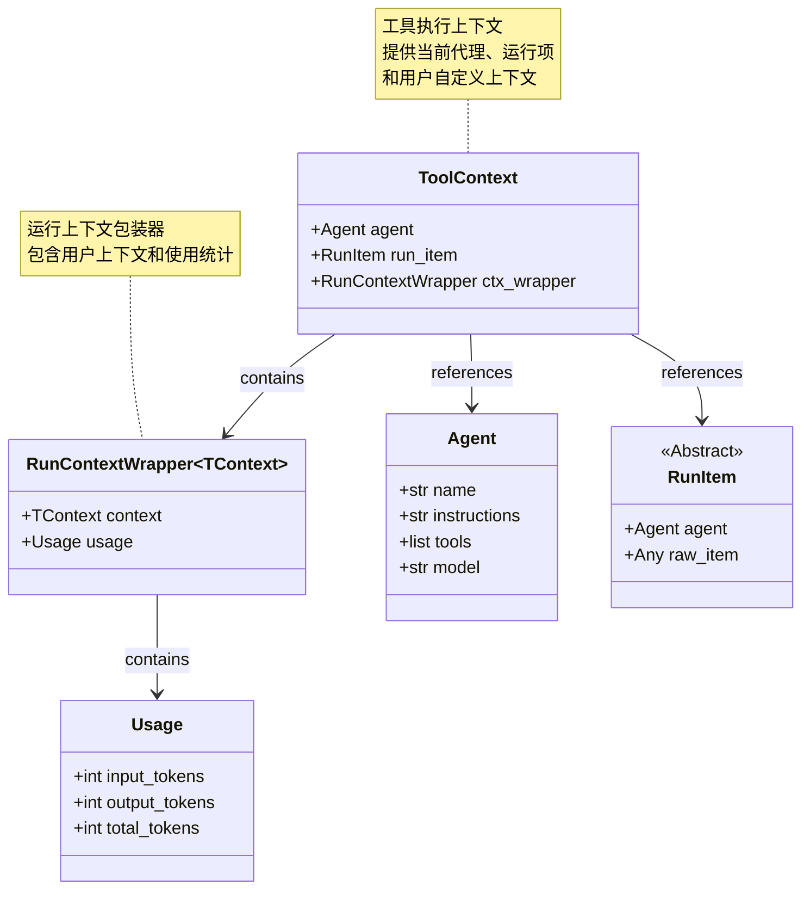
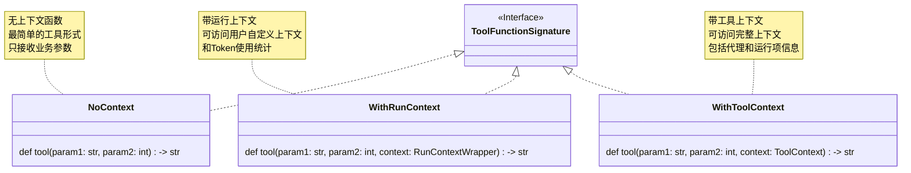
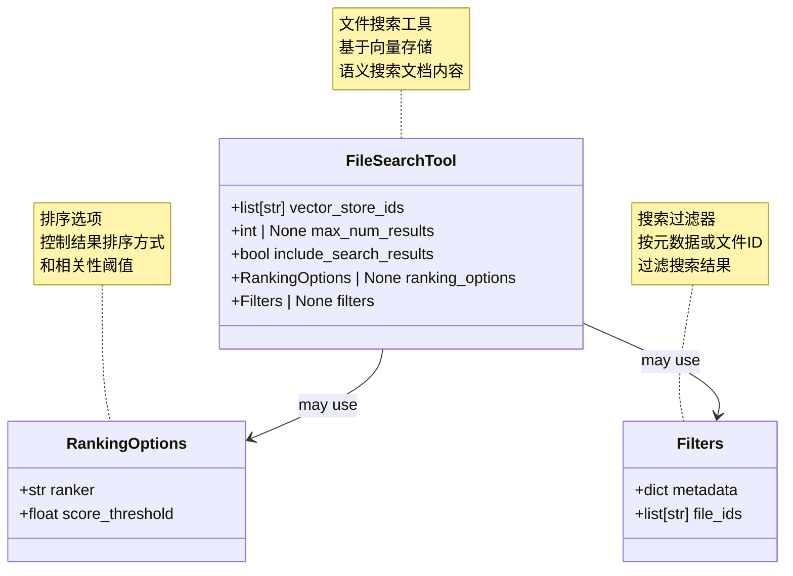
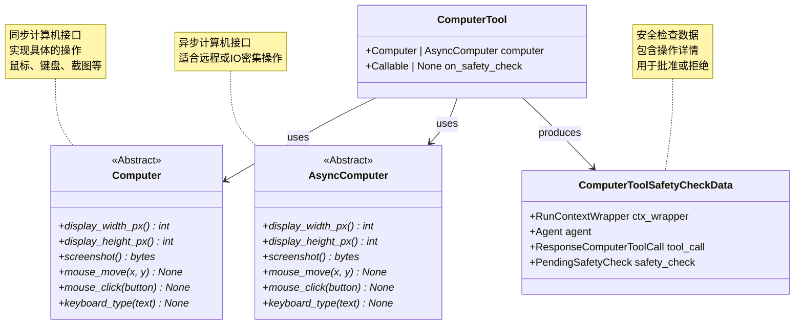
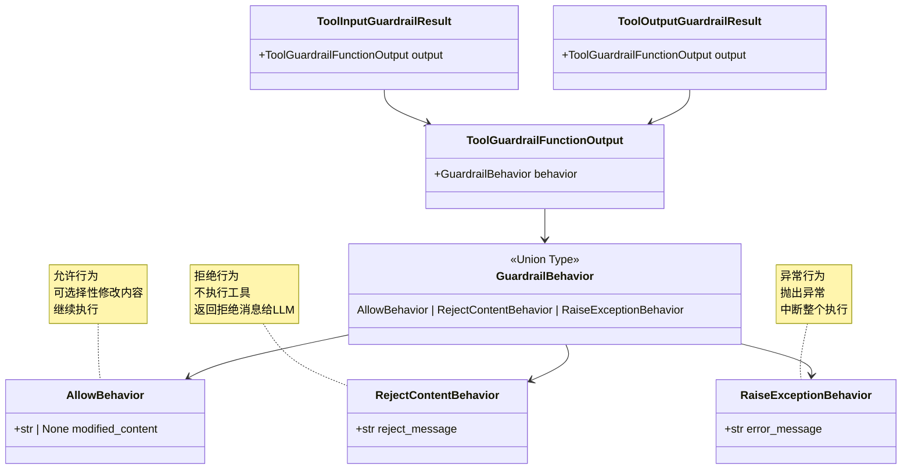
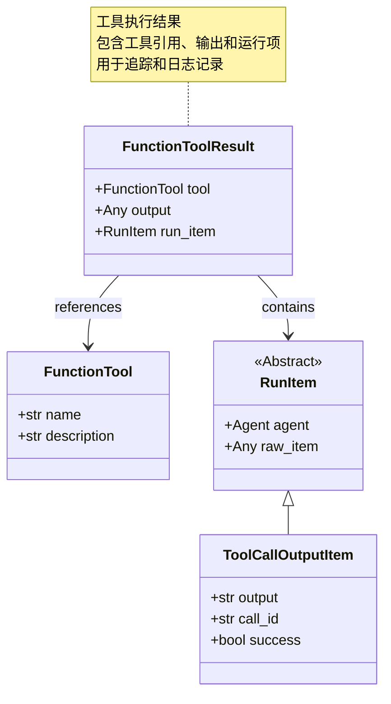
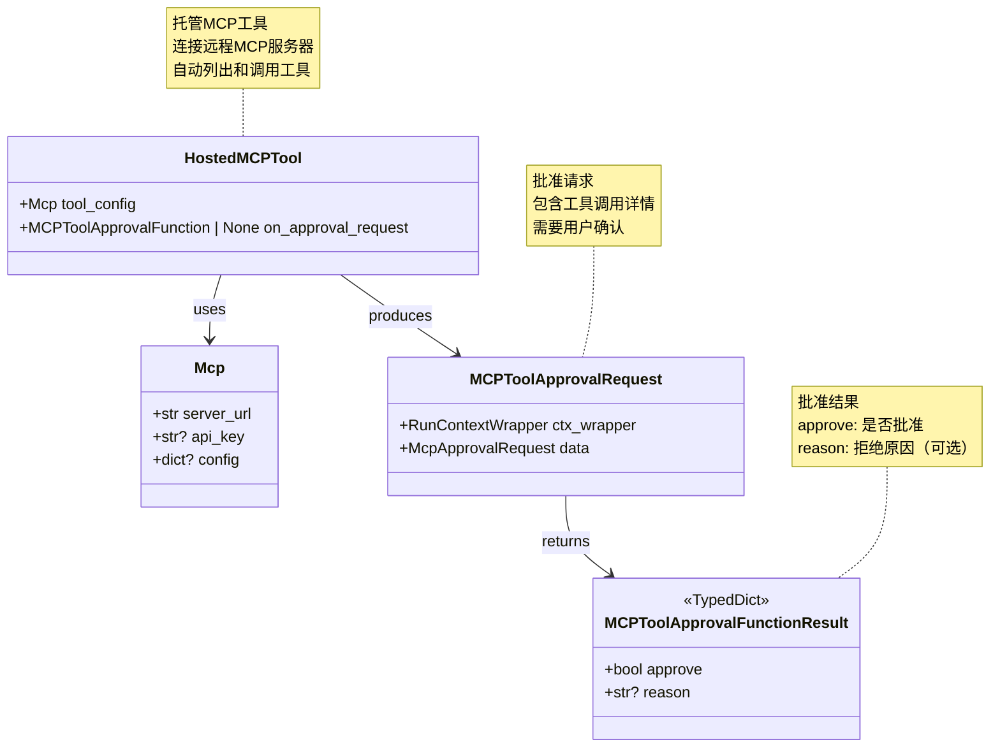
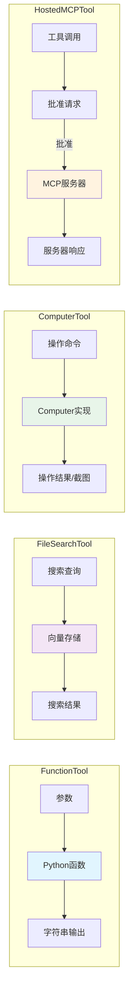

# OpenAI Agents Python SDK - Tools 模块数据结构详解

## 1. 核心数据结构总览

Tools 模块的数据结构设计围绕工具定义、参数模式和执行结果，提供完整的类型安全和灵活的扩展能力。

### 数据结构层次

```
Tool (联合类型)
    ├── FunctionTool (函数工具)
    │   ├── 参数 JSON Schema
    │   ├── 执行函数
    │   └── 防护配置
    ├── 托管工具
    │   ├── FileSearchTool
    │   ├── WebSearchTool
    │   ├── CodeInterpreterTool
    │   └── ImageGenerationTool
    └── 高级工具
        ├── ComputerTool
        ├── HostedMCPTool
        └── LocalShellTool

工具执行上下文
    ├── ToolContext
    └── RunContextWrapper

工具结果
    └── FunctionToolResult
```

## 2. 工具类型 UML

### 2.1 Tool 类型层次结构

```mermaid
classDiagram
    class Tool {
        <<Union Type>>
        FunctionTool | FileSearchTool | WebSearchTool | ComputerTool | HostedMCPTool | LocalShellTool | CodeInterpreterTool | ImageGenerationTool
    }
    
    class FunctionTool {
        +str name
        +str description
        +dict params_json_schema
        +Callable on_invoke_tool
        +bool strict_json_schema
        +bool | Callable is_enabled
        +list | None tool_input_guardrails
        +list | None tool_output_guardrails
        
        +__post_init__()
    }
    
    class FileSearchTool {
        +list[str] vector_store_ids
        +int | None max_num_results
        +bool include_search_results
        +RankingOptions | None ranking_options
        +Filters | None filters
        
        +name() str
    }
    
    class WebSearchTool {
        +UserLocation | None user_location
        +WebSearchToolFilters | None filters
        +Literal["low","medium","high"] search_context_size
        
        +name() str
    }
    
    class ComputerTool {
        +Computer | AsyncComputer computer
        +Callable | None on_safety_check
        
        +name() str
    }
    
    class HostedMCPTool {
        +Mcp tool_config
        +MCPToolApprovalFunction | None on_approval_request
        
        +name() str
    }
    
    class LocalShellTool {
        +LocalShellExecutor executor
        
        +name() str
    }
    
    class CodeInterpreterTool {
        +CodeInterpreter tool_config
        
        +name() str
    }
    
    class ImageGenerationTool {
        +ImageGeneration tool_config
        
        +name() str
    }
    
    Tool --> FunctionTool
    Tool --> FileSearchTool
    Tool --> WebSearchTool
    Tool --> ComputerTool
    Tool --> HostedMCPTool
    Tool --> LocalShellTool
    Tool --> CodeInterpreterTool
    Tool --> ImageGenerationTool
    
    note for Tool "工具联合类型<br/>支持多种工具实现<br/>统一的工具接口"
    note for FunctionTool "Python函数包装<br/>最灵活的工具类型<br/>支持防护和动态启用"
    note for FileSearchTool "向量存储搜索<br/>OpenAI托管服务<br/>语义搜索文档"
    note for ComputerTool "计算机控制<br/>鼠标键盘操作<br/>自动化任务"
```



**Tool 联合类型说明：**

Tool 是一个联合类型，包含所有支持的工具类型。这种设计允许：
- 统一的工具接口
- 类型安全的工具传递
- 灵活的工具扩展

### 2.2 FunctionTool 详细结构

```mermaid
classDiagram
    class FunctionTool {
        +str name
        +str description
        +dict params_json_schema
        +Callable on_invoke_tool
        +bool strict_json_schema
        +bool | Callable is_enabled
        +list~ToolInputGuardrail~ | None tool_input_guardrails
        +list~ToolOutputGuardrail~ | None tool_output_guardrails
    }
    
    class ToolFunction {
        <<Union Type>>
        ToolFunctionWithoutContext | ToolFunctionWithContext | ToolFunctionWithToolContext
    }
    
    class ToolFunctionWithoutContext {
        <<Callable>>
        (ToolParams) -> Any
    }
    
    class ToolFunctionWithContext {
        <<Callable>>
        (RunContextWrapper, ToolParams) -> Any
    }
    
    class ToolFunctionWithToolContext {
        <<Callable>>
        (ToolContext, ToolParams) -> Any
    }
    
    class ToolInputGuardrail {
        <<Abstract>>
        +run(tool_name, arguments, context)* ToolInputGuardrailResult
    }
    
    class ToolOutputGuardrail {
        <<Abstract>>
        +run(tool_name, output, context)* ToolOutputGuardrailResult
    }
    
    class FunctionToolResult {
        +FunctionTool tool
        +Any output
        +RunItem run_item
    }
    
    FunctionTool --> ToolFunction : wraps
    ToolFunction --> ToolFunctionWithoutContext
    ToolFunction --> ToolFunctionWithContext
    ToolFunction --> ToolFunctionWithToolContext
    
    FunctionTool --> ToolInputGuardrail : may have
    FunctionTool --> ToolOutputGuardrail : may have
    FunctionTool --> FunctionToolResult : produces
    
    note for ToolFunction "三种函数签名<br/>根据是否需要上下文<br/>自动选择合适的调用方式"
    note for FunctionToolResult "工具执行结果<br/>包含工具、输出和运行项<br/>用于追踪和调试"
```

**FunctionTool 字段详解：**

| 字段名 | 类型 | 说明 |
|--------|------|------|
| `name` | `str` | 工具名称，展示给LLM，通常为函数名 |
| `description` | `str` | 工具描述，帮助LLM理解工具用途 |
| `params_json_schema` | `dict` | 参数的JSON Schema，定义参数类型和约束 |
| `on_invoke_tool` | `Callable` | 工具调用函数，接收上下文和参数JSON |
| `strict_json_schema` | `bool` | 是否使用严格JSON Schema（推荐True） |
| `is_enabled` | `bool \| Callable` | 工具启用状态或动态判断函数 |
| `tool_input_guardrails` | `list \| None` | 工具输入防护检查列表 |
| `tool_output_guardrails` | `list \| None` | 工具输出防护检查列表 |

**params_json_schema 示例：**

```python
# 简单参数
{
    "type": "object",
    "properties": {
        "city": {
            "type": "string",
            "description": "城市名称"
        },
        "units": {
            "type": "string",
            "enum": ["celsius", "fahrenheit"],
            "description": "温度单位"
        }
    },
    "required": ["city"],
    "additionalProperties": False
}

# 复杂嵌套参数
{
    "type": "object",
    "properties": {
        "query": {
            "type": "string",
            "description": "搜索查询"
        },
        "filters": {
            "type": "object",
            "properties": {
                "category": {"type": "string"},
                "price_range": {
                    "type": "object",
                    "properties": {
                        "min": {"type": "number"},
                        "max": {"type": "number"}
                    }
                }
            }
        },
        "limit": {
            "type": "integer",
            "minimum": 1,
            "maximum": 100
        }
    },
    "required": ["query"]
}
```

## 3. 工具上下文数据结构

### 3.1 ToolContext UML



**ToolContext 字段详解：**

| 字段名 | 类型 | 说明 |
|--------|------|------|
| `agent` | `Agent` | 当前执行的代理实例 |
| `run_item` | `RunItem` | 当前的运行项（工具调用项） |
| `ctx_wrapper` | `RunContextWrapper` | 运行上下文包装器，包含用户上下文和使用统计 |

**ToolContext 使用示例：**

```python
@function_tool
def context_aware_tool(
    param: str,
    context: ToolContext  # 接收完整的工具上下文
) -> str:
    """使用完整上下文的工具"""
    
    # 访问当前代理
    agent_name = context.agent.name
    
    # 访问用户上下文
    user_data = context.ctx_wrapper.context
    
    # 访问使用统计
    tokens_used = context.ctx_wrapper.usage.total_tokens
    
    # 访问运行项信息
    tool_call_id = context.run_item.raw_item.id
    
    return f"处理完成：{param}，代理：{agent_name}，已用token：{tokens_used}"
```

### 3.2 工具函数签名类型



**函数签名对比：**

```python
# 1. 无上下文（最简单）
@function_tool
def simple_tool(city: str) -> str:
    """查询天气"""
    return get_weather_from_api(city)

# 2. 带运行上下文（访问用户数据）
@function_tool
def user_aware_tool(
    city: str,
    context: RunContextWrapper
) -> str:
    """根据用户偏好查询天气"""
    user_prefs = context.context.preferences
    units = user_prefs.get("temperature_units", "celsius")
    return get_weather_from_api(city, units)

# 3. 带工具上下文（访问完整信息）
@function_tool
def full_context_tool(
    city: str,
    context: ToolContext
) -> str:
    """使用完整上下文查询天气"""
    agent_name = context.agent.name
    user_id = context.ctx_wrapper.context.user_id
    
    # 记录日志
    log_tool_call(agent_name, user_id, "get_weather", city)
    
    return get_weather_from_api(city)
```

## 4. 托管工具数据结构

### 4.1 FileSearchTool 数据结构



**FileSearchTool 字段详解：**

| 字段名 | 类型 | 默认值 | 说明 |
|--------|------|--------|------|
| `vector_store_ids` | `list[str]` | - | 要搜索的向量存储ID列表 |
| `max_num_results` | `int \| None` | `None` | 返回的最大结果数 |
| `include_search_results` | `bool` | `False` | 是否在LLM输出中包含搜索结果 |
| `ranking_options` | `RankingOptions \| None` | `None` | 结果排序选项 |
| `filters` | `Filters \| None` | `None` | 结果过滤器 |

**配置示例：**

```python
from agents import FileSearchTool
from openai.types.responses.file_search_tool_param import (
    RankingOptions,
    Filters
)

# 基础配置
basic_search = FileSearchTool(
    vector_store_ids=["vs_abc123"]
)

# 完整配置
advanced_search = FileSearchTool(
    vector_store_ids=["vs_abc123", "vs_def456"],
    max_num_results=5,
    include_search_results=True,
    ranking_options=RankingOptions(
        ranker="auto",
        score_threshold=0.7
    ),
    filters=Filters(
        metadata={"department": "engineering"},
        file_ids=["file_123", "file_456"]
    )
)
```

### 4.2 ComputerTool 数据结构



**Computer 接口方法：**

| 方法名 | 返回类型 | 说明 |
|--------|---------|------|
| `display_width_px` | `int` | 显示器宽度（像素） |
| `display_height_px` | `int` | 显示器高度（像素） |
| `screenshot()` | `bytes` | 截取当前屏幕 |
| `mouse_move(x, y)` | `None` | 移动鼠标到指定位置 |
| `mouse_click(button)` | `None` | 点击鼠标按钮 |
| `keyboard_type(text)` | `None` | 输入文本 |

**实现示例：**

```python
from agents.computer import Computer
import pyautogui

class MyComputer(Computer):
    """基于pyautogui的计算机实现"""
    
    @property
    def display_width_px(self) -> int:
        return 1920
    
    @property
    def display_height_px(self) -> int:
        return 1080
    
    async def screenshot(self) -> bytes:
        """截图"""
        screenshot = pyautogui.screenshot()
        # 转换为bytes
        return screenshot_to_bytes(screenshot)
    
    async def mouse_move(self, x: int, y: int):
        """移动鼠标"""
        pyautogui.moveTo(x, y)
    
    async def mouse_click(self, button: str):
        """点击鼠标"""
        pyautogui.click(button=button)
    
    async def keyboard_type(self, text: str):
        """输入文本"""
        pyautogui.typewrite(text)
```

## 5. 工具防护数据结构

### 5.1 工具防护结果 UML



**防护行为详解：**

| 行为类型 | 效果 | 使用场景 |
|---------|------|---------|
| `AllowBehavior` | 允许继续执行 | 检查通过，可选修改内容 |
| `RejectContentBehavior` | 拒绝执行，返回消息 | 参数不合法但不致命 |
| `RaiseExceptionBehavior` | 抛出异常，中断执行 | 严重违规，需要中断 |

**防护实现示例：**

```python
from agents.tool_guardrails import (
    ToolInputGuardrail,
    ToolInputGuardrailResult,
    ToolGuardrailFunctionOutput,
    AllowBehavior,
    RejectContentBehavior,
    RaiseExceptionBehavior
)

class AmountLimitGuardrail(ToolInputGuardrail):
    """金额限制防护"""
    
    def __init__(self, max_amount: float):
        self.max_amount = max_amount
    
    async def run(
        self,
        tool_name: str,
        arguments: dict,
        context: Any
    ) -> ToolInputGuardrailResult:
        
        amount = arguments.get("amount", 0)
        
        if amount > self.max_amount:
            # 超过限制：拒绝
            return ToolInputGuardrailResult(
                output=ToolGuardrailFunctionOutput(
                    behavior=RejectContentBehavior(
                        reject_message=f"金额 {amount} 超过限制 {self.max_amount}"
                    )
                )
            )
        
        if amount < 0:
            # 负数：抛出异常
            return ToolInputGuardrailResult(
                output=ToolGuardrailFunctionOutput(
                    behavior=RaiseExceptionBehavior(
                        error_message="金额不能为负数"
                    )
                )
            )
        
        # 允许执行
        return ToolInputGuardrailResult(
            output=ToolGuardrailFunctionOutput(
                behavior=AllowBehavior()
            )
        )

class OutputSanitizationGuardrail(ToolOutputGuardrail):
    """输出清理防护"""
    
    async def run(
        self,
        tool_name: str,
        output: str,
        context: Any
    ) -> ToolOutputGuardrailResult:
        
        # 检查并移除敏感信息
        if contains_credit_card(output):
            # 修改内容
            sanitized = remove_credit_card_numbers(output)
            return ToolOutputGuardrailResult(
                output=ToolGuardrailFunctionOutput(
                    behavior=AllowBehavior(
                        modified_content=sanitized
                    )
                )
            )
        
        # 原样通过
        return ToolOutputGuardrailResult(
            output=ToolGuardrailFunctionOutput(
                behavior=AllowBehavior()
            )
        )
```

## 6. 工具执行结果数据结构

### 6.1 FunctionToolResult UML



**FunctionToolResult 字段详解：**

| 字段名 | 类型 | 说明 |
|--------|------|------|
| `tool` | `FunctionTool` | 执行的工具实例 |
| `output` | `Any` | 工具的输出结果 |
| `run_item` | `RunItem` | 生成的运行项（ToolCallOutputItem） |

**使用示例：**

```python
# 工具执行后获取结果
async def execute_and_log_tool(tool: FunctionTool, args: dict):
    """执行工具并记录结果"""
    
    # 执行工具（内部实现）
    result: FunctionToolResult = await execute_tool(tool, args)
    
    # 访问结果信息
    tool_name = result.tool.name
    output = result.output
    success = result.run_item.success if hasattr(result.run_item, 'success') else True
    
    # 记录日志
    logger.info(f"工具 {tool_name} 执行{'成功' if success else '失败'}")
    logger.debug(f"输出: {output}")
    
    return result
```

## 7. MCP 工具数据结构

### 7.1 HostedMCPTool 和批准流程



**批准流程示例：**

```python
from agents import HostedMCPTool
from agents.tool import MCPToolApprovalRequest, MCPToolApprovalFunctionResult

async def mcp_approval_handler(
    request: MCPToolApprovalRequest
) -> MCPToolApprovalFunctionResult:
    """MCP工具批准处理器"""
    
    # 访问请求信息
    tool_name = request.data.tool_name
    tool_arguments = request.data.arguments
    server_name = request.data.server_name
    
    # 访问运行上下文
    user_id = request.ctx_wrapper.context.user_id
    
    # 自动批准白名单工具
    whitelist = ["read_file", "list_directory", "get_info"]
    if tool_name in whitelist:
        return {"approve": True}
    
    # 需要管理员权限的工具
    admin_tools = ["delete_file", "modify_system"]
    if tool_name in admin_tools:
        if not is_admin(user_id):
            return {
                "approve": False,
                "reason": f"工具 {tool_name} 需要管理员权限"
            }
    
    # 检查参数
    if "path" in tool_arguments:
        path = tool_arguments["path"]
        if "/system" in path:
            return {
                "approve": False,
                "reason": "不允许访问系统目录"
            }
    
    # 默认批准
    return {"approve": True}

# 创建MCP工具
mcp_tool = HostedMCPTool(
    tool_config=Mcp(
        server_url="https://mcp.example.com",
        api_key="your-api-key"
    ),
    on_approval_request=mcp_approval_handler
)
```

## 8. 工具数据流转图

### 8.1 工具调用数据流

```mermaid
flowchart TB
    subgraph "工具定义阶段"
        FUNC[Python函数]
        DECORATOR[@function_tool装饰器]
        SCHEMA[提取函数签名和文档]
        TOOL[FunctionTool对象]
    end
    
    subgraph "工具注册阶段"
        AGENT[Agent]
        TOOLLIST[工具列表]
        AGGREGATE[工具聚合]
    end
    
    subgraph "工具调用阶段"
        LLM[模型决策]
        TOOLCALL[ToolCall请求]
        PARSE[解析参数JSON]
        INPUTGUARD[输入防护]
        ENABLED[检查启用状态]
        EXECUTE[执行工具函数]
        OUTPUTGUARD[输出防护]
        RESULT[FunctionToolResult]
    end
    
    subgraph "结果处理阶段"
        RUNITEM[创建RunItem]
        TOMODEL[返回给模型]
    end
    
    FUNC --> DECORATOR
    DECORATOR --> SCHEMA
    SCHEMA --> TOOL
    
    TOOL --> TOOLLIST
    TOOLLIST --> AGENT
    AGENT --> AGGREGATE
    
    AGGREGATE --> LLM
    LLM --> TOOLCALL
    
    TOOLCALL --> PARSE
    PARSE --> INPUTGUARD
    
    INPUTGUARD -->|通过| ENABLED
    INPUTGUARD -->|拒绝| RESULT
    
    ENABLED -->|启用| EXECUTE
    ENABLED -->|禁用| RESULT
    
    EXECUTE --> OUTPUTGUARD
    
    OUTPUTGUARD -->|通过| RESULT
    OUTPUTGUARD -->|修改| RESULT
    OUTPUTGUARD -->|拒绝| RESULT
    
    RESULT --> RUNITEM
    RUNITEM --> TOMODEL
    
    style FUNC fill:#e1f5fe
    style TOOL fill:#f3e5f5
    style EXECUTE fill:#e8f5e9
    style RESULT fill:#fff3e0
```

### 8.2 不同工具类型的数据流



## 9. 数据结构最佳实践

### 9.1 自定义工具类型

```python
from dataclasses import dataclass
from agents.tool import Tool

@dataclass
class DatabaseTool:
    """自定义数据库工具"""
    
    connection_string: str
    allowed_operations: list[str]
    
    @property
    def name(self) -> str:
        return "database_tool"
    
    def execute_query(self, query: str) -> str:
        """执行数据库查询"""
        # 实现查询逻辑
        return query_result

# 注意：自定义工具类型需要添加到Tool联合类型
# 或者转换为FunctionTool
def create_database_function_tool(db_tool: DatabaseTool) -> FunctionTool:
    """将自定义工具转换为FunctionTool"""
    
    @function_tool
    def query_database(sql: str) -> str:
        """执行SQL查询"""
        return db_tool.execute_query(sql)
    
    return query_database
```

### 9.2 工具组合模式

```python
from typing import Protocol

class ToolProvider(Protocol):
    """工具提供者协议"""
    def get_tools(self) -> list[Tool]:
        ...

class BasicToolProvider:
    """基础工具提供者"""
    def get_tools(self) -> list[Tool]:
        return [
            get_time,
            calculate,
            search_web
        ]

class AdminToolProvider:
    """管理员工具提供者"""
    def __init__(self, basic_provider: ToolProvider):
        self.basic_provider = basic_provider
    
    def get_tools(self) -> list[Tool]:
        return self.basic_provider.get_tools() + [
            manage_users,
            system_config,
            database_admin
        ]

# 使用
basic = BasicToolProvider()
admin = AdminToolProvider(basic)

basic_agent = Agent(tools=basic.get_tools())
admin_agent = Agent(tools=admin.get_tools())
```

Tools 模块通过清晰的数据结构设计和灵活的类型系统，为 OpenAI Agents 提供了强大的工具集成能力，支持从简单函数到复杂系统集成的各种扩展需求。

