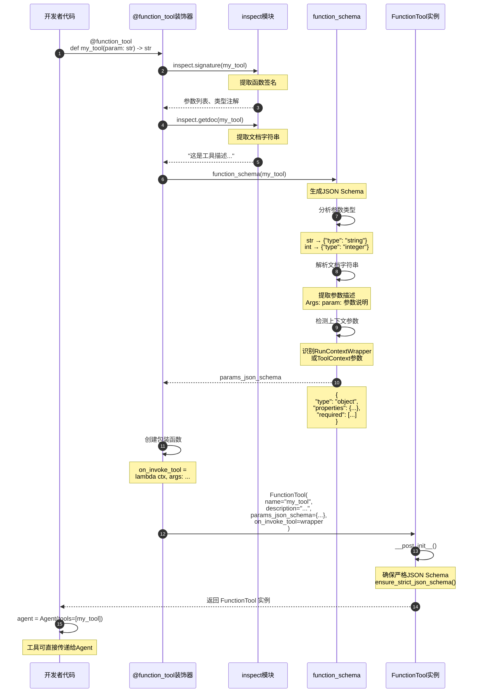
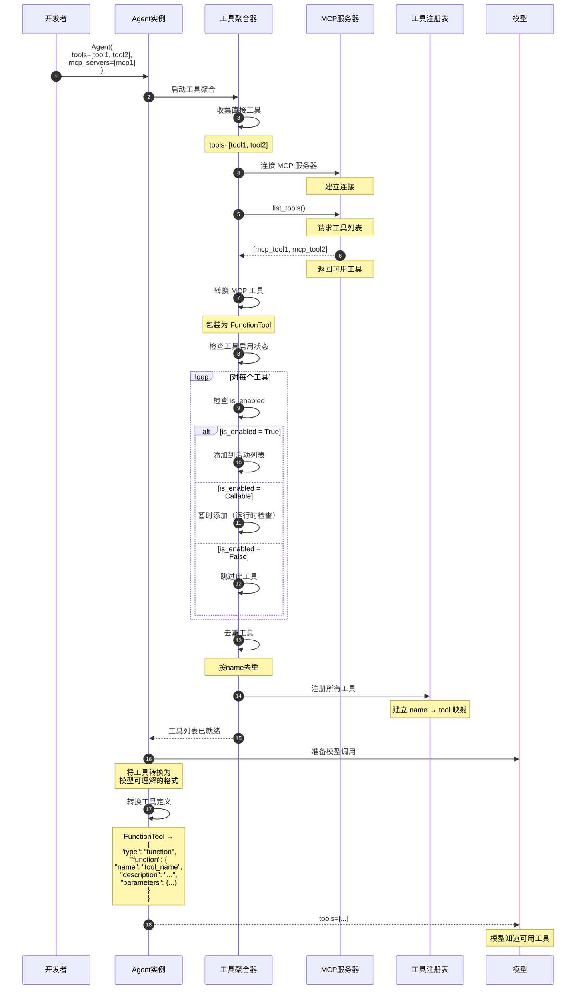
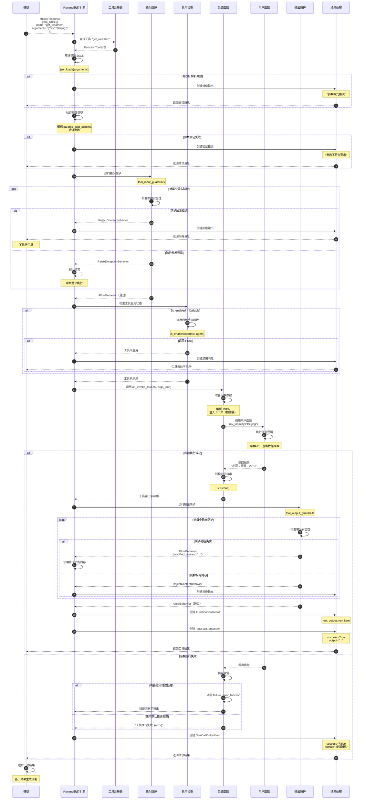
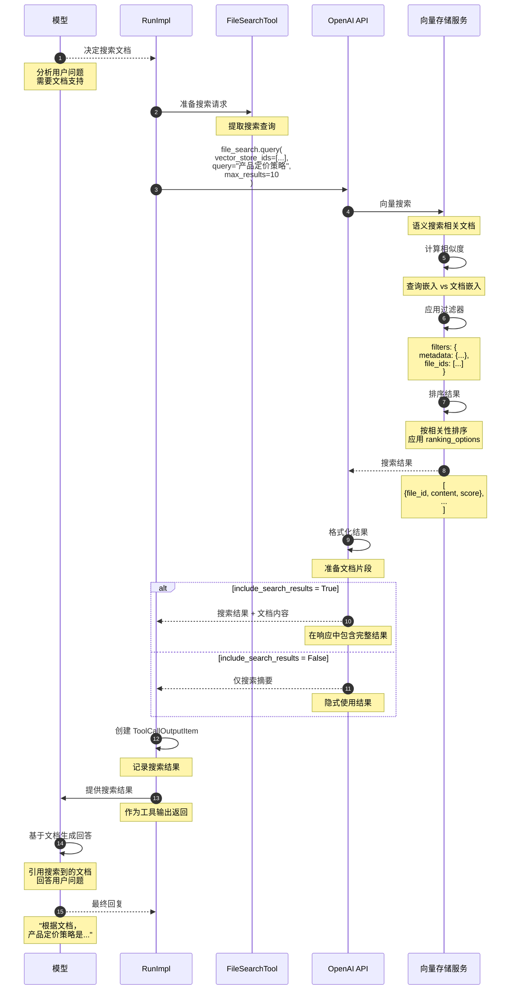
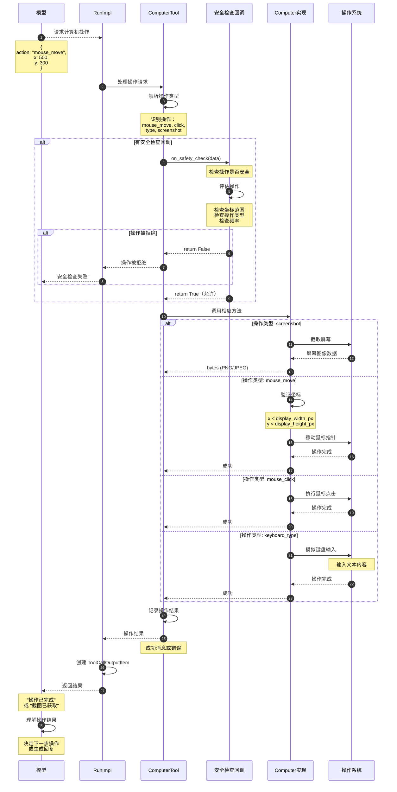
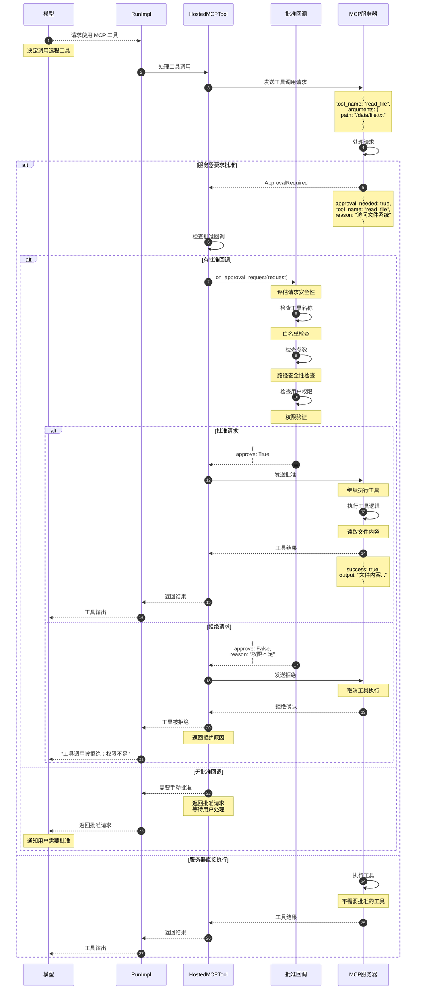
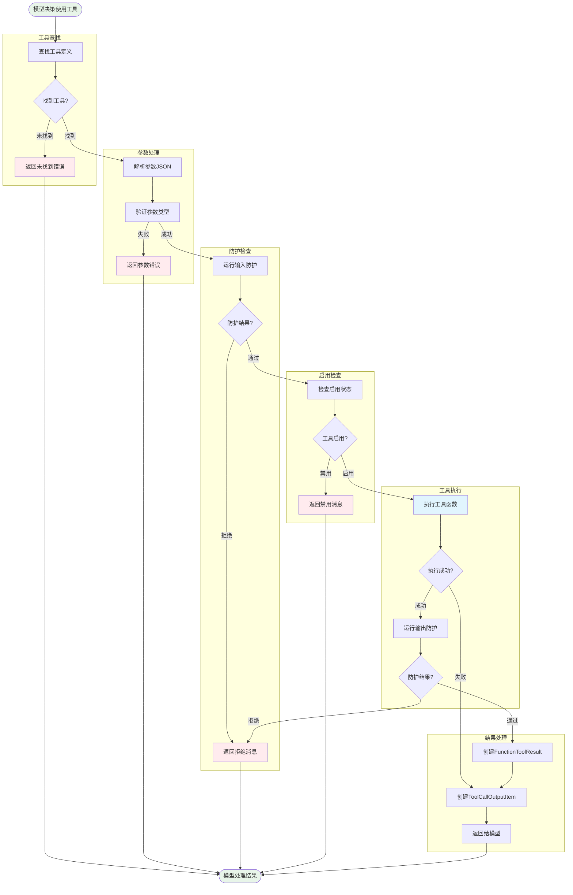

# OpenAI Agents Python SDK - Tools 模块时序图详解

## 1. 时序图总览

Tools 模块的时序图展示了工具从定义、注册到执行的完整生命周期，以及不同类型工具的执行流程和防护机制。

### 核心时序场景

| 场景类别 | 时序图 | 关键流程 |
|---------|--------|---------|
| **工具定义** | function_tool 装饰器流程 | 函数分析、Schema生成、工具创建 |
| **工具注册** | Agent 工具聚合流程 | 工具收集、去重、传递给模型 |
| **函数工具执行** | FunctionTool 调用流程 | 参数解析、防护检查、函数执行 |
| **托管工具执行** | FileSearchTool 调用流程 | 搜索请求、向量检索、结果返回 |
| **计算机工具执行** | ComputerTool 调用流程 | 操作请求、安全检查、执行操作 |
| **MCP工具执行** | HostedMCPTool 调用流程 | 工具列表、批准请求、远程执行 |

## 2. 工具定义时序图

### 场景：使用 function_tool 装饰器定义工具



**时序图说明：**

### 工具定义阶段

1. **函数签名分析（步骤 1-4）**：
   - 使用 `inspect` 模块提取函数签名
   - 获取参数名称、类型注解、默认值

2. **文档提取（步骤 5-7）**：
   - 提取函数的文档字符串
   - 用作工具描述

3. **Schema 生成（步骤 8-15）**：
   - 根据类型注解生成 JSON Schema
   - 解析文档字符串获取参数描述
   - 识别并过滤上下文参数

4. **包装函数创建（步骤 16-17）**：
   - 创建调用包装器
   - 处理参数解析和上下文注入

5. **工具实例化（步骤 18-21）**：
   - 创建 `FunctionTool` 实例
   - 应用严格 JSON Schema
   - 返回可用的工具

### 类型映射规则

**Python类型 → JSON Schema：**
```python
str        → {"type": "string"}
int        → {"type": "integer"}
float      → {"type": "number"}
bool       → {"type": "boolean"}
list[str]  → {"type": "array", "items": {"type": "string"}}
dict       → {"type": "object"}
str | None → {"type": ["string", "null"]}  # 可选参数
```

## 3. 工具注册时序图

### 场景：Agent 聚合和准备工具



**时序图说明：**

### 工具聚合流程

1. **直接工具收集（步骤 1-4）**：
   - 收集 `Agent(tools=[...])` 中的工具
   - 验证工具类型

2. **MCP 工具集成（步骤 5-11）**：
   - 连接 MCP 服务器
   - 列出远程工具
   - 转换为本地工具格式

3. **启用状态检查（步骤 12-20）**：
   - 检查每个工具的 `is_enabled`
   - 过滤禁用的工具
   - 保留动态启用的工具

4. **去重和注册（步骤 21-24）**：
   - 按工具名称去重
   - 注册到工具注册表

5. **模型格式转换（步骤 25-31）**：
   - 转换为模型 API 格式
   - 传递给模型

### 工具定义格式

**发送给模型的格式：**
```json
{
  "type": "function",
  "function": {
    "name": "get_weather",
    "description": "获取指定城市的天气信息",
    "parameters": {
      "type": "object",
      "properties": {
        "city": {
          "type": "string",
          "description": "城市名称"
        },
        "units": {
          "type": "string",
          "enum": ["celsius", "fahrenheit"],
          "description": "温度单位"
        }
      },
      "required": ["city"],
      "additionalProperties": false
    }
  }
}
```

## 4. FunctionTool 执行时序图

### 场景：完整的函数工具调用流程



**时序图说明：**

### 工具执行阶段

1. **参数处理（步骤 1-11）**：
   - 解析参数 JSON
   - 验证参数类型和格式
   - 处理解析或验证错误

2. **输入防护（步骤 12-23）**：
   - 运行所有输入防护
   - 处理拒绝或异常行为
   - 通过后继续执行

3. **启用检查（步骤 24-32）**：
   - 检查工具启用状态
   - 动态启用检查
   - 处理禁用情况

4. **函数执行（步骤 33-43）**：
   - 准备函数参数
   - 注入上下文（如需要）
   - 调用实际函数
   - 执行业务逻辑

5. **输出防护（步骤 44-56）**：
   - 运行所有输出防护
   - 处理内容修改或拒绝
   - 通过后返回结果

6. **结果封装（步骤 57-66）**：
   - 创建工具结果对象
   - 创建运行项
   - 返回给模型

### 错误处理路径

**参数错误：**
```
JSON 解析失败 → 错误消息 → 返回模型
参数验证失败 → 错误消息 → 返回模型
```

**防护拒绝：**
```
输入防护拒绝 → 拒绝消息 → 返回模型（不执行）
输出防护拒绝 → 拒绝消息 → 返回模型
```

**执行异常：**
```
函数抛出异常 → 捕获并转换 → 错误结果 → 返回模型
防护抛出异常 → 传播异常 → 中断整个执行
```

## 5. FileSearchTool 执行时序图

### 场景：托管文件搜索工具调用



**时序图说明：**

### 文件搜索流程

1. **搜索决策（步骤 1-3）**：
   - 模型判断需要搜索文档
   - 准备搜索查询

2. **向量搜索（步骤 4-11）**：
   - 调用 OpenAI API
   - 向量存储进行语义搜索
   - 计算查询与文档的相似度

3. **结果过滤和排序（步骤 12-15）**：
   - 应用元数据过滤器
   - 按相关性排序
   - 限制结果数量

4. **结果返回（步骤 16-24）**：
   - 格式化搜索结果
   - 根据配置返回内容
   - 模型基于结果生成回答

### 搜索配置影响

**max_num_results：**
- 控制返回结果数量
- 影响上下文大小和精确度

**include_search_results：**
- `True`：在输出中包含完整结果
- `False`：隐式使用，不显示给用户

**ranking_options：**
- 自定义排序算法
- 设置相关性阈值

## 6. ComputerTool 执行时序图

### 场景：计算机控制工具执行操作



**时序图说明：**

### 计算机操作流程

1. **操作解析（步骤 1-4）**：
   - 模型请求计算机操作
   - 解析操作类型和参数

2. **安全检查（步骤 5-14）**：
   - 调用安全检查回调
   - 评估操作的安全性
   - 拒绝危险操作

3. **操作执行（步骤 15-34）**：
   - 根据操作类型调用相应方法
   - 与操作系统交互
   - 返回操作结果

4. **结果处理（步骤 35-40）**：
   - 记录操作日志
   - 创建运行项
   - 返回给模型

### 支持的操作类型

**鼠标操作：**
- `mouse_move(x, y)`: 移动鼠标
- `mouse_click(button)`: 点击鼠标
- `mouse_drag(from_x, from_y, to_x, to_y)`: 拖动

**键盘操作：**
- `keyboard_type(text)`: 输入文本
- `keyboard_press(key)`: 按键

**屏幕操作：**
- `screenshot()`: 截取屏幕
- `screenshot_region(x, y, width, height)`: 区域截图

## 7. HostedMCPTool 执行时序图

### 场景：托管 MCP 工具调用和批准流程



**时序图说明：**

### MCP 工具调用流程

1. **请求发送（步骤 1-4）**：
   - 模型请求 MCP 工具
   - 发送到远程服务器

2. **批准检查（步骤 5-13）**：
   - 服务器判断是否需要批准
   - 返回批准请求

3. **批准决策（步骤 14-30）**：
   - 调用批准回调
   - 评估请求安全性
   - 做出批准或拒绝决定

4. **工具执行（步骤 31-42）**：
   - 批准后执行工具
   - 拒绝则取消执行
   - 返回结果或错误

### 批准决策逻辑

**自动批准：**
```python
# 白名单工具
whitelist = ["read_file", "list_directory"]
if tool_name in whitelist:
    return {"approve": True}
```

**条件批准：**
```python
# 检查路径安全性
if "path" in arguments:
    if is_safe_path(arguments["path"]):
        return {"approve": True}
    else:
        return {"approve": False, "reason": "路径不安全"}
```

**需要人工批准：**
```python
# 敏感操作
sensitive_tools = ["delete_file", "modify_config"]
if tool_name in sensitive_tools:
    # 不提供批准回调，需要用户手动批准
    return None
```

## 8. 工具执行流程总览



Tools 模块通过精心设计的时序流程和完善的防护机制，为 OpenAI Agents 提供了安全、可靠的工具执行能力，支持从简单函数调用到复杂系统集成的各种应用场景。

