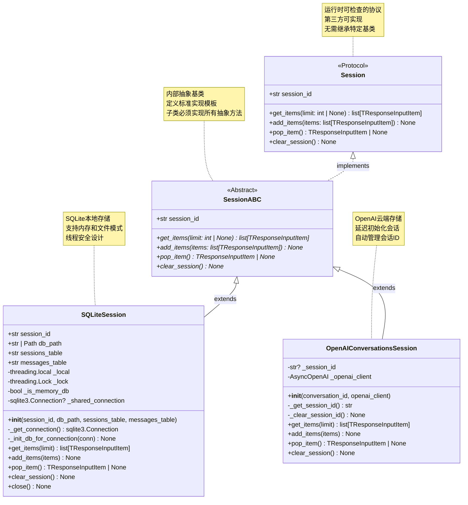
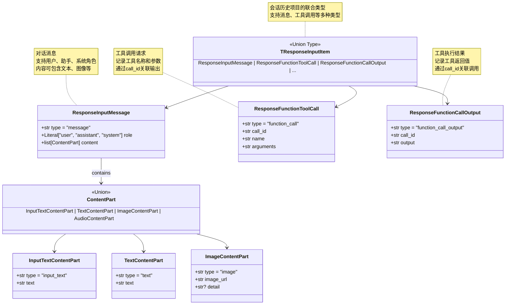
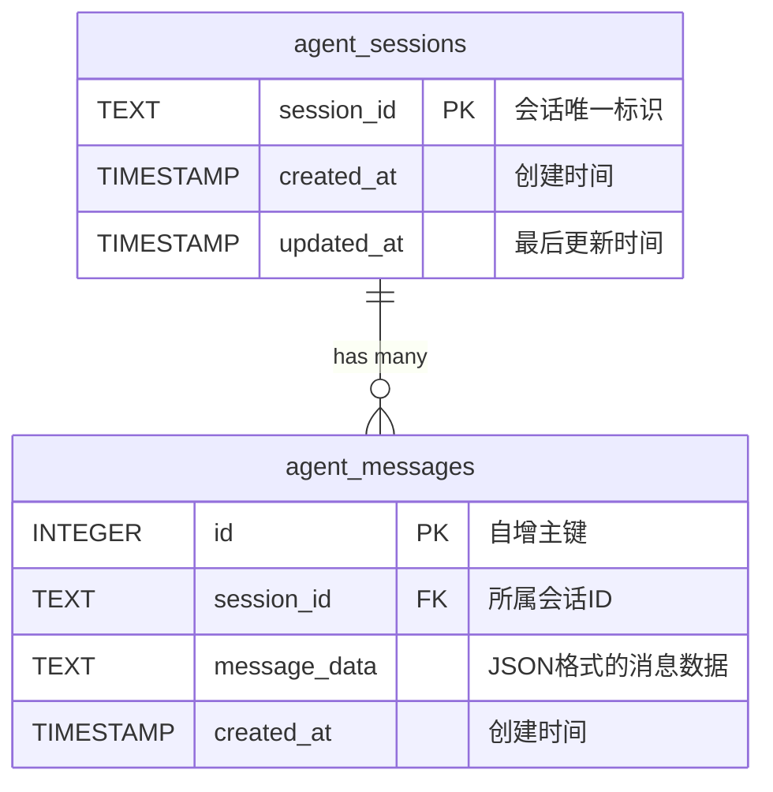
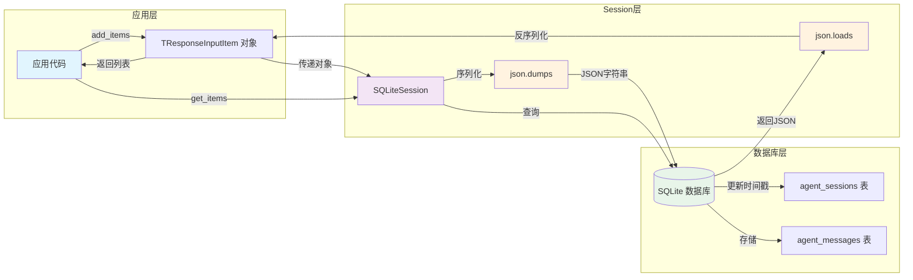

# OpenAI Agents Python SDK - Memory 模块数据结构详解

## 1. 核心数据结构总览

Memory 模块的数据结构设计遵循分层原则，从协议定义到具体实现，从抽象接口到数据存储格式，确保灵活性和可扩展性。

### 数据结构层次

```
Session Protocol (协议层)
    ├── SessionABC (抽象基类)
    │   ├── SQLiteSession (SQLite实现)
    │   └── OpenAIConversationsSession (云端实现)
    └── TResponseInputItem (历史数据格式)
        ├── ResponseInputMessage (消息类型)
        ├── ResponseFunctionToolCall (工具调用)
        ├── ResponseFunctionCallOutput (工具输出)
        └── 其他运行项类型
```

## 2. 协议与抽象类

### 2.1 Session 协议 UML



**类图说明：**

### Session 协议特性

1. **协议定义**：使用 `@runtime_checkable` 装饰器，支持运行时的鸭子类型检查
2. **灵活扩展**：第三方可实现协议而无需继承 `SessionABC`
3. **类型检查**：通过 `Protocol` 提供静态类型检查
4. **最小接口**：只定义必需的4个方法和1个属性

### SessionABC 抽象基类

1. **模板方法**：为内部实现提供标准模板
2. **强制实现**：子类必须实现所有抽象方法
3. **内部使用**：主要用于 SDK 内部的实现
4. **文档化**：提供详细的文档字符串

### SQLiteSession 实现特性

1. **双模式支持**：内存数据库（临时）和文件数据库（持久化）
2. **线程安全**：内存模式使用共享连接+锁，文件模式使用线程本地连接
3. **资源管理**：显式的 `close()` 方法管理数据库连接
4. **性能优化**：WAL 模式、批量插入、索引优化

### OpenAIConversationsSession 实现特性

1. **云端存储**：数据存储在 OpenAI 服务器
2. **延迟初始化**：会话 ID 在首次使用时创建
3. **无本地资源**：不需要本地数据库或文件系统
4. **跨设备同步**：同一会话 ID 可在多个设备访问

## 3. 历史数据结构

### 3.1 TResponseInputItem 联合类型



**数据结构说明：**

### ResponseInputMessage 结构

**字段详解：**
- `type`: 固定值 `"message"`，标识这是一条消息
- `role`: 消息角色，可选值：
  - `"user"`: 用户消息
  - `"assistant"`: 助手消息
  - `"system"`: 系统消息（指令）
- `content`: 内容列表，支持多种内容类型

**JSON 示例：**
```json
{
    "type": "message",
    "role": "user",
    "content": [
        {
            "type": "input_text",
            "text": "请帮我总结这篇文章的要点。"
        }
    ]
}
```

### ContentPart 内容类型

**InputTextContentPart（用户输入文本）：**
```json
{
    "type": "input_text",
    "text": "这是用户输入的文本内容"
}
```

**TextContentPart（助手输出文本）：**
```json
{
    "type": "text",
    "text": "这是助手回复的文本内容"
}
```

**ImageContentPart（图像内容）：**
```json
{
    "type": "image",
    "image_url": "https://example.com/image.jpg",
    "detail": "high"  // 可选：high, low, auto
}
```

**AudioContentPart（音频内容）：**
```json
{
    "type": "audio",
    "audio_url": "https://example.com/audio.mp3",
    "transcript": "音频的转录文本"  // 可选
}
```

### ResponseFunctionToolCall 结构

**字段详解：**
- `type`: 固定值 `"function_call"`，标识这是一个工具调用
- `call_id`: 唯一的调用标识符，用于关联工具输出
- `name`: 工具函数名称
- `arguments`: JSON 字符串格式的参数

**JSON 示例：**
```json
{
    "type": "function_call",
    "call_id": "call_abc123xyz",
    "name": "get_weather",
    "arguments": "{\"location\": \"Beijing\", \"unit\": \"celsius\"}"
}
```

### ResponseFunctionCallOutput 结构

**字段详解：**
- `type`: 固定值 `"function_call_output"`，标识这是工具输出
- `call_id`: 对应的工具调用 ID，必须与 `ResponseFunctionToolCall` 的 `call_id` 匹配
- `output`: JSON 字符串格式的输出结果

**JSON 示例：**
```json
{
    "type": "function_call_output",
    "call_id": "call_abc123xyz",
    "output": "{\"temperature\": 22, \"condition\": \"cloudy\", \"humidity\": 65}"
}
```

## 4. SQLite 数据库结构

### 4.1 数据库表 UML



**表结构说明：**

### agent_sessions 表

**表定义：**
```sql
CREATE TABLE agent_sessions (
    session_id TEXT PRIMARY KEY,
    created_at TIMESTAMP DEFAULT CURRENT_TIMESTAMP,
    updated_at TIMESTAMP DEFAULT CURRENT_TIMESTAMP
);
```

**字段详解：**

| 字段名 | 类型 | 约束 | 说明 |
|--------|------|------|------|
| `session_id` | TEXT | PRIMARY KEY | 会话唯一标识符，由应用层生成 |
| `created_at` | TIMESTAMP | DEFAULT CURRENT_TIMESTAMP | 会话创建时间，自动设置 |
| `updated_at` | TIMESTAMP | DEFAULT CURRENT_TIMESTAMP | 最后更新时间，每次添加消息时更新 |

**数据示例：**
```
session_id                  | created_at           | updated_at
----------------------------|----------------------|----------------------
user_123_session            | 2024-10-04 10:00:00 | 2024-10-04 10:15:30
temp_session_001            | 2024-10-04 10:05:00 | 2024-10-04 10:05:00
customer_support_abc123     | 2024-10-04 09:30:00 | 2024-10-04 10:20:00
```

### agent_messages 表

**表定义：**
```sql
CREATE TABLE agent_messages (
    id INTEGER PRIMARY KEY AUTOINCREMENT,
    session_id TEXT NOT NULL,
    message_data TEXT NOT NULL,
    created_at TIMESTAMP DEFAULT CURRENT_TIMESTAMP,
    FOREIGN KEY (session_id) REFERENCES agent_sessions (session_id)
        ON DELETE CASCADE
);

CREATE INDEX idx_agent_messages_session_id
    ON agent_messages (session_id, created_at);
```

**字段详解：**

| 字段名 | 类型 | 约束 | 说明 |
|--------|------|------|------|
| `id` | INTEGER | PRIMARY KEY AUTOINCREMENT | 消息唯一ID，自增 |
| `session_id` | TEXT | NOT NULL, FOREIGN KEY | 所属会话ID，级联删除 |
| `message_data` | TEXT | NOT NULL | JSON 格式的消息完整数据 |
| `created_at` | TIMESTAMP | DEFAULT CURRENT_TIMESTAMP | 消息创建时间 |

**索引设计：**
- **复合索引** `(session_id, created_at)`：加速按会话查询和时间排序

**数据示例：**
```
id | session_id           | message_data                                      | created_at
---|----------------------|--------------------------------------------------|----------------------
1  | user_123_session     | {"type":"message","role":"user",...}             | 2024-10-04 10:00:00
2  | user_123_session     | {"type":"message","role":"assistant",...}        | 2024-10-04 10:00:05
3  | user_123_session     | {"type":"function_call","call_id":"call_1",...}  | 2024-10-04 10:00:10
4  | user_123_session     | {"type":"function_call_output","call_id":...}    | 2024-10-04 10:00:15
```

**message_data JSON 示例：**
```json
{
    "type": "message",
    "role": "user",
    "content": [
        {
            "type": "input_text",
            "text": "今天天气怎么样？"
        }
    ]
}
```

### 4.2 数据库操作数据流



## 5. 内部数据结构

### 5.1 SQLiteSession 内部属性

```python
class SQLiteSession(SessionABC):
    """SQLiteSession 完整的内部结构"""
    
    # === 公共属性 ===
    session_id: str              # 会话唯一标识符
    db_path: str | Path          # 数据库路径（":memory:" 或文件路径）
    sessions_table: str          # 会话表名（默认 "agent_sessions"）
    messages_table: str          # 消息表名（默认 "agent_messages"）
    
    # === 私有属性 ===
    _local: threading.local      # 线程本地存储（文件模式）
    _lock: threading.Lock        # 全局锁（内存模式）
    _is_memory_db: bool         # 是否为内存数据库
    _shared_connection: sqlite3.Connection | None  # 共享连接（内存模式）
```

**属性说明：**

**session_id**：
- 类型：`str`
- 用途：唯一标识一个会话
- 命名建议：`"user_{user_id}_session"` 或 `"session_{uuid}"`
- 示例：`"user_123_session"`, `"temp_session_001"`

**db_path**：
- 类型：`str | Path`
- 用途：指定 SQLite 数据库位置
- 特殊值：`":memory:"` 表示内存数据库
- 文件路径示例：`"./data/conversations.db"`, `"/var/app/sessions.db"`

**sessions_table / messages_table**：
- 类型：`str`
- 用途：自定义表名，避免与现有表冲突
- 默认值：`"agent_sessions"`, `"agent_messages"`
- 使用场景：共享数据库时区分不同应用的数据

**_local**：
- 类型：`threading.local`
- 用途：为每个线程维护独立的数据库连接（文件模式）
- 属性：`_local.connection` 存储当前线程的连接对象
- 线程安全：每个线程有独立连接，避免并发冲突

**_lock**：
- 类型：`threading.Lock`
- 用途：保护共享连接的并发访问（内存模式）
- 使用场景：内存数据库使用单一共享连接，需要锁保护

**_is_memory_db**：
- 类型：`bool`
- 用途：标识当前使用的数据库模式
- `True`：内存模式，使用共享连接+锁
- `False`：文件模式，使用线程本地连接

**_shared_connection**：
- 类型：`sqlite3.Connection | None`
- 用途：内存数据库的共享连接对象
- 生命周期：在 `__init__` 中创建，在 `close()` 中关闭
- 线程安全：通过 `_lock` 保护并发访问

### 5.2 OpenAIConversationsSession 内部属性

```python
class OpenAIConversationsSession(SessionABC):
    """OpenAIConversationsSession 完整的内部结构"""
    
    # === 私有属性 ===
    _session_id: str | None           # 会话ID（延迟初始化）
    _openai_client: AsyncOpenAI       # OpenAI 异步客户端
```

**属性说明：**

**_session_id**：
- 类型：`str | None`
- 初始值：`None`（延迟初始化）
- 初始化时机：首次调用 `_get_session_id()` 时
- 值来源：调用 OpenAI API 创建会话获得
- 格式示例：`"conv_abc123xyz456"`

**_openai_client**：
- 类型：`AsyncOpenAI`
- 用途：与 OpenAI API 交互的客户端
- 初始化：构造函数中传入或使用默认客户端
- API 调用：
  - `conversations.create()`: 创建新会话
  - `conversations.items.list()`: 列出历史
  - `conversations.items.create()`: 添加项目
  - `conversations.items.delete()`: 删除项目
  - `conversations.delete()`: 删除会话

## 6. 数据序列化与反序列化

### 6.1 序列化流程

```python
# 应用层数据结构
user_message = {
    "type": "message",
    "role": "user",
    "content": [
        {
            "type": "input_text",
            "text": "Hello, world!"
        }
    ]
}

# 序列化为 JSON 字符串
import json
json_string = json.dumps(user_message)
# 结果: '{"type":"message","role":"user","content":[{"type":"input_text","text":"Hello, world!"}]}'

# 存储到数据库
conn.execute(
    "INSERT INTO agent_messages (session_id, message_data) VALUES (?, ?)",
    (session_id, json_string)
)
```

**序列化特点：**
1. **完整保留**：保留所有字段和嵌套结构
2. **类型安全**：通过 JSON 确保数据类型一致性
3. **可读性**：JSON 格式易于调试和查看
4. **兼容性**：跨语言和跨平台兼容

### 6.2 反序列化流程

```python
# 从数据库查询
cursor = conn.execute(
    "SELECT message_data FROM agent_messages WHERE session_id = ? ORDER BY created_at",
    (session_id,)
)

# 反序列化每一行
items = []
for (message_data,) in cursor.fetchall():
    try:
        item = json.loads(message_data)
        items.append(item)
    except json.JSONDecodeError:
        # 跳过损坏的数据
        continue

# items 现在是 list[TResponseInputItem]
```

**反序列化特点：**
1. **错误容忍**：单条数据损坏不影响其他数据
2. **类型恢复**：JSON 反序列化自动恢复 Python 数据类型
3. **顺序保证**：通过 `ORDER BY created_at` 保证时间顺序
4. **性能优化**：批量查询+批量反序列化

### 6.3 数据完整性保证

**写入完整性：**
```python
# 使用事务确保原子性
with conn:
    conn.execute("INSERT INTO agent_sessions ...")
    conn.executemany("INSERT INTO agent_messages ...", message_data)
    conn.execute("UPDATE agent_sessions SET updated_at = ...")
# 事务自动提交或回滚
```

**读取完整性：**
```python
# 使用外键约束确保数据一致性
FOREIGN KEY (session_id) REFERENCES agent_sessions (session_id)
    ON DELETE CASCADE

# 查询时自动过滤不存在的会话
SELECT m.* FROM agent_messages m
JOIN agent_sessions s ON m.session_id = s.session_id
WHERE s.session_id = ?
```

## 7. 数据结构最佳实践

### 7.1 自定义会话实现

```python
from agents.memory import Session, TResponseInputItem
from typing import List
import redis.asyncio as aioredis
import json

class RedisSession(Session):
    """基于 Redis 的会话实现示例"""
    
    def __init__(self, session_id: str, redis_url: str = "redis://localhost"):
        self.session_id = session_id
        self._redis_url = redis_url
        self._redis: aioredis.Redis | None = None
        self._history_key = f"agent:session:{session_id}:history"
    
    async def _get_redis(self) -> aioredis.Redis:
        """获取 Redis 连接"""
        if self._redis is None:
            self._redis = await aioredis.from_url(self._redis_url)
        return self._redis
    
    async def get_items(self, limit: int | None = None) -> List[TResponseInputItem]:
        """从 Redis 列表中获取历史"""
        redis = await self._get_redis()
        
        if limit is None:
            # 获取所有历史
            items_json = await redis.lrange(self._history_key, 0, -1)
        else:
            # 获取最新的 N 条
            items_json = await redis.lrange(self._history_key, -limit, -1)
        
        items = []
        for item_json in items_json:
            try:
                item = json.loads(item_json)
                items.append(item)
            except json.JSONDecodeError:
                continue
        
        return items
    
    async def add_items(self, items: List[TResponseInputItem]) -> None:
        """添加项目到 Redis 列表"""
        if not items:
            return
        
        redis = await self._get_redis()
        
        # 使用 pipeline 批量添加
        pipe = redis.pipeline()
        for item in items:
            item_json = json.dumps(item)
            pipe.rpush(self._history_key, item_json)
        
        await pipe.execute()
    
    async def pop_item(self) -> TResponseInputItem | None:
        """从 Redis 列表删除最新项"""
        redis = await self._get_redis()
        
        item_json = await redis.rpop(self._history_key)
        if item_json is None:
            return None
        
        try:
            return json.loads(item_json)
        except json.JSONDecodeError:
            return None
    
    async def clear_session(self) -> None:
        """删除 Redis 键"""
        redis = await self._get_redis()
        await redis.delete(self._history_key)
    
    async def close(self):
        """关闭 Redis 连接"""
        if self._redis:
            await self._redis.close()
```

### 7.2 历史数据结构转换

```python
from agents.memory import Session
from typing import List, Dict, Any

class HistoryConverter:
    """历史数据结构转换工具"""
    
    @staticmethod
    def items_to_messages(items: List[TResponseInputItem]) -> List[Dict[str, Any]]:
        """将历史项转换为消息列表（用于展示）"""
        messages = []
        
        for item in items:
            if item["type"] == "message":
                # 提取消息内容
                role = item["role"]
                text = ""
                for content_part in item["content"]:
                    if content_part["type"] in ["text", "input_text"]:
                        text += content_part["text"]
                
                messages.append({
                    "role": role,
                    "content": text
                })
            
            elif item["type"] == "function_call":
                # 工具调用显示
                messages.append({
                    "role": "system",
                    "content": f"[工具调用: {item['name']}]"
                })
            
            elif item["type"] == "function_call_output":
                # 工具输出显示
                messages.append({
                    "role": "system",
                    "content": f"[工具结果: {item['output'][:100]}...]"
                })
        
        return messages
    
    @staticmethod
    async def export_session_to_json(session: Session, output_file: str):
        """导出会话历史到 JSON 文件"""
        items = await session.get_items()
        
        export_data = {
            "session_id": session.session_id,
            "item_count": len(items),
            "items": items
        }
        
        with open(output_file, "w", encoding="utf-8") as f:
            json.dump(export_data, f, indent=2, ensure_ascii=False)
    
    @staticmethod
    async def import_session_from_json(session: Session, input_file: str):
        """从 JSON 文件导入会话历史"""
        with open(input_file, "r", encoding="utf-8") as f:
            data = json.load(f)
        
        items = data["items"]
        await session.clear_session()
        await session.add_items(items)
```

### 7.3 历史数据压缩

```python
from agents.memory import Session
from typing import List

class HistoryCompressor:
    """历史数据压缩工具"""
    
    @staticmethod
    async def compress_history(
        session: Session,
        target_count: int = 20,
        preserve_system: bool = True
    ):
        """压缩历史，保留最重要的项目"""
        items = await session.get_items()
        
        if len(items) <= target_count:
            return  # 无需压缩
        
        # 1. 分离系统消息
        system_messages = []
        other_items = []
        
        for item in items:
            if preserve_system and item.get("role") == "system":
                system_messages.append(item)
            else:
                other_items.append(item)
        
        # 2. 保留最新的项目
        keep_count = target_count - len(system_messages)
        recent_items = other_items[-keep_count:] if keep_count > 0 else []
        
        # 3. 重建历史
        compressed_items = system_messages + recent_items
        
        await session.clear_session()
        await session.add_items(compressed_items)
        
        print(f"历史已压缩: {len(items)} -> {len(compressed_items)}")
```

Memory 模块通过清晰的数据结构设计和灵活的存储方案，为 OpenAI Agents 提供了强大的会话历史管理能力，支持从本地到云端的多种应用场景。

