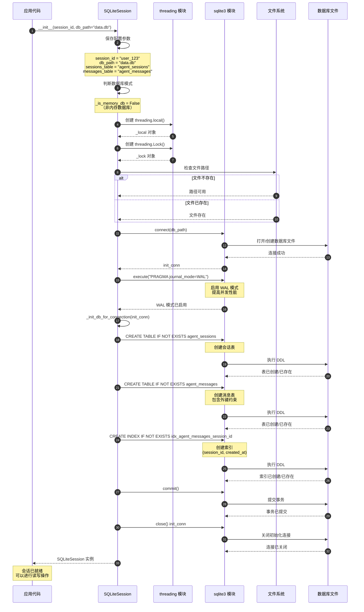
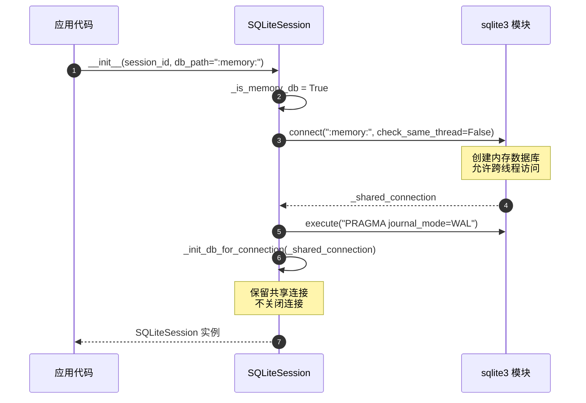
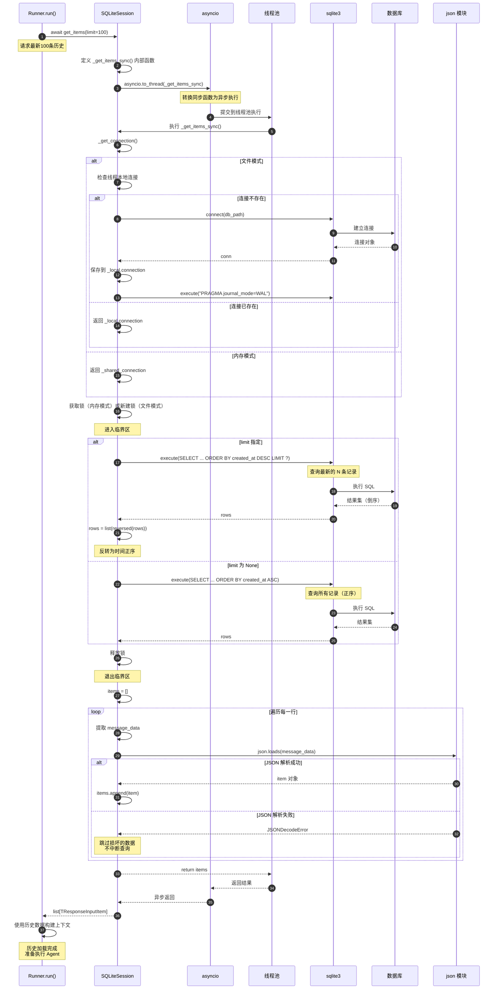
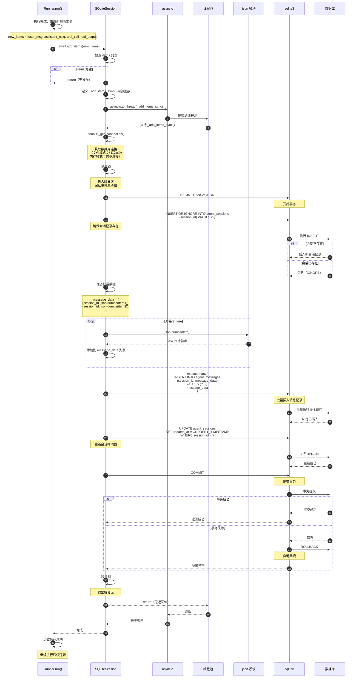
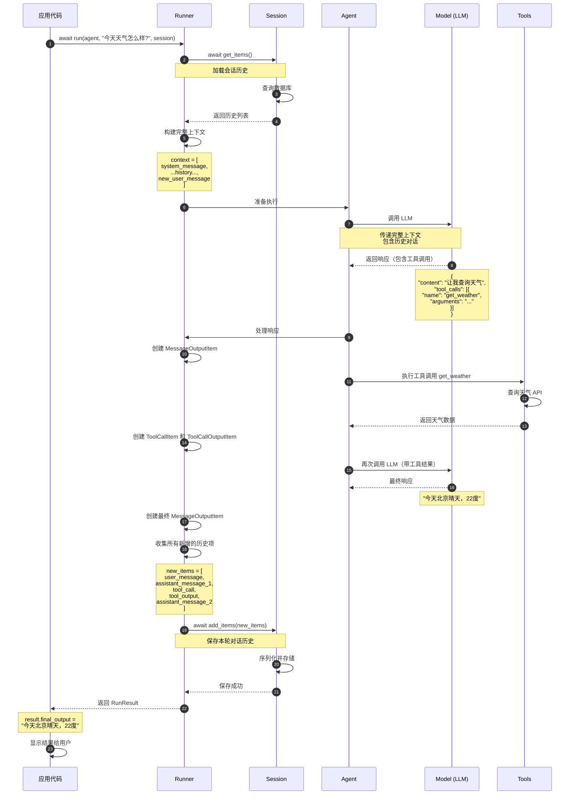
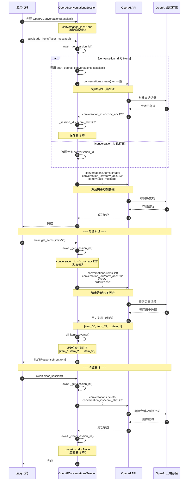
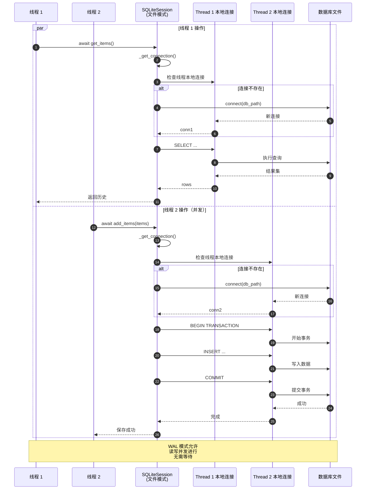

# OpenAI Agents Python SDK - Memory 模块时序图详解

## 1. 时序图总览

Memory 模块的时序图展示了会话历史管理的完整生命周期，从初始化、数据读写到资源清理的各个阶段，以及与 Agent 执行引擎的交互流程。

### 核心时序场景

| 场景类别 | 时序图 | 关键流程 |
|---------|--------|---------|
| **会话初始化** | SQLiteSession 初始化 | 数据库连接、表结构创建 |
| **历史加载** | get_items 查询流程 | SQL 查询、JSON 反序列化、数据返回 |
| **历史保存** | add_items 写入流程 | JSON 序列化、事务提交、时间戳更新 |
| **历史删除** | pop_item 删除流程 | 原子删除、数据返回 |
| **会话清空** | clear_session 清理流程 | 级联删除、资源释放 |
| **与 Agent 集成** | Runner + Session 交互 | 历史加载、执行、结果保存 |
| **云端会话** | OpenAI Conversations 流程 | API 调用、云端存储 |

## 2. SQLiteSession 初始化时序图

### 场景：创建持久化 SQLite 会话



**时序图说明：**

### 初始化阶段划分

1. **参数配置阶段（步骤 1-5）**：
   - 接收初始化参数
   - 判断数据库模式（内存/文件）
   - 创建线程安全机制（锁和本地存储）

2. **数据库连接阶段（步骤 6-11）**：
   - 检查文件路径可用性
   - 打开或创建数据库文件
   - 启用 WAL 模式提升并发性能

3. **表结构初始化阶段（步骤 12-20）**：
   - 创建会话元数据表
   - 创建消息数据表（带外键）
   - 创建查询索引
   - 提交数据库结构

4. **清理阶段（步骤 21-23）**：
   - 关闭初始化连接
   - 返回可用的会话实例

### 关键设计点

1. **延迟连接**：初始化时不保留连接，实际操作时创建线程本地连接
2. **幂等性**：使用 `IF NOT EXISTS` 确保重复初始化不会出错
3. **WAL 模式**：提高并发读写性能，允许读写同时进行
4. **索引优化**：复合索引 `(session_id, created_at)` 加速查询

### 内存模式差异

**内存模式初始化（db_path=":memory:"）：**


**内存模式关键差异：**
- 使用共享连接（`_shared_connection`）而非线程本地连接
- 连接在初始化时创建并保留，直到调用 `close()`
- 需要使用全局锁（`_lock`）保护并发访问

## 3. get_items - 历史查询时序图

### 场景：加载会话历史用于 Agent 执行



**时序图说明：**

### 查询流程阶段

1. **异步转换阶段（步骤 1-5）**：
   - Runner 调用异步 `get_items()`
   - 使用 `asyncio.to_thread()` 包装同步操作
   - 提交到线程池执行，避免阻塞事件循环

2. **连接获取阶段（步骤 6-14）**：
   - 获取适当的数据库连接
   - 文件模式：获取或创建线程本地连接
   - 内存模式：使用共享连接

3. **SQL 查询阶段（步骤 15-27）**：
   - 根据 `limit` 参数选择查询策略
   - 执行 SQL 查询
   - 处理查询结果的顺序

4. **数据反序列化阶段（步骤 28-38）**：
   - 遍历查询结果
   - JSON 反序列化每一行
   - 错误容忍：跳过损坏的数据

5. **结果返回阶段（步骤 39-42）**：
   - 从线程池返回结果
   - 通过 asyncio 转换为异步返回
   - Runner 接收历史数据

### 查询性能优化

**索引利用：**
```sql
-- 索引定义
CREATE INDEX idx_agent_messages_session_id
    ON agent_messages (session_id, created_at);

-- 查询计划（limit 指定时）
EXPLAIN QUERY PLAN
SELECT message_data FROM agent_messages
WHERE session_id = ?
ORDER BY created_at DESC
LIMIT 100;

-- 结果：使用索引扫描
SEARCH agent_messages USING INDEX idx_agent_messages_session_id (session_id=?)
```

**批量反序列化：**
- 一次性获取所有行，减少数据库交互
- 在内存中批量反序列化，提升效率
- 错误跳过机制保证健壮性

## 4. add_items - 历史保存时序图

### 场景：执行完成后保存对话历史



**时序图说明：**

### 写入流程阶段

1. **预处理阶段（步骤 1-7）**：
   - Runner 准备要保存的历史项
   - 检查列表是否为空（快速路径）
   - 异步转换并提交到线程池

2. **连接与锁获取阶段（步骤 8-10）**：
   - 获取数据库连接
   - 获取锁保证事务原子性
   - 开始数据库事务

3. **会话确保阶段（步骤 11-16）**：
   - 使用 `INSERT OR IGNORE` 确保会话存在
   - 避免外键约束错误

4. **数据序列化阶段（步骤 17-22）**：
   - 批量序列化所有历史项为 JSON
   - 准备批量插入的数据

5. **批量插入阶段（步骤 23-26）**：
   - 使用 `executemany()` 批量插入
   - 提升插入性能

6. **时间戳更新阶段（步骤 27-29）**：
   - 更新会话的最后更新时间
   - 用于会话管理和查询

7. **事务提交阶段（步骤 30-39）**：
   - 提交事务
   - 失败时自动回滚
   - 释放锁并返回结果

### 事务原子性保证

**成功场景：**
```
BEGIN TRANSACTION
  → INSERT OR IGNORE sessions
  → INSERT messages (批量)
  → UPDATE sessions timestamp
COMMIT
  → 所有操作生效
```

**失败场景：**
```
BEGIN TRANSACTION
  → INSERT OR IGNORE sessions (成功)
  → INSERT messages (失败，如磁盘满)
ROLLBACK
  → 所有操作回滚，数据保持一致
```

### 批量插入性能

**单条插入（低效）：**
```python
for item in items:
    conn.execute("INSERT INTO messages VALUES (?, ?)", 
                 (session_id, json.dumps(item)))
    conn.commit()  # 每次都提交
# 时间复杂度：O(n * (序列化 + SQL + 磁盘I/O + 提交))
```

**批量插入（高效）：**
```python
message_data = [(session_id, json.dumps(item)) for item in items]
conn.executemany("INSERT INTO messages VALUES (?, ?)", message_data)
conn.commit()  # 一次提交
# 时间复杂度：O(n * 序列化 + SQL批处理 + 一次磁盘I/O + 一次提交)
```

## 5. Runner 与 Session 集成时序图

### 场景：完整的对话执行流程（带历史管理）



**时序图说明：**

### 完整执行流程

1. **历史加载阶段（步骤 1-4）**：
   - Runner 启动时从 Session 加载历史
   - 历史用于构建 LLM 的上下文
   - 确保对话连贯性

2. **上下文构建阶段（步骤 5）**：
   - 系统消息（Agent 指令）
   - 历史对话记录
   - 新的用户消息
   - 按时间顺序组织

3. **LLM 交互阶段（步骤 6-10）**：
   - 调用 LLM 生成响应
   - LLM 基于完整历史生成回复
   - 可能包含工具调用请求

4. **工具执行阶段（步骤 11-15）**：
   - 执行工具调用
   - 获取工具结果
   - 创建工具相关的历史项

5. **最终响应阶段（步骤 16-18）**：
   - 带工具结果再次调用 LLM
   - 生成最终用户可见的回复
   - 创建最终响应历史项

6. **历史保存阶段（步骤 19-22）**：
   - 收集本轮所有新增历史
   - 批量保存到 Session
   - 确保数据持久化

7. **结果返回阶段（步骤 23-25）**：
   - 返回执行结果给应用
   - 应用展示给用户
   - 准备下一轮对话

### 历史在对话中的作用

**第一轮对话（无历史）：**
```
Context = [
  {role: "system", content: "你是一个天气助手"},
  {role: "user", content: "今天天气怎么样?"}
]
```

**第二轮对话（有历史）：**
```
Context = [
  {role: "system", content: "你是一个天气助手"},
  {role: "user", content: "今天天气怎么样?"},
  {role: "assistant", content: "今天北京晴天，22度"},
  {role: "user", content: "那明天呢?"}  // 新消息
]

LLM 理解 "明天" 是基于上一轮的 "今天北京" 的上下文
```

## 6. OpenAI Conversations 云端会话时序图

### 场景：使用 OpenAI 云端存储的会话管理



**时序图说明：**

### 云端会话特点

1. **延迟初始化（步骤 1-12）**：
   - 创建实例时不立即创建云端会话
   - 首次使用时才调用 API 创建会话
   - 节省不必要的 API 调用

2. **云端存储（步骤 13-18）**：
   - 所有数据存储在 OpenAI 服务器
   - 无本地数据库或文件
   - 自动处理数据持久化和备份

3. **数据查询（步骤 20-29）**：
   - 通过 API 查询历史数据
   - API 返回倒序数据，需要客户端反转
   - 支持分页和限制查询

4. **会话清理（步骤 31-40）**：
   - 删除云端会话及所有关联数据
   - 重置本地会话 ID
   - 下次使用时会创建新会话

### 云端 vs 本地存储对比

| 特性 | SQLiteSession | OpenAIConversationsSession |
|------|---------------|---------------------------|
| **数据位置** | 本地文件/内存 | OpenAI 云端 |
| **持久化** | 文件模式持久化 | 自动持久化 |
| **网络依赖** | 无 | 需要网络连接 |
| **跨设备** | 不支持 | 支持（同一 conversation_id） |
| **性能** | 本地访问快 | 受网络延迟影响 |
| **存储限制** | 磁盘空间 | OpenAI 配额 |
| **隐私** | 数据完全本地 | 数据存储在 OpenAI |

## 7. 并发场景时序图

### 场景：多线程并发访问 SQLite 会话



**并发安全机制：**

1. **线程本地连接**：每个线程有独立的数据库连接，避免连接竞争
2. **WAL 模式**：支持读写并发，读不阻塞写，写不阻塞读
3. **事务隔离**：每个线程的事务独立，互不干扰
4. **自动重试**：SQLite 在锁冲突时自动重试

Memory 模块通过精心设计的时序流程和并发机制，为 OpenAI Agents 提供了高效、可靠的会话历史管理能力，支持从单线程到多线程、从本地到云端的各种应用场景。

