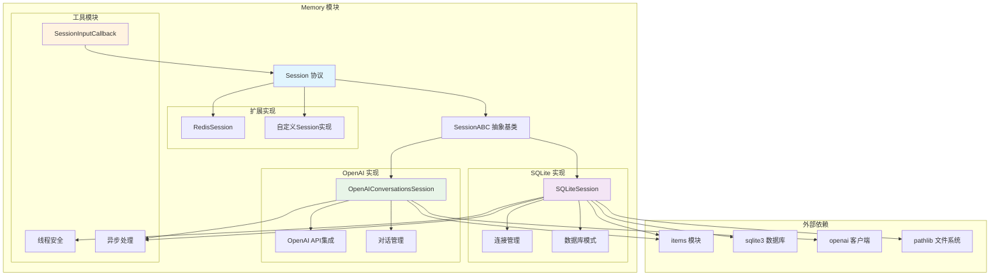
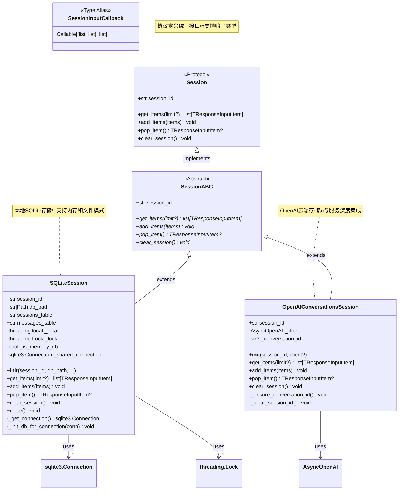
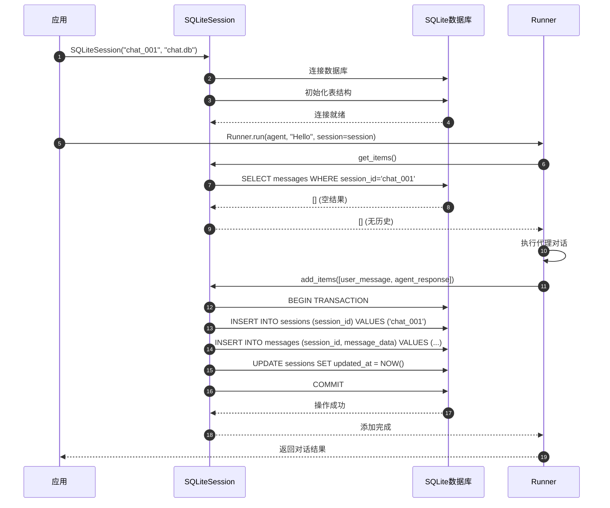
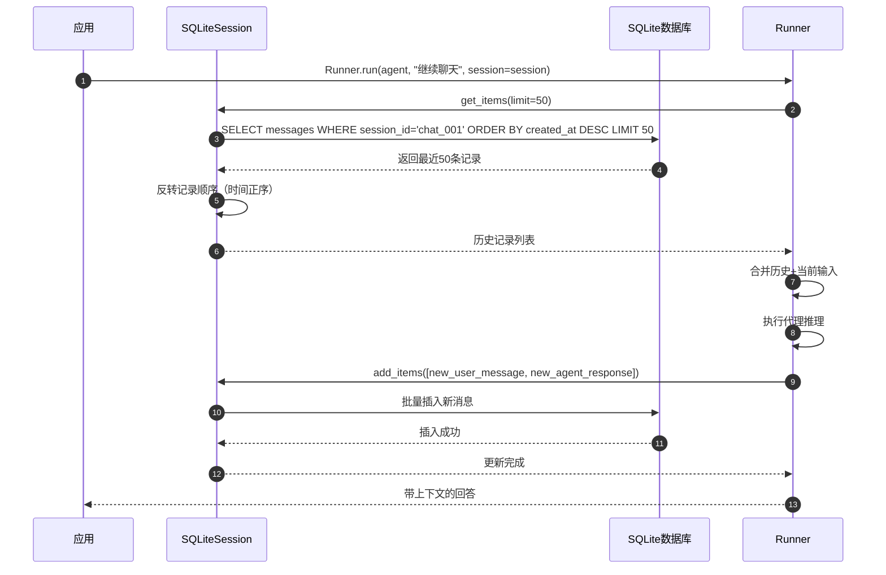
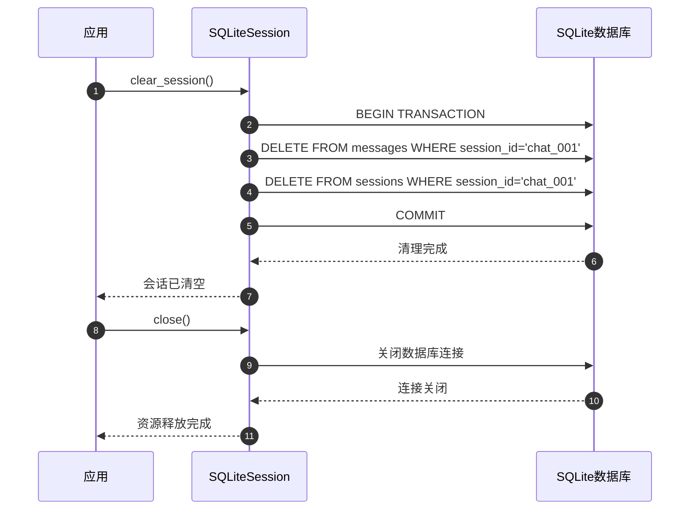

# OpenAI Agents Python SDK - Memory 模块概览

## 1. 模块职责与边界

Memory 模块是 OpenAI Agents Python SDK 的会话管理核心，负责对话历史的持久化存储、检索和管理。该模块提供了统一的会话接口和多种存储实现，确保智能代理能够维持长期的对话上下文和记忆能力。

### 核心职责

- **会话抽象**：定义统一的会话接口和协议
- **历史管理**：存储、检索和管理对话历史记录
- **多存储支持**：提供多种存储后端实现（SQLite、OpenAI Conversations等）
- **并发安全**：确保多线程环境下的数据安全
- **性能优化**：提供高效的历史检索和限制机制
- **生命周期管理**：处理会话的创建、更新、清理

### 会话存储架构

| 存储类型 | 实现类 | 存储位置 | 主要特点 |
|----------|--------|----------|----------|
| 本地SQLite | `SQLiteSession` | 本地文件/内存 | 高性能、完全控制、支持复杂查询 |
| OpenAI云端 | `OpenAIConversationsSession` | OpenAI服务器 | 与OpenAI生态集成、自动同步 |
| 自定义实现 | `Session` 协议 | 用户定义 | 灵活扩展、适配各种存储系统 |

### 输入输出接口

**输入：**
- 会话标识符（`session_id`）
- 对话项目列表（`list[TResponseInputItem]`）
- 查询参数（限制数量、排序等）

**输出：**
- 历史对话项目（按时间排序）
- 会话状态信息
- 操作结果确认

### 上下游依赖关系

**上游调用者：**
- `Runner`：执行引擎集成会话历史
- `Agent`：代理配置中指定会话对象
- 用户应用：直接管理会话生命周期

**下游依赖：**
- `items`：对话项目类型定义
- `sqlite3`：SQLite数据库访问
- `openai`：OpenAI API客户端
- `asyncio`：异步I/O处理

## 2. 模块架构图



**架构说明：**

### 接口层次设计

1. **协议层**：`Session` 协议定义统一的会话接口
2. **抽象层**：`SessionABC` 抽象基类提供默认实现框架  
3. **实现层**：具体的存储后端实现
4. **工具层**：会话处理的辅助工具和回调

### 存储模式对比

#### SQLite 存储模式
- **优势**：高性能、完全控制、复杂查询支持、离线工作
- **适用场景**：本地应用、高频访问、复杂历史分析
- **连接策略**：内存数据库使用共享连接，文件数据库使用线程本地连接

#### OpenAI 云端存储模式  
- **优势**：与OpenAI生态无缝集成、自动同步、服务器端管理
- **适用场景**：纯OpenAI模型使用、跨设备同步、云端应用
- **限制**：依赖网络连接、仅支持OpenAI模型

### 并发安全策略

- **SQLite模式**：使用线程锁保护共享连接，WAL模式提高并发性能
- **OpenAI模式**：基于异步API，天然支持并发
- **通用策略**：所有操作通过异步接口统一处理

### 性能优化机制

- **连接复用**：合理的连接池管理减少建连开销
- **索引优化**：关键字段建立索引提高查询性能
- **批量操作**：支持批量添加项目减少I/O次数
- **限制查询**：支持限制数量避免大数据集内存溢出

## 3. 关键算法与流程剖析

### 3.1 SQLite会话存储算法

```python
class SQLiteSession(SessionABC):
    """SQLite会话存储的核心实现"""
    
    def __init__(self, session_id: str, db_path: str | Path = ":memory:", ...):
        """初始化SQLite会话存储"""
        self.session_id = session_id
        self.db_path = db_path
        self._local = threading.local()
        self._lock = threading.Lock()
        
        # 区分内存数据库和文件数据库的连接策略
        self._is_memory_db = str(db_path) == ":memory:"
        if self._is_memory_db:
            # 内存数据库：使用共享连接避免线程隔离
            self._shared_connection = sqlite3.connect(":memory:", check_same_thread=False)
            self._shared_connection.execute("PRAGMA journal_mode=WAL")
            self._init_db_for_connection(self._shared_connection)
        else:
            # 文件数据库：使用独立连接提高并发性
            init_conn = sqlite3.connect(str(self.db_path), check_same_thread=False)
            init_conn.execute("PRAGMA journal_mode=WAL")
            self._init_db_for_connection(init_conn)
            init_conn.close()
    
    def _get_connection(self) -> sqlite3.Connection:
        """获取数据库连接的智能策略"""
        if self._is_memory_db:
            # 内存数据库使用共享连接
            return self._shared_connection
        else:
            # 文件数据库使用线程本地连接
            if not hasattr(self._local, "connection"):
                self._local.connection = sqlite3.connect(
                    str(self.db_path), check_same_thread=False
                )
                self._local.connection.execute("PRAGMA journal_mode=WAL")
            return self._local.connection
```

**算法目的：** 根据存储类型选择最优的连接策略，平衡性能和线程安全。

**关键设计决策：**
1. **连接策略分化**：内存数据库和文件数据库采用不同连接管理策略
2. **WAL模式启用**：提高并发读写性能，减少锁冲突
3. **线程安全保证**：通过锁机制确保并发操作的数据一致性

### 3.2 历史检索优化算法

```python
async def get_items(self, limit: int | None = None) -> list[TResponseInputItem]:
    """优化的历史检索算法"""
    
    def _get_items_sync():
        conn = self._get_connection()
        with self._lock if self._is_memory_db else threading.Lock():
            if limit is None:
                # 获取全部历史：按时间正序
                cursor = conn.execute(
                    f"""
                    SELECT message_data FROM {self.messages_table}
                    WHERE session_id = ?
                    ORDER BY created_at ASC
                    """,
                    (self.session_id,)
                )
            else:
                # 获取最近N条：先倒序取限制数量，再反转为正序
                cursor = conn.execute(
                    f"""
                    SELECT message_data FROM {self.messages_table}
                    WHERE session_id = ?
                    ORDER BY created_at DESC
                    LIMIT ?
                    """,
                    (self.session_id, limit)
                )
            
            rows = cursor.fetchall()
            
            # 限制查询时需要反转顺序
            if limit is not None:
                rows = list(reversed(rows))
            
            # JSON反序列化处理
            items = []
            for (message_data,) in rows:
                try:
                    item = json.loads(message_data)
                    items.append(item)
                except json.JSONDecodeError:
                    # 跳过损坏的JSON条目
                    continue
            
            return items
    
    return await asyncio.to_thread(_get_items_sync)
```

**算法目的：** 提供高效的历史检索，支持全量和限制查询，保证时间顺序正确性。

**优化策略：**
1. **查询策略优化**：限制查询使用DESC+LIMIT+反转，避免OFFSET性能问题
2. **异步处理**：使用`asyncio.to_thread`将同步数据库操作转为异步
3. **错误恢复**：优雅处理JSON解析错误，不中断整体查询流程
4. **内存控制**：支持限制查询避免大数据集内存溢出

### 3.3 批量操作事务算法

```python
async def add_items(self, items: list[TResponseInputItem]) -> None:
    """批量添加项目的事务处理算法"""
    if not items:
        return
    
    def _add_items_sync():
        conn = self._get_connection()
        with self._lock if self._is_memory_db else threading.Lock():
            # 确保会话记录存在
            conn.execute(
                f"INSERT OR IGNORE INTO {self.sessions_table} (session_id) VALUES (?)",
                (self.session_id,)
            )
            
            # 批量插入消息数据
            message_data = [
                (self.session_id, json.dumps(item)) 
                for item in items
            ]
            conn.executemany(
                f"INSERT INTO {self.messages_table} (session_id, message_data) VALUES (?, ?)",
                message_data
            )
            
            # 更新会话时间戳
            conn.execute(
                f"""UPDATE {self.sessions_table} 
                   SET updated_at = CURRENT_TIMESTAMP 
                   WHERE session_id = ?""",
                (self.session_id,)
            )
            
            # 提交事务
            conn.commit()
    
    await asyncio.to_thread(_add_items_sync)
```

**算法目的：** 通过批量操作和事务机制提高写入性能，确保数据一致性。

**事务设计特点：**
1. **原子性保证**：所有操作在同一事务中，全成功或全失败
2. **批量优化**：使用`executemany`减少SQL执行次数
3. **状态同步**：同步更新会话元数据和消息数据
4. **并发控制**：通过锁机制防止并发写入冲突

### 3.4 数据库模式设计

```python
def _init_db_for_connection(self, conn: sqlite3.Connection) -> None:
    """数据库模式初始化"""
    # 会话元数据表
    conn.execute(f"""
        CREATE TABLE IF NOT EXISTS {self.sessions_table} (
            session_id TEXT PRIMARY KEY,
            created_at TIMESTAMP DEFAULT CURRENT_TIMESTAMP,
            updated_at TIMESTAMP DEFAULT CURRENT_TIMESTAMP
        )
    """)
    
    # 消息数据表
    conn.execute(f"""
        CREATE TABLE IF NOT EXISTS {self.messages_table} (
            id INTEGER PRIMARY KEY AUTOINCREMENT,
            session_id TEXT NOT NULL,
            message_data TEXT NOT NULL,
            created_at TIMESTAMP DEFAULT CURRENT_TIMESTAMP,
            FOREIGN KEY (session_id) REFERENCES {self.sessions_table} (session_id)
                ON DELETE CASCADE
        )
    """)
    
    # 性能优化索引
    conn.execute(f"""
        CREATE INDEX IF NOT EXISTS idx_{self.messages_table}_session_id
        ON {self.messages_table} (session_id, created_at)
    """)
    
    conn.commit()
```

**模式设计原则：**
1. **规范化设计**：分离会话元数据和消息数据，避免冗余
2. **外键约束**：确保引用完整性，支持级联删除
3. **索引优化**：复合索引支持高效的会话查询
4. **时间戳跟踪**：自动记录创建和更新时间

## 4. 数据结构与UML图



**类图说明：**

### 接口设计层次

1. **Session协议**：定义统一的会话操作接口，支持鸭子类型
2. **SessionABC抽象类**：为具体实现提供通用框架
3. **具体实现类**：SQLiteSession和OpenAIConversationsSession各有特色

### 组合关系说明

- **SQLiteSession**：组合sqlite3.Connection和threading.Lock实现并发安全
- **OpenAIConversationsSession**：组合AsyncOpenAI客户端实现云端集成
- **SessionInputCallback**：函数类型别名，支持会话输入处理定制

### 方法一致性

所有实现类都提供相同的方法签名，确保可替换性：
- `get_items()`: 检索历史记录
- `add_items()`: 添加新记录  
- `pop_item()`: 移除最新记录
- `clear_session()`: 清空会话

## 5. 典型使用场景时序图

### 场景一：会话初始化与首次对话



### 场景二：长对话历史管理



### 场景三：会话清理与维护



## 6. 最佳实践与使用模式

### 6.1 SQLite会话的最佳实践

```python
import asyncio
from pathlib import Path
from agents import Agent, Runner, SQLiteSession

async def sqlite_session_best_practices():
    """SQLite会话使用最佳实践"""
    
    # 1. 使用持久化文件存储
    db_path = Path("conversations") / "agent_sessions.db"
    db_path.parent.mkdir(exist_ok=True)
    
    session = SQLiteSession(
        session_id="user_123_chat",
        db_path=db_path,
        sessions_table="agent_sessions",     # 可自定义表名
        messages_table="agent_messages"
    )
    
    # 2. 创建长期对话代理
    agent = Agent(
        name="PersistentAssistant",
        instructions="你是一个能记住历史对话的助手，请保持对话的连贯性。"
    )
    
    try:
        # 3. 进行多轮对话
        conversations = [
            "我叫张三，今年30岁",
            "我上次说的年龄是多少？",
            "我有什么爱好吗？",
            "我喜欢编程，特别是Python"
        ]
        
        for user_input in conversations:
            result = await Runner.run(
                agent, 
                user_input, 
                session=session
            )
            print(f"用户: {user_input}")
            print(f"助手: {result.final_output}\n")
            
            # 4. 检查会话状态
            history = await session.get_items(limit=5)  # 获取最近5条
            print(f"当前会话有 {len(history)} 条最近记录")
    
    finally:
        # 5. 正确关闭会话
        session.close()

# 运行示例
asyncio.run(sqlite_session_best_practices())
```

### 6.2 OpenAI云端会话使用

```python
from agents import Agent, Runner, OpenAIConversationsSession
from openai import AsyncOpenAI

async def openai_session_usage():
    """OpenAI云端会话使用模式"""
    
    # 1. 创建OpenAI客户端
    client = AsyncOpenAI(api_key="your-api-key")
    
    # 2. 创建云端会话
    session = OpenAIConversationsSession(
        session_id="cloud_chat_001",
        client=client
    )
    
    # 3. 创建与OpenAI生态集成的代理
    agent = Agent(
        name="CloudAssistant",
        instructions="你是一个云端助手，对话历史会自动同步。",
        model="gpt-4o"  # 确保使用OpenAI模型
    )
    
    # 4. 多设备间的对话连续性
    conversations = [
        "开始一个关于机器学习的讨论",
        "我们刚才讨论到哪里了？",  # 云端会话可跨设备恢复
        "继续深入探讨神经网络"
    ]
    
    for user_input in conversations:
        result = await Runner.run(
            agent, 
            user_input, 
            session=session,
            conversation_id=session._conversation_id  # 使用云端对话ID
        )
        print(f"用户: {user_input}")
        print(f"助手: {result.final_output}\n")

asyncio.run(openai_session_usage())
```

### 6.3 自定义会话输入处理

```python
from agents import Agent, Runner, SQLiteSession

def custom_session_input_processor(
    session_items: list, 
    user_items: list
) -> list:
    """自定义会话输入处理器"""
    
    # 1. 限制历史长度，避免上下文过长
    MAX_HISTORY = 20
    if len(session_items) > MAX_HISTORY:
        # 保留最近的对话，但保持对话完整性
        session_items = session_items[-MAX_HISTORY:]
    
    # 2. 过滤敏感信息
    filtered_items = []
    for item in session_items:
        # 假设我们有一个内容过滤函数
        if not contains_sensitive_info(item):
            filtered_items.append(item)
    
    # 3. 添加上下文摘要（当历史很长时）
    if len(filtered_items) > 10:
        summary_item = create_conversation_summary(filtered_items[:5])
        filtered_items = [summary_item] + filtered_items[5:]
    
    # 4. 合并历史和当前输入
    return filtered_items + user_items

def contains_sensitive_info(item) -> bool:
    """检查是否包含敏感信息"""
    sensitive_keywords = ["密码", "身份证", "银行卡"]
    content = str(item.get("content", ""))
    return any(keyword in content for keyword in sensitive_keywords)

def create_conversation_summary(items) -> dict:
    """创建对话摘要"""
    return {
        "type": "message",
        "content": f"[对话摘要：基于前{len(items)}条对话的要点总结]",
        "role": "system"
    }

async def custom_processing_example():
    """使用自定义处理器的示例"""
    
    session = SQLiteSession("processed_chat", "processed.db")
    
    agent = Agent(
        name="SmartAssistant",
        instructions="你是一个智能助手，会基于处理过的对话历史回答问题。"
    )
    
    # 使用自定义会话输入处理器
    from agents.run import RunConfig
    config = RunConfig(
        session_input_callback=custom_session_input_processor
    )
    
    result = await Runner.run(
        agent,
        "根据我们之前的对话，我需要什么帮助？",
        session=session,
        run_config=config
    )
    
    print(result.final_output)
    session.close()

asyncio.run(custom_processing_example())
```

### 6.4 多会话管理模式

```python
from typing import Dict
from agents import SQLiteSession

class SessionManager:
    """会话管理器：统一管理多个用户会话"""
    
    def __init__(self, db_path: str):
        self.db_path = db_path
        self.active_sessions: Dict[str, SQLiteSession] = {}
    
    def get_session(self, user_id: str, session_type: str = "default") -> SQLiteSession:
        """获取或创建用户会话"""
        session_id = f"{user_id}_{session_type}"
        
        if session_id not in self.active_sessions:
            self.active_sessions[session_id] = SQLiteSession(
                session_id=session_id,
                db_path=self.db_path
            )
        
        return self.active_sessions[session_id]
    
    def close_session(self, user_id: str, session_type: str = "default"):
        """关闭指定会话"""
        session_id = f"{user_id}_{session_type}"
        if session_id in self.active_sessions:
            self.active_sessions[session_id].close()
            del self.active_sessions[session_id]
    
    def close_all_sessions(self):
        """关闭所有活跃会话"""
        for session in self.active_sessions.values():
            session.close()
        self.active_sessions.clear()
    
    async def cleanup_old_sessions(self, days: int = 30):
        """清理超过指定天数的旧会话"""
        # 这里可以实现基于时间的会话清理逻辑
        pass

# 使用示例
async def multi_session_example():
    """多会话管理示例"""
    
    manager = SessionManager("multi_user.db")
    
    # 不同用户的独立会话
    user1_session = manager.get_session("user_001")
    user2_session = manager.get_session("user_002") 
    
    # 同一用户的不同类型会话
    user1_work_session = manager.get_session("user_001", "work")
    user1_personal_session = manager.get_session("user_001", "personal")
    
    # 使用会话进行对话...
    
    # 清理资源
    manager.close_all_sessions()
```

Memory模块通过灵活的接口设计和高效的实现，为OpenAI Agents提供了强大的会话管理能力，支持从简单的内存存储到复杂的多用户、多会话场景。
