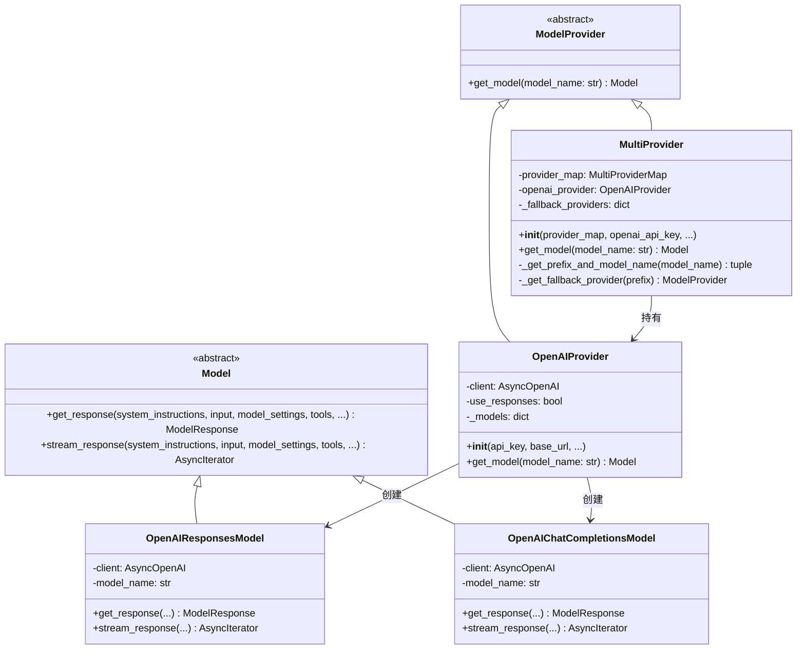
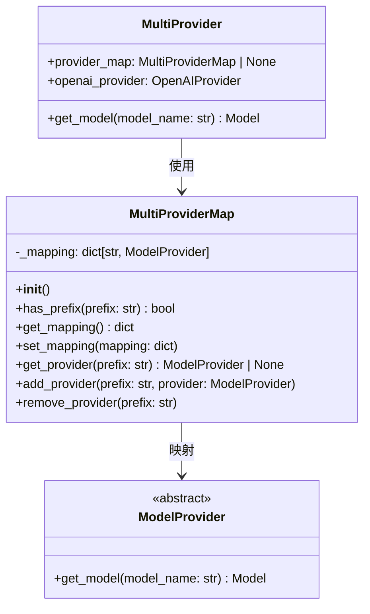
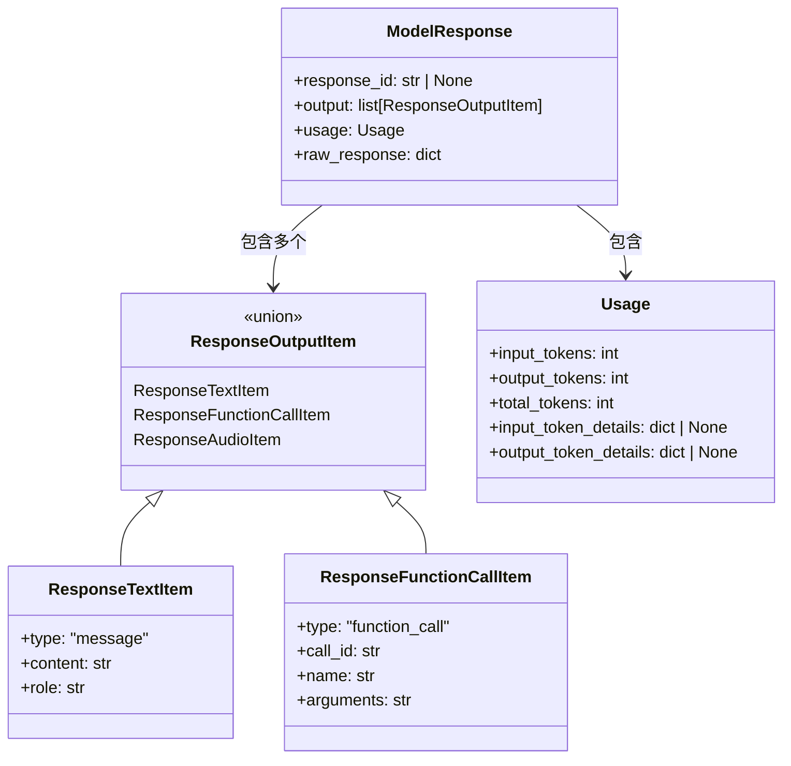
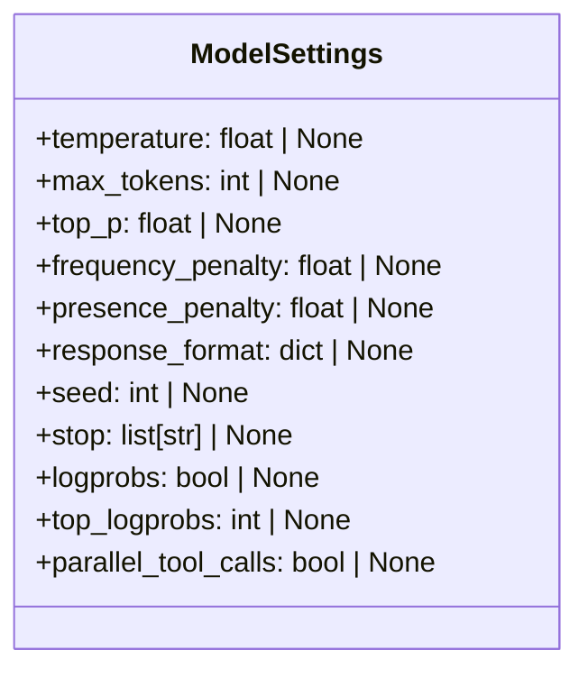
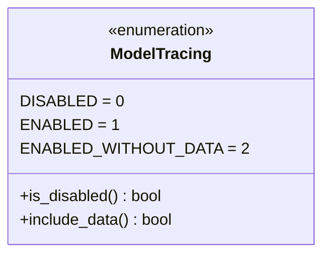
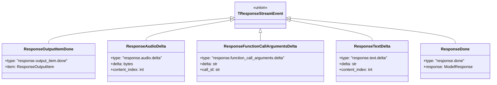
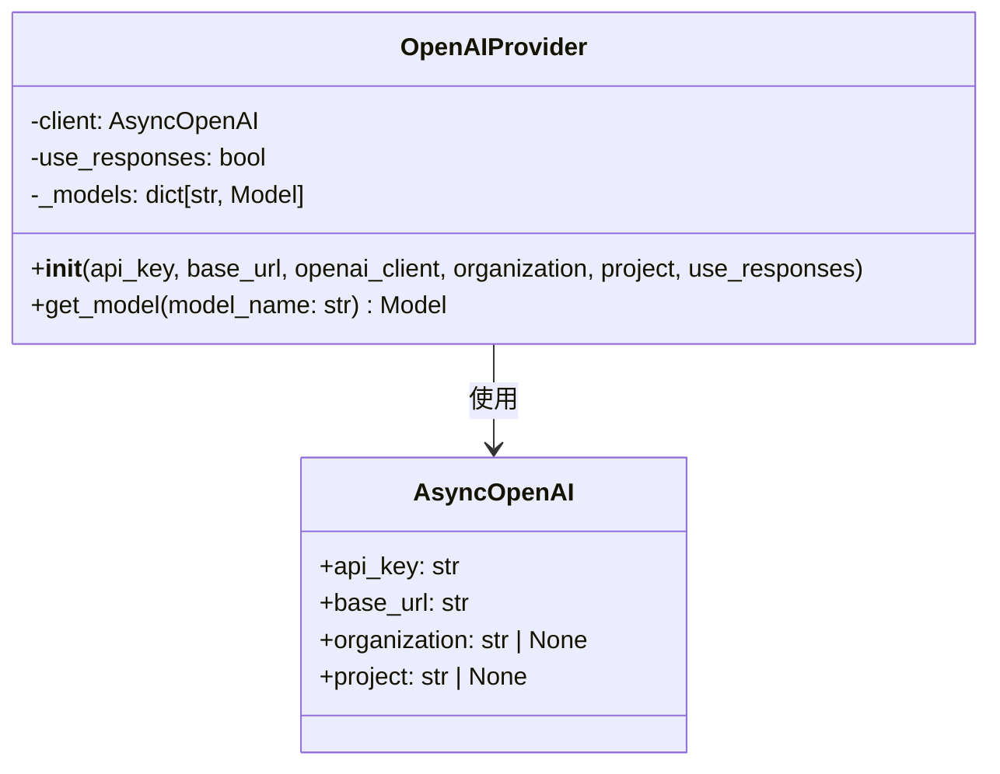
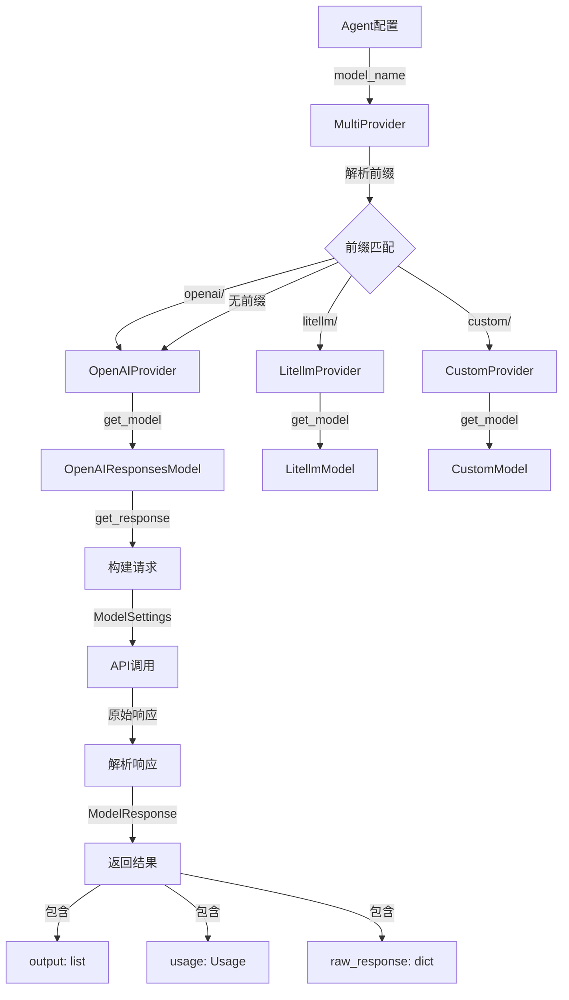
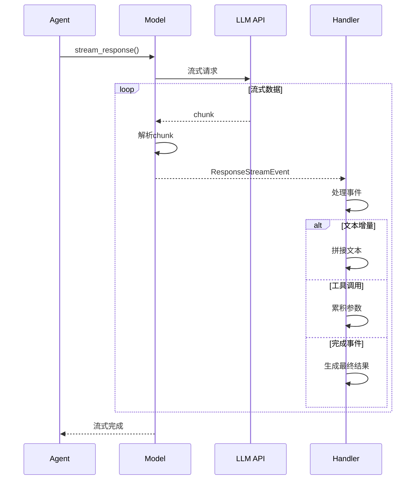
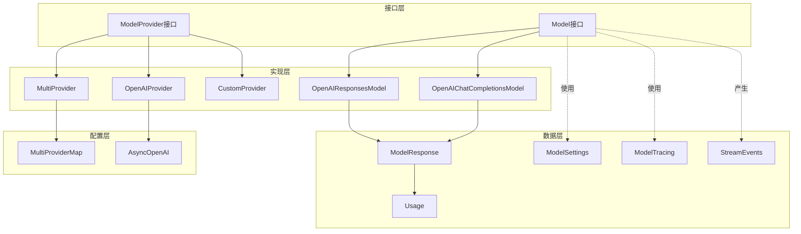

# OpenAI Agents Python SDK - Models 模块数据结构详解

## 1. 数据结构总览

Models 模块的数据结构定义了模型接口、提供商机制和响应格式。核心数据结构包括模型接口、提供商接口、响应对象和配置类。

### 数据结构层次

```
Model Interface (模型接口)
    ├── get_response() -> ModelResponse
    └── stream_response() -> AsyncIterator[StreamEvent]

ModelProvider (提供商接口)
    ├── MultiProvider (多提供商)
    └── OpenAIProvider (OpenAI实现)

ModelResponse (响应对象)
    ├── response_id
    ├── output
    ├── usage
    └── raw_response

ModelTracing (追踪配置)
```

## 2. 核心接口 UML 图

### 2.1 Model 和 ModelProvider 接口



**接口说明：**

- **Model**: 所有模型实现的基础接口，定义了标准和流式两种响应方法
- **ModelProvider**: 提供商接口，负责根据模型名称创建模型实例
- **MultiProvider**: 支持多提供商路由的实现
- **OpenAIProvider**: OpenAI专用提供商实现

### 2.2 MultiProviderMap 结构



**字段说明：**

| 字段 | 类型 | 说明 |
|------|------|------|
| `_mapping` | `dict[str, ModelProvider]` | 前缀到提供商的映射字典 |

**方法说明：**

| 方法 | 功能 |
|------|------|
| `has_prefix()` | 检查前缀是否存在 |
| `get_provider()` | 获取指定前缀的提供商 |
| `add_provider()` | 添加自定义提供商 |
| `remove_provider()` | 移除提供商映射 |

## 3. 模型响应数据结构

### 3.1 ModelResponse 结构



**ModelResponse 字段详解：**

| 字段 | 类型 | 说明 | 示例 |
|------|------|------|------|
| `response_id` | `str \| None` | 响应唯一标识符 | `"resp_abc123"` |
| `output` | `list[ResponseOutputItem]` | 输出项列表 | `[{type: "message", ...}]` |
| `usage` | `Usage` | Token使用统计 | `Usage(input_tokens=50, ...)` |
| `raw_response` | `dict` | 原始API响应 | 完整的API响应字典 |

### 3.2 Usage 数据结构

```python
@dataclass
class Usage:
    """Token使用统计"""
    
    input_tokens: int
    """输入Token数量"""
    
    output_tokens: int
    """输出Token数量"""
    
    total_tokens: int
    """总Token数量"""
    
    input_token_details: dict | None = None
    """输入Token详细信息（如缓存命中等）"""
    
    output_token_details: dict | None = None
    """输出Token详细信息（如推理Token等）"""
```

**字段说明：**

| 字段 | 类型 | 说明 | 计算方式 |
|------|------|------|---------|
| `input_tokens` | `int` | 输入消耗的Token | 系统指令 + 用户输入 + 历史 |
| `output_tokens` | `int` | 输出消耗的Token | 模型生成的内容 |
| `total_tokens` | `int` | 总Token消耗 | `input_tokens + output_tokens` |

**示例：**
```python
usage = Usage(
    input_tokens=150,
    output_tokens=50,
    total_tokens=200,
    input_token_details={
        "cached_tokens": 100,  # 缓存命中的Token
        "text_tokens": 50
    },
    output_token_details={
        "reasoning_tokens": 20,  # 推理Token（o1模型）
        "text_tokens": 30
    }
)
```

## 4. 模型配置数据结构

### 4.1 ModelSettings 结构



**字段详解：**

| 字段 | 类型 | 默认值 | 说明 | 取值范围 |
|------|------|--------|------|---------|
| `temperature` | `float \| None` | `None` | 采样温度 | 0.0 - 2.0 |
| `max_tokens` | `int \| None` | `None` | 最大生成Token数 | > 0 |
| `top_p` | `float \| None` | `None` | 核采样概率 | 0.0 - 1.0 |
| `frequency_penalty` | `float \| None` | `None` | 频率惩罚 | -2.0 - 2.0 |
| `presence_penalty` | `float \| None` | `None` | 存在惩罚 | -2.0 - 2.0 |
| `response_format` | `dict \| None` | `None` | 响应格式（JSON模式） | `{"type": "json_object"}` |
| `seed` | `int \| None` | `None` | 随机种子 | 任意整数 |
| `stop` | `list[str] \| None` | `None` | 停止序列 | 字符串列表 |
| `logprobs` | `bool \| None` | `None` | 是否返回对数概率 | `True/False` |
| `top_logprobs` | `int \| None` | `None` | 返回Top-K对数概率 | 0 - 20 |
| `parallel_tool_calls` | `bool \| None` | `None` | 是否并行调用工具 | `True/False` |

**使用示例：**
```python
from agents import ModelSettings

# 创造性任务配置
creative_settings = ModelSettings(
    temperature=0.9,
    top_p=0.95,
    max_tokens=2000,
    presence_penalty=0.6
)

# 精确任务配置
precise_settings = ModelSettings(
    temperature=0.1,
    max_tokens=500,
    seed=42,  # 可重复的结果
    stop=["\n\n"]
)

# JSON模式配置
json_settings = ModelSettings(
    temperature=0.5,
    response_format={"type": "json_object"}
)
```

## 5. 模型追踪数据结构

### 5.1 ModelTracing 枚举



**枚举值说明：**

| 值 | 整数 | 含义 | 使用场景 |
|----|------|------|---------|
| `DISABLED` | 0 | 完全禁用追踪 | 生产环境，不需要调试 |
| `ENABLED` | 1 | 启用追踪，包含数据 | 开发/测试环境 |
| `ENABLED_WITHOUT_DATA` | 2 | 启用追踪，不含敏感数据 | 生产环境监控 |

**方法说明：**

```python
class ModelTracing(enum.Enum):
    def is_disabled(self) -> bool:
        """检查是否禁用追踪"""
        return self == ModelTracing.DISABLED
    
    def include_data(self) -> bool:
        """检查是否包含输入输出数据"""
        return self == ModelTracing.ENABLED
```

**使用示例：**
```python
from agents.models import ModelTracing

# 根据环境选择追踪级别
import os

if os.getenv("ENV") == "production":
    tracing = ModelTracing.ENABLED_WITHOUT_DATA
else:
    tracing = ModelTracing.ENABLED

# 条件判断
if not tracing.is_disabled():
    # 记录追踪信息
    if tracing.include_data():
        # 记录完整数据
        pass
    else:
        # 只记录元数据
        pass
```

## 6. 流式响应数据结构

### 6.1 ResponseStreamEvent 类型



**事件类型详解：**

| 事件类型 | 字段 | 说明 |
|---------|------|------|
| `response.output_item.done` | `item` | 输出项完成 |
| `response.audio.delta` | `delta`, `content_index` | 音频数据增量 |
| `response.function_call_arguments.delta` | `delta`, `call_id` | 工具调用参数增量 |
| `response.text.delta` | `delta`, `content_index` | 文本内容增量 |
| `response.done` | `response` | 响应完成 |

**流式事件处理示例：**
```python
async for event in model.stream_response(...):
    event_type = event.get("type")
    
    if event_type == "response.text.delta":
        # 处理文本增量
        text_delta = event["delta"]
        print(text_delta, end="", flush=True)
    
    elif event_type == "response.function_call_arguments.delta":
        # 处理工具调用参数增量
        args_delta = event["delta"]
        call_id = event["call_id"]
        
    elif event_type == "response.output_item.done":
        # 输出项完成
        item = event["item"]
        
    elif event_type == "response.done":
        # 整个响应完成
        final_response = event["response"]
```

## 7. 提供商特定数据结构

### 7.1 OpenAI 提供商配置



**OpenAIProvider 构造参数：**

| 参数 | 类型 | 说明 |
|------|------|------|
| `api_key` | `str \| None` | OpenAI API密钥 |
| `base_url` | `str \| None` | API基础URL |
| `openai_client` | `AsyncOpenAI \| None` | 自定义客户端 |
| `organization` | `str \| None` | 组织ID |
| `project` | `str \| None` | 项目ID |
| `use_responses` | `bool \| None` | 是否使用Responses API |

### 7.2 模型名称解析结构

```python
# MultiProvider 内部的名称解析
def _get_prefix_and_model_name(
    self, model_name: str | None
) -> tuple[str | None, str | None]:
    """
    解析模型名称，提取前缀和实际名称
    
    输入示例：
    - "gpt-4o" -> (None, "gpt-4o")
    - "openai/gpt-4o" -> ("openai", "gpt-4o")
    - "litellm/claude-3-opus" -> ("litellm", "claude-3-opus")
    - "custom/my-model" -> ("custom", "my-model")
    - None -> (None, None)
    """
    if model_name is None:
        return None, None
    elif "/" in model_name:
        prefix, name = model_name.split("/", 1)
        return prefix, name
    else:
        return None, model_name
```

## 8. 数据流转图

### 8.1 模型调用数据流



**数据流说明：**

1. **模型选择阶段**：Agent配置 → MultiProvider → 具体Provider → Model实例
2. **请求构建阶段**：ModelSettings + 输入数据 → API请求参数
3. **API调用阶段**：发送请求 → 接收原始响应
4. **响应解析阶段**：原始响应 → ModelResponse（标准化格式）
5. **结果返回阶段**：ModelResponse → Agent/Runner

### 8.2 流式响应数据流



## 9. 数据结构关系总览



Models 模块的数据结构设计通过清晰的接口抽象和灵活的配置机制，实现了对多种LLM的统一管理和调用，为 OpenAI Agents 提供了强大的模型适配能力。

