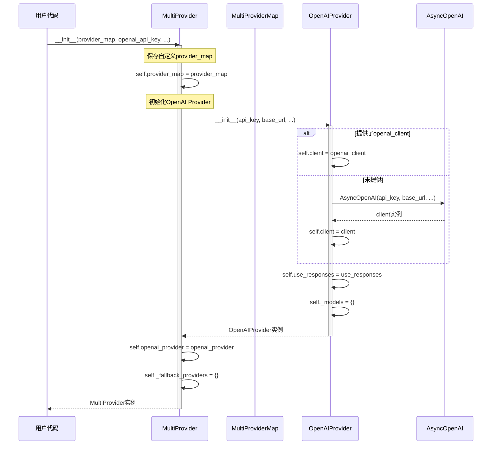
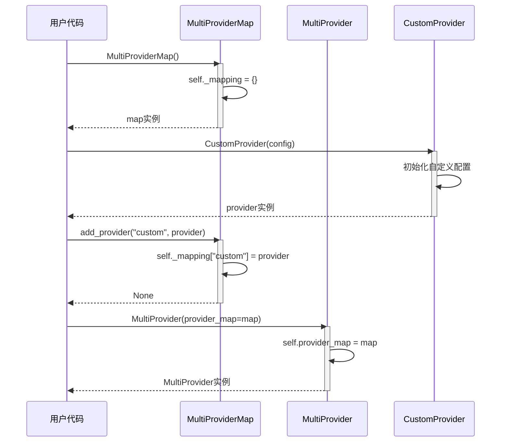
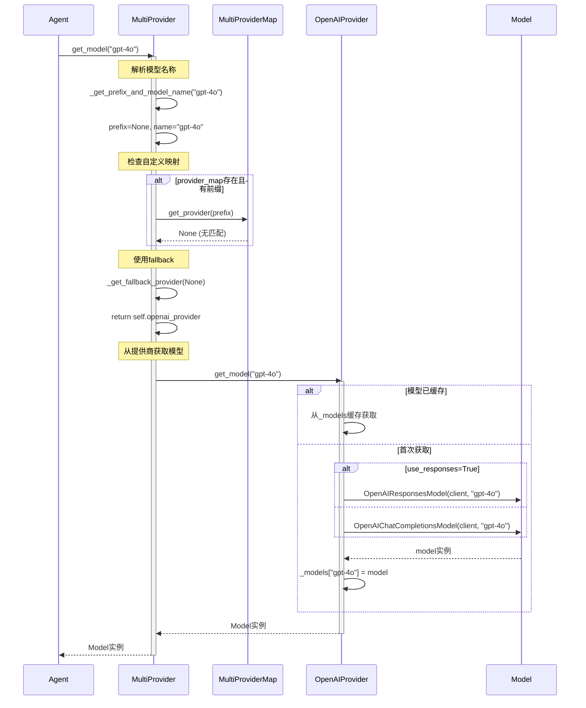
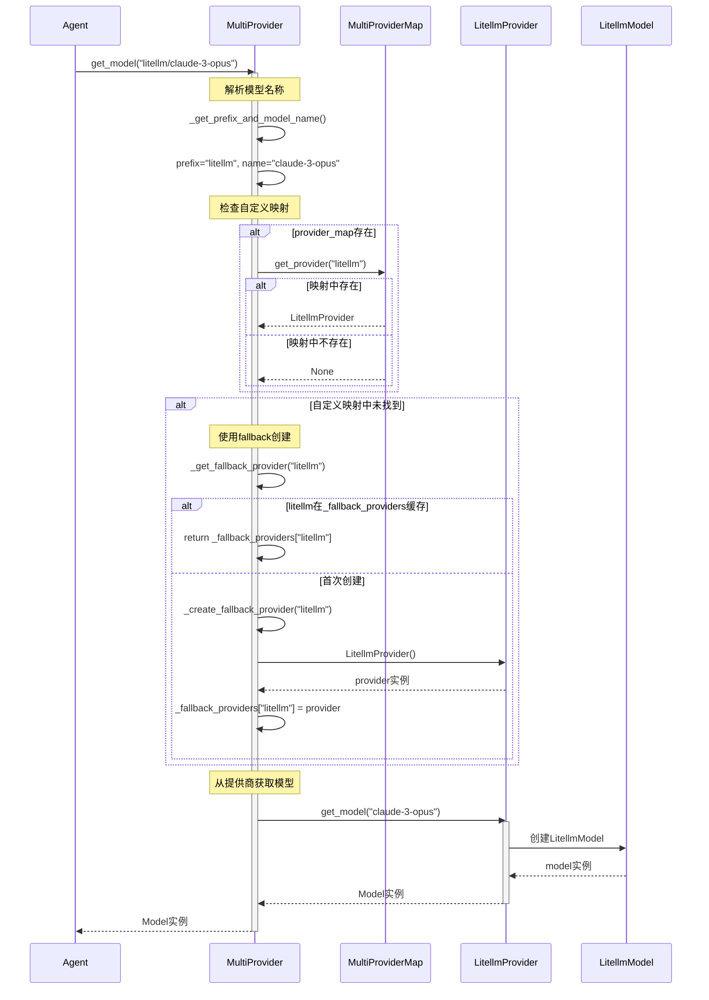
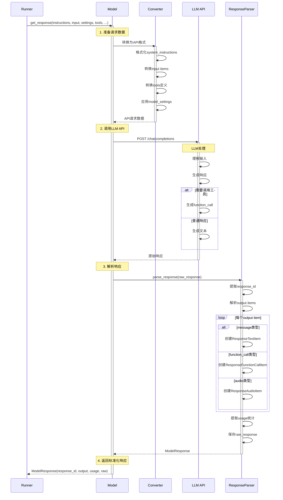
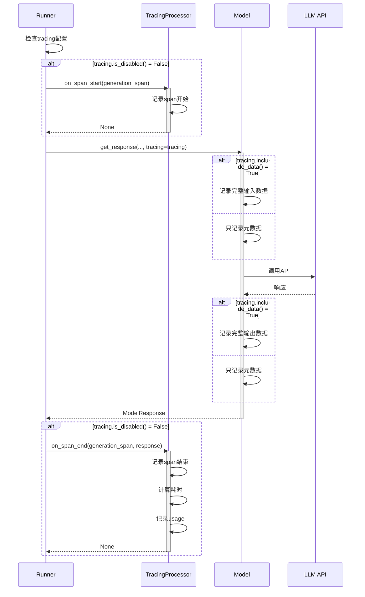
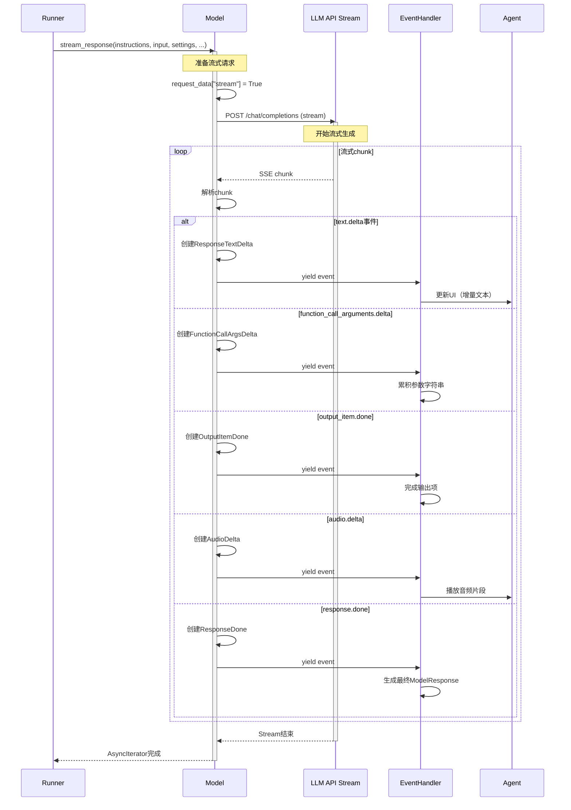
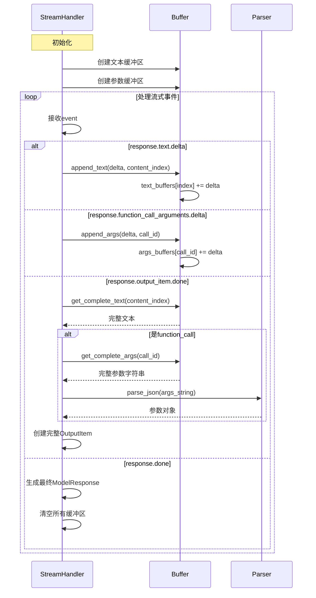
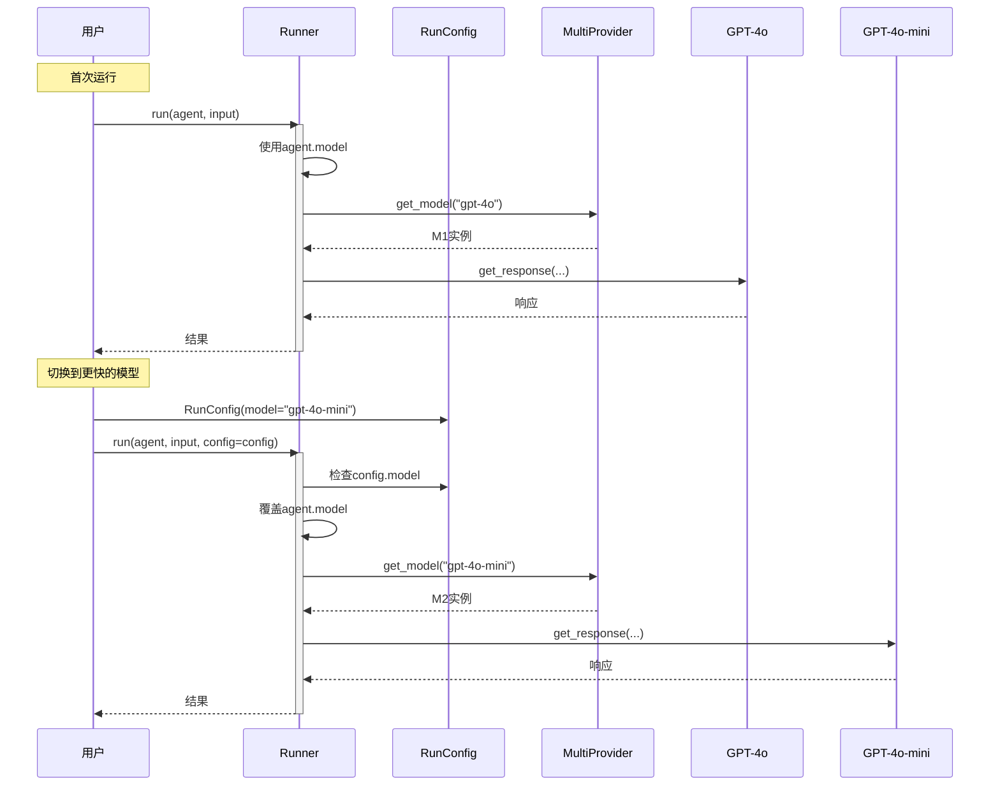
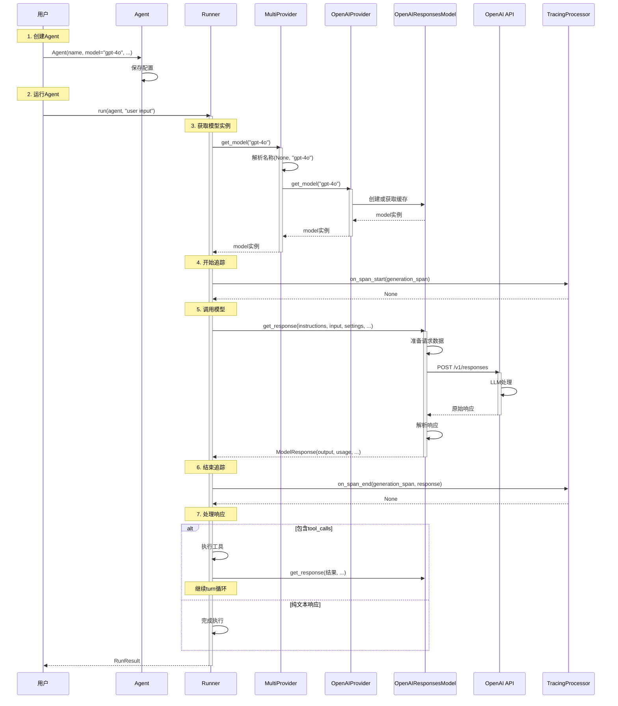

# OpenAI Agents Python SDK - Models 模块时序图详解

## 1. 时序图总览

Models 模块的时序图展示了模型选择、调用、响应处理的完整流程。核心流程包括：模型提供商初始化、模型实例获取、标准调用、流式调用。

### 主要时序流程

| 时序流程 | 参与者 | 核心操作 |
|---------|--------|---------|
| **模型提供商初始化** | MultiProvider, OpenAIProvider | 配置提供商映射 |
| **模型实例获取** | MultiProvider, ModelProvider, Model | 路由并创建模型 |
| **标准模型调用** | Agent, Model, LLM API | 完整请求响应 |
| **流式模型调用** | Agent, Model, LLM API | 流式数据处理 |
| **多提供商路由** | MultiProvider, ProviderMap | 前缀匹配与查找 |

## 2. 模型提供商初始化时序图

### 2.1 MultiProvider 初始化流程



**流程说明：**

1. **创建MultiProvider**：用户传入配置参数
2. **保存自定义映射**：存储provider_map用于前缀路由
3. **初始化OpenAI Provider**：
   - 如果提供了自定义客户端，直接使用
   - 否则创建新的AsyncOpenAI客户端
4. **初始化缓存**：准备fallback providers字典
5. **返回实例**：MultiProvider准备就绪

### 2.2 自定义提供商注册流程



**流程说明：**

1. **创建映射对象**：初始化空的提供商映射
2. **创建自定义提供商**：实现ModelProvider接口
3. **注册提供商**：添加前缀到映射
4. **创建MultiProvider**：使用自定义映射

## 3. 模型实例获取时序图

### 3.1 标准模型获取流程



**流程说明：**

1. **接收请求**：Agent请求模型实例
2. **解析名称**：提取前缀和实际名称
3. **查找提供商**：
   - 先检查自定义映射
   - 再使用fallback提供商
4. **获取模型**：
   - 检查缓存
   - 创建新实例（根据use_responses选择）
5. **返回模型**：准备好的模型实例

### 3.2 带前缀的模型获取流程



**流程说明：**

1. **解析前缀**：识别"litellm"前缀
2. **查找提供商**：
   - 先查自定义映射
   - 再查fallback缓存
   - 最后动态创建
3. **获取模型**：从对应提供商获取
4. **返回实例**：返回实际模型

## 4. 标准模型调用时序图

### 4.1 完整的get_response流程



**流程说明：**

1. **准备请求**：
   - 格式化系统指令
   - 转换输入项为API格式
   - 转换工具定义
   - 应用模型设置
2. **调用API**：发送HTTP请求到LLM服务
3. **解析响应**：
   - 提取响应ID
   - 解析输出项（文本、工具调用等）
   - 统计Token使用
4. **返回结果**：标准化的ModelResponse

### 4.2 带追踪的模型调用流程



**追踪流程说明：**

1. **检查追踪配置**：确定追踪级别
2. **记录开始**：创建generation span
3. **条件记录**：根据include_data决定记录详细程度
4. **记录结束**：完成span，记录统计信息

## 5. 流式模型调用时序图

### 5.1 stream_response流程



**流式处理说明：**

1. **启用流式**：设置stream=True
2. **接收chunks**：持续接收SSE事件
3. **分类处理**：
   - 文本增量：实时显示
   - 工具参数：累积解析
   - 输出完成：标记结束
   - 音频数据：实时播放
4. **完成流式**：发送done事件

### 5.2 流式事件聚合流程



**聚合流程说明：**

1. **初始化缓冲区**：为文本和参数创建缓冲
2. **累积增量**：将delta添加到对应缓冲区
3. **完成输出项**：
   - 获取完整内容
   - 解析JSON参数
   - 创建完整对象
4. **清理缓冲**：响应完成后清空

## 6. 多提供商路由时序图

### 6.1 完整路由流程

```mermaid
sequenceDiagram
    participant A as Agent
    participant MP as MultiProvider
    participant PM as ProviderMap
    participant Cache as FallbackCache
    participant P1 as OpenAIProvider
    participant P2 as CustomProvider
    participant M as Model
    
    A->>MP: get_model("custom/my-model")
    activate MP
    
    Note over MP: Step 1: 解析模型名称
    MP->>MP: _get_prefix_and_model_name()
    MP->>MP: prefix="custom", name="my-model"
    
    Note over MP: Step 2: 检查自定义映射
    alt provider_map存在
        MP->>PM: get_provider("custom")
        activate PM
        
        alt 前缀已注册
            PM->>PM: return _mapping["custom"]
            PM-->>MP: CustomProvider
            deactivate PM
            
            Note over MP: 使用自定义提供商
            MP->>P2: get_model("my-model")
            activate P2
            P2->>M: 创建CustomModel
            M-->>P2: model实例
            P2-->>MP: Model
            deactivate P2
            
        else 前缀未注册
            PM-->>MP: None
            deactivate PM
            
            Note over MP: Step 3: 使用fallback
            MP->>Cache: 查找_fallback_providers["custom"]
            
            alt 缓存存在
                Cache-->>MP: CustomProvider
            else 需要创建
                MP->>MP: _create_fallback_provider("custom")
                MP->>P2: CustomProvider()
                P2-->>MP: provider
                MP->>Cache: _fallback_providers["custom"] = provider
            end
            
            MP->>P2: get_model("my-model")
            P2->>M: 创建Model
            M-->>P2: model实例
            P2-->>MP: Model
        end
        
    else provider_map为None
        Note over MP: 直接使用fallback
        MP->>MP: _get_fallback_provider("custom")
        
        alt prefix=None或"openai"
            MP->>P1: get_model(name)
            P1-->>MP: OpenAIModel
        else 其他prefix
            MP->>Cache: 查找或创建provider
            Cache-->>MP: Provider
            MP->>P2: get_model(name)
            P2-->>MP: Model
        end
    end
    
    MP-->>A: Model实例
    deactivate MP
```

**路由决策流程：**

1. **解析阶段**：
   - 分离前缀和模型名
   - 无前缀视为"openai"
2. **查找阶段**：
   - 优先查自定义映射
   - 再查fallback缓存
   - 最后动态创建
3. **获取模型**：调用提供商的get_model
4. **返回实例**：返回准备好的Model

## 7. 错误处理时序图

### 7.1 模型调用失败处理

```mermaid
sequenceDiagram
    participant R as Runner
    participant M as Model
    participant API as LLM API
    participant E as ErrorHandler
    
    R->>M: get_response(...)
    activate M
    
    M->>API: 调用API
    activate API
    
    alt API调用失败
        API-->>M: HTTPError/APIError
        deactivate API
        
        M->>E: 处理异常
        activate E
        
        alt RateLimitError
            E->>E: 记录限流错误
            E->>E: 返回重试建议
            E-->>M: RateLimitException
            
        else AuthenticationError
            E->>E: 记录认证错误
            E-->>M: AuthException
            
        else TimeoutError
            E->>E: 记录超时
            E-->>M: TimeoutException
            
        else 其他错误
            E->>E: 记录通用错误
            E-->>M: ModelException
        end
        
        deactivate E
        
        M-->>R: raise Exception
        deactivate M
        
        R->>R: 捕获异常
        R->>R: 记录到trace
        R-->>R: 返回错误结果或重试
        
    else API调用成功
        API-->>M: 响应数据
        deactivate API
        M-->>R: ModelResponse
        deactivate M
    end
```

**错误处理说明：**

1. **捕获异常**：识别API错误类型
2. **分类处理**：
   - 限流：建议重试
   - 认证：检查密钥
   - 超时：调整timeout
   - 其他：记录详情
3. **传播异常**：向上层返回
4. **记录追踪**：在trace中记录错误

## 8. 模型切换时序图

### 8.1 运行时模型切换



**切换流程说明：**

1. **默认模型**：使用Agent配置的模型
2. **配置覆盖**：RunConfig.model覆盖默认值
3. **获取新模型**：从Provider获取
4. **使用新模型**：本次运行使用新模型

## 9. 模型调用完整时序图（端到端）



**端到端流程总结：**

1. **Agent创建**：配置模型名称
2. **Runner启动**：初始化执行环境
3. **模型获取**：通过Provider获取Model实例
4. **追踪开始**：记录generation span
5. **模型调用**：发送请求并解析响应
6. **追踪结束**：记录统计信息
7. **响应处理**：执行工具或返回结果
8. **返回用户**：完整的RunResult

Models 模块通过清晰的时序流程实现了模型的灵活选择、统一调用和标准化响应，为 OpenAI Agents 提供了强大的LLM集成基础。
