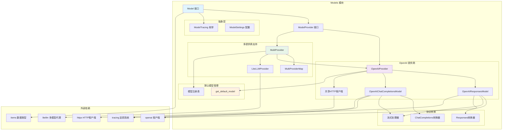
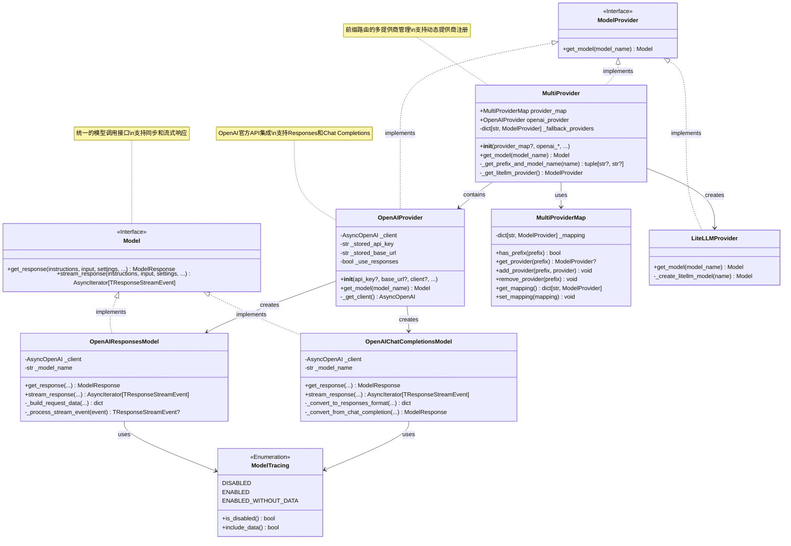
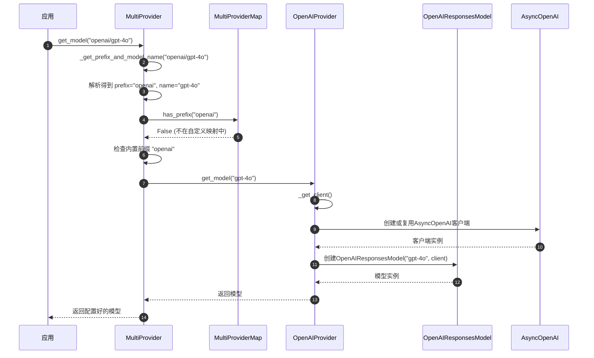
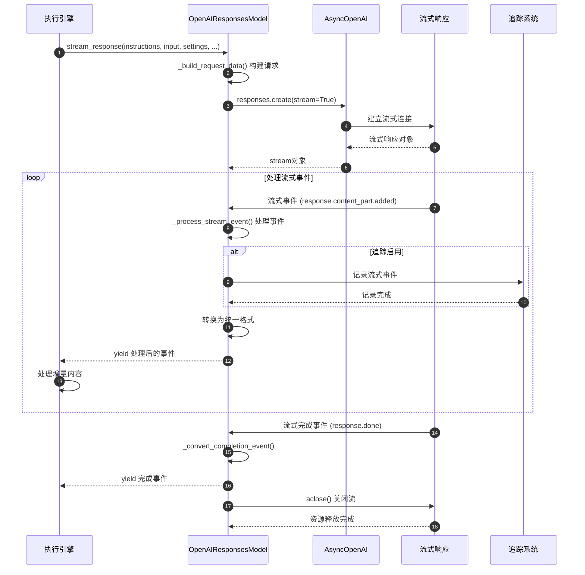
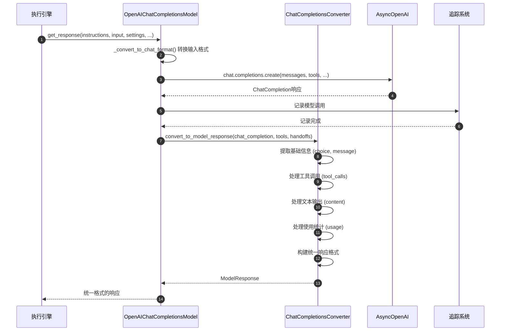

# OpenAI Agents Python SDK - Models 模块概览

## 1. 模块职责与边界

Models 模块是 OpenAI Agents Python SDK 的模型抽象层，负责统一不同语言模型提供商的接口，实现模型调用的标准化管理。该模块通过抽象设计隐藏了不同模型服务的差异，为上层应用提供一致的模型调用体验。

### 核心职责

- **模型抽象**：定义统一的模型调用接口，屏蔽底层差异
- **提供商管理**：支持多种模型提供商的集成和切换
- **协议适配**：适配不同的API协议（Responses API、Chat Completions API等）
- **连接管理**：高效的HTTP连接池和资源管理
- **流式支持**：提供流式响应处理能力
- **追踪集成**：与可观测性系统深度集成
- **设置管理**：统一的模型参数配置和优化

### 模型架构体系

| 层次 | 组件 | 职责 | 主要类型 |
|------|------|------|----------|
| 接口层 | Model Interface | 统一模型调用接口 | `Model`、`ModelProvider` |
| 提供商层 | Provider Implementation | 具体提供商实现 | `OpenAIProvider`、`MultiProvider` |
| 协议层 | Protocol Adaptation | API协议适配 | `OpenAIResponsesModel`、`OpenAIChatCompletionsModel` |
| 传输层 | HTTP Client | 网络通信管理 | `AsyncOpenAI`、`httpx.AsyncClient` |

### 支持的模型提供商

| 提供商 | 前缀标识 | 主要模型 | 特殊功能 |
|--------|----------|----------|----------|
| OpenAI | `openai/` 或无前缀 | GPT-4o, GPT-4, GPT-3.5 | Responses API、托管工具 |
| LiteLLM | `litellm/` | 多提供商代理 | 统一接口访问各种模型 |
| 自定义 | 用户定义 | 用户扩展 | 完全自定义实现 |

### 输入输出接口

**输入：**
- 系统指令（`system_instructions`）
- 用户输入项目（`list[TResponseInputItem]`）
- 模型设置（`ModelSettings`）
- 工具列表（`list[Tool]`）
- 输出模式（`AgentOutputSchemaBase`）

**输出：**
- 模型响应（`ModelResponse`）
- 流式事件（`AsyncIterator[TResponseStreamEvent]`）
- 使用统计（令牌数、成本等）

### 上下游依赖关系

**上游调用者：**
- `RunImpl`：执行引擎的核心模型调用
- `Agent`：代理配置中的模型指定
- `RealtimeAgent`：实时代理的模型集成

**下游依赖：**
- `openai`：OpenAI官方Python客户端
- `httpx`：高性能HTTP客户端
- `litellm`：多提供商模型代理
- `model_settings`：模型参数配置
- `tracing`：调用链追踪

## 2. 模块架构图



**架构说明：**

### 分层设计原理

1. **接口抽象层**：`Model` 和 `ModelProvider` 定义统一接口
2. **提供商实现层**：具体的模型提供商实现，如 OpenAI、LiteLLM
3. **协议适配层**：不同API协议的具体实现和转换
4. **传输管理层**：HTTP连接池和网络通信优化

### 模型选择策略

- **前缀路由**：根据模型名称前缀选择合适的提供商
- **默认模型**：自动选择当前推荐的默认模型
- **回退机制**：主提供商失败时的备选方案

### 性能优化设计

- **连接复用**：全局共享HTTP客户端减少连接开销
- **异步优先**：所有I/O操作都基于异步模式
- **流式处理**：支持增量响应减少延迟
- **智能缓存**：合理的客户端实例缓存策略

### 扩展能力

- **插件化架构**：通过 `ModelProvider` 接口轻松添加新提供商
- **协议适配**：支持不同的API协议和数据格式
- **自定义配置**：灵活的模型参数和行为定制

## 3. 关键算法与流程剖析

### 3.1 多提供商路由算法

```python
class MultiProvider(ModelProvider):
    """多提供商路由的核心实现"""
    
    def _get_prefix_and_model_name(self, model_name: str | None) -> tuple[str | None, str | None]:
        """解析模型名称，提取提供商前缀和模型名"""
        if model_name is None:
            return None, None
        
        # 检查是否包含提供商前缀
        if "/" in model_name:
            prefix, name = model_name.split("/", 1)
            return prefix, name
        else:
            # 无前缀时默认使用 OpenAI
            return None, model_name
    
    def get_model(self, model_name: str | None) -> Model:
        """根据模型名称路由到合适的提供商"""
        prefix, actual_model_name = self._get_prefix_and_model_name(model_name)
        
        if prefix is None:
            # 默认使用 OpenAI 提供商
            return self.openai_provider.get_model(actual_model_name)
        
        # 检查自定义提供商映射
        if self.provider_map and self.provider_map.has_prefix(prefix):
            provider = self.provider_map.get_provider(prefix)
            return provider.get_model(actual_model_name)
        
        # 检查回退提供商
        if prefix in self._fallback_providers:
            provider = self._fallback_providers[prefix]
            return provider.get_model(actual_model_name)
        
        # 处理内置前缀
        if prefix == "openai":
            return self.openai_provider.get_model(actual_model_name)
        elif prefix == "litellm":
            return self._get_litellm_provider().get_model(actual_model_name)
        
        raise UserError(f"Unknown model provider: {prefix}")
```

**算法目的：** 实现智能的模型路由，支持多提供商无缝切换和扩展。

**路由策略分析：**
1. **前缀解析**：从模型名称中提取提供商标识和实际模型名
2. **优先级匹配**：自定义提供商 > 回退提供商 > 内置提供商
3. **默认行为**：无前缀时默认路由到 OpenAI 提供商
4. **错误处理**：未知提供商时抛出明确的用户错误

### 3.2 HTTP连接池优化算法

```python
_http_client: httpx.AsyncClient | None = None

def shared_http_client() -> httpx.AsyncClient:
    """全局共享HTTP客户端的单例实现"""
    global _http_client
    if _http_client is None:
        _http_client = DefaultAsyncHttpxClient(
            # 优化配置
            limits=httpx.Limits(
                max_keepalive_connections=100,  # 保持连接数
                max_connections=200,            # 最大连接数
                keepalive_expiry=30.0          # 连接保持时间
            ),
            timeout=httpx.Timeout(
                connect=10.0,    # 连接超时
                read=60.0,       # 读取超时
                write=10.0,      # 写入超时
                pool=5.0         # 连接池超时
            )
        )
    return _http_client

class OpenAIProvider(ModelProvider):
    """OpenAI提供商的连接管理"""
    
    def _get_client(self) -> AsyncOpenAI:
        """延迟加载和复用客户端实例"""
        if self._client is None:
            self._client = AsyncOpenAI(
                api_key=self._get_api_key(),
                base_url=self._stored_base_url,
                organization=self._stored_organization,
                project=self._stored_project,
                http_client=shared_http_client(),  # 使用共享客户端
            )
        return self._client
```

**算法目的：** 通过连接池优化减少网络延迟，提高并发性能。

**优化策略特点：**
1. **单例模式**：全局共享HTTP客户端实例，避免重复创建
2. **连接复用**：保持长连接减少握手开销
3. **延迟初始化**：避免不必要的客户端创建
4. **参数调优**：根据实际负载调整连接数和超时参数

### 3.3 流式响应处理算法

```python
class OpenAIResponsesModel(Model):
    """OpenAI Responses API的流式处理"""
    
    def stream_response(
        self,
        system_instructions: str | None,
        input: str | list[TResponseInputItem],
        model_settings: ModelSettings,
        tools: list[Tool],
        output_schema: AgentOutputSchemaBase | None,
        handoffs: list[Handoff],
        tracing: ModelTracing,
        **kwargs
    ) -> AsyncIterator[TResponseStreamEvent]:
        """流式响应处理的核心实现"""
        
        async def _stream_generator():
            # 1) 构建请求参数
            request_data = self._build_request_data(
                system_instructions, input, model_settings, 
                tools, output_schema, handoffs, **kwargs
            )
            
            # 2) 创建流式请求
            stream = await self._client.responses.create(
                **request_data,
                stream=True
            )
            
            # 3) 处理流式事件
            try:
                async for event in stream:
                    # 追踪记录
                    if tracing.include_data():
                        self._record_stream_event(event)
                    
                    # 事件转换和过滤
                    processed_event = self._process_stream_event(event)
                    if processed_event:
                        yield processed_event
                        
            except Exception as e:
                # 流式处理异常恢复
                logger.error(f"Stream processing error: {e}")
                yield self._create_error_event(e)
            finally:
                # 清理资源
                await stream.aclose()
        
        return _stream_generator()
    
    def _process_stream_event(self, raw_event) -> TResponseStreamEvent | None:
        """流式事件的处理和转换"""
        if raw_event.type == "response.output_item.added":
            # 输出项添加事件
            return self._convert_output_item_event(raw_event)
        elif raw_event.type == "response.content_part.added":
            # 内容片段添加事件  
            return self._convert_content_part_event(raw_event)
        elif raw_event.type == "response.done":
            # 响应完成事件
            return self._convert_completion_event(raw_event)
        else:
            # 跳过未知事件类型
            return None
```

**算法目的：** 提供高效的流式响应处理，支持实时输出和增量更新。

**流式处理特点：**
1. **异步生成器**：使用 `AsyncIterator` 提供非阻塞的流式接口
2. **事件过滤**：只处理和转发有意义的事件类型
3. **错误恢复**：流式处理中的异常不中断整体流程
4. **资源管理**：确保流式连接的正确关闭和清理

### 3.4 模型响应转换算法

```python
class ChatCompletionsConverter:
    """Chat Completions API到统一格式的转换器"""
    
    @staticmethod
    def convert_to_model_response(
        chat_completion: ChatCompletion,
        tools: list[Tool],
        handoffs: list[Handoff]
    ) -> ModelResponse:
        """将ChatCompletion转换为统一的ModelResponse格式"""
        
        # 1) 提取基础信息
        choice = chat_completion.choices[0]
        message = choice.message
        
        # 2) 处理工具调用
        output_items = []
        if message.tool_calls:
            for tool_call in message.tool_calls:
                if tool_call.type == "function":
                    # 函数工具调用
                    output_item = ToolCallOutputItem(
                        tool_name=tool_call.function.name,
                        tool_call_id=tool_call.id,
                        input=tool_call.function.arguments
                    )
                    output_items.append(output_item)
        
        # 3) 处理文本输出
        if message.content:
            text_item = MessageOutputItem(
                content=message.content,
                role="assistant"
            )
            output_items.append(text_item)
        
        # 4) 处理使用统计
        usage_stats = None
        if chat_completion.usage:
            usage_stats = Usage(
                input_tokens=chat_completion.usage.prompt_tokens,
                output_tokens=chat_completion.usage.completion_tokens,
                total_tokens=chat_completion.usage.total_tokens
            )
        
        # 5) 构建统一响应
        return ModelResponse(
            output=output_items,
            usage=usage_stats,
            response_id=chat_completion.id,
            model=chat_completion.model,
            created_at=chat_completion.created
        )
```

**算法目的：** 将不同API协议的响应转换为统一格式，实现协议透明化。

**转换策略要点：**
1. **结构映射**：建立不同响应格式之间的字段映射关系
2. **类型转换**：处理不同API的数据类型差异
3. **信息保留**：确保转换过程中不丢失重要信息
4. **统计合并**：统一不同API的使用统计格式

## 4. 数据结构与UML图



**类图说明：**

### 接口设计层次

1. **Model接口**：定义统一的模型调用标准，支持同步和流式两种模式
2. **ModelProvider接口**：定义模型提供商的标准，负责模型实例创建
3. **具体实现类**：各种模型和提供商的具体实现

### 组合与聚合关系

- **MultiProvider聚合**：包含多个提供商实例，实现路由分发
- **OpenAIProvider组合**：创建和管理OpenAI模型实例
- **模型依赖关系**：所有模型都依赖底层的API客户端

### 扩展性设计

- **开放封闭原则**：通过接口扩展新的模型和提供商
- **策略模式**：不同的模型实现可以灵活切换
- **工厂模式**：提供商负责创建合适的模型实例

## 5. 典型使用场景时序图

### 场景一：多提供商模型路由



### 场景二：流式响应处理



### 场景三：协议转换处理



## 6. 最佳实践与使用模式

### 6.1 多提供商配置最佳实践

```python
from agents import Agent, Runner
from agents.models import MultiProvider, MultiProviderMap
from agents.extensions.models import LiteLLMProvider

async def multi_provider_setup():
    """多提供商配置的最佳实践"""
    
    # 1. 创建自定义提供商映射
    provider_map = MultiProviderMap()
    
    # 2. 添加LiteLLM提供商支持更多模型
    litellm_provider = LiteLLMProvider()
    provider_map.add_provider("litellm", litellm_provider)
    
    # 3. 添加自定义模型提供商
    custom_provider = CustomModelProvider(api_endpoint="https://api.custom.com")
    provider_map.add_provider("custom", custom_provider)
    
    # 4. 创建多提供商实例
    multi_provider = MultiProvider(
        provider_map=provider_map,
        openai_api_key="your-openai-key",
        openai_use_responses=True  # 优先使用Responses API
    )
    
    # 5. 创建使用不同模型的代理
    agents = {
        "openai": Agent(
            name="OpenAIAgent",
            model="gpt-4o",  # 默认使用OpenAI
            instructions="使用OpenAI GPT-4o模型"
        ),
        "claude": Agent(
            name="ClaudeAgent", 
            model="litellm/anthropic/claude-3-sonnet",
            instructions="使用Anthropic Claude模型"
        ),
        "custom": Agent(
            name="CustomAgent",
            model="custom/my-model-v1",
            instructions="使用自定义模型"
        )
    }
    
    # 6. 使用全局配置
    from agents.run import RunConfig
    run_config = RunConfig(model_provider=multi_provider)
    
    # 7. 执行不同模型的对话
    for name, agent in agents.items():
        try:
            result = await Runner.run(
                agent, 
                f"介绍一下你使用的模型特点",
                run_config=run_config
            )
            print(f"{name}: {result.final_output}\n")
        except Exception as e:
            print(f"{name} 调用失败: {e}")

asyncio.run(multi_provider_setup())
```

### 6.2 性能优化配置

```python
import httpx
from openai import AsyncOpenAI
from agents.models import OpenAIProvider

def create_optimized_provider():
    """创建性能优化的模型提供商"""
    
    # 1. 自定义HTTP客户端配置
    http_client = httpx.AsyncClient(
        limits=httpx.Limits(
            max_keepalive_connections=50,   # 保持连接数
            max_connections=100,            # 最大连接数
            keepalive_expiry=60.0          # 连接保持时间
        ),
        timeout=httpx.Timeout(
            connect=5.0,     # 连接超时
            read=30.0,       # 读取超时
            write=5.0,       # 写入超时
            pool=2.0         # 连接池超时
        ),
        http2=True,         # 启用HTTP/2
        retries=3           # 自动重试
    )
    
    # 2. 创建优化的OpenAI客户端
    openai_client = AsyncOpenAI(
        api_key="your-api-key",
        http_client=http_client,
        max_retries=3,
        timeout=30.0
    )
    
    # 3. 创建提供商实例
    provider = OpenAIProvider(
        openai_client=openai_client,
        use_responses=True  # 使用更高效的Responses API
    )
    
    return provider

# 使用优化后的提供商
optimized_provider = create_optimized_provider()
```

### 6.3 流式响应处理模式

```python
from agents import Agent, Runner

async def streaming_response_example():
    """流式响应处理的最佳实践"""
    
    agent = Agent(
        name="StreamingAgent",
        instructions="详细解释复杂概念，分步骤回答",
        model="gpt-4o"
    )
    
    # 1. 启动流式执行
    result = Runner.run_streamed(
        agent,
        "详细解释机器学习的工作原理，包括训练和推理过程"
    )
    
    # 2. 实时处理流式事件
    accumulated_content = ""
    
    try:
        async for event in result.stream_events():
            if event.type == "run_item":
                item = event.data.item
                
                if item.type == "message_output":
                    # 处理消息输出事件
                    new_content = item.content
                    if new_content not in accumulated_content:
                        delta = new_content[len(accumulated_content):]
                        print(delta, end="", flush=True)
                        accumulated_content = new_content
                
                elif item.type == "tool_call":
                    # 处理工具调用事件
                    print(f"\n[工具调用: {item.tool_name}]")
                
                elif item.type == "tool_call_output":
                    # 处理工具输出事件
                    print(f"[工具结果: {item.output[:100]}...]")
            
            elif event.type == "raw_responses":
                # 处理原始响应事件（用于调试）
                response_count = len(event.data.responses)
                print(f"[收到 {response_count} 个原始响应]")
        
        print(f"\n\n最终结果: {result.final_output}")
        
    except Exception as e:
        print(f"流式处理错误: {e}")
        # 仍然可以获取部分结果
        if hasattr(result, 'final_output'):
            print(f"部分结果: {result.final_output}")

asyncio.run(streaming_response_example())
```

### 6.4 自定义模型提供商实现

```python
from agents.models import Model, ModelProvider
from agents.items import ModelResponse, TResponseInputItem

class CustomModel(Model):
    """自定义模型实现示例"""
    
    def __init__(self, model_name: str, api_endpoint: str, api_key: str):
        self.model_name = model_name
        self.api_endpoint = api_endpoint
        self.api_key = api_key
        self._client = httpx.AsyncClient()
    
    async def get_response(
        self,
        system_instructions: str | None,
        input: str | list[TResponseInputItem],
        model_settings,
        tools,
        output_schema,
        handoffs,
        tracing,
        **kwargs
    ) -> ModelResponse:
        """自定义模型调用实现"""
        
        # 1. 构建请求
        request_data = {
            "model": self.model_name,
            "messages": self._convert_input_to_messages(system_instructions, input),
            "temperature": model_settings.temperature,
            "max_tokens": model_settings.max_tokens,
        }
        
        # 2. 调用自定义API
        response = await self._client.post(
            f"{self.api_endpoint}/chat/completions",
            json=request_data,
            headers={"Authorization": f"Bearer {self.api_key}"}
        )
        response.raise_for_status()
        
        # 3. 转换响应格式
        api_response = response.json()
        return self._convert_to_model_response(api_response)
    
    def stream_response(self, **kwargs):
        """流式响应实现（可选）"""
        # 实现流式处理逻辑
        raise NotImplementedError("流式响应暂未实现")
    
    def _convert_input_to_messages(self, system_instructions, input):
        """输入格式转换"""
        messages = []
        if system_instructions:
            messages.append({"role": "system", "content": system_instructions})
        
        if isinstance(input, str):
            messages.append({"role": "user", "content": input})
        else:
            # 处理复杂输入格式
            for item in input:
                messages.append({
                    "role": item.get("role", "user"),
                    "content": item.get("content", "")
                })
        
        return messages
    
    def _convert_to_model_response(self, api_response) -> ModelResponse:
        """响应格式转换"""
        choice = api_response["choices"][0]
        message = choice["message"]
        
        return ModelResponse(
            output=[{
                "type": "message_output",
                "content": message["content"],
                "role": "assistant"
            }],
            usage={
                "input_tokens": api_response.get("usage", {}).get("prompt_tokens", 0),
                "output_tokens": api_response.get("usage", {}).get("completion_tokens", 0),
                "total_tokens": api_response.get("usage", {}).get("total_tokens", 0)
            },
            response_id=api_response.get("id"),
            model=api_response.get("model")
        )

class CustomModelProvider(ModelProvider):
    """自定义模型提供商"""
    
    def __init__(self, api_endpoint: str, api_key: str):
        self.api_endpoint = api_endpoint
        self.api_key = api_key
    
    def get_model(self, model_name: str | None) -> Model:
        """创建自定义模型实例"""
        if model_name is None:
            model_name = "default-model"
        
        return CustomModel(
            model_name=model_name,
            api_endpoint=self.api_endpoint,
            api_key=self.api_key
        )

# 使用自定义提供商
custom_provider = CustomModelProvider(
    api_endpoint="https://api.mycompany.com",
    api_key="your-custom-api-key"
)

agent = Agent(
    name="CustomAgent",
    model="my-custom-model-v1",
    instructions="使用自定义模型提供服务"
)

# 配置自定义提供商
from agents.run import RunConfig
config = RunConfig(model_provider=custom_provider)

result = await Runner.run(agent, "测试自定义模型", run_config=config)
```

Models模块通过清晰的接口设计和灵活的实现架构，为OpenAI Agents提供了强大的模型抽象能力，支持从单一模型到复杂多提供商场景的各种需求。
