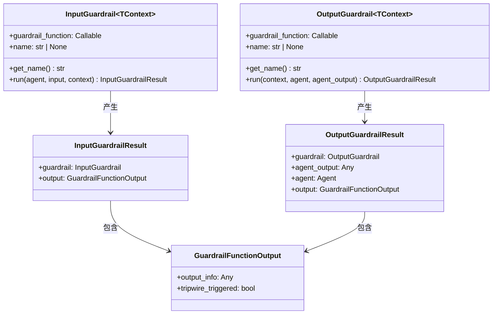
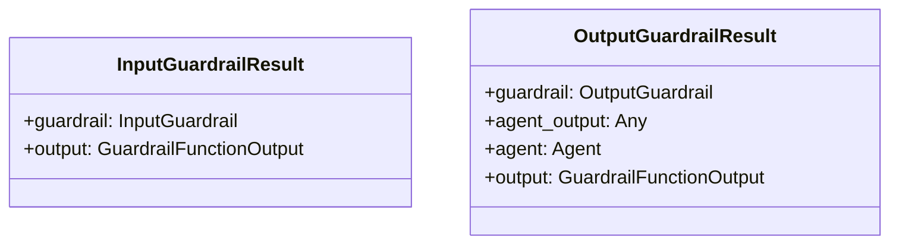
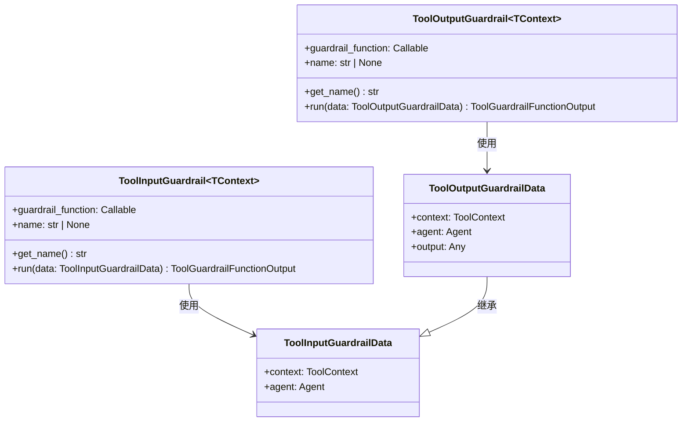
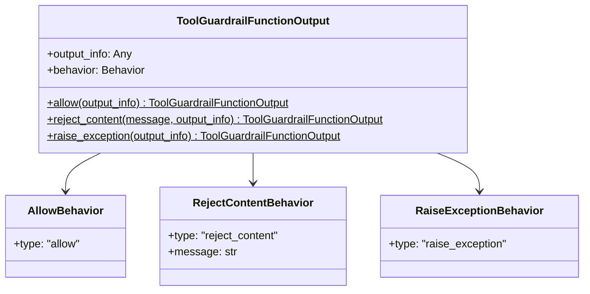
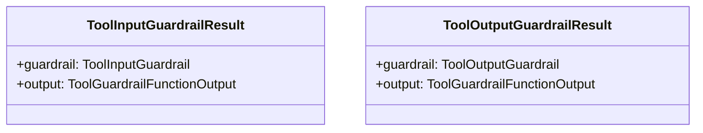
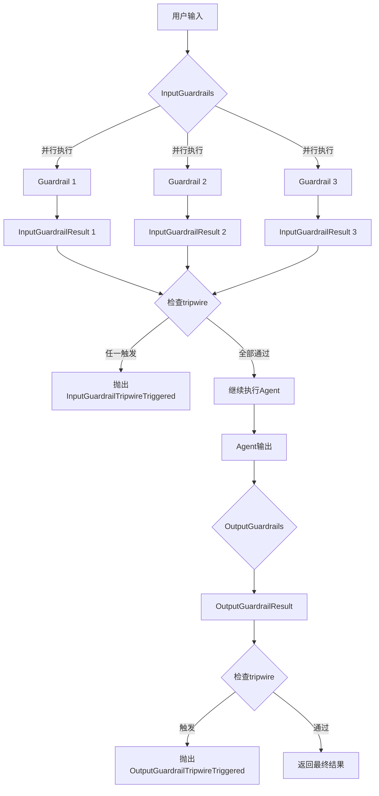
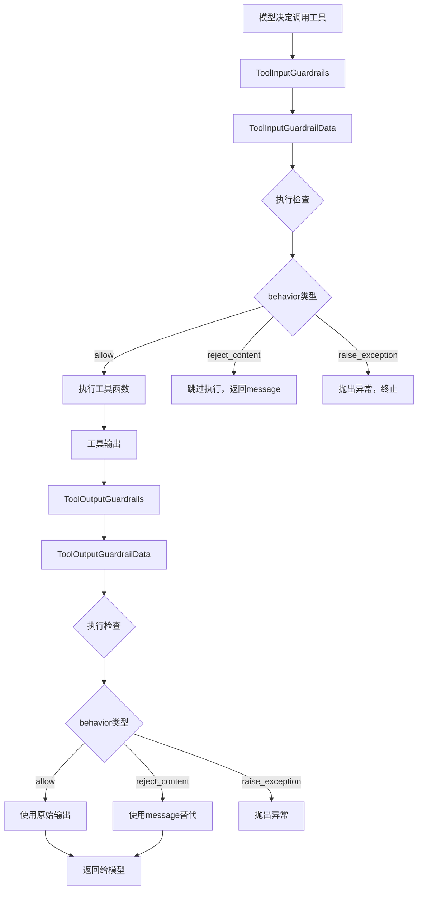
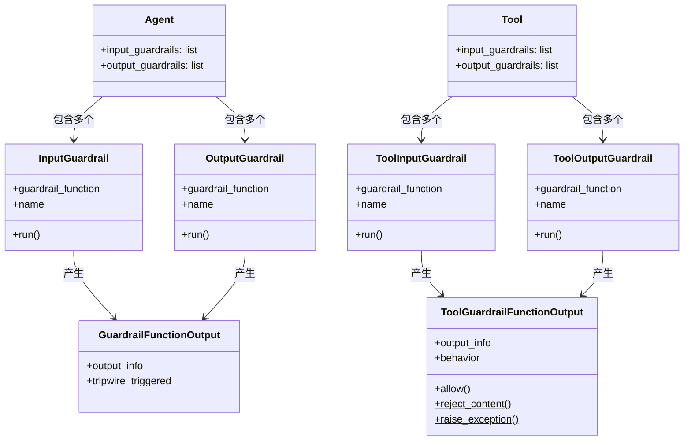

# OpenAI Agents Python SDK - Guardrails 模块数据结构详解

## 1. 数据结构总览

Guardrails 模块的数据结构定义了防护栏的输入输出格式、检查结果和行为控制。核心数据结构包括防护栏定义、执行结果和行为策略。

### 数据结构层次

```
Agent级防护
├── InputGuardrail (输入防护)
│   ├── guardrail_function
│   └── name
├── OutputGuardrail (输出防护)
│   ├── guardrail_function
│   └── name
└── GuardrailFunctionOutput (结果)
    ├── output_info
    └── tripwire_triggered

Tool级防护
├── ToolInputGuardrail (工具输入防护)
├── ToolOutputGuardrail (工具输出防护)
└── ToolGuardrailFunctionOutput (结果)
    ├── output_info
    └── behavior (allow/reject/raise)
```

## 2. Agent级防护数据结构

### 2.1 InputGuardrail 类



**InputGuardrail 字段详解：**

| 字段 | 类型 | 说明 | 示例 |
|------|------|------|------|
| `guardrail_function` | `Callable` | 防护函数，接收上下文、Agent和输入 | `func(ctx, agent, input)` |
| `name` | `str \| None` | 防护栏名称，用于追踪 | `"content_moderation"` |

**方法说明：**

```python
def get_name(self) -> str:
    """获取防护栏名称，优先使用name字段，否则使用函数名"""
    if self.name:
        return self.name
    return self.guardrail_function.__name__

async def run(
    self,
    agent: Agent,
    input: str | list[TResponseInputItem],
    context: RunContextWrapper[TContext]
) -> InputGuardrailResult:
    """执行防护检查"""
    output = self.guardrail_function(context, agent, input)
    if inspect.isawaitable(output):
        output = await output
    
    return InputGuardrailResult(
        guardrail=self,
        output=output
    )
```

### 2.2 GuardrailFunctionOutput 结构

```python
@dataclass
class GuardrailFunctionOutput:
    """防护函数的输出"""
    
    output_info: Any
    """检查结果的详细信息，可以是任意类型的数据"""
    
    tripwire_triggered: bool
    """是否触发熔断，True时终止Agent执行"""
```

**字段说明：**

| 字段 | 类型 | 用途 | 示例值 |
|------|------|------|--------|
| `output_info` | `Any` | 存储检查的详细结果 | `{"reason": "off-topic", "score": 0.95}` |
| `tripwire_triggered` | `bool` | 决定是否终止执行 | `True` = 终止, `False` = 继续 |

**使用模式：**

```python
# 模式1: 通过检查
GuardrailFunctionOutput(
    output_info={"status": "ok", "checks_passed": 5},
    tripwire_triggered=False
)

# 模式2: 触发熔断
GuardrailFunctionOutput(
    output_info={"reason": "inappropriate_content", "severity": "high"},
    tripwire_triggered=True
)

# 模式3: 带详细分析
GuardrailFunctionOutput(
    output_info={
        "moderation_scores": {
            "toxicity": 0.1,
            "profanity": 0.05,
            "threat": 0.02
        },
        "flagged_categories": []
    },
    tripwire_triggered=False
)
```

### 2.3 InputGuardrailResult 和 OutputGuardrailResult



**InputGuardrailResult 字段：**

| 字段 | 类型 | 说明 |
|------|------|------|
| `guardrail` | `InputGuardrail` | 执行的防护栏对象 |
| `output` | `GuardrailFunctionOutput` | 防护函数的输出 |

**OutputGuardrailResult 字段：**

| 字段 | 类型 | 说明 |
|------|------|------|
| `guardrail` | `OutputGuardrail` | 执行的防护栏对象 |
| `agent_output` | `Any` | 被检查的Agent输出 |
| `agent` | `Agent` | 执行的Agent |
| `output` | `GuardrailFunctionOutput` | 防护函数的输出 |

## 3. Tool级防护数据结构

### 3.1 ToolInputGuardrail 和 ToolOutputGuardrail



**字段说明：**

| 字段 | 类型 | 说明 |
|------|------|------|
| `guardrail_function` | `Callable` | 防护逻辑函数 |
| `name` | `str \| None` | 防护栏名称 |

### 3.2 ToolInputGuardrailData 和 ToolOutputGuardrailData

```python
@dataclass
class ToolInputGuardrailData:
    """工具输入防护数据"""
    
    context: ToolContext[Any]
    """工具上下文，包含工具名称、参数、调用ID等"""
    
    agent: Agent[Any]
    """执行工具的Agent"""

@dataclass
class ToolOutputGuardrailData(ToolInputGuardrailData):
    """工具输出防护数据（扩展输入数据）"""
    
    output: Any
    """工具函数的输出结果"""
```

**ToolContext 结构：**

```python
class ToolContext:
    tool_name: str  # 工具名称
    call_id: str  # 工具调用ID
    args: dict  # 工具参数
    # 其他上下文信息
```

**使用示例：**

```python
# 在防护函数中访问数据
@tool_input_guardrail
def check_file_access(data: ToolInputGuardrailData):
    tool_name = data.context.tool_name
    file_path = data.context.args.get("path")
    user_id = data.agent.context.get("user_id")
    
    # 执行检查逻辑
    ...

@tool_output_guardrail
def filter_output(data: ToolOutputGuardrailData):
    original_output = data.output
    tool_name = data.context.tool_name
    
    # 过滤输出
    ...
```

### 3.3 ToolGuardrailFunctionOutput 结构



**字段详解：**

| 字段 | 类型 | 说明 |
|------|------|------|
| `output_info` | `Any` | 检查结果详情 |
| `behavior` | `Behavior` | 行为策略（allow/reject/raise） |

### 3.4 行为策略类型

```python
class AllowBehavior(TypedDict):
    """允许工具正常执行"""
    type: Literal["allow"]

class RejectContentBehavior(TypedDict):
    """拒绝工具调用，但继续执行"""
    type: Literal["reject_content"]
    message: str  # 返回给模型的消息

class RaiseExceptionBehavior(TypedDict):
    """抛出异常，终止执行"""
    type: Literal["raise_exception"]
```

**行为策略对比：**

| 策略 | 行为 | 使用场景 | 对执行的影响 |
|------|------|---------|------------|
| `allow` | 允许继续 | 检查通过 | 无影响，正常执行 |
| `reject_content` | 拒绝但继续 | 参数不合法，但可恢复 | 向模型返回错误消息，继续对话 |
| `raise_exception` | 抛出异常 | 严重安全问题 | 终止整个运行流程 |

**工厂方法使用：**

```python
# 方法1: 允许
ToolGuardrailFunctionOutput.allow(
    output_info={"status": "ok"}
)

# 方法2: 拒绝但继续
ToolGuardrailFunctionOutput.reject_content(
    message="Parameter 'amount' must be positive",
    output_info={"amount": -100, "valid": False}
)

# 方法3: 抛出异常
ToolGuardrailFunctionOutput.raise_exception(
    output_info={"reason": "Unauthorized file access"}
)
```

## 4. 防护结果数据结构

### 4.1 ToolInputGuardrailResult 和 ToolOutputGuardrailResult



**字段说明：**

| 结果类型 | 字段 | 类型 | 说明 |
|---------|------|------|------|
| **Input** | `guardrail` | `ToolInputGuardrail` | 执行的防护栏 |
| | `output` | `ToolGuardrailFunctionOutput` | 检查结果 |
| **Output** | `guardrail` | `ToolOutputGuardrail` | 执行的防护栏 |
| | `output` | `ToolGuardrailFunctionOutput` | 检查结果 |

## 5. 数据流转图

### 5.1 Agent级防护数据流



### 5.2 Tool级防护数据流



## 6. 完整的数据结构关系图



## 7. 最佳实践的数据结构模式

### 7.1 结构化检查结果

```python
# 模式1: 简单布尔结果
GuardrailFunctionOutput(
    output_info=None,
    tripwire_triggered=False
)

# 模式2: 带评分的结果
GuardrailFunctionOutput(
    output_info={
        "score": 0.85,
        "threshold": 0.9,
        "passed": True
    },
    tripwire_triggered=False
)

# 模式3: 详细的多维度检查
GuardrailFunctionOutput(
    output_info={
        "checks": {
            "length": {"passed": True, "value": 150, "max": 200},
            "toxicity": {"passed": True, "score": 0.1, "threshold": 0.5},
            "pii": {"passed": False, "detected": ["email"]}
        },
        "overall_passed": False
    },
    tripwire_triggered=True
)
```

### 7.2 行为策略组合

```python
# 场景1: 分级响应
@tool_input_guardrail
def tiered_security_check(data):
    risk_level = assess_risk(data)
    
    if risk_level == "low":
        return ToolGuardrailFunctionOutput.allow()
    elif risk_level == "medium":
        return ToolGuardrailFunctionOutput.reject_content(
            message="请提供额外验证",
            output_info={"risk": "medium"}
        )
    else:  # high
        return ToolGuardrailFunctionOutput.raise_exception(
            output_info={"risk": "high", "blocked": True}
        )
```

Guardrails 模块的数据结构通过清晰的层次设计和灵活的行为控制，为 OpenAI Agents 提供了完善的安全防护机制。

