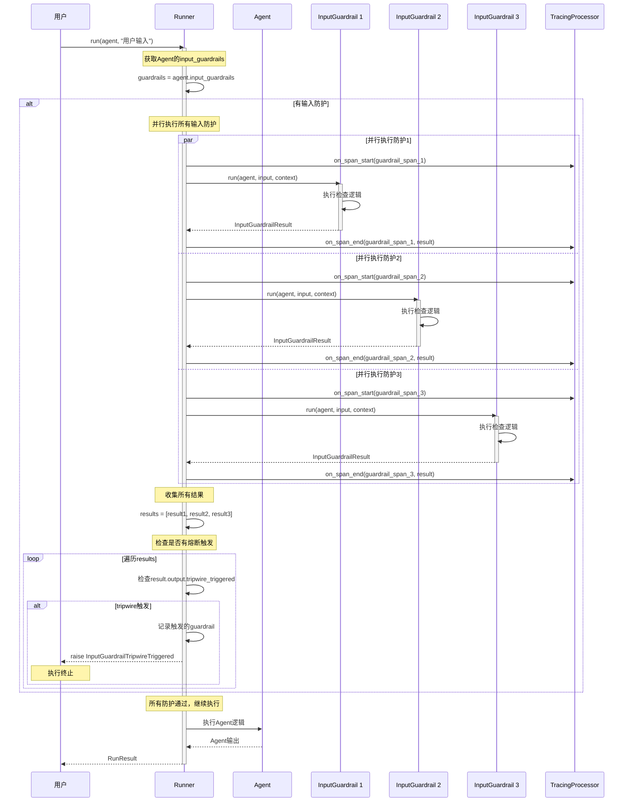
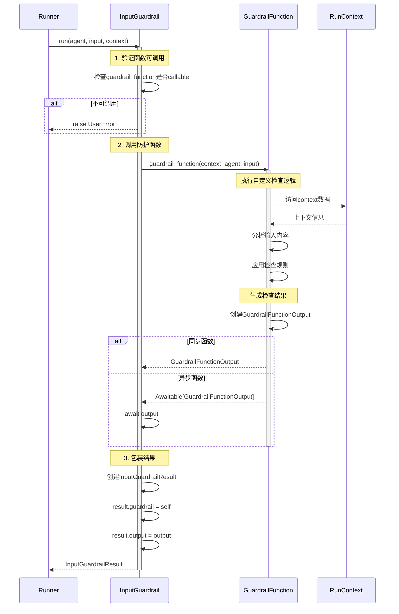
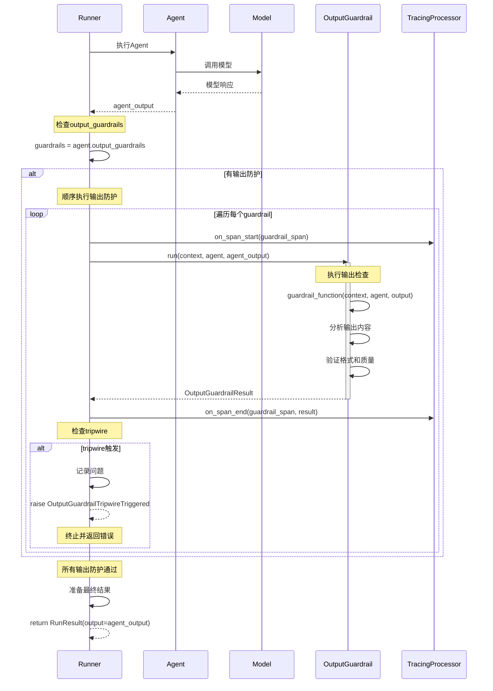
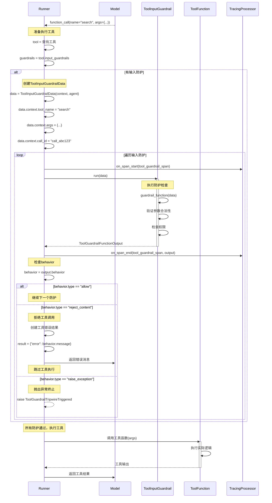
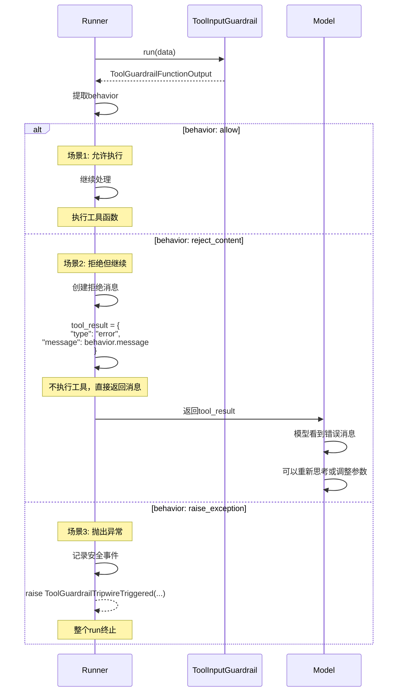
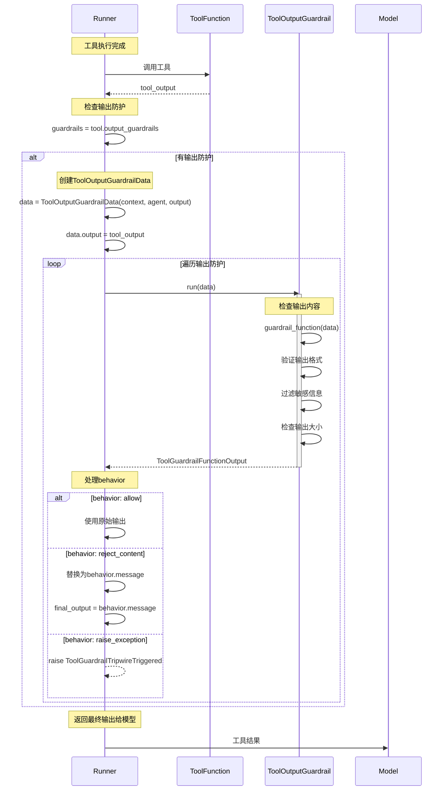
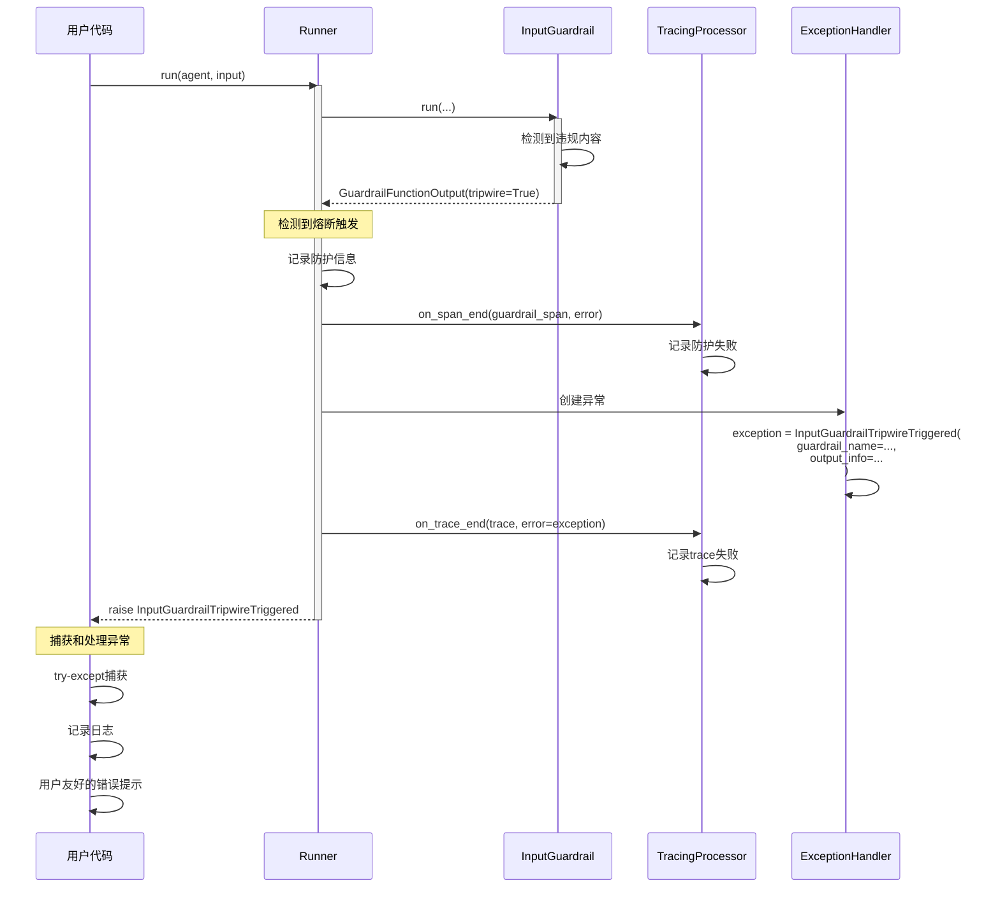
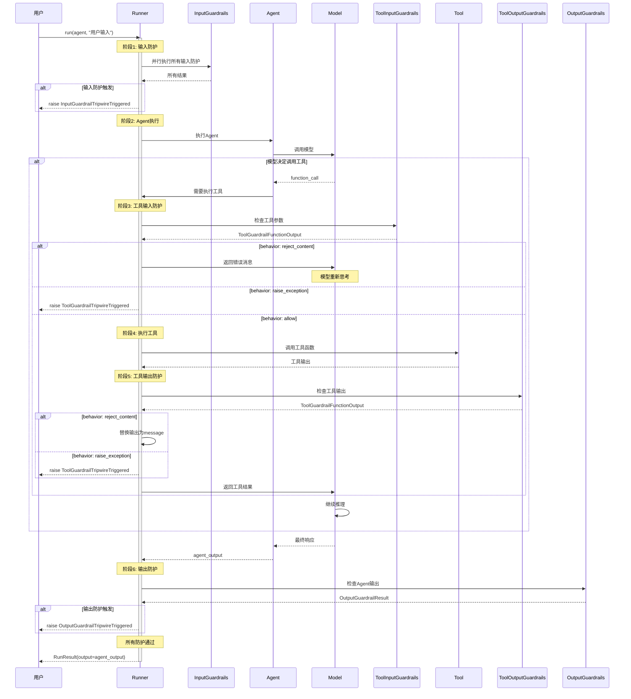
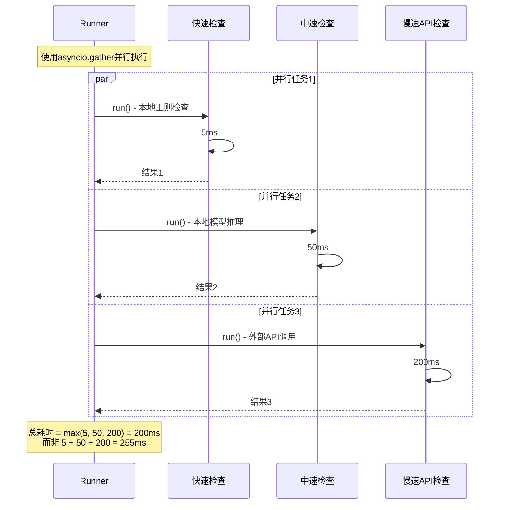

# OpenAI Agents Python SDK - Guardrails 模块时序图详解

## 1. 时序图总览

Guardrails 模块的时序图展示了防护栏在Agent和Tool执行过程中的介入时机和处理流程。核心流程包括：输入防护、输出防护、工具防护和异常处理。

### 主要时序流程

| 时序流程 | 参与者 | 触发时机 | 核心操作 |
|---------|--------|---------|---------|
| **输入防护执行** | Runner, InputGuardrails | Agent执行前 | 并行检查输入 |
| **输出防护执行** | Runner, OutputGuardrails | Agent执行后 | 验证输出质量 |
| **工具输入防护** | Runner, ToolInputGuardrails | 工具调用前 | 验证工具参数 |
| **工具输出防护** | Runner, ToolOutputGuardrails | 工具执行后 | 过滤工具输出 |

## 2. Agent级输入防护时序图

### 2.1 输入防护并行执行流程

**流程说明：**

1. **并行启动**：所有输入防护同时开始执行
2. **独立检查**：每个防护独立进行检查逻辑
3. **结果收集**：等待所有防护完成
4. **熔断检查**：任一防护触发熔断则终止
5. **继续执行**：全部通过则继续Agent执行

### 2.2 输入防护详细执行流程

**执行细节：**

1. **函数验证**：确保防护函数可调用
2. **函数调用**：支持同步和异步函数
3. **上下文访问**：防护函数可访问运行上下文
4. **结果包装**：标准化返回结果

## 3. Agent级输出防护时序图

### 3.1 输出防护执行流程

**流程特点：**

1. **执行时机**：Agent生成输出后
2. **顺序执行**：按防护栏顺序依次检查
3. **快速失败**：任一防护触发即终止
4. **结果返回**：全部通过则返回输出

## 4. Tool级输入防护时序图

### 4.1 工具输入防护完整流程

**关键决策点：**

1. **allow行为**：继续检查和执行
2. **reject_content行为**：跳过执行，返回消息
3. **raise_exception行为**：终止整个流程

### 4.2 工具输入防护行为处理

## 5. Tool级输出防护时序图

### 5.1 工具输出防护流程

**输出处理逻辑：**

1. **allow**：使用工具的原始输出
2. **reject_content**：用消息替换输出
3. **raise_exception**：终止执行

## 6. 防护栏异常处理时序图

### 6.1 熔断触发和异常传播

**异常处理流程：**

1. **检测触发**：发现tripwire=True
2. **记录追踪**：在trace中记录失败
3. **创建异常**：包含详细信息
4. **传播异常**：向上层抛出
5. **用户处理**：在应用层捕获处理

## 7. 完整的防护执行时序图（端到端）

### 7.1 包含所有防护层的完整流程

**完整流程总结：**

1. **输入防护**：Agent执行前的第一道防线
2. **Agent执行**：核心逻辑执行
3. **工具输入防护**：每个工具调用前检查
4. **工具执行**：实际工具功能
5. **工具输出防护**：工具结果后处理
6. **输出防护**：最终结果验证

## 8. 防护栏性能优化时序图

### 8.1 并行执行优化

**优化策略：**

1. **并行执行**：所有输入防护同时开始
2. **快速失败**：任一触发立即终止
3. **缓存结果**：重复检查使用缓存
4. **异步I/O**：API调用不阻塞

Guardrails 模块通过精心设计的时序流程和多层防护机制，为 OpenAI Agents 提供了全面的安全保护能力，确保系统的可靠性和合规性。

