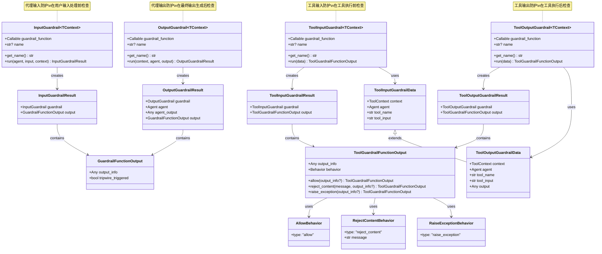
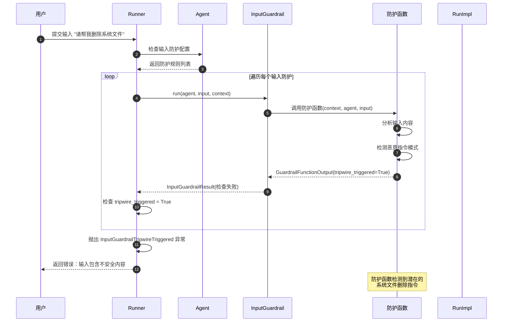
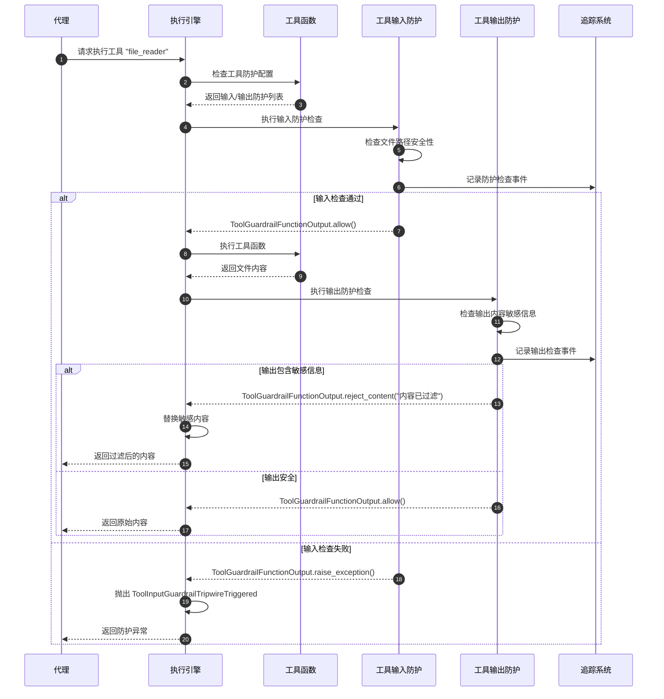
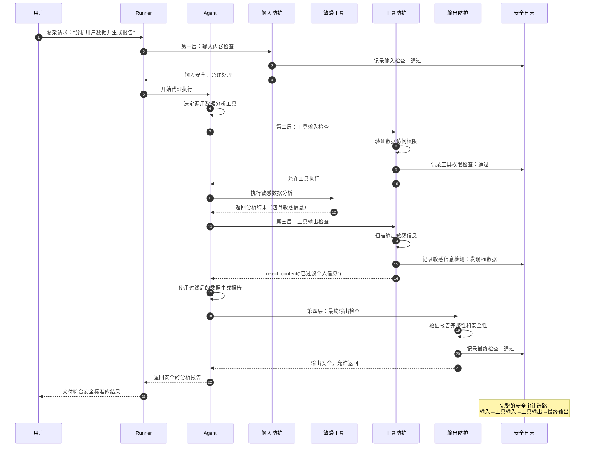

# OpenAI Agents Python SDK - Guardrails 模块概览

## 1. 模块职责与边界

Guardrails 模块是 OpenAI Agents Python SDK 的安全防护核心，负责在智能代理执行过程中实施多层次的安全检查和内容过滤。该模块通过灵活的防护机制确保代理行为符合安全规范，保护系统和用户免受潜在风险。

### 核心职责

- **多层次防护**：提供输入、输出、工具等多个层面的安全检查
- **内容过滤**：检测和过滤不当内容、敏感信息、恶意输入
- **行为控制**：根据安全检查结果控制代理执行流程
- **异常处理**：处理安全违规情况，提供明确的错误信息
- **灵活配置**：支持自定义安全规则和检查逻辑
- **追踪集成**：与可观测性系统集成，记录安全事件

### 安全防护体系

| 防护层级 | 防护类型 | 触发时机 | 主要功能 |
|----------|----------|----------|----------|
| 代理级别 | `InputGuardrail` | 代理接收输入前 | 检查用户输入的安全性和合规性 |
| 代理级别 | `OutputGuardrail` | 代理生成输出后 | 验证最终输出的安全性 |
| 工具级别 | `ToolInputGuardrail` | 工具执行前 | 检查工具调用参数的安全性 |
| 工具级别 | `ToolOutputGuardrail` | 工具执行后 | 验证工具输出结果的安全性 |

### 安全行为策略

| 行为类型 | 行为标识 | 执行动作 | 使用场景 |
|----------|----------|----------|----------|
| 允许执行 | `allow` | 正常继续执行 | 内容通过安全检查 |
| 拒绝内容 | `reject_content` | 替换内容但继续执行 | 内容需要过滤但不严重 |
| 异常终止 | `raise_exception` | 抛出异常停止执行 | 严重安全违规 |

### 输入输出接口

**输入：**
- 检查内容（用户输入、代理输出、工具参数等）
- 执行上下文（`RunContextWrapper`、`ToolContext`）
- 代理实例（`Agent`）
- 配置参数

**输出：**
- 检查结果（`GuardrailResult`）
- 行为指令（`allow`、`reject_content`、`raise_exception`）
- 详细信息（检查过程、违规原因等）

### 上下游依赖关系

**上游调用者：**
- `RunImpl`：代理执行引擎集成安全检查
- `Agent`：代理配置中的安全防护规则
- `FunctionTool`：工具级别的安全检查

**下游依赖：**
- `exceptions`：安全违规异常定义
- `tracing`：安全事件追踪记录
- `run_context`：执行上下文信息
- `tool_context`：工具执行上下文

## 2. 模块架构图

```mermaid
flowchart TB
    subgraph "Guardrails 安全防护模块"
        subgraph "代理级防护"
            INPUTGUARD[InputGuardrail]
            OUTPUTGUARD[OutputGuardrail]
            INPUTRESULT[InputGuardrailResult]
            OUTPUTRESULT[OutputGuardrailResult]
        end
        
        subgraph "工具级防护"
            TOOLINPUTGUARD[ToolInputGuardrail]
            TOOLOUTPUTGUARD[ToolOutputGuardrail]
            TOOLINPUTRESULT[ToolInputGuardrailResult]
            TOOLOUTPUTRESULT[ToolOutputGuardrailResult]
        end
        
        subgraph "防护输出"
            GUARDRAILOUTPUT[GuardrailFunctionOutput]
            TOOLGUARDRAILOUTPUT[ToolGuardrailFunctionOutput]
        end
        
        subgraph "行为策略"
            ALLOWBEHAVIOR[AllowBehavior]
            REJECTBEHAVIOR[RejectContentBehavior]
            EXCEPTIONBEHAVIOR[RaiseExceptionBehavior]
        end
        
        subgraph "装饰器接口"
            INPUTDECORATOR[@input_guardrail]
            OUTPUTDECORATOR[@output_guardrail]
            TOOLINPUTDECORATOR[@tool_input_guardrail]
            TOOLOUTPUTDECORATOR[@tool_output_guardrail]
        end
        
        subgraph "数据容器"
            TOOLINPUTDATA[ToolInputGuardrailData]
            TOOLOUTPUTDATA[ToolOutputGuardrailData]
        end
    end
    
    subgraph "执行集成"
        RUNIMPL[执行引擎]
        AGENT[Agent 代理]
        FUNCTIONTOOL[FunctionTool 工具]
    end
    
    subgraph "支撑系统"
        EXCEPTIONS[exceptions 异常系统]
        TRACING[tracing 追踪系统]
        RUNCONTEXT[run_context 执行上下文]
        TOOLCONTEXT[tool_context 工具上下文]
    end
    
    INPUTGUARD --> INPUTRESULT
    OUTPUTGUARD --> OUTPUTRESULT
    TOOLINPUTGUARD --> TOOLINPUTRESULT
    TOOLOUTPUTGUARD --> TOOLOUTPUTRESULT
    
    INPUTRESULT --> GUARDRAILOUTPUT
    OUTPUTRESULT --> GUARDRAILOUTPUT
    TOOLINPUTRESULT --> TOOLGUARDRAILOUTPUT
    TOOLOUTPUTRESULT --> TOOLGUARDRAILOUTPUT
    
    TOOLGUARDRAILOUTPUT --> ALLOWBEHAVIOR
    TOOLGUARDRAILOUTPUT --> REJECTBEHAVIOR
    TOOLGUARDRAILOUTPUT --> EXCEPTIONBEHAVIOR
    
    INPUTDECORATOR --> INPUTGUARD
    OUTPUTDECORATOR --> OUTPUTGUARD
    TOOLINPUTDECORATOR --> TOOLINPUTGUARD
    TOOLOUTPUTDECORATOR --> TOOLOUTPUTGUARD
    
    TOOLINPUTGUARD --> TOOLINPUTDATA
    TOOLOUTPUTGUARD --> TOOLOUTPUTDATA
    
    RUNIMPL --> INPUTGUARD
    RUNIMPL --> OUTPUTGUARD
    AGENT --> INPUTGUARD
    AGENT --> OUTPUTGUARD
    FUNCTIONTOOL --> TOOLINPUTGUARD
    FUNCTIONTOOL --> TOOLOUTPUTGUARD
    
    INPUTGUARD --> EXCEPTIONS
    OUTPUTGUARD --> EXCEPTIONS
    TOOLINPUTGUARD --> EXCEPTIONS
    TOOLOUTPUTGUARD --> EXCEPTIONS
    
    INPUTGUARD --> TRACING
    OUTPUTGUARD --> TRACING
    TOOLINPUTGUARD --> TRACING
    TOOLOUTPUTGUARD --> TRACING
    
    INPUTGUARD --> RUNCONTEXT
    OUTPUTGUARD --> RUNCONTEXT
    TOOLINPUTGUARD --> TOOLCONTEXT
    TOOLOUTPUTGUARD --> TOOLCONTEXT
    
    style INPUTGUARD fill:#e1f5fe
    style TOOLINPUTGUARD fill:#f3e5f5
    style ALLOWBEHAVIOR fill:#e8f5e8
    style REJECTBEHAVIOR fill:#fff3e0
    style EXCEPTIONBEHAVIOR fill:#ffebee
```

**架构说明：**

### 分层防护设计

1. **代理级防护**：在代理输入输出层面进行安全检查
2. **工具级防护**：在具体工具执行层面进行精细化控制
3. **行为策略层**：定义安全检查后的执行策略
4. **装饰器接口**：提供简洁的函数装饰器接口

### 防护时机控制

- **输入防护**：在代理接收用户输入时触发
- **输出防护**：在代理生成最终输出时触发
- **工具输入防护**：在工具函数执行前触发
- **工具输出防护**：在工具函数执行后触发

### 集成点设计

- **执行引擎集成**：`RunImpl` 在关键节点调用防护检查
- **代理配置集成**：`Agent` 支持配置多个防护规则
- **工具集成**：`FunctionTool` 支持工具级的安全防护

### 扩展能力

- **自定义防护**：通过装饰器或直接实例化添加自定义规则
- **行为定制**：支持灵活的防护后行为策略
- **数据丰富**：防护结果可包含详细的检查信息

## 3. 关键算法与流程剖析

### 3.1 输入防护执行算法

```python
class InputGuardrail(Generic[TContext]):
    """输入防护的核心实现"""
    
    async def run(
        self,
        agent: Agent[Any],
        input: str | list[TResponseInputItem],
        context: RunContextWrapper[TContext],
    ) -> InputGuardrailResult:
        """执行输入安全检查"""
        
        # 1) 验证防护函数可调用
        if not callable(self.guardrail_function):
            raise UserError(f"Guardrail function must be callable, got {self.guardrail_function}")
        
        # 2) 调用防护函数，传递上下文、代理和输入
        output = self.guardrail_function(context, agent, input)
        
        # 3) 处理异步防护函数
        if inspect.isawaitable(output):
            return InputGuardrailResult(
                guardrail=self,
                output=await output,
            )
        
        # 4) 处理同步防护函数
        return InputGuardrailResult(
            guardrail=self,
            output=output,
        )
```

**算法目的：** 在代理处理用户输入前进行安全检查，确保输入内容符合安全规范。

**执行特点：**
1. **函数验证**：确保防护函数是可调用的
2. **上下文传递**：将完整的执行上下文传递给防护函数
3. **异步支持**：同时支持同步和异步防护函数
4. **结果封装**：将防护结果封装为结构化对象

### 3.2 工具防护执行算法

```python
async def _execute_input_guardrails(
    cls,
    *,
    func_tool: FunctionTool,
    tool_context: ToolContext[TContext],
    agent: Agent[TContext],
    tool_input_guardrail_results: list[ToolInputGuardrailResult],
) -> str | None:
    """工具输入防护执行算法"""
    
    if not func_tool.tool_input_guardrails:
        return None  # 无防护规则时直接通过
    
    # 遍历所有防护规则
    for guardrail in func_tool.tool_input_guardrails:
        # 1) 执行防护检查
        gr_out = await guardrail.run(
            ToolInputGuardrailData(
                context=tool_context,
                agent=agent,
            )
        )
        
        # 2) 记录防护结果
        tool_input_guardrail_results.append(
            ToolInputGuardrailResult(
                guardrail=guardrail,
                output=gr_out,
            )
        )
        
        # 3) 根据行为类型处理结果
        if gr_out.behavior["type"] == "raise_exception":
            # 抛出异常终止执行
            raise ToolInputGuardrailTripwireTriggered(guardrail=guardrail, output=gr_out)
        elif gr_out.behavior["type"] == "reject_content":
            # 拒绝内容但返回替代消息
            return gr_out.behavior["message"]
        elif gr_out.behavior["type"] == "allow":
            # 允许执行，继续下一个防护检查
            continue
    
    return None  # 所有检查通过
```

**算法目的：** 在工具执行前进行安全检查，根据检查结果决定是否允许工具执行。

**防护策略分析：**
1. **顺序检查**：按配置顺序执行每个防护规则
2. **结果记录**：记录所有防护检查的结果用于追踪
3. **行为分发**：根据防护结果选择相应的执行策略
4. **短路机制**：遇到异常或拒绝时立即返回

### 3.3 防护行为处理算法

```python
@dataclass
class ToolGuardrailFunctionOutput:
    """工具防护输出的行为处理"""
    
    @classmethod
    def allow(cls, output_info: Any = None) -> ToolGuardrailFunctionOutput:
        """创建允许执行的防护输出"""
        return cls(output_info=output_info, behavior=AllowBehavior(type="allow"))
    
    @classmethod
    def reject_content(cls, message: str, output_info: Any = None) -> ToolGuardrailFunctionOutput:
        """创建拒绝内容的防护输出"""
        return cls(
            output_info=output_info,
            behavior=RejectContentBehavior(type="reject_content", message=message),
        )
    
    @classmethod
    def raise_exception(cls, output_info: Any = None) -> ToolGuardrailFunctionOutput:
        """创建异常终止的防护输出"""
        return cls(
            output_info=output_info,
            behavior=RaiseExceptionBehavior(type="raise_exception"),
        )

# 使用示例
def content_safety_guardrail(data: ToolInputGuardrailData) -> ToolGuardrailFunctionOutput:
    """内容安全防护示例"""
    tool_input = data.tool_input
    
    # 检查敏感词汇
    sensitive_words = ["password", "secret", "token"]
    if any(word in str(tool_input).lower() for word in sensitive_words):
        return ToolGuardrailFunctionOutput.reject_content(
            message="输入包含敏感信息，已被过滤",
            output_info={"filtered_words": sensitive_words}
        )
    
    # 检查恶意代码
    malicious_patterns = ["rm -rf", "del /", "__import__"]
    if any(pattern in str(tool_input) for pattern in malicious_patterns):
        return ToolGuardrailFunctionOutput.raise_exception(
            output_info={"reason": "检测到潜在恶意代码"}
        )
    
    # 通过检查
    return ToolGuardrailFunctionOutput.allow(
        output_info={"check_status": "passed"}
    )
```

**算法目的：** 提供灵活的防护行为策略，支持不同严重程度的安全违规处理。

**行为策略特点：**
1. **分级处理**：根据违规严重程度选择不同处理方式
2. **信息保留**：记录详细的检查过程和结果信息
3. **用户友好**：拒绝内容时提供替代消息而非直接失败
4. **安全优先**：严重违规时立即终止执行保护系统

### 3.4 防护集成执行流程

```python
async def run_with_guardrails(
    agent: Agent[TContext],
    input: str | list[TResponseInputItem],
    context: RunContextWrapper[TContext]
) -> Any:
    """带防护的代理执行流程"""
    
    # 1) 执行输入防护
    if agent.input_guardrails:
        for guardrail in agent.input_guardrails:
            result = await guardrail.run(agent, input, context)
            
            if result.output.tripwire_triggered:
                raise InputGuardrailTripwireTriggered(
                    guardrail_name=guardrail.get_name(),
                    failure_reason="输入安全检查失败",
                    agent=agent
                )
    
    # 2) 执行代理主逻辑
    agent_output = await execute_agent_logic(agent, input, context)
    
    # 3) 执行输出防护
    if agent.output_guardrails:
        for guardrail in agent.output_guardrails:
            result = await guardrail.run(context, agent, agent_output)
            
            if result.output.tripwire_triggered:
                raise OutputGuardrailTripwireTriggered(
                    guardrail_name=guardrail.get_name(),
                    failure_reason="输出安全检查失败",
                    agent=agent
                )
    
    return agent_output
```

**流程目的：** 在代理执行的关键节点集成安全防护，确保全流程的安全性。

**集成策略要点：**
1. **前置检查**：在代理处理前检查输入安全性
2. **后置验证**：在输出生成后验证结果安全性
3. **异常处理**：安全违规时抛出明确的异常信息
4. **追踪集成**：记录所有防护检查过程用于审计

## 4. 数据结构与UML图



**类图说明：**

### 防护类型层次

1. **代理级防护**：`InputGuardrail` 和 `OutputGuardrail` 处理代理层面的安全检查
2. **工具级防护**：`ToolInputGuardrail` 和 `ToolOutputGuardrail` 处理工具层面的安全检查
3. **结果封装**：各种 `Result` 类封装防护检查的完整结果
4. **行为策略**：三种行为类型定义防护后的执行策略

### 数据流转关系

- **防护执行**：防护类调用防护函数，生成防护输出
- **结果包装**：防护输出被包装为结果对象，包含上下文信息
- **行为决策**：根据防护输出中的行为策略决定后续执行
- **数据传递**：工具防护使用专门的数据容器传递执行信息

### 扩展性设计

- **泛型支持**：所有防护类都支持泛型上下文类型
- **函数接口**：防护逻辑通过函数接口实现，便于自定义
- **装饰器包装**：提供装饰器接口简化防护规则的定义

## 5. 典型使用场景时序图

### 场景一：代理输入防护检查



### 场景二：工具执行防护流程



### 场景三：多层防护协同工作



## 6. 最佳实践与使用模式

### 6.1 输入内容安全防护

```python
from agents import Agent, input_guardrail
import re

@input_guardrail
def content_safety_check(context, agent, user_input):
    """综合内容安全检查"""
    input_text = str(user_input).lower()
    
    # 1. 检查恶意指令
    malicious_patterns = [
        r'rm\s+-rf',           # 删除命令
        r'del\s+/[sq]',        # Windows删除
        r'format\s+c:',        # 格式化硬盘
        r'shutdown\s+',        # 关机命令
        r'__import__\s*\(',    # Python导入
    ]
    
    for pattern in malicious_patterns:
        if re.search(pattern, input_text):
            return GuardrailFunctionOutput(
                output_info={"detected_pattern": pattern, "risk_level": "high"},
                tripwire_triggered=True
            )
    
    # 2. 检查敏感信息
    sensitive_patterns = [
        r'\b\d{4}[\s-]?\d{4}[\s-]?\d{4}[\s-]?\d{4}\b',  # 信用卡号
        r'\b\d{3}-\d{2}-\d{4}\b',                        # 社会安全号
        r'[a-zA-Z0-9._%+-]+@[a-zA-Z0-9.-]+\.[a-zA-Z]{2,}',  # 邮箱地址
    ]
    
    detected_sensitive = []
    for pattern in sensitive_patterns:
        matches = re.findall(pattern, input_text)
        if matches:
            detected_sensitive.extend(matches)
    
    if detected_sensitive:
        return GuardrailFunctionOutput(
            output_info={
                "sensitive_data": detected_sensitive,
                "warning": "输入包含敏感信息"
            },
            tripwire_triggered=True
        )
    
    # 3. 检查内容长度
    if len(input_text) > 10000:
        return GuardrailFunctionOutput(
            output_info={"input_length": len(input_text), "max_allowed": 10000},
            tripwire_triggered=True
        )
    
    # 通过所有检查
    return GuardrailFunctionOutput(
        output_info={"status": "safe", "checks_passed": ["malicious", "sensitive", "length"]},
        tripwire_triggered=False
    )

# 使用安全防护的代理
secure_agent = Agent(
    name="SecureAssistant",
    instructions="你是一个安全的AI助手，严格遵守安全规范。",
    input_guardrails=[content_safety_check]
)
```

### 6.2 输出内容过滤防护

```python
from agents import output_guardrail
import json

@output_guardrail
def output_content_filter(context, agent, agent_output):
    """输出内容过滤和净化"""
    output_text = str(agent_output)
    
    # 1. 敏感信息过滤
    import re
    
    # 过滤信用卡号
    output_text = re.sub(
        r'\b\d{4}[\s-]?\d{4}[\s-]?\d{4}[\s-]?\d{4}\b', 
        '[CREDIT_CARD_REDACTED]', 
        output_text
    )
    
    # 过滤电话号码
    output_text = re.sub(
        r'\b\d{3}[-.]?\d{3}[-.]?\d{4}\b',
        '[PHONE_REDACTED]',
        output_text
    )
    
    # 过滤IP地址
    output_text = re.sub(
        r'\b(?:\d{1,3}\.){3}\d{1,3}\b',
        '[IP_REDACTED]',
        output_text
    )
    
    # 2. 检查是否包含不当内容
    inappropriate_keywords = [
        "violence", "hate", "discrimination", 
        "illegal", "harmful", "dangerous"
    ]
    
    found_inappropriate = [
        word for word in inappropriate_keywords 
        if word in output_text.lower()
    ]
    
    if found_inappropriate:
        return GuardrailFunctionOutput(
            output_info={
                "inappropriate_content": found_inappropriate,
                "action": "content_blocked"
            },
            tripwire_triggered=True
        )
    
    # 3. 检查输出质量
    if len(output_text.strip()) < 10:
        return GuardrailFunctionOutput(
            output_info={"issue": "output_too_short", "length": len(output_text)},
            tripwire_triggered=True
        )
    
    # 输出安全且经过过滤
    return GuardrailFunctionOutput(
        output_info={
            "filtered": output_text != str(agent_output),
            "quality_check": "passed"
        },
        tripwire_triggered=False
    )

# 应用输出过滤
filtered_agent = Agent(
    name="FilteredAssistant", 
    instructions="提供有用信息，确保输出安全。",
    output_guardrails=[output_content_filter]
)
```

### 6.3 工具级精细化防护

```python
from agents import function_tool, tool_input_guardrail, tool_output_guardrail

@tool_input_guardrail
def file_access_guardrail(data):
    """文件访问工具的输入防护"""
    tool_input = json.loads(data.tool_input) if data.tool_input else {}
    file_path = tool_input.get("file_path", "")
    
    # 1. 路径安全检查
    if ".." in file_path or file_path.startswith("/"):
        return ToolGuardrailFunctionOutput.raise_exception(
            output_info={"reason": "路径遍历攻击检测", "path": file_path}
        )
    
    # 2. 文件类型白名单
    allowed_extensions = [".txt", ".json", ".csv", ".md", ".log"]
    if not any(file_path.endswith(ext) for ext in allowed_extensions):
        return ToolGuardrailFunctionOutput.reject_content(
            message=f"不允许访问该类型文件：{file_path}",
            output_info={"allowed_extensions": allowed_extensions}
        )
    
    # 3. 文件大小预检查
    import os
    if os.path.exists(file_path) and os.path.getsize(file_path) > 10 * 1024 * 1024:  # 10MB
        return ToolGuardrailFunctionOutput.reject_content(
            message="文件过大，拒绝访问",
            output_info={"file_size": os.path.getsize(file_path), "max_size": 10*1024*1024}
        )
    
    return ToolGuardrailFunctionOutput.allow(
        output_info={"security_check": "passed", "file_path": file_path}
    )

@tool_output_guardrail
def file_content_filter(data):
    """文件内容输出防护"""
    output_content = str(data.output)
    
    # 1. 敏感信息检测
    sensitive_patterns = {
        "api_key": r'api[_-]?key\s*[:=]\s*["\']?([a-zA-Z0-9_-]+)["\']?',
        "password": r'password\s*[:=]\s*["\']?([^"\'\s]+)["\']?',
        "token": r'token\s*[:=]\s*["\']?([a-zA-Z0-9_.-]+)["\']?',
    }
    
    detected_secrets = {}
    filtered_content = output_content
    
    for secret_type, pattern in sensitive_patterns.items():
        matches = re.findall(pattern, output_content, re.IGNORECASE)
        if matches:
            detected_secrets[secret_type] = len(matches)
            filtered_content = re.sub(pattern, f'{secret_type.upper()}_REDACTED', filtered_content, flags=re.IGNORECASE)
    
    # 2. 如果检测到敏感信息，返回过滤后的内容
    if detected_secrets:
        return ToolGuardrailFunctionOutput.reject_content(
            message=filtered_content,
            output_info={
                "secrets_detected": detected_secrets,
                "action": "content_filtered"
            }
        )
    
    # 3. 内容长度控制
    if len(output_content) > 50000:  # 50KB
        truncated_content = output_content[:50000] + "\n[内容已截断...]"
        return ToolGuardrailFunctionOutput.reject_content(
            message=truncated_content,
            output_info={"reason": "content_truncated", "original_length": len(output_content)}
        )
    
    return ToolGuardrailFunctionOutput.allow(
        output_info={"content_check": "passed", "length": len(output_content)}
    )

@function_tool(
    tool_input_guardrails=[file_access_guardrail],
    tool_output_guardrails=[file_content_filter]
)
def secure_file_reader(file_path: str) -> str:
    """安全的文件读取工具"""
    try:
        with open(file_path, 'r', encoding='utf-8') as f:
            return f.read()
    except Exception as e:
        return f"文件读取失败：{str(e)}"
```

### 6.4 多层次防护策略配置

```python
from agents import Agent, Runner, RunConfig

class SecurityConfig:
    """安全配置管理类"""
    
    @staticmethod
    def create_high_security_agent(name: str, instructions: str) -> Agent:
        """创建高安全级别的代理"""
        
        # 严格的输入防护
        @input_guardrail
        def strict_input_check(context, agent, user_input):
            # 实现严格的输入检查逻辑
            return content_safety_check(context, agent, user_input)
        
        # 严格的输出防护  
        @output_guardrail
        def strict_output_check(context, agent, agent_output):
            # 实现严格的输出检查逻辑
            return output_content_filter(context, agent, agent_output)
        
        return Agent(
            name=name,
            instructions=instructions,
            input_guardrails=[strict_input_check],
            output_guardrails=[strict_output_check],
            tools=[secure_file_reader]  # 只使用安全工具
        )
    
    @staticmethod
    def create_medium_security_agent(name: str, instructions: str) -> Agent:
        """创建中等安全级别的代理"""
        
        @input_guardrail
        def basic_input_check(context, agent, user_input):
            # 基础输入检查
            input_text = str(user_input)
            if len(input_text) > 5000:
                return GuardrailFunctionOutput(
                    output_info={"reason": "input_too_long"},
                    tripwire_triggered=True
                )
            return GuardrailFunctionOutput(
                output_info={"status": "ok"},
                tripwire_triggered=False
            )
        
        return Agent(
            name=name,
            instructions=instructions,
            input_guardrails=[basic_input_check]
        )

# 使用示例
security_config = SecurityConfig()

# 高安全级别代理（用于敏感场景）
high_security_agent = security_config.create_high_security_agent(
    name="SecureAssistant",
    instructions="你是一个高安全级别的助手，严格遵守所有安全规范。"
)

# 中等安全级别代理（用于一般场景）
medium_security_agent = security_config.create_medium_security_agent(
    name="RegularAssistant", 
    instructions="你是一个常规助手，提供有用的信息。"
)

# 全局安全配置
secure_run_config = RunConfig(
    input_guardrails=[content_safety_check],
    output_guardrails=[output_content_filter]
)

# 执行时应用安全配置
async def secure_execution_example():
    """安全执行示例"""
    try:
        result = await Runner.run(
            high_security_agent,
            "帮我分析这个文件的内容",
            run_config=secure_run_config
        )
        print(f"安全执行结果：{result.final_output}")
        
    except InputGuardrailTripwireTriggered as e:
        print(f"输入安全检查失败：{e.failure_reason}")
    except OutputGuardrailTripwireTriggered as e:
        print(f"输出安全检查失败：{e.failure_reason}")
    except Exception as e:
        print(f"其他错误：{e}")

asyncio.run(secure_execution_example())
```

Guardrails模块通过多层次、多策略的安全防护机制，为OpenAI Agents提供了全面的安全保障，确保智能代理系统在各种场景下都能安全可控地运行。
