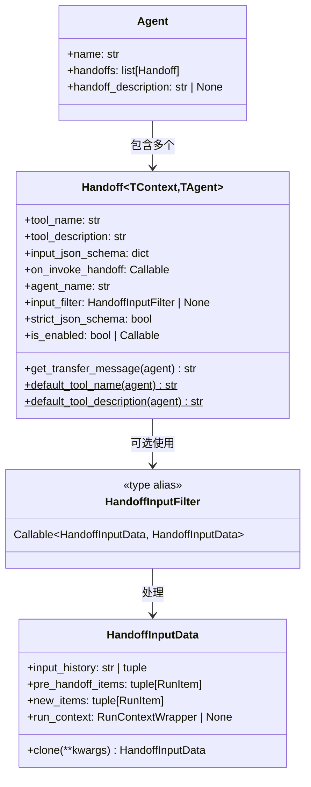
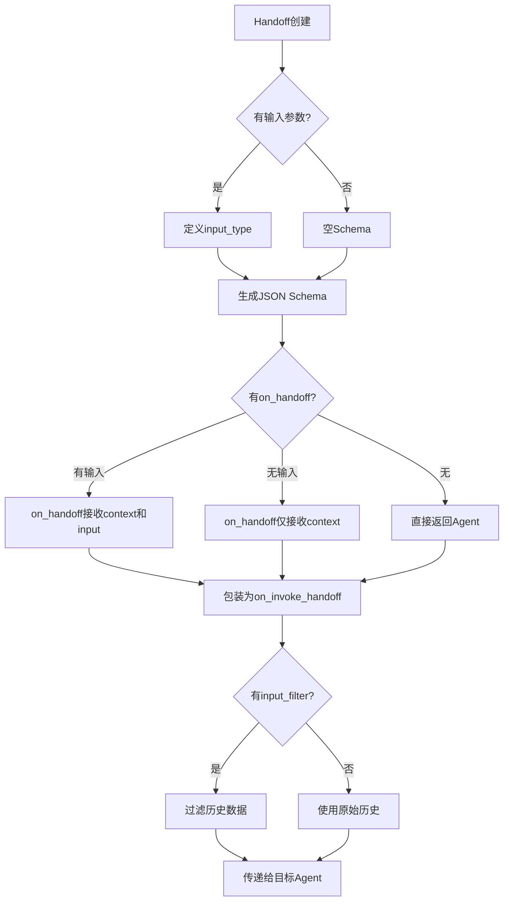
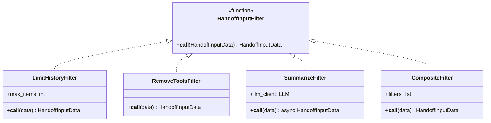
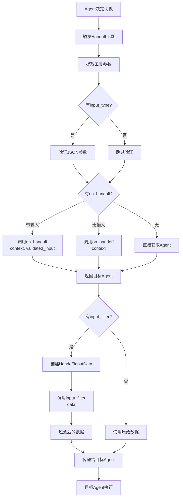
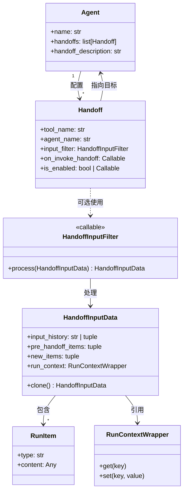

# OpenAI Agents Python SDK - Handoffs 模块数据结构详解

## 1. 数据结构总览

Handoffs 模块的数据结构定义了Agent间任务委派的机制，包括切换配置、输入数据和过滤器。

### 核心数据结构

```
Handoff (切换配置)
├── tool_name: str
├── tool_description: str
├── input_json_schema: dict
├── on_invoke_handoff: Callable
├── agent_name: str
├── input_filter: HandoffInputFilter
├── strict_json_schema: bool
└── is_enabled: bool | Callable

HandoffInputData (切换数据)
├── input_history: str | tuple
├── pre_handoff_items: tuple[RunItem]
├── new_items: tuple[RunItem]
└── run_context: RunContextWrapper
```

## 2. Handoff 类 UML 图



## 3. Handoff 数据结构详解

### 3.1 Handoff 字段说明

```python
@dataclass
class Handoff(Generic[TContext, TAgent]):
    """Agent切换配置"""
    
    tool_name: str
    """工具名称，在模型中显示为可调用的工具"""
    
    tool_description: str
    """工具描述，帮助模型理解何时使用此切换"""
    
    input_json_schema: dict[str, Any]
    """输入参数的JSON Schema，空字典表示无参数"""
    
    on_invoke_handoff: Callable[[RunContextWrapper, str], Awaitable[Agent]]
    """
    切换执行函数
    参数1: RunContextWrapper - 运行上下文
    参数2: str - LLM提供的JSON参数字符串
    返回: Agent - 目标Agent
    """
    
    agent_name: str
    """目标Agent的名称"""
    
    input_filter: HandoffInputFilter | None = None
    """输入数据过滤器，用于修改传递给下一个Agent的历史"""
    
    strict_json_schema: bool = True
    """是否使用严格的JSON Schema模式"""
    
    is_enabled: bool | Callable[[RunContextWrapper, Agent], bool] = True
    """是否启用此切换，可以是布尔值或动态判断函数"""
```

**字段类型和示例：**

| 字段 | 类型 | 示例值 | 说明 |
|------|------|--------|------|
| `tool_name` | `str` | `"transfer_to_billing_agent"` | 函数风格的名称 |
| `tool_description` | `str` | `"Handoff to billing agent..."` | 清晰的功能描述 |
| `input_json_schema` | `dict` | `{"properties": {...}}` | Pydantic生成的Schema |
| `agent_name` | `str` | `"billing_agent"` | 目标Agent标识 |
| `strict_json_schema` | `bool` | `True` | 推荐保持True |

### 3.2 Handoff 工作模式



## 4. HandoffInputData 数据结构

### 4.1 字段详解

```python
@dataclass(frozen=True)
class HandoffInputData:
    """传递给下一个Agent的数据"""
    
    input_history: str | tuple[TResponseInputItem, ...]
    """
    Runner.run()调用前的输入历史
    - 字符串: 简单文本输入
    - tuple: 结构化的对话历史
    """
    
    pre_handoff_items: tuple[RunItem, ...]
    """
    切换发生前生成的所有项
    包括之前的对话、工具调用等
    """
    
    new_items: tuple[RunItem, ...]
    """
    当前turn生成的新项
    包括触发切换的工具调用和切换结果
    """
    
    run_context: RunContextWrapper | None = None
    """
    切换时的运行上下文
    可用于访问自定义状态
    """
```

**数据流示意：**

```
Timeline:
├── input_history          [初始输入]
├── pre_handoff_items      [之前的所有对话]
│   ├── user message 1
│   ├── assistant message 1
│   ├── tool call 1
│   ├── tool output 1
│   └── ...
├── [HANDOFF TRIGGERED]    [切换点]
└── new_items              [当前turn]
    ├── function_call (handoff)
    └── function_call_output
```

### 4.2 HandoffInputData 类型示例

```python
# 示例1: 简单文本输入
data = HandoffInputData(
    input_history="用户最初的问题",
    pre_handoff_items=(
        {"type": "message", "role": "user", "content": "用户最初的问题"},
        {"type": "message", "role": "assistant", "content": "让我帮你..."},
    ),
    new_items=(
        {
            "type": "function_call",
            "call_id": "call_123",
            "name": "transfer_to_billing_agent",
            "arguments": "{}"
        },
        {
            "type": "function_call_output",
            "call_id": "call_123",
            "output": '{"assistant": "billing_agent"}'
        }
    ),
    run_context=context
)

# 示例2: 结构化历史
data = HandoffInputData(
    input_history=(
        {"type": "message", "role": "user", "content": "初始问题"},
    ),
    pre_handoff_items=(...),
    new_items=(...),
    run_context=context
)
```

### 4.3 clone() 方法

```python
def clone(self, **kwargs: Any) -> HandoffInputData:
    """
    克隆并修改数据
    
    用法:
    new_data = data.clone(
        pre_handoff_items=filtered_items,
        new_items=()
    )
    """
    return dataclasses_replace(self, **kwargs)
```

**使用示例：**

```python
# 场景1: 清空新项
filtered = data.clone(new_items=())

# 场景2: 替换历史
filtered = data.clone(
    pre_handoff_items=(summary_item,),
    input_history=""
)

# 场景3: 修改多个字段
filtered = data.clone(
    pre_handoff_items=limited_items,
    new_items=(),
    run_context=new_context
)
```

## 5. HandoffInputFilter 类型

### 5.1 类型定义

```python
HandoffInputFilter: TypeAlias = Callable[
    [HandoffInputData],
    MaybeAwaitable[HandoffInputData]
]
```

**支持的函数签名：**

```python
# 同步过滤器
def sync_filter(data: HandoffInputData) -> HandoffInputData:
    ...

# 异步过滤器
async def async_filter(data: HandoffInputData) -> HandoffInputData:
    ...
```

### 5.2 过滤器模式 UML 图



## 6. 回调函数类型

### 6.1 OnHandoff 类型别名

```python
# 带输入的回调
OnHandoffWithInput = Callable[
    [RunContextWrapper, THandoffInput],
    Any  # 可以是None或Awaitable[None]
]

# 不带输入的回调
OnHandoffWithoutInput = Callable[
    [RunContextWrapper],
    Any  # 可以是None或Awaitable[None]
]
```

**使用示例：**

```python
# 类型1: 带输入的同步回调
def sync_with_input(ctx: RunContextWrapper, data: MyInput) -> None:
    ctx.set("input_data", data)

# 类型2: 带输入的异步回调
async def async_with_input(ctx: RunContextWrapper, data: MyInput) -> None:
    await save_to_db(data)
    ctx.set("saved", True)

# 类型3: 不带输入的同步回调
def sync_no_input(ctx: RunContextWrapper) -> None:
    ctx.set("transferred", True)

# 类型4: 不带输入的异步回调
async def async_no_input(ctx: RunContextWrapper) -> None:
    await log_handoff(ctx)
```

## 7. 完整的数据流转图

### 7.1 Handoff执行数据流



### 7.2 数据结构关系图



## 8. 类型参数和泛型

### 8.1 Handoff 泛型参数

```python
class Handoff(Generic[TContext, TAgent]):
    """
    TContext: Agent的context类型
    TAgent: 目标Agent类型
    """
```

**类型示例：**

```python
# 场景1: 通用Agent
handoff_1: Handoff[Any, Agent[Any]]

# 场景2: 特定Context类型
class MyContext(TypedDict):
    user_id: str
    session_id: str

handoff_2: Handoff[MyContext, Agent[MyContext]]

# 场景3: 自定义Agent类型
class SpecialAgent(Agent):
    pass

handoff_3: Handoff[Any, SpecialAgent]
```

### 8.2 HandoffInput 泛型

```python
THandoffInput = TypeVar("THandoffInput", default=Any)
```

**使用示例：**

```python
from pydantic import BaseModel

class BillingInput(BaseModel):
    issue_type: str
    account_id: str

# 明确的类型标注
def handle_billing(ctx: RunContextWrapper, input: BillingInput) -> None:
    ...

billing_handoff = handoff(
    billing_agent,
    on_handoff=handle_billing,
    input_type=BillingInput  # 类型推断
)
```

## 9. 数据验证和转换

### 9.1 JSON Schema 生成

```python
from pydantic import BaseModel, TypeAdapter

class TransferData(BaseModel):
    reason: str
    priority: Literal["high", "medium", "low"]

# 自动生成Schema
adapter = TypeAdapter(TransferData)
schema = adapter.json_schema()

# 结果:
# {
#     "properties": {
#         "reason": {"type": "string"},
#         "priority": {"enum": ["high", "medium", "low"]}
#     },
#     "required": ["reason", "priority"]
# }
```

### 9.2 严格模式转换

```python
# 自动转换为OpenAI严格模式
input_json_schema = ensure_strict_json_schema(schema)

# 添加必要的字段:
# - additionalProperties: false
# - 所有字段都required
```

Handoffs 模块通过精心设计的数据结构，实现了灵活而强大的多Agent协作机制，支持复杂的任务委派和数据传递。

