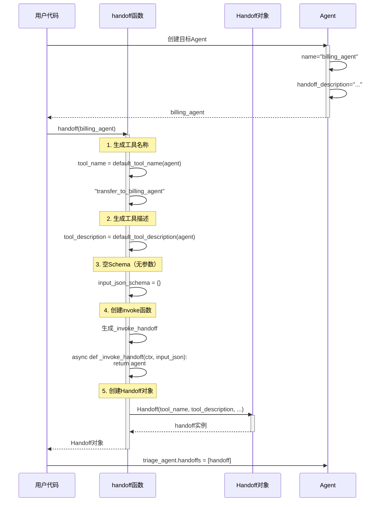
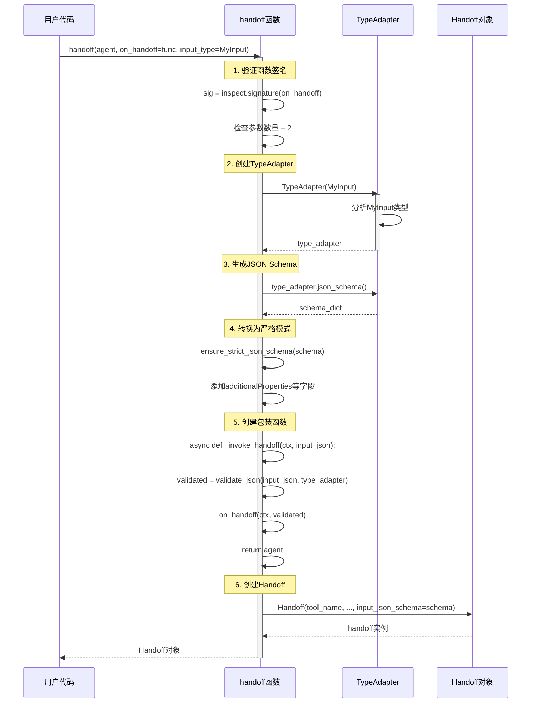
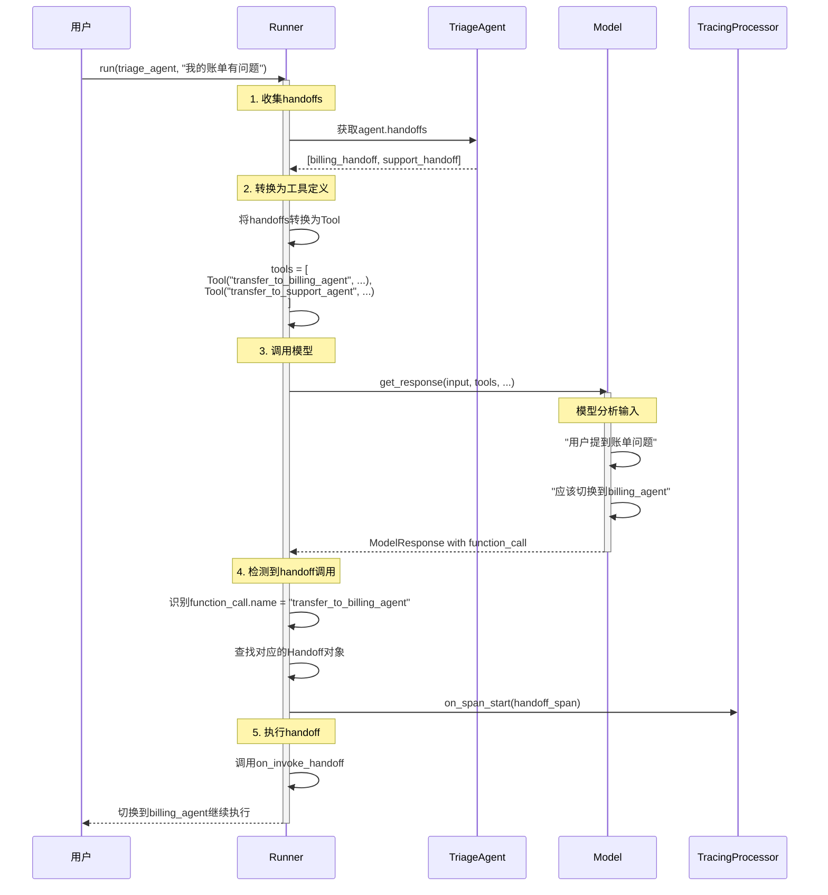
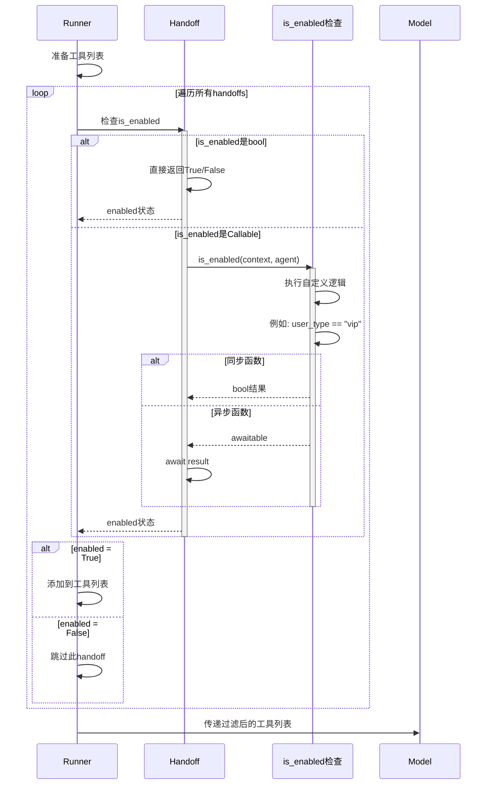
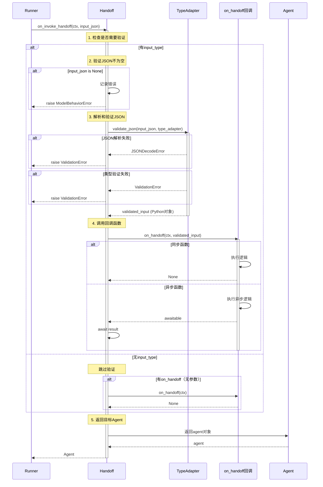
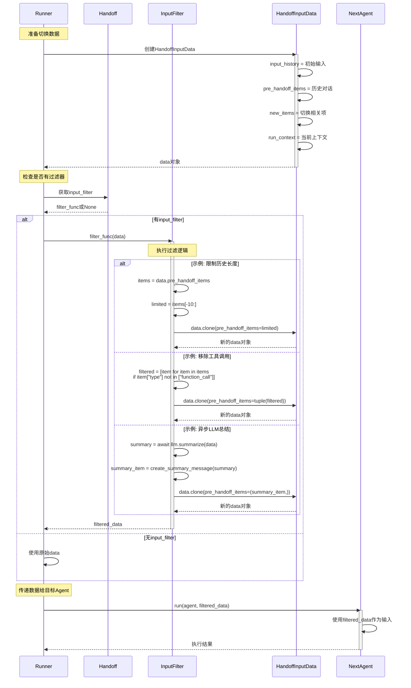
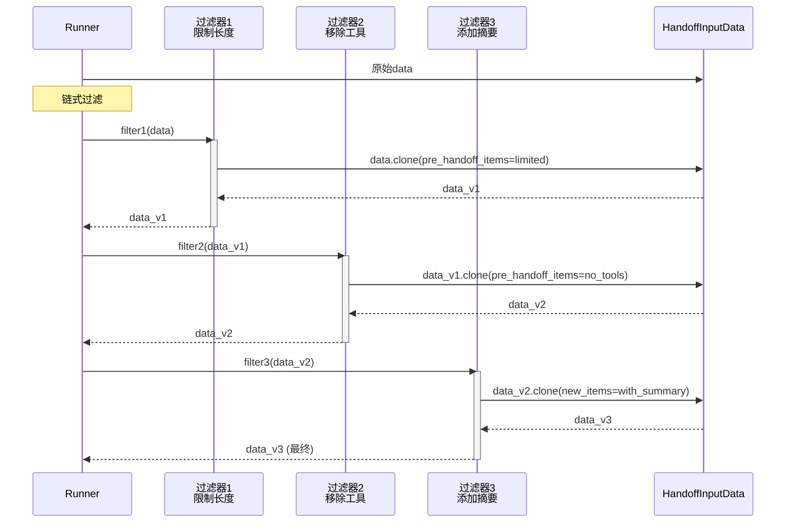
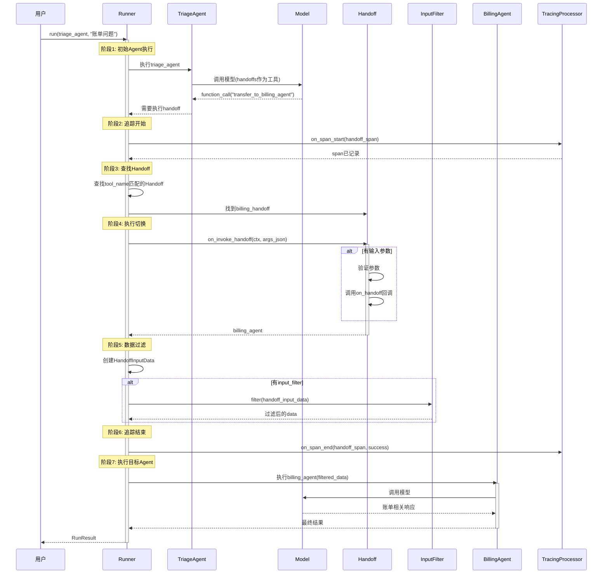
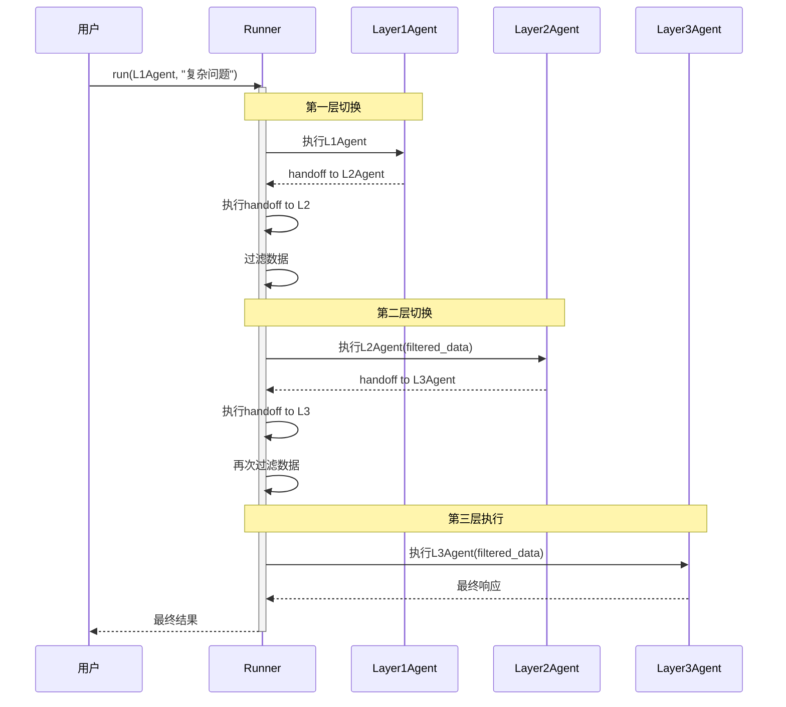
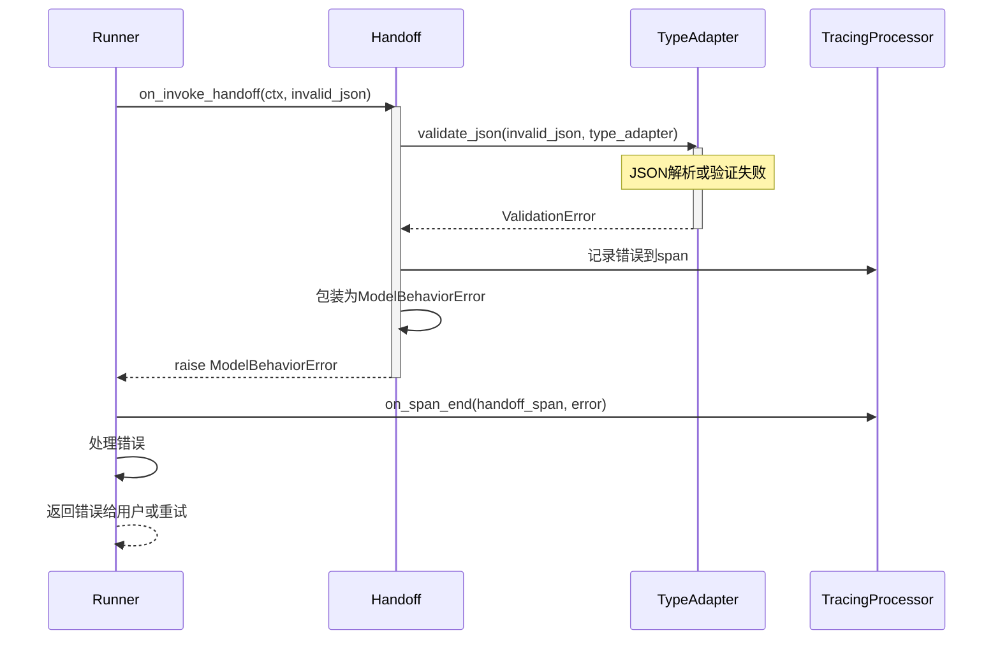

# OpenAI Agents Python SDK - Handoffs 模块时序图详解

## 1. 时序图总览

Handoffs 模块的时序图展示了Agent间任务切换的完整流程，包括切换触发、参数验证、数据过滤和目标Agent执行。

### 主要时序流程

| 时序流程 | 参与者 | 触发时机 | 核心操作 |
|---------|--------|---------|---------|
| **Handoff创建** | 用户代码, handoff函数 | Agent初始化 | 配置切换规则 |
| **切换触发** | Runner, Model, Handoff | 模型决策 | 调用切换工具 |
| **参数验证** | Handoff, TypeAdapter | 切换执行 | 验证输入参数 |
| **数据过滤** | HandoffInputFilter | 切换前 | 过滤历史数据 |
| **目标执行** | Runner, Target Agent | 切换后 | 执行目标Agent |

## 2. Handoff 创建时序图

### 2.1 简单切换创建

**创建流程说明：**

1. **工具命名**：自动生成`transfer_to_{agent_name}`格式
2. **工具描述**：组合Agent名称和handoff_description
3. **Schema生成**：无参数则为空字典
4. **包装函数**：创建统一的invoke函数
5. **返回对象**：完整的Handoff配置

### 2.2 带参数的切换创建

**带参数创建说明：**

1. **签名验证**：确保on_handoff接受2个参数
2. **类型适配器**：创建Pydantic TypeAdapter
3. **Schema生成**：从类型生成JSON Schema
4. **严格模式**：转换为OpenAI严格模式
5. **验证包装**：在invoke中加入验证逻辑

## 3. Handoff 触发时序图

### 3.1 模型决策切换

**触发流程说明：**

1. **工具注册**：Handoffs转换为模型可调用的工具
2. **模型决策**：LLM分析后决定调用切换工具
3. **识别切换**：Runner检测function_call是handoff
4. **执行切换**：调用on_invoke_handoff
5. **继续执行**：在目标Agent上继续

### 3.2 动态启用检查

**动态启用说明：**

1. **条件检查**：支持静态bool和动态函数
2. **异步支持**：可以执行异步检查（如API调用）
3. **工具过滤**：禁用的handoff不暴露给模型
4. **运行时决策**：每次调用时重新评估

## 4. 参数验证时序图

### 4.1 输入参数验证流程

**验证流程说明：**

1. **类型检查**：判断是否需要参数验证
2. **空值检查**：确保必需参数不为空
3. **JSON解析**：将字符串解析为对象
4. **类型验证**：使用Pydantic验证类型
5. **回调执行**：调用用户的on_handoff函数

## 5. 数据过滤时序图

### 5.1 input_filter 执行流程

**过滤流程说明：**

1. **数据准备**：创建完整的HandoffInputData
2. **过滤器检查**：判断是否配置了filter
3. **执行过滤**：调用filter函数处理数据
4. **数据克隆**：使用clone修改数据
5. **传递结果**：将过滤后数据传给目标Agent

### 5.2 多种过滤器组合

## 6. 完整的 Handoff 执行时序图

### 6.1 端到端切换流程

**完整流程总结：**

1. **初始执行**：Triage Agent分析输入
2. **模型决策**：决定切换到Billing Agent
3. **追踪记录**：开始handoff span
4. **切换执行**：验证参数，调用回调
5. **数据过滤**：过滤历史数据
6. **追踪完成**：记录切换成功
7. **目标执行**：在Billing Agent上继续
8. **返回结果**：最终结果给用户

## 7. 多层切换时序图

### 7.1 级联切换流程

**级联切换说明：**

1. **多层架构**：支持Agent间多次切换
2. **数据传递**：每次切换都可以过滤数据
3. **上下文保持**：RunContext在切换间传递
4. **灵活返回**：可以切换回上层Agent

## 8. 错误处理时序图

### 8.1 参数验证失败

Handoffs 模块通过精心设计的时序流程，实现了灵活的多Agent协作机制，支持复杂的任务委派和数据传递场景。

