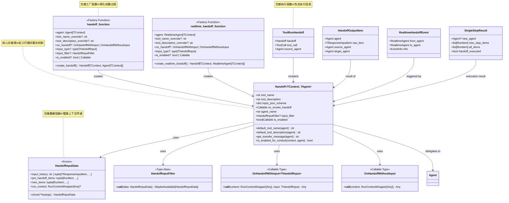

# OpenAI Agents Python SDK - Handoffs 模块概览

## 1. 模块职责与边界

Handoffs 模块是 OpenAI Agents Python SDK 的代理协作核心，负责实现智能代理之间的任务委派和流程转接。该模块通过工具化的方式将代理间交接封装为标准化的操作，支持复杂的多代理协作场景和分层任务处理。

### 核心职责

- **任务委派**：支持代理向其他专门代理委派特定任务
- **上下文传递**：管理代理间交接时的历史和状态信息传递
- **流程控制**：控制多代理协作的执行流程和生命周期
- **输入过滤**：提供灵活的输入数据过滤和转换机制
- **状态追踪**：追踪代理交接的执行状态和结果
- **钩子集成**：支持交接生命周期事件的钩子函数

### 交接机制体系

| 交接类型 | 实现方式 | 主要特点 | 适用场景 |
|----------|----------|----------|----------|
| 标准交接 | `Handoff` | 通用代理间任务委派 | 客服分流、专家咨询、任务分解 |
| 实时交接 | `RealtimeHandoff` | 实时代理间的即时切换 | 语音对话、实时协作 |
| 输入交接 | `OnHandoffWithInput` | 带参数的代理调用 | 参数化任务、数据传递 |
| 无参交接 | `OnHandoffWithoutInput` | 简单的代理切换 | 流程转换、状态切换 |

### 交接数据流转

| 数据类型 | 数据内容 | 处理方式 | 生命周期 |
|----------|----------|----------|----------|
| `input_history` | 历史对话记录 | 可过滤、可修改 | 传递到新代理 |
| `pre_handoff_items` | 交接前生成的项目 | 上下文保留 | 用于状态恢复 |
| `new_items` | 当前回合生成项目 | 包含交接触发信息 | 完整传递 |
| `run_context` | 执行上下文 | 运行时状态 | 连续传递 |

### 输入输出接口

**输入：**
- 源代理实例（`Agent`）
- 交接参数（JSON格式）
- 执行上下文（`RunContextWrapper`）
- 历史数据（`HandoffInputData`）

**输出：**
- 目标代理实例（`Agent`）  
- 交接结果信息
- 过滤后的输入数据
- 执行状态和追踪信息

### 上下游依赖关系

**上游调用者：**
- `RunImpl`：执行引擎中的交接处理逻辑
- `Agent`：代理配置中的交接规则定义
- `RealtimeSession`：实时会话中的代理切换

**下游依赖：**
- `exceptions`：交接异常和错误处理
- `tracing`：交接执行的追踪和监控
- `items`：交接过程中的数据项定义
- `run_context`：执行上下文的管理

## 2. 模块架构图

```mermaid
flowchart TB
    subgraph "Handoffs 代理交接模块"
        subgraph "核心交接类"
            HANDOFF[Handoff]
            HANDOFFINPUTDATA[HandoffInputData]
            HANDOFFINPUTFILTER[HandoffInputFilter]
        end
        
        subgraph "交接类型"
            STANDARDHANDOFF[标准交接]
            REALTIMEHANDOFF[实时交接] 
            INPUTHANDOFF[带参数交接]
            NOINPUTHANDOFF[无参数交接]
        end
        
        subgraph "回调函数"
            ONHANDOFFWITHINPUT[OnHandoffWithInput]
            ONHANDOFFWITHOUTINPUT[OnHandoffWithoutInput]
            INVOKEHANDOFF[on_invoke_handoff]
        end
        
        subgraph "工厂函数"
            HANDOFFFACTORY[handoff() 函数]
            REALTIMEHANDOFFFACTORY[realtime_handoff() 函数]
        end
        
        subgraph "数据处理"
            JSONSCHEMA[input_json_schema]
            TYPEADAPTER[TypeAdapter 验证]
            INPUTVALIDATION[输入验证]
        end
        
        subgraph "执行控制"
            ENABLEDCHECK[is_enabled 检查]
            MULTIPLEHANDOFFHANDLING[多交接处理]
            TRANSFERMESSAGE[交接消息生成]
        end
        
        subgraph "生命周期管理"
            HANDOFFHOOKS[交接钩子]
            SPANHANDOFF[交接追踪]
            ERRORHANDLING[异常处理]
        end
    end
    
    subgraph "执行集成"
        RUNIMPL[RunImpl 执行引擎]
        AGENT[Agent 代理]
        REALTIMESESSION[RealtimeSession 实时会话]
        TOOLCALL[工具调用机制]
    end
    
    subgraph "支撑系统"
        TRACING[tracing 追踪系统]
        EXCEPTIONS[异常处理系统]
        ITEMS[items 数据项系统]
        RUNCONTEXT[run_context 上下文系统]
        PYDANTIC[Pydantic 验证系统]
    end
    
    HANDOFF --> HANDOFFINPUTDATA
    HANDOFF --> HANDOFFINPUTFILTER
    HANDOFF --> INVOKEHANDOFF
    
    STANDARDHANDOFF --> HANDOFF
    REALTIMEHANDOFF --> HANDOFF
    INPUTHANDOFF --> ONHANDOFFWITHINPUT
    NOINPUTHANDOFF --> ONHANDOFFWITHOUTINPUT
    
    HANDOFFFACTORY --> STANDARDHANDOFF
    HANDOFFFACTORY --> INPUTHANDOFF
    HANDOFFFACTORY --> NOINPUTHANDOFF
    REALTIMEHANDOFFFACTORY --> REALTIMEHANDOFF
    
    HANDOFF --> JSONSCHEMA
    HANDOFF --> TYPEADAPTER
    HANDOFF --> INPUTVALIDATION
    
    HANDOFF --> ENABLEDCHECK
    HANDOFF --> TRANSFERMESSAGE
    
    RUNIMPL --> HANDOFF
    RUNIMPL --> MULTIPLEHANDOFFHANDLING
    AGENT --> HANDOFF
    REALTIMESESSION --> REALTIMEHANDOFF
    
    HANDOFF --> TOOLCALL
    
    HANDOFF --> HANDOFFHOOKS
    HANDOFF --> SPANHANDOFF
    HANDOFF --> ERRORHANDLING
    
    HANDOFF --> TRACING
    HANDOFF --> EXCEPTIONS
    HANDOFF --> ITEMS
    HANDOFF --> RUNCONTEXT
    HANDOFF --> PYDANTIC
    
    style HANDOFF fill:#e1f5fe
    style STANDARDHANDOFF fill:#f3e5f5  
    style REALTIMEHANDOFF fill:#e8f5e8
    style HANDOFFFACTORY fill:#fff3e0
    style RUNIMPL fill:#ffebee
```

**架构说明：**

### 分层设计原理

1. **核心交接层**：`Handoff` 类定义交接的基本结构和行为
2. **类型分化层**：不同类型的交接实现满足不同场景需求
3. **工厂方法层**：便利函数简化交接对象的创建过程
4. **执行集成层**：与代理执行引擎的深度集成

### 工具化设计

- **工具抽象**：交接通过工具调用的形式向LLM暴露
- **JSON Schema**：标准化的参数验证和类型安全
- **工具描述**：自动生成工具描述帮助LLM理解交接用途
- **工具命名**：基于代理名称的默认工具命名策略

### 数据流控制

- **输入过滤**：`HandoffInputFilter` 允许自定义输入数据处理
- **上下文传递**：完整的执行上下文在代理间传递
- **状态保持**：交接前后的状态信息得到妥善管理
- **历史管理**：灵活的对话历史传递和过滤机制

### 扩展能力设计

- **回调扩展**：支持自定义交接逻辑和副作用处理
- **类型安全**：通过泛型和类型适配器确保类型安全
- **条件交接**：`is_enabled` 机制支持动态交接启用/禁用
- **钩子集成**：完整的生命周期钩子支持

## 3. 关键算法与流程剖析

### 3.1 交接创建与配置算法

```python
def handoff(
    agent: Agent[TContext],
    tool_name_override: str | None = None,
    tool_description_override: str | None = None,
    on_handoff: OnHandoffWithInput[THandoffInput] | OnHandoffWithoutInput | None = None,
    input_type: type[THandoffInput] | None = None,
    input_filter: Callable[[HandoffInputData], HandoffInputData] | None = None,
    is_enabled: bool | Callable[[RunContextWrapper[Any], Agent[TContext]], MaybeAwaitable[bool]] = True,
) -> Handoff[TContext, Agent[TContext]]:
    """交接创建的核心算法"""
    
    # 1) 参数验证和类型适配器创建
    type_adapter: TypeAdapter[Any] | None
    if input_type is not None:
        # 验证回调函数签名
        assert callable(on_handoff)
        sig = inspect.signature(on_handoff)
        if len(sig.parameters) != 2:
            raise UserError("on_handoff must take two arguments: context and input")
        
        # 创建类型适配器和JSON Schema
        type_adapter = TypeAdapter(input_type)
        input_json_schema = type_adapter.json_schema()
    else:
        type_adapter = None
        input_json_schema = {}
        
        # 验证无参数回调函数
        if on_handoff is not None:
            sig = inspect.signature(on_handoff)
            if len(sig.parameters) != 1:
                raise UserError("on_handoff must take one argument: context")
    
    # 2) 创建交接调用函数
    async def _invoke_handoff(
        ctx: RunContextWrapper[Any], input_json: str | None = None
    ) -> Agent[TContext]:
        
        # 处理带参数的交接
        if input_type is not None and type_adapter is not None:
            if input_json is None:
                raise ModelBehaviorError("Handoff function expected non-null input, but got None")
            
            # JSON验证和类型转换
            validated_input = _json.validate_json(
                json_str=input_json,
                type_adapter=type_adapter,
                partial=False,
            )
            
            # 调用带参数的回调函数
            input_func = cast(OnHandoffWithInput[THandoffInput], on_handoff)
            if inspect.iscoroutinefunction(input_func):
                await input_func(ctx, validated_input)
            else:
                input_func(ctx, validated_input)
                
        # 处理无参数的交接
        elif on_handoff is not None:
            no_input_func = cast(OnHandoffWithoutInput, on_handoff)
            if inspect.iscoroutinefunction(no_input_func):
                await no_input_func(ctx)
            else:
                no_input_func(ctx)
        
        # 返回目标代理
        return agent
    
    # 3) 创建交接对象
    tool_name = tool_name_override or Handoff.default_tool_name(agent)
    tool_description = tool_description_override or Handoff.default_tool_description(agent)
    
    return Handoff(
        tool_name=tool_name,
        tool_description=tool_description,
        input_json_schema=input_json_schema,
        on_invoke_handoff=_invoke_handoff,
        agent_name=agent.name,
        input_filter=input_filter,
        is_enabled=is_enabled,
    )
```

**算法目的：** 创建类型安全、功能完整的代理交接对象，支持多种参数和配置选项。

**关键设计特点：**
1. **类型安全**：通过 `TypeAdapter` 确保输入参数的类型正确性
2. **签名验证**：检查回调函数的参数签名确保正确性
3. **异步支持**：同时支持同步和异步回调函数
4. **默认生成**：自动生成工具名称和描述

### 3.2 交接执行与多交接处理算法

```python
async def execute_handoffs(
    cls,
    *,
    agent: Agent[TContext],
    original_input: str | list[TResponseInputItem],
    pre_step_items: list[RunItem],
    new_step_items: list[RunItem],
    new_response: ModelResponse,
    run_handoffs: list[ToolRunHandoff],
    hooks: RunHooks[TContext],
    context_wrapper: RunContextWrapper[TContext],
    run_config: RunConfig,
) -> SingleStepResult:
    """交接执行的核心算法"""
    
    # 1) 多交接冲突处理
    multiple_handoffs = len(run_handoffs) > 1
    if multiple_handoffs:
        # 拒绝多余的交接请求
        rejected_handoffs = run_handoffs[1:]
        new_step_items.extend([
            ToolCallOutputItem(
                tool_call=rejected_handoff.tool_call,
                output="错误：不能同时执行多个代理交接",
            )
            for rejected_handoff in rejected_handoffs
        ])
    
    # 2) 执行有效交接
    actual_handoff = run_handoffs[0]
    with handoff_span(from_agent=agent.name) as span_handoff:
        handoff = actual_handoff.handoff
        
        # 调用交接函数获取新代理
        new_agent: Agent[Any] = await handoff.on_invoke_handoff(
            context_wrapper, actual_handoff.tool_call.arguments
        )
        
        # 更新追踪信息
        span_handoff.span_data.to_agent = new_agent.name
        if multiple_handoffs:
            requested_agents = [h.handoff.agent_name for h in run_handoffs]
            span_handoff.set_error(SpanError(
                message="Multiple handoffs requested",
                data={"requested_agents": requested_agents}
            ))
        
        # 3) 生成交接输出项
        new_step_items.append(
            HandoffOutputItem(
                agent=agent,
                raw_item=ItemHelpers.tool_call_output_item(
                    actual_handoff.tool_call,
                    handoff.get_transfer_message(new_agent),
                ),
                source_agent=agent,
                target_agent=new_agent,
            )
        )
        
        # 4) 执行交接钩子
        await asyncio.gather(
            hooks.on_handoff(
                context=context_wrapper,
                from_agent=agent,
                to_agent=new_agent,
            ),
            (
                agent.hooks.on_handoff(
                    context_wrapper,
                    agent=new_agent,
                    source=agent,
                )
                if agent.hooks
                else _coro.noop_coroutine()
            ),
        )
        
        # 5) 应用输入过滤器
        input_filter = handoff.input_filter or (
            run_config.handoff_input_filter if run_config else None
        )
        
        if input_filter:
            handoff_input_data = HandoffInputData(
                input_history=original_input,
                pre_handoff_items=tuple(pre_step_items),
                new_items=tuple(new_step_items),
                run_context=context_wrapper,
            )
            
            # 应用过滤器
            filtered_data = input_filter(handoff_input_data)
            if inspect.isawaitable(filtered_data):
                filtered_data = await filtered_data
                
            # 构建新的输入历史
            all_items = []
            if isinstance(filtered_data.input_history, str):
                all_items.append(ItemHelpers.user_input_item(filtered_data.input_history))
            else:
                all_items.extend(filtered_data.input_history)
            
            all_items.extend(filtered_data.pre_handoff_items)
            all_items.extend(filtered_data.new_items)
        else:
            # 默认传递所有历史
            all_items = ItemHelpers.collect_all_items(
                original_input, pre_step_items, new_step_items
            )
        
        # 6) 返回交接结果
        return SingleStepResult(
            new_agent=new_agent,
            new_step_items=new_step_items,
            all_items=all_items,
            handoff_executed=True,
        )
```

**算法目的：** 安全高效地执行代理交接，处理多交接冲突，管理数据传递和生命周期。

**执行策略分析：**
1. **冲突处理**：优先执行第一个交接，拒绝其他冲突交接
2. **追踪集成**：完整记录交接过程和相关错误信息
3. **钩子执行**：并行执行全局和代理级别的交接钩子
4. **数据过滤**：支持自定义输入数据过滤逻辑

### 3.3 输入过滤与数据传递算法

```python
@dataclass(frozen=True)
class HandoffInputData:
    """交接输入数据的结构化管理"""
    
    input_history: str | tuple[TResponseInputItem, ...]
    """交接前的输入历史"""
    
    pre_handoff_items: tuple[RunItem, ...]
    """交接前生成的项目"""
    
    new_items: tuple[RunItem, ...]
    """当前回合生成的新项目"""
    
    run_context: RunContextWrapper[Any] | None = None
    """运行时上下文"""
    
    def clone(self, **kwargs: Any) -> HandoffInputData:
        """创建修改后的副本"""
        return dataclasses_replace(self, **kwargs)

# 输入过滤器的实现示例
def context_aware_filter(handoff_data: HandoffInputData) -> HandoffInputData:
    """上下文感知的输入过滤器"""
    
    # 1) 历史长度控制
    MAX_HISTORY_ITEMS = 20
    if isinstance(handoff_data.input_history, tuple):
        filtered_history = handoff_data.input_history[-MAX_HISTORY_ITEMS:]
    else:
        # 字符串历史保持不变
        filtered_history = handoff_data.input_history
    
    # 2) 敏感信息过滤
    filtered_pre_items = []
    for item in handoff_data.pre_handoff_items:
        if not contains_sensitive_content(item):
            filtered_pre_items.append(item)
        else:
            # 替换为安全的占位符
            filtered_pre_items.append(create_placeholder_item(item))
    
    # 3) 工具调用结果过滤
    filtered_new_items = []
    for item in handoff_data.new_items:
        if item.type == "tool_call_output":
            # 过滤工具输出中的敏感信息
            filtered_item = filter_tool_output(item)
            filtered_new_items.append(filtered_item)
        else:
            filtered_new_items.append(item)
    
    # 4) 返回过滤后的数据
    return handoff_data.clone(
        input_history=filtered_history,
        pre_handoff_items=tuple(filtered_pre_items),
        new_items=tuple(filtered_new_items),
    )
```

**算法目的：** 提供灵活的输入数据过滤机制，支持上下文长度控制、敏感信息过滤等。

**过滤策略特点：**
1. **不可变设计**：通过 `frozen=True` 确保数据不可变性
2. **灵活修改**：`clone` 方法支持选择性字段修改
3. **层次过滤**：分别处理历史、预交接项目、新项目
4. **类型安全**：保持原有数据类型和结构

### 3.4 实时交接特殊处理算法

```python
async def _handle_tool_call(self, event: RealtimeModelToolCallEvent) -> None:
    """实时会话中的交接处理"""
    
    # 1) 检查是否为交接工具
    handoff_map = {h.tool_name: h for h in self._current_agent.handoffs}
    
    if event.name in handoff_map:
        handoff = handoff_map[event.name]
        
        # 2) 创建工具上下文
        tool_context = ToolContext(
            context=self._context_wrapper.context,
            usage=self._context_wrapper.usage,
            tool_name=event.name,
            tool_call_id=event.call_id,
            tool_arguments=event.arguments,
        )
        
        # 3) 执行交接获取新代理
        result = await handoff.on_invoke_handoff(self._context_wrapper, event.arguments)
        if not isinstance(result, RealtimeAgent):
            raise UserError(
                f"Handoff {handoff.tool_name} returned invalid result: {type(result)}"
            )
        
        # 4) 更新当前代理
        previous_agent = self._current_agent
        self._current_agent = result
        
        # 5) 获取新代理的模型设置
        updated_settings = await self._get_updated_model_settings_from_agent(
            starting_settings=None,
            agent=self._current_agent,
        )
        
        # 6) 发送交接事件
        await self._put_event(
            RealtimeHandoffEvent(
                from_agent=previous_agent,
                to_agent=self._current_agent,
                info=self._event_info,
            )
        )
        
        # 7) 更新会话设置
        await self._model.send_event(
            RealtimeModelSendSessionUpdate(session_settings=updated_settings)
        )
        
        # 8) 发送工具输出完成交接
        transfer_message = handoff.get_transfer_message(result)
        await self._model.send_event(
            RealtimeModelSendToolCallOutput(
                call_id=event.call_id,
                output=transfer_message,
            )
        )
```

**算法目的：** 处理实时会话中的代理交接，确保会话状态的连续性和一致性。

**实时交接特点：**
1. **即时切换**：立即更新当前代理，无需等待响应完成
2. **状态同步**：同步更新模型设置和会话配置
3. **事件驱动**：通过事件机制通知交接状态变化
4. **连续性保障**：确保实时对话的连续性

## 4. 数据结构与UML图



**类图说明：**

### 核心类型层次

1. **Handoff类**：交接的核心实现，包含所有交接逻辑和配置
2. **HandoffInputData**：交接时传递的数据容器，支持不可变操作
3. **回调函数类型**：定义不同类型的交接回调接口
4. **工厂函数**：简化交接对象的创建过程

### 数据流转关系

- **输入传递**：`HandoffInputData` 封装所有需要传递的历史和状态信息
- **过滤处理**：`HandoffInputFilter` 对传递数据进行自定义处理
- **执行结果**：`SingleStepResult` 包含交接执行后的完整状态
- **事件通知**：`RealtimeHandoffEvent` 用于实时交接的事件通知

### 扩展性设计

- **泛型支持**：`Handoff` 类支持上下文和代理类型的泛型参数
- **回调灵活性**：支持带参数和无参数两种回调模式
- **条件启用**：`is_enabled` 支持静态和动态启用条件
- **类型安全**：通过 `TypeAdapter` 确保输入参数的类型安全

## 5. 典型使用场景时序图

### 场景一：客服分流交接流程


### 场景二：多交接冲突处理


### 场景三：带参数交接与输入过滤


## 6. 最佳实践与使用模式

### 6.1 客服分流场景实现

```python
from agents import Agent, handoff
from dataclasses import dataclass
from typing import Literal

@dataclass
class HandoffRequest:
    """交接请求的标准化数据结构"""
    department: Literal["billing", "technical", "sales", "general"]
    priority: Literal["low", "medium", "high", "urgent"]
    user_info: str
    issue_summary: str

# 创建专业代理
billing_agent = Agent(
    name="BillingExpert",
    instructions="""
    你是专业的账单专家，负责处理：
    - 账单查询和解释
    - 付款问题和退费申请
    - 订阅管理和升级建议
    请提供准确、专业的账单相关服务。
    """
)

technical_agent = Agent(
    name="TechnicalSupport", 
    instructions="""
    你是技术支持专家，负责处理：
    - 产品功能问题和故障排除
    - API集成和开发支持
    - 系统配置和性能优化
    请提供详细的技术解决方案。
    """
)

sales_agent = Agent(
    name="SalesConsultant",
    instructions="""
    你是销售顾问，负责处理：
    - 产品介绍和方案推荐
    - 价格咨询和商务谈判
    - 合同条款和服务协议
    请提供专业的销售咨询服务。
    """
)

def create_intelligent_handoff(target_agent: Agent, department: str):
    """创建智能交接函数"""
    
    async def on_handoff_with_context(context, request: HandoffRequest):
        """带上下文的交接处理"""
        # 记录交接原因和用户信息
        print(f"交接到{department}部门: {request.issue_summary}")
        print(f"优先级: {request.priority}, 用户: {request.user_info}")
        
        # 可以根据优先级和问题类型进行额外处理
        if request.priority == "urgent":
            # 紧急问题的特殊处理
            context.context["priority_flag"] = True
            context.context["escalated_at"] = datetime.now()
    
    return handoff(
        target_agent,
        on_handoff=on_handoff_with_context,
        input_type=HandoffRequest,
        tool_description=f"将用户转接到{department}专业团队处理相关问题",
    )

# 创建分流代理
triage_agent = Agent(
    name="CustomerTriage",
    instructions="""
    你是客服分流专家，负责理解用户问题并将其转接到合适的专业团队。
    
    分流规则：
    - 账单、付款、退费问题 → 使用 billing_handoff 
    - 技术故障、API、集成问题 → 使用 technical_handoff
    - 产品咨询、购买、升级问题 → 使用 sales_handoff
    
    在转接前，请收集用户的基本信息和问题描述，确保转接准确。
    """,
    handoffs=[
        create_intelligent_handoff(billing_agent, "账单"),
        create_intelligent_handoff(technical_agent, "技术"),
        create_intelligent_handoff(sales_agent, "销售"),
    ]
)
```

### 6.2 输入过滤与上下文管理

```python
from agents import HandoffInputData
import re
from typing import List

def create_context_aware_filter(max_history: int = 15, filter_sensitive: bool = True):
    """创建上下文感知的输入过滤器"""
    
    def smart_handoff_filter(data: HandoffInputData) -> HandoffInputData:
        """智能交接输入过滤"""
        
        # 1. 历史长度控制
        if isinstance(data.input_history, tuple) and len(data.input_history) > max_history:
            # 保留重要的初始上下文和最近的对话
            important_start = data.input_history[:2]  # 保留开始的问候和问题描述
            recent_history = data.input_history[-(max_history-2):]  # 保留最近对话
            filtered_history = important_start + recent_history
        else:
            filtered_history = data.input_history
        
        # 2. 敏感信息过滤
        if filter_sensitive:
            filtered_pre_items = []
            for item in data.pre_handoff_items:
                filtered_item = filter_sensitive_info(item)
                filtered_pre_items.append(filtered_item)
        else:
            filtered_pre_items = list(data.pre_handoff_items)
        
        # 3. 添加交接上下文摘要
        context_summary = create_handoff_summary(data)
        summary_item = {
            "type": "message",
            "role": "system", 
            "content": f"[交接上下文摘要] {context_summary}"
        }
        
        # 4. 工具调用历史清理
        filtered_new_items = []
        for item in data.new_items:
            if item.get("type") == "tool_call_output":
                # 简化工具调用输出，只保留关键信息
                simplified_item = simplify_tool_output(item)
                filtered_new_items.append(simplified_item)
            else:
                filtered_new_items.append(item)
        
        return data.clone(
            input_history=filtered_history,
            pre_handoff_items=tuple(filtered_pre_items),
            new_items=tuple([summary_item] + filtered_new_items),
        )
    
    return smart_handoff_filter

def filter_sensitive_info(item):
    """过滤敏感信息"""
    if isinstance(item, dict) and "content" in item:
        content = item["content"]
        
        # 过滤常见敏感信息模式
        patterns = {
            r'\b\d{4}[\s-]?\d{4}[\s-]?\d{4}[\s-]?\d{4}\b': '[CARD_NUMBER]',  # 信用卡
            r'\b\d{3}-\d{2}-\d{4}\b': '[SSN]',  # 社会安全号
            r'\b[A-Za-z0-9._%+-]+@[A-Za-z0-9.-]+\.[A-Z|a-z]{2,}\b': '[EMAIL]',  # 邮箱
            r'\b\d{3}[-.]?\d{3}[-.]?\d{4}\b': '[PHONE]',  # 电话号码
        }
        
        filtered_content = content
        for pattern, replacement in patterns.items():
            filtered_content = re.sub(pattern, replacement, filtered_content)
        
        # 创建过滤后的副本
        filtered_item = item.copy()
        filtered_item["content"] = filtered_content
        return filtered_item
    
    return item

def create_handoff_summary(data: HandoffInputData) -> str:
    """创建交接摘要"""
    # 分析对话历史，提取关键信息
    key_points = []
    
    if isinstance(data.input_history, tuple):
        for item in data.input_history[-5:]:  # 分析最近5条
            if isinstance(item, dict) and item.get("role") == "user":
                content = item.get("content", "")
                if len(content) > 50:  # 较长的用户输入可能是重要信息
                    key_points.append(content[:100] + "...")
    
    # 提取预交接项目中的重要信息
    for item in data.pre_handoff_items[-3:]:  # 最近3个项目
        if hasattr(item, 'type') and item.type == "message_output":
            # 代理的重要输出
            key_points.append(f"代理输出: {str(item)[:80]}...")
    
    if key_points:
        return f"用户关注: {'; '.join(key_points[:3])}"  # 最多3个要点
    else:
        return "新用户会话，无特殊背景"

# 使用过滤器的代理配置
filtered_triage_agent = Agent(
    name="FilteredTriage",
    instructions="智能客服分流，带上下文过滤",
    handoffs=[
        handoff(
            billing_agent,
            input_filter=create_context_aware_filter(max_history=10),
            tool_description="转接到账单专家（已过滤敏感信息）"
        ),
        handoff(
            technical_agent,
            input_filter=create_context_aware_filter(max_history=20),  # 技术问题需要更多上下文
            tool_description="转接到技术支持（保留详细技术上下文）"
        ),
    ]
)
```

### 6.3 条件交接与动态启用

```python
from agents import Agent, handoff, RunContextWrapper
from datetime import datetime, time

def create_business_hours_check():
    """创建营业时间检查函数"""
    
    async def is_business_hours(context: RunContextWrapper, agent: Agent) -> bool:
        """检查是否在营业时间内"""
        now = datetime.now()
        business_start = time(9, 0)  # 9:00 AM
        business_end = time(17, 0)   # 5:00 PM
        
        # 工作日且在营业时间内
        is_weekday = now.weekday() < 5
        is_business_hour = business_start <= now.time() <= business_end
        
        return is_weekday and is_business_hour
    
    return is_business_hours

def create_user_tier_check(required_tier: str):
    """创建用户等级检查函数"""
    
    async def check_user_tier(context: RunContextWrapper, agent: Agent) -> bool:
        """检查用户等级是否满足要求"""
        user_tier = context.context.get("user_tier", "basic")
        
        tier_hierarchy = {"basic": 1, "premium": 2, "enterprise": 3}
        required_level = tier_hierarchy.get(required_tier, 1)
        user_level = tier_hierarchy.get(user_tier, 1)
        
        return user_level >= required_level
    
    return check_user_tier

# 创建不同级别的代理
basic_support_agent = Agent(
    name="BasicSupport",
    instructions="提供基础技术支持服务"
)

premium_support_agent = Agent(
    name="PremiumSupport", 
    instructions="提供高级技术支持，包括优先处理和深度分析"
)

enterprise_support_agent = Agent(
    name="EnterpriseSupport",
    instructions="提供企业级技术支持，包括架构建议和定制方案"
)

# 条件交接配置
conditional_triage_agent = Agent(
    name="ConditionalTriage",
    instructions="""
    根据用户等级和时间条件提供相应的服务转接：
    - 基础用户：工作时间内提供基础支持
    - 高级用户：扩展时间提供高级支持  
    - 企业用户：24/7企业级支持
    """,
    handoffs=[
        # 基础支持：仅工作时间
        handoff(
            basic_support_agent,
            is_enabled=create_business_hours_check(),
            tool_description="转接基础技术支持（工作时间内）"
        ),
        
        # 高级支持：高级用户可用
        handoff(
            premium_support_agent,
            is_enabled=create_user_tier_check("premium"),
            tool_description="转接高级技术支持（高级用户专享）"
        ),
        
        # 企业支持：企业用户24/7可用
        handoff(
            enterprise_support_agent,
            is_enabled=create_user_tier_check("enterprise"),
            tool_description="转接企业技术支持（企业用户24/7）"
        ),
    ]
)
```

### 6.4 复杂交接流程与状态管理

```python
from agents import Agent, handoff
from dataclasses import dataclass, field
from typing import Dict, List, Optional
from enum import Enum

class EscalationLevel(Enum):
    L1 = "level1"  # 一线支持
    L2 = "level2"  # 二线支持  
    L3 = "level3"  # 专家支持
    MANAGER = "manager"  # 经理介入

@dataclass
class SupportCase:
    """支持案例数据结构"""
    case_id: str
    user_id: str
    issue_type: str
    severity: str
    escalation_level: EscalationLevel = EscalationLevel.L1
    previous_agents: List[str] = field(default_factory=list)
    resolution_attempts: int = 0
    specialized_knowledge_needed: List[str] = field(default_factory=list)

class SupportFlowManager:
    """支持流程管理器"""
    
    def __init__(self):
        self.active_cases: Dict[str, SupportCase] = {}
    
    def create_case(self, user_id: str, issue_type: str, severity: str) -> SupportCase:
        """创建新的支持案例"""
        case_id = f"CASE_{datetime.now().strftime('%Y%m%d_%H%M%S')}_{user_id[:8]}"
        case = SupportCase(
            case_id=case_id,
            user_id=user_id,
            issue_type=issue_type,
            severity=severity
        )
        self.active_cases[case_id] = case
        return case
    
    def escalate_case(self, case_id: str, to_level: EscalationLevel, reason: str):
        """升级案例到更高级别"""
        if case_id in self.active_cases:
            case = self.active_cases[case_id]
            case.escalation_level = to_level
            case.resolution_attempts += 1
            print(f"案例 {case_id} 升级到 {to_level.value}: {reason}")

# 全局流程管理器
flow_manager = SupportFlowManager()

# 创建各级别支持代理
l1_support = Agent(
    name="L1Support",
    instructions="""
    你是一线技术支持，处理常见问题：
    - 基础故障排除
    - 账户和密码问题
    - 简单配置指导
    如果问题复杂或无法解决，及时升级到L2支持。
    """
)

l2_support = Agent(
    name="L2Support", 
    instructions="""
    你是二线技术支持，处理复杂问题：
    - 深度技术分析
    - 系统集成问题
    - 性能优化建议
    如果需要产品专家介入，升级到L3支持。
    """
)

l3_support = Agent(
    name="L3Support",
    instructions="""
    你是专家级技术支持，处理最复杂问题：
    - 产品架构设计
    - 定制化解决方案
    - 紧急故障处理
    """
)

def create_escalation_handoff(target_agent: Agent, target_level: EscalationLevel):
    """创建升级交接"""
    
    async def on_escalation(context, escalation_data: SupportCase):
        """处理升级逻辑"""
        case_id = escalation_data.case_id
        
        # 更新案例状态
        flow_manager.escalate_case(
            case_id, 
            target_level, 
            f"升级到{target_agent.name}"
        )
        
        # 记录代理历史
        escalation_data.previous_agents.append(context.context.get("current_agent", "unknown"))
        
        # 添加专业知识标记
        if target_level == EscalationLevel.L3:
            escalation_data.specialized_knowledge_needed.append("expert_analysis")
        
        # 更新上下文
        context.context["case_data"] = escalation_data
        context.context["escalation_reason"] = f"需要{target_level.value}级别处理"
        
        print(f"案例升级: {case_id} -> {target_agent.name}")
    
    def escalation_filter(handoff_data: HandoffInputData) -> HandoffInputData:
        """升级时的输入过滤"""
        # 添加升级上下文摘要
        case_data = handoff_data.run_context.context.get("case_data")
        if case_data:
            escalation_summary = {
                "type": "message",
                "role": "system",
                "content": f"""
                [案例升级摘要]
                案例ID: {case_data.case_id}
                当前级别: {case_data.escalation_level.value}
                解决尝试次数: {case_data.resolution_attempts}
                之前经手代理: {', '.join(case_data.previous_agents)}
                问题类型: {case_data.issue_type}
                严重程度: {case_data.severity}
                """
            }
            
            # 将摘要添加到新项目开头
            new_items = [escalation_summary] + list(handoff_data.new_items)
            return handoff_data.clone(new_items=tuple(new_items))
        
        return handoff_data
    
    return handoff(
        target_agent,
        on_handoff=on_escalation,
        input_type=SupportCase,
        input_filter=escalation_filter,
        tool_description=f"升级到{target_level.value}级别支持"
    )

# 创建支持流程代理
support_coordinator = Agent(
    name="SupportCoordinator",
    instructions="""
    你是技术支持协调员，负责：
    1. 评估问题复杂度和紧急程度
    2. 选择合适的支持级别
    3. 必要时进行案例升级
    
    升级标准：
    - L1无法解决的技术问题 → L2
    - 需要深度产品知识的问题 → L3
    - 系统性故障或紧急问题 → 直接L3
    """,
    handoffs=[
        handoff(
            l1_support,
            tool_description="分配给一线技术支持处理"
        ),
        create_escalation_handoff(l2_support, EscalationLevel.L2),
        create_escalation_handoff(l3_support, EscalationLevel.L3),
    ]
)

# 使用示例
async def support_flow_example():
    """支持流程使用示例"""
    
    # 创建支持案例
    case = flow_manager.create_case(
        user_id="user_12345",
        issue_type="api_integration",
        severity="high"
    )
    
    # 启动支持流程
    result = await Runner.run(
        support_coordinator,
        f"用户报告API集成问题，案例ID: {case.case_id}",
        context={"case_data": case}
    )
    
    print(f"支持流程结果: {result.final_output}")
```

Handoffs模块通过灵活的交接机制和完善的数据管理，为OpenAI Agents提供了强大的多代理协作能力，支持从简单的任务委派到复杂的工作流程管理。
