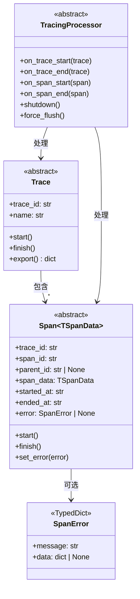
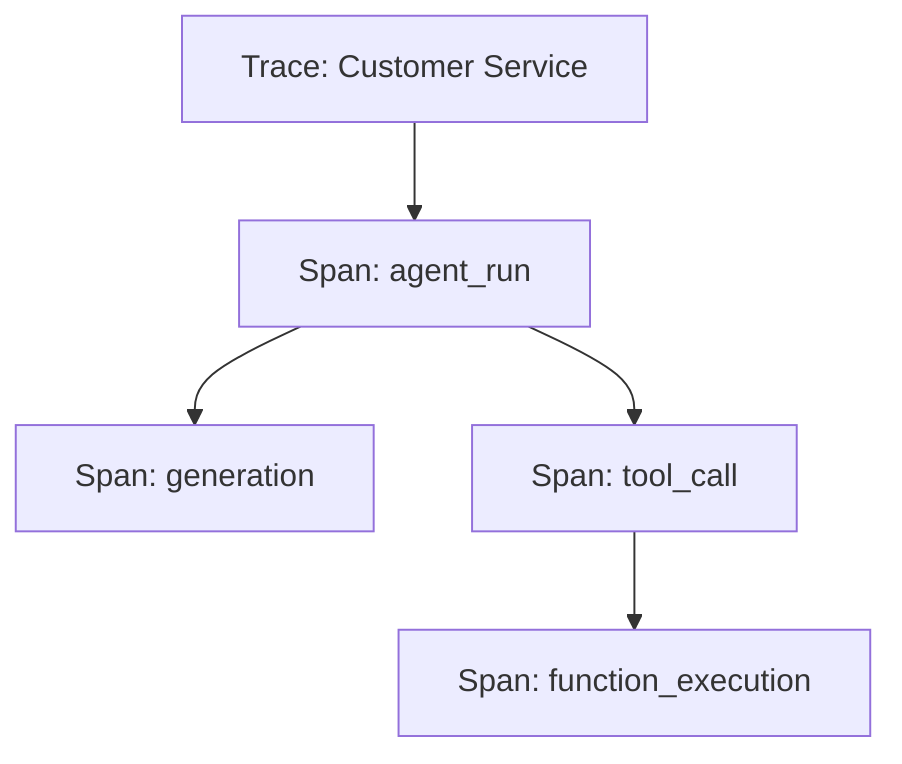

# OpenAI Agents Python SDK - Tracing 模块数据结构详解

## 1. 核心数据结构



## 2. Trace 数据结构

```python
@dataclass
class TraceImpl(Trace):
    _name: str              # 工作流名称
    _trace_id: str          # 唯一ID
    group_id: str | None    # 分组ID
    metadata: dict | None   # 元数据
    _processor: TracingProcessor  # 处理器
```

**导出格式：**
```python
{
    "object": "trace",
    "id": "trace_abc123",
    "workflow_name": "Customer Service",
    "group_id": "chat_session_1",
    "metadata": {"customer_id": "user_456"}
}
```

## 3. Span 数据结构

```python
@dataclass
class SpanImpl(Span):
    _trace_id: str          # 所属trace
    _span_id: str           # 唯一ID
    _parent_id: str | None  # 父span
    _started_at: str        # 开始时间
    _ended_at: str          # 结束时间
    _error: SpanError | None  # 错误信息
    _span_data: TSpanData   # 特定数据
```

## 4. SpanError 结构

```python
class SpanError(TypedDict):
    message: str            # 错误描述
    data: dict | None       # 错误上下文
```

**示例：**
```python
{
    "message": "Tool execution failed",
    "data": {"tool": "web_search", "error_code": 500}
}
```

## 5. Span层次结构



Tracing模块通过清晰的数据结构设计，实现了完整的执行链路追踪和监控。

