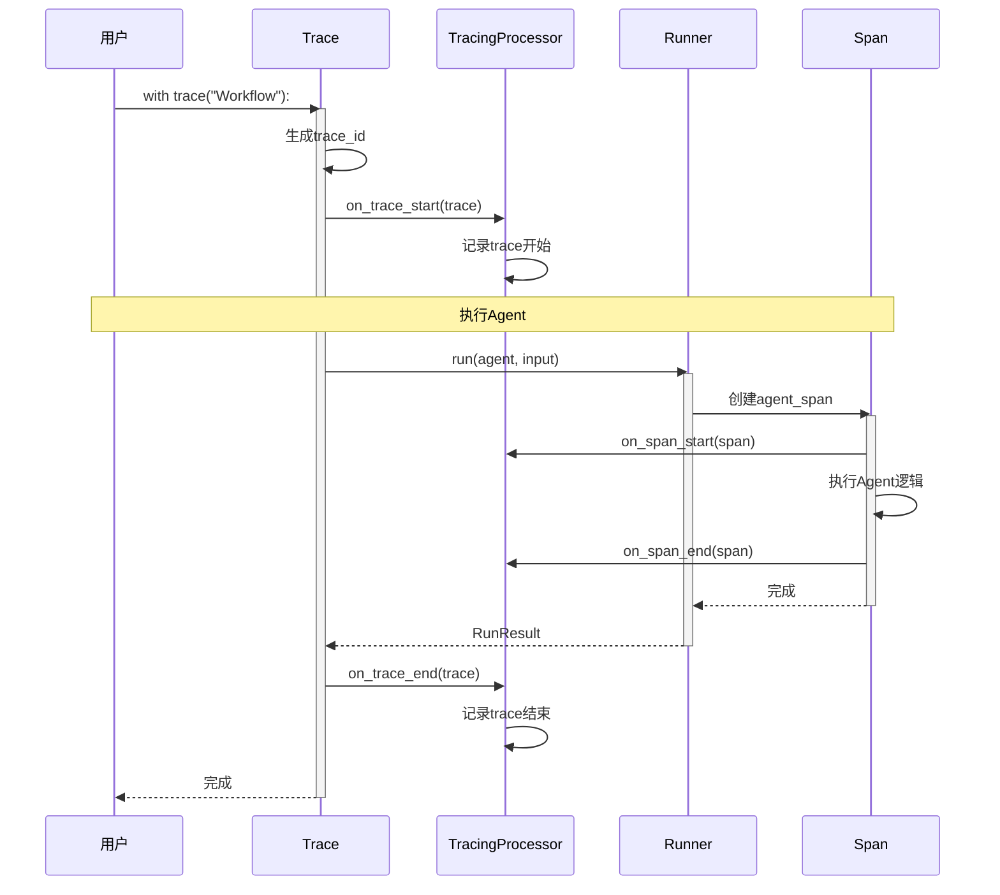
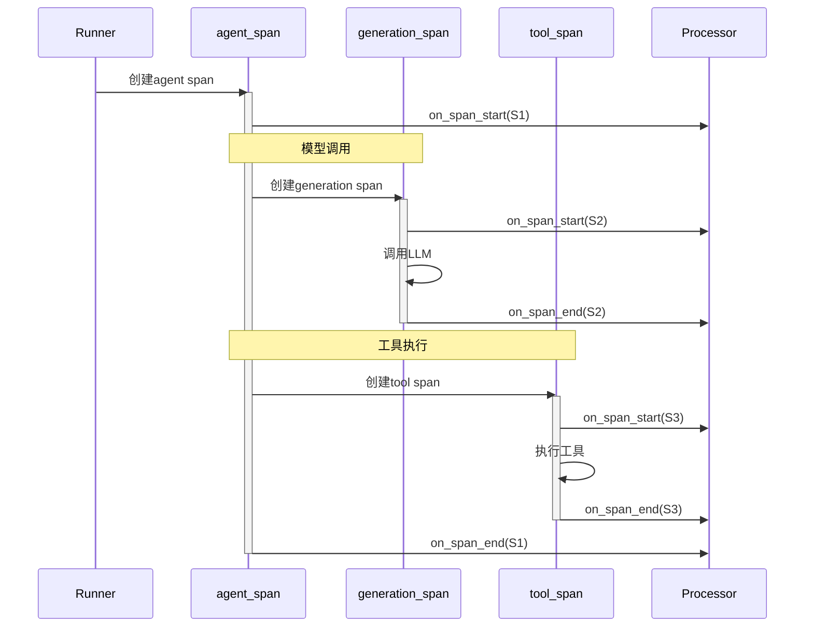
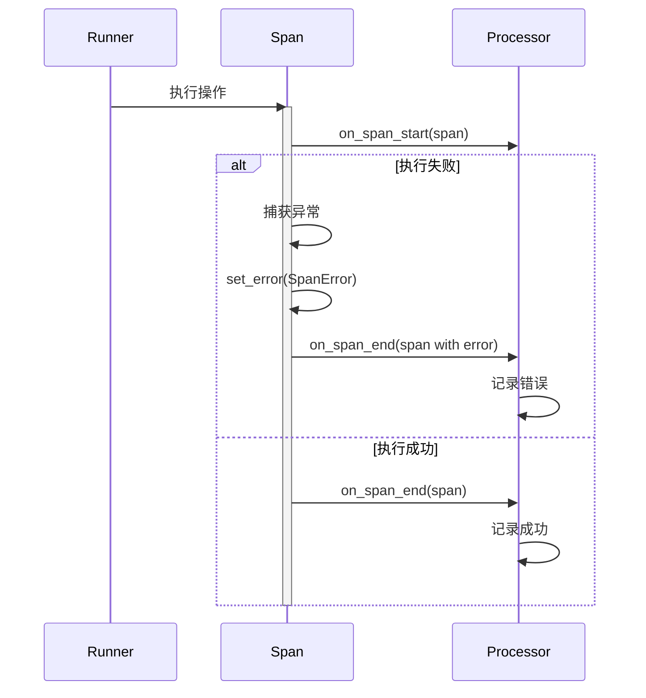
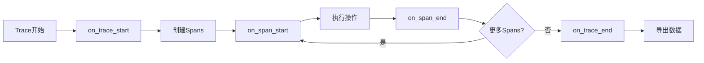

# OpenAI Agents Python SDK - Tracing 模块时序图详解

## 1. Trace创建和执行时序图

```mermaid
sequenceDiagram
    participant U as 用户
    participant T as Trace
    participant P as TracingProcessor
    participant R as Runner
    participant S as Span
    
    U->>T: with trace("Workflow"):
    activate T
    T->>T: 生成trace_id
    T->>P: on_trace_start(trace)
    P->>P: 记录trace开始
    
    Note over U,S: 执行Agent
    T->>R: run(agent, input)
    activate R
    
    R->>S: 创建agent_span
    activate S
    S->>P: on_span_start(span)
    
    S->>S: 执行Agent逻辑
    
    S->>P: on_span_end(span)
    S-->>R: 完成
    deactivate S
    
    R-->>T: RunResult
    deactivate R
    
    T->>P: on_trace_end(trace)
    P->>P: 记录trace结束
    T-->>U: 完成
    deactivate T
```

## 2. Span嵌套时序图

```mermaid
sequenceDiagram
    participant R as Runner
    participant S1 as agent_span
    participant S2 as generation_span
    participant S3 as tool_span
    participant P as Processor
    
    R->>S1: 创建agent span
    activate S1
    S1->>P: on_span_start(S1)
    
    Note over S1,S2: 模型调用
    S1->>S2: 创建generation span
    activate S2
    S2->>P: on_span_start(S2)
    S2->>S2: 调用LLM
    S2->>P: on_span_end(S2)
    deactivate S2
    
    Note over S1,S3: 工具执行
    S1->>S3: 创建tool span
    activate S3
    S3->>P: on_span_start(S3)
    S3->>S3: 执行工具
    S3->>P: on_span_end(S3)
    deactivate S3
    
    S1->>P: on_span_end(S1)
    deactivate S1
```

## 3. 错误处理时序图

```mermaid
sequenceDiagram
    participant R as Runner
    participant S as Span
    participant P as Processor
    
    R->>S: 执行操作
    activate S
    S->>P: on_span_start(span)
    
    alt 执行失败
        S->>S: 捕获异常
        S->>S: set_error(SpanError)
        S->>P: on_span_end(span with error)
        P->>P: 记录错误
    else 执行成功
        S->>P: on_span_end(span)
        P->>P: 记录成功
    end
    
    deactivate S
```

## 4. TracingProcessor数据流

```mermaid
graph LR
    A[Trace开始] --> B[on_trace_start]
    B --> C[创建Spans]
    C --> D[on_span_start]
    D --> E[执行操作]
    E --> F[on_span_end]
    F --> G{更多Spans?}
    G -->|是| D
    G -->|否| H[on_trace_end]
    H --> I[导出数据]
```

Tracing模块通过时序化的追踪机制，提供了完整的可观测性支持。

