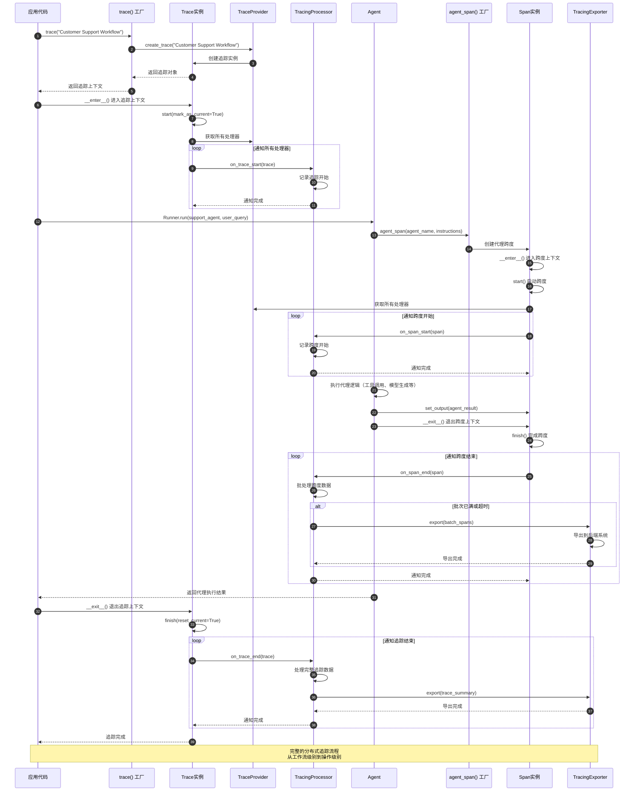
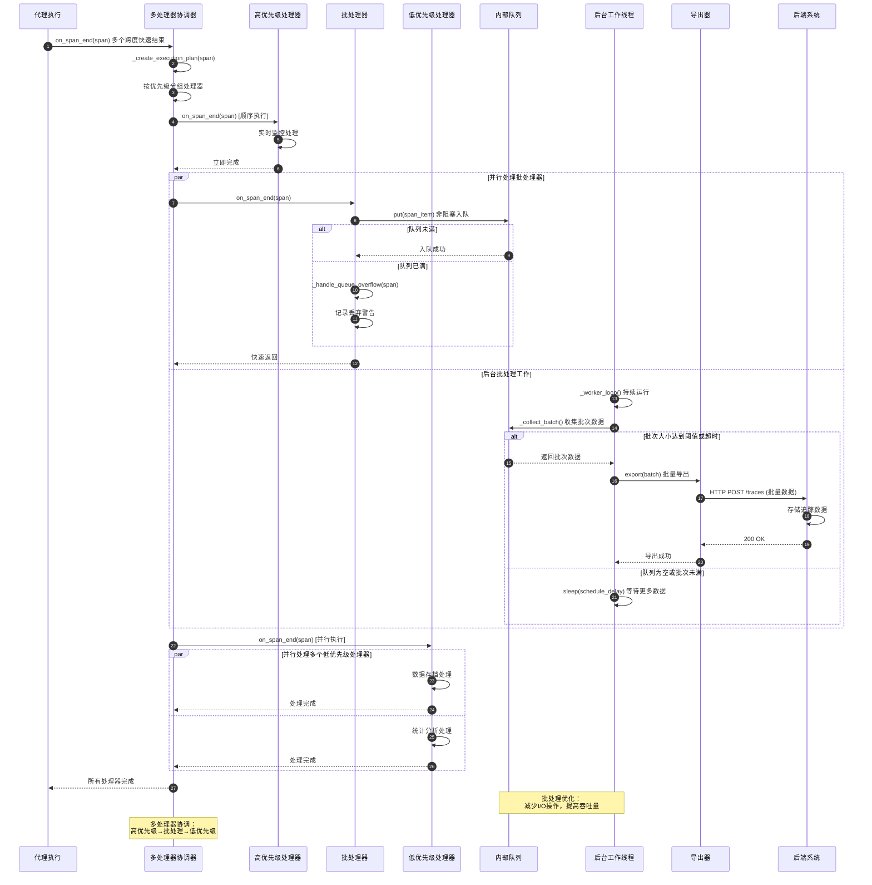
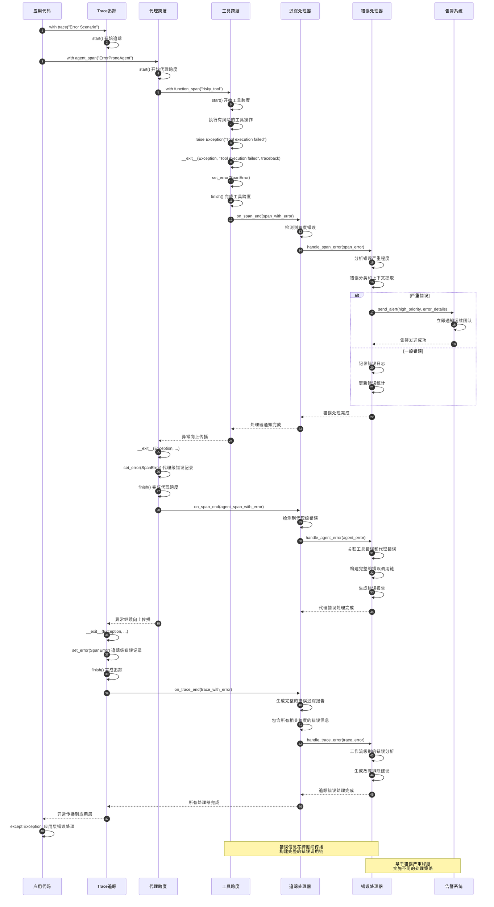

# OpenAI Agents Python SDK - Tracing 模块概览

## 1. 模块职责与边界

Tracing 模块是 OpenAI Agents Python SDK 的可观测性核心，负责追踪和监控智能代理系统的完整执行过程。该模块通过分布式追踪技术提供全方位的系统可见性，帮助开发者理解代理行为、诊断性能问题、监控系统健康状态。

### 核心职责

- **分布式追踪**：追踪跨多个代理和组件的完整执行链路
- **性能监控**：记录执行时间、资源使用和性能指标
- **错误诊断**：捕获和记录执行过程中的错误和异常
- **操作可见性**：提供详细的操作执行上下文和状态信息
- **数据导出**：支持多种格式的追踪数据导出和集成
- **生命周期管理**：管理追踪会话的创建、维护和清理

### 追踪层次体系

| 层次 | 概念 | 生命周期 | 主要用途 |
|------|------|----------|----------|
| Trace | 完整工作流 | 端到端业务操作 | 业务流程追踪、用户会话 |
| Span | 单个操作 | 具体功能执行 | 性能分析、错误定位 |
| Processor | 处理器 | 系统运行期 | 数据收集、导出集成 |
| Provider | 提供商 | 系统配置期 | 追踪基础设施管理 |

### 追踪数据类型

| 数据类型 | 对应场景 | 关键信息 | 分析价值 |
|----------|----------|----------|----------|
| `AgentSpanData` | 代理执行 | 指令、输入输出、模型设置 | 代理行为分析 |
| `GenerationSpanData` | 模型调用 | 提示、响应、Token使用 | 模型性能优化 |
| `FunctionSpanData` | 工具调用 | 函数名、参数、返回值 | 工具使用统计 |
| `GuardrailSpanData` | 安全检查 | 检查结果、违规信息 | 安全合规监控 |
| `HandoffSpanData` | 代理交接 | 源代理、目标代理、原因 | 协作流程分析 |

### 输入输出接口

**输入：**
- 操作上下文（执行环境、参数等）
- 追踪配置（工作流名称、元数据等）
- 操作结果（成功输出、错误信息等）

**输出：**
- 结构化追踪数据（时间、标识、关系等）
- 性能指标（延迟、吞吐量、资源使用）
- 错误诊断信息（堆栈、上下文、影响）

### 上下游依赖关系

**上游调用者：**
- `RunImpl`：代理执行引擎的核心追踪集成
- `Agent`：代理操作的自动追踪
- `FunctionTool`：工具调用的详细追踪
- `Model`：模型调用的性能追踪

**下游依赖：**
- 外部追踪系统（OpenTelemetry、Jaeger等）
- 日志系统（结构化日志输出）
- 监控平台（Prometheus、Grafana等）
- 数据存储（数据库、时序数据库等）

## 2. 模块架构图

```mermaid
flowchart TB
    subgraph "Tracing 可观测性模块"
        subgraph "追踪核心"
            TRACE[Trace 工作流追踪]
            SPAN[Span 操作追踪]
            SPANERROR[SpanError 错误信息]
        end
        
        subgraph "数据模型"
            SPANDATA[SpanData 基础数据]
            AGENTSPANDATA[AgentSpanData 代理数据]
            GENERATIONSPANDATA[GenerationSpanData 生成数据]
            FUNCTIONSPANDATA[FunctionSpanData 函数数据]
            GUARDRAILSPANDATA[GuardrailSpanData 防护数据]
            HANDOFFSPANDATA[HandoffSpanData 交接数据]
            SPEECHSPANDATA[SpeechSpanData 语音数据]
        end
        
        subgraph "处理器系统"
            TRACINGPROCESSOR[TracingProcessor 接口]
            BATCHPROCESSOR[BatchTraceProcessor 批处理]
            MULTIPROCESSOR[SynchronousMultiTracingProcessor 多处理器]
        end
        
        subgraph "导出器系统"
            TRACINGEXPORTER[TracingExporter 导出接口]
            CONSOLEEXPORTER[ConsoleSpanExporter 控制台导出]
            BACKENDEXPORTER[BackendSpanExporter 后端导出]
        end
        
        subgraph "提供商系统"
            TRACEPROVIDER[TraceProvider 接口]
            DEFAULTTRACEPROVIDER[DefaultTraceProvider 默认提供商]
        end
        
        subgraph "创建工厂"
            TRACECREATE[trace() 工厂]
            SPANCREATE[*_span() 工厂集合]
            CUSTOMSPAN[custom_span() 自定义]
        end
        
        subgraph "上下文管理"
            SCOPE[Scope 作用域]
            CONTEXTVARS[contextvars 上下文变量]
            CURRENTTRACE[get_current_trace()]
            CURRENTSPAN[get_current_span()]
        end
        
        subgraph "工具函数"
            GENUTILITY[gen_trace_id() / gen_span_id()]
            SETUP[set_trace_provider() / get_trace_provider()]
            LIFECYCLE[add_trace_processor() / set_trace_processors()]
        end
    end
    
    subgraph "系统集成"
        AGENTS[Agents 系统]
        RUNIMPL[RunImpl 执行引擎]
        MODELS[Models 模型系统]
        TOOLS[Tools 工具系统]
        GUARDRAILS[Guardrails 防护系统]
        HANDOFFS[Handoffs 交接系统]
    end
    
    subgraph "外部系统"
        OPENTELEMETRY[OpenTelemetry 标准]
        JAEGER[Jaeger 追踪系统]
        PROMETHEUS[Prometheus 监控]
        LOGGING[Logging 日志系统]
        DATABASES[数据存储系统]
    end
    
    TRACE --> SPAN
    SPAN --> SPANERROR
    SPAN --> SPANDATA
    
    SPANDATA --> AGENTSPANDATA
    SPANDATA --> GENERATIONSPANDATA
    SPANDATA --> FUNCTIONSPANDATA
    SPANDATA --> GUARDRAILSPANDATA
    SPANDATA --> HANDOFFSPANDATA
    SPANDATA --> SPEECHSPANDATA
    
    TRACINGPROCESSOR --> BATCHPROCESSOR
    TRACINGPROCESSOR --> MULTIPROCESSOR
    
    TRACINGEXPORTER --> CONSOLEEXPORTER
    TRACINGEXPORTER --> BACKENDEXPORTER
    
    BATCHPROCESSOR --> TRACINGEXPORTER
    
    TRACEPROVIDER --> DEFAULTTRACEPROVIDER
    DEFAULTTRACEPROVIDER --> MULTIPROCESSOR
    
    TRACECREATE --> TRACE
    SPANCREATE --> SPAN
    CUSTOMSPAN --> SPAN
    
    TRACE --> SCOPE
    SPAN --> SCOPE
    SCOPE --> CONTEXTVARS
    SCOPE --> CURRENTTRACE
    SCOPE --> CURRENTSPAN
    
    SETUP --> TRACEPROVIDER
    LIFECYCLE --> TRACINGPROCESSOR
    GENUTILITY --> TRACE
    GENUTILITY --> SPAN
    
    AGENTS --> TRACECREATE
    RUNIMPL --> SPANCREATE
    MODELS --> GENERATIONSPANDATA
    TOOLS --> FUNCTIONSPANDATA
    GUARDRAILS --> GUARDRAILSPANDATA
    HANDOFFS --> HANDOFFSPANDATA
    
    BACKENDEXPORTER --> OPENTELEMETRY
    BACKENDEXPORTER --> JAEGER
    BACKENDEXPORTER --> PROMETHEUS
    CONSOLEEXPORTER --> LOGGING
    BATCHPROCESSOR --> DATABASES
    
    style TRACE fill:#e1f5fe
    style SPAN fill:#f3e5f5
    style TRACINGPROCESSOR fill:#e8f5e8
    style TRACEPROVIDER fill:#fff3e0
    style SCOPE fill:#ffebee
```

**架构说明：**

### 分层设计原理

1. **追踪核心层**：`Trace` 和 `Span` 定义基本的追踪抽象
2. **数据模型层**：各种 `SpanData` 类型化不同场景的追踪数据
3. **处理器层**：`TracingProcessor` 实现数据收集和处理逻辑
4. **导出器层**：`TracingExporter` 负责数据的最终输出和集成
5. **提供商层**：`TraceProvider` 管理整个追踪基础设施

### 上下文管理设计

- **作用域管理**：`Scope` 类管理追踪的生命周期和嵌套关系
- **上下文变量**：使用 `contextvars` 实现线程安全的上下文传递
- **当前状态**：提供获取当前追踪和跨度的便捷接口
- **自动嵌套**：新创建的 Span 自动嵌套在当前 Trace 下

### 处理器模式

- **接口标准化**：`TracingProcessor` 定义统一的处理接口
- **批处理优化**：`BatchTraceProcessor` 提供高效的批量处理
- **多处理器支持**：`SynchronousMultiTracingProcessor` 支持同时使用多个处理器
- **异步处理**：支持异步处理避免阻塞主流程

### 扩展集成能力

- **标准兼容性**：支持 OpenTelemetry 等行业标准
- **多后端导出**：支持多种监控和存储系统
- **自定义扩展**：提供自定义 Span 和 Processor 的能力
- **配置灵活性**：支持运行时动态配置和调整

## 3. 关键算法与流程剖析

### 3.1 追踪会话管理算法

```python
class Trace(abc.ABC):
    """追踪会话的生命周期管理"""
    
    def __enter__(self) -> Trace:
        """进入追踪上下文"""
        self.start(mark_as_current=True)
        return self
    
    def __exit__(self, exc_type, exc_val, exc_tb):
        """退出追踪上下文并处理异常"""
        if exc_type is not None:
            # 记录追踪级别的异常
            self.set_error(SpanError(
                message=str(exc_val),
                data={"exception_type": exc_type.__name__}
            ))
        self.finish(reset_current=True)
    
    def start(self, mark_as_current: bool = False):
        """启动追踪会话"""
        # 1) 生成追踪标识
        if not hasattr(self, 'trace_id'):
            self.trace_id = gen_trace_id()
        
        # 2) 记录开始时间
        self.start_time = time.time()
        
        # 3) 设置为当前追踪
        if mark_as_current:
            self._scope = Scope.enter_trace(self)
        
        # 4) 通知所有处理器
        provider = get_trace_provider()
        for processor in provider.get_processors():
            try:
                processor.on_trace_start(self)
            except Exception as e:
                logger.error(f"Error in trace processor on_trace_start: {e}")
    
    def finish(self, reset_current: bool = False):
        """完成追踪会话"""
        # 1) 记录结束时间
        self.end_time = time.time()
        self.duration = self.end_time - self.start_time
        
        # 2) 重置当前追踪
        if reset_current and hasattr(self, '_scope'):
            self._scope.exit()
        
        # 3) 通知所有处理器
        provider = get_trace_provider()
        for processor in provider.get_processors():
            try:
                processor.on_trace_end(self)
            except Exception as e:
                logger.error(f"Error in trace processor on_trace_end: {e}")
```

**算法目的：** 管理分布式追踪会话的完整生命周期，确保追踪数据的完整性和一致性。

**生命周期特点：**
1. **上下文管理**：通过 `__enter__` 和 `__exit__` 实现自动的生命周期管理
2. **异常处理**：自动捕获和记录追踪级别的异常信息
3. **处理器通知**：在关键节点通知所有注册的处理器
4. **作用域管理**：通过 `Scope` 管理追踪的上下文作用域

### 3.2 跨度嵌套与关系管理算法

```python
class Span(abc.ABC, Generic[TSpanData]):
    """跨度的嵌套和关系管理"""
    
    def __enter__(self) -> Span[TSpanData]:
        """进入跨度上下文"""
        self.start()
        return self
    
    def __exit__(self, exc_type, exc_val, exc_tb):
        """退出跨度上下文并处理异常"""
        if exc_type is not None:
            self.set_error(SpanError(
                message=str(exc_val),
                data={
                    "exception_type": exc_type.__name__,
                    "traceback": traceback.format_exc()
                }
            ))
        self.finish()
    
    def start(self):
        """启动跨度执行"""
        # 1) 获取当前追踪上下文
        current_trace = get_current_trace()
        if current_trace is None:
            raise RuntimeError("No active trace found. Create a trace first.")
        
        # 2) 生成跨度标识
        self.span_id = gen_span_id()
        self.trace_id = current_trace.trace_id
        
        # 3) 设置父子关系
        current_span = get_current_span()
        if current_span is not None:
            self.parent_span_id = current_span.span_id
            current_span.add_child_span(self)
        else:
            self.parent_span_id = None
        
        # 4) 记录开始时间和设置为当前跨度
        self.start_time = time.time()
        self._scope = Scope.enter_span(self)
        
        # 5) 通知处理器
        provider = get_trace_provider()
        for processor in provider.get_processors():
            try:
                processor.on_span_start(self)
            except Exception as e:
                logger.error(f"Error in span processor on_span_start: {e}")
    
    def finish(self):
        """完成跨度执行"""
        # 1) 记录结束时间
        self.end_time = time.time()
        self.duration = self.end_time - self.start_time
        
        # 2) 退出作用域
        if hasattr(self, '_scope'):
            self._scope.exit()
        
        # 3) 更新父跨度
        if hasattr(self, 'parent_span_id') and self.parent_span_id:
            parent_span = get_current_span()
            if parent_span and parent_span.span_id == self.parent_span_id:
                parent_span.child_completed(self)
        
        # 4) 通知处理器
        provider = get_trace_provider()
        for processor in provider.get_processors():
            try:
                processor.on_span_end(self)
            except Exception as e:
                logger.error(f"Error in span processor on_span_end: {e}")
```

**算法目的：** 管理跨度的嵌套关系和执行生命周期，构建完整的调用链追踪。

**关系管理特点：**
1. **自动嵌套**：新跨度自动嵌套在当前跨度下形成调用链
2. **父子关系**：维护清晰的父子关系用于构建调用图
3. **作用域传递**：通过作用域机制实现上下文的正确传递
4. **异常传播**：异常信息在跨度间正确传播和记录

### 3.3 批处理器优化算法

```python
class BatchTraceProcessor(TracingProcessor):
    """高效的批处理追踪处理器"""
    
    def __init__(
        self,
        exporter: TracingExporter,
        max_export_batch_size: int = 512,
        schedule_delay_millis: int = 5000,
        max_queue_size: int = 2048,
        export_timeout_millis: int = 30000,
    ):
        self.exporter = exporter
        self.max_export_batch_size = max_export_batch_size
        self.schedule_delay_millis = schedule_delay_millis
        self.max_queue_size = max_queue_size
        self.export_timeout_millis = export_timeout_millis
        
        # 内部队列和线程管理
        self._queue = queue.Queue(maxsize=max_queue_size)
        self._worker_thread = None
        self._shutdown_event = threading.Event()
        self._start_worker()
    
    def on_span_end(self, span: Span[Any]) -> None:
        """跨度结束时的批处理逻辑"""
        if self._shutdown_event.is_set():
            return
        
        try:
            # 1) 将跨度添加到队列（非阻塞）
            span_item = self._create_span_item(span)
            self._queue.put_nowait(span_item)
        except queue.Full:
            # 2) 队列满时的降级策略
            logger.warning("Trace queue is full, dropping span")
            self._handle_queue_overflow(span)
    
    def _start_worker(self):
        """启动后台工作线程"""
        self._worker_thread = threading.Thread(
            target=self._worker_loop,
            name="BatchTraceProcessor-Worker",
            daemon=True
        )
        self._worker_thread.start()
    
    def _worker_loop(self):
        """批处理工作循环"""
        while not self._shutdown_event.is_set():
            try:
                # 1) 收集批次数据
                batch = self._collect_batch()
                if not batch:
                    time.sleep(self.schedule_delay_millis / 1000.0)
                    continue
                
                # 2) 执行批量导出
                self._export_batch(batch)
                
            except Exception as e:
                logger.error(f"Error in batch processor worker loop: {e}")
                time.sleep(1.0)  # 错误后短暂休眠
    
    def _collect_batch(self) -> list[SpanItem]:
        """收集一个批次的跨度数据"""
        batch = []
        deadline = time.time() + (self.schedule_delay_millis / 1000.0)
        
        while len(batch) < self.max_export_batch_size and time.time() < deadline:
            try:
                # 非阻塞获取队列项目
                timeout = max(0.1, deadline - time.time())
                item = self._queue.get(timeout=timeout)
                batch.append(item)
                self._queue.task_done()
            except queue.Empty:
                break
        
        return batch
    
    def _export_batch(self, batch: list[SpanItem]):
        """执行批量导出"""
        if not batch:
            return
        
        try:
            # 1) 设置导出超时
            with timeout_context(self.export_timeout_millis / 1000.0):
                self.exporter.export(batch)
            
            # 2) 记录导出统计
            logger.debug(f"Exported batch of {len(batch)} spans")
            
        except TimeoutError:
            logger.error(f"Export timeout for batch of {len(batch)} spans")
        except Exception as e:
            logger.error(f"Failed to export batch: {e}")
            # 3) 可选的重试逻辑
            self._handle_export_failure(batch, e)
    
    def force_flush(self, timeout_millis: int = 30000) -> bool:
        """强制刷新所有待处理数据"""
        if self._shutdown_event.is_set():
            return False
        
        # 1) 处理队列中的所有项目
        remaining_items = []
        try:
            while True:
                item = self._queue.get_nowait()
                remaining_items.append(item)
                self._queue.task_done()
        except queue.Empty:
            pass
        
        # 2) 批量导出剩余项目
        if remaining_items:
            start_time = time.time()
            while remaining_items and (time.time() - start_time) < (timeout_millis / 1000.0):
                batch_size = min(len(remaining_items), self.max_export_batch_size)
                batch = remaining_items[:batch_size]
                remaining_items = remaining_items[batch_size:]
                
                try:
                    self._export_batch(batch)
                except Exception as e:
                    logger.error(f"Error during force flush: {e}")
                    return False
        
        return True
```

**算法目的：** 通过批处理和异步处理优化追踪数据的收集和导出性能。

**优化策略分析：**
1. **批量处理**：减少频繁的I/O操作，提高导出效率
2. **异步工作线程**：避免阻塞主执行流程
3. **队列缓冲**：使用队列缓冲数据，平滑处理峰值
4. **超时控制**：设置合理的超时避免无限等待
5. **降级策略**：队列满时的优雅降级处理

### 3.4 多处理器协调算法

```python
class SynchronousMultiTracingProcessor(TracingProcessor):
    """多处理器的协调管理"""
    
    def __init__(self, processors: list[TracingProcessor]):
        self.processors = list(processors)
        self._lock = threading.RLock()  # 重入锁支持嵌套调用
    
    def on_trace_start(self, trace: Trace) -> None:
        """协调多个处理器的追踪开始事件"""
        with self._lock:
            results = []
            errors = []
            
            # 1) 并行通知所有处理器
            for processor in self.processors:
                try:
                    # 使用线程池并行执行
                    future = self._thread_pool.submit(processor.on_trace_start, trace)
                    results.append((processor, future))
                except Exception as e:
                    errors.append((processor, e))
                    logger.error(f"Error starting trace in processor {processor}: {e}")
            
            # 2) 等待所有处理器完成
            for processor, future in results:
                try:
                    future.result(timeout=5.0)  # 5秒超时
                except Exception as e:
                    errors.append((processor, e))
                    logger.error(f"Error in processor {processor} on_trace_start: {e}")
            
            # 3) 处理失败的处理器
            if errors:
                self._handle_processor_errors("on_trace_start", errors)
    
    def on_span_end(self, span: Span[Any]) -> None:
        """协调多个处理器的跨度结束事件"""
        with self._lock:
            # 1) 创建处理器执行计划
            execution_plan = self._create_execution_plan(span)
            
            # 2) 按优先级执行处理器
            for priority_group in execution_plan:
                self._execute_processor_group(priority_group, "on_span_end", span)
    
    def _create_execution_plan(self, span: Span[Any]) -> list[list[TracingProcessor]]:
        """根据跨度类型创建处理器执行计划"""
        # 按处理器优先级和跨度类型分组
        high_priority = []  # 实时监控处理器
        normal_priority = []  # 常规处理器
        low_priority = []  # 批处理、存档处理器
        
        for processor in self.processors:
            if hasattr(processor, 'priority'):
                if processor.priority == 'high':
                    high_priority.append(processor)
                elif processor.priority == 'low':
                    low_priority.append(processor)
                else:
                    normal_priority.append(processor)
            else:
                normal_priority.append(processor)
        
        return [high_priority, normal_priority, low_priority]
    
    def _execute_processor_group(
        self, 
        processors: list[TracingProcessor],
        method_name: str, 
        *args
    ):
        """执行一组处理器"""
        if not processors:
            return
        
        # 1) 高优先级处理器顺序执行（确保及时性）
        if hasattr(processors[0], 'priority') and processors[0].priority == 'high':
            for processor in processors:
                try:
                    method = getattr(processor, method_name)
                    method(*args)
                except Exception as e:
                    logger.error(f"Error in high-priority processor {processor}: {e}")
        else:
            # 2) 普通处理器并行执行（提高效率）
            futures = []
            for processor in processors:
                try:
                    method = getattr(processor, method_name)
                    future = self._thread_pool.submit(method, *args)
                    futures.append((processor, future))
                except Exception as e:
                    logger.error(f"Error submitting to processor {processor}: {e}")
            
            # 3) 收集执行结果
            for processor, future in futures:
                try:
                    future.result(timeout=10.0)  # 10秒超时
                except Exception as e:
                    logger.error(f"Error in processor {processor} {method_name}: {e}")
    
    def add_processor(self, processor: TracingProcessor):
        """动态添加处理器"""
        with self._lock:
            if processor not in self.processors:
                self.processors.append(processor)
                logger.info(f"Added trace processor: {processor}")
    
    def remove_processor(self, processor: TracingProcessor):
        """动态移除处理器"""
        with self._lock:
            if processor in self.processors:
                self.processors.remove(processor)
                logger.info(f"Removed trace processor: {processor}")
```

**算法目的：** 协调多个追踪处理器的执行，确保高效性和可靠性。

**协调策略特点：**
1. **优先级管理**：根据处理器重要性分配执行优先级
2. **并行执行**：利用线程池提高处理器并行度
3. **错误隔离**：单个处理器错误不影响其他处理器
4. **动态管理**：支持运行时添加和移除处理器

## 4. 数据结构与UML图

```mermaid
classDiagram
    class Trace {
        <<Abstract>>
        +str trace_id
        +str workflow_name
        +dict metadata
        +float start_time
        +float end_time
        
        +__enter__() Trace
        +__exit__(exc_type, exc_val, exc_tb) void
        +start(mark_as_current?) void
        +finish(reset_current?) void
        +set_error(error) void
    }
    
    class Span~TSpanData~ {
        <<Abstract>>
        +str span_id
        +str trace_id
        +str? parent_span_id
        +TSpanData span_data
        +float start_time
        +float end_time
        +SpanError? error
        
        +__enter__() Span[TSpanData]
        +__exit__(exc_type, exc_val, exc_tb) void
        +start() void
        +finish() void
        +set_error(error) void
        +set_output(output) void
    }
    
    class SpanData {
        <<Abstract>>
        +str operation_name
        +dict attributes
        +str status
    }
    
    class AgentSpanData {
        +str agent_name
        +str instructions
        +list tools
        +dict model_settings
        +Any input
        +Any output
    }
    
    class GenerationSpanData {
        +str model_name
        +str system_instructions
        +list input_messages
        +list output_messages
        +dict usage_stats
        +float temperature
    }
    
    class FunctionSpanData {
        +str function_name
        +dict arguments
        +Any result
        +float execution_time
        +str? error_message
    }
    
    class GuardrailSpanData {
        +str guardrail_name
        +str guardrail_type
        +bool tripwire_triggered
        +dict check_results
        +Any filtered_content
    }
    
    class HandoffSpanData {
        +str from_agent
        +str to_agent
        +str handoff_reason
        +dict context_data
        +bool successful
    }
    
    class TracingProcessor {
        <<Interface>>
        +on_trace_start(trace) void
        +on_trace_end(trace) void
        +on_span_start(span) void
        +on_span_end(span) void
        +shutdown() void
        +force_flush() bool
    }
    
    class BatchTraceProcessor {
        -TracingExporter exporter
        -Queue _queue
        -Thread _worker_thread
        -int max_export_batch_size
        -int schedule_delay_millis
        
        +__init__(exporter, **config)
        +on_span_end(span) void
        +force_flush(timeout?) bool
        -_worker_loop() void
        -_collect_batch() list[SpanItem]
        -_export_batch(batch) void
    }
    
    class SynchronousMultiTracingProcessor {
        -list[TracingProcessor] processors
        -ThreadPoolExecutor _thread_pool
        -RLock _lock
        
        +add_processor(processor) void
        +remove_processor(processor) void
        -_create_execution_plan(span) list[list[TracingProcessor]]
        -_execute_processor_group(processors, method, args) void
    }
    
    class TracingExporter {
        <<Interface>>
        +export(items) void
        +shutdown() void
    }
    
    class ConsoleSpanExporter {
        +export(items) void
        +shutdown() void
    }
    
    class BackendSpanExporter {
        -str endpoint
        -dict headers
        -Session http_session
        
        +export(items) void
        +shutdown() void
        -_send_to_backend(data) void
    }
    
    class TraceProvider {
        <<Interface>>
        +create_trace(name, **kwargs) Trace
        +register_processor(processor) void
        +set_processors(processors) void
        +get_processors() list[TracingProcessor]
        +shutdown() void
    }
    
    class DefaultTraceProvider {
        -SynchronousMultiTracingProcessor _processor
        -bool _disabled
        
        +create_trace(name, **kwargs) Trace
        +register_processor(processor) void
        +set_processors(processors) void
        +get_processors() list[TracingProcessor]
        +shutdown() void
    }
    
    class Scope {
        -contextvars.Token? _trace_token
        -contextvars.Token? _span_token
        
        +enter_trace(trace) Scope
        +enter_span(span) Scope
        +exit() void
    }
    
    class SpanError {
        <<TypedDict>>
        +str message
        +dict? data
    }
    
    Trace --> Span : contains
    Span --> SpanData : has
    Span --> SpanError : may have
    
    SpanData <|-- AgentSpanData
    SpanData <|-- GenerationSpanData
    SpanData <|-- FunctionSpanData
    SpanData <|-- GuardrailSpanData
    SpanData <|-- HandoffSpanData
    
    TracingProcessor <|.. BatchTraceProcessor
    TracingProcessor <|.. SynchronousMultiTracingProcessor
    
    BatchTraceProcessor --> TracingExporter : uses
    
    TracingExporter <|.. ConsoleSpanExporter
    TracingExporter <|.. BackendSpanExporter
    
    TraceProvider <|.. DefaultTraceProvider
    DefaultTraceProvider --> SynchronousMultiTracingProcessor : manages
    
    Trace --> Scope : uses
    Span --> Scope : uses
    
    note for Trace "工作流级别的追踪<br/>管理完整的业务流程"
    note for Span "操作级别的追踪<br/>记录具体的执行细节"
    note for BatchTraceProcessor "批处理优化<br/>提高导出效率"
    note for SynchronousMultiTracingProcessor "多处理器协调<br/>支持复杂的处理需求"
```



**类图说明：**

### 追踪层次结构

1. **Trace层级**：代表完整的工作流追踪，包含多个相关的Span
2. **Span层级**：代表单个操作的追踪，通过泛型支持不同类型的数据
3. **SpanData层级**：不同场景的结构化数据模型
4. **错误信息**：`SpanError` 提供标准化的错误记录格式

### 处理器架构

- **接口标准化**：`TracingProcessor` 定义统一的处理接口
- **批处理优化**：`BatchTraceProcessor` 提供高效的批量处理能力
- **多处理器管理**：`SynchronousMultiTracingProcessor` 协调多个处理器
- **导出器分离**：`TracingExporter` 负责最终的数据导出

### 上下文管理

- **Scope机制**：管理追踪和跨度的上下文作用域
- **Provider模式**：`TraceProvider` 管理追踪基础设施
- **线程安全**：通过contextvars和锁机制确保线程安全

## 5. 典型使用场景时序图

### 场景一：完整的代理追踪流程



### 场景二：多处理器批处理优化



### 场景三：错误追踪与异常处理



## 6. 最佳实践与使用模式

### 6.1 工作流级别的追踪配置

```python
from agents import trace, agent_span, Runner
import asyncio

async def customer_service_workflow():
    """客服工作流的完整追踪示例"""
    
    # 1. 创建工作流级别的追踪
    with trace(
        workflow_name="Customer Service Chat",
        group_id="session_12345",  # 会话分组
        metadata={
            "customer_id": "user_789",
            "channel": "web_chat",
            "agent_version": "v2.1.0",
            "priority": "high"
        }
    ) as main_trace:
        
        # 2. 分流阶段追踪
        with agent_span("triage_analysis") as triage_span:
            triage_span.set_attributes({
                "stage": "triage",
                "input_type": "user_query"
            })
            
            triage_result = await Runner.run(
                triage_agent,
                "我的订单状态有问题",
                context={"trace_id": main_trace.trace_id}
            )
            
            triage_span.set_output({
                "classification": triage_result.classification,
                "confidence": triage_result.confidence,
                "recommended_agent": triage_result.target_agent
            })
        
        # 3. 专业处理阶段追踪
        if triage_result.target_agent == "order_specialist":
            with agent_span("order_specialist_handling") as specialist_span:
                specialist_span.set_attributes({
                    "stage": "specialist_handling",
                    "specialist_type": "order",
                    "handoff_reason": triage_result.reason
                })
                
                final_result = await Runner.run(
                    order_specialist_agent,
                    triage_result.context,
                    context={"trace_id": main_trace.trace_id}
                )
                
                specialist_span.set_output({
                    "resolution_status": final_result.status,
                    "customer_satisfaction": final_result.satisfaction_score,
                    "follow_up_required": final_result.needs_followup
                })
        
        # 4. 设置工作流级别的输出
        main_trace.set_output({
            "workflow_status": "completed",
            "total_agents_used": 2,
            "customer_issue_resolved": True,
            "session_duration": main_trace.duration
        })

# 运行追踪工作流
asyncio.run(customer_service_workflow())
```

### 6.2 自定义追踪处理器实现

```python
from agents.tracing import TracingProcessor, Span, Trace
import json
import time
from typing import Dict, List
from dataclasses import dataclass, asdict
import asyncio

@dataclass
class PerformanceMetrics:
    """性能指标数据结构"""
    operation_name: str
    duration_ms: float
    timestamp: float
    trace_id: str
    span_id: str
    success: bool
    error_message: str = None

class PerformanceMonitoringProcessor(TracingProcessor):
    """性能监控追踪处理器"""
    
    def __init__(self, metrics_threshold_ms: float = 1000.0):
        self.metrics_threshold_ms = metrics_threshold_ms
        self.active_spans: Dict[str, Span] = {}
        self.performance_metrics: List[PerformanceMetrics] = []
        self.slow_operations: List[PerformanceMetrics] = []
        
    def on_span_start(self, span: Span) -> None:
        """跨度开始时记录"""
        self.active_spans[span.span_id] = span
        
        # 记录开始时间戳
        if hasattr(span.span_data, 'operation_name'):
            print(f"[PERF] Starting operation: {span.span_data.operation_name}")
    
    def on_span_end(self, span: Span) -> None:
        """跨度结束时分析性能"""
        if span.span_id in self.active_spans:
            del self.active_spans[span.span_id]
        
        # 计算执行时间
        duration_ms = (span.end_time - span.start_time) * 1000
        
        # 创建性能指标
        metrics = PerformanceMetrics(
            operation_name=getattr(span.span_data, 'operation_name', 'unknown'),
            duration_ms=duration_ms,
            timestamp=span.end_time,
            trace_id=span.trace_id,
            span_id=span.span_id,
            success=span.error is None,
            error_message=span.error.get('message') if span.error else None
        )
        
        self.performance_metrics.append(metrics)
        
        # 检查是否为慢操作
        if duration_ms > self.metrics_threshold_ms:
            self.slow_operations.append(metrics)
            self._alert_slow_operation(metrics)
        
        # 定期清理旧数据
        self._cleanup_old_metrics()
    
    def on_trace_start(self, trace: Trace) -> None:
        """追踪开始时的处理"""
        print(f"[PERF] Starting trace: {trace.workflow_name} (ID: {trace.trace_id})")
    
    def on_trace_end(self, trace: Trace) -> None:
        """追踪结束时生成报告"""
        trace_spans = [m for m in self.performance_metrics if m.trace_id == trace.trace_id]
        
        if trace_spans:
            self._generate_trace_performance_report(trace, trace_spans)
    
    def _alert_slow_operation(self, metrics: PerformanceMetrics):
        """慢操作告警"""
        print(f"[PERF ALERT] Slow operation detected:")
        print(f"  Operation: {metrics.operation_name}")
        print(f"  Duration: {metrics.duration_ms:.2f}ms (threshold: {self.metrics_threshold_ms}ms)")
        print(f"  Trace ID: {metrics.trace_id}")
        print(f"  Success: {metrics.success}")
        if metrics.error_message:
            print(f"  Error: {metrics.error_message}")
    
    def _generate_trace_performance_report(self, trace: Trace, spans: List[PerformanceMetrics]):
        """生成追踪性能报告"""
        total_duration = sum(s.duration_ms for s in spans)
        success_rate = sum(1 for s in spans if s.success) / len(spans) * 100
        slow_operations_count = sum(1 for s in spans if s.duration_ms > self.metrics_threshold_ms)
        
        print(f"\n[PERF REPORT] Trace: {trace.workflow_name}")
        print(f"  Total Spans: {len(spans)}")
        print(f"  Total Duration: {total_duration:.2f}ms")
        print(f"  Success Rate: {success_rate:.1f}%")
        print(f"  Slow Operations: {slow_operations_count}")
        
        # 最慢的操作
        slowest = max(spans, key=lambda s: s.duration_ms)
        print(f"  Slowest Operation: {slowest.operation_name} ({slowest.duration_ms:.2f}ms)")
    
    def _cleanup_old_metrics(self):
        """清理旧的性能指标数据"""
        current_time = time.time()
        cutoff_time = current_time - 3600  # 保留1小时内的数据
        
        self.performance_metrics = [
            m for m in self.performance_metrics 
            if m.timestamp > cutoff_time
        ]
        
        self.slow_operations = [
            m for m in self.slow_operations 
            if m.timestamp > cutoff_time
        ]
    
    def get_performance_summary(self) -> Dict:
        """获取性能摘要"""
        if not self.performance_metrics:
            return {"status": "no_data"}
        
        recent_metrics = [
            m for m in self.performance_metrics 
            if time.time() - m.timestamp < 300  # 最近5分钟
        ]
        
        if not recent_metrics:
            return {"status": "no_recent_data"}
        
        avg_duration = sum(m.duration_ms for m in recent_metrics) / len(recent_metrics)
        success_rate = sum(1 for m in recent_metrics if m.success) / len(recent_metrics) * 100
        
        return {
            "status": "active",
            "recent_operations": len(recent_metrics),
            "average_duration_ms": round(avg_duration, 2),
            "success_rate_percent": round(success_rate, 1),
            "slow_operations_count": len([m for m in recent_metrics if m.duration_ms > self.metrics_threshold_ms])
        }
    
    def shutdown(self) -> None:
        """关闭处理器"""
        print(f"[PERF] Shutting down performance monitor. Processed {len(self.performance_metrics)} spans.")
        
        # 生成最终报告
        if self.slow_operations:
            print(f"[PERF] Found {len(self.slow_operations)} slow operations during session.")
        
        # 清理资源
        self.active_spans.clear()
        self.performance_metrics.clear()
        self.slow_operations.clear()
    
    def force_flush(self) -> bool:
        """强制刷新（性能监控器不需要缓冲）"""
        return True

# 使用自定义性能监控处理器
perf_monitor = PerformanceMonitoringProcessor(metrics_threshold_ms=500.0)

# 注册处理器
from agents.tracing import add_trace_processor
add_trace_processor(perf_monitor)
```

### 6.3 结构化日志集成处理器

```python
import logging
import json
from datetime import datetime
from agents.tracing import TracingProcessor

# 配置结构化日志
logging.basicConfig(
    level=logging.INFO,
    format='%(asctime)s - %(name)s - %(levelname)s - %(message)s'
)

class StructuredLoggingProcessor(TracingProcessor):
    """结构化日志集成处理器"""
    
    def __init__(self, logger_name: str = "agents.tracing"):
        self.logger = logging.getLogger(logger_name)
        self.trace_contexts: Dict[str, Dict] = {}
    
    def on_trace_start(self, trace: Trace) -> None:
        """追踪开始时记录结构化日志"""
        self.trace_contexts[trace.trace_id] = {
            "workflow_name": trace.workflow_name,
            "start_time": datetime.fromtimestamp(trace.start_time).isoformat(),
            "metadata": getattr(trace, 'metadata', {}),
            "spans_count": 0
        }
        
        log_data = {
            "event": "trace_start",
            "trace_id": trace.trace_id,
            "workflow_name": trace.workflow_name,
            "timestamp": datetime.fromtimestamp(trace.start_time).isoformat(),
            "metadata": getattr(trace, 'metadata', {})
        }
        
        self.logger.info(f"TRACE_START: {json.dumps(log_data)}")
    
    def on_trace_end(self, trace: Trace) -> None:
        """追踪结束时记录汇总日志"""
        trace_context = self.trace_contexts.get(trace.trace_id, {})
        duration_ms = (trace.end_time - trace.start_time) * 1000
        
        log_data = {
            "event": "trace_end",
            "trace_id": trace.trace_id,
            "workflow_name": trace.workflow_name,
            "start_time": trace_context.get("start_time"),
            "end_time": datetime.fromtimestamp(trace.end_time).isoformat(),
            "duration_ms": round(duration_ms, 2),
            "spans_count": trace_context.get("spans_count", 0),
            "success": trace.error is None,
            "error": trace.error.get('message') if trace.error else None,
            "metadata": trace_context.get("metadata", {})
        }
        
        log_level = logging.ERROR if trace.error else logging.INFO
        self.logger.log(log_level, f"TRACE_END: {json.dumps(log_data)}")
        
        # 清理上下文
        if trace.trace_id in self.trace_contexts:
            del self.trace_contexts[trace.trace_id]
    
    def on_span_start(self, span: Span) -> None:
        """跨度开始时记录"""
        if span.trace_id in self.trace_contexts:
            self.trace_contexts[span.trace_id]["spans_count"] += 1
        
        # 只记录关键操作的开始
        if self._should_log_span_start(span):
            log_data = {
                "event": "span_start",
                "trace_id": span.trace_id,
                "span_id": span.span_id,
                "parent_span_id": getattr(span, 'parent_span_id', None),
                "operation": self._extract_operation_name(span),
                "timestamp": datetime.fromtimestamp(span.start_time).isoformat(),
                "attributes": self._extract_span_attributes(span)
            }
            
            self.logger.info(f"SPAN_START: {json.dumps(log_data)}")
    
    def on_span_end(self, span: Span) -> None:
        """跨度结束时记录详细信息"""
        duration_ms = (span.end_time - span.start_time) * 1000
        
        log_data = {
            "event": "span_end",
            "trace_id": span.trace_id,
            "span_id": span.span_id,
            "parent_span_id": getattr(span, 'parent_span_id', None),
            "operation": self._extract_operation_name(span),
            "start_time": datetime.fromtimestamp(span.start_time).isoformat(),
            "end_time": datetime.fromtimestamp(span.end_time).isoformat(),
            "duration_ms": round(duration_ms, 2),
            "success": span.error is None,
            "error": span.error.get('message') if span.error else None,
            "attributes": self._extract_span_attributes(span),
            "output_summary": self._extract_output_summary(span)
        }
        
        # 根据结果和性能选择日志级别
        if span.error:
            log_level = logging.ERROR
        elif duration_ms > 1000:  # 超过1秒的操作
            log_level = logging.WARNING
        else:
            log_level = logging.INFO
        
        self.logger.log(log_level, f"SPAN_END: {json.dumps(log_data)}")
    
    def _should_log_span_start(self, span: Span) -> bool:
        """判断是否应该记录跨度开始"""
        # 只记录重要操作的开始
        important_operations = {
            'agent_span', 'generation_span', 'handoff_span', 
            'guardrail_span', 'function_span'
        }
        operation = self._extract_operation_name(span)
        return operation in important_operations
    
    def _extract_operation_name(self, span: Span) -> str:
        """提取操作名称"""
        if hasattr(span.span_data, 'operation_name'):
            return span.span_data.operation_name
        elif hasattr(span.span_data, 'agent_name'):
            return f"agent:{span.span_data.agent_name}"
        elif hasattr(span.span_data, 'function_name'):
            return f"function:{span.span_data.function_name}"
        else:
            return "unknown_operation"
    
    def _extract_span_attributes(self, span: Span) -> Dict:
        """提取跨度属性"""
        attributes = {}
        
        if hasattr(span.span_data, 'agent_name'):
            attributes['agent_name'] = span.span_data.agent_name
        
        if hasattr(span.span_data, 'function_name'):
            attributes['function_name'] = span.span_data.function_name
        
        if hasattr(span.span_data, 'model_name'):
            attributes['model_name'] = span.span_data.model_name
        
        if hasattr(span.span_data, 'guardrail_name'):
            attributes['guardrail_name'] = span.span_data.guardrail_name
            attributes['tripwire_triggered'] = getattr(span.span_data, 'tripwire_triggered', False)
        
        return attributes
    
    def _extract_output_summary(self, span: Span) -> Dict:
        """提取输出摘要"""
        summary = {}
        
        if hasattr(span.span_data, 'usage_stats'):
            summary['token_usage'] = span.span_data.usage_stats
        
        if hasattr(span.span_data, 'result') and span.span_data.result:
            result_str = str(span.span_data.result)
            summary['output_length'] = len(result_str)
            summary['output_preview'] = result_str[:100] + "..." if len(result_str) > 100 else result_str
        
        if hasattr(span.span_data, 'successful'):
            summary['successful'] = span.span_data.successful
        
        return summary
    
    def shutdown(self) -> None:
        """关闭处理器"""
        self.logger.info("PROCESSOR_SHUTDOWN: StructuredLoggingProcessor shutting down")
        self.trace_contexts.clear()
    
    def force_flush(self) -> bool:
        """强制刷新"""
        # 日志处理器通常不需要缓冲
        return True

# 注册结构化日志处理器
structured_logger = StructuredLoggingProcessor("agents.production")
add_trace_processor(structured_logger)
```

### 6.4 多环境追踪配置管理

```python
from agents.tracing import (
    set_trace_provider, DefaultTraceProvider, 
    BatchTraceProcessor, ConsoleSpanExporter, BackendSpanExporter
)
from enum import Enum
import os

class Environment(Enum):
    DEVELOPMENT = "development"
    STAGING = "staging"
    PRODUCTION = "production"

class TracingConfigManager:
    """追踪配置管理器"""
    
    @staticmethod
    def setup_tracing(env: Environment = None):
        """根据环境配置追踪系统"""
        if env is None:
            env_str = os.getenv("ENVIRONMENT", "development").lower()
            env = Environment(env_str)
        
        if env == Environment.DEVELOPMENT:
            TracingConfigManager._setup_development()
        elif env == Environment.STAGING:
            TracingConfigManager._setup_staging()
        elif env == Environment.PRODUCTION:
            TracingConfigManager._setup_production()
    
    @staticmethod
    def _setup_development():
        """开发环境配置：控制台输出，详细日志"""
        print("Setting up DEVELOPMENT tracing...")
        
        # 控制台导出器
        console_exporter = ConsoleSpanExporter()
        console_processor = BatchTraceProcessor(
            exporter=console_exporter,
            max_export_batch_size=10,  # 小批次，快速输出
            schedule_delay_millis=1000,  # 1秒延迟
        )
        
        # 性能监控（低阈值）
        perf_monitor = PerformanceMonitoringProcessor(metrics_threshold_ms=100.0)
        
        # 结构化日志
        structured_logger = StructuredLoggingProcessor("agents.dev")
        
        # 创建提供商
        provider = DefaultTraceProvider()
        provider.set_processors([console_processor, perf_monitor, structured_logger])
        
        set_trace_provider(provider)
        print("✓ Development tracing configured")
    
    @staticmethod
    def _setup_staging():
        """预发布环境配置：后端导出，适中的批处理"""
        print("Setting up STAGING tracing...")
        
        # 后端导出器
        backend_exporter = BackendSpanExporter(
            endpoint=os.getenv("TRACING_ENDPOINT", "http://jaeger-staging:14268/api/traces"),
            headers={"Authorization": f"Bearer {os.getenv('TRACING_TOKEN', '')}"}
        )
        
        backend_processor = BatchTraceProcessor(
            exporter=backend_exporter,
            max_export_batch_size=100,
            schedule_delay_millis=5000,  # 5秒延迟
            max_queue_size=1000
        )
        
        # 性能监控（中等阈值）
        perf_monitor = PerformanceMonitoringProcessor(metrics_threshold_ms=500.0)
        
        # 错误监控
        error_monitor = ErrorTrackingProcessor(
            alert_webhook=os.getenv("SLACK_WEBHOOK_URL")
        )
        
        provider = DefaultTraceProvider()
        provider.set_processors([backend_processor, perf_monitor, error_monitor])
        
        set_trace_provider(provider)
        print("✓ Staging tracing configured")
    
    @staticmethod
    def _setup_production():
        """生产环境配置：高性能批处理，多后端导出"""
        print("Setting up PRODUCTION tracing...")
        
        # 主要的后端导出器
        primary_exporter = BackendSpanExporter(
            endpoint=os.getenv("PRIMARY_TRACING_ENDPOINT"),
            headers={"Authorization": f"Bearer {os.getenv('PRIMARY_TRACING_TOKEN')}"}
        )
        
        primary_processor = BatchTraceProcessor(
            exporter=primary_exporter,
            max_export_batch_size=512,  # 大批次
            schedule_delay_millis=10000,  # 10秒延迟
            max_queue_size=2048,
            export_timeout_millis=30000
        )
        
        # 备用导出器（防止主要系统故障）
        backup_exporter = BackendSpanExporter(
            endpoint=os.getenv("BACKUP_TRACING_ENDPOINT"),
            headers={"Authorization": f"Bearer {os.getenv('BACKUP_TRACING_TOKEN')}"}
        )
        
        backup_processor = BatchTraceProcessor(
            exporter=backup_exporter,
            max_export_batch_size=256,
            schedule_delay_millis=15000,
            max_queue_size=1024
        )
        
        # 性能监控（高阈值）
        perf_monitor = PerformanceMonitoringProcessor(metrics_threshold_ms=2000.0)
        
        # 关键错误监控
        critical_error_monitor = CriticalErrorProcessor(
            pager_duty_key=os.getenv("PAGERDUTY_API_KEY"),
            severity_threshold="high"
        )
        
        # 合规性审计
        audit_processor = AuditTrailProcessor(
            compliance_endpoint=os.getenv("COMPLIANCE_ENDPOINT"),
            retention_days=90
        )
        
        provider = DefaultTraceProvider()
        provider.set_processors([
            primary_processor,
            backup_processor,
            perf_monitor,
            critical_error_monitor,
            audit_processor
        ])
        
        set_trace_provider(provider)
        print("✓ Production tracing configured")

# 在应用启动时配置追踪
def initialize_application():
    """应用初始化"""
    # 配置追踪系统
    TracingConfigManager.setup_tracing()
    
    # 其他初始化逻辑...
    print("Application initialized with tracing")

# 使用示例
if __name__ == "__main__":
    initialize_application()
    
    # 测试追踪功能
    async def test_tracing():
        with trace("Test Workflow") as t:
            with custom_span("test_operation") as s:
                await asyncio.sleep(0.1)
                s.set_output({"test": "success"})
    
    asyncio.run(test_tracing())
```

Tracing模块通过完善的分布式追踪架构和灵活的处理器系统，为OpenAI Agents提供了强大的可观测性能力，支持从开发调试到生产监控的全生命周期需求。
