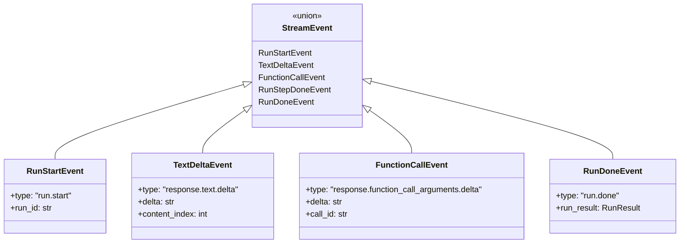
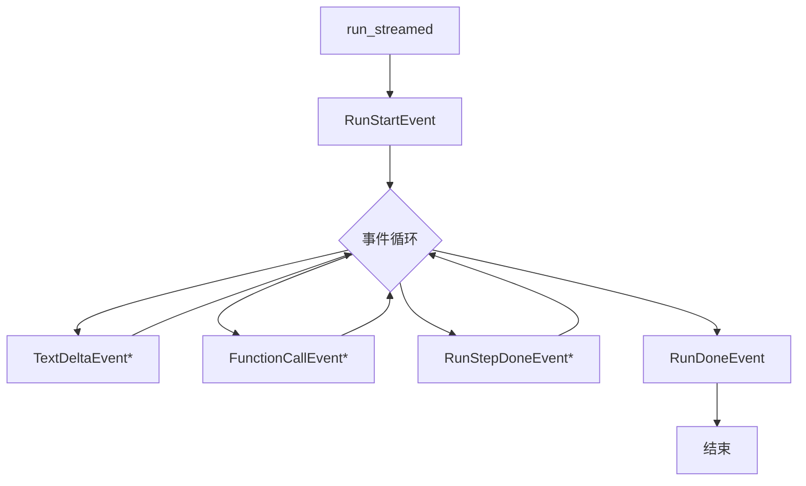
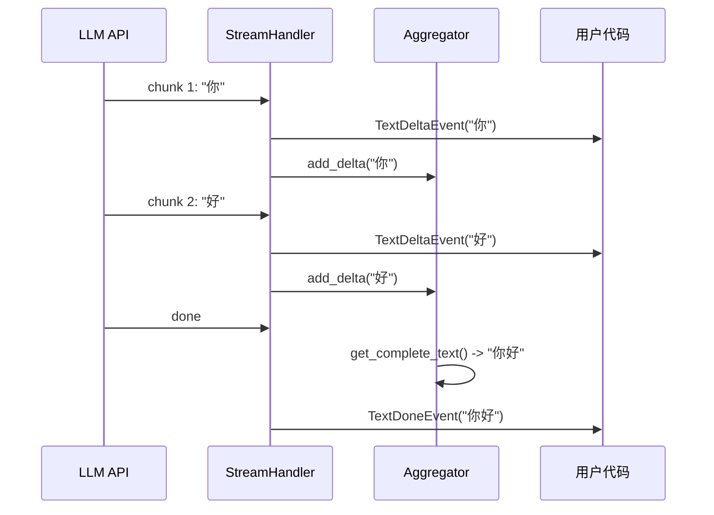

# OpenAI Agents Python SDK - Streaming 模块数据结构详解

## 1. 流式事件结构



## 2. 事件类型详解

### 2.1 文本事件

```python
# 文本增量事件
class TextDeltaEvent(TypedDict):
    type: Literal["response.text.delta"]
    delta: str               # 文本片段
    content_index: int       # 内容索引
    
# 文本完成事件
class TextDoneEvent(TypedDict):
    type: Literal["response.output_item.done"]
    item: ResponseTextItem   # 完整文本项
```

### 2.2 工具调用事件

```python
# 工具参数增量
class FunctionCallArgumentsDelta(TypedDict):
    type: Literal["response.function_call_arguments.delta"]
    delta: str               # 参数JSON片段
    call_id: str             # 调用ID
    
# 工具调用完成
class FunctionCallDone(TypedDict):
    type: Literal["response.function_call.done"]
    call_id: str
    name: str
    arguments: str           # 完整参数JSON
```

### 2.3 运行事件

```python
# 运行开始
class RunStartEvent(TypedDict):
    type: Literal["run.start"]
    run_id: str
    
# 步骤完成
class RunStepDoneEvent(TypedDict):
    type: Literal["run.step.done"]
    step_number: int
    
# 运行完成
class RunDoneEvent(TypedDict):
    type: Literal["run.done"]
    run_result: RunResult
```

## 3. 事件流结构



## 4. 事件聚合器

```python
class EventAggregator:
    """聚合流式事件为完整对象"""
    
    text_buffers: dict[int, str]      # 文本缓冲
    args_buffers: dict[str, str]      # 参数缓冲
    
    def add_text_delta(self, index: int, delta: str):
        """累积文本增量"""
        self.text_buffers[index] = self.text_buffers.get(index, "") + delta
    
    def add_args_delta(self, call_id: str, delta: str):
        """累积参数增量"""
        self.args_buffers[call_id] = self.args_buffers.get(call_id, "") + delta
    
    def get_complete_text(self, index: int) -> str:
        """获取完整文本"""
        return self.text_buffers.get(index, "")
```

## 5. 数据流转



Streaming模块通过结构化的事件系统，实现了细粒度的实时数据传输。

