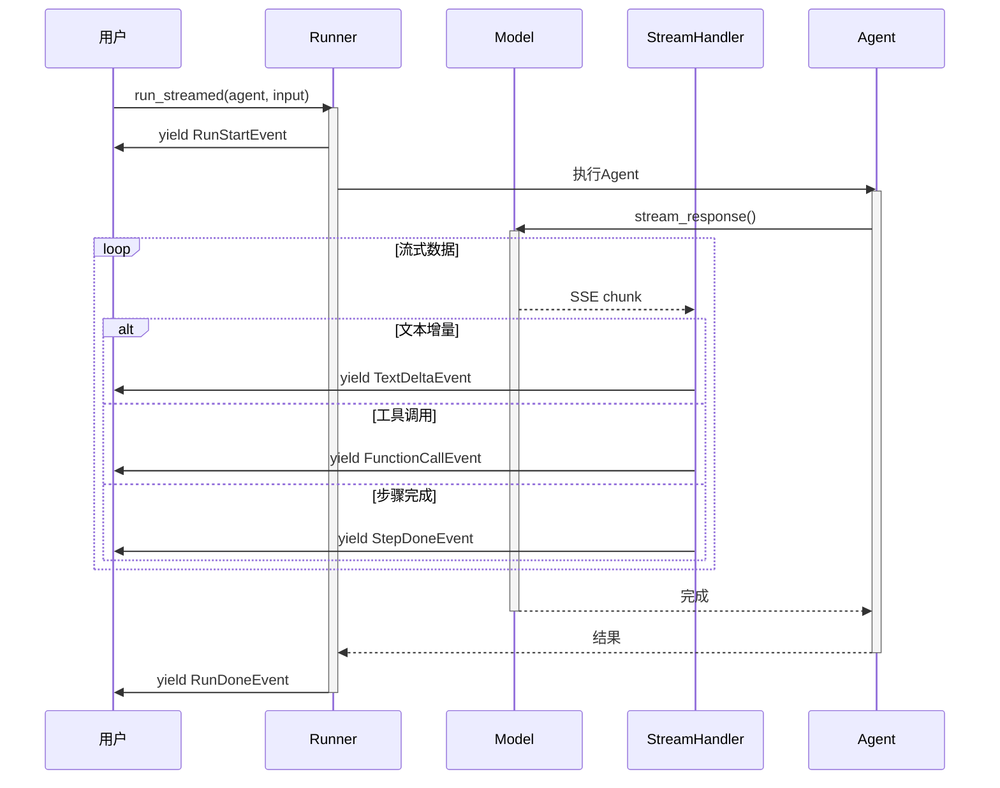
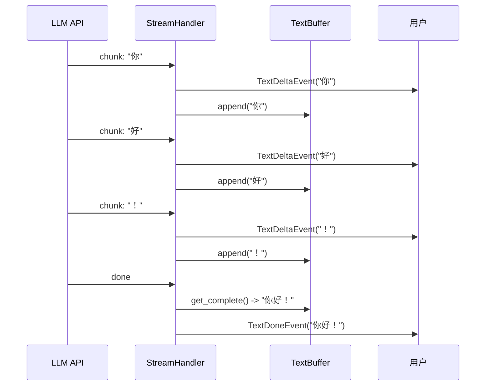
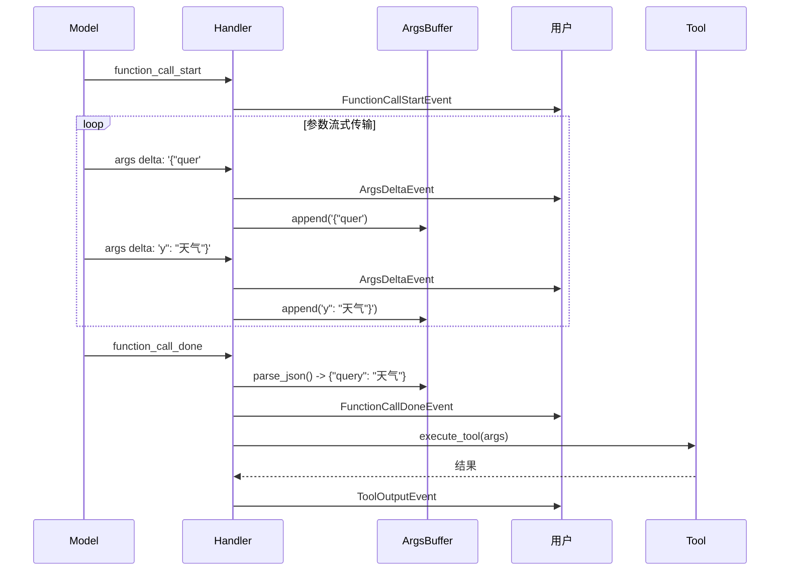
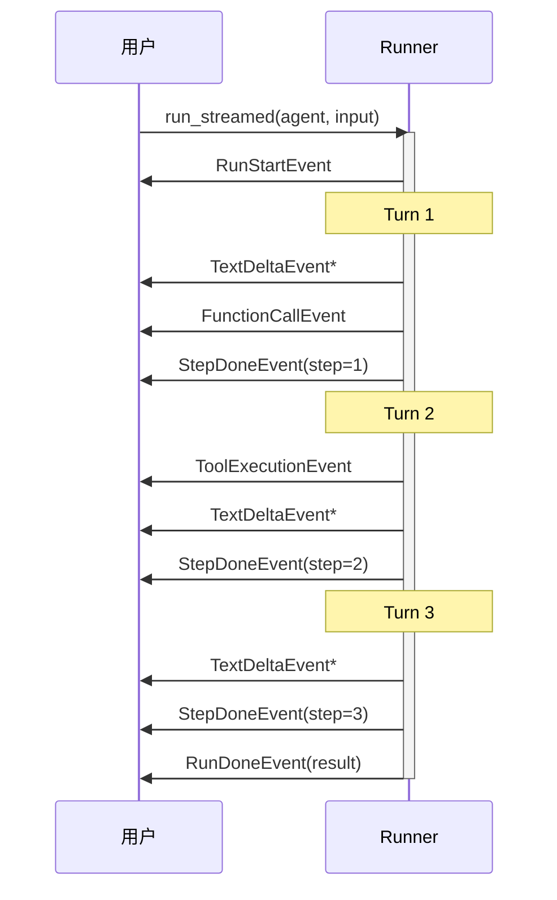
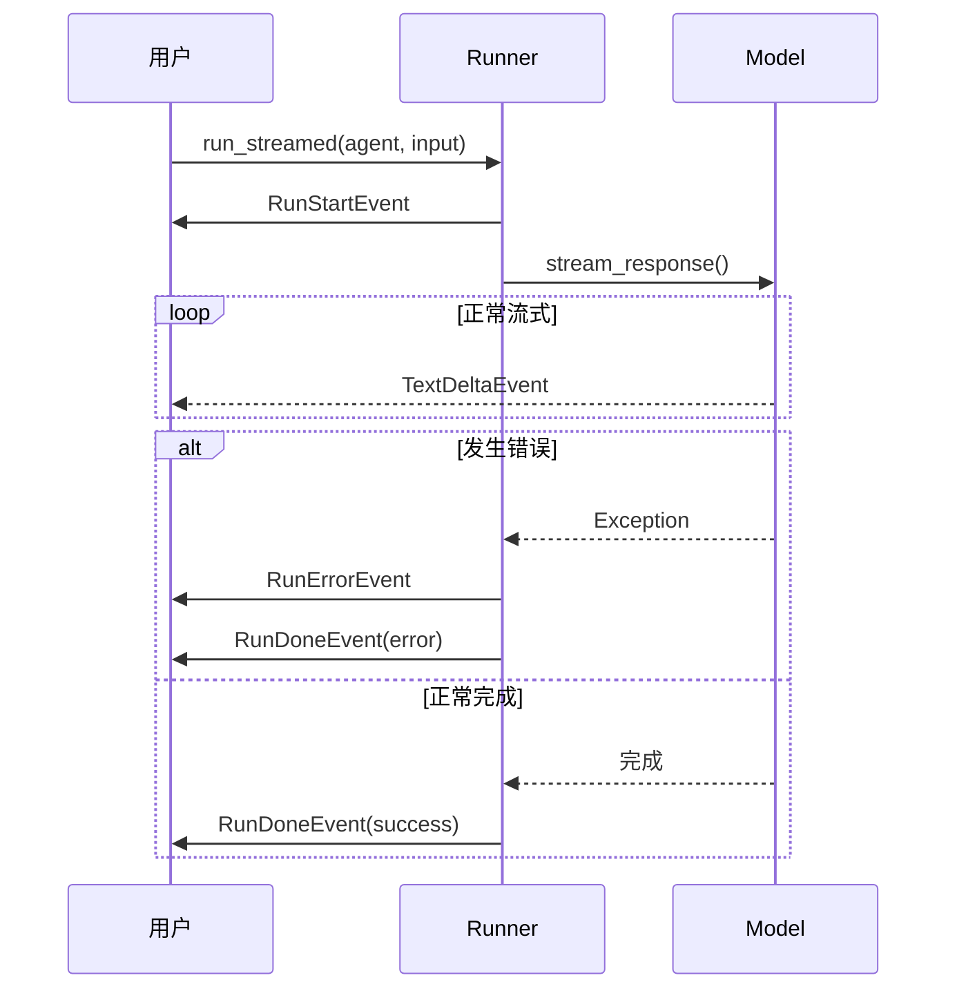
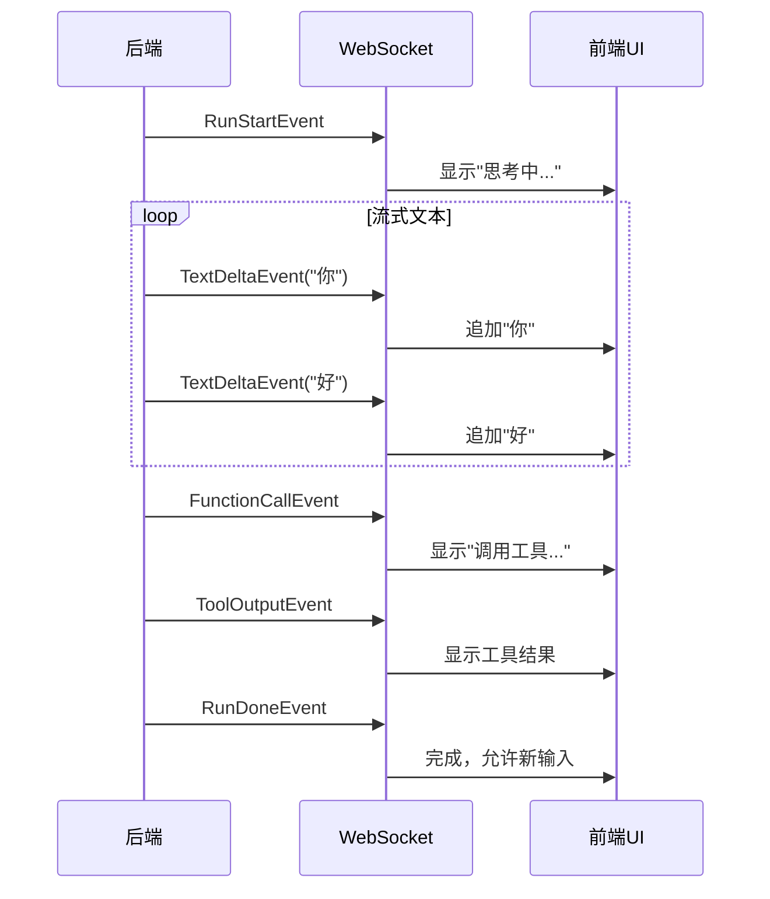

# OpenAI Agents Python SDK - Streaming 模块时序图详解

## 1. 流式执行完整时序图

```mermaid
sequenceDiagram
    participant U as 用户
    participant R as Runner
    participant M as Model
    participant S as StreamHandler
    participant A as Agent
    
    U->>R: run_streamed(agent, input)
    activate R
    
    R->>U: yield RunStartEvent
    
    R->>A: 执行Agent
    activate A
    A->>M: stream_response()
    activate M
    
    loop 流式数据
        M-->>S: SSE chunk
        
        alt 文本增量
            S->>U: yield TextDeltaEvent
        else 工具调用
            S->>U: yield FunctionCallEvent
        else 步骤完成
            S->>U: yield StepDoneEvent
        end
    end
    
    M-->>A: 完成
    deactivate M
    A-->>R: 结果
    deactivate A
    
    R->>U: yield RunDoneEvent
    deactivate R
```

## 2. 文本流式处理

```mermaid
sequenceDiagram
    participant API as LLM API
    participant H as StreamHandler
    participant B as TextBuffer
    participant U as 用户
    
    API->>H: chunk: "你"
    H->>U: TextDeltaEvent("你")
    H->>B: append("你")
    
    API->>H: chunk: "好"
    H->>U: TextDeltaEvent("好")
    H->>B: append("好")
    
    API->>H: chunk: "！"
    H->>U: TextDeltaEvent("！")
    H->>B: append("！")
    
    API->>H: done
    H->>B: get_complete() -> "你好！"
    H->>U: TextDoneEvent("你好！")
```

## 3. 工具调用流式处理

```mermaid
sequenceDiagram
    participant M as Model
    participant H as Handler
    participant B as ArgsBuffer
    participant U as 用户
    participant T as Tool
    
    M->>H: function_call_start
    H->>U: FunctionCallStartEvent
    
    loop 参数流式传输
        M->>H: args delta: '{"quer'
        H->>U: ArgsDeltaEvent
        H->>B: append('{"quer')
        
        M->>H: args delta: 'y": "天气"}'
        H->>U: ArgsDeltaEvent
        H->>B: append('y": "天气"}')
    end
    
    M->>H: function_call_done
    H->>B: parse_json() -> {"query": "天气"}
    H->>U: FunctionCallDoneEvent
    
    H->>T: execute_tool(args)
    T-->>H: 结果
    H->>U: ToolOutputEvent
```

## 4. 多步骤流式执行

```mermaid
sequenceDiagram
    participant U as 用户
    participant R as Runner
    
    U->>R: run_streamed(agent, input)
    activate R
    
    R->>U: RunStartEvent
    
    Note over R: Turn 1
    R->>U: TextDeltaEvent*
    R->>U: FunctionCallEvent
    R->>U: StepDoneEvent(step=1)
    
    Note over R: Turn 2
    R->>U: ToolExecutionEvent
    R->>U: TextDeltaEvent*
    R->>U: StepDoneEvent(step=2)
    
    Note over R: Turn 3
    R->>U: TextDeltaEvent*
    R->>U: StepDoneEvent(step=3)
    
    R->>U: RunDoneEvent(result)
    deactivate R
```

## 5. 错误处理流

```mermaid
sequenceDiagram
    participant U as 用户
    participant R as Runner
    participant M as Model
    
    U->>R: run_streamed(agent, input)
    R->>U: RunStartEvent
    
    R->>M: stream_response()
    
    loop 正常流式
        M-->>U: TextDeltaEvent
    end
    
    alt 发生错误
        M-->>R: Exception
        R->>U: RunErrorEvent
        R->>U: RunDoneEvent(error)
    else 正常完成
        M-->>R: 完成
        R->>U: RunDoneEvent(success)
    end
```

## 6. 实时UI更新流程

```mermaid
sequenceDiagram
    participant Backend as 后端
    participant WS as WebSocket
    participant UI as 前端UI
    
    Backend->>WS: RunStartEvent
    WS->>UI: 显示"思考中..."
    
    loop 流式文本
        Backend->>WS: TextDeltaEvent("你")
        WS->>UI: 追加"你"
        Backend->>WS: TextDeltaEvent("好")
        WS->>UI: 追加"好"
    end
    
    Backend->>WS: FunctionCallEvent
    WS->>UI: 显示"调用工具..."
    
    Backend->>WS: ToolOutputEvent
    WS->>UI: 显示工具结果
    
    Backend->>WS: RunDoneEvent
    WS->>UI: 完成，允许新输入
```

Streaming模块通过精心设计的时序流程，实现了流畅的实时交互体验。

