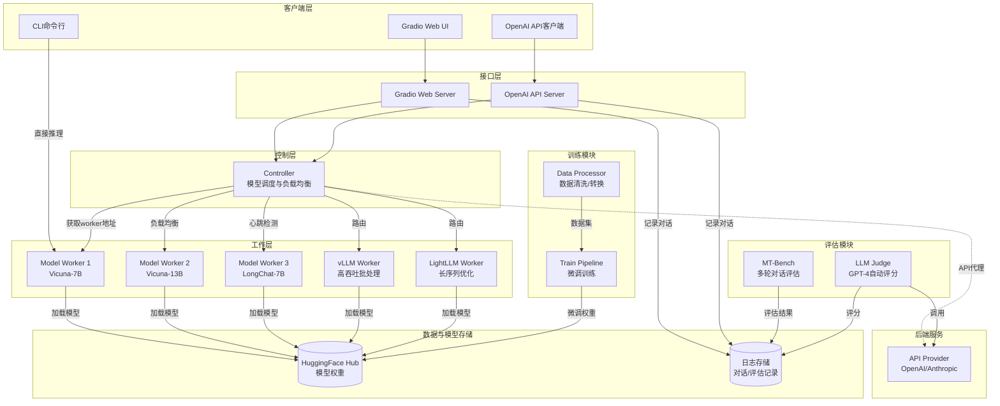
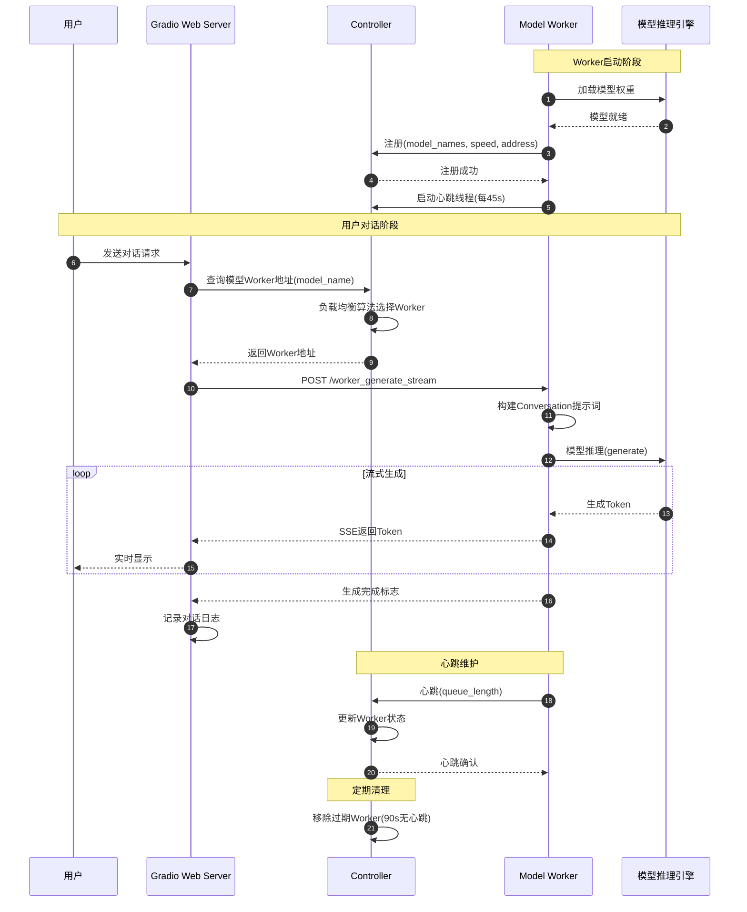

# FastChat-00-总览

## 0. 摘要

### 项目目标与核心能力

FastChat 是一个用于训练、服务和评估大语言模型（LLM）聊天机器人的开放平台。项目边界涵盖：

- **训练能力**：支持基于 Llama、T5 等基座模型的指令微调，支持全量微调与 LoRA 低秩适应
- **服务能力**：提供分布式多模型服务系统，包含 Controller、Model Worker、OpenAI 兼容 API、Web UI
- **评估能力**：实现 MT-Bench 评估框架，支持 GPT-4 作为评判模型进行自动化质量评估
- **数据能力**：提供对话数据清洗、格式转换、统计分析等工具链

**非目标**：
- 不提供基座模型预训练能力（依赖 HuggingFace Transformers）
- 不提供嵌入式端侧部署（主要面向服务器/云端场景）
- 不包含专门的强化学习训练流程（RLHF）

### 运行环境与部署形态

**语言与运行时**：
- Python 3.8+
- PyTorch 作为深度学习框架
- FastAPI + Uvicorn 作为异步 Web 服务框架
- Gradio 作为 Web UI 框架

**依赖组件**：
- 核心依赖：transformers, accelerate, peft, sentencepiece
- 可选加速：vLLM, LightLLM, SGLang, ExLlama, GPTQ, AWQ
- 评估依赖：openai, anthropic, ray

**部署形态**：
- **分布式微服务架构**：Controller（协调器）+ 多个 Model Worker（模型工作进程）+ API Server/Web Server（接口层）
- **单机模式**：CLI 命令行交互
- **混合云模式**：本地 Worker + 第三方 API（OpenAI/Anthropic）混合服务

---

## 1. 整体架构图



### 图解与要点

**组件职责**：
- **Controller**：维护所有 Worker 的注册信息、心跳状态、队列长度，根据负载均衡策略（Lottery/Shortest Queue）返回可用 Worker 地址
- **Model Worker**：加载模型权重，处理推理请求，支持流式生成，定期向 Controller 发送心跳
- **OpenAI API Server**：提供 OpenAI 兼容的 RESTful API（/v1/chat/completions, /v1/completions, /v1/embeddings）
- **Gradio Web Server**：提供 Web UI，支持单模型对话、双模型对战（Arena）、多模态对话
- **API Provider**：统一封装第三方 API 调用（OpenAI/Anthropic/Gemini），支持与本地 Worker 混合服务

**数据流**：
1. 用户请求 → 接口层（Gradio/OpenAI API Server）
2. 接口层 → Controller 查询可用 Worker
3. Controller → 根据模型名和负载策略返回 Worker 地址
4. 接口层 → 直接向 Worker 发起推理请求（HTTP POST /worker_generate_stream）
5. Worker → 流式返回生成结果
6. 接口层 → 返回给用户（SSE 流式或完整响应）

**控制流**：
- **心跳机制**：Worker 每 45 秒向 Controller 发送心跳（queue_length 等状态），Controller 90 秒内未收到心跳则移除 Worker
- **注册机制**：Worker 启动时向 Controller 注册（model_names, speed, multimodal 等信息）
- **路由策略**：
  - **Lottery（抽奖）**：按 Worker 速度加权随机选择
  - **Shortest Queue（最短队列）**：选择队列长度/速度比值最小的 Worker

**高可用与扩展性**：
- 无状态 Controller：可水平扩展（通过共享存储或主从复制）
- Worker 动态注册：支持运行时增删 Worker，无需重启 Controller
- 故障隔离：单个 Worker 故障不影响其他 Worker，Controller 自动移除失联 Worker

**跨进程/跨网络路径**：
- Controller ↔ Worker：HTTP 心跳与状态查询
- 接口层 ↔ Controller：HTTP 查询模型列表与 Worker 地址
- 接口层 ↔ Worker：HTTP 流式推理请求（直连，不经过 Controller）

---

## 2. 全局时序图（主要业务闭环）



### 图解与要点

**入口**：用户通过 Web UI、CLI 或 OpenAI API 发起对话请求

**鉴权**：OpenAI API Server 支持可选的 API Key 鉴权（Bearer Token），Gradio Web UI 无鉴权

**幂等性**：
- 对话请求本身**非幂等**（每次推理结果可能不同，受温度参数影响）
- Worker 注册**幂等**（重复注册会更新现有信息）
- 心跳**幂等**（仅更新时间戳和队列长度）

**回退策略**：
- Worker 超时（100s）：Controller 返回超时错误，接口层返回 `CONTROLLER_WORKER_TIMEOUT`
- 无可用 Worker：Controller 返回 `CONTROLLER_NO_WORKER`
- 模型生成异常：Worker 返回错误响应（带 error_code），接口层透传给用户

**重试点**：
- 客户端可自行重试（建议指数退避）
- 系统内部无自动重试机制

**超时设定**：
- Worker 推理请求：100 秒（`WORKER_API_TIMEOUT`）
- Controller 查询 Worker 状态：5 秒
- 长时间推理任务（如长序列生成）可能触发超时，需调整参数

**资源上界**：
- Worker 并发限制：通过 `limit_worker_concurrency` 控制（默认 5），超出限制则排队
- 模型上下文长度：取决于模型配置（如 Vicuna-7B 为 4096，LongChat-7B 为 32K）
- 内存占用：单个 7B 模型约需 14GB GPU 显存（FP16）

---

## 3. 模块边界与交互矩阵

### 模块清单

| 模块名 | 路径 | 职责 | 对外API |
|---|---|---|---|
| **serve.controller** | `fastchat/serve/controller.py` | 协调分布式 Worker，提供负载均衡 | `/register_worker`, `/list_models`, `/get_worker_address` |
| **serve.model_worker** | `fastchat/serve/model_worker.py` | 加载模型并处理推理请求 | `/worker_generate_stream`, `/worker_get_status`, `/worker_get_embeddings` |
| **serve.openai_api_server** | `fastchat/serve/openai_api_server.py` | 提供 OpenAI 兼容 RESTful API | `/v1/chat/completions`, `/v1/completions`, `/v1/embeddings`, `/v1/models` |
| **serve.gradio_web_server** | `fastchat/serve/gradio_web_server.py` | 提供 Gradio Web UI | Gradio 界面（无 RESTful API） |
| **serve.api_provider** | `fastchat/serve/api_provider.py` | 统一封装第三方 API 调用 | 内部模块，无对外 API |
| **model.model_adapter** | `fastchat/model/model_adapter.py` | 模型加载与适配器注册 | `load_model()`, `get_conversation_template()` |
| **conversation** | `fastchat/conversation.py` | 对话模板管理 | `Conversation.get_prompt()`, `get_conv_template()` |
| **train** | `fastchat/train/train.py` | 模型微调训练 | CLI 入口（无 API） |
| **llm_judge** | `fastchat/llm_judge/` | MT-Bench 评估与 LLM 自动评分 | CLI 入口（无 API） |
| **data** | `fastchat/data/` | 数据清洗与格式转换工具 | CLI 工具集（无 API） |
| **protocol** | `fastchat/protocol/` | API 协议定义（Pydantic 模型） | 数据结构定义，无 API |

### 交互矩阵

| 调用方 | 被调方 | 接口 | 同步/异步 | 错误语义 | 一致性要求 |
|---|---|---|---|---|---|
| Gradio Web Server | Controller | `/list_models`, `/get_worker_address` | 同步 HTTP | 超时/无Worker返回错误 | 最终一致（心跳延迟） |
| OpenAI API Server | Controller | `/list_models`, `/get_worker_address` | 异步 HTTP (aiohttp) | 超时/无Worker返回错误 | 最终一致 |
| Gradio/OpenAI Server | Model Worker | `/worker_generate_stream` | 同步/异步 HTTP 流式 | 超时/推理失败返回error_code | 无状态，无一致性要求 |
| Model Worker | Controller | `/register_worker`, `/receive_heart_beat` | 同步 HTTP | 注册失败不影响Worker运行 | 最终一致 |
| Model Worker | model_adapter | `load_model()` | 同步函数调用 | 抛出异常导致Worker启动失败 | 强一致 |
| Model Worker | Conversation | `get_prompt()` | 同步函数调用 | 模板错误导致生成失败 | 强一致 |
| Train | data | 文件读取 | 同步文件IO | 数据格式错误导致训练失败 | 强一致 |
| LLM Judge | API Provider | OpenAI/Anthropic API 调用 | 同步 HTTP | API限流/余额不足返回错误 | 无一致性要求 |

**说明**：
- **最终一致**：如 Worker 心跳延迟，Controller 可能短暂返回过期的 Worker 列表，但随后会自动修正
- **强一致**：如模型加载失败，Worker 无法启动，保证状态一致性
- **无状态**：推理请求之间无依赖，失败不影响后续请求

---

## 4. 关键设计与权衡

### 数据一致性

**一致性模型**：
- **最终一致**：Controller 与 Worker 之间的状态同步（心跳机制，90秒过期窗口）
- **无状态设计**：推理请求无会话状态，每次请求独立处理
- **对话历史**：由客户端维护（Web UI 在前端维护，API 调用方自行管理）

**事务边界**：
- 无分布式事务
- 单个推理请求为原子操作（成功或失败，无部分完成状态）

**锁与并发策略**：
- Worker 并发控制：通过 `asyncio.Semaphore`（异步信号量）限制并发数
- Controller 无锁设计：`worker_info` 字典操作在 Python GIL 保护下（单线程修改）
- 模型推理：单个 Worker 内串行处理（避免显存竞争），多 Worker 并行

### 性能关键路径

**P95 延迟优化点**：
1. **模型加载**：冷启动耗时（7B 模型约 10-30 秒），通过预加载和常驻进程优化
2. **首 Token 延迟**：取决于 prompt 长度与模型大小，关键优化点为 KV Cache 管理
3. **流式生成吞吐**：通过 vLLM/LightLLM 等加速引擎实现批处理与连续批处理

**内存峰值**：
- 7B 模型 FP16：约 14GB GPU 显存
- 13B 模型 FP16：约 28GB GPU 显存
- 量化加速：8bit 量化减半显存，4bit GPTQ/AWQ 可进一步降低

**I/O 热点**：
- **模型加载**：从 HuggingFace Hub 下载（首次）或本地缓存读取
- **日志写入**：对话日志异步写入本地文件（LOGDIR 配置）
- **HTTP 流式传输**：推理结果通过 SSE（Server-Sent Events）流式返回

**可观测性指标**：
- Worker 队列长度（`queue_length`）：反映负载
- Worker 速度（`speed`）：相对权重，用于负载均衡
- 推理耗时：从请求接收到生成完成的总时间
- Token 吞吐量：tokens/秒

### 配置项与可变参数

| 配置项 | 环境变量/参数 | 默认值 | 影响 |
|---|---|---|---|
| Controller心跳过期时间 | `FASTCHAT_CONTROLLER_HEART_BEAT_EXPIRATION` | 90秒 | Worker失联判定阈值 |
| Worker心跳间隔 | `FASTCHAT_WORKER_HEART_BEAT_INTERVAL` | 45秒 | 心跳频率 |
| Worker推理超时 | `FASTCHAT_WORKER_API_TIMEOUT` | 100秒 | 推理请求超时 |
| Worker并发数 | `--limit-worker-concurrency` | 5 | 单Worker最大并发请求 |
| 模型路径 | `--model-path` | 必填 | 加载模型权重 |
| 设备类型 | `--device` | cuda | cuda/cpu/mps/xpu/npu |
| GPU数量 | `--num-gpus` | 1 | 模型并行 |
| 8bit量化 | `--load-8bit` | False | 减半显存占用 |
| 流式间隔 | `--stream-interval` | 2 | 流式返回间隔Token数 |
| 调度策略 | `--dispatch-method` | lottery | lottery/shortest_queue |

---

## 5. 典型使用示例与最佳实践

### 示例 1：最小可运行入口 - 单模型服务

**启动 Controller**：
```bash
python3 -m fastchat.serve.controller
```

**启动 Model Worker**（加载 Vicuna-7B）：
```bash
python3 -m fastchat.serve.model_worker \
    --model-path lmsys/vicuna-7b-v1.5 \
    --controller http://localhost:21001 \
    --worker http://localhost:31000 \
    --host 0.0.0.0 \
    --port 31000
```

**启动 OpenAI API Server**：
```bash
python3 -m fastchat.serve.openai_api_server \
    --controller-address http://localhost:21001 \
    --host 0.0.0.0 \
    --port 8000
```

**测试 API 调用**：
```bash
curl http://localhost:8000/v1/chat/completions \
  -H "Content-Type: application/json" \
  -d '{
    "model": "vicuna-7b-v1.5",
    "messages": [{"role": "user", "content": "Hello!"}]
  }'
```

**要点**：
- Controller 默认监听 21001 端口
- Worker 需指定 controller 地址和自身地址（用于注册和接收请求）
- API Server 通过 Controller 查询可用模型

### 示例 2：多模型混合服务（本地 + 第三方 API）

**配置 API Endpoints**（创建 `api_endpoints.json`）：
```json
{
  "gpt-4": {
    "model_name": "gpt-4",
    "api_base": "https://api.openai.com/v1",
    "api_type": "openai",
    "api_key": "sk-xxxxxxxxxxxxxxxx"
  },
  "claude-3-opus": {
    "model_name": "claude-3-opus-20240229",
    "api_base": "https://api.anthropic.com",
    "api_type": "anthropic",
    "api_key": "sk-ant-xxxxxxxxxxxxxxxx"
  }
}
```

**启动 Gradio Arena**（支持本地模型与 API 模型对战）：
```bash
python3 -m fastchat.serve.controller
python3 -m fastchat.serve.model_worker --model-path lmsys/vicuna-7b-v1.5
python3 -m fastchat.serve.gradio_web_server_multi \
    --controller http://localhost:21001 \
    --register-api-endpoint-file api_endpoints.json
```

**要点**：
- API 模型无需启动 Worker，通过 API Provider 代理调用
- Gradio 自动发现所有已注册模型（本地 + 第三方）
- Arena 模式支持匿名双模型对战与评分

### 示例 3：规模化部署注意事项

**多 Worker 分布式部署**：
```bash
# Worker 1 在 GPU 0 上运行 Vicuna-7B
CUDA_VISIBLE_DEVICES=0 python3 -m fastchat.serve.model_worker \
    --model-path lmsys/vicuna-7b-v1.5 \
    --controller http://controller-host:21001 \
    --worker http://worker1-host:31000 \
    --port 31000

# Worker 2 在 GPU 1 上运行 Vicuna-13B
CUDA_VISIBLE_DEVICES=1 python3 -m fastchat.serve.model_worker \
    --model-path lmsys/vicuna-13b-v1.5 \
    --controller http://controller-host:21001 \
    --worker http://worker2-host:31001 \
    --port 31001
```

**高吞吐优化（使用 vLLM）**：
```bash
python3 -m fastchat.serve.vllm_worker \
    --model-path lmsys/vicuna-7b-v1.5 \
    --controller http://localhost:21001 \
    --worker http://localhost:31000 \
    --trust-remote-code
```

**负载均衡策略选择**：
- **Lottery（抽奖）**：适合异构 Worker（不同模型/硬件），按速度加权
- **Shortest Queue（最短队列）**：适合同构 Worker，追求最小队列长度

**监控与告警**：
- 监控 Worker 心跳状态：Controller 日志中 `Register done` 和 `Receive heart beat`
- 监控推理延迟：Worker 日志中请求处理时间
- 告警阈值：Worker 失联超过 2 分钟、推理失败率 > 5%

**容量规划**：
- 7B 模型：1 张 A100-40GB 可服务 5-10 并发请求
- 13B 模型：1 张 A100-80GB 可服务 3-5 并发请求
- 长序列场景（>4K tokens）：需更多显存，建议使用 LongChat 或 LightLLM

**安全加固**：
- 启用 OpenAI API Server 的 API Key 鉴权：`--api-keys key1 key2`
- 限制 Worker 访问：通过防火墙规则仅允许 Controller 和 API Server 访问
- 日志脱敏：避免记录敏感信息（如 API Key、用户隐私数据）

---

## 6. 技术栈与依赖关系

### 核心依赖

**Web 框架**：
- FastAPI：异步 RESTful API 框架
- Uvicorn：ASGI 服务器
- Gradio：Web UI 框架

**模型推理**：
- PyTorch：深度学习框架
- Transformers：HuggingFace 模型库
- Accelerate：分布式训练与推理加速
- PEFT：参数高效微调（LoRA）

**可选加速引擎**：
- vLLM：高吞吐批处理推理引擎
- LightLLM：长序列优化推理引擎
- SGLang：结构化生成优化引擎
- ExLlama：Llama 专用加速引擎
- GPTQ/AWQ：4bit 量化推理

**数据处理**：
- Pandas：数据分析
- NumPy：数值计算

**评估与监控**：
- OpenAI Python SDK：调用 GPT-4 评估
- Anthropic Python SDK：调用 Claude 评估
- Ray：分布式任务调度

### 版本兼容性

- Python 3.8+（推荐 3.10）
- PyTorch 1.13+（推荐 2.0+）
- Transformers 4.31+（16K 模型需要）
- CUDA 11.7+（GPU 推理）

---

## 7. 扩展点与插件机制

### 模型适配器扩展

FastChat 通过 `model_adapters` 注册表支持新模型接入：

```python
# fastchat/model/model_adapter.py
class CustomModelAdapter(BaseModelAdapter):
    def match(self, model_path: str):
        return "custom-model" in model_path.lower()
    
    def load_model(self, model_path: str, from_pretrained_kwargs: dict):
        # 自定义加载逻辑
        pass
    
    def get_default_conv_template(self, model_path: str) -> Conversation:
        return get_conv_template("custom")

# 注册适配器
register_model_adapter(CustomModelAdapter)
```

### Worker 类型扩展

支持自定义 Worker 实现（如接入新的推理引擎）：

```python
# 继承 BaseModelWorker
class CustomWorker(BaseModelWorker):
    def generate_stream_gate(self, params):
        # 自定义推理逻辑
        pass
    
    def get_embeddings(self, params):
        # 自定义嵌入逻辑
        pass
```

### API Provider 扩展

支持添加新的第三方 API（如 Gemini、Claude）：

```python
# fastchat/serve/api_provider.py
@app.route("/worker_generate_stream", methods=["POST"])
async def api_provider_generate_stream(request):
    if model in CUSTOM_API_MODELS:
        return await custom_api_generate(request)
```

---

## 8. 已知限制与演进路径

### 当前限制

1. **Controller 单点**：Controller 无主从复制，故障会导致服务不可用
2. **无请求队列持久化**：Worker 重启会丢失队列中的请求
3. **有限的多模态支持**：仅部分模型支持图像输入（LLaVA、Yi-VL）
4. **无自动扩缩容**：需手动启停 Worker，无 Kubernetes 集成

### 演进方向

1. **Controller 高可用**：引入 etcd/Consul 实现分布式协调
2. **请求队列持久化**：接入 Redis/RabbitMQ 实现可靠队列
3. **Kubernetes 原生支持**：提供 Helm Chart 和 Operator
4. **自动扩缩容**：基于队列长度和延迟指标自动调整 Worker 数量
5. **多模态增强**：支持更多视觉模型和语音模型

---

## 9. 文档导航

本项目源码剖析文档组织如下：

- **FastChat-00-总览.md**（当前文档）
- **FastChat-01-serve模块-概览.md**：服务层整体架构
- **FastChat-02-serve模块-Controller.md**：Controller 详细分析
- **FastChat-03-serve模块-ModelWorker.md**：Model Worker 详细分析
- **FastChat-04-serve模块-OpenAI_API.md**：OpenAI API Server 详细分析
- **FastChat-05-serve模块-Gradio界面.md**：Gradio Web UI 详细分析
- **FastChat-06-model模块-概览.md**：模型适配层架构
- **FastChat-07-model模块-模型加载.md**：模型加载与适配器机制
- **FastChat-08-conversation模块.md**：对话模板管理
- **FastChat-09-train模块-概览.md**：训练流程与数据处理
- **FastChat-10-llm_judge模块.md**：评估与自动评分
- **FastChat-11-protocol模块.md**：API 协议定义
- **FastChat-12-使用示例与最佳实践.md**：实战案例与经验总结

---

## 附录：术语表

| 术语 | 说明 |
|---|---|
| **Worker** | 模型工作进程，负责加载模型并处理推理请求 |
| **Controller** | 协调器，管理 Worker 注册与负载均衡 |
| **Conversation** | 对话对象，封装对话历史与提示词模板 |
| **Model Adapter** | 模型适配器，处理不同模型的加载与推理逻辑 |
| **LoRA** | Low-Rank Adaptation，低秩适应，参数高效微调方法 |
| **MT-Bench** | Multi-Turn Benchmark，多轮对话评估基准 |
| **Arena** | 对战模式，用户可匿名对比两个模型的输出 |
| **SSE** | Server-Sent Events，HTTP 流式传输协议 |
| **GPTQ/AWQ** | 4bit 量化方法，降低模型显存占用 |
| **vLLM** | 高吞吐推理引擎，支持 PagedAttention 和连续批处理 |

